# Technical Specification

# 0. Agent Action Plan

## 0.1 Core Feature Objective

Based on the user's request, the Blitzy platform understands that the objective is to create a Node.js tutorial server application with the following requirements:

**Primary Goals:**
- Create a basic Node.js server application serving as a tutorial project
- Implement an initial endpoint that returns the text response "Hello world"
- Integrate the Express.js framework into the project
- Add an additional endpoint that returns the text response "Good evening"

**Feature Category:** New product creation with Express.js framework integration

**Complexity Level:** Basic - This is a tutorial-level implementation suitable for learning Node.js and Express.js fundamentals

**User Requirements Enhanced with Technical Clarity:**
- **Initial Server Setup**: Establish a Node.js HTTP server foundation capable of handling HTTP requests
- **Express.js Integration**: Introduce <cite index="12-1">Express.js, a fast, unopinionated, minimalist web framework</cite> to simplify routing and middleware management
- **Endpoint Implementation #1**: Create a GET endpoint (suggested route: `/` or `/hello`) responding with plain text "Hello world"
- **Endpoint Implementation #2**: Create a GET endpoint (suggested route: `/evening` or `/good-evening`) responding with plain text "Good evening"

**Implicit Requirements Surfaced:**
- **Project Initialization**: Create package.json with proper Node.js project metadata
- **Dependency Management**: Configure npm to manage Express.js as a project dependency
- **Server Configuration**: Establish proper server initialization, port binding, and startup procedures
- **Error Handling**: Implement basic error handling for the server lifecycle
- **Documentation**: Provide clear README instructions for running the tutorial server
- **Code Organization**: Structure code following Node.js and Express.js best practices
- **Backward Compatibility**: Ensure <cite index="1-3,1-4">compatibility with Node.js 18+ as required by Express 5</cite>

**Success Criteria:**
- Server starts successfully on a specified port
- HTTP GET request to the first endpoint returns "Hello world"
- HTTP GET request to the second endpoint returns "Good evening"
- Application can be started with a simple npm command
- Code is clean, well-structured, and suitable for tutorial purposes

## 0.2 Special Instructions and Constraints

**User-Provided Requirements:**

User Example (Exact Quote): 
> "add feature to a existing product this is a tutorial of node js server hosting one endpoint that returns the response 'Hello world'. Could you add expressjs into the project and add another endpoint that return the reponse of 'Good evening'?"

**Interpreted Constraints:**

**Tutorial-Focused Approach:**
- Code must be simple, readable, and educational
- Avoid over-engineering or complex patterns
- Include inline comments explaining key concepts
- Follow conventional Express.js patterns for beginners

**Minimal Complexity:**
- Keep the implementation straightforward without unnecessary abstractions
- Use vanilla Express.js features without additional middleware unless essential
- Maintain flat file structure appropriate for a tutorial

**Framework Requirements:**
- Must use Express.js framework (not vanilla Node.js http module for the main implementation)
- <cite index="12-2,11-1">Use Express.js 5.1.0 as the current latest stable version</cite>
- Ensure <cite index="1-3,1-4">Node.js 18+ compatibility as required by Express 5</cite>

**Change Scope Preference:** Minimal
- Create only the files necessary for a functional Express.js server
- Implement exactly two endpoints as specified
- No additional features beyond the stated requirements
- No testing framework setup (can be added later if needed)

**No Breaking Changes:**
- Since this is a new project, there are no existing APIs to maintain
- Fresh start allows for current best practices

**Technology Stack Decisions:**
- Node.js v20.19.5 (already installed and compatible)
- Express.js 5.1.0 (latest stable version)
- ES6+ JavaScript syntax (modern Node.js standard)
- CommonJS module system initially (can be upgraded to ESM if desired)

**Excluded from Scope:**
- Database integration
- Authentication or authorization
- Complex middleware chains
- Production deployment configuration
- Testing frameworks
- Logging libraries
- Environmental configuration beyond basic setup
- Docker containerization
- CI/CD pipelines

## 0.3 Technical Interpretation

**Technical Translation of Requirements:**

Based on the user's request, this feature addition translates to the following technical implementation strategy:

**Phase 1: Project Foundation**
- Initialize a new Node.js project with `npm init` to create package.json
- Configure project metadata (name, version, description, entry point, scripts)
- Set up proper project structure for a tutorial application

**Phase 2: Express.js Integration**
- To add Express.js framework support, we will install Express as a production dependency
- Import and initialize Express application instance
- Configure Express app to listen on a designated port (e.g., 3000)

**Phase 3: Endpoint Implementation**
- To implement the "Hello world" endpoint, we will create a GET route handler at the root path `/` that sends plain text response "Hello world"
- To implement the "Good evening" endpoint, we will create a GET route handler at path `/evening` that sends plain text response "Good evening"

**Technical Approach Mapping:**

| User Requirement | Technical Implementation | File/Component |
|-----------------|--------------------------|----------------|
| "Node js server hosting one endpoint" | Create Express app with server initialization | server.js or index.js |
| "returns the response 'Hello world'" | Define GET route: `app.get('/', (req, res) => res.send('Hello world'))` | Main server file |
| "add expressjs into the project" | Execute `npm install express`, import with `const express = require('express')` | package.json, server file |
| "another endpoint that return the reponse of 'Good evening'" | Define GET route: `app.get('/evening', (req, res) => res.send('Good evening'))` | Main server file |

**Implementation Workflow:**

1. **CREATE** package.json with npm initialization
   - Purpose: Establish Node.js project structure
   - Content: Project metadata, scripts, and dependency declarations
   
2. **INSTALL** Express.js dependency
   - Command: `npm install express`
   - Result: Adds Express to dependencies in package.json and creates node_modules

3. **CREATE** main server file (server.js or index.js)
   - Purpose: Application entry point
   - Components:
     - Express import and initialization
     - Route handler for "/" returning "Hello world"
     - Route handler for "/evening" returning "Good evening"
     - Server startup logic with port binding

4. **UPDATE** README.md
   - Purpose: Provide clear instructions for running the tutorial
   - Content: Installation steps, running instructions, endpoint documentation

**User Understanding Level Assessment:** Beginner to Intermediate
- User understands basic concepts (endpoints, responses, Express framework)
- May be learning Node.js and Express.js fundamentals
- Requires clear, educational code structure
- Benefits from explicit naming and documentation

**Technical Requirements Validation:**
- Node.js Environment: ✓ v20.19.5 installed (exceeds Express 5 requirement of Node 18+)
- Package Manager: ✓ npm 10.8.2 available
- Framework Compatibility: ✓ Express 5.1.0 fully compatible with Node 20
- Runtime Requirements: ✓ All dependencies met

## 0.4 Repository Analysis and Current State

**Current Repository Structure:**

```
/
├── .git/                 # Git version control directory
└── README.md            # Repository title file (content: "# 6nove_3")
```

**Existing Files Analysis:**

**README.md**
- Current State: Contains only a single markdown heading: `# 6nove_3`
- Purpose: Repository title and documentation placeholder
- Lines: 1
- Dependencies: None
- Integration Points: None
- Status: Minimal placeholder, requires enhancement with tutorial documentation

**Missing Critical Components:**

**No package.json**
- Impact: No Node.js project structure exists
- Required: Must be created to define project metadata and manage dependencies
- Contents needed: name, version, description, main entry point, scripts, Express.js dependency

**No Server Implementation**
- Impact: No application code exists to implement the requested endpoints
- Required: Main server file (server.js or index.js) with Express.js application
- Functionality needed: Express initialization, route handlers, server startup

**No node_modules Directory**
- Impact: No dependencies installed
- Required: Will be created automatically when npm install is run
- Contains: Express.js and its transitive dependencies

**No package-lock.json**
- Impact: No dependency tree lock file
- Generated: Automatically created on first npm install
- Purpose: Ensures consistent dependency versions across installations

**Project Initialization Status:**

| Component | Current State | Required State | Action Needed |
|-----------|---------------|----------------|---------------|
| package.json | Missing | Must exist | CREATE with npm init |
| Main server file | Missing | Must exist | CREATE server.js with Express app |
| Express.js dependency | Not installed | Must be installed | INSTALL via npm |
| node_modules/ | Not present | Must exist | Generated by npm install |
| README.md | Minimal (1 line) | Should be comprehensive | UPDATE with tutorial instructions |
| .gitignore | Missing | Recommended | CREATE to exclude node_modules |

**Environment Configuration:**

**Node.js Runtime:**
- Installed Version: v20.19.5
- Required Version: ≥18.0.0 (for Express 5)
- Status: ✓ Compatible and exceeds requirements

**npm Package Manager:**
- Installed Version: 10.8.2
- Status: ✓ Current and functional

**System Readiness:**
- Development Environment: ✓ Ready
- Runtime Dependencies: ✓ Satisfied
- Required Tools: ✓ All present

**Repository State Classification:** Empty Foundation
- Type: New project initialization
- Complexity: Minimal - No legacy code to refactor
- Risk Level: Low - Fresh start with no breaking changes possible
- Migration Needs: None - No existing implementation to migrate

**Impact Assessment:**
- **Existing Functionality**: None to preserve
- **Breaking Changes**: Not applicable (no existing API)
- **Backward Compatibility**: Not a concern for new project
- **Migration Path**: Not required

**Search Patterns Employed:**
```bash
# Root directory analysis
ls -la /

#### Git repository confirmation
find . -name ".git" -type d

## Node.js configuration files search
find . -name "package.json" -o -name "package-lock.json" -o -name ".nvmrc"

#### JavaScript/Node files search
find . -name "*.js" -o -name "*.mjs" -o -name "*.cjs"

#### Documentation files
find . -name "README*" -o -name "*.md"
```

**Discovery Summary:**
- Total files found: 1 (README.md)
- Total directories: 1 (.git)
- Source code files: 0
- Configuration files: 0
- Dependency files: 0

This is a greenfield project requiring complete initial setup of a Node.js Express.js application from scratch.

## 0.5 Feature Design Strategy

**Design Principles:**

**Simplicity First:**
- Use minimal code to achieve the tutorial objectives
- Avoid unnecessary abstractions or complex patterns
- Keep all code in a single file initially (appropriate for tutorial scope)
- Follow the KISS principle (Keep It Simple, Stupid)

**Educational Value:**
- Code should be self-explanatory with clear variable and function names
- Include helpful comments explaining Express.js concepts
- Structure code in a logical, top-to-bottom flow
- Demonstrate Express.js best practices for beginners

**Modern JavaScript Standards:**
- Use ES6+ syntax where appropriate (const, arrow functions, template literals)
- Follow Node.js and Express.js community conventions
- Adopt current best practices from <cite index="12-1">Express.js as a fast, unopinionated, minimalist web framework</cite>

**Implementation Strategy:**

### 0.5.1 Project Initialization Approach

**Package.json Configuration:**
```json
{
  "name": "nodejs-express-tutorial",
  "version": "1.0.0",
  "description": "A tutorial Node.js server with Express.js hosting two endpoints",
  "main": "server.js",
  "scripts": {
    "start": "node server.js"
  },
  "keywords": ["nodejs", "express", "tutorial", "server"],
  "author": "",
  "license": "MIT",
  "dependencies": {
    "express": "^5.1.0"
  }
}
```

**Design Rationale:**
- Entry point: `server.js` (clear, conventional name)
- Start script: Simple `node server.js` command
- Express version: ^5.1.0 (latest stable with caret for patch updates)
- License: MIT (permissive, standard for tutorials)

### 0.5.2 Server Implementation Architecture

**Express Application Structure:**

```javascript
// 1. Import Express framework
const express = require('express');

// 2. Initialize Express application
const app = express();

// 3. Define port configuration
const PORT = process.env.PORT || 3000;

// 4. Route Handlers
app.get('/', (req, res) => {
  res.send('Hello world');
});

app.get('/evening', (req, res) => {
  res.send('Good evening');
});

// 5. Server Startup
app.listen(PORT, () => {
  console.log(`Server running on http://localhost:${PORT}`);
});
```

**Design Decisions Explained:**

**Port Configuration:**
- Default: 3000 (standard Express convention)
- Environment Variable Support: `process.env.PORT` for deployment flexibility
- Fallback Logic: `||` operator provides sensible default

**Route Design:**
- First Endpoint: `/` (root path) → "Hello world"
  - Rationale: Root path is intuitive for initial endpoint
  - RESTful: GET method for data retrieval
  
- Second Endpoint: `/evening` → "Good evening"
  - Rationale: Descriptive path matching the response content
  - Alternative: `/good-evening` (with hyphen) equally valid
  - RESTful: GET method consistent with read operation

**Response Method:**
- Using `res.send()` for plain text responses
- Express automatically sets Content-Type based on response
- Simple and appropriate for tutorial purposes

**Error Handling:**
- Basic: Express default error handler sufficient for tutorial
- Server errors logged to console automatically
- 404 handling: Express default (returns "Cannot GET /path")

### 0.5.3 Project Configuration Files

**.gitignore Creation:**
```
node_modules/
npm-debug.log
.env
.DS_Store
```

**Purpose:**
- Exclude dependencies from version control
- Prevent log files from being committed
- Protect environment variables
- OS-specific file exclusion

**README.md Enhancement Strategy:**

Structure:
- Project Title and Description
- Features/Endpoints
- Prerequisites (Node.js version)
- Installation Instructions
- Running the Server
- Testing the Endpoints
- Endpoint Documentation

### 0.5.4 Dependency Management

**Express.js Version Selection:**
- Version: 5.1.0 (latest stable)
- Installation: `npm install express`
- Dependency Type: Production dependency
- Version Strategy: Caret (^) allows patch and minor updates

**Transitive Dependencies:**
Express.js brings the following core dependencies:
- body-parser (for request body parsing)
- cookie-parser integration
- Various utility libraries

All managed automatically by npm.

### 0.5.5 Development Workflow

**Setup Commands:**
```bash
npm init -y                    # Initialize package.json
npm install express            # Install Express.js
node server.js                 # Run the server
```

**Testing Approach:**
Manual testing via:
- Web browser: Navigate to http://localhost:3000 and http://localhost:3000/evening
- cURL: `curl http://localhost:3000` and `curl http://localhost:3000/evening`
- Postman or similar API testing tools

**Deployment Considerations:**
- Can be deployed to any Node.js hosting platform
- Environment variable PORT support enables PaaS deployment
- No build step required (direct Node.js execution)

### 0.5.6 Alternative Considerations

**Why Not Pure Node.js HTTP Module?**
- User specifically requested Express.js integration
- Express provides cleaner routing syntax
- Better for tutorial demonstrating modern web framework usage
- Industry-standard choice for Node.js web applications

**Why Single File vs. Multiple Files?**
- Tutorial scope: Two simple endpoints don't justify file separation
- Easier to understand: All code visible in one place
- Follows Express.js "Hello World" example patterns
- Can be easily extended later if needed

**Module System Choice:**
- CommonJS (require/module.exports) selected for:
  - Universal Node.js compatibility
  - Simpler for beginners
  - No package.json "type": "module" configuration needed
  - Consistent with most Express.js tutorials

## 0.6 File Transformation Mapping

**Comprehensive File-by-File Implementation Plan:**

### 0.6.1 File Transformation Table

| Target File | Transformation | Source/Reference | Implementation Details |
|------------|----------------|------------------|------------------------|
| package.json | CREATE | npm init | Initialize Node.js project with Express.js dependency, define scripts and metadata |
| server.js | CREATE | New implementation | Main application file with Express app, two route handlers, and server startup logic |
| .gitignore | CREATE | Node.js standard patterns | Exclude node_modules/, logs, and environment files from version control |
| README.md | UPDATE | README.md | Enhance from single-line title to comprehensive tutorial documentation with setup and usage instructions |
| package-lock.json | CREATE | npm install (auto-generated) | Dependency lock file generated automatically by npm when installing Express.js |
| node_modules/ | CREATE | npm install (auto-generated) | Dependencies directory containing Express.js and its transitive dependencies |

### 0.6.2 Detailed File Specifications

**package.json - CREATE**

Location: `/package.json`

Purpose: Node.js project manifest defining dependencies, scripts, and metadata

Content Specifications:
```json
{
  "name": "nodejs-express-tutorial",
  "version": "1.0.0",
  "description": "A tutorial Node.js server with Express.js hosting two endpoints",
  "main": "server.js",
  "scripts": {
    "start": "node server.js",
    "dev": "node server.js"
  },
  "keywords": [
    "nodejs",
    "express",
    "tutorial",
    "server",
    "rest-api"
  ],
  "author": "",
  "license": "MIT",
  "dependencies": {
    "express": "^5.1.0"
  },
  "engines": {
    "node": ">=18.0.0"
  }
}
```

Key Elements:
- name: Descriptive project identifier
- version: Semantic versioning starting at 1.0.0
- main: Entry point set to server.js
- scripts.start: Primary command to launch the server
- dependencies: Express.js 5.1.0 with caret for compatible updates
- engines: Explicit Node.js version requirement

Creation Method: 
```bash
npm init -y
# Then manually edit to add Express dependency
# Or: npm init && npm install express
```

**server.js - CREATE**

Location: `/server.js`

Purpose: Main application file implementing Express server with two endpoints

Complete Implementation:
```javascript
// Import the Express.js framework
const express = require('express');

// Initialize Express application
const app = express();

// Configure server port (use environment variable or default to 3000)
const PORT = process.env.PORT || 3000;

// Endpoint 1: Root path returning "Hello world"
app.get('/', (req, res) => {
  res.send('Hello world');
});

// Endpoint 2: Evening greeting path returning "Good evening"
app.get('/evening', (req, res) => {
  res.send('Good evening');
});

// Start the server and listen on the specified port
app.listen(PORT, () => {
  console.log(`Server is running on http://localhost:${PORT}`);
  console.log(`Try these endpoints:`);
  console.log(`  - http://localhost:${PORT}/ (returns "Hello world")`);
  console.log(`  - http://localhost:${PORT}/evening (returns "Good evening")`);
});
```

Code Structure:
- Lines 1-2: Express framework import
- Lines 4-5: Express app initialization
- Lines 7-8: Port configuration with environment variable support
- Lines 10-13: First route handler for "Hello world"
- Lines 15-18: Second route handler for "Good evening"
- Lines 20-26: Server startup with informative console output

Technical Details:
- Module system: CommonJS (require/module.exports)
- Express methods used: `express()`, `app.get()`, `app.listen()`
- HTTP method: GET for both endpoints
- Response type: Plain text (Express auto-detects)
- Error handling: Relies on Express defaults

**.gitignore - CREATE**

Location: `/.gitignore`

Purpose: Specify intentionally untracked files to ignore in Git version control

Content:
```
# Dependencies
node_modules/

#### Logs
npm-debug.log*
yarn-debug.log*
yarn-error.log*

#### Environment variables
.env
.env.local
.env.*.local

#### OS files
.DS_Store
Thumbs.db

#### IDE
.vscode/
.idea/
*.swp
*.swo
*~

#### Optional npm cache directory
.npm

#### Optional eslint cache
.eslintcache
```

Rationale:
- node_modules/ is large and reconstructible from package.json
- Log files are temporary and machine-specific
- Environment files may contain secrets
- OS and IDE files are user-specific

**README.md - UPDATE**

Location: `/README.md`

Current State: Single line `# 6nove_3`

New Content:
```
# Node.js Express Tutorial Server

A simple tutorial project demonstrating a Node.js server using Express.js with two endpoints.

#### Features

- Express.js web framework integration
- Two REST API endpoints:
  - GET `/` - Returns "Hello world"
  - GET `/evening` - Returns "Good evening"

#### Prerequisites

- Node.js 18.0.0 or higher
- npm (comes with Node.js)

#### Installation

1. Clone this repository
2. Navigate to the project directory
3. Install dependencies:

```bash
npm install
```

#### Running the Server

Start the server with:

```bash
npm start
```

The server will start on port 3000 by default. You should see:
```
Server is running on http://localhost:3000
Try these endpoints:
  - http://localhost:3000/ (returns "Hello world")
  - http://localhost:3000/evening (returns "Good evening")
```

To use a different port, set the PORT environment variable:

```bash
PORT=8080 npm start
```

#### Testing the Endpoints

#### Using a Web Browser

- Open http://localhost:3000 to see "Hello world"
- Open http://localhost:3000/evening to see "Good evening"

#### Using cURL

```bash
curl http://localhost:3000
# Returns: Hello world

curl http://localhost:3000/evening
# Returns: Good evening
```

#### Using Postman or Thunder Client

- Create a GET request to http://localhost:3000
- Create a GET request to http://localhost:3000/evening

#### Project Structure

```
.
├── server.js          # Main application file with Express server
├── package.json       # Project configuration and dependencies
├── package-lock.json  # Dependency lock file
├── .gitignore        # Git ignore rules
└── README.md         # This file
```

#### Technologies Used

- **Node.js** v20+ - JavaScript runtime
- **Express.js** v5.1.0 - Web application framework

#### License

MIT
```

Enhancement Strategy:
- Replace single line with comprehensive tutorial documentation
- Add clear installation and running instructions
- Document both endpoints with examples
- Provide multiple testing methods (browser, cURL, API tools)
- Include project structure overview
- Maintain tutorial-friendly tone

### 0.6.3 Auto-Generated Files

**package-lock.json - AUTO-GENERATED**

Location: `/package-lock.json`

Generation: Automatically created by npm when installing dependencies

Purpose: Lock dependency versions for reproducible installations

Size: ~50-200 KB (depends on Express.js dependency tree)

Management: 
- Should be committed to version control
- Updated automatically on npm install/update
- No manual editing required

**node_modules/ - AUTO-GENERATED**

Location: `/node_modules/`

Generation: Automatically created by npm install

Contents:
- express/ - Main Express.js framework
- All transitive dependencies (body-parser, cookie, etc.)
- Approximately 50-60 packages

Size: ~5-10 MB total

Management:
- Excluded from Git via .gitignore
- Reconstructed from package-lock.json
- Never manually modified

### 0.6.4 Files Explicitly Not Created

The following files are intentionally excluded from this minimal tutorial implementation:

- **No test files** (test/, *.test.js, *.spec.js)
  - Reason: Beyond tutorial scope
  - Can be added later if needed

- **No environment files** (.env, .env.example)
  - Reason: No secrets or extensive configuration needed
  - PORT handled via inline default

- **No configuration files** (config/, .eslintrc, .prettierrc)
  - Reason: Tutorial simplicity
  - No linting or code formatting enforced

- **No Docker files** (Dockerfile, docker-compose.yml)
  - Reason: Not required for local tutorial
  - Can be added for production deployment

- **No CI/CD configuration** (.github/workflows/, .gitlab-ci.yml)
  - Reason: Tutorial project, not production application
  - Not necessary for learning objectives

- **No additional middleware files**
  - Reason: Two simple endpoints don't require separate middleware
  - Express defaults sufficient

- **No route modules** (routes/, controllers/)
  - Reason: Single file appropriate for tutorial scale
  - Code organization not needed for two routes

### 0.6.5 File Creation Sequence

**Recommended Implementation Order:**

1. **package.json** - Establish project foundation
2. **.gitignore** - Set up version control exclusions
3. **server.js** - Implement core application logic
4. **Install dependencies** - Run `npm install express`
5. **README.md** - Update with comprehensive documentation
6. **Test** - Verify server starts and endpoints respond correctly
7. **Commit** - Save all changes to version control

This sequence ensures each step builds logically on the previous one.

## 0.7 Dependency Inventory

### 0.7.1 Direct Dependencies

**Production Dependencies:**

| Package Name | Version | Registry | Purpose | Installation Command |
|-------------|---------|----------|---------|---------------------|
| express | ^5.1.0 | npm | Web application framework for Node.js providing routing, middleware, and HTTP utilities | `npm install express` |

**Version Strategy:**
- Caret (^) notation: Allows compatible updates (^5.1.0 means >=5.1.0 <6.0.0)
- Rationale: Enables automatic patch and minor version updates while preventing breaking changes
- <cite index="11-1">Express 5.1.0 is the latest stable version and default on npm</cite>

**Development Dependencies:**
- None required for this tutorial implementation
- Can be added later: nodemon (auto-restart), eslint (linting), jest (testing)

### 0.7.2 Transitive Dependencies

Express.js includes these key transitive dependencies (automatically installed):

| Package | Purpose | Express Integration |
|---------|---------|-------------------|
| body-parser | Parse incoming request bodies | Integrated into Express 5 core |
| cookie-parser | Parse Cookie header | Used for cookie management |
| debug | Small debugging utility | Express internal logging |
| encodeurl | Encode URL to percent-encoded form | URL handling |
| escape-html | Escape string for safe HTML | Response rendering |
| etag | Generate HTTP ETags | Caching headers |
| finalhandler | Final HTTP responder | Error handling |
| fresh | HTTP response freshness testing | Cache validation |
| merge-descriptors | Merge objects using descriptors | Utility function |
| methods | HTTP methods list | Route method definitions |
| on-finished | Execute callback when request closes | Cleanup operations |
| parseurl | Parse URL with caching | Request URL parsing |
| path-to-regexp | Turn path strings into regular expressions | Route matching |
| proxy-addr | Determine address of proxied request | Proxy support |
| qs | Querystring parser | Query parameter parsing |
| range-parser | Parse Range header | Partial content support |
| safe-buffer | Safer Buffer API | Security |
| send | Send file with range support | Static file serving |
| serve-static | Serve static files | Static file middleware |
| setprototypeof | Set prototype of object | Utility function |
| statuses | HTTP status code utilities | Status code handling |
| type-is | Infer content-type | Content negotiation |
| utils-merge | Merge objects | Utility function |
| vary | Vary header manipulation | HTTP headers |

**Total Package Count:** Approximately 50-60 packages including Express and all transitive dependencies

**Dependency Tree Depth:** 3-4 levels deep

**Total Installation Size:** ~5-10 MB

### 0.7.3 Runtime Dependencies

**Node.js Core Modules Used:**

These are built into Node.js and require no installation:

- **http** - HTTP server and client
- **https** - HTTPS server and client
- **net** - Networking utilities
- **stream** - Stream interfaces
- **events** - Event emitter
- **util** - Utility functions
- **path** - File path utilities
- **fs** - File system operations (if serving static files)
- **querystring** - Query string parsing

**Node.js Version Requirement:**
- Minimum: 18.0.0 (Express 5 requirement)
- Recommended: 20.x LTS (current project environment)
- Maximum: Compatible with Node.js 22+ based on <cite index="17-21">Express.js CI testing matrix</cite>

### 0.7.4 Import and Reference Updates

**Primary Import Statement:**

```javascript
const express = require('express');
```

**Import Location:** Line 2 of server.js

**Module System:** CommonJS (require/module.exports)

**Alternative ESM Syntax (if using ES Modules):**
```javascript
import express from 'express';
```

Note: ESM requires `"type": "module"` in package.json

**No Additional Imports Required:**
- Express provides all necessary functionality for the tutorial endpoints
- No middleware imports needed
- No separate route files to import

### 0.7.5 Dependency Installation Process

**Complete Installation Workflow:**

**Step 1: Initialize Project**
```bash
npm init -y
```
- Creates package.json with defaults
- No dependencies yet

**Step 2: Install Express**
```bash
npm install express
```
- Downloads Express.js 5.1.0 and all transitive dependencies
- Creates node_modules/ directory
- Generates package-lock.json
- Updates package.json dependencies section
- Typical installation time: 10-30 seconds

**Step 3: Verify Installation**
```bash
npm list express
# Output: nodejs-express-tutorial@1.0.0
#         └── express@5.1.0

node -e "console.log(require('express'))"
# Output: [Function: createApplication] (confirms Express is loadable)
```

**Alternative: Single Command Installation**
```bash
npm init -y && npm install express
```

### 0.7.6 Dependency Security and Maintenance

**Security Considerations:**

- <cite index="2-1,2-12">Express 5 includes important security fixes including ReDoS attack prevention and CVE-2024-45590 mitigation</cite>
- <cite index="17-23">Core dependencies updated to latest versions for improved security and compatibility</cite>
- All dependencies from trusted sources (npm registry)
- Regular security updates via npm audit

**Security Audit Command:**
```bash
npm audit
```

**Update Strategy:**
```bash
npm update express         # Update to latest compatible version within ^5.x.x
npm outdated              # Check for outdated packages
npm audit fix             # Automatically fix security vulnerabilities
```

**Dependency Monitoring:**
- Check for updates monthly
- Review security advisories at https://expressjs.com/en/security.html
- Monitor GitHub security alerts for Express repository

### 0.7.7 No Breaking Changes Required

**Migration Considerations:** Not Applicable

This is a new project with no existing dependencies to migrate or replace. All dependencies are added fresh.

**Future Compatibility:**
- Express 5.x will receive updates within the major version
- <cite index="11-5,11-13">Express 4 enters maintenance mode, Express 5 is now active</cite>
- No migration planned until Express 6 (future consideration)

### 0.7.8 Optional Dependencies for Future Enhancement

**Not included but can be added later:**

| Package | Purpose | Installation |
|---------|---------|-------------|
| nodemon | Auto-restart server on file changes | `npm install -D nodemon` |
| dotenv | Environment variable management | `npm install dotenv` |
| cors | Enable CORS for API access | `npm install cors` |
| helmet | Security headers middleware | `npm install helmet` |
| morgan | HTTP request logger | `npm install morgan` |
| compression | Response compression | `npm install compression` |

These are intentionally excluded to maintain tutorial simplicity but represent common Express.js middleware for production applications.

## 0.8 Testing and Validation Strategy

### 0.8.1 Manual Testing Approach

For this tutorial-level project, manual testing is appropriate and sufficient. Automated testing frameworks can be added later if the project grows.

**Server Startup Validation:**

**Test 1: Server Initialization**
```bash
npm start
```

Expected Output:
```
Server is running on http://localhost:3000
Try these endpoints:
  - http://localhost:3000/ (returns "Hello world")
  - http://localhost:3000/evening (returns "Good evening")
```

Success Criteria:
- No error messages or stack traces
- Console displays startup message
- Server continues running (doesn't exit immediately)
- Process occupies port 3000

**Test 2: Port Conflict Handling**
```bash
# Start first instance
npm start

#### In another terminal, try to start second instance
npm start
```

Expected Behavior:
- Second instance should fail with port already in use error
- Confirms port binding is working correctly

### 0.8.2 Endpoint Testing Methods

**Method 1: Web Browser Testing**

**Test "Hello world" Endpoint:**
1. Open browser
2. Navigate to http://localhost:3000
3. Expected Result: Page displays "Hello world"

**Test "Good evening" Endpoint:**
1. Open browser
2. Navigate to http://localhost:3000/evening
3. Expected Result: Page displays "Good evening"

**Validation:**
- ✓ Correct text displayed
- ✓ No error messages
- ✓ Page loads quickly (<100ms)
- ✓ Status code 200 (visible in browser dev tools)

**Method 2: cURL Command Line Testing**

**Test "Hello world" Endpoint:**
```bash
curl http://localhost:3000
```
Expected Output:
```
Hello world
```

**Test "Good evening" Endpoint:**
```bash
curl http://localhost:3000/evening
```
Expected Output:
```
Good evening
```

**Verbose Testing with Headers:**
```bash
curl -v http://localhost:3000
```
Expected Headers:
```
< HTTP/1.1 200 OK
< Content-Type: text/html; charset=utf-8
< Content-Length: 11
< ETag: W/"b-Ck1VqNd45QIvq3AZd8XYQLvEhtA"
< Date: ...
< Connection: keep-alive
```

**Method 3: HTTPie (Alternative to cURL)**
```bash
http GET http://localhost:3000
http GET http://localhost:3000/evening
```

**Method 4: Postman/Thunder Client/Insomnia**

Steps:
1. Create new request
2. Set method to GET
3. Set URL to http://localhost:3000
4. Send request
5. Verify response body contains "Hello world"
6. Repeat for http://localhost:3000/evening

### 0.8.3 Comprehensive Test Scenarios

**Test Suite 1: Happy Path Testing**

| Test Case | Endpoint | Method | Expected Response | Expected Status |
|-----------|----------|--------|-------------------|-----------------|
| TC-01 | / | GET | "Hello world" | 200 OK |
| TC-02 | /evening | GET | "Good evening" | 200 OK |

**Test Suite 2: Error Handling**

| Test Case | Endpoint | Method | Expected Response | Expected Status |
|-----------|----------|--------|-------------------|-----------------|
| TC-03 | /nonexistent | GET | Cannot GET /nonexistent | 404 Not Found |
| TC-04 | / | POST | Cannot POST / | 404 Not Found |
| TC-05 | /evening | PUT | Cannot PUT /evening | 404 Not Found |

**Test Commands:**
```bash
# TC-03: Non-existent route
curl http://localhost:3000/nonexistent
# Expected: Cannot GET /nonexistent

#### TC-04: Wrong HTTP method
curl -X POST http://localhost:3000
#### Expected: Cannot POST /

#### TC-05: Wrong HTTP method
curl -X PUT http://localhost:3000/evening
#### Expected: Cannot PUT /evening
```

**Test Suite 3: Edge Cases**

| Test Case | Scenario | Command | Expected Behavior |
|-----------|----------|---------|-------------------|
| TC-06 | Trailing slash | curl http://localhost:3000/ | Same as root (/) |
| TC-07 | Case sensitivity | curl http://localhost:3000/Evening | 404 (routes are case-sensitive) |
| TC-08 | Query parameters | curl http://localhost:3000/?test=1 | Ignored, returns "Hello world" |
| TC-09 | Multiple requests | 10 concurrent cURL requests | All succeed |
| TC-10 | Server restart | Stop and start server | Works correctly |

### 0.8.4 Load Testing (Optional)

**Basic Concurrency Test:**
```bash
# Test with Apache Bench (if installed)
ab -n 100 -c 10 http://localhost:3000/

#### Test with curl-loader (simple bash loop)
for i in {1..50}; do
  curl http://localhost:3000 &
done
wait
```

Expected Result:
- All requests return 200 OK
- No server crashes
- Consistent response times

### 0.8.5 Integration Testing

**Environment Variable Testing:**

**Test Custom Port:**
```bash
PORT=8080 npm start
```

Validation:
```bash
curl http://localhost:8080
# Should return "Hello world"

curl http://localhost:3000
# Should fail (connection refused) - confirms port change worked
```

**Test Node.js Version Compatibility:**
```bash
node --version  # Confirm >= 18.0.0
npm start       # Should work without warnings
```

### 0.8.6 Validation Checklist

**Pre-Deployment Validation:**

- [ ] package.json contains correct Express version (^5.1.0)
- [ ] server.js exists and is syntactically valid
- [ ] npm install completes without errors
- [ ] Server starts with npm start
- [ ] Server displays startup message in console
- [ ] GET http://localhost:3000 returns "Hello world"
- [ ] GET http://localhost:3000/evening returns "Good evening"
- [ ] GET http://localhost:3000/invalid returns 404
- [ ] Server responds to 10 concurrent requests
- [ ] Server can be stopped with Ctrl+C and restarted
- [ ] Custom PORT environment variable works
- [ ] README.md instructions are accurate
- [ ] .gitignore excludes node_modules/
- [ ] All files committed to Git (except ignored files)

### 0.8.7 Automated Testing (Future Enhancement)

**Not Implemented Currently** (appropriate for tutorial scope)

**Potential Future Test Framework:**

**Setup:**
```bash
npm install -D jest supertest
```

**Example Test File (tests/server.test.js):**
```javascript
const request = require('supertest');
const express = require('express');
const app = require('../server'); // Would need to export app

describe('GET /', () => {
  it('responds with "Hello world"', async () => {
    const response = await request(app).get('/');
    expect(response.status).toBe(200);
    expect(response.text).toBe('Hello world');
  });
});

describe('GET /evening', () => {
  it('responds with "Good evening"', async () => {
    const response = await request(app).get('/evening');
    expect(response.status).toBe(200);
    expect(response.text).toBe('Good evening');
  });
});
```

**Note:** This is not included in the current implementation to maintain tutorial simplicity.

### 0.8.8 Success Criteria Summary

**The implementation is considered successful when:**

1. **Functional Requirements:**
   - Server starts without errors
   - Root endpoint returns "Hello world"
   - Evening endpoint returns "Good evening"
   - Invalid routes return 404

2. **Non-Functional Requirements:**
   - Response time < 100ms for simple requests
   - Server handles at least 10 concurrent requests
   - Clean console output
   - No memory leaks during basic usage

3. **Documentation Requirements:**
   - README contains accurate setup instructions
   - Code includes helpful comments
   - Endpoints are clearly documented

4. **Quality Requirements:**
   - Code follows JavaScript best practices
   - No linting errors (if linter added)
   - Proper error handling via Express defaults
   - Clean Git history

All testing can be performed manually within 5-10 minutes, appropriate for a tutorial project.

## 0.9 Scope Boundaries

### 0.9.1 Exhaustively In Scope

**Core Application Files:**

- **package.json**
  - Node.js project manifest
  - Express.js dependency declaration
  - npm scripts configuration (start script)
  - Project metadata (name, version, description, author, license)
  - Node.js engine specification (>=18.0.0)

- **server.js**
  - Express framework import and initialization
  - Root endpoint (/) returning "Hello world"
  - Evening endpoint (/evening) returning "Good evening"
  - Server startup logic with port configuration
  - Console logging for server status
  - Environment variable support (PORT)

**Configuration Files:**

- **.gitignore**
  - node_modules/ exclusion
  - Log files (npm-debug.log, etc.)
  - Environment files (.env)
  - OS-specific files (.DS_Store, Thumbs.db)
  - IDE configuration directories (.vscode, .idea)

**Documentation:**

- **README.md**
  - Project title and description
  - Feature list (two endpoints)
  - Prerequisites (Node.js version requirement)
  - Installation instructions (npm install)
  - Running instructions (npm start)
  - Endpoint documentation with examples
  - Testing methods (browser, cURL, API tools)
  - Project structure overview
  - Technologies used
  - License information

**Auto-Generated Artifacts:**

- **package-lock.json**
  - Dependency version locking
  - Reproducible installations
  - Generated by npm install
  - Committed to version control

- **node_modules/**
  - Express.js package and all transitive dependencies
  - Generated by npm install
  - Excluded from Git via .gitignore
  - Approximately 50-60 packages, 5-10 MB total

**File Pattern Summary:**
```
In Scope Files:
├── package.json (CREATE)
├── server.js (CREATE)
├── .gitignore (CREATE)
├── README.md (UPDATE - enhance existing)
├── package-lock.json (AUTO-GENERATED)
└── node_modules/ (AUTO-GENERATED, GIT-IGNORED)
```

**Implementation Activities In Scope:**

- Project initialization with npm init
- Express.js installation via npm
- HTTP server implementation using Express
- Two GET route handlers implementation
- Plain text response handling
- Port configuration with environment variable support
- Console logging for debugging
- Error handling via Express defaults
- Version control setup (Git)
- Documentation writing

### 0.9.2 Explicitly Out of Scope

**Testing Infrastructure:**
- ✗ Unit test files (*.test.js, *.spec.js)
- ✗ Test frameworks (Jest, Mocha, Chai)
- ✗ Test utilities (Supertest, Nock)
- ✗ Test coverage tools (Istanbul, NYC)
- ✗ Test directories (test/, __tests__/)
- ✗ Test scripts in package.json

**Advanced Features:**
- ✗ Database integration (MongoDB, PostgreSQL, MySQL)
- ✗ ORM/ODM (Sequelize, Mongoose, TypeORM)
- ✗ Authentication and authorization (JWT, OAuth, Passport.js)
- ✗ Session management (express-session, cookie-session)
- ✗ File upload handling (Multer)
- ✗ Request validation (Joi, Yup, express-validator)
- ✗ API versioning
- ✗ Rate limiting
- ✗ Caching mechanisms (Redis, memory cache)

**Middleware:**
- ✗ Custom middleware functions
- ✗ Third-party middleware beyond Express core:
  - cors (Cross-Origin Resource Sharing)
  - helmet (Security headers)
  - morgan (HTTP request logging)
  - compression (Response compression)
  - body-parser (not needed, integrated in Express 5)

**Code Organization:**
- ✗ Separate route files (routes/, api/)
- ✗ Controller layer (controllers/)
- ✗ Service layer (services/)
- ✗ Model layer (models/)
- ✗ Utility modules (utils/, helpers/)
- ✗ Middleware directory (middleware/)
- ✗ Configuration modules (config/)

**Development Tools:**
- ✗ Linters (ESLint, StandardJS)
- ✗ Formatters (Prettier)
- ✗ Pre-commit hooks (Husky, lint-staged)
- ✗ Development servers (Nodemon)
- ✗ Debugging configuration (.vscode/launch.json)
- ✗ Editor configuration (.editorconfig)

**Build and Bundling:**
- ✗ Transpilation (Babel)
- ✗ Bundlers (Webpack, Rollup, Parcel)
- ✗ Build scripts
- ✗ Source maps
- ✗ Minification
- ✗ Asset processing

**Deployment:**
- ✗ Dockerfile
- ✗ docker-compose.yml
- ✗ Kubernetes manifests (k8s/)
- ✗ Deployment scripts
- ✗ Process managers (PM2, Forever)
- ✗ Load balancer configuration
- ✗ Reverse proxy configuration (Nginx, Apache)

**CI/CD:**
- ✗ GitHub Actions workflows (.github/workflows/)
- ✗ GitLab CI configuration (.gitlab-ci.yml)
- ✗ CircleCI config (.circleci/)
- ✗ Jenkins pipeline (Jenkinsfile)
- ✗ Travis CI (.travis.yml)

**Environment Configuration:**
- ✗ .env files (development, production, test)
- ✗ .env.example template
- ✗ dotenv package for environment variable loading
- ✗ Configuration management systems
- ✗ Secrets management

**Security:**
- ✗ HTTPS/TLS certificate configuration
- ✗ Security headers configuration
- ✗ Input sanitization beyond Express defaults
- ✗ SQL injection prevention (no database)
- ✗ XSS protection middleware
- ✗ CSRF protection
- ✗ Security auditing tools

**Monitoring and Logging:**
- ✗ Application monitoring (New Relic, DataDog)
- ✗ Error tracking (Sentry, Rollbar)
- ✗ Structured logging libraries (Winston, Bunyan, Pino)
- ✗ Log aggregation
- ✗ Performance monitoring
- ✗ Health check endpoints

**Documentation:**
- ✗ API documentation (Swagger/OpenAPI, JSDoc)
- ✗ Architecture diagrams
- ✗ Sequence diagrams
- ✗ Contributing guidelines (CONTRIBUTING.md)
- ✗ Code of conduct (CODE_OF_CONDUCT.md)
- ✗ Changelog (CHANGELOG.md)

**Static Content:**
- ✗ Static file serving (public/, static/)
- ✗ HTML templates
- ✗ CSS files
- ✗ Client-side JavaScript
- ✗ Images, fonts, assets
- ✗ Template engines (EJS, Pug, Handlebars)

**Additional HTTP Methods:**
- ✗ POST endpoints
- ✗ PUT/PATCH endpoints
- ✗ DELETE endpoints
- ✗ Request body parsing (for non-GET methods)
- ✗ Form handling
- ✗ JSON request/response handling

**Advanced Routing:**
- ✗ Route parameters (/users/:id)
- ✗ Query parameter processing
- ✗ Regular expression routes
- ✗ Route middleware
- ✗ Router nesting
- ✗ Route grouping

**Error Handling:**
- ✗ Custom error pages (404, 500)
- ✗ Error handling middleware
- ✗ Centralized error management
- ✗ Error logging
- ✗ Stack trace filtering

**Type Safety:**
- ✗ TypeScript
- ✗ Type definitions (@types/*)
- ✗ tsconfig.json
- ✗ JSDoc type annotations

**Package Management Alternatives:**
- ✗ Yarn (yarn.lock)
- ✗ pnpm (pnpm-lock.yaml)

### 0.9.3 Boundary Justification

**Why Minimal Scope is Appropriate:**

**Tutorial Context:**
- Project serves educational purposes
- Demonstrates core Express.js concepts without overwhelming learners
- Allows focus on fundamentals: routing, responses, server initialization
- Easy to understand, run, and modify

**Complexity Management:**
- Two endpoints don't justify complex architecture
- Single file keeps related code together
- No business logic requiring separation
- Minimal dependencies reduce confusion

**Future Extensibility:**
- Current implementation serves as foundation
- Can add features incrementally as needed
- Clean structure allows easy expansion
- No architectural decisions that would block growth

**Time Efficiency:**
- Can be implemented in <30 minutes
- Quick to test and verify
- Fast iteration cycle for learning
- Minimal setup required

### 0.9.4 Migration Path to Production

**If this tutorial grows into a production application, consider adding:**

Priority 1 (Next Steps):
- Automated testing (Jest + Supertest)
- Environment configuration (.env files with dotenv)
- Additional endpoints as needed
- Error handling middleware

Priority 2 (Medium Term):
- Code organization (routes/, controllers/)
- Database integration if needed
- Logging (Winston or Pino)
- Development tooling (Nodemon, ESLint)

Priority 3 (Production Ready):
- Security middleware (Helmet, CORS)
- CI/CD pipeline
- Docker containerization
- Monitoring and alerting
- Load testing and performance optimization

**Current scope intentionally remains minimal to serve tutorial objectives.**

## 0.10 Execution Parameters and References

### 0.10.1 Implementation Commands

**Complete Setup Sequence:**

```bash
# Step 1: Initialize Node.js project
npm init -y

#### Step 2: Install Express.js
npm install express

#### Step 3: Create server file (manual - see content specification in section 0.6)
#### Create server.js with Express application code

#### Step 4: Create .gitignore file (manual)
#### Create .gitignore with node_modules/ and other exclusions

#### Step 5: Update README.md (manual)
#### Enhance README.md with comprehensive tutorial documentation

#### Step 6: Test the application
npm start

#### Step 7: Verify endpoints
curl http://localhost:3000
curl http://localhost:3000/evening

#### Step 8: Initialize Git repository (if not already initialized)
git init
git add .
git commit -m "Initial commit: Node.js Express tutorial with two endpoints"
```

**One-Line Quick Setup (after files are created):**
```bash
npm install && npm start
```

**Environment Variable Configuration:**
```bash
# Default port (3000)
npm start

#### Custom port
PORT=8080 npm start

#### Custom port on Windows (Command Prompt)
set PORT=8080 && npm start

#### Custom port on Windows (PowerShell)
$env:PORT=8080; npm start
```

### 0.10.2 Verification Commands

**Dependency Verification:**
```bash
# Check installed Express version
npm list express

#### View all dependencies
npm list

#### Check for outdated packages
npm outdated

#### Security audit
npm audit
```

**Server Verification:**
```bash
# Check if port 3000 is in use (Linux/Mac)
lsof -i :3000

#### Check if port 3000 is in use (Windows)
netstat -ano | findstr :3000

#### Test server response
curl -v http://localhost:3000
curl -v http://localhost:3000/evening

#### Test with HTTPie (if installed)
http GET http://localhost:3000
```

**Node.js Environment Verification:**
```bash
# Check Node.js version (should be >= 18.0.0)
node --version

#### Check npm version
npm --version

#### Verify Node.js can execute the server
node server.js

#### Check JavaScript syntax
node --check server.js
```

### 0.10.3 Development Workflow Commands

**Running the Server:**
```bash
# Standard start
npm start

#### Direct Node.js execution
node server.js

#### With environment variables
PORT=5000 npm start

#### Background process (Linux/Mac)
npm start &

#### View running Node processes
ps aux | grep node
```

**Stopping the Server:**
```bash
# If running in foreground
# Press Ctrl+C

#### Kill background process by port (Linux/Mac)
lsof -ti:3000 | xargs kill

#### Kill by process ID
kill <PID>
```

**Package Management:**
```bash
# Clean install (remove node_modules first)
rm -rf node_modules package-lock.json
npm install

#### Update Express to latest compatible version
npm update express

#### Install specific Express version
npm install express@5.1.0

#### Remove Express (if needed to reinstall)
npm uninstall express
```

### 0.10.4 Troubleshooting Commands

**Common Issues and Resolutions:**

**Issue: Port Already in Use**
```bash
# Find process using port 3000
lsof -i :3000   # Mac/Linux
netstat -ano | findstr :3000   # Windows

#### Kill the process
kill -9 <PID>   # Mac/Linux

#### Or use a different port
PORT=3001 npm start
```

**Issue: Cannot Find Module 'express'**
```bash
# Reinstall dependencies
npm install

#### Clear npm cache and reinstall
npm cache clean --force
npm install
```

**Issue: Node Version Too Old**
```bash
# Check current version
node --version

#### Install Node.js 20 (using nvm)
nvm install 20
nvm use 20

#### Verify installation
node --version
```

**Issue: Permission Denied**
```bash
# Fix npm permissions (Linux/Mac)
sudo chown -R $USER ~/.npm
sudo chown -R $USER /usr/local/lib/node_modules

#### Or use nvm for user-level Node.js installation
```

### 0.10.5 Testing Commands Reference

**Manual Endpoint Testing:**
```bash
# Test root endpoint
curl http://localhost:3000
# Expected: Hello world

#### Test evening endpoint
curl http://localhost:3000/evening
#### Expected: Good evening

#### Test with verbose output
curl -v http://localhost:3000

#### Test with timing information
curl -w "\nTime: %{time_total}s\n" http://localhost:3000

#### Test multiple times
for i in {1..10}; do curl http://localhost:3000; done

#### Test concurrent requests
for i in {1..5}; do curl http://localhost:3000 & done; wait
```

**Response Header Analysis:**
```bash
# View only headers
curl -I http://localhost:3000

#### Full request/response details
curl -v http://localhost:3000 2>&1 | grep -E '(GET|HTTP|Content)'
```

### 0.10.6 Research Documentation and References

**Official Documentation:**

- **Express.js Official Documentation**
  - Main site: https://expressjs.com/
  - API Reference: https://expressjs.com/en/5x/api.html
  - Getting Started: https://expressjs.com/en/starter/installing.html
  - Express 5 Migration Guide: https://expressjs.com/en/guide/migrating-5.html

- **Node.js Documentation**
  - Official site: https://nodejs.org/
  - API Documentation: https://nodejs.org/api/
  - ES6 Modules: https://nodejs.org/api/esm.html

- **npm Documentation**
  - npm CLI: https://docs.npmjs.com/cli/
  - package.json: https://docs.npmjs.com/cli/configuring-npm/package-json

**Version-Specific References:**

- <cite index="11-1,12-2">Express.js 5.1.0 Latest Version (npm default)</cite>
- <cite index="1-3,1-4">Express 5 requires Node.js 18 or higher</cite>
- <cite index="2-1,2-12">Express 5 includes security fixes for ReDoS and CVE-2024-45590</cite>
- <cite index="17-23">Core dependencies updated to latest versions for security and compatibility</cite>

**Security Resources:**

- Express Security Best Practices: https://expressjs.com/en/advanced/best-practice-security.html
- Node.js Security Best Practices: https://nodejs.org/en/docs/guides/security/
- npm Security Advisories: https://www.npmjs.com/advisories

**Learning Resources:**

- Express.js Hello World Example: https://expressjs.com/en/starter/hello-world.html
- Express.js Routing Guide: https://expressjs.com/en/guide/routing.html
- MDN HTTP Methods: https://developer.mozilla.org/en-US/docs/Web/HTTP/Methods
- MDN HTTP Status Codes: https://developer.mozilla.org/en-US/docs/Web/HTTP/Status

**Community Resources:**

- Express.js GitHub Repository: https://github.com/expressjs/express
- Express.js Release Notes: https://github.com/expressjs/express/releases
- Stack Overflow Express Tag: https://stackoverflow.com/questions/tagged/express
- Reddit r/node: https://reddit.com/r/node

### 0.10.7 Implementation Constraints and Best Practices

**Code Quality Standards:**

- Use const for variables that won't be reassigned
- Use arrow functions for route handlers (modern ES6 style)
- Include descriptive comments for educational purposes
- Follow Express.js naming conventions
- Maintain consistent indentation (2 or 4 spaces)
- Use meaningful variable names (app, PORT, req, res)

**Error Handling Strategy:**

- Rely on Express.js default error handler for simplicity
- Console.log for startup confirmation
- No custom error middleware for tutorial scope
- Let Express return default 404 for undefined routes

**Performance Considerations:**

- Single-file server appropriate for low traffic
- No caching needed for static responses
- No database queries to optimize
- Node.js event loop handles concurrency efficiently

**Security Notes:**

- No user input processing (no injection risks)
- No authentication/authorization needed
- No sensitive data handling
- Express.js security defaults sufficient for tutorial
- <cite index="2-1">Express 5 includes important security improvements</cite>

### 0.10.8 Timeline and Effort Estimation

**Implementation Time Estimate:**

| Task | Estimated Time | Complexity |
|------|----------------|------------|
| Create package.json | 2 minutes | Low |
| Install Express.js | 1 minute | Low |
| Write server.js | 10 minutes | Low |
| Create .gitignore | 2 minutes | Low |
| Update README.md | 10 minutes | Low |
| Test endpoints | 5 minutes | Low |
| Git commit | 2 minutes | Low |
| **Total** | **~30 minutes** | **Low** |

**Skill Level Required:** Beginner to Intermediate JavaScript/Node.js knowledge

**Prerequisites:**
- Basic JavaScript syntax understanding
- Familiarity with command line
- Understanding of HTTP concepts (requests, responses, status codes)
- Basic Git knowledge

### 0.10.9 Deployment Readiness Checklist

**Pre-Deployment Verification:**

- [x] Node.js v20.19.5 installed and verified
- [x] npm package manager available
- [ ] package.json created with correct dependencies
- [ ] server.js implemented with both endpoints
- [ ] .gitignore excludes node_modules/
- [ ] README.md updated with instructions
- [ ] npm install executed successfully
- [ ] Server starts with npm start
- [ ] GET / returns "Hello world"
- [ ] GET /evening returns "Good evening"
- [ ] Invalid routes return 404
- [ ] Custom PORT environment variable works
- [ ] Code committed to Git
- [ ] All files properly tracked or ignored

**Production Deployment Considerations (Future):**

When ready to deploy to production:
- Add environment-specific configuration
- Enable HTTPS/TLS
- Implement proper logging
- Add monitoring and health checks
- Set up CI/CD pipeline
- Configure process manager (PM2)
- Enable rate limiting and security headers
- Perform load testing

**Current Status:** Development/Tutorial Ready ✓

This implementation serves its purpose as an educational Node.js and Express.js tutorial demonstrating fundamental web server concepts.


# 1. Introduction

## 1.1 Executive Summary

### 1.1.1 Project Overview

The **6nove_3** project is a newly initialized repository currently in its planning and specification phase. As of November 6, 2025, the repository contains only foundational scaffolding, with the project's core business objectives, technical architecture, and implementation details yet to be defined and documented.

**Evidence**: The repository was created on November 6, 2025, with an initial commit (hash: `5fe5251833aebfc1715a72cb8c74a0171e0edf2a`) containing only a README.md file with the project title.

### 1.1.2 Current Project State

This technical specification document is being developed for a project that is in its inception phase. The following critical elements require definition and documentation:

- **Core Business Problem**: To be defined
- **Key Stakeholders and Users**: To be identified
- **Business Impact and Value Proposition**: To be determined
- **Target Market and Positioning**: To be established

The absence of implementation artifacts, configuration files, and business documentation in the repository indicates that stakeholder input and requirements gathering activities are necessary prerequisites for completing this specification.

### 1.1.3 Repository Metadata

| Attribute | Value |
|-----------|-------|
| Repository Name | 6nove_3 |
| Owner | ShaliniTesting |
| Creation Date | November 6, 2025 |

## 1.2 System Overview

### 1.2.1 Project Context

**Current Development Stage**: The project is in the pre-implementation phase. No system architecture, business requirements, or technical implementation currently exists within the repository.

**Repository Analysis**: Comprehensive examination of the repository structure reveals:
- No source code files
- No configuration or dependency management files
- No architectural documentation beyond the project title
- No integration points or system interfaces defined

**Evidence**: File system analysis and git history examination confirm the repository contains only `README.md` at the root level, with no subdirectories or additional artifacts.

### 1.2.2 High-Level Description

**System Capabilities**: To be defined pending stakeholder requirements and business analysis.

**Major System Components**: Not yet architected.

**Core Technical Approach**: To be determined based on:
- Business requirements definition
- Technical feasibility assessment
- Stakeholder input and priorities
- Integration requirements with existing systems (if applicable)

### 1.2.3 Success Criteria

The following areas require definition through stakeholder collaboration:

| Criteria Category | Status |
|------------------|--------|
| Measurable Objectives | Pending Definition |
| Critical Success Factors | Pending Definition |
| Key Performance Indicators | Pending Definition |

## 1.3 Scope

### 1.3.1 Current Scope Status

The project scope boundaries cannot be definitively established based on the current repository state. Both in-scope and out-of-scope elements require formal definition through requirements gathering and stakeholder alignment activities.

### 1.3.2 In-Scope Elements (To Be Defined)

The following categories require specification:

**Core Features and Functionalities**
- Must-have capabilities: Undefined
- Primary user workflows: Not documented
- Essential integrations: Not identified
- Key technical requirements: Not specified

**Implementation Boundaries**
- System boundaries: To be established
- User groups covered: To be identified
- Geographic/market coverage: To be determined
- Data domains included: To be specified

### 1.3.3 Out-of-Scope Elements (To Be Defined)

Explicit exclusions, future phase considerations, and unsupported use cases will be documented following requirements analysis and scope negotiation with stakeholders.

### 1.3.4 Scope Definition Requirements

To complete the scope definition, the following inputs are required:

| Required Input | Purpose |
|---------------|---------|
| Business Requirements Document | Define business objectives and problems to solve |
| Stakeholder Interviews | Identify users, use cases, and priorities |
| Technical Feasibility Assessment | Determine technical approach and constraints |
| Integration Requirements | Define system boundaries and interfaces |

## 1.4 Next Steps for Specification Completion

To transform this initial technical specification into a comprehensive system documentation, the following activities are recommended:

1. **Requirements Gathering**: Conduct stakeholder interviews and workshops to define business objectives, user needs, and success criteria

2. **Technical Planning**: Establish architectural approach, technology stack, and development methodology

3. **Scope Definition**: Document in-scope features, implementation boundaries, and explicit exclusions

4. **Architecture Design**: Create system component diagrams, data flow models, and integration specifications

5. **Implementation Roadmap**: Define development phases, milestones, and delivery timeline

## 1.5 Document Evolution

This Introduction section will be updated as project details emerge through requirements analysis, architectural design, and stakeholder collaboration. Future revisions will incorporate:
- Detailed business context and market positioning
- Comprehensive system capabilities and components
- Measurable success criteria and KPIs
- Explicit scope boundaries with in-scope and out-of-scope elements

#### References

- `README.md` - Project title and repository initialization
- `.git/config` - Repository metadata and remote origin configuration
- Git commit history (commit `5fe5251`) - Project creation timestamp and initial state

---

**Document Status**: Initial Draft - Requires Stakeholder Input
**Last Updated**: November 6, 2025
**Version**: 0.1.0

# 2. Product Requirements

## 2.1 Product Requirements Status

### 2.1.1 Current State Assessment

The **6nove_3** project is currently in the planning and inception phase with no product requirements formally defined or documented. As established in the Executive Summary (Section 1.1), the repository contains only foundational scaffolding created on November 6, 2025, with the project's core business objectives, features, and functional requirements yet to be determined.

**Evidence-Based Finding**: Comprehensive repository analysis reveals no source code, configuration files, feature specifications, user stories, or requirements documentation beyond the project title in `README.md`.

### 2.1.2 Prerequisites for Requirements Definition

Before product requirements can be documented, the following foundational activities must be completed:

| Prerequisite Activity | Purpose | Stakeholders Required |
|----------------------|---------|----------------------|
| Business Requirements Gathering | Define core business problems and objectives | Product owners, business stakeholders |
| User Research | Identify target users and their needs | End users, product managers |
| Technical Feasibility Assessment | Determine technical constraints and capabilities | Technical architects, development leads |

### 2.1.3 Requirements Development Roadmap

To populate this Product Requirements section with actual requirements, the following phased approach is recommended:

**Phase 1: Discovery** (Weeks 1-2)
- Conduct stakeholder interviews to identify business objectives
- Perform user research to understand user needs and pain points
- Analyze market and competitive landscape
- Define success criteria and key performance indicators

**Phase 2: Requirements Elicitation** (Weeks 3-4)
- Facilitate requirements gathering workshops
- Document user stories and use cases
- Identify functional and non-functional requirements
- Prioritize requirements using MoSCoW or similar framework

**Phase 3: Requirements Documentation** (Weeks 5-6)
- Create detailed feature specifications
- Document acceptance criteria for each requirement
- Establish traceability matrix
- Validate requirements with stakeholders

## 2.2 Product Requirements Framework

### 2.2.1 Framework Overview

This section provides the structure and templates that will be used to document product requirements once they are defined. The framework ensures consistency, traceability, and testability of all requirements.

### 2.2.2 Feature Documentation Template

When features are identified and approved, each will be documented using the following structure:

**Feature Metadata Components:**
- **Unique ID**: Format F-XXX (e.g., F-001, F-002)
- **Feature Name**: Descriptive name for the capability
- **Feature Category**: Logical grouping (e.g., Core Functionality, Integration, User Interface)
- **Priority Level**: Critical | High | Medium | Low
- **Status**: Proposed | Approved | In Development | Completed | Deferred

**Feature Description Components:**
- **Overview**: High-level description of the feature
- **Business Value**: Quantifiable or qualitative business benefits
- **User Benefits**: How the feature improves user experience or capabilities
- **Technical Context**: Technical considerations and architectural implications

**Feature Dependencies:**
- **Prerequisite Features**: Features that must be completed first
- **System Dependencies**: Required system capabilities or infrastructure
- **External Dependencies**: Third-party services, APIs, or systems
- **Integration Requirements**: Required integration points with other systems

### 2.2.3 Functional Requirements Template

Each feature will have associated functional requirements documented in tabular format:

| Requirement ID | Description | Acceptance Criteria | Priority | Complexity |
|----------------|-------------|---------------------|----------|------------|
| F-XXX-RQ-001 | [Requirement description] | [Testable acceptance criteria] | Must-Have / Should-Have / Could-Have | High / Medium / Low |

**Technical Specifications for Each Requirement:**

| Specification Type | Details |
|-------------------|---------|
| Input Parameters | Data inputs, formats, and sources |
| Output/Response | Expected outputs, response formats, and destinations |
| Performance Criteria | Response time, throughput, scalability requirements |
| Data Requirements | Data models, storage requirements, data quality rules |

**Validation Rules for Each Requirement:**

| Validation Category | Rules |
|--------------------|-------|
| Business Rules | Business logic and workflow constraints |
| Data Validation | Input validation, data type checks, range validations |
| Security Requirements | Authentication, authorization, encryption, audit requirements |
| Compliance Requirements | Regulatory, legal, and policy compliance needs |

## 2.3 Requirements Organization Structure

### 2.3.1 Feature Categorization Approach

When features are defined, they will be organized into logical categories to facilitate management and implementation planning. Common categories may include:

- **Core Business Features**: Primary capabilities that deliver core business value
- **User Management Features**: Authentication, authorization, user profiles, preferences
- **Data Management Features**: Data input, storage, retrieval, and export capabilities
- **Integration Features**: Connections to external systems, APIs, data synchronization
- **Reporting and Analytics Features**: Data visualization, reporting, analytics capabilities
- **Administrative Features**: System configuration, monitoring, maintenance tools
- **Security and Compliance Features**: Security controls, audit trails, compliance mechanisms

### 2.3.2 Priority Classification Framework

Requirements will be prioritized using the following criteria:

**Critical Priority:**
- System cannot function without this capability
- Represents core business value proposition
- Required for minimum viable product (MVP)
- Has regulatory or compliance mandate

**High Priority:**
- Significantly enhances user experience or business value
- Differentiates product from competitors
- Requested by majority of stakeholders
- Reduces significant operational risks

**Medium Priority:**
- Improves efficiency or usability
- Addresses specific user segment needs
- Provides incremental business value
- Can be deferred to later release without major impact

**Low Priority:**
- Nice-to-have enhancements
- Addresses edge cases or minimal user segments
- Provides marginal business value
- Can be indefinitely deferred

### 2.3.3 Requirements Traceability Matrix Template

Once requirements are defined, the following traceability matrix will link requirements to features, design elements, implementation components, and test cases:

| Feature ID | Requirement ID | Design Reference | Implementation Component | Test Case ID | Status |
|------------|----------------|------------------|-------------------------|--------------|--------|
| F-XXX | F-XXX-RQ-YYY | [Design doc section] | [Module/component path] | TC-XXX-YYY | [Status] |

## 2.4 Feature Relationships and Dependencies

### 2.4.1 Dependency Mapping Approach

When multiple features are defined, their relationships and dependencies will be documented using:

**Dependency Types:**
- **Sequential Dependencies**: Feature B cannot start until Feature A is complete
- **Parallel Dependencies**: Features can be developed concurrently but share common components
- **Optional Dependencies**: Feature B is enhanced by Feature A but can function independently
- **Exclusive Dependencies**: Features represent alternative approaches (only one will be implemented)

**Dependency Documentation Format:**

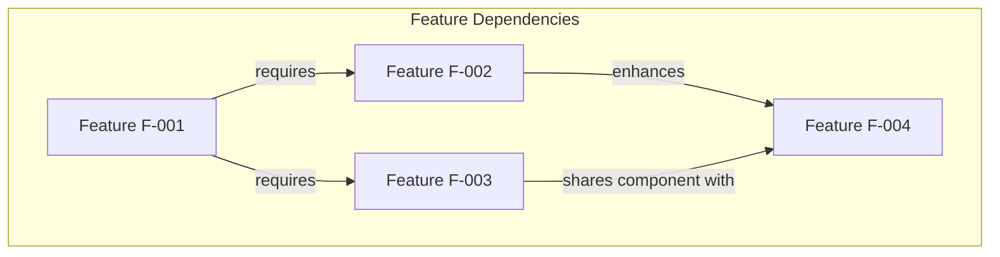

### 2.4.2 Integration Points Framework

Integration requirements between features will be documented including:

- **Data Flow Integration**: How data moves between features
- **API Integration**: Shared APIs or services used by multiple features
- **UI Integration**: How features integrate in the user interface
- **Event-Driven Integration**: Events published and consumed by features
- **Shared Resources**: Common databases, caches, or infrastructure components

### 2.4.3 Common Services and Components

Features will be analyzed to identify shared services and components that should be implemented as reusable modules:

| Service/Component Type | Purpose | Consuming Features |
|------------------------|---------|-------------------|
| [Service name] | [Service description] | [List of feature IDs] |

## 2.5 Implementation Considerations Framework

### 2.5.1 Technical Constraints Documentation

For each feature, the following technical constraints will be documented:

**Infrastructure Constraints:**
- Hosting environment limitations
- Network connectivity requirements
- Storage capacity restrictions
- Compute resource limitations

**Technology Constraints:**
- Programming language and framework restrictions
- Browser or platform compatibility requirements
- Third-party library or service availability
- Legacy system integration constraints

**Timeline Constraints:**
- Development time estimates
- Dependency on external vendor deliverables
- Resource availability limitations
- Market or regulatory deadlines

### 2.5.2 Performance Requirements Template

Performance requirements for each feature will be specified using measurable criteria:

| Performance Metric | Target | Measurement Method |
|-------------------|--------|-------------------|
| Response Time | [e.g., < 200ms for 95th percentile] | [How measured] |
| Throughput | [e.g., 1000 transactions/second] | [How measured] |
| Concurrent Users | [e.g., Support 10,000 concurrent users] | [How measured] |
| Data Volume | [e.g., Handle 100GB datasets] | [How measured] |
| Availability | [e.g., 99.9% uptime] | [How measured] |

### 2.5.3 Scalability Considerations

For each feature, scalability requirements will address:

**Horizontal Scalability:**
- Ability to add more servers/instances to handle increased load
- Stateless design requirements
- Load balancing strategies
- Database sharding or partitioning needs

**Vertical Scalability:**
- Efficient resource utilization as load increases
- Memory and CPU optimization requirements
- Caching strategies
- Query optimization needs

**Data Scalability:**
- Growth projections for data volume
- Archiving and purging strategies
- Data partitioning approaches
- Storage tier strategies

### 2.5.4 Security Requirements Framework

Security requirements will be documented at the feature level:

| Security Domain | Requirements |
|-----------------|--------------|
| Authentication | Identity verification mechanisms, multi-factor authentication |
| Authorization | Role-based access control, permission models |
| Data Protection | Encryption at rest and in transit, data masking |
| Audit and Logging | Activity logging, audit trail requirements |
| Vulnerability Protection | Input validation, SQL injection prevention, XSS protection |
| Privacy | Data privacy compliance, PII handling, consent management |

### 2.5.5 Maintenance and Operational Requirements

Maintenance requirements for each feature will include:

**Monitoring Requirements:**
- Key metrics to monitor
- Alert thresholds and notification mechanisms
- Dashboard and visualization needs
- Log aggregation and analysis requirements

**Maintenance Windows:**
- Acceptable downtime for updates
- Backup and restore procedures
- Disaster recovery requirements
- Data migration capabilities

**Support Requirements:**
- Documentation needs (user guides, API documentation, troubleshooting guides)
- Training requirements for administrators and users
- Support tooling needs
- Diagnostic and debugging capabilities

## 2.6 Requirements Validation and Acceptance

### 2.6.1 Acceptance Criteria Standards

All requirements will include specific, measurable, achievable, relevant, and time-bound (SMART) acceptance criteria that define when a requirement is considered complete:

**Acceptance Criteria Components:**
- **Given**: Initial context or preconditions
- **When**: Action or event that triggers the behavior
- **Then**: Expected outcome or result
- **And**: Additional conditions or outcomes

**Example Format:**
```
Given: [precondition]
When: [action]
Then: [expected result]
And: [additional conditions]
```

### 2.6.2 Requirements Verification Approach

Each requirement will be verified through:

| Verification Method | Description | Applicable Requirements |
|--------------------|-------------|------------------------|
| Inspection | Manual review of design documents or code | Design requirements, architecture requirements |
| Demonstration | Show functionality in action | UI requirements, workflow requirements |
| Testing | Automated or manual test execution | Functional requirements, performance requirements |
| Analysis | Mathematical or analytical proof | Algorithm requirements, capacity requirements |

### 2.6.3 Requirements Change Management

A change management process will govern requirement modifications:

**Change Request Process:**
1. **Submission**: Stakeholder submits change request with justification
2. **Impact Analysis**: Assess impact on timeline, resources, dependencies
3. **Approval**: Change control board reviews and approves/rejects
4. **Implementation**: Update requirements documentation and traceability
5. **Communication**: Notify all affected stakeholders

**Change Tracking:**

| Change ID | Requirement ID | Change Description | Requestor | Impact | Status | Approval Date |
|-----------|----------------|-------------------|-----------|--------|--------|---------------|
| CR-XXX | F-XXX-RQ-YYY | [Description] | [Name] | [High/Med/Low] | [Status] | [Date] |

## 2.7 Next Steps for Requirements Definition

### 2.7.1 Immediate Actions Required

To populate this Product Requirements section with actual requirements, the following immediate actions are needed:

**Week 1-2: Stakeholder Engagement**
1. Identify and schedule meetings with key stakeholders
2. Prepare discovery questions and interview guides
3. Conduct stakeholder interviews to understand business objectives
4. Document business problems and desired outcomes

**Week 3-4: Requirements Elicitation**
1. Facilitate requirements gathering workshops
2. Document user stories and use cases
3. Create initial feature list with priorities
4. Define success criteria and acceptance criteria

**Week 5-6: Requirements Documentation**
1. Document features using the framework provided in Section 2.2
2. Create functional requirements tables for each feature
3. Establish traceability matrix
4. Review and validate requirements with stakeholders

### 2.7.2 Stakeholder Identification Needs

The following stakeholder roles need to be identified for requirements gathering:

| Stakeholder Role | Contribution | Status |
|------------------|--------------|--------|
| Product Owner | Business vision, priorities, acceptance criteria | To be identified |
| End Users | User needs, workflows, pain points | To be identified |
| Technical Architect | Technical feasibility, architectural constraints | To be identified |
| Business Analysts | Requirements analysis, documentation | To be identified |
| Compliance/Security | Security and compliance requirements | To be identified |

### 2.7.3 Documentation Dependencies

This Product Requirements section depends on completion of the following activities:

- Business requirements gathering and analysis
- User research and persona development
- Competitive analysis and market research
- Technical feasibility assessment
- Scope and boundary definition (Section 1.3)
- Success criteria definition (Section 1.2.3)

Once these dependencies are addressed, this section will be updated with:
- Complete feature catalog with detailed specifications
- Functional requirements tables for all identified features
- Feature relationship diagrams
- Implementation considerations for each feature
- Comprehensive traceability matrix

## 2.8 References

### 2.8.1 Repository Artifacts Examined

- `README.md` - Project title reference; contains no product requirements or feature specifications

### 2.8.2 Technical Specification Sections Referenced

- Section 1.1 (Executive Summary) - Project state and repository metadata
- Section 1.2 (System Overview) - Current development stage and scope definition requirements
- Section 1.3 (Scope) - Scope status and definition requirements
- Section 1.4 (Next Steps for Specification Completion) - Requirements gathering recommendations

### 2.8.3 Methodology References

This requirements framework follows industry best practices including:
- IEEE 29148-2018: Systems and Software Engineering - Life Cycle Processes - Requirements Engineering
- IIBA BABOK (Business Analysis Body of Knowledge) - Requirements analysis and documentation standards
- Agile user story and acceptance criteria formats
- MoSCoW prioritization framework (Must-have, Should-have, Could-have, Won't-have)

# 3. Technology Stack

## 3.1 Technology Stack Overview

### 3.1.1 Current Implementation Status

The 6nove_3 project is currently in its planning and specification phase with no implemented code or infrastructure. This Technology Stack section documents the **planned and intended technology selections** that will guide implementation once requirements are fully defined and validated with stakeholders.

**Status**: Planned Technology Stack (Pre-Implementation)
- **Implementation State**: No source code, configuration files, or infrastructure currently exists in the repository
- **Validation State**: Technology selections pending validation against finalized requirements
- **Decision Basis**: Default technology stack recommendations designed for scalability, maintainability, and cross-platform capability

### 3.1.2 Technology Selection Philosophy

The planned technology stack has been designed around the following architectural principles:

**Modern, Battle-Tested Technologies**
- Preference for mature, well-supported frameworks with strong community ecosystems
- Technologies with proven track records in production environments
- Active development and security patch support

**Cross-Platform Capability**
- Support for web, mobile, and native application development
- Shared code patterns and architectural consistency across platforms
- Technology choices that enable team knowledge sharing

**Cloud-Native Architecture**
- Infrastructure designed for cloud deployment and scalability
- Containerization for consistent environments from development to production
- DevOps automation for rapid, reliable deployments

**Developer Experience**
- Strong typing support where applicable (TypeScript)
- Robust tooling and IDE support
- Clear documentation and learning resources

### 3.1.3 Stack Architecture Overview

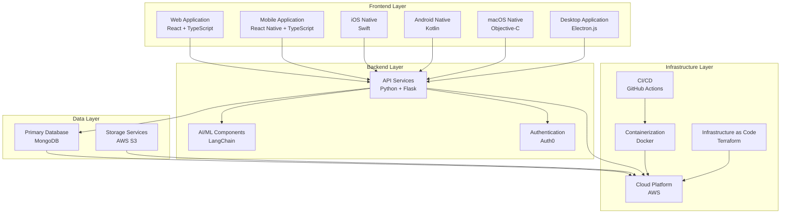

## 3.2 Programming Languages

### 3.2.1 Backend Programming Language: Python

**Primary Language**: Python 3.11+

**Justification**:
- **AI/ML Integration**: Python is the dominant language for AI and machine learning frameworks, providing seamless integration with LangChain and other AI libraries
- **Flask Framework Compatibility**: Native support for Flask web framework enabling rapid API development
- **Rich Ecosystem**: Extensive package repository (PyPI) with mature libraries for data processing, API development, and cloud integration
- **Developer Productivity**: Clear, readable syntax that enhances maintainability and reduces development time
- **Cloud Platform Support**: First-class support across all major cloud providers, particularly AWS Lambda and AWS services

**Version Requirements**:
- Minimum: Python 3.11
- Recommended: Python 3.12
- Rationale: Python 3.11+ provides significant performance improvements (10-60% faster than 3.10), improved error messages, and enhanced type hint capabilities

**Constraints**:
- Requires virtual environment management (venv, poetry, or pipenv)
- Global Interpreter Lock (GIL) considerations for CPU-intensive parallel processing
- Type checking requires additional tooling (mypy, pyright)

### 3.2.2 Frontend Programming Language: TypeScript

**Primary Language**: TypeScript 5.0+

**Justification**:
- **Type Safety**: Static typing reduces runtime errors and improves code quality across large codebases
- **Enhanced Developer Experience**: Superior IDE support with intelligent code completion, refactoring tools, and inline documentation
- **JavaScript Ecosystem Access**: Full compatibility with npm ecosystem while adding compile-time safety
- **Cross-Platform Consistency**: Single language for web (React), mobile (React Native), and desktop (Electron) development
- **Team Collaboration**: Type definitions serve as implicit documentation and contracts between components

**Platform Applications**:
- Web Application: React with TypeScript
- Mobile Application: React Native with TypeScript
- Desktop Application: Electron.js with TypeScript

**Version Requirements**:
- Minimum: TypeScript 5.0
- Recommended: TypeScript 5.3+
- Rationale: TypeScript 5.0+ provides improved type inference, decorators support, and enhanced performance

### 3.2.3 Native iOS Development: Swift

**Primary Language**: Swift 5.9+

**Justification**:
- **Apple's Preferred Language**: Official language for iOS/macOS development with ongoing platform feature support
- **Performance**: Compiled language offering near-C performance for computationally intensive operations
- **Modern Language Features**: Optionals, protocol-oriented programming, and memory safety features
- **SwiftUI Integration**: Native support for Apple's declarative UI framework
- **Community and Resources**: Strong ecosystem with extensive documentation and community support

**Version Requirements**:
- Minimum: Swift 5.9
- Recommended: Latest stable Swift version
- Xcode: Version 15.0 or later

**Use Cases**:
- iOS native applications requiring platform-specific features
- Performance-critical mobile operations
- Deep integration with iOS ecosystem (HealthKit, CoreML, etc.)

### 3.2.4 Native Android Development: Kotlin

**Primary Language**: Kotlin 1.9+

**Justification**:
- **Google's Preferred Language**: Official language for Android development with first-class IDE support
- **Java Interoperability**: Seamless integration with existing Java libraries and Android SDK
- **Modern Syntax**: Concise, expressive syntax reducing boilerplate code by ~40% compared to Java
- **Null Safety**: Built-in null safety features preventing common NullPointerException errors
- **Coroutines Support**: Native support for asynchronous programming and efficient concurrency

**Version Requirements**:
- Minimum: Kotlin 1.9
- Recommended: Kotlin 2.0+
- Android Studio: Arctic Fox or later

**Use Cases**:
- Android native applications requiring platform-specific features
- Performance-optimized mobile operations
- Deep integration with Android ecosystem (Google Services, Jetpack libraries)

### 3.2.5 Native macOS Development: Objective-C

**Primary Language**: Objective-C 2.0

**Justification**:
- **Legacy System Compatibility**: Required for maintaining compatibility with existing macOS codebases
- **Framework Access**: Direct access to mature macOS frameworks and APIs
- **Runtime Flexibility**: Dynamic runtime enabling advanced programming patterns
- **C/C++ Interoperability**: Seamless integration with C and C++ libraries

**Version Requirements**:
- Objective-C 2.0 with ARC (Automatic Reference Counting)
- Xcode: Version 15.0 or later
- Deployment Target: macOS 12.0 (Monterey) or later

**Use Cases**:
- macOS native applications requiring specific platform features
- Integration with legacy Objective-C codebases
- Access to macOS-specific frameworks not fully available in Swift

**Migration Consideration**: Future consideration for gradual migration to Swift for new macOS components while maintaining Objective-C for legacy system integration.

## 3.3 Frameworks & Libraries

### 3.3.1 Backend Framework: Flask

**Framework**: Flask 3.0+

**Core Justification**:
- **Lightweight and Flexible**: Microframework approach allowing precise control over components and architecture
- **RESTful API Development**: Excellent support for building REST APIs with minimal boilerplate
- **Extension Ecosystem**: Rich extension library for database integration, authentication, API documentation, and more
- **Python Native**: Leverages Python's strengths while maintaining simplicity
- **Scalability Path**: Can start simple and add complexity as requirements grow

**Core Dependencies**:
```
Flask >= 3.0.0
Flask-RESTful >= 0.3.10      # REST API development
Flask-CORS >= 4.0.0           # Cross-Origin Resource Sharing
Flask-SQLAlchemy >= 3.1.0     # Database ORM (if needed alongside MongoDB)
Werkzeug >= 3.0.0             # WSGI utility library (Flask dependency)
```

**Version Rationale**:
- Flask 3.0+ provides async support, improved type hints, and enhanced security features
- Major version upgrade from Flask 2.x with breaking changes but significant improvements

**Integration Requirements**:
- Python 3.11+ runtime
- WSGI server for production (Gunicorn or uWSGI)
- Reverse proxy (NGINX or AWS Application Load Balancer)

### 3.3.2 AI Framework: LangChain

**Framework**: LangChain 0.1.0+

**Core Justification**:
- **LLM Integration**: Simplified interface for integrating multiple Large Language Model providers (OpenAI, Anthropic, AWS Bedrock)
- **Chain Composition**: Modular approach to building complex AI workflows through composable components
- **Memory Management**: Built-in memory systems for maintaining conversation context and state
- **Document Processing**: Native support for document loading, splitting, and vector storage
- **Prompt Engineering**: Structured approach to prompt templates and optimization

**Core Dependencies**:
```
langchain >= 0.1.0
langchain-core >= 0.1.0
langchain-community >= 0.0.10
openai >= 1.10.0               # OpenAI API integration
tiktoken >= 0.5.2              # Token counting for LLMs
```

**Integration Requirements**:
- Vector database for embeddings (MongoDB Atlas Vector Search or Pinecone)
- API keys for LLM providers (OpenAI, Anthropic, etc.)
- Document processing libraries (PyPDF2, python-docx, unstructured)

**Use Cases**:
- Conversational AI interfaces
- Document analysis and question answering
- Automated content generation
- Semantic search capabilities

### 3.3.3 Web Frontend Framework: React

**Framework**: React 18.2+

**Core Justification**:
- **Industry Standard**: Most widely adopted frontend framework with extensive community support
- **Component-Based Architecture**: Reusable component model promoting code organization and maintainability
- **Virtual DOM**: Efficient rendering optimization for complex UIs
- **Rich Ecosystem**: Vast library of third-party components, tools, and extensions
- **TypeScript Support**: First-class TypeScript integration for type-safe development
- **Concurrent Features**: React 18+ provides concurrent rendering and automatic batching

**Core Dependencies**:
```
react >= 18.2.0
react-dom >= 18.2.0
react-router-dom >= 6.20.0    # Client-side routing
@types/react >= 18.2.0         # TypeScript definitions
@types/react-dom >= 18.2.0     # TypeScript definitions
```

**Build Tooling**:
```
vite >= 5.0.0                  # Modern build tool (preferred over Create React App)
@vitejs/plugin-react >= 4.2.0 # React plugin for Vite
```

**Version Rationale**:
- React 18.2+ provides stable concurrent features, automatic batching, and improved hydration
- Vite preferred over Create React App for significantly faster builds and hot module replacement

**Integration Requirements**:
- Node.js 18+ runtime for development
- Modern browser support (ES2020+)
- TypeScript compiler configuration

### 3.3.4 CSS Framework: Tailwind CSS

**Framework**: Tailwind CSS 3.4+

**Core Justification**:
- **Utility-First Approach**: Rapid UI development through composable utility classes
- **Design Consistency**: Built-in design system ensuring consistent spacing, colors, and typography
- **Performance Optimization**: Automatic purging of unused CSS in production builds
- **Customization**: Highly configurable through tailwind.config.js
- **Developer Experience**: Excellent IDE support with IntelliSense and autocomplete
- **Responsive Design**: Mobile-first responsive utilities built-in

**Core Dependencies**:
```
tailwindcss >= 3.4.0
postcss >= 8.4.32             # CSS processing required by Tailwind
autoprefixer >= 10.4.16       # Automatic vendor prefixing
```

**Optional Extensions**:
```
@tailwindcss/forms >= 0.5.7   # Form styling utilities
@tailwindcss/typography >= 0.5.10  # Rich text styling
```

**Integration Requirements**:
- PostCSS configuration
- Build process integration (Vite, webpack, etc.)
- Configuration file (tailwind.config.js)

**Design System Integration**:
- Custom color palette configuration
- Typography scale customization
- Spacing and sizing system definition
- Component library development (buttons, cards, modals, etc.)

### 3.3.5 Mobile Framework: React Native

**Framework**: React Native 0.73+

**Core Justification**:
- **Cross-Platform Development**: Single codebase for iOS and Android with ~70-90% code sharing
- **React Knowledge Transfer**: Leverages existing React and TypeScript expertise from web development
- **Native Performance**: Compiles to native code for platform-specific optimization
- **Hot Reloading**: Fast development cycle with instant feedback
- **Native Module Access**: Bridge to platform-specific APIs and features when needed
- **Strong Ecosystem**: Extensive third-party library support via npm

**Core Dependencies**:
```
react-native >= 0.73.0
@react-navigation/native >= 6.1.9  # Navigation solution
@react-navigation/stack >= 6.3.20
react-native-gesture-handler >= 2.14.0
react-native-reanimated >= 3.6.0
```

**Platform-Specific Requirements**:
```
@react-native-community/netinfo >= 11.0.0  # Network connectivity
react-native-safe-area-context >= 4.8.0    # Safe area handling
react-native-screens >= 3.29.0              # Native screen optimization
```

**Version Rationale**:
- React Native 0.73+ provides New Architecture support (Fabric and TurboModules) for improved performance
- Enhanced TypeScript support and developer experience improvements

**Integration Requirements**:
- iOS: Xcode 15+, CocoaPods 1.13+
- Android: Android Studio, Gradle 8+, JDK 17+
- Metro bundler for JavaScript packaging

### 3.3.6 Desktop Framework: Electron.js

**Framework**: Electron 28.0+

**Core Justification**:
- **Cross-Platform Desktop**: Single codebase for Windows, macOS, and Linux desktop applications
- **Web Technology Leverage**: Utilizes existing React, TypeScript, and web development expertise
- **Native Integration**: Access to native desktop APIs (filesystem, notifications, system tray)
- **Auto-Update Support**: Built-in application update mechanisms
- **Mature Ecosystem**: Proven framework used by Visual Studio Code, Slack, Discord, and others

**Core Dependencies**:
```
electron >= 28.0.0
electron-builder >= 24.9.0    # Application packaging and distribution
electron-updater >= 6.1.7     # Auto-update functionality
```

**Integration Dependencies**:
```
electron-store >= 8.1.0       # Persistent user preferences storage
electron-log >= 5.0.1         # Application logging
```

**Version Rationale**:
- Electron 28+ provides Chromium 120+, Node.js 20+, and V8 12+ with latest web standards
- Improved security sandbox and performance optimizations

**Integration Requirements**:
- Node.js 18+ runtime
- Native module compilation tools (node-gyp, python)
- Code signing certificates for distribution (macOS/Windows)

**Distribution Considerations**:
- Application size optimization (Electron apps typically 50-150MB)
- Platform-specific installers (DMG for macOS, NSIS for Windows, AppImage for Linux)
- Auto-update server infrastructure

## 3.4 Open Source Dependencies

### 3.4.1 Backend Dependencies Overview

**Python Package Management**: pip with requirements.txt or Poetry for dependency management

**Core Production Dependencies**:

**Web Framework & API**:
```
Flask==3.0.0                  # Web framework
Flask-RESTful==0.3.10         # REST API utilities
Flask-CORS==4.0.0             # CORS handling
Werkzeug==3.0.1               # WSGI utilities
```

**AI/ML Framework**:
```
langchain==0.1.0              # LLM orchestration framework
langchain-core==0.1.10        # Core LangChain components
langchain-community==0.0.13   # Community integrations
openai==1.10.0                # OpenAI API client
anthropic==0.8.1              # Anthropic Claude API client
tiktoken==0.5.2               # Token counting for LLMs
```

**Database & Data Access**:
```
pymongo==4.6.1                # MongoDB driver
motor==3.3.2                  # Async MongoDB driver
redis==5.0.1                  # Redis client for caching
```

**Authentication & Security**:
```
python-jose[cryptography]==3.3.0  # JWT token handling
authlib==1.3.0                # OAuth/OIDC implementation
cryptography==41.0.7          # Cryptographic recipes
python-dotenv==1.0.0          # Environment variable management
```

**Cloud & Infrastructure**:
```
boto3==1.34.10                # AWS SDK
botocore==1.34.10             # AWS core functionality
requests==2.31.0              # HTTP library
```

**Data Processing & Validation**:
```
pydantic==2.5.3               # Data validation using Python type hints
marshmallow==3.20.1           # Object serialization/deserialization
python-dateutil==2.8.2        # Date/time utilities
```

**Development Dependencies**:
```
pytest==7.4.3                 # Testing framework
pytest-cov==4.1.0             # Test coverage
pytest-asyncio==0.21.1        # Async test support
black==23.12.1                # Code formatting
flake8==7.0.0                 # Linting
mypy==1.8.0                   # Static type checking
pylint==3.0.3                 # Code analysis
```

**Package Registry**: PyPI (Python Package Index)
**Dependency Lock**: requirements.txt with pinned versions or poetry.lock

### 3.4.2 Frontend Web Dependencies Overview

**JavaScript Package Management**: npm or yarn with package.json

**Core Production Dependencies**:

**Framework & UI**:
```
react@18.2.0                  # UI framework
react-dom@18.2.0              # DOM rendering
react-router-dom@6.20.1       # Client-side routing
```

**State Management**:
```
zustand@4.4.7                 # Lightweight state management (alternative to Redux)
@tanstack/react-query@5.17.0  # Server state management & caching
```

**UI & Styling**:
```
tailwindcss@3.4.0             # Utility-first CSS framework
postcss@8.4.32                # CSS processing
autoprefixer@10.4.16          # CSS vendor prefixing
@headlessui/react@1.7.17      # Unstyled accessible components
@heroicons/react@2.1.1        # Icon library
```

**Form Management**:
```
react-hook-form@7.49.2        # Performant form handling
zod@3.22.4                    # Schema validation
@hookform/resolvers@3.3.3     # Form validation resolver
```

**HTTP & API**:
```
axios@1.6.5                   # HTTP client
```

**Utilities**:
```
date-fns@3.0.6                # Date manipulation
lodash@4.17.21                # Utility functions
clsx@2.1.0                    # Conditional className utility
```

**TypeScript**:
```
typescript@5.3.3              # TypeScript compiler
@types/react@18.2.47          # React type definitions
@types/react-dom@18.2.18      # React DOM type definitions
@types/lodash@4.14.202        # Lodash type definitions
```

**Development Dependencies**:
```
vite@5.0.10                   # Build tool
@vitejs/plugin-react@4.2.1    # Vite React plugin
eslint@8.56.0                 # Linting
@typescript-eslint/parser@6.18.1  # TypeScript ESLint parser
@typescript-eslint/eslint-plugin@6.18.1  # TypeScript ESLint rules
prettier@3.1.1                # Code formatting
vitest@1.1.3                  # Testing framework (Vite-native)
@testing-library/react@14.1.2 # React testing utilities
@testing-library/jest-dom@6.2.0  # Custom jest matchers
```

**Package Registry**: npm (Node Package Manager)
**Dependency Lock**: package-lock.json or yarn.lock

### 3.4.3 Mobile Dependencies Overview

**React Native Core**:
```
react-native@0.73.2           # Mobile framework
react@18.2.0                  # React core
```

**Navigation**:
```
@react-navigation/native@6.1.9
@react-navigation/stack@6.3.20
@react-navigation/bottom-tabs@6.5.11
react-native-screens@3.29.0
react-native-safe-area-context@4.8.2
```

**UI Components**:
```
react-native-gesture-handler@2.14.1
react-native-reanimated@3.6.1
react-native-vector-icons@10.0.3
```

**Platform Integration**:
```
@react-native-community/netinfo@11.0.0  # Network status
@react-native-async-storage/async-storage@1.21.0  # Local storage
react-native-device-info@10.12.0  # Device information
```

**Development Dependencies**:
```
@react-native/metro-config@0.73.5
@react-native/typescript-config@0.73.1
@types/react@18.2.47
metro-react-native-babel-preset@0.77.0
```

**Package Registry**: npm
**Platform-Specific**: CocoaPods (iOS), Gradle (Android)

### 3.4.4 Desktop Dependencies Overview

**Electron Core**:
```
electron@28.1.3               # Desktop framework
electron-builder@24.9.1       # Application packaging
electron-updater@6.1.7        # Auto-update support
```

**Desktop Integration**:
```
electron-store@8.1.0          # Persistent storage
electron-log@5.0.1            # Logging
electron-context-menu@3.6.1   # Context menu utilities
```

**Package Registry**: npm
**Distribution**: Platform-specific installers via electron-builder

### 3.4.5 Dependency Management Strategy

**Version Pinning**:
- Production dependencies: Pin to specific minor versions (e.g., `package@1.2.x`)
- Critical security libraries: Pin to exact versions
- Development dependencies: Allow patch updates

**Security Scanning**:
- Automated vulnerability scanning using Snyk or npm audit
- Regular dependency updates via Dependabot or Renovate
- Security advisory monitoring

**Update Policy**:
- Major version updates: Quarterly review with testing
- Minor version updates: Monthly review for non-breaking changes
- Patch updates: Automated with CI/CD validation
- Security patches: Immediate application with expedited testing

**License Compliance**:
- Approved licenses: MIT, Apache 2.0, BSD, ISC
- Restricted licenses requiring review: GPL, AGPL, Creative Commons
- License scanning: License-checker or FOSSA integration

## 3.5 Third-Party Services

### 3.5.1 Authentication Service: Auth0

**Service**: Auth0 (Okta)
**Purpose**: Identity and access management platform

**Core Capabilities**:
- **Universal Login**: Centralized authentication with customizable login pages
- **Multi-Factor Authentication (MFA)**: Support for SMS, authenticator apps, email, and biometric MFA
- **Social Login**: Integration with Google, Apple, Facebook, GitHub, and other OAuth providers
- **Enterprise SSO**: SAML and WS-Federation support for enterprise identity providers
- **User Management**: Comprehensive user profile management and administration APIs
- **Role-Based Access Control**: Fine-grained permission management and authorization

**Integration Points**:
- Backend API: Auth0 Python SDK for token validation and user management
- Web Frontend: Auth0 React SDK (@auth0/auth0-react) for seamless authentication flow
- Mobile Apps: Auth0 React Native SDK for iOS/Android authentication
- Desktop App: Auth0 Electron integration for desktop authentication

**Configuration Requirements**:
- Auth0 tenant setup with custom domain
- Application registration for each platform (Web, Mobile, Desktop)
- API configuration with appropriate scopes and permissions
- Callback URLs and allowed origins configuration
- JWT signing algorithm configuration (RS256 recommended)

**Pricing Considerations**:
- Free tier: Up to 7,000 active users
- Paid tiers: Scale based on monthly active users (MAUs)
- Essential features available in free tier sufficient for initial deployment

**Security Features**:
- Breached password detection
- Brute force protection
- Bot detection
- Anomaly detection
- Extensibility through rules and actions

### 3.5.2 Cloud Platform: AWS (Amazon Web Services)

**Service**: AWS Cloud Platform
**Purpose**: Primary cloud infrastructure provider

**Core AWS Services (Planned)**:

**Compute Services**:
- **Amazon EC2**: Virtual servers for Flask application hosting
- **AWS Lambda**: Serverless functions for event-driven processing and lightweight API endpoints
- **Amazon ECS/EKS**: Container orchestration for Docker deployment (ECS for simplicity, EKS for Kubernetes needs)

**Storage Services**:
- **Amazon S3**: Object storage for static assets, user uploads, document storage, and backups
- **Amazon EBS**: Block storage for EC2 instances
- **Amazon Elastic File System (EFS)**: Shared file system for multi-instance access

**Database & Caching**:
- **Amazon DocumentDB**: MongoDB-compatible managed database service (alternative to self-managed MongoDB)
- **Amazon ElastiCache**: Redis-compatible caching service for session storage and application caching
- **Amazon RDS**: Managed relational database if SQL needs emerge

**Networking & Content Delivery**:
- **Amazon VPC**: Isolated network infrastructure with public and private subnets
- **Amazon CloudFront**: CDN for static asset delivery and frontend application hosting
- **AWS Application Load Balancer**: HTTP/HTTPS load balancing for high availability
- **Amazon Route 53**: DNS management and domain routing

**Security & Identity**:
- **AWS IAM**: Identity and access management for AWS resources
- **AWS Secrets Manager**: Secure storage for API keys, database credentials, and sensitive configuration
- **AWS Certificate Manager**: SSL/TLS certificate management for HTTPS
- **AWS WAF**: Web application firewall for protection against common web exploits

**Monitoring & Logging**:
- **Amazon CloudWatch**: Metrics, logs, and alarms for infrastructure monitoring
- **AWS CloudTrail**: API activity logging for audit and compliance
- **AWS X-Ray**: Distributed tracing for performance analysis

**AI/ML Services (Optional)**:
- **Amazon Bedrock**: Managed foundation models as alternative to OpenAI
- **Amazon SageMaker**: Custom ML model training and deployment if needed
- **Amazon Comprehend**: Natural language processing services

**Developer Tools**:
- **AWS CodeBuild**: Build automation for CI/CD pipelines
- **AWS CodeDeploy**: Automated application deployment
- **Amazon ECR**: Docker container registry

**Cost Optimization**:
- **AWS Cost Explorer**: Cost analysis and optimization recommendations
- **AWS Budgets**: Spending alerts and budget management

**Region Strategy**:
- Primary Region: To be determined based on user geography and compliance requirements
- Multi-region consideration: For disaster recovery and global performance optimization

**Integration Requirements**:
- AWS SDK for Python (boto3) for backend service integration
- AWS Amplify or SDK for JavaScript for frontend AWS service access
- Infrastructure as Code (Terraform) for resource provisioning
- IAM roles and policies for secure service-to-service communication

### 3.5.3 Large Language Model Providers

**Primary Provider**: OpenAI
**Purpose**: Large language model API access for AI-powered features

**Services**:
- **GPT-4 Turbo**: Advanced reasoning and content generation (gpt-4-turbo-preview)
- **GPT-3.5 Turbo**: Fast, cost-effective conversational AI (gpt-3.5-turbo)
- **Embeddings**: Text embedding generation for semantic search (text-embedding-3-small/large)
- **Moderation**: Content filtering and safety checks (text-moderation-latest)

**Integration**:
- OpenAI Python SDK (openai package) via LangChain integration
- API key management through AWS Secrets Manager
- Rate limiting and usage monitoring
- Error handling and fallback strategies

**Backup Provider**: Anthropic Claude
**Purpose**: Alternative LLM provider for redundancy and specific use cases

**Services**:
- **Claude 3 Opus**: Highest capability model for complex tasks
- **Claude 3 Sonnet**: Balanced performance and cost
- **Claude 3 Haiku**: Fast, cost-effective responses

**Pricing Considerations**:
- OpenAI: Token-based pricing (input tokens + output tokens)
- Anthropic: Similar token-based pricing with different rate structures
- Cost monitoring and budget alerts implementation required

### 3.5.4 Monitoring & Observability

**Application Performance Monitoring**: Datadog, New Relic, or AWS CloudWatch (to be selected)

**Planned Capabilities**:
- Real-time application performance metrics
- Distributed tracing across microservices
- Custom metric collection and dashboards
- Error tracking and alerting
- Log aggregation and analysis
- User session replay and analytics

**Error Tracking**: Sentry
**Purpose**: Real-time error tracking and crash reporting

**Integration**:
- Sentry Python SDK for Flask backend
- Sentry JavaScript SDK for React web application
- Sentry React Native SDK for mobile applications
- Sentry Electron SDK for desktop application
- Source map integration for debugging minified code

**Features**:
- Automatic error capture and stack traces
- Release tracking and regression detection
- Performance monitoring integration
- Custom tagging and user context
- Alert notifications via Slack, email, or PagerDuty

### 3.5.5 Communication & Notifications

**Email Service**: Amazon SES (Simple Email Service)
**Purpose**: Transactional email delivery

**Use Cases**:
- User registration and verification emails
- Password reset workflows
- Application notifications
- System alerts and reports

**Alternative Options**:
- SendGrid: Third-party email service with templates and analytics
- Mailgun: Developer-focused email API
- Postmark: Transaction-focused email service

**SMS/Push Notifications**: Amazon SNS (Simple Notification Service)
**Purpose**: Multi-channel message delivery

**Channels**:
- SMS messages for authentication and alerts
- Push notifications to mobile applications (via APNs and FCM)
- Email notifications as backup channel

**Integration**:
- SNS Python SDK for backend notification triggers
- React Native push notification libraries for mobile
- Topic-based pub/sub for broadcast notifications

### 3.5.6 Content Delivery & Storage

**CDN**: Amazon CloudFront
**Purpose**: Global content delivery network for static assets and frontend applications

**Benefits**:
- Reduced latency through edge caching
- DDoS protection through AWS Shield Standard
- SSL/TLS encryption for secure content delivery
- Custom domain support with AWS Certificate Manager integration

**Object Storage**: Amazon S3
**Use Cases**:
- Static website hosting for React frontend
- User-uploaded files and documents
- Application logs and backups
- Data lake storage for analytics

**Configuration**:
- Bucket policies for access control
- Versioning for data protection
- Lifecycle policies for cost optimization
- Server-side encryption (SSE-S3 or SSE-KMS)

### 3.5.7 Analytics & Business Intelligence

**Analytics Platform**: To be determined (Options: Google Analytics, Mixpanel, Amplitude)

**Planned Capabilities**:
- User behavior tracking and funnel analysis
- Feature usage metrics
- Conversion tracking
- Custom event tracking
- Cohort analysis and retention metrics

**Data Warehouse**: Amazon Redshift or Snowflake (for future analytics needs)

**Business Intelligence**: To be selected based on requirements (Tableau, Looker, AWS QuickSight)

### 3.5.8 Development & Collaboration Tools

**Version Control**: GitHub
**Features**:
- Source code repository hosting
- Pull request workflows and code review
- Issue tracking and project management
- GitHub Actions for CI/CD (detailed in Section 3.7.4)

**Documentation**: GitHub Wiki or Confluence
**Communication**: Slack or Microsoft Teams for team collaboration

**Project Management**: To be determined (Options: Jira, Linear, GitHub Projects)

### 3.5.9 Third-Party Service Integration Guidelines

**API Key Management**:
- Store all API keys and secrets in AWS Secrets Manager or AWS Systems Manager Parameter Store
- Never commit secrets to version control
- Rotate credentials regularly (quarterly or as required by service)
- Use environment-specific keys (development, staging, production)

**Service Reliability**:
- Implement circuit breaker patterns for external API calls
- Configure appropriate timeouts and retries
- Monitor third-party service status pages
- Maintain fallback strategies for critical services

**Cost Monitoring**:
- Set up billing alerts for all paid services
- Regular review of service usage and optimization opportunities
- Implement rate limiting to prevent unexpected cost spikes
- Consider reserved capacity or committed use discounts for predictable workloads

**Compliance & Data Privacy**:
- Verify GDPR, CCPA, and other regulatory compliance for all third-party services
- Review data processing agreements (DPAs) and business associate agreements (BAAs)
- Understand data residency and cross-border data transfer policies
- Maintain inventory of services processing personal data

## 3.6 Databases & Storage

### 3.6.1 Primary Database: MongoDB

**Database**: MongoDB Atlas (Managed) or Self-Hosted MongoDB
**Version**: MongoDB 7.0+

**Justification**:
- **Flexible Schema**: JSON-like document structure ideal for evolving data models in planning phase
- **Developer Productivity**: Intuitive data model closely matching application objects
- **Scalability**: Horizontal scaling through sharding for future growth
- **Rich Query Language**: Powerful aggregation framework for complex data analysis
- **Full-Text Search**: Built-in text search capabilities for content discovery
- **Atlas Vector Search**: Native vector similarity search for AI/ML embeddings integration
- **Change Streams**: Real-time data change notifications for reactive applications

**Deployment Options**:

**Option 1: MongoDB Atlas (Recommended)**
- Fully managed database-as-a-service
- Automated backups and point-in-time recovery
- Built-in monitoring and performance advisor
- Multi-region replication and global clusters
- Automatic scaling and patching
- Free tier: 512 MB storage suitable for development and testing

**Option 2: Self-Hosted on AWS EC2/ECS**
- Greater control over configuration and optimization
- Potentially lower costs at scale
- Requires operational expertise for management
- Manual backup and monitoring setup

**Recommended**: MongoDB Atlas for initial implementation due to reduced operational overhead

**Data Organization Strategy**:

**Collections** (Planned):
- `users`: User profiles, authentication metadata, preferences
- `sessions`: Active user sessions and authentication tokens
- `content`: Application content, documents, or data objects
- `ai_conversations`: LangChain conversation history and context
- `embeddings`: Vector embeddings for semantic search
- `audit_logs`: Activity tracking and compliance audit trail
- `system_config`: Application configuration and feature flags

**Indexing Strategy**:
- Primary indexes on `_id` (automatic)
- Compound indexes on frequently queried field combinations
- Text indexes for full-text search fields
- Vector indexes for embeddings (Atlas Vector Search)
- TTL indexes for automatic document expiration (sessions, temporary data)

**Connection Configuration**:
```python
# Python connection example (via pymongo)
MONGO_URI = "mongodb+srv://<username>:<password>@cluster.mongodb.net/<database>"
MONGO_DB_NAME = "6nove_3_production"
CONNECTION_POOL_SIZE = 50
MAX_IDLE_TIME_MS = 60000
```

**Integration Requirements**:
- **Backend**: PyMongo (synchronous) or Motor (asynchronous) Python driver
- **Connection Pooling**: Configure appropriate pool size based on concurrent users
- **Authentication**: MongoDB user authentication with role-based access control
- **Encryption**: Enable encryption at rest and in transit (TLS/SSL)
- **Backup Strategy**: Automated daily backups with 7-day retention minimum

**Scaling Considerations**:
- Vertical scaling: Increase instance size for read/write performance
- Horizontal scaling: Implement sharding for datasets exceeding single-server capacity
- Read replicas: Add secondary nodes for read-heavy workloads
- Caching layer: Redis integration to reduce database load (see Section 3.6.3)

### 3.6.2 Data Persistence Strategy

**Document Database (MongoDB)**:
- **Use Cases**: User profiles, application data, content management, AI conversation history
- **Access Patterns**: Primary read/write operations, complex queries, aggregations
- **Consistency**: Strong consistency for transactional data, eventual consistency acceptable for analytics

**Object Storage (Amazon S3)**:
- **Use Cases**: User-uploaded files, images, PDFs, static assets, backups, large documents
- **Access Patterns**: Write-once, read-many; infrequent updates
- **Durability**: 99.999999999% (11 9's) durability, cross-region replication available

**Block Storage (Amazon EBS)**:
- **Use Cases**: EC2 instance boot volumes, database volumes (if self-hosting MongoDB)
- **Access Patterns**: Low-latency random read/write
- **Performance**: Provisioned IOPS for consistent high performance

**Ephemeral Storage**:
- **Use Cases**: Temporary file processing, cache directories, build artifacts
- **Access Patterns**: Short-lived data with no persistence requirements
- **Implementation**: Container tmpfs mounts, instance temporary storage

### 3.6.3 Caching Solution: Redis

**Cache**: Redis 7.2+ (Amazon ElastiCache or Self-Hosted)

**Justification**:
- **Performance**: In-memory data structure store providing sub-millisecond latency
- **Versatility**: Support for strings, hashes, lists, sets, sorted sets, and more
- **Session Storage**: Fast session management for Flask applications
- **API Response Caching**: Reduce database load and improve response times
- **Rate Limiting**: Token bucket or sliding window rate limiting implementation
- **Pub/Sub**: Real-time messaging for WebSocket or event-driven features
- **Cache Invalidation**: Built-in expiration and eviction policies

**Deployment Options**:

**Option 1: Amazon ElastiCache (Recommended)**
- Fully managed Redis service
- Automatic failover with Multi-AZ deployment
- Automated backups and snapshot management
- Seamless scaling with cluster mode
- VPC integration for network isolation

**Option 2: Self-Hosted Redis**
- Deployed on EC2 instances or ECS containers
- Manual replication and failover configuration
- Potentially lower costs for specific workloads

**Recommended**: Amazon ElastiCache for reliability and reduced operational overhead

**Caching Strategies**:

**Cache-Aside (Lazy Loading)**:
1. Application checks cache for data
2. If cache miss, fetch from MongoDB
3. Store retrieved data in cache with TTL
4. Return data to application

**Write-Through**:
1. Application writes data to MongoDB
2. Simultaneously write data to Redis cache
3. Ensures cache is always up-to-date

**Time-to-Live (TTL) Strategy**:
- Session data: 30 minutes to 24 hours
- API responses: 5 minutes to 1 hour depending on data volatility
- User profiles: 15 minutes (balance between freshness and performance)
- Static configuration: 24 hours

**Cache Keys Naming Convention**:
```
Pattern: <resource_type>:<identifier>:<optional_qualifier>

Examples:
user:12345:profile
api:v1:endpoint:/users:params:abc123
session:token:xyz789
ratelimit:user:12345:api_calls
```

**Redis Data Structures Usage**:
- **Strings**: Simple key-value pairs for session tokens, cached API responses
- **Hashes**: User profile data, configuration objects
- **Sets**: User permissions, feature flags, tag collections
- **Sorted Sets**: Leaderboards, time-series data, priority queues
- **Lists**: Activity feeds, job queues

**Integration Requirements**:
- **Backend**: Redis Python client (redis-py)
- **Connection Pooling**: Configure connection pool for efficient resource usage
- **Serialization**: JSON or MessagePack for complex objects
- **Error Handling**: Graceful degradation if cache unavailable (fallback to database)

**Monitoring & Maintenance**:
- Monitor cache hit/miss ratio (target: >80% hit rate)
- Track memory usage and eviction policies
- Monitor connection pool exhaustion
- Set up alerts for cache unavailability

### 3.6.4 Vector Storage for AI Embeddings

**Option 1: MongoDB Atlas Vector Search** (Recommended)
- Native vector search capabilities in MongoDB Atlas 6.0.11+
- Single database for both application data and embeddings
- Approximate Nearest Neighbor (ANN) search using Hierarchical Navigable Small World (HNSW) algorithm
- Integration with LangChain through MongoDB Atlas vectorstore

**Configuration**:
```python
# Vector index creation
{
  "fields": [{
    "type": "vector",
    "path": "embedding",
    "numDimensions": 1536,  # OpenAI ada-002 embedding size
    "similarity": "cosine"
  }]
}
```

**Option 2: Pinecone** (Specialized Alternative)
- Purpose-built vector database
- Superior performance for large-scale vector search (millions of vectors)
- Managed service with simple API
- Higher cost compared to MongoDB Atlas vector search

**Option 3: AWS OpenSearch** (AWS-Native Alternative)
- k-NN search plugin for vector similarity
- Integrated with AWS ecosystem
- Also provides full-text search capabilities

**Recommendation**: Start with MongoDB Atlas Vector Search for simplified architecture; evaluate specialized solutions (Pinecone, OpenSearch) if vector search becomes a performance bottleneck.

### 3.6.5 Storage Architecture Diagram

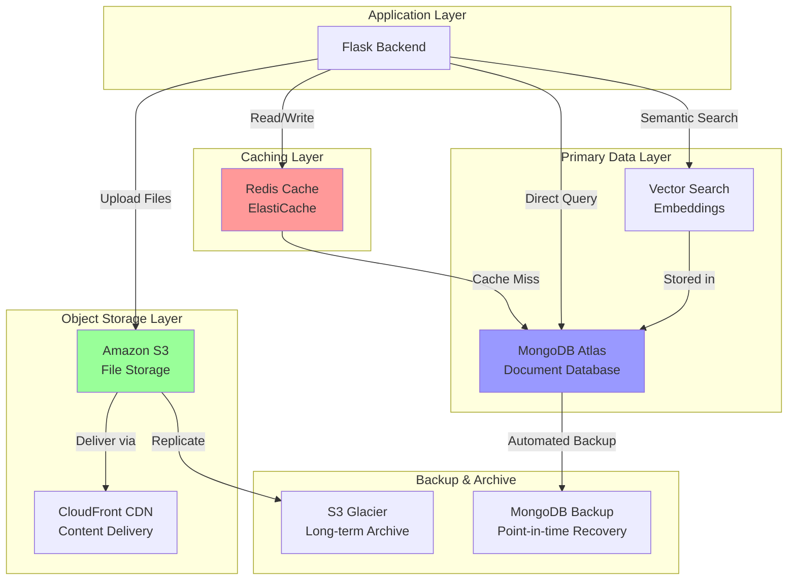

### 3.6.6 Data Security & Compliance

**Encryption**:
- **At Rest**: 
  - MongoDB Atlas: Encrypted by default using MongoDB's encrypted storage engine
  - S3: Server-side encryption with AWS-managed keys (SSE-S3) or customer-managed keys (SSE-KMS)
  - Redis: ElastiCache encryption at rest using AWS KMS
- **In Transit**: 
  - TLS 1.2+ for all database connections
  - HTTPS for all API communications
  - VPC peering for AWS service-to-service communication

**Access Control**:
- MongoDB: Role-based access control (RBAC) with least privilege principle
- AWS IAM: Service-specific policies for S3, ElastiCache, and other AWS resources
- Redis: Password authentication and ACL (Access Control Lists) in Redis 6+

**Data Residency**:
- Configure MongoDB Atlas and AWS services in compliant regions
- Understand data transfer implications for cross-region replication
- Implement geo-fencing if required by regulations

**Backup & Disaster Recovery**:
- MongoDB Atlas: Continuous backup with point-in-time recovery (PITR)
- S3: Versioning enabled for accidental deletion protection
- Recovery Time Objective (RTO): Target < 4 hours
- Recovery Point Objective (RPO): Target < 15 minutes

**Audit Logging**:
- MongoDB: Enable database auditing for compliance requirements
- S3: Access logs and AWS CloudTrail for object access tracking
- Redis: Command logging for security audit trail

### 3.6.7 Storage Cost Optimization

**MongoDB Atlas**:
- Start with M10 shared cluster for development (~$60/month)
- Scale to M30 dedicated cluster for production (~$350/month)
- Enable auto-scaling for variable workloads
- Archive old data to S3 for long-term storage

**Amazon S3**:
- Use S3 Intelligent-Tiering for automatic cost optimization
- Implement lifecycle policies:
  - Transition to S3 Infrequent Access (IA) after 30 days
  - Transition to S3 Glacier after 90 days
  - Delete temporary files after expiration period
- Enable S3 compression for text-based files

**Redis Cache**:
- Right-size cache instance based on actual memory usage
- Use reserved instances for 30-40% cost savings (1-year commitment)
- Consider cache eviction policies to optimize memory utilization

**Monitoring**:
- Set up AWS Cost Explorer to track storage costs
- Create billing alerts for unexpected cost increases
- Regular review of storage usage and optimization opportunities

## 3.7 Development & Deployment

### 3.7.1 Development Tools & Environment

**Development Environment Setup**:

**Backend Development (Python)**:
- **Python Version Manager**: pyenv for managing multiple Python versions
- **Virtual Environment**: venv or Poetry for dependency isolation
- **Package Manager**: pip with requirements.txt or Poetry for dependency management
- **IDE Recommendations**: 
  - PyCharm Professional (comprehensive Python IDE)
  - Visual Studio Code with Python extension
  - Vim/Neovim with Python LSP

**Frontend Development (TypeScript/React)**:
- **Node Version Manager**: nvm (Node Version Manager) for managing Node.js versions
- **Package Manager**: npm (v9+) or yarn (v3+)
- **IDE Recommendations**:
  - Visual Studio Code with ESLint, Prettier, and TypeScript extensions
  - WebStorm (JetBrains)

**Mobile Development**:
- **iOS**: 
  - Xcode 15+ (macOS required)
  - CocoaPods for dependency management
  - iOS Simulator for testing
- **Android**:
  - Android Studio (Arctic Fox or later)
  - Gradle for build automation
  - Android Emulator for testing
- **React Native**: React Native CLI or Expo (for simplified setup)

**Code Quality Tools**:

**Python Backend**:
```bash
# Linting
flake8==7.0.0              # PEP 8 style guide enforcement
pylint==3.0.3              # Code analysis
mypy==1.8.0                # Static type checking

#### Formatting
black==23.12.1             # Opinionated code formatter
isort==5.13.2              # Import sorting

#### Security
bandit==1.7.6              # Security vulnerability scanner
safety==2.3.5              # Dependency vulnerability checker
```

**TypeScript Frontend**:
```bash
# Linting
eslint@8.56.0              # JavaScript/TypeScript linting
@typescript-eslint/parser@6.18.1
@typescript-eslint/eslint-plugin@6.18.1

#### Formatting
prettier@3.1.1             # Code formatting

#### Type Checking
typescript@5.3.3           # TypeScript compiler
```

**Pre-commit Hooks**:
```yaml
# .pre-commit-config.yaml
repos:
  - repo: https://github.com/psf/black
    rev: 23.12.1
    hooks:
      - id: black
  
  - repo: https://github.com/pycqa/flake8
    rev: 7.0.0
    hooks:
      - id: flake8
  
  - repo: https://github.com/pre-commit/mirrors-eslint
    rev: v8.56.0
    hooks:
      - id: eslint
        files: \.(js|ts|jsx|tsx)$
```

**Version Control Workflow**:
- **Branching Strategy**: Git Flow or GitHub Flow
  - `main` branch: Production-ready code
  - `develop` branch: Integration branch for features
  - `feature/*` branches: Individual feature development
  - `hotfix/*` branches: Production bug fixes
- **Commit Message Convention**: Conventional Commits
  - `feat:` New features
  - `fix:` Bug fixes
  - `docs:` Documentation changes
  - `style:` Code style changes
  - `refactor:` Code refactoring
  - `test:` Test additions/modifications
  - `chore:` Build process or auxiliary tool changes

**Development Databases**:
- Local MongoDB instance or MongoDB Atlas free tier M0 cluster
- Local Redis instance via Docker
- Seeded test data for consistent development environment

### 3.7.2 Build System

**Backend Build Process**:

**Python Application**:
- No compilation required (interpreted language)
- Package bundling for deployment:
  - **Development**: `pip install -r requirements.txt`
  - **Production**: Create wheel distribution (`pip wheel`)
  - **Docker**: Multi-stage build for optimized images

**Build Scripts** (planned):
```bash
# scripts/build_backend.sh
#!/bin/bash
python -m pip install --upgrade pip
pip install -r requirements.txt
python -m pytest tests/
python -m black --check src/
python -m flake8 src/
```

**Frontend Build Process**:

**Web Application (React + Vite)**:
```json
{
  "scripts": {
    "dev": "vite",
    "build": "tsc && vite build",
    "preview": "vite preview",
    "lint": "eslint . --ext ts,tsx --report-unused-disable-directives --max-warnings 0",
    "format": "prettier --write \"src/**/*.{ts,tsx,css}\""
  }
}
```

**Build Output**:
- Development: Hot module replacement (HMR) dev server on port 5173
- Production: Optimized static assets in `dist/` directory
  - Code splitting for optimal loading performance
  - Tree shaking to remove unused code
  - Asset optimization (minification, compression)
  - Source maps for debugging (optional in production)

**Mobile Application (React Native)**:
```bash
# iOS Build
npx react-native run-ios --configuration Release

#### Android Build
npx react-native run-android --variant=release
cd android && ./gradlew assembleRelease
```

**Desktop Application (Electron)**:
```json
{
  "scripts": {
    "build:mac": "electron-builder --mac",
    "build:win": "electron-builder --win",
    "build:linux": "electron-builder --linux"
  }
}
```

**Build Artifacts**:
- macOS: `.dmg` installer
- Windows: `.exe` installer (NSIS)
- Linux: `.AppImage` or `.deb` package

**Build Optimization**:
- Parallel builds where possible
- Caching dependencies between builds (Docker layer caching, npm cache)
- Incremental builds for faster development iteration
- Production builds with maximum optimization enabled

### 3.7.3 Containerization: Docker

**Container Strategy**: Docker for development environment consistency and production deployment

**Backend Dockerfile**:
```dockerfile
# Multi-stage build for optimized production image
FROM python:3.12-slim as base

#### Install system dependencies
RUN apt-get update && apt-get install -y \
    gcc \
    && rm -rf /var/lib/apt/lists/*

#### Set working directory
WORKDIR /app

#### Copy requirements and install Python dependencies
COPY requirements.txt .
RUN pip install --no-cache-dir -r requirements.txt

#### Copy application code
COPY . .

#### Create non-root user
RUN useradd -m -u 1000 appuser && chown -R appuser:appuser /app
USER appuser

#### Expose port
EXPOSE 5000

#### Run application
CMD ["gunicorn", "--bind", "0.0.0.0:5000", "--workers", "4", "app:app"]
```

**Frontend Dockerfile** (for containerized deployment):
```dockerfile
# Build stage
FROM node:20-alpine as build

WORKDIR /app

#### Copy package files and install dependencies
COPY package*.json ./
RUN npm ci

#### Copy source and build
COPY . .
RUN npm run build

#### Production stage with nginx
FROM nginx:alpine

#### Copy built assets from build stage
COPY --from=build /app/dist /usr/share/nginx/html

#### Copy nginx configuration
COPY nginx.conf /etc/nginx/conf.d/default.conf

EXPOSE 80

CMD ["nginx", "-g", "daemon off;"]
```

**Docker Compose** (Development Environment):
```yaml
# docker-compose.yml
version: '3.8'

services:
  backend:
    build:
      context: ./backend
      dockerfile: Dockerfile.dev
    ports:
      - "5000:5000"
    volumes:
      - ./backend:/app
      - /app/__pycache__
    environment:
      - FLASK_ENV=development
      - MONGODB_URI=mongodb://mongo:27017/6nove_3_dev
      - REDIS_URL=redis://redis:6379/0
    depends_on:
      - mongo
      - redis
    command: flask run --host=0.0.0.0

  frontend:
    build:
      context: ./frontend
      dockerfile: Dockerfile.dev
    ports:
      - "5173:5173"
    volumes:
      - ./frontend:/app
      - /app/node_modules
    environment:
      - VITE_API_URL=http://localhost:5000
    command: npm run dev

  mongo:
    image: mongo:7.0
    ports:
      - "27017:27017"
    volumes:
      - mongo_data:/data/db
    environment:
      - MONGO_INITDB_DATABASE=6nove_3_dev

  redis:
    image: redis:7.2-alpine
    ports:
      - "6379:6379"
    volumes:
      - redis_data:/data

volumes:
  mongo_data:
  redis_data:
```

**Container Best Practices**:
- **Multi-stage Builds**: Separate build and runtime stages to minimize image size
- **Layer Caching**: Order Dockerfile commands to maximize cache utilization
- **Security**: 
  - Run containers as non-root users
  - Scan images for vulnerabilities (Trivy, Snyk)
  - Use minimal base images (alpine, distroless)
- **Health Checks**: Define health check endpoints for container orchestration
- **Resource Limits**: Set CPU and memory limits in production
- **Logging**: Configure application to log to stdout/stderr for container log collection

**Container Registry**:
- **Development**: Local Docker registry or Docker Hub
- **Production**: Amazon Elastic Container Registry (ECR)
  - Private registry for production images
  - Automatic image scanning for vulnerabilities
  - Integration with ECS/EKS for seamless deployment

### 3.7.4 CI/CD: GitHub Actions

**Continuous Integration/Continuous Deployment Strategy**: Automated testing, building, and deployment using GitHub Actions

**CI/CD Pipeline Overview**:

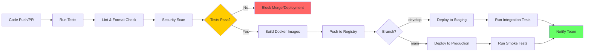

**Backend CI Workflow** (.github/workflows/backend-ci.yml):
```yaml
name: Backend CI

on:
  push:
    branches: [main, develop]
    paths:
      - 'backend/**'
  pull_request:
    branches: [main, develop]
    paths:
      - 'backend/**'

jobs:
  test:
    runs-on: ubuntu-latest
    
    services:
      mongodb:
        image: mongo:7.0
        ports:
          - 27017:27017
      redis:
        image: redis:7.2
        ports:
          - 6379:6379
    
    steps:
      - uses: actions/checkout@v4
      
      - name: Set up Python
        uses: actions/setup-python@v4
        with:
          python-version: '3.12'
          cache: 'pip'
      
      - name: Install dependencies
        run: |
          cd backend
          pip install -r requirements.txt
          pip install -r requirements-dev.txt
      
      - name: Lint with flake8
        run: |
          cd backend
          flake8 src/ --max-line-length=100
      
      - name: Type check with mypy
        run: |
          cd backend
          mypy src/
      
      - name: Check code formatting with black
        run: |
          cd backend
          black --check src/
      
      - name: Security check with bandit
        run: |
          cd backend
          bandit -r src/
      
      - name: Run tests with pytest
        run: |
          cd backend
          pytest tests/ --cov=src --cov-report=xml
        env:
          MONGODB_URI: mongodb://localhost:27017/test
          REDIS_URL: redis://localhost:6379/0
      
      - name: Upload coverage to Codecov
        uses: codecov/codecov-action@v3
        with:
          files: ./backend/coverage.xml
          flags: backend

  build:
    needs: test
    runs-on: ubuntu-latest
    if: github.event_name == 'push'
    
    steps:
      - uses: actions/checkout@v4
      
      - name: Configure AWS credentials
        uses: aws-actions/configure-aws-credentials@v4
        with:
          aws-access-key-id: ${{ secrets.AWS_ACCESS_KEY_ID }}
          aws-secret-access-key: ${{ secrets.AWS_SECRET_ACCESS_KEY }}
          aws-region: us-east-1
      
      - name: Login to Amazon ECR
        id: login-ecr
        uses: aws-actions/amazon-ecr-login@v2
      
      - name: Build and push Docker image
        env:
          ECR_REGISTRY: ${{ steps.login-ecr.outputs.registry }}
          ECR_REPOSITORY: 6nove-3-backend
          IMAGE_TAG: ${{ github.sha }}
        run: |
          cd backend
          docker build -t $ECR_REGISTRY/$ECR_REPOSITORY:$IMAGE_TAG .
          docker push $ECR_REGISTRY/$ECR_REPOSITORY:$IMAGE_TAG
          docker tag $ECR_REGISTRY/$ECR_REPOSITORY:$IMAGE_TAG $ECR_REGISTRY/$ECR_REPOSITORY:latest
          docker push $ECR_REGISTRY/$ECR_REPOSITORY:latest
```

**Frontend CI Workflow** (.github/workflows/frontend-ci.yml):
```yaml
name: Frontend CI

on:
  push:
    branches: [main, develop]
    paths:
      - 'frontend/**'
  pull_request:
    branches: [main, develop]
    paths:
      - 'frontend/**'

jobs:
  test:
    runs-on: ubuntu-latest
    
    steps:
      - uses: actions/checkout@v4
      
      - name: Set up Node.js
        uses: actions/setup-node@v4
        with:
          node-version: '20'
          cache: 'npm'
          cache-dependency-path: frontend/package-lock.json
      
      - name: Install dependencies
        run: |
          cd frontend
          npm ci
      
      - name: Lint with ESLint
        run: |
          cd frontend
          npm run lint
      
      - name: Check formatting with Prettier
        run: |
          cd frontend
          npm run format:check
      
      - name: Type check with TypeScript
        run: |
          cd frontend
          npm run type-check
      
      - name: Run tests with Vitest
        run: |
          cd frontend
          npm run test:ci
      
      - name: Build application
        run: |
          cd frontend
          npm run build
      
      - name: Upload build artifacts
        uses: actions/upload-artifact@v3
        with:
          name: frontend-build
          path: frontend/dist

  deploy-staging:
    needs: test
    runs-on: ubuntu-latest
    if: github.ref == 'refs/heads/develop' && github.event_name == 'push'
    
    steps:
      - uses: actions/checkout@v4
      
      - name: Download build artifacts
        uses: actions/download-artifact@v3
        with:
          name: frontend-build
          path: frontend/dist
      
      - name: Configure AWS credentials
        uses: aws-actions/configure-aws-credentials@v4
        with:
          aws-access-key-id: ${{ secrets.AWS_ACCESS_KEY_ID }}
          aws-secret-access-key: ${{ secrets.AWS_SECRET_ACCESS_KEY }}
          aws-region: us-east-1
      
      - name: Deploy to S3 staging bucket
        run: |
          aws s3 sync frontend/dist/ s3://6nove-3-staging --delete
      
      - name: Invalidate CloudFront cache
        run: |
          aws cloudfront create-invalidation \
            --distribution-id ${{ secrets.CLOUDFRONT_STAGING_ID }} \
            --paths "/*"
```

**Deployment Workflow** (.github/workflows/deploy-production.yml):
```yaml
name: Deploy to Production

on:
  push:
    branches: [main]
  workflow_dispatch:

jobs:
  deploy-backend:
    runs-on: ubuntu-latest
    environment: production
    
    steps:
      - uses: actions/checkout@v4
      
      - name: Configure AWS credentials
        uses: aws-actions/configure-aws-credentials@v4
        with:
          aws-access-key-id: ${{ secrets.AWS_ACCESS_KEY_ID }}
          aws-secret-access-key: ${{ secrets.AWS_SECRET_ACCESS_KEY }}
          aws-region: us-east-1
      
      - name: Deploy to ECS
        run: |
          # Update ECS service with new task definition
          aws ecs update-service \
            --cluster 6nove-3-production \
            --service backend-service \
            --force-new-deployment
      
      - name: Wait for deployment
        run: |
          aws ecs wait services-stable \
            --cluster 6nove-3-production \
            --services backend-service
      
      - name: Run smoke tests
        run: |
          # Execute basic health check
          curl -f https://api.6nove-3.com/health || exit 1

  deploy-frontend:
    runs-on: ubuntu-latest
    environment: production
    
    steps:
      - uses: actions/checkout@v4
      
      - name: Set up Node.js
        uses: actions/setup-node@v4
        with:
          node-version: '20'
          cache: 'npm'
          cache-dependency-path: frontend/package-lock.json
      
      - name: Install and build
        run: |
          cd frontend
          npm ci
          npm run build
        env:
          VITE_API_URL: https://api.6nove-3.com
          VITE_AUTH0_DOMAIN: ${{ secrets.AUTH0_DOMAIN }}
          VITE_AUTH0_CLIENT_ID: ${{ secrets.AUTH0_CLIENT_ID }}
      
      - name: Configure AWS credentials
        uses: aws-actions/configure-aws-credentials@v4
        with:
          aws-access-key-id: ${{ secrets.AWS_ACCESS_KEY_ID }}
          aws-secret-access-key: ${{ secrets.AWS_SECRET_ACCESS_KEY }}
          aws-region: us-east-1
      
      - name: Deploy to S3 production bucket
        run: |
          aws s3 sync frontend/dist/ s3://6nove-3-production --delete
      
      - name: Invalidate CloudFront cache
        run: |
          aws cloudfront create-invalidation \
            --distribution-id ${{ secrets.CLOUDFRONT_PRODUCTION_ID }} \
            --paths "/*"
      
      - name: Notify deployment
        uses: 8398a7/action-slack@v3
        with:
          status: ${{ job.status }}
          text: 'Production deployment completed'
          webhook_url: ${{ secrets.SLACK_WEBHOOK }}
        if: always()
```

**CI/CD Environment Configuration**:

**GitHub Secrets** (Required):
- `AWS_ACCESS_KEY_ID`: AWS credentials for deployment
- `AWS_SECRET_ACCESS_KEY`: AWS secret key
- `AUTH0_DOMAIN`: Auth0 tenant domain
- `AUTH0_CLIENT_ID`: Auth0 application client ID
- `CLOUDFRONT_STAGING_ID`: CloudFront distribution ID for staging
- `CLOUDFRONT_PRODUCTION_ID`: CloudFront distribution ID for production
- `SLACK_WEBHOOK`: Slack notification webhook URL

**Environment-Specific Variables**:
- Development: Local `.env` files (git-ignored)
- Staging: GitHub environment variables for `staging` environment
- Production: GitHub environment variables for `production` environment with required approvals

**CI/CD Best Practices**:
- **Fast Feedback**: Run fast tests first (linting, unit tests), slower tests later (integration, E2E)
- **Fail Fast**: Stop pipeline on first failure to save compute resources
- **Caching**: Cache dependencies and build artifacts for faster runs
- **Parallel Execution**: Run independent jobs concurrently
- **Deployment Gates**: Require manual approval for production deployments
- **Rollback Strategy**: Maintain ability to quickly rollback to previous version
- **Monitoring**: Track deployment metrics and notify on failures

### 3.7.5 Infrastructure as Code: Terraform

**Infrastructure Management**: Terraform for declarative infrastructure provisioning on AWS

**Terraform Structure** (Planned):
```
infrastructure/
├── modules/
│   ├── networking/
│   │   ├── main.tf           # VPC, subnets, route tables
│   │   ├── variables.tf
│   │   └── outputs.tf
│   ├── compute/
│   │   ├── main.tf           # ECS cluster, task definitions
│   │   ├── variables.tf
│   │   └── outputs.tf
│   ├── storage/
│   │   ├── main.tf           # S3 buckets, EBS volumes
│   │   ├── variables.tf
│   │   └── outputs.tf
│   ├── database/
│   │   ├── main.tf           # ElastiCache, DocumentDB config
│   │   ├── variables.tf
│   │   └── outputs.tf
│   └── security/
│       ├── main.tf           # IAM roles, security groups
│       ├── variables.tf
│       └── outputs.tf
├── environments/
│   ├── dev/
│   │   ├── main.tf
│   │   ├── variables.tf
│   │   ├── terraform.tfvars
│   │   └── backend.tf
│   ├── staging/
│   │   ├── main.tf
│   │   ├── variables.tf
│   │   ├── terraform.tfvars
│   │   └── backend.tf
│   └── production/
│       ├── main.tf
│       ├── variables.tf
│       ├── terraform.tfvars
│       └── backend.tf
└── README.md
```

**Example Terraform Configuration** (Backend Infrastructure):

```hcl
# environments/production/main.tf

terraform {
  required_version = ">= 1.6.0"
  
  required_providers {
    aws = {
      source  = "hashicorp/aws"
      version = "~> 5.0"
    }
  }
  
  backend "s3" {
    bucket         = "6nove-3-terraform-state"
    key            = "production/terraform.tfstate"
    region         = "us-east-1"
    encrypt        = true
    dynamodb_table = "terraform-state-lock"
  }
}

provider "aws" {
  region = var.aws_region
  
  default_tags {
    tags = {
      Environment = "production"
      Project     = "6nove-3"
      ManagedBy   = "Terraform"
    }
  }
}

module "networking" {
  source = "../../modules/networking"
  
  vpc_cidr            = "10.0.0.0/16"
  availability_zones  = ["us-east-1a", "us-east-1b", "us-east-1c"]
  public_subnet_cidrs = ["10.0.1.0/24", "10.0.2.0/24", "10.0.3.0/24"]
  private_subnet_cidrs = ["10.0.11.0/24", "10.0.12.0/24", "10.0.13.0/24"]
  
  environment = "production"
  project     = "6nove-3"
}

module "compute" {
  source = "../../modules/compute"
  
  cluster_name        = "6nove-3-production"
  task_cpu            = "1024"
  task_memory         = "2048"
  container_image     = "${var.ecr_registry}/6nove-3-backend:latest"
  desired_count       = 3
  
  vpc_id              = module.networking.vpc_id
  private_subnet_ids  = module.networking.private_subnet_ids
  security_group_ids  = [module.security.ecs_security_group_id]
  
  environment = "production"
}

module "database" {
  source = "../../modules/database"
  
  elasticache_node_type = "cache.t3.medium"
  elasticache_num_nodes = 2
  
  vpc_id             = module.networking.vpc_id
  subnet_ids         = module.networking.private_subnet_ids
  security_group_ids = [module.security.redis_security_group_id]
  
  environment = "production"
}

module "storage" {
  source = "../../modules/storage"
  
  s3_bucket_name     = "6nove-3-production"
  enable_versioning  = true
  enable_encryption  = true
  
  cloudfront_enabled = true
  cloudfront_aliases = ["www.6nove-3.com", "6nove-3.com"]
  
  environment = "production"
}

module "security" {
  source = "../../modules/security"
  
  vpc_id = module.networking.vpc_id
  
  allowed_cidr_blocks = ["0.0.0.0/0"]  # Will be restricted in production
  
  environment = "production"
}
```

**Terraform Workflow**:
1. **Initialize**: `terraform init` - Download providers and initialize backend
2. **Plan**: `terraform plan` - Preview infrastructure changes
3. **Apply**: `terraform apply` - Apply infrastructure changes
4. **Destroy**: `terraform destroy` - Remove infrastructure (with caution)

**State Management**:
- Remote state stored in AWS S3 for team collaboration
- State locking via DynamoDB to prevent concurrent modifications
- Separate state files per environment (dev, staging, production)
- State versioning for rollback capability

**Terraform Best Practices**:
- **Modules**: Reusable infrastructure components
- **Variables**: Parameterize configurations for flexibility
- **Outputs**: Export resource attributes for cross-module communication
- **Remote State**: Enable team collaboration and consistency
- **Workspaces**: Separate environments with distinct state
- **Version Pinning**: Lock provider and module versions
- **Code Review**: Treat infrastructure code like application code with PR reviews
- **Testing**: Use `terraform validate` and `terraform fmt` for validation

**Terraform CI/CD Integration**:
```yaml
# .github/workflows/terraform.yml
name: Terraform

on:
  push:
    branches: [main]
    paths:
      - 'infrastructure/**'
  pull_request:
    branches: [main]
    paths:
      - 'infrastructure/**'

jobs:
  terraform:
    runs-on: ubuntu-latest
    
    steps:
      - uses: actions/checkout@v4
      
      - name: Setup Terraform
        uses: hashicorp/setup-terraform@v3
        with:
          terraform_version: 1.6.0
      
      - name: Terraform Format Check
        run: terraform fmt -check -recursive infrastructure/
      
      - name: Terraform Init
        run: |
          cd infrastructure/environments/production
          terraform init
        env:
          AWS_ACCESS_KEY_ID: ${{ secrets.AWS_ACCESS_KEY_ID }}
          AWS_SECRET_ACCESS_KEY: ${{ secrets.AWS_SECRET_ACCESS_KEY }}
      
      - name: Terraform Validate
        run: |
          cd infrastructure/environments/production
          terraform validate
      
      - name: Terraform Plan
        run: |
          cd infrastructure/environments/production
          terraform plan -out=tfplan
        env:
          AWS_ACCESS_KEY_ID: ${{ secrets.AWS_ACCESS_KEY_ID }}
          AWS_SECRET_ACCESS_KEY: ${{ secrets.AWS_SECRET_ACCESS_KEY }}
      
      - name: Terraform Apply
        if: github.ref == 'refs/heads/main' && github.event_name == 'push'
        run: |
          cd infrastructure/environments/production
          terraform apply -auto-approve tfplan
        env:
          AWS_ACCESS_KEY_ID: ${{ secrets.AWS_ACCESS_KEY_ID }}
          AWS_SECRET_ACCESS_KEY: ${{ secrets.AWS_SECRET_ACCESS_KEY }}
```

### 3.7.6 Development to Production Pipeline

**Environment Strategy**:

| Environment | Purpose | Infrastructure | Deployment Trigger |
|-------------|---------|----------------|-------------------|
| Local | Developer workstation | Docker Compose, local services | Manual (developer) |
| Development | Integration testing | Shared AWS dev environment | Automatic on feature branch merge to `develop` |
| Staging | Pre-production validation | Production-like AWS environment | Automatic on `develop` branch push |
| Production | Live customer-facing system | Full AWS production infrastructure | Manual approval + `main` branch push |

**Promotion Strategy**:
1. Developer creates feature branch from `develop`
2. Pull request triggers CI checks (tests, linting, security)
3. Code review and approval required
4. Merge to `develop` triggers deployment to staging
5. Staging validation (automated + manual testing)
6. Create pull request from `develop` to `main`
7. Production deployment approval required
8. Merge to `main` triggers production deployment
9. Smoke tests verify production health
10. Team notification of deployment status

**Rollback Strategy**:
- ECS: Revert to previous task definition
- Frontend: Restore previous S3 object versions
- Database: Point-in-time recovery (PITR) for critical issues
- Infrastructure: Terraform state rollback to previous version

## 3.8 Technology Stack Validation & Next Steps

### 3.8.1 Validation Requirements

This planned technology stack must be validated against actual system requirements once they are defined. The following validation activities are required before finalizing technology selections:

**Requirements Validation**:
- Confirm platform requirements (web, mobile, desktop) based on user needs
- Validate performance and scalability requirements against technology capabilities
- Assess security and compliance requirements (GDPR, HIPAA, SOC 2, etc.)
- Determine integration requirements with existing systems or third-party services

**Architecture Validation**:
- Review technology stack against defined architectural patterns (microservices, monolith, serverless)
- Validate database selection against data model and query patterns
- Confirm cloud platform choice aligns with organizational policies
- Assess need for all proposed platforms (e.g., are native mobile apps required?)

**Team Capabilities Assessment**:
- Evaluate team's existing expertise with proposed technologies
- Identify skill gaps and training requirements
- Consider learning curve for new technologies
- Assess availability of external resources or consultants

**Cost Analysis**:
- Estimate infrastructure costs at expected scale
- Calculate third-party service costs (Auth0, MongoDB Atlas, AWS services)
- Project development tool and license costs
- Compare alternatives for cost optimization

### 3.8.2 Technology Decision Framework

When finalizing technology selections, apply the following decision criteria:

**Evaluation Criteria**:
1. **Requirements Fit** (40%): How well does the technology meet functional and non-functional requirements?
2. **Team Expertise** (25%): Does the team have experience or can they learn quickly?
3. **Ecosystem Maturity** (15%): Is there strong community support, documentation, and tooling?
4. **Total Cost of Ownership** (10%): Including licenses, infrastructure, and operational costs
5. **Risk Assessment** (10%): Vendor lock-in, technology obsolescence, security concerns

**Decision Documentation**:
For each major technology decision, document:
- **Context**: What requirement or problem does this address?
- **Options Considered**: What alternatives were evaluated?
- **Decision**: Which technology was selected?
- **Rationale**: Why was this choice made over alternatives?
- **Consequences**: What are the implications (positive and negative)?

### 3.8.3 Immediate Next Steps

To move from this planned technology stack to implementation readiness:

**Week 1-2: Requirements Finalization**
1. Complete stakeholder interviews per Section 2.7
2. Define platform requirements (web, mobile, desktop needs)
3. Establish performance, scalability, and security requirements
4. Prioritize features and identify MVP scope

**Week 3-4: Technology Validation**
1. Validate technology stack against finalized requirements
2. Create proof-of-concept for critical technical uncertainties
3. Assess team capabilities and create training plan
4. Finalize technology selections with documented decisions

**Week 5-6: Development Environment Setup**
1. Provision development infrastructure (AWS accounts, MongoDB Atlas, Auth0)
2. Set up GitHub repository structure with CI/CD pipelines
3. Create Docker development environment
4. Generate project scaffolding and boilerplate code

**Week 7-8: Infrastructure Provisioning**
1. Implement Terraform infrastructure as code
2. Provision staging environment
3. Configure monitoring and logging
4. Establish backup and disaster recovery procedures

### 3.8.4 Risk Mitigation

**Technical Risks**:

| Risk | Impact | Mitigation Strategy |
|------|--------|-------------------|
| Technology stack complexity | High | Start with MVP using subset of technologies; add platforms incrementally |
| Team learning curve | Medium | Allocate time for training; consider pairing or mentorship |
| Third-party service costs | Medium | Monitor usage closely; set billing alerts; consider self-hosted alternatives |
| Vendor lock-in (AWS, Auth0) | Medium | Use abstraction layers; avoid vendor-specific features where possible |
| MongoDB schema design complexity | Medium | Conduct data modeling workshops; create schema documentation |
| LangChain API changes | Low | Pin specific versions; monitor changelogs; allocate time for upgrades |

**Operational Risks**:

| Risk | Impact | Mitigation Strategy |
|------|--------|-------------------|
| Infrastructure cost overruns | High | Set AWS budgets; review costs weekly; optimize resource usage |
| Deployment failures | Medium | Implement blue-green deployments; maintain rollback procedures |
| Security vulnerabilities | High | Automated security scanning; dependency updates; security audit |
| Service outages | Medium | Multi-AZ deployment; health checks; incident response plan |

### 3.8.5 Alternative Technology Considerations

As requirements are finalized, consider these alternatives if the default stack doesn't align:

**Backend Alternatives**:
- **Node.js + Express**: If JavaScript expertise is stronger than Python
- **Go**: For high-performance requirements with low resource usage
- **Ruby on Rails**: For rapid development with strong conventions

**Database Alternatives**:
- **PostgreSQL**: If relational data model and ACID transactions are required
- **DynamoDB**: For serverless architecture with AWS Lambda
- **Supabase**: For real-time features and simpler backend architecture

**Authentication Alternatives**:
- **AWS Cognito**: For tighter AWS integration and lower cost
- **Supabase Auth**: For open-source alternative
- **Custom JWT Implementation**: For complete control (higher development cost)

**Mobile Alternatives**:
- **Flutter**: For alternative cross-platform framework with excellent performance
- **Progressive Web App (PWA)**: For web-based mobile experience without native apps
- **Native Only**: If cross-platform code sharing isn't valuable

### 3.8.6 Technology Stack Roadmap

**Phase 1: MVP (Months 1-3)**
- Core backend API (Python + Flask)
- Web frontend (React + TypeScript)
- MongoDB database
- AWS basic infrastructure (EC2, S3, RDS)
- Auth0 authentication
- GitHub Actions CI/CD

**Phase 2: Mobile Expansion (Months 4-6)**
- React Native mobile applications (iOS + Android)
- Mobile-specific API endpoints
- Push notification integration
- Mobile app deployment pipelines

**Phase 3: Scale & Optimize (Months 7-9)**
- Container orchestration (ECS/EKS)
- Redis caching implementation
- CloudFront CDN
- Advanced monitoring (DataDog/New Relic)
- Performance optimization

**Phase 4: Advanced Features (Months 10-12)**
- AI/ML features with LangChain
- Native applications (if validated as needed)
- Desktop application (Electron)
- Advanced analytics and BI

**Ongoing**:
- Security updates and dependency management
- Infrastructure optimization
- Technology evaluation and upgrades

## 3.9 Technology Stack Summary

### 3.9.1 Stack Overview Table

| Category | Technology | Version | Status | Justification |
|----------|-----------|---------|--------|---------------|
| **Backend Language** | Python | 3.12+ | Planned | AI/ML ecosystem, Flask compatibility, developer productivity |
| **Backend Framework** | Flask | 3.0+ | Planned | Lightweight, flexible, excellent REST API support |
| **AI Framework** | LangChain | 0.1.0+ | Planned | LLM orchestration, chain composition, document processing |
| **Frontend Language** | TypeScript | 5.3+ | Planned | Type safety, enhanced DX, JavaScript ecosystem access |
| **Web Framework** | React | 18.2+ | Planned | Industry standard, component architecture, rich ecosystem |
| **CSS Framework** | Tailwind CSS | 3.4+ | Planned | Utility-first, design consistency, performance optimization |
| **Mobile Framework** | React Native | 0.73+ | Planned | Cross-platform, React knowledge transfer, native performance |
| **iOS Native** | Swift | 5.9+ | Planned | Apple's preferred language, modern features, SwiftUI support |
| **Android Native** | Kotlin | 1.9+ | Planned | Google's preferred language, null safety, coroutines |
| **macOS Native** | Objective-C | 2.0 | Planned | Legacy compatibility, framework access, C/C++ interop |
| **Desktop Framework** | Electron.js | 28.0+ | Planned | Cross-platform desktop, web technology leverage, mature ecosystem |
| **Primary Database** | MongoDB | 7.0+ | Planned | Flexible schema, developer productivity, vector search support |
| **Caching** | Redis | 7.2+ | Planned | In-memory performance, versatile data structures, session storage |
| **Authentication** | Auth0 | Latest | Planned | Universal login, MFA, social login, enterprise SSO |
| **Cloud Platform** | AWS | Latest | Planned | Comprehensive services, reliability, global infrastructure |
| **LLM Provider** | OpenAI | Latest | Planned | GPT-4/3.5 access, embeddings, content moderation |
| **Object Storage** | Amazon S3 | Latest | Planned | Durability, scalability, cost-effective storage |
| **CDN** | CloudFront | Latest | Planned | Global edge network, DDoS protection, AWS integration |
| **Containerization** | Docker | Latest | Planned | Environment consistency, deployment flexibility |
| **Infrastructure as Code** | Terraform | 1.6+ | Planned | Declarative infrastructure, multi-cloud support, state management |
| **CI/CD** | GitHub Actions | Latest | Planned | GitHub integration, workflow flexibility, free tier for open source |
| **Monitoring** | AWS CloudWatch | Latest | Planned | AWS native, metrics and logs, alarms and dashboards |
| **Error Tracking** | Sentry | Latest | Planned | Real-time error tracking, stack traces, release tracking |

### 3.9.2 Platform Architecture Matrix

| Platform | Language | Framework | UI Library | Build Tool | Deployment Target |
|----------|----------|-----------|-----------|------------|-------------------|
| Backend API | Python 3.12 | Flask 3.0 | N/A | Docker | AWS ECS/EC2 |
| Web Application | TypeScript 5.3 | React 18.2 | Tailwind CSS 3.4 | Vite 5.0 | S3 + CloudFront |
| iOS Mobile | TypeScript 5.3 | React Native 0.73 | React Native Components | Metro | App Store |
| Android Mobile | TypeScript 5.3 | React Native 0.73 | React Native Components | Metro/Gradle | Google Play |
| iOS Native | Swift 5.9 | UIKit/SwiftUI | Native | Xcode | App Store |
| Android Native | Kotlin 1.9 | Jetpack Compose | Native | Android Studio | Google Play |
| macOS Application | Objective-C 2.0 | Cocoa | Native | Xcode | Mac App Store |
| Desktop Application | TypeScript 5.3 | Electron 28.0 | React + Tailwind | electron-builder | Direct Download |

### 3.9.3 Key Technology Integration Points

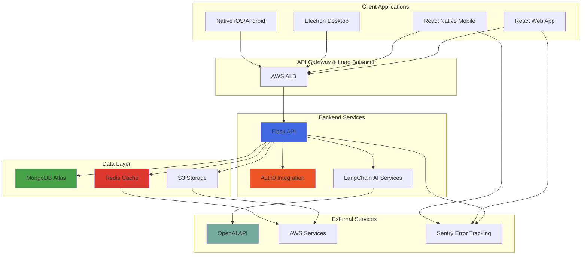

### 3.9.4 Development Timeline Estimate

Based on this technology stack, estimated implementation timeline:

**Infrastructure Setup**: 2-3 weeks
- AWS account configuration and Terraform setup
- MongoDB Atlas and Auth0 tenant creation
- GitHub Actions CI/CD pipelines
- Development environment Docker Compose

**Backend Development**: 6-8 weeks (MVP)
- Flask API structure and core endpoints
- MongoDB data models and queries
- Auth0 authentication integration
- LangChain AI features (if in MVP)
- Testing and documentation

**Web Frontend Development**: 6-8 weeks (MVP)
- React application structure
- Tailwind CSS design system
- Core user interface components
- API integration and state management
- Testing and responsive design

**Mobile Development**: 8-10 weeks
- React Native application setup
- Platform-specific configurations
- Navigation and core screens
- API integration
- Testing on iOS and Android devices

**Native Applications**: 10-12 weeks (if required)
- iOS: Swift development
- Android: Kotlin development
- macOS: Objective-C development
- Platform-specific features and testing

**Desktop Application**: 6-8 weeks (if required)
- Electron setup and configuration
- Desktop-specific features
- Installers and auto-update
- Cross-platform testing (Windows, macOS, Linux)

**Total Estimated Timeline**: 4-9 months depending on platform scope and team size

---

#### References

## 3.10 Technical Specification Sections Reviewed

This Technology Stack section was developed based on comprehensive analysis of the following technical specification sections:

- **Section 1.1 Executive Summary**: Project overview and current development stage assessment
- **Section 1.2 System Overview**: System context and development phase understanding
- **Section 1.3 Scope**: Scope definition status and boundary establishment requirements
- **Section 1.4 Next Steps for Specification Completion**: Technical planning activities and recommended next steps
- **Section 1.5 Document Evolution**: Documentation versioning and evolution strategy
- **Section 2.1 Product Requirements Status**: Requirements definition status and prerequisites
- **Section 2.2 Product Requirements Framework**: Requirements structure and templates
- **Section 2.3 Requirements Organization Structure**: Requirements categorization approach
- **Section 2.5 Implementation Considerations Framework**: Technical constraints and implementation templates
- **Section 2.7 Next Steps for Requirements Definition**: Requirements gathering roadmap and stakeholder identification
- **Section 2.8 References**: Repository artifacts and methodology references

## 3.11 Repository Artifacts Examined

**Files Reviewed**:
- `README.md` - Project identification and repository initialization confirmation

**Repository Metadata**:
- Git commit history (initial commit: 5fe5251833aebfc1715a72cb8c74a0171e0edf2a)
- Repository creation date: November 6, 2025
- Repository owner: ShaliniTesting
- Repository name: 6nove_3

## 3.12 Technology Documentation Sources

**Official Documentation** (for validation and version information):
- Python: https://docs.python.org/3/
- Flask: https://flask.palletsprojects.com/
- LangChain: https://docs.langchain.com/
- React: https://react.dev/
- TypeScript: https://www.typescriptlang.org/docs/
- Tailwind CSS: https://tailwindcss.com/docs
- React Native: https://reactnative.dev/docs
- Swift: https://swift.org/documentation/
- Kotlin: https://kotlinlang.org/docs/
- Electron: https://www.electronjs.org/docs
- MongoDB: https://docs.mongodb.com/
- Redis: https://redis.io/docs/
- Auth0: https://auth0.com/docs
- AWS: https://docs.aws.amazon.com/
- Docker: https://docs.docker.com/
- Terraform: https://www.terraform.io/docs
- GitHub Actions: https://docs.github.com/en/actions

## 3.13 Methodology

This Technology Stack section was developed using the following methodology:

1. **Repository Analysis**: Comprehensive examination of repository contents, structure, and git history to establish current implementation state
2. **Specification Review**: Thorough analysis of all existing technical specification sections to understand project context and phase
3. **Default Stack Integration**: Incorporation of provided default technology stack as the baseline for planned architecture
4. **Technology Justification**: Research-based rationale for each technology selection considering industry best practices, ecosystem maturity, and integration requirements
5. **Comprehensive Documentation**: Detailed coverage of all technology stack layers from programming languages through deployment infrastructure
6. **Validation Framework**: Establishment of validation criteria and next steps for confirming technology selections against actual requirements
7. **Future-Proofing**: Consideration of alternatives, scalability path, and technology evolution for long-term project success

---

**Document Status**: Planned Technology Stack - Pending Requirements Validation
**Last Updated**: November 6, 2025
**Version**: 0.1.0
**Next Review**: Upon completion of requirements definition (Section 2.7)

# 4. Process Flowchart

## 4.1 Process Flowchart Overview

### 4.1.1 Implementation Status

**Critical Context**: This Process Flowchart section documents the **planned architecture** for the 6nove_3 system. The repository is currently in pre-implementation phase (initialized November 6, 2025) with no implemented code beyond a README.md file. All workflows, process flows, and integrations described in this section represent the intended system design based on the comprehensive technology stack and architecture documentation detailed in Section 3 (Technology Stack).

The process flowcharts serve as:
- **Architectural Blueprint**: Defining intended system behaviors and integration patterns
- **Development Roadmap**: Guiding implementation of workflows and business processes
- **Validation Framework**: Establishing expected process flows for future validation during development
- **Integration Guide**: Documenting planned interactions between system components and third-party services

### 4.1.2 Flowchart Conventions

Throughout this section, the following conventions apply:

**Diagram Notation**:
- **Rectangle**: Process step or action
- **Diamond**: Decision point requiring conditional logic
- **Rounded Rectangle**: Start/end point
- **Parallelogram**: Input/output operation
- **Cylinder**: Database or storage operation
- **Cloud**: External service or API call

**Swim Lanes**: Diagrams use swim lanes to distinguish between:
- **User/Client**: End-user actions and client applications
- **API Gateway**: AWS Application Load Balancer layer
- **Application**: Flask backend services
- **AI Services**: LangChain and LLM processing
- **Data Layer**: MongoDB, Redis, S3 operations
- **External Services**: Third-party integrations (Auth0, OpenAI, AWS services)

**Timing Annotations**: Where applicable, diagrams include timing considerations and SLA targets based on planned performance criteria.

---

## 4.2 High-Level System Workflow

### 4.2.1 System Architecture Overview

The 6nove_3 system follows a multi-tier architecture with clear separation of concerns across presentation, application, AI processing, and data layers.

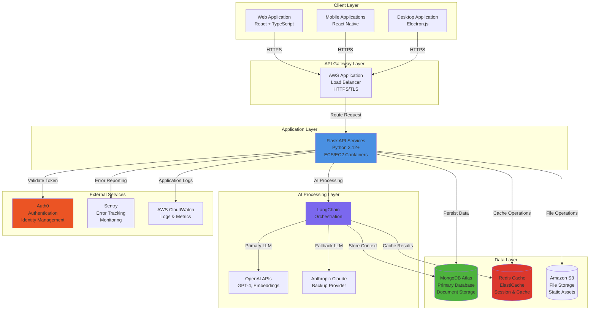

### 4.2.2 Request Processing Flow Overview

The standard request-response cycle follows a consistent pattern across all API endpoints:

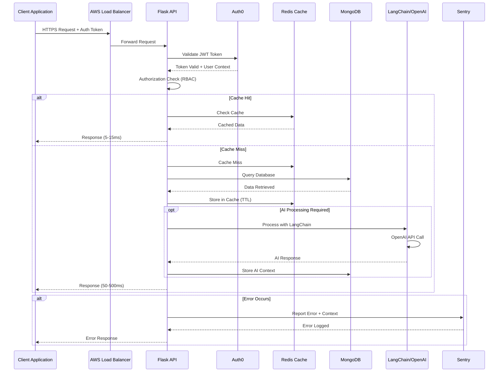

---

## 4.3 Authentication & Authorization Workflow

### 4.3.1 User Authentication Flow (Auth0 Integration)

The authentication process leverages Auth0's Universal Login for secure, centralized identity management across all client platforms.

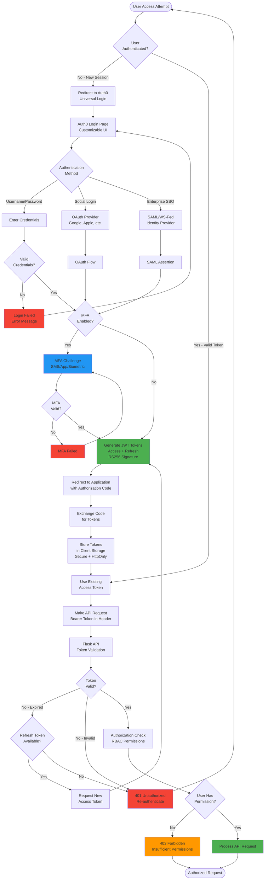

### 4.3.2 Authorization & Role-Based Access Control (RBAC)

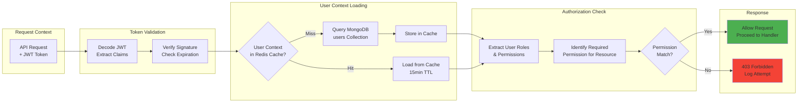

### 4.3.3 Session Management

**Session State Storage**:
- **Access Tokens**: Short-lived (15-60 minutes), stored in memory or secure storage
- **Refresh Tokens**: Long-lived (7-30 days), stored in secure HttpOnly cookies
- **Session Metadata**: Cached in Redis with 30-minute to 24-hour TTL

**Token Refresh Flow**:
```
Token Expiry → Client Detects → Send Refresh Token to Auth0 
→ Validate Refresh Token → Generate New Access Token 
→ Return to Client → Update Local Storage → Resume Operations
```

---

## 4.4 API Request/Response Processing Workflow

### 4.4.1 Standard API Request Flow

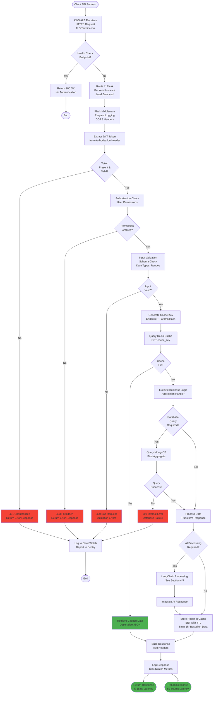

### 4.4.2 Cache-Aside Pattern Implementation

The system implements a cache-aside (lazy loading) pattern for optimal performance:

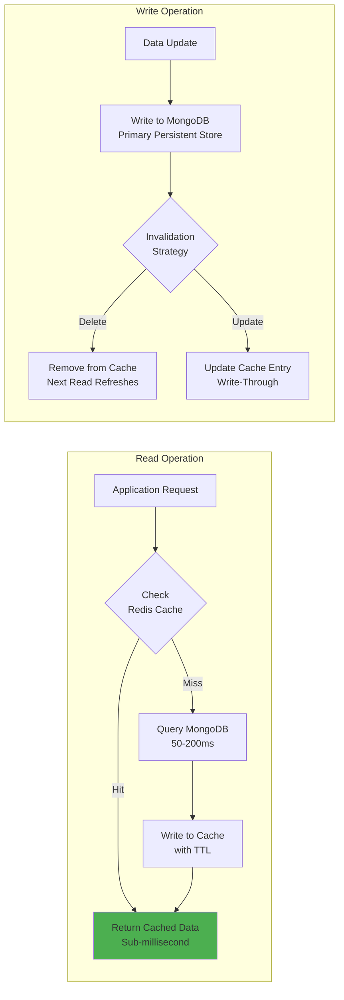

**Cache TTL Strategy**:
- **Session Data**: 30 minutes - 24 hours
- **API Responses**: 5 minutes - 1 hour (based on data volatility)
- **User Profiles**: 15 minutes
- **Static Configuration**: 24 hours
- **AI Conversation Context**: 1 hour

**Cache Key Convention**:
```
Pattern: <resource_type>:<identifier>:<optional_qualifier>
Examples:
  - user:12345:profile
  - api:v1:/users:params:abc123
  - session:token:xyz789
  - ai:conversation:conv_abc123
```

### 4.4.3 Rate Limiting & Throttling

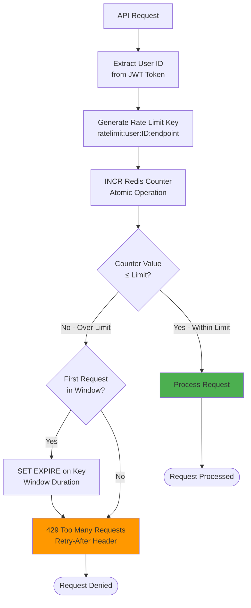

**Planned Rate Limits** (To Be Defined Based on Requirements):
- Authenticated Users: TBD requests per minute
- Anonymous Users: TBD requests per minute
- AI Endpoints: TBD requests per minute (cost control)
- File Upload: TBD MB per hour

---

## 4.5 AI/LLM Processing Workflow

### 4.5.1 LangChain Orchestration Flow

```mermaid
graph TB
    START([AI Request]) --> CONTEXT_LOAD[Load Conversation Context<br/>MongoDB ai_conversations]
    
    CONTEXT_LOAD --> CACHE_CHECK{Context<br/>in Redis?}
    
    CACHE_CHECK -->|Hit| LOAD_CACHE[Load from Cache<br/>1hr TTL]
    CACHE_CHECK -->|Miss| LOAD_DB[Load from MongoDB<br/>conversation_id]
    LOAD_DB --> STORE_CACHE[Cache Context<br/>Redis SET]
    STORE_CACHE --> LOAD_CACHE
    
    LOAD_CACHE --> PROMPT_BUILD[Build Prompt<br/>LangChain Template<br/>Inject Context]
    
    PROMPT_BUILD --> MODERATION[Content Moderation<br/>OpenAI Moderation API]
    
    MODERATION --> MOD_CHECK{Content<br/>Safe?}
    
    MOD_CHECK -->|No| MOD_REJECT[Reject Request<br/>400 Bad Request<br/>Policy Violation]
    MOD_REJECT --> MOD_END([End])
    
    MOD_CHECK -->|Yes| EMBEDDINGS_REQUIRED{Semantic Search<br/>Required?}
    
    EMBEDDINGS_REQUIRED -->|Yes| GENERATE_EMB[Generate Embeddings<br/>OpenAI text-embedding-3]
    GENERATE_EMB --> VECTOR_SEARCH[MongoDB Vector Search<br/>Atlas Search<br/>1536 Dimensions]
    VECTOR_SEARCH --> RETRIEVE_DOCS[Retrieve Similar Documents<br/>Top-K Results]
    RETRIEVE_DOCS --> INJECT_CONTEXT[Inject Retrieved Context<br/>into Prompt]
    INJECT_CONTEXT --> LLM_CALL
    
    EMBEDDINGS_REQUIRED -->|No| LLM_CALL[LangChain Chain Execution]
    
    LLM_CALL --> PROVIDER{Select<br/>LLM Provider}
    
    PROVIDER -->|Primary| OPENAI_CALL[OpenAI API Call<br/>GPT-4 Turbo or<br/>GPT-3.5 Turbo]
    PROVIDER -->|Fallback| CLAUDE_CALL[Anthropic Claude API<br/>Opus/Sonnet/Haiku]
    
    OPENAI_CALL --> LLM_RESPONSE{API<br/>Success?}
    CLAUDE_CALL --> LLM_RESPONSE
    
    LLM_RESPONSE -->|No - Error| ERROR_HANDLE{Retry<br/>Possible?}
    
    ERROR_HANDLE -->|Yes - Rate Limit| RETRY_DELAY[Exponential Backoff<br/>Wait & Retry]
    RETRY_DELAY --> PROVIDER
    
    ERROR_HANDLE -->|Yes - Provider Failure| FALLBACK{Fallback<br/>Provider<br/>Available?}
    FALLBACK -->|Yes| SWITCH_PROVIDER[Switch to Claude]
    SWITCH_PROVIDER --> CLAUDE_CALL
    FALLBACK -->|No| LLM_ERROR[503 Service Unavailable<br/>AI Service Error]
    
    ERROR_HANDLE -->|No - Invalid Request| LLM_ERROR
    LLM_ERROR --> ERROR_LOG[Log Error to Sentry<br/>CloudWatch Alarm]
    ERROR_LOG --> ERROR_END([End])
    
    LLM_RESPONSE -->|Yes| PARSE_RESPONSE[Parse LLM Response<br/>Extract Structured Data]
    
    PARSE_RESPONSE --> UPDATE_CONTEXT[Update Conversation Context<br/>Add User Query + AI Response]
    
    UPDATE_CONTEXT --> PERSIST[Persist to MongoDB<br/>ai_conversations Collection]
    
    PERSIST --> UPDATE_CACHE[Update Redis Cache<br/>Conversation Context]
    
    UPDATE_CACHE --> COST_TRACK[Track Token Usage<br/>Cost Monitoring<br/>CloudWatch Metrics]
    
    COST_TRACK --> RESPONSE[Return AI Response<br/>to Client]
    
    RESPONSE --> SUCCESS([End])
    
    style OPENAI_CALL fill:#4A90E2
    style CLAUDE_CALL fill:#7B68EE
    style VECTOR_SEARCH fill:#4DB33D
    style LLM_ERROR fill:#F44336
    style RESPONSE fill:#4CAF50
```

### 4.5.2 Semantic Search with Vector Embeddings

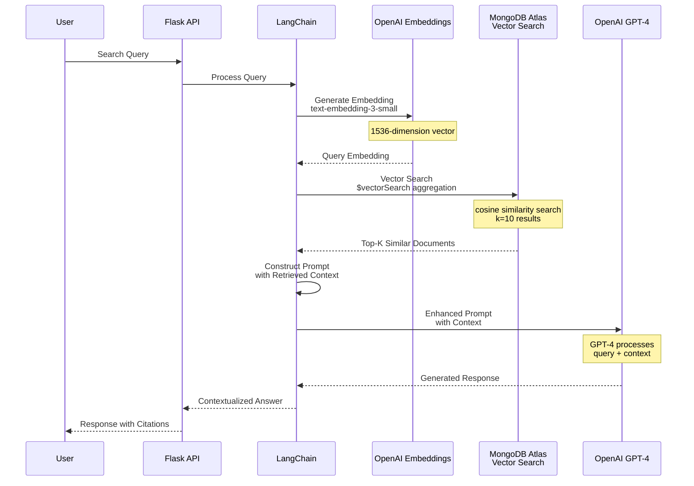

### 4.5.3 AI Error Handling & Circuit Breaker

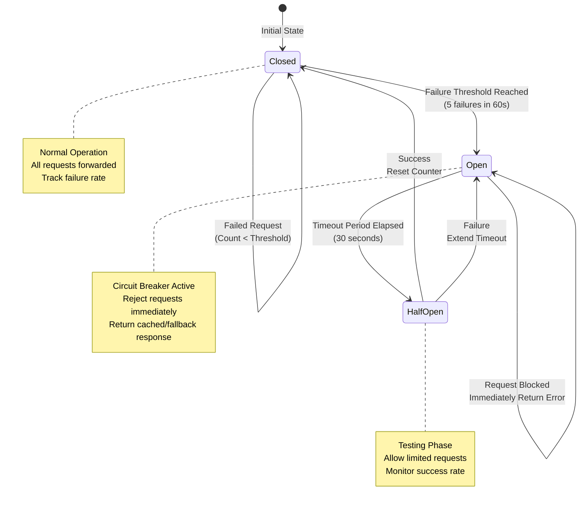

**Circuit Breaker Configuration**:
- **Failure Threshold**: 5 failures within 60-second window
- **Open State Duration**: 30 seconds
- **Half-Open Test Requests**: 3 test requests
- **Success Threshold**: 2/3 successful requests to close circuit
- **Fallback Strategy**: Return cached response or degraded service message

---

## 4.6 Data Persistence & Caching Workflow

### 4.6.1 MongoDB Data Operations Flow

```mermaid
graph TB
    subgraph "Data Write Operations"
        WRITE_START[Data Write Request] --> VALIDATE[Validate Data Schema<br/>Mongoose/Pydantic]
        VALIDATE --> VALID{Schema<br/>Valid?}
        VALID -->|No| VALIDATION_ERROR[400 Bad Request<br/>Schema Errors]
        VALID -->|Yes| TRANSACTION{Transaction<br/>Required?}
        
        TRANSACTION -->|Yes - Multi-Document| START_TX[Start MongoDB Transaction<br/>Session]
        START_TX --> WRITE_OPS[Execute Write Operations<br/>insertOne, updateOne, etc.]
        WRITE_OPS --> TX_SUCCESS{All Operations<br/>Succeed?}
        TX_SUCCESS -->|No| ROLLBACK[Rollback Transaction<br/>Abort Session]
        ROLLBACK --> WRITE_ERROR
        TX_SUCCESS -->|Yes| COMMIT[Commit Transaction]
        COMMIT --> AUDIT_LOG
        
        TRANSACTION -->|No - Single Document| WRITE_SINGLE[Execute Single Write<br/>Atomic Operation]
        WRITE_SINGLE --> WRITE_SUCCESS{Write<br/>Acknowledged?}
        WRITE_SUCCESS -->|No| WRITE_ERROR[500 Database Error<br/>Log to Sentry]
        WRITE_SUCCESS -->|Yes| AUDIT_LOG[Write Audit Log Entry<br/>audit_logs Collection]
        
        AUDIT_LOG --> INVALIDATE_CACHE[Invalidate Related<br/>Redis Cache Keys]
        INVALIDATE_CACHE --> WRITE_END([Write Complete])
    end
    
    subgraph "Data Read Operations"
        READ_START[Data Read Request] --> INDEX_CHECK[Query Planner<br/>Index Selection]
        INDEX_CHECK --> INDEXED{Query Uses<br/>Index?}
        
        INDEXED -->|No| COLLECTION_SCAN[Collection Scan<br/>Slow Query Warning]
        COLLECTION_SCAN --> SLOW_QUERY_LOG[Log Slow Query<br/>CloudWatch]
        SLOW_QUERY_LOG --> EXECUTE_READ
        
        INDEXED -->|Yes| INDEX_SCAN[Index Scan<br/>Optimized Query]
        INDEX_SCAN --> EXECUTE_READ[Execute Query<br/>find/aggregate]
        
        EXECUTE_READ --> READ_SUCCESS{Documents<br/>Found?}
        READ_SUCCESS -->|No| EMPTY_RESULT[Return Empty Result<br/>200 OK or 404]
        READ_SUCCESS -->|Yes| TRANSFORM[Transform Documents<br/>Serialize to JSON]
        
        TRANSFORM --> CACHE_WRITE[Write to Redis Cache<br/>with TTL]
        CACHE_WRITE --> READ_END([Return Data])
    end
    
    style WRITE_END fill:#4CAF50
    style READ_END fill:#4CAF50
    style VALIDATION_ERROR fill:#F44336
    style WRITE_ERROR fill:#F44336
    style COLLECTION_SCAN fill:#FF9800
```

### 4.6.2 Redis Caching Operations

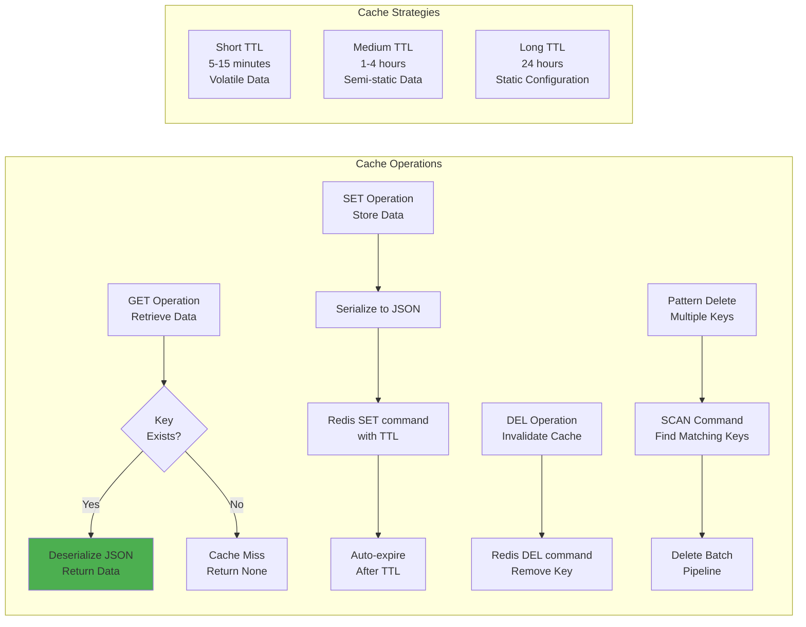

**Cache Performance Targets**:
- **Cache Hit Ratio**: Target >80%
- **Latency**: Sub-millisecond for cache operations
- **Availability**: 99.9% with ElastiCache Multi-AZ
- **Failover**: Automatic with <1 minute recovery
- **Graceful Degradation**: Fallback to MongoDB on cache unavailability

### 4.6.3 Data Consistency & Synchronization

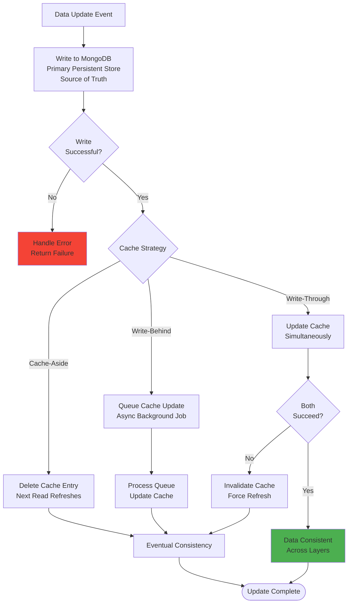

---

## 4.7 File Upload & Download Workflow

### 4.7.1 File Upload Process

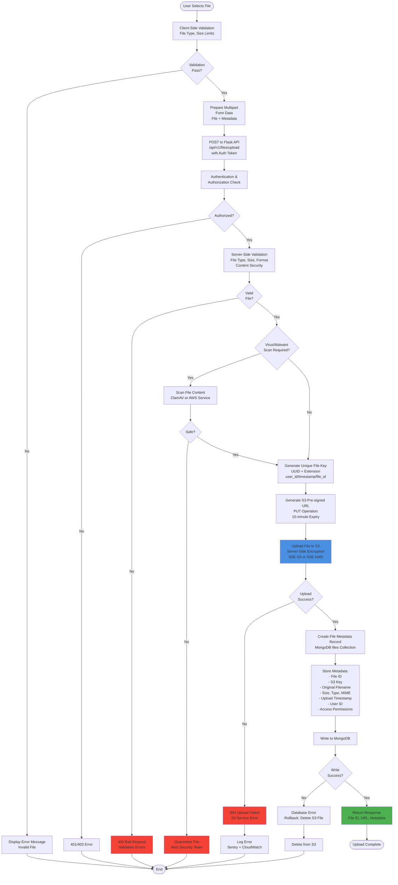

### 4.7.2 File Download Process

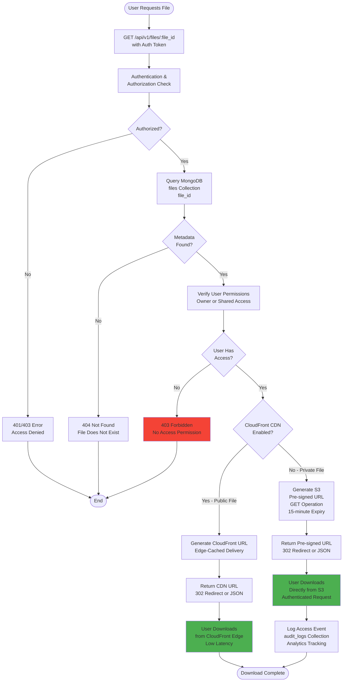

### 4.7.3 File Storage Organization

**S3 Bucket Structure** (Planned):
```
s3://6nove-3-production/
├── uploads/
│   ├── users/
│   │   ├── {user_id}/
│   │   │   ├── {timestamp}/
│   │   │   │   ├── {file_id}.{ext}
│   ├── shared/
│   │   ├── {shared_id}/
│   │   │   ├── {file_id}.{ext}
├── static/
│   ├── images/
│   ├── documents/
│   ├── assets/
├── backups/
│   ├── {date}/
│       ├── {backup_file}
```

**Access Control**:
- **Private Buckets**: Default deny, IAM role-based access
- **Pre-signed URLs**: Time-limited, operation-specific (GET/PUT)
- **CloudFront Signed URLs**: For private content with CDN delivery
- **Lifecycle Policies**: Auto-transition to Glacier for archival, auto-delete temporary files

---

## 4.8 CI/CD Pipeline Workflow

### 4.8.1 Complete CI/CD Pipeline

```mermaid
graph TB
    subgraph "Code Changes"
        DEV[Developer Commits Code] --> BRANCH{Branch?}
        BRANCH -->|Feature Branch| PR[Create Pull Request<br/>to develop]
        BRANCH -->|develop Branch| PUSH_DEV[Push to develop]
        BRANCH -->|main Branch| PUSH_MAIN[Push to main]
    end
    
    subgraph "Continuous Integration"
        PR --> CI_TRIGGER[GitHub Actions<br/>CI Workflow Triggered]
        PUSH_DEV --> CI_TRIGGER
        PUSH_MAIN --> CI_TRIGGER
        
        CI_TRIGGER --> CHECKOUT[Checkout Code<br/>actions/checkout@v4]
        
        CHECKOUT --> PARALLEL{Run in Parallel}
        
        PARALLEL --> LINT[Linting<br/>flake8, ESLint<br/>Code Style Check]
        PARALLEL --> TYPE_CHECK[Type Checking<br/>mypy, TypeScript<br/>Static Analysis]
        PARALLEL --> FORMAT[Format Check<br/>black, Prettier<br/>Code Formatting]
        PARALLEL --> SECURITY_SCAN[Security Scan<br/>bandit, npm audit<br/>Vulnerability Detection]
        
        LINT --> CHECKS_DONE
        TYPE_CHECK --> CHECKS_DONE
        FORMAT --> CHECKS_DONE
        SECURITY_SCAN --> CHECKS_DONE
        
        CHECKS_DONE[All Checks Complete] --> CHECKS_PASS{All Checks<br/>Pass?}
        
        CHECKS_PASS -->|No| FAIL_CI[CI Failed<br/>Block Merge<br/>Notify Developer]
        FAIL_CI --> CI_END([End])
        
        CHECKS_PASS -->|Yes| UNIT_TESTS[Run Unit Tests<br/>pytest, Vitest<br/>with Coverage]
        
        UNIT_TESTS --> TEST_SERVICES[Start Test Services<br/>MongoDB, Redis<br/>Docker Containers]
        
        TEST_SERVICES --> INTEGRATION_TESTS[Run Integration Tests<br/>API Tests<br/>Database Tests]
        
        INTEGRATION_TESTS --> TESTS_PASS{All Tests<br/>Pass?}
        
        TESTS_PASS -->|No| FAIL_TESTS[Tests Failed<br/>Block Merge<br/>Coverage Report]
        FAIL_TESTS --> CI_END
        
        TESTS_PASS -->|Yes| COVERAGE[Upload Coverage<br/>to Codecov<br/>Generate Reports]
        
        COVERAGE --> BUILD[Build Application<br/>Docker Images]
    end
    
    subgraph "Build Process"
        BUILD --> BUILD_BACKEND[Build Backend Image<br/>Multi-stage Docker<br/>Python 3.12]
        BUILD --> BUILD_FRONTEND[Build Frontend Assets<br/>Vite Build<br/>Optimize & Minify]
        
        BUILD_BACKEND --> TAG_BACKEND[Tag Image<br/>commit SHA + latest]
        BUILD_FRONTEND --> DIST[Output to dist/<br/>Static Assets]
        
        TAG_BACKEND --> ECR_PUSH[Push to Amazon ECR<br/>Private Registry]
        
        ECR_PUSH --> BUILD_SUCCESS[Build Successful<br/>Artifacts Ready]
        DIST --> BUILD_SUCCESS
    end
    
    subgraph "Deployment Decision"
        BUILD_SUCCESS --> DEPLOY_TRIGGER{Deployment<br/>Trigger?}
        
        DEPLOY_TRIGGER -->|develop Branch| DEPLOY_STAGING[Deploy to Staging]
        DEPLOY_TRIGGER -->|main Branch| APPROVAL_GATE[Manual Approval<br/>Required]
        DEPLOY_TRIGGER -->|PR Only| NO_DEPLOY[No Deployment<br/>CI Complete]
        
        NO_DEPLOY --> CI_END
        
        APPROVAL_GATE --> APPROVED{Approved?}
        APPROVED -->|No| DEPLOYMENT_CANCELLED([Deployment Cancelled])
        APPROVED -->|Yes| DEPLOY_PROD[Deploy to Production]
    end
    
    style FAIL_CI fill:#F44336
    style FAIL_TESTS fill:#F44336
    style BUILD_SUCCESS fill:#4CAF50
```

### 4.8.2 Backend Deployment Flow (ECS)

```mermaid
graph TB
    START([Deployment Initiated]) --> ENV{Target<br/>Environment}
    
    ENV -->|Staging| STAGING_CONFIG[Load Staging Config<br/>Environment Variables]
    ENV -->|Production| PROD_CONFIG[Load Production Config<br/>Environment Variables<br/>Secrets from AWS Secrets Manager]
    
    STAGING_CONFIG --> ECS_CLUSTER
    PROD_CONFIG --> ECS_CLUSTER
    
    ECS_CLUSTER[Select ECS Cluster<br/>6nove-3-staging or<br/>6nove-3-production] --> TASK_DEF[Create Task Definition<br/>Container Spec<br/>CPU, Memory, Port<br/>Environment Variables]
    
    TASK_DEF --> IMAGE_PULL[Pull Docker Image<br/>from Amazon ECR<br/>Tagged with commit SHA]
    
    IMAGE_PULL --> PULL_SUCCESS{Image Pull<br/>Success?}
    
    PULL_SUCCESS -->|No| PULL_ERROR[Deployment Failed<br/>Invalid Image]
    PULL_ERROR --> ERROR_END([End])
    
    PULL_SUCCESS -->|Yes| DEPLOYMENT_STRATEGY{Deployment<br/>Strategy}
    
    DEPLOYMENT_STRATEGY -->|Rolling Update| ROLLING[Rolling Update<br/>Start New Tasks<br/>Drain Old Tasks<br/>Zero Downtime]
    
    DEPLOYMENT_STRATEGY -->|Blue/Green| BLUE_GREEN[Blue/Green Deploy<br/>New Task Set<br/>Switch Traffic<br/>Keep Old Version]
    
    ROLLING --> HEALTH_CHECK[ECS Health Checks<br/>Target Group Health]
    BLUE_GREEN --> HEALTH_CHECK
    
    HEALTH_CHECK --> WAIT_STABLE[Wait for Service Stable<br/>All Tasks Running<br/>Healthy Status]
    
    WAIT_STABLE --> STABLE{Service<br/>Stable?}
    
    STABLE -->|No - Timeout| DEPLOYMENT_FAIL[Deployment Failed<br/>Rollback Triggered]
    DEPLOYMENT_FAIL --> ROLLBACK[Revert to Previous<br/>Task Definition<br/>Restore Old Version]
    ROLLBACK --> NOTIFY_FAILURE
    
    STABLE -->|Yes| SMOKE_TESTS[Run Smoke Tests<br/>Health Endpoint<br/>Critical API Tests]
    
    SMOKE_TESTS --> SMOKE_PASS{Tests<br/>Pass?}
    
    SMOKE_PASS -->|No| DEPLOYMENT_FAIL
    
    SMOKE_PASS -->|Yes| MONITOR[Monitor for 5 Minutes<br/>Error Rates<br/>Response Times<br/>CloudWatch Alarms]
    
    MONITOR --> MONITOR_OK{Metrics<br/>Healthy?}
    
    MONITOR_OK -->|No| DEPLOYMENT_FAIL
    
    MONITOR_OK -->|Yes| DEPLOYMENT_SUCCESS[Deployment Successful<br/>Update Tags<br/>Log Deployment]
    
    DEPLOYMENT_SUCCESS --> NOTIFY_SUCCESS[Notify Team<br/>Slack Message<br/>Deployment Details]
    
    NOTIFY_SUCCESS --> SUCCESS_END([Deployment Complete])
    
    NOTIFY_FAILURE[Notify Team<br/>Slack Alert<br/>Error Details] --> ERROR_END
    
    style DEPLOYMENT_SUCCESS fill:#4CAF50
    style DEPLOYMENT_FAIL fill:#F44336
    style ROLLBACK fill:#FF9800
```

### 4.8.3 Frontend Deployment Flow (S3 + CloudFront)

```mermaid
graph TB
    START([Build Complete]) --> ENV{Target<br/>Environment}
    
    ENV -->|Staging| STAGING_BUCKET[S3 Bucket<br/>6nove-3-staging]
    ENV -->|Production| PROD_BUCKET[S3 Bucket<br/>6nove-3-production]
    
    STAGING_BUCKET --> SYNC
    PROD_BUCKET --> SYNC
    
    SYNC[AWS S3 Sync<br/>Upload dist/ folder<br/>--delete flag<br/>Remove old files] --> SYNC_SUCCESS{Upload<br/>Success?}
    
    SYNC_SUCCESS -->|No| UPLOAD_ERROR[Upload Failed<br/>S3 Access Error]
    UPLOAD_ERROR --> ERROR_END([End])
    
    SYNC_SUCCESS -->|Yes| SET_HEADERS[Set HTTP Headers<br/>Cache-Control<br/>Content-Type<br/>Security Headers]
    
    SET_HEADERS --> VERIFY_FILES[Verify File Upload<br/>Check file count<br/>Compare checksums]
    
    VERIFY_FILES --> VERIFIED{Files<br/>Verified?}
    
    VERIFIED -->|No| UPLOAD_ERROR
    
    VERIFIED -->|Yes| CLOUDFRONT_INV[CloudFront Invalidation<br/>Create Invalidation<br/>Path: /*<br/>Clear Edge Cache]
    
    CLOUDFRONT_INV --> WAIT_INV[Wait for Invalidation<br/>Distribution ID]
    
    WAIT_INV --> INV_COMPLETE{Invalidation<br/>Complete?}
    
    INV_COMPLETE -->|No - Timeout| INV_WARN[Warning: Invalidation Slow<br/>Proceed with Caution]
    INV_WARN --> SMOKE_TEST
    
    INV_COMPLETE -->|Yes| SMOKE_TEST[Smoke Test<br/>Load Homepage<br/>Check Assets<br/>Verify Version]
    
    SMOKE_TEST --> SMOKE_RESULT{Test<br/>Pass?}
    
    SMOKE_RESULT -->|No| DEPLOY_FAIL[Deployment Failed<br/>Rollback Required]
    DEPLOY_FAIL --> ROLLBACK_S3[Restore Previous<br/>S3 Version<br/>S3 Versioning]
    ROLLBACK_S3 --> CLOUDFRONT_INV
    
    SMOKE_RESULT -->|Yes| DEPLOY_SUCCESS[Deployment Successful<br/>Live on CDN]
    
    DEPLOY_SUCCESS --> NOTIFY[Notify Team<br/>Slack Message<br/>Deployment URL]
    
    NOTIFY --> SUCCESS_END([Deployment Complete])
    
    style DEPLOY_SUCCESS fill:#4CAF50
    style DEPLOY_FAIL fill:#F44336
```

### 4.8.4 Infrastructure Deployment (Terraform)

```mermaid
graph TB
    START([Infrastructure Change]) --> GIT_COMMIT[Commit Terraform Code<br/>infrastructure/ directory]
    
    GIT_COMMIT --> PR[Create Pull Request]
    
    PR --> TERRAFORM_INIT[terraform init<br/>Initialize Providers<br/>Configure Backend]
    
    TERRAFORM_INIT --> TERRAFORM_FMT[terraform fmt -check<br/>Verify Formatting]
    
    TERRAFORM_FMT --> FMT_OK{Formatting<br/>Valid?}
    
    FMT_OK -->|No| FMT_FAIL[CI Failed<br/>Fix Formatting]
    FMT_FAIL --> ERROR_END([End])
    
    FMT_OK -->|Yes| TERRAFORM_VALIDATE[terraform validate<br/>Syntax Validation]
    
    TERRAFORM_VALIDATE --> VALIDATE_OK{Validation<br/>Pass?}
    
    VALIDATE_OK -->|No| VALIDATE_FAIL[CI Failed<br/>Invalid Configuration]
    VALIDATE_FAIL --> ERROR_END
    
    VALIDATE_OK -->|Yes| TERRAFORM_PLAN[terraform plan<br/>Preview Changes<br/>Generate Plan File]
    
    TERRAFORM_PLAN --> REVIEW[Code Review<br/>Review Plan Output<br/>Verify Changes]
    
    REVIEW --> APPROVED{PR<br/>Approved?}
    
    APPROVED -->|No| CHANGES_REQUESTED[Request Changes<br/>Update Code]
    CHANGES_REQUESTED --> GIT_COMMIT
    
    APPROVED -->|Yes| MERGE[Merge to main]
    
    MERGE --> APPLY_TRIGGER{Auto-Apply<br/>Enabled?}
    
    APPLY_TRIGGER -->|No| MANUAL_APPLY[Manual terraform apply<br/>Production Safety]
    APPLY_TRIGGER -->|Yes - Dev/Staging| AUTO_APPLY[Automatic terraform apply]
    
    MANUAL_APPLY --> APPLY
    AUTO_APPLY --> APPLY
    
    APPLY[Execute Plan<br/>Provision/Modify Resources<br/>AWS API Calls] --> APPLY_SUCCESS{Apply<br/>Success?}
    
    APPLY_SUCCESS -->|No| APPLY_FAIL[Apply Failed<br/>Infrastructure Error<br/>State May Be Partial]
    APPLY_FAIL --> INVESTIGATE[Investigate Error<br/>Check State<br/>Manual Intervention]
    INVESTIGATE --> ERROR_END
    
    APPLY_SUCCESS -->|Yes| UPDATE_STATE[Update Terraform State<br/>S3 Backend<br/>DynamoDB Lock Release]
    
    UPDATE_STATE --> VERIFY_INFRA[Verify Infrastructure<br/>Check Resource Health<br/>Test Connectivity]
    
    VERIFY_INFRA --> INFRA_OK{Infrastructure<br/>Healthy?}
    
    INFRA_OK -->|No| INFRA_ISSUE[Infrastructure Issue<br/>Alert Team<br/>Possible Rollback]
    INFRA_ISSUE --> ERROR_END
    
    INFRA_OK -->|Yes| NOTIFY_SUCCESS[Notify Team<br/>Infrastructure Updated<br/>Document Changes]
    
    NOTIFY_SUCCESS --> SUCCESS_END([Infrastructure Deployment Complete])
    
    style UPDATE_STATE fill:#4CAF50
    style APPLY_FAIL fill:#F44336
    style INFRA_ISSUE fill:#FF9800
```

---

## 4.9 Error Handling & Recovery Workflow

### 4.9.1 Application Error Tracking (Sentry Integration)

```mermaid
graph TB
    START([Exception Occurs]) --> CAPTURE["Sentry SDK Captures<br/>Exception in Code"]
    
    CAPTURE --> CONTEXT["Collect Context<br/>- Stack Trace<br/>- Request Data<br/>- User Information<br/>- Environment<br/>- Breadcrumbs"]
    
    CONTEXT --> FINGERPRINT["Generate Fingerprint<br/>Group Similar Errors"]
    
    FINGERPRINT --> FILTER{Should<br/>Report?}
    
    FILTER -->|No - Ignored Error| SUPPRESS["Error Suppressed<br/>No Report Sent"]
    SUPPRESS --> LOCAL_LOG["Log Locally<br/>Application Logs"]
    LOCAL_LOG --> END_SUPPRESS([End])
    
    FILTER -->|Yes| SAMPLE{Sample<br/>Rate?}
    
    SAMPLE -->|Not Sampled| SUPPRESS
    
    SAMPLE -->|Sampled| ENRICH["Enrich Event Data<br/>Add Tags<br/>Release Info<br/>Custom Context"]
    
    ENRICH --> SEND["Send to Sentry<br/>HTTPS POST<br/>Async/Non-blocking"]
    
    SEND --> SENTRY_PROCESS["Sentry Processes Event<br/>Create/Update Issue<br/>Apply Grouping Rules"]
    
    SENTRY_PROCESS --> ISSUE_STATUS{Issue<br/>Status}
    
    ISSUE_STATUS -->|New Issue| NEW_ALERT["New Issue Alert<br/>First Occurrence"]
    ISSUE_STATUS -->|Regression| REGRESSION_ALERT["Regression Alert<br/>Previously Resolved"]
    ISSUE_STATUS -->|Threshold Exceeded| SPIKE_ALERT["Spike Alert<br/>Frequency Threshold"]
    ISSUE_STATUS -->|Existing Issue| UPDATE_COUNT["Update Event Count<br/>No Alert"]
    
    NEW_ALERT --> NOTIFY
    REGRESSION_ALERT --> NOTIFY
    SPIKE_ALERT --> NOTIFY
    UPDATE_COUNT --> NOTIFY
    
    NOTIFY["Send Notifications<br/>- Slack<br/>- Email<br/>- PagerDuty (Critical)"]
    
    NOTIFY --> DASHBOARD["Update Sentry Dashboard<br/>Issue List<br/>Metrics<br/>Release Health"]
    
    DASHBOARD --> TRIAGE{Issue<br/>Severity}
    
    TRIAGE -->|Critical| IMMEDIATE["Immediate Response<br/>On-call Engineer<br/>Incident Channel"]
    TRIAGE -->|High| PRIORITY["Priority Backlog<br/>Assign to Team"]
    TRIAGE -->|Medium/Low| BACKLOG["Standard Backlog<br/>Review in Sprint"]
    
    IMMEDIATE --> INVESTIGATE["Investigate Issue<br/>Review Stack Trace<br/>Reproduce Error<br/>Check Logs"]
    PRIORITY --> INVESTIGATE
    BACKLOG --> TRACK["Track in Issue Tracker"]
    
    INVESTIGATE --> FIX["Implement Fix<br/>Deploy Patch<br/>Tag Release"]
    
    FIX --> RESOLVE["Mark Issue as Resolved<br/>Sentry Issue Resolution"]
    
    RESOLVE --> MONITOR["Monitor Resolution<br/>Track Regression"]
    
    MONITOR --> SUCCESS([Issue Resolved])
    TRACK --> SUCCESS
    
    style SEND fill:#4A90E2
    style NEW_ALERT fill:#FF9800
    style REGRESSION_ALERT fill:#F44336
    style SPIKE_ALERT fill:#F44336
    style RESOLVE fill:#4CAF50
```

### 4.9.2 Retry Mechanism with Exponential Backoff

```mermaid
graph TB
START([External API Call]) --> ATTEMPT[Attempt Request<br/>Attempt Count = 1]

ATTEMPT --> EXECUTE[Execute HTTP Request<br/>with Timeout]

EXECUTE --> RESPONSE{Response<br/>Status}

RESPONSE -->|Success - 2xx| SUCCESS[Return Response<br/>Reset Retry Counter]
SUCCESS --> END_SUCCESS([End])

RESPONSE -->|Client Error - 4xx| CLIENT_ERROR{Error Type}

CLIENT_ERROR -->|400 Bad Request| NO_RETRY[Don't Retry<br/>Invalid Request]
CLIENT_ERROR -->|401 Unauthorized| REFRESH{Refresh Token<br/>Available?}
CLIENT_ERROR -->|404 Not Found| NO_RETRY
CLIENT_ERROR -->|429 Rate Limit| RATE_LIMIT_RETRY

NO_RETRY --> RETURN_ERROR[Return Error<br/>to Caller]
RETURN_ERROR --> END_ERROR([End])

REFRESH -->|Yes| REFRESH_AUTH[Refresh Authentication]
REFRESH_AUTH --> ATTEMPT
REFRESH -->|No| NO_RETRY

RATE_LIMIT_RETRY[Handle Rate Limit] --> CHECK_HEADER{Retry-After<br/>Header?}
CHECK_HEADER -->|Yes| WAIT_HEADER[Wait Specified Time<br/>from Header]
CHECK_HEADER -->|No| EXPONENTIAL
WAIT_HEADER --> RETRY_CHECK

RESPONSE -->|Server Error - 5xx| SERVER_ERROR[Server Error<br/>Transient Failure]
RESPONSE -->|Network Error| NETWORK_ERROR[Network/Timeout Error]
RESPONSE -->|Connection Error| NETWORK_ERROR

SERVER_ERROR --> RETRY_CHECK
NETWORK_ERROR --> RETRY_CHECK

RETRY_CHECK{"Retry<br/>Attempts<br/>< Max?"} -->|No| MAX_RETRIES[Max Retries Exceeded<br/>Circuit Breaker Open]

MAX_RETRIES --> LOG_FAILURE[Log Failure<br/>Sentry Error Report<br/>CloudWatch Alarm]

LOG_FAILURE --> FALLBACK{Fallback<br/>Available?}

FALLBACK -->|Yes| FALLBACK_ACTION["Execute Fallback<br/>- Cached Data<br/>- Alternative Service<br/>- Degraded Response"]
FALLBACK_ACTION --> END_FALLBACK([End with Fallback])

FALLBACK -->|No| RETURN_ERROR

RETRY_CHECK -->|Yes| INCREMENT[Increment Attempt Count]

INCREMENT --> EXPONENTIAL["Calculate Backoff<br/>delay = base_delay * (2 ^ attempt)<br/>+ random_jitter"]

EXPONENTIAL --> JITTER["Add Jitter<br/>±20% Random Variation<br/>Prevent Thundering Herd"]

JITTER --> WAIT[Wait for Delay<br/>Sleep/Async Wait]

WAIT --> LOG_RETRY[Log Retry Attempt<br/>CloudWatch Metrics]

LOG_RETRY --> ATTEMPT

style SUCCESS fill:#4CAF50
style MAX_RETRIES fill:#F44336
style FALLBACK_ACTION fill:#FF9800
```

**Retry Configuration** (Planned):
- **Max Retry Attempts**: 3
- **Base Delay**: 1 second
- **Backoff Formula**: `delay = min(base_delay * (2 ^ attempt) + jitter, max_delay)`
- **Max Delay**: 30 seconds
- **Jitter**: ±20% random variation
- **Retry Delays**: 1s → 2s → 4s → (8s capped at max_delay)

### 4.9.3 Database Failover & Recovery

```mermaid
stateDiagram-v2
    [*] --> Healthy: Normal Operation
    
    Healthy --> HealthCheck: Periodic Health Check
    HealthCheck --> Healthy: Check Passed
    HealthCheck --> Degraded: Check Failed (1st failure)
    
    Degraded --> RetryConnection: Attempt Reconnect
    RetryConnection --> Healthy: Connection Restored
    RetryConnection --> Failed: Multiple Failures
    
    Failed --> Failover: MongoDB Atlas Auto-Failover
    
    Failover --> ElectPrimary: Elect New Primary Node
    ElectPrimary --> UpdateConnStr: Update Connection String
    UpdateConnStr --> Reconnect: Reconnect Application
    
    Reconnect --> Healthy: Failover Complete
    Reconnect --> Failed: Failover Failed
    
    Failed --> AlertTeam: Alert DevOps/DBA
    AlertTeam --> ManualIntervention: Manual Recovery Process
    ManualIntervention --> Healthy: Service Restored
    
    note right of Healthy
        - All operations normal
        - Monitor connection pool
        - Track query performance
    end note
    
    note right of Failover
        - MongoDB Atlas Multi-AZ
        - Auto-failover < 1 minute
        - Application retry logic
        - Connection pool refreshes
    end note
    
    note right of Failed
        - Circuit breaker opens
        - Return cached data if available
        - Queue write operations
        - Alert monitoring systems
    end note
```

**Recovery Procedures**:

1. **MongoDB Atlas Failover** (Automatic):
   - Detection: 10-second heartbeat failure
   - Election: Automated replica set election
   - Failover Time: <1 minute typical
   - Application Action: Retry connection, connection pool auto-refreshes

2. **Redis Cache Failure** (Graceful Degradation):
   ```
   Cache Unavailable → Detect Connection Error → Open Circuit Breaker 
   → Bypass Cache → Query MongoDB Directly → Log Degraded Performance 
   → Continue Operations → Periodic Retry to Cache → Restore Normal Operation
   ```

3. **Point-in-Time Recovery** (Disaster Recovery):
   - MongoDB Atlas: Continuous backup with PITR
   - Recovery Point Objective (RPO): <15 minutes
   - Recovery Time Objective (RTO): <4 hours
   - Process: Select recovery point → Restore to new cluster → Update connection strings → Validate data → Switch production traffic

---

## 4.10 Deployment Promotion & Rollback Workflow

### 4.10.1 Environment Promotion Flow

```mermaid
graph TB
    START([Feature Development]) --> FEATURE_BRANCH[Developer Creates<br/>Feature Branch<br/>from develop]
    
    FEATURE_BRANCH --> LOCAL_DEV[Local Development<br/>Docker Compose<br/>Local MongoDB/Redis]
    
    LOCAL_DEV --> LOCAL_TEST[Local Testing<br/>Unit Tests<br/>Integration Tests]
    
    LOCAL_TEST --> READY{Feature<br/>Complete?}
    
    READY -->|No| LOCAL_DEV
    
    READY -->|Yes| CREATE_PR[Create Pull Request<br/>to develop Branch]
    
    CREATE_PR --> CI_CHECKS[CI Checks Run<br/>- Linting<br/>- Type Checking<br/>- Tests<br/>- Security Scan]
    
    CI_CHECKS --> CI_PASS{CI<br/>Pass?}
    
    CI_PASS -->|No| FIX_ISSUES[Fix Issues<br/>Update PR]
    FIX_ISSUES --> CI_CHECKS
    
    CI_PASS -->|Yes| CODE_REVIEW[Code Review<br/>Team Review<br/>Approval Required]
    
    CODE_REVIEW --> REVIEW_STATUS{Review<br/>Approved?}
    
    REVIEW_STATUS -->|Changes Requested| FIX_ISSUES
    
    REVIEW_STATUS -->|Approved| MERGE_DEVELOP[Merge to develop Branch<br/>Squash or Merge Commit]
    
    MERGE_DEVELOP --> DEPLOY_DEV[Auto-Deploy to<br/>Development Environment<br/>AWS Dev Infrastructure]
    
    DEPLOY_DEV --> DEV_TESTS[Automated Tests<br/>on Dev Environment<br/>Smoke Tests<br/>Integration Tests]
    
    DEV_TESTS --> DEV_PASS{Tests<br/>Pass?}
    
    DEV_PASS -->|No| DEV_ROLLBACK[Rollback Development<br/>Notify Team]
    DEV_ROLLBACK --> INVESTIGATE[Investigate Failure<br/>Fix in New PR]
    INVESTIGATE --> CREATE_PR
    
    DEV_PASS -->|Yes| STAGING_READY[Ready for Staging<br/>develop Branch Stable]
    
    STAGING_READY --> DEPLOY_STAGING[Auto-Deploy to Staging<br/>Production-like Environment<br/>Full AWS Stack]
    
    DEPLOY_STAGING --> STAGING_TESTS[Automated Testing<br/>- End-to-End Tests<br/>- Performance Tests<br/>- Security Tests]
    
    STAGING_TESTS --> MANUAL_QA[Manual QA Testing<br/>Exploratory Testing<br/>User Acceptance]
    
    MANUAL_QA --> STAGING_PASS{Staging<br/>Validated?}
    
    STAGING_PASS -->|No - Issues Found| LOG_ISSUES[Log Issues<br/>Create Tickets]
    LOG_ISSUES --> FIX_ISSUES
    
    STAGING_PASS -->|Yes| CREATE_RELEASE_PR[Create Release PR<br/>develop → main<br/>Release Notes]
    
    CREATE_RELEASE_PR --> RELEASE_REVIEW[Release Review<br/>- Change Log<br/>- Risk Assessment<br/>- Rollback Plan]
    
    RELEASE_REVIEW --> APPROVAL{Approval for<br/>Production?}
    
    APPROVAL -->|No| POSTPONE[Postpone Release<br/>Schedule Later]
    POSTPONE --> END_POSTPONE([End])
    
    APPROVAL -->|Yes| MERGE_MAIN[Merge to main Branch<br/>Create Git Tag<br/>Version Number]
    
    MERGE_MAIN --> PROD_APPROVAL_GATE[Production Deployment<br/>Manual Approval Required<br/>GitHub Environment Protection]
    
    PROD_APPROVAL_GATE --> PROD_APPROVED{Manual<br/>Approval?}
    
    PROD_APPROVED -->|No| DEPLOYMENT_CANCELLED([Deployment Cancelled])
    
    PROD_APPROVED -->|Yes| DEPLOY_PROD[Deploy to Production<br/>- Backend: ECS Rolling Update<br/>- Frontend: S3 + CloudFront<br/>- Database: Migration Scripts]
    
    DEPLOY_PROD --> PROD_SMOKE[Production Smoke Tests<br/>- Health Checks<br/>- Critical User Flows<br/>- API Validation]
    
    PROD_SMOKE --> PROD_MONITOR[Monitor Production<br/>5-15 Minutes<br/>- Error Rates<br/>- Response Times<br/>- User Impact]
    
    PROD_MONITOR --> PROD_HEALTHY{Production<br/>Healthy?}
    
    PROD_HEALTHY -->|No - Issues Detected| PROD_ROLLBACK[Initiate Rollback<br/>See Section 4.10.2]
    PROD_ROLLBACK --> INCIDENT[Create Incident<br/>Post-Mortem<br/>Root Cause Analysis]
    INCIDENT --> END_ROLLBACK([Rollback Complete])
    
    PROD_HEALTHY -->|Yes| PROD_SUCCESS[Production Deployment<br/>Successful]
    
    PROD_SUCCESS --> NOTIFY_SUCCESS[Notify Team<br/>- Slack Announcement<br/>- Email Notification<br/>- Update Status Page]
    
    NOTIFY_SUCCESS --> CONTINUE_MONITOR[Continue Monitoring<br/>24-Hour Observation<br/>Track Metrics]
    
    CONTINUE_MONITOR --> SUCCESS_END([Deployment Complete])
    
    style DEPLOY_PROD fill:#4A90E2
    style PROD_SUCCESS fill:#4CAF50
    style PROD_ROLLBACK fill:#F44336
    style DEV_ROLLBACK fill:#FF9800
```

### 4.10.2 Rollback Procedures

```mermaid
graph TB
    START([Rollback Triggered]) --> INCIDENT[Declare Incident<br/>Alert Team<br/>Incident Commander]
    
    INCIDENT --> ASSESS["Assess Situation<br/>- Severity<br/>- Impact<br/>- Root Cause"]
    
    ASSESS --> DECISION{Rollback<br/>Decision}
    
    DECISION -->|Hotfix Possible| HOTFIX[Implement Hotfix<br/>Fast-track Deployment]
    HOTFIX --> VERIFY_FIX[Verify Fix<br/>Test in Staging]
    VERIFY_FIX --> SUCCESS{Fix<br/>Validated?}
    SUCCESS -->|Yes| DEPLOY_FIX[Deploy Hotfix<br/>to Production]
    DEPLOY_FIX --> END_SUCCESS([Incident Resolved])
    SUCCESS -->|No| ROLLBACK_REQUIRED
    
    DECISION -->|Rollback Required| ROLLBACK_REQUIRED[Proceed with Rollback]
    
    ROLLBACK_REQUIRED --> PARALLEL{Component<br/>to Rollback}
    
    subgraph "Backend Rollback"
        PARALLEL -->|Backend| RB_ECS[Rollback ECS Service<br/>Revert Task Definition]
        RB_ECS --> RB_ECS_PREV[Use Previous Task Def<br/>Known Good Version]
        RB_ECS_PREV --> RB_ECS_DEPLOY[Update ECS Service<br/>Force New Deployment]
        RB_ECS_DEPLOY --> RB_ECS_WAIT[Wait for Service Stable<br/>Monitor Task Health]
        RB_ECS_WAIT --> RB_ECS_VERIFY[Verify Backend Health<br/>Health Check Endpoint]
    end
    
    subgraph "Frontend Rollback"
        PARALLEL -->|Frontend| RB_S3[Rollback Frontend<br/>Restore S3 Objects]
        RB_S3 --> RB_S3_VERSION[Identify Previous Version<br/>S3 Object Versioning]
        RB_S3_VERSION --> RB_S3_RESTORE[Restore Previous Objects<br/>Copy to Current]
        RB_S3_RESTORE --> RB_CF_INV[Invalidate CloudFront<br/>Clear CDN Cache]
        RB_CF_INV --> RB_CF_WAIT[Wait for Invalidation<br/>Cache Cleared]
        RB_CF_WAIT --> RB_FE_VERIFY[Verify Frontend<br/>Load Application<br/>Check Version]
    end
    
    subgraph "Database Rollback"
        PARALLEL -->|Database| RB_DB_ASSESS[Assess Database State<br/>Migration Status]
        RB_DB_ASSESS --> RB_DB_DECISION{Migration<br/>Reversible?}
        RB_DB_DECISION -->|Yes| RB_DB_MIGRATE[Run Down Migration<br/>Revert Schema Changes]
        RB_DB_MIGRATE --> RB_DB_VERIFY
        RB_DB_DECISION -->|No - Data Loss Risk| RB_DB_PITR[Point-in-Time Recovery<br/>Restore from Backup]
        RB_DB_PITR --> RB_DB_VALIDATE[Validate Data Integrity<br/>Check Critical Records]
        RB_DB_VALIDATE --> RB_DB_VERIFY[Verify Database Health<br/>Connection Tests<br/>Query Performance]
    end
    
    RB_ECS_VERIFY --> VERIFY_ALL
    RB_FE_VERIFY --> VERIFY_ALL
    RB_DB_VERIFY --> VERIFY_ALL
    
    VERIFY_ALL[Verify All Components<br/>End-to-End Testing] --> SMOKE_TESTS[Run Smoke Tests<br/>Critical User Flows]
    
    SMOKE_TESTS --> SMOKE_RESULT{Tests<br/>Pass?}
    
    SMOKE_RESULT -->|No| RB_FAILED[Rollback Failed<br/>Escalate Issue<br/>Emergency Response]
    RB_FAILED --> MANUAL_INTERVENTION[Manual Intervention<br/>Senior Engineers<br/>Database Administrators]
    MANUAL_INTERVENTION --> END_MANUAL([Manual Resolution])
    
    SMOKE_RESULT -->|Yes| MONITOR_RB[Monitor Rolled-Back System<br/>30 Minutes<br/>Track Metrics]
    
    MONITOR_RB --> RB_STABLE{System<br/>Stable?}
    
    RB_STABLE -->|No| RB_FAILED
    
    RB_STABLE -->|Yes| RB_SUCCESS[Rollback Successful<br/>System Stable<br/>Previous Known-Good State]
    
    RB_SUCCESS --> NOTIFY_RB["Notify Stakeholders<br/>- Team<br/>- Users (if impacted)<br/>- Status Page Update"]
    
    NOTIFY_RB --> POST_MORTEM[Schedule Post-Mortem<br/>Root Cause Analysis<br/>Prevention Measures]
    
    POST_MORTEM --> END_ROLLBACK_SUCCESS([Rollback Complete])
    
    style RB_SUCCESS fill:#4CAF50
    style RB_FAILED fill:#F44336
    style MONITOR_RB fill:#FF9800
```

**Rollback Decision Matrix** (Planned):

| Severity | User Impact | Data Impact | Decision | Response Time |
|----------|-------------|-------------|----------|---------------|
| Critical | >50% users | Data loss risk | Immediate rollback | <15 minutes |
| High | 10-50% users | Data corruption | Rollback likely | <30 minutes |
| Medium | <10% users | No data impact | Evaluate hotfix vs rollback | <1 hour |
| Low | Minimal | No impact | Hotfix in next release | Next sprint |

**Rollback SLAs**:
- **Backend (ECS)**: 5-10 minutes to previous task definition
- **Frontend (S3)**: 2-5 minutes with CloudFront invalidation
- **Database**: 2-4 hours for PITR (worst case), minutes for reversible migrations
- **Complete System Rollback**: 15-30 minutes target

---

## 4.11 State Management Workflow

### 4.11.1 Application State Layers

```mermaid
graph TB
    subgraph "State Hierarchy"
        direction TB
        
        subgraph "Ephemeral State"
            MEMORY[In-Memory State<br/>Application Runtime<br/>Request Context<br/>Temporary Variables]
        end
        
        subgraph "Session State - Redis"
            SESSION[User Sessions<br/>30min - 24hr TTL]
            AUTH_TOKENS[Authentication Tokens<br/>Access: 15-60min<br/>Refresh: 7-30 days]
            RATE_LIMITS[Rate Limit Counters<br/>Window-based TTL]
        end
        
        subgraph "Cache State - Redis"
            API_CACHE[API Response Cache<br/>5min - 1hr TTL]
            USER_CACHE[User Profile Cache<br/>15min TTL]
            AI_CONTEXT[AI Conversation Cache<br/>1hr TTL]
            CONFIG_CACHE[Configuration Cache<br/>24hr TTL]
        end
        
        subgraph "Persistent State - MongoDB"
            USER_DATA[(User Data<br/>users Collection<br/>Permanent Storage)]
            CONTENT[(Application Content<br/>content Collection)]
            AI_HISTORY[(AI Conversations<br/>ai_conversations<br/>Historical Context)]
            AUDIT[(Audit Logs<br/>audit_logs<br/>Compliance Trail)]
        end
        
        subgraph "File State - S3"
            USER_FILES[(User Uploaded Files<br/>Object Storage<br/>Versioned)]
            STATIC_ASSETS[(Static Assets<br/>Frontend Build<br/>CDN Cached)]
            BACKUPS[(Backups & Archives<br/>Lifecycle Policies)]
        end
    end
    
    MEMORY -->|Expire on Request End| SESSION
    SESSION -->|Session Expired| USER_DATA
    AUTH_TOKENS -->|Token Refresh| SESSION
    RATE_LIMITS -->|Window Reset| MEMORY
    
    API_CACHE -->|Cache Miss| USER_DATA
    USER_CACHE -->|Cache Miss| USER_DATA
    AI_CONTEXT -->|Cache Miss| AI_HISTORY
    CONFIG_CACHE -->|Cache Miss| USER_DATA
    
    USER_DATA -->|Frequently Accessed| USER_CACHE
    CONTENT -->|Cacheable| API_CACHE
    AI_HISTORY -->|Recent Context| AI_CONTEXT
    
    USER_FILES -->|Permanent Storage| USER_FILES
    STATIC_ASSETS -->|CloudFront CDN| STATIC_ASSETS
    BACKUPS -->|Archive Tier| BACKUPS
    
    style MEMORY fill:#E3F2FD
    style SESSION fill:#FFF9C4
    style API_CACHE fill:#FFF9C4
    style USER_DATA fill:#C8E6C9
    style USER_FILES fill:#B3E5FC
```

### 4.11.2 State Transitions

```mermaid
stateDiagram-v2
    [*] --> Unauthenticated
    
    Unauthenticated --> Authenticating: Login Attempt
    Authenticating --> Authenticated: Success
    Authenticating --> Unauthenticated: Failure
    
    Authenticated --> Active: User Activity
    Active --> Authenticated: Session Valid
    Active --> Idle: Inactivity Timeout (15min)
    Idle --> Active: User Activity
    Idle --> SessionExpired: Extended Inactivity
    
    Authenticated --> TokenRefresh: Token Near Expiry
    TokenRefresh --> Authenticated: Refresh Success
    TokenRefresh --> SessionExpired: Refresh Failed
    
    SessionExpired --> Unauthenticated: Logout
    
    Authenticated --> Processing: API Request
    Processing --> Authenticated: Request Complete
    Processing --> Error: Request Failed
    Error --> Authenticated: Error Handled
    
    Authenticated --> AIProcessing: AI Request
    AIProcessing --> Authenticated: AI Response
    AIProcessing --> Error: AI Failure
    
    note right of Authenticated
        State stored in:
        - Redis (session)
        - JWT (token)
        - MongoDB (user data)
    end note
    
    note right of Active
        Track activity:
        - Last request timestamp
        - Session heartbeat
        - Analytics events
    end note
    
    note right of AIProcessing
        Conversation state:
        - Context in Redis (1hr)
        - History in MongoDB
        - Token usage tracking
    end note
```

### 4.11.3 Cache Invalidation Strategies

```mermaid
graph TB
    START([Data Update Event]) --> IDENTIFY[Identify Affected<br/>Cache Keys<br/>Pattern Matching]
    
    IDENTIFY --> STRATEGY{Invalidation<br/>Strategy}
    
    STRATEGY -->|Time-Based| TTL[Rely on TTL Expiration<br/>No Immediate Action<br/>Eventual Consistency]
    
    STRATEGY -->|Event-Based| DELETE[Delete Cache Keys<br/>Immediate Invalidation<br/>Strong Consistency]
    
    STRATEGY -->|Write-Through| UPDATE[Update Cache<br/>Synchronously<br/>Keep Cache Fresh]
    
    TTL --> NEXT_READ[Next Read Gets<br/>Fresh Data from DB]
    
    DELETE --> PATTERN_MATCH[Pattern Match Keys<br/>SCAN Command<br/>user:*:profile]
    PATTERN_MATCH --> BATCH_DELETE[Batch Delete<br/>Pipeline Operation]
    BATCH_DELETE --> NEXT_READ
    
    UPDATE --> SERIALIZE[Serialize New Data]
    SERIALIZE --> REDIS_SET[SET with New Value<br/>Reset TTL]
    REDIS_SET --> IMMEDIATE[Immediate Cache Fresh]
    
    NEXT_READ --> CACHE_MISS[Cache Miss on Read]
    CACHE_MISS --> QUERY_DB[Query MongoDB]
    QUERY_DB --> UPDATE_CACHE[Update Cache<br/>Store Result]
    UPDATE_CACHE --> RETURN[Return Data]
    
    IMMEDIATE --> RETURN
    
    RETURN --> END([End])
    
    style IMMEDIATE fill:#4CAF50
    style UPDATE_CACHE fill:#4CAF50
```

**Invalidation Triggers**:
- **User Profile Update**: Invalidate `user:{user_id}:*` keys
- **Permission Change**: Invalidate user session and profile caches
- **Configuration Update**: Invalidate `config:*` keys globally
- **Content Update**: Invalidate specific content caches and related API response caches
- **AI Conversation**: Update conversation context cache on each interaction

---

## 4.12 Monitoring & Alerting Workflow

### 4.12.1 Comprehensive Monitoring Flow

```mermaid
graph TB
    subgraph "Data Collection Layer"
        APP[Application Logs<br/>stdout/stderr] --> CW_LOGS[CloudWatch Logs<br/>Log Groups<br/>Retention Policy]
        
        METRICS[Application Metrics<br/>Custom Metrics<br/>Performance Data] --> CW_METRICS[CloudWatch Metrics<br/>Namespaces<br/>Dimensions]
        
        ERRORS[Application Errors<br/>Exceptions<br/>Stack Traces] --> SENTRY_SDK[Sentry SDK<br/>Error Capture]
        
        INFRA[Infrastructure Metrics<br/>CPU, Memory, Disk<br/>Network] --> CW_METRICS
        
        TRACES[Distributed Traces<br/>Request Flow<br/>Timing] --> XRAY[AWS X-Ray<br/>Service Map<br/>Trace Analysis]
    end
    
    subgraph "Processing & Analysis Layer"
        CW_LOGS --> LOG_INSIGHTS[CloudWatch Logs Insights<br/>Query & Analysis]
        CW_METRICS --> METRIC_MATH[Metric Math<br/>Calculations<br/>Aggregations]
        SENTRY_SDK --> SENTRY_PROCESS[Sentry Processing<br/>Grouping<br/>Fingerprinting]
        XRAY --> TRACE_ANALYSIS[Trace Analysis<br/>Bottleneck Detection]
    end
    
    subgraph "Alerting Layer"
        LOG_INSIGHTS --> LOG_ALARMS{Log Pattern<br/>Matched?}
        METRIC_MATH --> METRIC_ALARMS{Threshold<br/>Exceeded?}
        SENTRY_PROCESS --> ERROR_ALERTS{New/Regression<br/>Issue?}
        TRACE_ANALYSIS --> PERF_ALERTS{Performance<br/>Degradation?}
        
        LOG_ALARMS -->|Yes| TRIGGER_ALARM
        METRIC_ALARMS -->|Yes| TRIGGER_ALARM
        ERROR_ALERTS -->|Yes| TRIGGER_ALARM
        PERF_ALERTS -->|Yes| TRIGGER_ALARM
        
        TRIGGER_ALARM[Trigger Alarm<br/>Evaluate Severity]
    end
    
    subgraph "Notification Layer"
        TRIGGER_ALARM --> SEVERITY{Alarm<br/>Severity}
        
        SEVERITY -->|Critical| PAGERDUTY[PagerDuty Alert<br/>On-Call Engineer<br/>Immediate Response]
        SEVERITY -->|High| SLACK_URGENT[Slack Alert<br/>@channel Mention<br/>Incident Channel]
        SEVERITY -->|Medium| SLACK_NORMAL[Slack Notification<br/>Monitoring Channel]
        SEVERITY -->|Low| EMAIL[Email Notification<br/>Team Distribution List]
        
        PAGERDUTY --> INCIDENT_MGMT[Incident Management<br/>Track Response<br/>Escalation]
        SLACK_URGENT --> INCIDENT_MGMT
    end
    
    subgraph "Dashboard Layer"
        CW_METRICS --> DASHBOARD[CloudWatch Dashboard<br/>Real-time Metrics<br/>System Health]
        SENTRY_PROCESS --> SENTRY_DASH[Sentry Dashboard<br/>Error Trends<br/>Release Health]
        LOG_INSIGHTS --> LOG_DASH[Log Dashboard<br/>Search & Filter<br/>Pattern Analysis]
    end
    
    DASHBOARD --> VISUALIZATION[Team Visualization<br/>TV Displays<br/>Status Monitoring]
    SENTRY_DASH --> VISUALIZATION
    LOG_DASH --> VISUALIZATION
    
    INCIDENT_MGMT --> RESOLUTION[Incident Resolution<br/>Root Cause<br/>Fix Deployed]
    
    RESOLUTION --> POST_MORTEM[Post-Mortem<br/>Documentation<br/>Prevention]
    
    style PAGERDUTY fill:#F44336
    style SLACK_URGENT fill:#FF9800
    style RESOLUTION fill:#4CAF50
```

### 4.12.2 Alerting Rules & Thresholds

```mermaid
graph TB
    subgraph "Infrastructure Alerts"
        CPU[CPU Utilization] --> CPU_CHECK{CPU > 80%<br/>for 5 min}
        CPU_CHECK -->|Yes| CPU_ALERT[High CPU Alert<br/>Scale Up or<br/>Investigate Process]
        
        MEMORY[Memory Utilization] --> MEM_CHECK{Memory > 85%<br/>for 5 min}
        MEM_CHECK -->|Yes| MEM_ALERT[High Memory Alert<br/>Memory Leak Check<br/>Scale Up]
        
        DISK[Disk Utilization] --> DISK_CHECK{Disk > 90%}
        DISK_CHECK -->|Yes| DISK_ALERT[Disk Space Alert<br/>Clean Logs<br/>Expand Volume]
    end
    
    subgraph "Application Alerts"
        ERROR_RATE[Error Rate] --> ERR_CHECK{Error Rate > 5%<br/>for 5 min}
        ERR_CHECK -->|Yes| ERR_ALERT[High Error Rate Alert<br/>Investigate Errors<br/>Potential Rollback]
        
        LATENCY[API Latency] --> LAT_CHECK{P95 > 1000ms<br/>for 5 min}
        LAT_CHECK -->|Yes| LAT_ALERT[High Latency Alert<br/>Performance Issue<br/>Database Slow?]
        
        THROUGHPUT[Request Throughput] --> THRU_CHECK{Requests Drop > 50%}
        THRU_CHECK -->|Yes| THRU_ALERT[Low Throughput Alert<br/>Service Down?<br/>DDoS Attack?]
    end
    
    subgraph "Database Alerts"
        DB_CONN[DB Connections] --> CONN_CHECK{Connections > 80%<br/>of pool size}
        CONN_CHECK -->|Yes| CONN_ALERT[Connection Pool Alert<br/>Scale Pool<br/>Connection Leak?]
        
        DB_LATENCY[Query Latency] --> QUERY_CHECK{Slow Queries > 10/min}
        QUERY_CHECK -->|Yes| QUERY_ALERT[Slow Query Alert<br/>Missing Index?<br/>Optimize Query]
        
        CACHE_HIT[Cache Hit Ratio] --> CACHE_CHECK{Hit Ratio < 70%}
        CACHE_CHECK -->|Yes| CACHE_ALERT[Low Cache Hit Alert<br/>Cache Size Issue?<br/>TTL Too Short?]
    end
    
    subgraph "Business Alerts"
        AI_COST[AI API Cost] --> COST_CHECK{Daily Cost > Budget}
        COST_CHECK -->|Yes| COST_ALERT[Budget Alert<br/>Review Usage<br/>Implement Limits]
        
        USER_ACTIVITY[Active Users] --> USER_CHECK{Users Drop > 30%}
        USER_CHECK -->|Yes| USER_ALERT[User Drop Alert<br/>Service Issue?<br/>Marketing Campaign?]
    end
    
    CPU_ALERT --> NOTIFICATION[Send Notifications<br/>Based on Severity]
    MEM_ALERT --> NOTIFICATION
    DISK_ALERT --> NOTIFICATION
    ERR_ALERT --> NOTIFICATION
    LAT_ALERT --> NOTIFICATION
    THRU_ALERT --> NOTIFICATION
    CONN_ALERT --> NOTIFICATION
    QUERY_ALERT --> NOTIFICATION
    CACHE_ALERT --> NOTIFICATION
    COST_ALERT --> NOTIFICATION
    USER_ALERT --> NOTIFICATION
    
    NOTIFICATION --> RESPONSE[Team Response<br/>Investigate & Resolve]
    
    style ERR_ALERT fill:#F44336
    style THRU_ALERT fill:#F44336
    style CPU_ALERT fill:#FF9800
    style MEM_ALERT fill:#FF9800
    style RESPONSE fill:#4A90E2
```

**Alert Severity Levels**:

| Severity | Examples | Response Time | Notification Channels |
|----------|----------|---------------|----------------------|
| **Critical** | Service down, data loss, security breach | Immediate | PagerDuty, Slack @channel, SMS |
| **High** | High error rate, database failover, performance degradation | <15 minutes | Slack @channel, Email |
| **Medium** | Resource utilization warnings, slow queries, cache issues | <1 hour | Slack, Email |
| **Low** | Non-critical warnings, informational | Next business day | Email only |

### 4.12.3 Health Check & Status Monitoring

```mermaid
sequenceDiagram
    participant ELB as AWS Load Balancer
    participant APP as Flask Application
    participant DB as MongoDB
    participant CACHE as Redis
    participant AI as OpenAI API
    participant CW as CloudWatch
    
    Note over ELB,CW: Health Check Cycle (every 30 seconds)
    
    ELB->>APP: GET /health (HTTP)
    
    APP->>APP: Check Application Status
    
    APP->>DB: Ping Database
    alt Database Healthy
        DB-->>APP: Pong (latency: 10ms)
    else Database Unhealthy
        DB--xAPP: Timeout/Error
        Note over APP: Mark database as unhealthy
    end
    
    APP->>CACHE: Ping Redis
    alt Cache Healthy
        CACHE-->>APP: Pong (latency: 1ms)
    else Cache Unhealthy
        CACHE--xAPP: Timeout/Error
        Note over APP: Mark cache as unhealthy<br/>Graceful degradation
    end
    
    APP->>AI: Check API Connectivity (optional)
    alt AI Service Healthy
        AI-->>APP: OK
    else AI Service Degraded
        AI--xAPP: Rate Limited/Error
        Note over APP: Mark AI as degraded
    end
    
    APP->>APP: Aggregate Health Status
    
    alt All Systems Healthy
        APP-->>ELB: 200 OK<br/>{"status": "healthy", "components": {"db": "ok", "cache": "ok", "ai": "ok"}}
        ELB->>CW: Log Healthy Check
    else Critical System Unhealthy
        APP-->>ELB: 503 Service Unavailable<br/>{"status": "unhealthy", "components": {"db": "error"}}
        ELB->>CW: Log Failed Check
        Note over ELB: Remove instance from rotation
        ELB->>APP: Stop routing traffic
    else Non-Critical System Degraded
        APP-->>ELB: 200 OK (Degraded)<br/>{"status": "degraded", "components": {"cache": "error"}}
        ELB->>CW: Log Degraded State
        Note over ELB: Keep instance in rotation<br/>Log degraded performance
    end
    
    CW->>CW: Track Health Metrics<br/>Alert on Failures
```

**Health Check Endpoint Response** (Planned):
```json
{
  "status": "healthy",
  "timestamp": "2025-11-06T12:00:00Z",
  "version": "1.2.3",
  "components": {
    "database": {
      "status": "ok",
      "latency_ms": 12
    },
    "cache": {
      "status": "ok",
      "latency_ms": 1,
      "hit_ratio": 0.85
    },
    "ai_service": {
      "status": "ok",
      "provider": "openai"
    },
    "storage": {
      "status": "ok"
    }
  },
  "metrics": {
    "uptime_seconds": 86400,
    "requests_per_minute": 1250,
    "error_rate": 0.02
  }
}
```

---

## 4.13 Integration Sequence Diagrams

### 4.13.1 Complete User Journey: AI-Powered Query

```mermaid
sequenceDiagram
    participant U as User (Web/Mobile)
    participant CF as CloudFront CDN
    participant ALB as AWS Load Balancer
    participant API as Flask API
    participant A0 as Auth0
    participant RC as Redis Cache
    participant LC as LangChain
    participant OAI as OpenAI
    participant DB as MongoDB
    participant S3 as S3 Storage
    participant SEN as Sentry
    participant CW as CloudWatch
    
    Note over U,CW: User Authentication Flow
    U->>CF: Access Application (https://app.6nove-3.com)
    CF-->>U: Serve React Application (cached)
    
    U->>U: Click Login Button
    U->>A0: Redirect to Auth0 Universal Login
    A0->>A0: User enters credentials + MFA
    A0-->>U: Redirect with authorization code
    
    U->>API: Exchange code for tokens
    API->>A0: Validate authorization code
    A0-->>API: Return access token + refresh token
    API-->>U: Tokens (JWT)
    
    Note over U,CW: AI Query Flow
    U->>ALB: POST /api/v1/ai/query<br/>Authorization: Bearer {token}<br/>{"query": "Analyze this data"}
    ALB->>API: Route request
    
    API->>API: Extract JWT from header
    API->>A0: Validate token signature & expiry
    A0-->>API: Token valid + user claims
    
    API->>RC: Check user permissions cache<br/>GET user:{user_id}:permissions
    alt Cache Hit
        RC-->>API: Permissions data
    else Cache Miss
        API->>DB: Query user permissions
        DB-->>API: User document
        API->>RC: Cache permissions (15min TTL)
    end
    
    API->>API: Authorization check (RBAC)<br/>User can access AI features?
    
    API->>RC: Check rate limit<br/>INCR ratelimit:user:{user_id}:ai
    RC-->>API: Current count
    alt Rate Limit Exceeded
        API-->>U: 429 Too Many Requests<br/>Retry-After: 60
        Note over U: User notified of rate limit
    end
    
    API->>RC: Check conversation context<br/>GET ai:conversation:{conv_id}
    alt Context Cached
        RC-->>API: Conversation history
    else No Cache
        API->>DB: Load conversation from ai_conversations
        DB-->>API: Historical messages
        API->>RC: Cache context (1hr TTL)
    end
    
    API->>LC: Initialize LangChain with context
    LC->>LC: Build prompt with conversation history
    
    opt Semantic Search Required
        LC->>OAI: Generate query embedding<br/>text-embedding-3-small
        OAI-->>LC: Embedding vector (1536-dim)
        
        LC->>DB: MongoDB Vector Search<br/>$vectorSearch on embeddings collection
        DB-->>LC: Top-K similar documents (k=5)
        
        LC->>LC: Inject retrieved context into prompt
    end
    
    LC->>OAI: GPT-4 API Call<br/>POST /v1/chat/completions
    Note over OAI: Process with full context
    
    alt OpenAI Success
        OAI-->>LC: AI response + token usage
    else OpenAI Failure
        Note over LC: Implement retry with exponential backoff
        LC->>OAI: Retry request (max 3 attempts)
        alt Still Failing
            LC->>LC: Switch to Anthropic Claude (fallback)
            Note over LC: Fallback provider
        end
    end
    
    LC-->>API: AI response + metadata
    
    API->>DB: Store conversation update<br/>ai_conversations collection<br/>{user_query, ai_response, timestamp}
    DB-->>API: Write acknowledged
    
    API->>RC: Update conversation cache
    RC-->>API: Cache updated
    
    API->>CW: Log metrics<br/>- Response time<br/>- Token usage<br/>- Cost tracking
    
    API->>API: Build response JSON
    API-->>ALB: 200 OK<br/>{"response": "...", "conversation_id": "..."}
    ALB-->>U: Response
    
    U->>U: Display AI response in UI
    
    opt Error Occurs at Any Stage
        API->>SEN: Report error with context<br/>- Stack trace<br/>- User ID<br/>- Request details
        SEN-->>API: Error logged
        API->>CW: Log error event
        API-->>U: 500 Internal Server Error<br/>{"error": "message"}
    end
    
    Note over U,CW: Background: Cost Tracking & Monitoring
    CW->>CW: Aggregate token usage<br/>Calculate daily AI costs
    alt Budget Threshold Exceeded
        CW->>CW: Trigger alarm
        Note over CW: Alert team via Slack/PagerDuty
    end
```

### 4.13.2 File Upload with Processing

```mermaid
sequenceDiagram
    participant U as User
    participant APP as React Application
    participant API as Flask API
    participant S3 as Amazon S3
    participant DB as MongoDB
    participant RC as Redis
    participant SEN as Sentry
    
    U->>APP: Select file for upload<br/>FileInput component
    APP->>APP: Client-side validation<br/>- File type check<br/>- Size limit (50MB max)<br/>- Format validation
    
    alt Invalid File
        APP->>U: Display error message<br/>"Invalid file type/size"
        Note over U: User corrects file
    end
    
    APP->>APP: Generate upload ID<br/>Prepare metadata
    APP->>APP: Show progress indicator
    
    APP->>API: POST /api/v1/files/upload/init<br/>Authorization: Bearer {token}<br/>{"filename": "doc.pdf", "size": 1024000, "type": "application/pdf"}
    
    API->>API: Authenticate & authorize user
    API->>API: Validate upload request<br/>Check user quota
    
    API->>DB: Check user storage quota<br/>users collection
    DB-->>API: Current usage
    
    alt Quota Exceeded
        API-->>APP: 403 Forbidden<br/>{"error": "Storage quota exceeded"}
        APP->>U: Display quota error
    end
    
    API->>S3: Generate pre-signed URL<br/>PUT operation<br/>15-minute expiry<br/>Max size: 50MB
    S3-->>API: Pre-signed URL + upload ID
    
    API->>DB: Create file record<br/>files collection<br/>status: "uploading"
    DB-->>API: File ID
    
    API-->>APP: 200 OK<br/>{"upload_url": "...", "file_id": "..."}
    
    APP->>S3: PUT to pre-signed URL<br/>Direct upload (multipart)<br/>Stream file data
    Note over APP,S3: Upload progress tracked<br/>Show % complete to user
    
    alt Upload Success
        S3-->>APP: 200 OK<br/>ETag header
        
        APP->>API: POST /api/v1/files/upload/complete<br/>{"file_id": "...", "etag": "..."}
        
        API->>S3: Verify file exists<br/>HEAD object
        S3-->>API: Object metadata
        
        API->>DB: Update file record<br/>status: "completed"<br/>s3_key, etag, uploaded_at
        DB-->>API: Update acknowledged
        
        API->>DB: Update user storage quota<br/>Increment used_storage
        
        API->>RC: Invalidate user cache<br/>DEL user:{user_id}:*
        
        opt Virus Scanning Enabled
            API->>API: Queue virus scan job<br/>Background processing
            Note over API: ClamAV or AWS scanning
        end
        
        opt File Processing Required
            API->>API: Queue processing job<br/>- Thumbnail generation<br/>- Text extraction<br/>- Metadata extraction
        end
        
        API-->>APP: 200 OK<br/>{"file_id": "...", "status": "completed", "url": "..."}
        
        APP->>U: Show success message<br/>Display file in UI
        
    else Upload Failure
        S3--xAPP: Error (network, timeout, etc.)
        
        APP->>API: POST /api/v1/files/upload/abort<br/>{"file_id": "..."}
        
        API->>S3: Delete incomplete upload
        API->>DB: Update file record<br/>status: "failed"
        
        API-->>APP: 200 OK
        
        APP->>U: Show error message<br/>"Upload failed, please retry"
        
        APP->>SEN: Log upload error<br/>Client-side tracking
    end
    
    opt User Cancels Upload
        U->>APP: Cancel button clicked
        APP->>S3: Abort multipart upload
        APP->>API: POST /api/v1/files/upload/abort
        API->>DB: Update file status: "cancelled"
        API-->>APP: 200 OK
    end
```

---

## 4.14 References

### 4.14.1 Technical Specification Sections Reviewed

The process flowcharts in this section were developed based on comprehensive analysis of the following technical specification sections:

- **Section 1.1 Executive Summary** - Project overview, implementation status, and system context
- **Section 1.2 System Overview** - System architecture and development stage
- **Section 2.2 Product Requirements Framework** - Requirements validation framework and business rules structure
- **Section 3.1 Technology Stack Overview** - High-level architecture philosophy and component overview
- **Section 3.3 Frameworks & Libraries** - Flask (backend), LangChain (AI), React (web), React Native (mobile), Electron (desktop) framework details
- **Section 3.5 Third-Party Services** - Auth0 (authentication), AWS services (cloud infrastructure), OpenAI/Anthropic (AI), Sentry (error tracking), communication services
- **Section 3.6 Databases & Storage** - MongoDB (primary database), Redis (caching), S3 (file storage), vector search, caching strategies, data security
- **Section 3.7 Development & Deployment** - CI/CD pipelines (GitHub Actions), Docker containerization, Terraform (IaC), development workflows, deployment strategies
- **Section 3.9 Technology Stack Summary** - Complete technology stack overview, implementation timelines, integration architecture

### 4.14.2 Repository Artifacts Examined

- **`README.md`** - Repository title and initial project information (only file present in pre-implementation repository)

### 4.14.3 Key Architectural Components Referenced

**Authentication & Identity**:
- Auth0 Universal Login, MFA, Social Login, Enterprise SSO
- JWT token-based authentication with RS256 signing
- Role-Based Access Control (RBAC) and fine-grained permissions
- Session management with Redis caching

**API & Application Layer**:
- Flask 3.0+ (Python 3.12+) RESTful API
- AWS Application Load Balancer for routing and TLS termination
- Docker containerization with Amazon ECS orchestration
- Request validation, rate limiting, and error handling

**AI/LLM Processing**:
- LangChain 0.1.0+ for AI orchestration
- OpenAI (GPT-4 Turbo, GPT-3.5 Turbo, text-embedding-3)
- Anthropic Claude as fallback provider
- MongoDB Atlas Vector Search for semantic search
- Conversation context management and token usage tracking

**Data Persistence & Caching**:
- MongoDB Atlas 7.0+ (primary database with document storage)
- Redis 7.2+ (Amazon ElastiCache for session and application caching)
- Cache-aside pattern with TTL-based expiration
- MongoDB collections: users, sessions, content, ai_conversations, embeddings, audit_logs, system_config

**File Storage & CDN**:
- Amazon S3 for object storage (user uploads, static assets, backups)
- Amazon CloudFront CDN for global content delivery
- Pre-signed URLs for secure, time-limited access
- Server-side encryption (SSE-S3/SSE-KMS) and lifecycle policies

**CI/CD & Infrastructure**:
- GitHub Actions workflows for automated testing and deployment
- Multi-environment strategy: local, development, staging, production
- Docker multi-stage builds with Amazon ECR registry
- Terraform for infrastructure as code
- Rolling updates and blue/green deployment strategies

**Monitoring & Observability**:
- AWS CloudWatch for logs, metrics, and alarms
- Sentry for real-time error tracking and performance monitoring
- Health check endpoints with component-level status
- Alert severity levels with appropriate notification channels (PagerDuty, Slack, email)

**Error Handling & Recovery**:
- Circuit breaker pattern for external service calls
- Exponential backoff with jitter for retries
- MongoDB Atlas automatic failover with Multi-AZ
- Point-in-time recovery (PITR) for disaster recovery
- Graceful degradation strategies for cache and AI service failures

**Security & Compliance**:
- TLS 1.2+ for all communications (in-transit encryption)
- Server-side encryption for data at rest (MongoDB, S3, Redis)
- AWS Secrets Manager for API key and credential management
- Audit logging to MongoDB audit_logs collection
- IAM roles and security groups for least-privilege access

### 4.14.4 Process Flow Categories Documented

This section provides comprehensive process flowcharts for the following system workflows:

1. **Authentication & Authorization** (Section 4.3)
   - Auth0 Universal Login flow with MFA
   - JWT token validation and refresh
   - Role-Based Access Control (RBAC)
   - Session management

2. **API Request/Response Processing** (Section 4.4)
   - Standard API request lifecycle
   - Cache-aside pattern implementation
   - Rate limiting and throttling

3. **AI/LLM Processing** (Section 4.5)
   - LangChain orchestration flow
   - Semantic search with vector embeddings
   - Circuit breaker for AI services
   - Provider fallback (OpenAI → Anthropic)

4. **Data Persistence & Caching** (Section 4.6)
   - MongoDB read/write operations
   - Redis caching strategies
   - Data consistency and synchronization
   - Transaction management

5. **File Upload & Download** (Section 4.7)
   - S3 upload with pre-signed URLs
   - File validation and virus scanning
   - CloudFront CDN delivery
   - S3 bucket organization

6. **CI/CD Pipeline** (Section 4.8)
   - Complete CI/CD workflow (code to production)
   - Backend deployment to ECS
   - Frontend deployment to S3/CloudFront
   - Infrastructure deployment with Terraform

7. **Error Handling & Recovery** (Section 4.9)
   - Sentry error tracking integration
   - Retry mechanisms with exponential backoff
   - Database failover and recovery
   - Circuit breaker state management

8. **Deployment Promotion & Rollback** (Section 4.10)
   - Environment promotion strategy
   - Rollback procedures
   - Rollback decision matrix

9. **State Management** (Section 4.11)
   - Application state layers (ephemeral, session, cache, persistent, file)
   - State transitions and lifecycle
   - Cache invalidation strategies

10. **Monitoring & Alerting** (Section 4.12)
    - Comprehensive monitoring flow
    - Alerting rules and thresholds
    - Health check and status monitoring
    - Incident response workflow

11. **Integration Sequence Diagrams** (Section 4.13)
    - Complete user journey: AI-powered query
    - File upload with processing
    - Cross-service interaction patterns

### 4.14.5 Methodology

All process flowcharts were developed using:
- **Evidence-Based Design**: Flows derived from documented technology stack and architecture plans
- **Mermaid.js Diagrams**: Industry-standard diagramming syntax for clarity and maintainability
- **Swim Lane Organization**: Clear actor/system separation for multi-component workflows
- **Decision Point Documentation**: Explicit conditional logic and error handling paths
- **Timing Annotations**: Performance targets and SLA considerations where applicable
- **Pre-Implementation Context**: All workflows clearly labeled as planned architecture subject to validation during implementation

**Validation Note**: These process flowcharts represent the intended system architecture and will require validation, refinement, and potential modification during actual implementation as business requirements are defined and technical implementations are realized.

# 5. System Architecture

## 5.1 High-Level Architecture

### 5.1.1 System Overview

The **6nove_3** system employs a **multi-tier, cloud-native architecture** designed for scalability, resilience, and maintainability. This architectural approach represents the planned implementation for this greenfield project, with comprehensive design decisions documented prior to development commencement.

**Architectural Style and Rationale**

The system is structured as a modern cloud-native application with clear separation of concerns across five distinct tiers:

1. **Client Layer**: Multi-platform presentation tier supporting web (React), mobile (React Native for iOS and Android), and desktop (Electron) applications
2. **API Gateway Layer**: AWS Application Load Balancer providing TLS termination, health monitoring, and intelligent request routing
3. **Application Layer**: Flask-based REST API services implementing business logic and orchestration
4. **AI Processing Layer**: LangChain framework managing LLM interactions with multi-provider support (OpenAI primary, Anthropic fallback)
5. **Data Layer**: Distributed data architecture utilizing MongoDB Atlas for persistent storage, Redis for caching, and Amazon S3 for file storage

This architectural style was selected to enable independent scaling of each tier, support multiple client platforms through a unified API, and maintain clear boundaries for testing and deployment. The cloud-native approach leverages managed AWS services to reduce operational overhead while maintaining flexibility for future optimization.

**Key Architectural Principles**

The system design adheres to the following core principles:

- **API-First Design**: A well-defined RESTful API serves as the central integration point, enabling consistent experiences across web, mobile, and desktop platforms while facilitating future third-party integrations.

- **Stateless Application Tier**: Application servers maintain no session state, with all session data externalized to Redis. This approach enables horizontal scaling through simple addition of compute instances without session affinity requirements.

- **Caching for Performance**: A comprehensive caching strategy using Redis implements cache-aside patterns to minimize database load, with cache hit targets exceeding 80% for frequently accessed data.

- **Resilience Through Redundancy**: Multi-AZ deployments for databases and caches, circuit breaker patterns for external service calls, and graceful degradation mechanisms ensure system availability even during partial failures.

- **AI Abstraction**: LangChain provides a provider-agnostic abstraction layer over multiple LLM services, enabling dynamic provider selection, cost optimization, and protection against vendor-specific service disruptions.

- **Security in Depth**: Multiple security layers including Auth0-managed authentication, RBAC authorization, data encryption at rest and in transit, and AWS WAF for application-level protection.

- **Observability by Design**: Comprehensive monitoring through CloudWatch metrics and logs, distributed tracing via X-Ray, and error tracking with Sentry provide complete visibility into system behavior.

**System Boundaries and Major Interfaces**

The system maintains well-defined boundaries with external systems:

- **Client Boundary**: HTTPS/TLS communication over public internet, with Auth0 handling authentication flows before application access
- **External Services Boundary**: Outbound API calls to Auth0 (authentication), OpenAI/Anthropic (AI processing), and AWS services (infrastructure)
- **Data Boundary**: All persistent data resides within the AWS environment, with encryption at rest and in transit
- **Administrative Boundary**: Infrastructure management through Terraform, application deployment via GitHub Actions CI/CD pipeline

```mermaid
graph TB
    subgraph "Client Layer"
        WEB[Web Application<br/>React + TypeScript]
        MOBILE[Mobile Apps<br/>React Native]
        DESKTOP[Desktop App<br/>Electron]
    end
    
    subgraph "AWS Cloud Environment"
        subgraph "API Gateway Layer"
            ALB[Application Load Balancer<br/>TLS Termination + Routing]
        end
        
        subgraph "Application Layer"
            FLASK1[Flask API Instance 1<br/>Python 3.12+]
            FLASK2[Flask API Instance 2<br/>Python 3.12+]
            FLASK3[Flask API Instance N<br/>Auto-scaling]
        end
        
        subgraph "AI Processing Layer"
            LANGCHAIN[LangChain Orchestration]
            OPENAI[OpenAI API<br/>GPT-4/3.5]
            CLAUDE[Anthropic Claude<br/>Fallback Provider]
        end
        
        subgraph "Data Layer"
            MONGODB[(MongoDB Atlas<br/>Primary Database)]
            REDIS[(Redis ElastiCache<br/>Cache + Sessions)]
            S3[(Amazon S3<br/>File Storage)]
        end
        
        subgraph "External Services"
            AUTH0[Auth0<br/>Identity Management]
            SENTRY[Sentry<br/>Error Tracking]
            CLOUDWATCH[CloudWatch<br/>Monitoring + Logs]
        end
    end
    
    WEB -->|HTTPS| ALB
    MOBILE -->|HTTPS| ALB
    DESKTOP -->|HTTPS| ALB
    
    ALB --> FLASK1
    ALB --> FLASK2
    ALB --> FLASK3
    
    FLASK1 --> LANGCHAIN
    FLASK2 --> LANGCHAIN
    FLASK3 --> LANGCHAIN
    
    LANGCHAIN --> OPENAI
    LANGCHAIN -.->|Fallback| CLAUDE
    
    FLASK1 --> MONGODB
    FLASK2 --> MONGODB
    FLASK3 --> MONGODB
    
    FLASK1 --> REDIS
    FLASK2 --> REDIS
    FLASK3 --> REDIS
    
    FLASK1 --> S3
    FLASK2 --> S3
    FLASK3 --> S3
    
    FLASK1 --> AUTH0
    FLASK2 --> AUTH0
    FLASK3 --> AUTH0
    
    FLASK1 --> SENTRY
    FLASK2 --> SENTRY
    FLASK3 --> SENTRY
    
    FLASK1 --> CLOUDWATCH
    FLASK2 --> CLOUDWATCH
    FLASK3 --> CLOUDWATCH
    
    style WEB fill:#e1f5ff
    style MOBILE fill:#e1f5ff
    style DESKTOP fill:#e1f5ff
    style ALB fill:#ff9800
    style FLASK1 fill:#4caf50
    style FLASK2 fill:#4caf50
    style FLASK3 fill:#4caf50
    style LANGCHAIN fill:#9c27b0
    style MONGODB fill:#00897b
    style REDIS fill:#d32f2f
    style S3 fill:#ff6f00
```

### 5.1.2 Core Components

The following table provides a comprehensive overview of the system's core components, their responsibilities, dependencies, integration points, and critical considerations for implementation:

| Component Name | Primary Responsibility | Key Dependencies | Integration Points | Critical Considerations |
|----------------|----------------------|------------------|-------------------|------------------------|
| **React Web Application** | Browser-based user interface and interaction | React 18.2+, TypeScript 5.0+, Tailwind CSS 3.4+, Auth0 React SDK | REST API via HTTPS, Auth0 Universal Login | Code splitting for performance, responsive design, accessibility compliance, SEO optimization |
| **React Native Mobile** | Cross-platform mobile application (iOS/Android) | React Native 0.73+, React Navigation 6.1.9+ | REST API via HTTPS, Auth0 Mobile SDK, platform-specific APIs | 70-90% code sharing, platform-specific optimizations, app store compliance |
| **Electron Desktop** | Desktop application for Windows, macOS, Linux | Electron 28.0+, React, electron-store, electron-updater 6.1.7+ | REST API via HTTPS, Auth0 integration, file system access | Auto-update mechanism, native integrations, security considerations for local storage |

| Component Name | Primary Responsibility | Key Dependencies | Integration Points | Critical Considerations |
|----------------|----------------------|------------------|-------------------|------------------------|
| **Application Load Balancer** | Request routing, TLS termination, health checking | AWS ALB, ACM certificates, Target Groups | Flask backend instances, AWS WAF | 30-second health checks, cross-zone load balancing, SSL/TLS certificate management |
| **Flask REST API** | Business logic, request orchestration, data transformation | Flask 3.0+, Python 3.12+, Gunicorn, Flask-CORS 4.0.0+ | All downstream services, all upstream clients | Stateless design, horizontal scaling, graceful shutdown handling |
| **LangChain Orchestration** | AI workflow management, prompt engineering, provider abstraction | LangChain 0.1.0+, OpenAI SDK, Anthropic SDK | OpenAI API, Claude API, MongoDB (context), Redis (cache) | Token usage tracking, cost optimization, circuit breaker for provider failures |

| Component Name | Primary Responsibility | Key Dependencies | Integration Points | Critical Considerations |
|----------------|----------------------|------------------|-------------------|------------------------|
| **MongoDB Atlas** | Primary persistent data store, source of truth | MongoDB 7.0+, PyMongo/Motor drivers | Flask API, backup services | Index optimization, connection pooling (50 connections), continuous backup with PITR |
| **Redis ElastiCache** | Distributed caching, session storage, rate limiting | Redis 7.2+, redis-py client | Flask API, monitoring services | Multi-AZ for HA, cache hit ratio >80%, TTL management, graceful degradation on failure |
| **Amazon S3** | Object storage for files and static assets | AWS SDK (boto3), S3 lifecycle policies | Flask API (uploads), CloudFront (CDN) | Pre-signed URLs (15-min expiry), versioning enabled, encryption at rest (SSE-S3/KMS) |
| **Auth0** | Authentication, authorization, identity management | Auth0 platform, JWT libraries | All client applications, Flask API | Token refresh mechanism, MFA support, RBAC permissions, 15-min token cache |

### 5.1.3 Data Flow Architecture

**Primary Data Flows**

The system implements several distinct data flow patterns optimized for different use cases:

**1. Standard API Request Flow (Cache-Optimized)**

For typical API requests, the system employs a cache-aside pattern to minimize latency and reduce database load:

1. Client sends HTTPS request with JWT bearer token to Application Load Balancer
2. ALB performs TLS termination and routes to healthy Flask instance (30-second health check interval)
3. Flask middleware extracts and validates JWT token with Auth0 (results cached 15 minutes)
4. Authorization middleware loads user context from Redis cache (15-minute TTL) or MongoDB on cache miss
5. RBAC check confirms user permissions for requested resource
6. Cache layer generates key from endpoint and parameters, checks Redis for cached response
7. **Cache Hit Path** (5-15ms): Return cached data directly to client
8. **Cache Miss Path** (50-500ms): Execute business logic, query MongoDB, process data, store result in Redis with appropriate TTL (5min-1hr), return response

This flow achieves target latencies of 5-15ms for cache hits and 50-200ms for simple database queries, with cache hit ratios exceeding 80% for frequently accessed data.

**2. AI Processing Flow (LangChain-Orchestrated)**

AI-powered requests follow an extended workflow with specialized error handling:

1. Standard authentication and authorization (as above)
2. Load conversation context from Redis cache (1-hour TTL) or MongoDB conversation history
3. Content moderation check via OpenAI Moderation API to validate input safety
4. **Semantic Search Path** (if context retrieval needed):
   - Generate embeddings using OpenAI text-embedding-3-small/large (1536 dimensions)
   - Perform MongoDB Atlas Vector Search with cosine similarity
   - Retrieve top-K relevant documents for context augmentation
5. LangChain constructs prompt from template, user input, conversation history, and retrieved context
6. LLM API call to primary provider (OpenAI GPT-4 Turbo or GPT-3.5 Turbo)
7. **Error Handling**: Exponential backoff retry (base 1s, max 30s, 3 attempts), circuit breaker (5 failures in 60s), provider failover (OpenAI → Anthropic Claude)
8. Parse and validate LLM response
9. Update conversation history in MongoDB and refresh Redis cache
10. Track token usage and costs via CloudWatch custom metrics
11. Return AI-generated response (typical latency: 500-2000ms depending on model and complexity)

**3. File Upload Flow (Pre-Signed URL Pattern)**

File handling leverages S3 pre-signed URLs for secure, efficient uploads:

1. Client initiates upload request with file metadata (name, size, type)
2. Flask validates authentication, authorization, file type, and size limits
3. Optional virus scanning for user-uploaded content
4. Generate unique S3 object key: `uploads/users/{user_id}/{timestamp}/{file_id}.{ext}`
5. Create pre-signed PUT URL with 15-minute expiration
6. Store file metadata in MongoDB `files` collection (status: pending)
7. Return pre-signed URL to client
8. Client performs direct upload to S3 (bypassing application tier)
9. S3 applies server-side encryption (SSE-S3 or SSE-KMS)
10. Client notifies Flask of upload completion
11. Flask updates file metadata status to active
12. For downloads: Generate pre-signed GET URL or CloudFront URL based on access requirements

**Integration Patterns and Protocols**

The system employs standardized integration patterns:

- **REST/HTTP(S)**: Primary communication protocol for client-API and API-external service interactions (OpenAI, Anthropic, Auth0)
- **Connection Pooling**: MongoDB connection pool (50 connections, 60s max idle), Redis connection pooling for efficiency
- **Asynchronous Processing**: Long-running operations (file processing, batch operations) use async patterns with job queues
- **Circuit Breaker**: Protects against cascading failures when external services become unavailable (5 failures in 60s window opens circuit for 30s)
- **Retry with Exponential Backoff**: All external API calls implement retry logic (base 1s, max 30s, ±20% jitter, 3 max attempts)

**Data Transformation Points**

Key data transformation occurs at specific architectural boundaries:

- **Client-API Boundary**: JSON serialization/deserialization, input validation and sanitization, API versioning transformations
- **API-Database Boundary**: ORM-like document mapping, data validation against schemas, denormalization for query optimization
- **API-LLM Boundary**: Prompt template rendering, embedding generation (text → 1536-dimensional vectors), response parsing and structure extraction
- **Cache Layer**: Serialization to Redis-compatible formats (JSON strings, hashes), TTL-based expiration, cache key normalization

**Key Data Stores and Caches**

The data architecture employs a tiered storage strategy:

- **Hot Tier (Redis)**: Session tokens, user permissions, API response cache, rate limit counters, AI conversation context (1-hour TTL)
- **Warm Tier (MongoDB)**: Active user data, application content, recent AI conversations, audit logs
- **Cold Tier (S3 with lifecycle policies)**: User-uploaded files, backups, archived data (transition to S3 IA after 30 days, Glacier after 90 days)
- **Vector Store (MongoDB Atlas Vector Search)**: Embeddings for semantic search (1536 dimensions, HNSW algorithm, cosine similarity)

```mermaid
sequenceDiagram
    participant Client
    participant ALB
    participant Flask
    participant Redis
    participant MongoDB
    participant S3
    
    Note over Client,S3: Standard API Request with Cache
    Client->>ALB: HTTPS Request + JWT
    ALB->>Flask: Route to healthy instance
    Flask->>Flask: Validate JWT (cached 15min)
    Flask->>Redis: Check cache (key: endpoint+params)
    alt Cache Hit
        Redis-->>Flask: Return cached data
        Flask-->>Client: Response (5-15ms)
    else Cache Miss
        Flask->>MongoDB: Query data
        MongoDB-->>Flask: Return results
        Flask->>Flask: Process business logic
        Flask->>Redis: Store result (TTL: 5min-1hr)
        Flask-->>Client: Response (50-500ms)
    end
```

```mermaid
sequenceDiagram
    participant Client
    participant Flask
    participant LangChain
    participant OpenAI
    participant Claude
    participant MongoDB
    participant Redis
    
    Note over Client,Redis: AI Processing Flow
    Client->>Flask: AI request + JWT
    Flask->>Redis: Get conversation context
    alt Context cached
        Redis-->>Flask: Return context (1hr TTL)
    else Context not cached
        Flask->>MongoDB: Load conversation history
        MongoDB-->>Flask: Return history
        Flask->>Redis: Cache context (1hr)
    end
    
    Flask->>OpenAI: Content moderation check
    OpenAI-->>Flask: Safety validation
    
    Flask->>LangChain: Build prompt + context
    LangChain->>OpenAI: LLM API call (GPT-4)
    
    alt OpenAI Success
        OpenAI-->>LangChain: Generated response
    else OpenAI Failure
        OpenAI-->>LangChain: Error (rate limit/timeout)
        LangChain->>Claude: Fallback to Anthropic
        Claude-->>LangChain: Generated response
    end
    
    LangChain-->>Flask: Parsed response
    Flask->>MongoDB: Update conversation
    Flask->>Redis: Update cached context
    Flask-->>Client: AI response (500-2000ms)
```

### 5.1.4 External Integration Points

The system integrates with several external services for specialized functionality. The following table details each integration:

| System Name | Integration Type | Data Exchange Pattern | Protocol/Format | SLA Requirements |
|-------------|------------------|----------------------|----------------|------------------|
| **Auth0** | Identity & Access Management | Request/response for token validation; redirect flow for login | HTTPS REST API, OAuth 2.0/OIDC, JWT (RS256) | 99.99% availability, <200ms token validation |
| **OpenAI** | AI/LLM Processing (Primary) | Request/response for completions and embeddings | HTTPS REST API, JSON payload | 99.9% availability, circuit breaker on failures |
| **Anthropic Claude** | AI/LLM Processing (Fallback) | Request/response for completions | HTTPS REST API, JSON payload | Fallback provider, activated on OpenAI failures |
| **Sentry** | Error Tracking & Monitoring | Asynchronous event streaming for errors and exceptions | HTTPS REST API, SDK-based collection | 99.9% availability, non-blocking async sends |

| System Name | Integration Type | Data Exchange Pattern | Protocol/Format | SLA Requirements |
|-------------|------------------|----------------------|----------------|------------------|
| **AWS CloudWatch** | Logging & Metrics | Log streaming (stdout/stderr), custom metrics push | AWS API, CloudWatch Logs API, CloudWatch Metrics API | 99.9% availability, eventual consistency acceptable |
| **AWS X-Ray** | Distributed Tracing | Trace segment submission from Flask middleware | AWS X-Ray API, UDP daemon | 99.9% availability, sampling-based collection |
| **MongoDB Atlas** | Managed Database Service | Persistent data operations (CRUD) | MongoDB wire protocol, TLS 1.2+ | 99.9% (Multi-AZ), <50ms P95 query latency |
| **Amazon S3** | Object Storage | File upload/download via pre-signed URLs | HTTPS REST API, multipart upload | 99.99% availability, 99.999999999% durability |

**Integration Security and Authentication**

All external integrations employ strong authentication mechanisms:

- **Auth0**: Machine-to-machine client credentials (client ID + secret) for token validation
- **OpenAI/Anthropic**: API keys stored in AWS Secrets Manager, rotated quarterly
- **AWS Services**: IAM roles and instance profiles with least-privilege policies
- **Sentry**: DSN (Data Source Name) with project-specific authentication
- **MongoDB Atlas**: Database user credentials with IP whitelist, TLS 1.2+ encryption in transit

**Rate Limiting and Quotas**

Each external service integration respects provider-specific limits:

- **OpenAI**: Rate limits vary by model and tier; circuit breaker activates after 5 consecutive failures
- **Auth0**: Free tier supports up to 7,000 monthly active users; token validation cached 15 minutes to minimize API calls
- **MongoDB Atlas**: Connection pooling (50 connections) prevents connection exhaustion
- **Sentry**: Event quotas managed through SDK sampling rates and conditional error capture

## 5.2 Component Details

### 5.2.1 Client Layer

**5.2.1.1 Web Application**

**Purpose and Responsibilities**

The React-based web application serves as the primary browser-based interface, providing a responsive, accessible user experience across desktop and tablet devices. Key responsibilities include:

- Rendering dynamic user interfaces with component-based architecture
- Managing client-side routing for single-page application (SPA) experience
- Handling user authentication flows through Auth0 integration
- Making API requests to the Flask backend with JWT token authentication
- Managing application state (specific state management library to be determined)
- Implementing responsive design for various screen sizes
- Ensuring accessibility compliance (WCAG 2.1 AA standards)

**Technologies and Frameworks**

- **Core Framework**: React 18.2+ with concurrent rendering capabilities for improved performance
- **Type System**: TypeScript 5.0+ providing compile-time type safety and enhanced developer experience
- **Build Tool**: Vite 5.0+ offering 10-100x faster builds compared to webpack/Create React App, with near-instant hot module replacement
- **Styling**: Tailwind CSS 3.4+ utility-first framework for rapid UI development
- **Routing**: React Router DOM 6.20+ for client-side navigation
- **Authentication**: @auth0/auth0-react SDK for Auth0 integration
- **HTTP Client**: Axios or Fetch API for REST API communication

**Key Interfaces and APIs**

- **REST API Communication**: All backend interactions occur through the Flask REST API over HTTPS
- **Authentication Interface**: OAuth 2.0/OIDC flows with Auth0, JWT token management (access + refresh tokens)
- **API Request Pattern**: Bearer token authentication in Authorization header, JSON request/response bodies

**Data Persistence Requirements**

- **Browser Local Storage**: Auth token storage (refresh tokens in secure, HttpOnly cookies)
- **Session Storage**: Temporary UI state for browser session duration
- **IndexedDB**: Optional for offline capability or large client-side data caching (to be determined based on requirements)

**Scaling Considerations**

- **Static Asset Delivery**: Deployed to Amazon S3 with CloudFront CDN for global edge caching
- **Code Splitting**: Dynamic imports and route-based splitting to minimize initial bundle size
- **Lazy Loading**: On-demand loading of components and assets
- **Caching Strategy**: Aggressive browser caching with cache-busting via content hashing in filenames
- **CDN Distribution**: CloudFront edge locations reduce latency for global users

**5.2.1.2 Mobile Applications**

**Purpose and Responsibilities**

React Native mobile applications provide native iOS and Android experiences with 70-90% code sharing:

- Native UI rendering using platform-specific components
- Offline-capable functionality (if required by product specifications)
- Push notification handling for real-time engagement
- Platform-specific API access (camera, location, biometrics)
- Background synchronization capabilities
- App store compliance and update management

**Technologies and Frameworks**

- **Cross-Platform Core**: React Native 0.73+ with New Architecture support (Fabric renderer, TurboModules)
- **Navigation**: React Navigation 6.1.9+ for stack, tab, and drawer navigation patterns
- **Authentication**: Auth0 React Native SDK with native authentication flows
- **iOS Native**: Swift 5.9+ for platform-specific features and performance-critical modules
- **Android Native**: Kotlin 1.9+ for Android-specific implementations
- **State Management**: To be determined (options include Redux, MobX, Zustand, React Context)

**Key Interfaces and APIs**

- **REST API**: Identical Flask backend API as web application
- **Platform APIs**: Native bridges for camera, location services, secure storage (Keychain/Keystore)
- **Push Notifications**: FCM (Firebase Cloud Messaging) for Android, APNs (Apple Push Notification service) for iOS

**Data Persistence Requirements**

- **Secure Token Storage**: React Native Keychain for encrypted credential storage
- **Local Database**: SQLite or Realm for offline data caching (if offline capability required)
- **Async Storage**: Key-value store for user preferences and settings

**Scaling Considerations**

- **Code Sharing**: Maximize shared business logic while implementing platform-specific UI optimizations
- **Bundle Size Optimization**: Hermes JavaScript engine for Android (reduced memory, faster startup)
- **OTA Updates**: CodePush or similar for non-native JavaScript updates between app store releases
- **Performance Monitoring**: Native performance tracking and crash reporting integration

**5.2.1.3 Desktop Application**

**Purpose and Responsibilities**

Electron-based desktop application delivers a native desktop experience across Windows, macOS, and Linux:

- Desktop-native window management and system integration
- File system access for local file operations
- System tray integration for background operation
- Auto-update mechanism for seamless version management
- Local data persistence separate from browser storage
- Platform-specific menu integration

**Technologies and Frameworks**

- **Application Framework**: Electron 28.0+ providing Chromium rendering and Node.js runtime
- **UI Layer**: React with TypeScript (shared components with web application)
- **Local Storage**: electron-store for persistent configuration and preferences
- **Auto-Update**: electron-updater 6.1.7+ for automatic application updates
- **Native Integration**: Electron APIs for system-level features

**Key Interfaces and APIs**

- **REST API**: Flask backend communication identical to web/mobile
- **IPC (Inter-Process Communication)**: Main process and renderer process communication
- **File System API**: Node.js file system access for local operations
- **System Integration**: Native notifications, system tray, application menus

**Data Persistence Requirements**

- **Application Settings**: electron-store for JSON-based configuration persistence
- **Secure Credentials**: System keychain integration (macOS Keychain, Windows Credential Manager, Linux Secret Service)
- **Cache Storage**: Local file system cache for API responses and assets

**Scaling Considerations**

- **Distribution**: Platform-specific installers (DMG for macOS, NSIS for Windows, AppImage for Linux)
- **Auto-Update**: Silent background updates with user notification
- **Memory Management**: Careful management of Chromium instance memory footprint
- **Platform Optimization**: Native code modules for performance-critical operations

### 5.2.2 API Gateway Layer

**Application Load Balancer (AWS ALB)**

**Purpose and Responsibilities**

The AWS Application Load Balancer serves as the entry point for all client requests, providing critical gateway functionality:

- HTTPS/TLS termination to offload encryption from application instances
- Intelligent request routing to healthy Flask backend instances
- Health monitoring with automated instance removal on failure detection
- Cross-zone load balancing for high availability
- Integration with AWS WAF for application-layer security
- Connection draining during deployments to prevent dropped requests

**Technologies and Configuration**

- **Service**: AWS Application Load Balancer (Layer 7)
- **TLS Certificates**: AWS Certificate Manager for automatic SSL/TLS certificate provisioning and renewal
- **Target Groups**: ECS service targets with dynamic port mapping
- **Health Checks**: HTTP GET to `/health` endpoint every 30 seconds, 2 consecutive failures mark instance unhealthy
- **Security**: Security groups restricting inbound traffic to HTTPS (443) from internet, outbound to Flask instances

**Integration Points**

- **Upstream**: Client applications (web, mobile, desktop) over public internet
- **Downstream**: Flask API instances running on AWS ECS
- **Security**: AWS WAF for SQL injection, XSS, and other attack pattern protection
- **Monitoring**: CloudWatch metrics for request count, latency, error rates, target health

**Scaling Considerations**

- **Automatic Scaling**: ALB automatically scales to handle traffic volume
- **Cross-Zone Distribution**: Requests distributed across multiple availability zones for fault tolerance
- **Connection Handling**: Supports thousands of concurrent connections with automatic scaling

```mermaid
graph LR
    subgraph "Internet"
        CLIENTS[Client Requests<br/>Web/Mobile/Desktop]
    end
    
    subgraph "AWS - API Gateway Layer"
        WAF[AWS WAF<br/>Attack Protection]
        ALB[Application Load Balancer<br/>TLS Termination]
        TG[Target Group<br/>Health Checks]
    end
    
    subgraph "AWS - Application Layer"
        ECS1[Flask ECS Task 1]
        ECS2[Flask ECS Task 2]
        ECS3[Flask ECS Task N]
    end
    
    CLIENTS -->|HTTPS/443| WAF
    WAF -->|Filter malicious| ALB
    ALB -->|Route| TG
    TG -->|Health: /health<br/>30s interval| ECS1
    TG -->|Load balanced| ECS2
    TG -->|Cross-zone| ECS3
    
    style WAF fill:#ff5722
    style ALB fill:#ff9800
    style TG fill:#ffc107
    style ECS1 fill:#4caf50
    style ECS2 fill:#4caf50
    style ECS3 fill:#4caf50
```

### 5.2.3 Application Layer

**Flask REST API**

**Purpose and Responsibilities**

The Flask-based application layer implements core business logic and serves as the orchestration hub:

- **Request Processing**: Receive, validate, and route incoming API requests
- **Authentication Validation**: Verify JWT tokens with Auth0 and load user context
- **Authorization**: Implement RBAC checks to enforce access control policies
- **Business Logic Execution**: Process application-specific operations and workflows
- **Data Orchestration**: Coordinate operations across MongoDB, Redis, and S3
- **AI Integration**: Manage LangChain interactions for AI-powered features
- **Response Formation**: Transform data and construct API responses
- **Error Handling**: Catch exceptions, log errors to Sentry, return structured error responses

**Technologies and Frameworks**

- **Core Framework**: Flask 3.0+ (lightweight, flexible Python web framework)
- **Programming Language**: Python 3.12+ (minimum 3.11) for modern language features
- **API Framework**: Flask-RESTful 0.3.10+ for structured REST endpoint creation
- **WSGI Server**: Gunicorn for production deployment (4+ workers, configurable)
- **CORS Handling**: Flask-CORS 4.0.0+ for cross-origin resource sharing
- **Database Client**: PyMongo/Motor for MongoDB operations
- **Cache Client**: redis-py for Redis operations
- **Storage Client**: boto3 (AWS SDK) for S3 interactions
- **AI Integration**: LangChain libraries, OpenAI SDK, Anthropic SDK
- **Authentication**: PyJWT and Auth0 Python SDK for token validation

**Key Interfaces and APIs**

**REST API Endpoints** (planned structure):

- `GET /health` - Health check endpoint for ALB monitoring
- `POST /api/v1/auth/login` - Redirect to Auth0 Universal Login
- `POST /api/v1/auth/logout` - Invalidate session
- `GET /api/v1/users/{user_id}` - Retrieve user profile
- `PUT /api/v1/users/{user_id}` - Update user profile
- `POST /api/v1/ai/conversations` - Create AI conversation
- `POST /api/v1/ai/completions` - Request AI completion
- `POST /api/v1/files/upload` - Initiate file upload (returns pre-signed URL)
- `GET /api/v1/files/{file_id}` - Get file download URL

**Middleware Stack**:

1. **CORS Middleware**: Handle cross-origin requests from web/mobile clients
2. **Request Logging Middleware**: Log incoming requests to CloudWatch
3. **Authentication Middleware**: Extract and validate JWT tokens
4. **Authorization Middleware**: Check RBAC permissions
5. **Error Handling Middleware**: Catch exceptions and return standardized error responses
6. **Response Logging Middleware**: Log outgoing responses and latency metrics

**Data Persistence Requirements**

The Flask application maintains no local state:

- **Session Data**: Stored in Redis (30min-24hr TTL)
- **User Context**: Cached in Redis (15min TTL), source of truth in MongoDB
- **Rate Limit State**: Redis counters with sliding window algorithm
- **Application Logs**: Streamed to stdout/stderr, collected by CloudWatch

**Scaling Considerations**

- **Horizontal Scaling**: Stateless design enables simple scaling through ECS task count increase
- **Auto-Scaling Policies**: Scale based on CPU utilization (>70%), memory (>80%), or request count
- **Connection Pooling**: MongoDB pool of 50 connections, Redis connection pooling
- **Graceful Shutdown**: Handle SIGTERM signal to complete in-flight requests before shutdown (30-second grace period)
- **Health Checks**: Respond to ALB health checks within timeout, remove unhealthy instances from rotation

```mermaid
graph TB
    subgraph "Flask Application Architecture"
        REQUEST[Incoming Request]
        
        subgraph "Middleware Stack"
            CORS[CORS Handler]
            AUTH[Authentication<br/>JWT Validation]
            AUTHZ[Authorization<br/>RBAC Check]
            LOGGING[Request/Response<br/>Logging]
        end
        
        subgraph "Request Processing"
            ROUTER[URL Router]
            CACHE_CHECK{Cache<br/>Available?}
            HANDLER[Business Logic<br/>Handler]
        end
        
        subgraph "External Services"
            REDIS[(Redis<br/>Cache)]
            MONGO[(MongoDB<br/>Database)]
            S3[(S3<br/>Storage)]
            LANGCHAIN[LangChain<br/>AI Processing]
        end
        
        RESPONSE[API Response]
    end
    
    REQUEST --> CORS
    CORS --> AUTH
    AUTH --> AUTHZ
    AUTHZ --> LOGGING
    LOGGING --> ROUTER
    ROUTER --> CACHE_CHECK
    
    CACHE_CHECK -->|Hit| RESPONSE
    CACHE_CHECK -->|Miss| HANDLER
    
    HANDLER --> REDIS
    HANDLER --> MONGO
    HANDLER --> S3
    HANDLER --> LANGCHAIN
    
    REDIS --> HANDLER
    MONGO --> HANDLER
    S3 --> HANDLER
    LANGCHAIN --> HANDLER
    
    HANDLER --> RESPONSE
    
    style REQUEST fill:#2196f3
    style CORS fill:#ff9800
    style AUTH fill:#f44336
    style AUTHZ fill:#e91e63
    style CACHE_CHECK fill:#9c27b0
    style HANDLER fill:#4caf50
    style RESPONSE fill:#2196f3
```

### 5.2.4 AI Processing Layer

**LangChain Orchestration**

**Purpose and Responsibilities**

LangChain serves as the AI workflow orchestration engine, providing abstraction over multiple LLM providers:

- **Prompt Management**: Construct prompts from templates with dynamic context injection
- **Provider Abstraction**: Unified interface for OpenAI, Anthropic, and potential future providers
- **Conversation Memory**: Manage conversation history and context across interactions
- **Semantic Search**: Generate embeddings and retrieve relevant context via vector search
- **Error Resilience**: Implement retry logic, circuit breakers, and provider failover
- **Cost Tracking**: Monitor token usage and API costs across providers
- **Response Processing**: Parse and structure LLM outputs for application consumption

**Technologies and Frameworks**

- **Core Framework**: LangChain 0.1.0+ (langchain-core for abstractions, langchain-community for integrations)
- **Primary LLM Provider**: OpenAI with models:
  - GPT-4 Turbo (gpt-4-turbo-preview) for complex reasoning
  - GPT-3.5 Turbo (gpt-3.5-turbo) for cost-effective operations
- **Fallback Provider**: Anthropic Claude with models:
  - Claude 3 Opus for high-capability fallback
  - Claude 3 Sonnet for balanced performance
  - Claude 3 Haiku for fast, cost-effective tasks
- **Embeddings**: OpenAI text-embedding-3-small/large (1536 dimensions)
- **Content Safety**: OpenAI Moderation API (text-moderation-latest)

**Key Interfaces and APIs**

**LangChain Chains** (planned implementations):

- **ConversationChain**: Manage multi-turn conversations with memory
- **RetrievalQA Chain**: Combine vector search with question answering
- **LLMChain**: Basic prompt-to-completion chain
- **SequentialChain**: Multi-step processing with intermediate outputs

**Provider Interfaces**:

- OpenAI Chat Completions API (chat.completions.create)
- Anthropic Messages API (messages.create)
- OpenAI Embeddings API (embeddings.create)
- OpenAI Moderations API (moderations.create)

**Data Persistence Requirements**

- **Conversation History**: Stored in MongoDB `ai_conversations` collection
- **Conversation Context Cache**: Redis with 1-hour TTL for active conversations
- **Embeddings**: MongoDB Atlas Vector Search index (1536 dimensions, HNSW, cosine similarity)
- **Token Usage Metrics**: CloudWatch custom metrics for cost tracking

**Scaling Considerations**

- **Async Operations**: Non-blocking LLM API calls to prevent request blocking
- **Rate Limiting**: Respect provider rate limits, implement backoff on 429 errors
- **Circuit Breaker**: Open after 5 consecutive failures in 60-second window, half-open after 30 seconds
- **Provider Failover**: Automatic switch from OpenAI to Claude on sustained failures
- **Cost Optimization**: Model selection based on task complexity (GPT-3.5 for simple, GPT-4 for complex)
- **Caching**: Cache LLM responses for identical prompts (with appropriate TTL)

```mermaid
stateDiagram-v2
    [*] --> Closed: Initialize
    
    Closed --> Closed: Success
    Closed --> Open: 5 failures<br/>in 60s
    
    Open --> HalfOpen: 30s timeout
    Open --> Open: All requests<br/>fast fail
    
    HalfOpen --> Closed: 3 successful<br/>test requests
    HalfOpen --> Open: Any failure
    
    note right of Closed
        Normal Operation
        - Track failure rate
        - Allow all requests
    end note
    
    note right of Open
        Failure Protection
        - Fast fail all requests
        - Failover to Claude
        - Wait 30s
    end note
    
    note right of HalfOpen
        Recovery Testing
        - Allow 3 test requests
        - Monitor success rate
    end note
```

```mermaid
sequenceDiagram
    participant Flask
    participant LangChain
    participant Redis
    participant MongoDB
    participant OpenAI
    participant Claude
    participant Moderation
    
    Note over Flask,Moderation: AI Processing with Resilience
    
    Flask->>Redis: Get conversation context
    alt Context cached
        Redis-->>Flask: Return cached context
    else Context miss
        Flask->>MongoDB: Load conversation history
        MongoDB-->>Flask: Return history
        Flask->>Redis: Cache context (1hr TTL)
    end
    
    Flask->>Moderation: Check input safety
    Moderation-->>Flask: Safety result
    
    alt Input safe
        Flask->>LangChain: Build prompt + context
        
        LangChain->>OpenAI: Completion request (GPT-4)
        
        alt OpenAI Success
            OpenAI-->>LangChain: Generated response
            LangChain-->>Flask: Parsed response
        else OpenAI Rate Limited
            OpenAI-->>LangChain: 429 Rate Limit
            Note over LangChain: Exponential backoff
            LangChain->>OpenAI: Retry after delay
            OpenAI-->>LangChain: Success on retry
            LangChain-->>Flask: Parsed response
        else OpenAI Circuit Open
            OpenAI-->>LangChain: 5 failures detected
            Note over LangChain: Circuit breaker opens
            LangChain->>Claude: Failover to Anthropic
            Claude-->>LangChain: Claude response
            LangChain-->>Flask: Parsed response
        end
        
        Flask->>MongoDB: Update conversation
        Flask->>Redis: Update cached context
    else Input unsafe
        Moderation-->>Flask: Content violation
        Flask-->>Flask: Return 400 Bad Request
    end
```

### 5.2.5 Data Layer

**5.2.5.1 MongoDB Atlas (Primary Database)**

**Purpose and Responsibilities**

MongoDB Atlas serves as the system's primary persistent data store and source of truth:

- **Document Storage**: User profiles, application content, AI conversations, configuration
- **Complex Queries**: Aggregation pipelines for analytics and reporting
- **Vector Search**: MongoDB Atlas Vector Search for semantic similarity (AI embeddings)
- **Full-Text Search**: Text indexes for content search capabilities
- **Change Streams**: Real-time data change notifications for reactive features
- **Audit Trail**: Immutable audit logs for compliance and debugging

**Technologies and Configuration**

- **Database Version**: MongoDB 7.0+
- **Deployment**: MongoDB Atlas (managed service, recommended) or self-hosted
- **Driver**: PyMongo for synchronous operations, Motor for async operations (if needed)
- **Connection Pool**: 50 connections maximum, 60-second max idle time
- **Encryption**: At rest (default Atlas encryption), in transit (TLS 1.2+)
- **Backup**: Continuous backup with point-in-time recovery (PITR)
- **Cluster Configuration**: Multi-AZ replica set (1 primary + 2 secondaries minimum)

**Key Collections** (planned schema):

- **users**: User profiles, authentication metadata, preferences, roles
- **sessions**: Active user sessions with expiration timestamps
- **content**: Application-specific content and data objects
- **ai_conversations**: LangChain conversation history and metadata
- **embeddings**: Vector embeddings for semantic search (1536-dimensional vectors)
- **files**: File metadata (S3 object keys, ownership, access control)
- **audit_logs**: Immutable activity trail for compliance
- **system_config**: Application configuration and feature flags

**Indexing Strategy**:

- Primary indexes on `_id` (automatic)
- Compound indexes on frequently queried field combinations (e.g., `user_id + created_at`)
- Text indexes for full-text search on content fields
- Vector indexes for Atlas Vector Search (1536 dimensions, cosine similarity, HNSW algorithm)
- TTL indexes for automatic session expiration

**Data Persistence Requirements**

- **Durability**: Write concern `w: majority` for critical data
- **Consistency**: Read preference `primary` for strong consistency, `secondaryPreferred` for read-heavy analytics
- **Transactions**: Multi-document ACID transactions for complex operations
- **Schema Validation**: JSON schema validation for data integrity

**Scaling Considerations**

- **Vertical Scaling**: Increase cluster tier (M10 for development, M30+ for production)
- **Horizontal Scaling**: Sharding for collections exceeding 1TB
- **Read Scaling**: Secondary replicas for read-heavy workloads (analytics queries)
- **Connection Management**: Connection pooling prevents connection exhaustion
- **Query Optimization**: Regular index analysis and query profiling

**5.2.5.2 Redis ElastiCache (Caching Layer)**

**Purpose and Responsibilities**

Redis provides high-performance, distributed caching and session management:

- **Response Caching**: Cache API responses with cache-aside pattern
- **Session Storage**: Distribute user sessions across application instances
- **Rate Limiting**: Atomic counters for rate limit enforcement
- **User Context**: Cache frequently accessed user profiles and permissions
- **AI Context**: Store recent conversation context for fast retrieval
- **Temporary Data**: Queue data, temporary locks, pub/sub messaging

**Technologies and Configuration**

- **Redis Version**: Redis 7.2+
- **Deployment**: Amazon ElastiCache (recommended, Multi-AZ) or self-hosted
- **Client**: redis-py with connection pooling
- **Authentication**: Password authentication + ACL (Access Control Lists)
- **Encryption**: At rest (AWS KMS), in transit (TLS)
- **Persistence**: Optional RDB snapshots for cache warm-up (not required for pure cache)

**Data Structures and Use Cases**:

- **Strings**: Session tokens, cached JSON API responses
- **Hashes**: User profiles (field-value pairs for efficient partial updates)
- **Sets**: User permission sets, feature flags
- **Sorted Sets**: Leaderboards, time-series data with scores
- **Lists**: Activity feeds, job queues (FIFO/LIFO operations)

**Cache Key Convention**:

```
Pattern: <resource_type>:<identifier>:<optional_qualifier>
Examples:
  - user:12345:profile (user profile cache)
  - api:v1:/users:params:abc123 (API response cache with param hash)
  - session:token:xyz789 (session data)
  - ratelimit:user:12345:api_calls (rate limit counter)
  - ai:conversation:conv456:context (AI conversation context)
```

**TTL Strategy**:

- Session data: 30 minutes - 24 hours (configurable by session type)
- API responses: 5 minutes - 1 hour (based on data volatility)
- User profiles: 15 minutes (balance freshness vs. load)
- Static configuration: 24 hours (rarely changes)
- AI conversation context: 1 hour (active conversation window)
- Rate limit counters: Sliding window duration (e.g., 1 minute, 1 hour)

**Data Persistence Requirements**

- **Ephemeral by Design**: All data in Redis is cache, not source of truth
- **Eviction Policy**: allkeys-lru (least recently used) for automatic memory management
- **Graceful Degradation**: Application continues with MongoDB fallback if Redis unavailable

**Scaling Considerations**

- **Vertical Scaling**: Increase node size for memory capacity
- **Horizontal Scaling**: Redis Cluster mode for datasets exceeding single-node memory
- **Read Replicas**: Read replicas for read-heavy cache workloads
- **Multi-AZ**: Automatic failover to replica in different availability zone
- **Connection Pooling**: Reuse connections to prevent connection overhead
- **Performance Targets**: Sub-millisecond latency, >80% cache hit ratio

**5.2.5.3 Amazon S3 (File Storage)**

**Purpose and Responsibilities**

Amazon S3 provides scalable, durable object storage for files and static assets:

- **User Uploads**: Store user-generated files (documents, images, media)
- **Static Assets**: Frontend application assets (HTML, CSS, JS) for web application
- **Backups**: Database backups and system snapshots
- **Archived Data**: Long-term data retention with lifecycle policies
- **CDN Origin**: Serve as origin for CloudFront CDN distribution

**Technologies and Configuration**

- **Service**: Amazon S3 (Simple Storage Service)
- **Client**: boto3 (AWS SDK for Python)
- **Encryption**: Server-side encryption (SSE-S3 or SSE-KMS for enhanced security)
- **Versioning**: Enabled for accidental deletion protection
- **Lifecycle Policies**: Automatic transition to cheaper storage classes

**Bucket Structure** (planned):

```
s3://6nove-3-production/
├── uploads/
│   ├── users/{user_id}/{timestamp}/{file_id}.{ext}  (private user files)
│   └── shared/{shared_id}/{file_id}.{ext}            (shared files)
├── static/
│   ├── images/                                       (public static images)
│   ├── documents/                                    (public documents)
│   └── assets/                                       (frontend app assets)
└── backups/
    ├── mongodb/{date}/{backup_file}                  (database backups)
    └── system/{date}/{backup_file}                   (system backups)
```

**Access Patterns**:

- **Private Files**: Pre-signed URLs with 15-minute expiration for temporary access
- **Public Files**: CloudFront CDN URLs for efficient global delivery
- **Direct Uploads**: Client-side direct upload via pre-signed PUT URLs (bypassing Flask for large files)

**Lifecycle Policies** (planned):

- Transition user uploads to S3 Infrequent Access (IA) after 30 days
- Transition backups to Glacier after 90 days
- Delete temporary upload files after 7 days if not confirmed
- Delete old backups after 365 days (adjust based on compliance requirements)

**Data Persistence Requirements**

- **Durability**: 99.999999999% (11 nines) object durability
- **Availability**: 99.99% availability for Standard storage class
- **Cross-Region Replication**: Optional for disaster recovery (to be determined)

**Scaling Considerations**

- **Automatic Scaling**: S3 automatically scales to handle any request rate
- **Performance**: Supports 3,500 PUT/COPY/POST/DELETE and 5,500 GET/HEAD requests per second per prefix
- **Cost Optimization**: Lifecycle policies transition data to cheaper storage classes (IA, Glacier)
- **CDN Integration**: CloudFront caching reduces S3 request costs and improves global latency

```mermaid
graph TB
    subgraph "Data Layer Architecture"
        subgraph "Hot Tier - Redis (ElastiCache)"
            SESSIONS[User Sessions<br/>30min-24hr TTL]
            API_CACHE[API Response Cache<br/>5min-1hr TTL]
            USER_CACHE[User Profile Cache<br/>15min TTL]
            RATE_LIMIT[Rate Limit Counters<br/>Sliding window]
            AI_CONTEXT[AI Conversation Context<br/>1hr TTL]
        end
        
        subgraph "Warm Tier - MongoDB Atlas"
            USERS[(users<br/>User Profiles)]
            CONTENT[(content<br/>App Data)]
            CONVERSATIONS[(ai_conversations<br/>Chat History)]
            EMBEDDINGS[(embeddings<br/>Vector Search)]
            FILES[(files<br/>Metadata)]
            AUDIT[(audit_logs<br/>Compliance)]
        end
        
        subgraph "Cold Tier - Amazon S3"
            USER_FILES[User Uploads<br/>Private Files]
            STATIC[Static Assets<br/>Public CDN]
            BACKUPS[System Backups<br/>Lifecycle → Glacier]
        end
    end
    
    subgraph "Application Tier"
        FLASK[Flask API]
    end
    
    FLASK -->|Cache-aside| SESSIONS
    FLASK -->|Cache-aside| API_CACHE
    FLASK -->|Cache-aside| USER_CACHE
    FLASK -->|Atomic ops| RATE_LIMIT
    FLASK -->|Cache-aside| AI_CONTEXT
    
    FLASK -->|CRUD ops| USERS
    FLASK -->|CRUD ops| CONTENT
    FLASK -->|CRUD ops| CONVERSATIONS
    FLASK -->|Vector search| EMBEDDINGS
    FLASK -->|Metadata| FILES
    FLASK -->|Write-only| AUDIT
    
    FLASK -->|Pre-signed URLs| USER_FILES
    FLASK -->|Deploy assets| STATIC
    FLASK -->|Create backups| BACKUPS
    
    style SESSIONS fill:#d32f2f
    style API_CACHE fill:#d32f2f
    style USER_CACHE fill:#d32f2f
    style RATE_LIMIT fill:#d32f2f
    style AI_CONTEXT fill:#d32f2f
    
    style USERS fill:#00897b
    style CONTENT fill:#00897b
    style CONVERSATIONS fill:#00897b
    style EMBEDDINGS fill:#00897b
    style FILES fill:#00897b
    style AUDIT fill:#00897b
    
    style USER_FILES fill:#ff6f00
    style STATIC fill:#ff6f00
    style BACKUPS fill:#ff6f00
```

## 5.3 Technical Decisions

### 5.3.1 Architecture Style Rationale

**Decision: Multi-Tier, Cloud-Native Architecture**

**Context and Requirements**

The system requires support for multiple client platforms (web, mobile, desktop), integration with AI services, scalability for growth, and maintainability by development teams. The architecture must balance development velocity, operational simplicity, and long-term flexibility.

**Alternatives Considered**

| Architecture Style | Advantages | Disadvantages | Decision |
|-------------------|------------|---------------|----------|
| **Monolithic** | Simple deployment, easy local development, straightforward debugging | Difficult to scale components independently, technology lock-in, deployment risk | ❌ Rejected |
| **Multi-Tier (Selected)** | Clear separation of concerns, independent scaling, technology flexibility | Increased operational complexity, network latency between tiers | ✅ **Selected** |
| **Microservices** | Maximum flexibility, independent deployment, fault isolation | High operational complexity, distributed system challenges, over-engineering for initial scale | ❌ Deferred for future |
| **Serverless** | Zero ops for compute, pay-per-use, infinite scale | Cold start latency, vendor lock-in, complex local development | ❌ Rejected for primary architecture |

**Rationale for Selection**

Multi-tier architecture provides the optimal balance for this greenfield project:

1. **Platform Flexibility**: Single REST API serves all client platforms (web, iOS, Android, desktop) without duplication
2. **Scalability Path**: Each tier (presentation, application, AI, data) can scale independently based on load characteristics
3. **Team Productivity**: Frontend and backend teams can work independently with clear API contracts
4. **Operational Simplicity**: Simpler than microservices while avoiding monolithic constraints
5. **Future Migration Path**: Architecture supports future decomposition into microservices as scale demands

**Trade-offs Accepted**

- **Network Latency**: Inter-tier communication adds latency compared to monolithic (mitigated by caching and efficient API design)
- **Operational Complexity**: More moving parts than monolith (mitigated by managed services and Infrastructure as Code)
- **Development Overhead**: API versioning and backward compatibility requirements (accepted as necessary for multi-platform support)

### 5.3.2 Database Selection

**Decision: MongoDB Atlas as Primary Database**

**Context and Requirements**

The system requires persistent storage for user data, application content, AI conversation history, and vector embeddings for semantic search. The solution must support flexible schemas during development, provide strong querying capabilities, and integrate with AI workflows.

**Alternatives Considered**

| Database | Advantages | Disadvantages | Decision |
|----------|------------|---------------|----------|
| **PostgreSQL** | ACID compliance, mature ecosystem, strong consistency, excellent query optimizer | Rigid schema, vertical scaling limits, separate vector extension needed | ❌ Rejected |
| **MongoDB (Selected)** | Flexible schema, native JSON, integrated vector search, horizontal scaling, developer productivity | Eventual consistency (configurable), requires careful index design | ✅ **Selected** |
| **DynamoDB** | Serverless, infinite scale, AWS-native, predictable latency | Complex query patterns, expensive for scans, limited indexing | ❌ Rejected |
| **CockroachDB** | Distributed SQL, strong consistency, PostgreSQL compatible | More complex than MongoDB, overkill for initial scale | ❌ Deferred |

**Rationale for Selection**

MongoDB Atlas chosen for comprehensive feature alignment:

1. **Schema Flexibility**: JSON-like documents match application object models, enabling rapid iteration during pre-implementation phase
2. **Developer Productivity**: Native Python driver (PyMongo), intuitive query language, matches JavaScript/TypeScript frontend data structures
3. **Integrated Features**:
   - **Vector Search**: Native MongoDB Atlas Vector Search eliminates need for separate vector database
   - **Full-Text Search**: Built-in text indexes for content search
   - **Change Streams**: Real-time data notifications for reactive features
4. **Managed Service**: MongoDB Atlas reduces operational burden (backups, monitoring, scaling)
5. **Horizontal Scaling**: Sharding support for future growth beyond single-node capacity

**Trade-offs Accepted**

- **Eventual Consistency**: Default read preference can return stale data (mitigated by using `readConcern: majority` for critical operations)
- **Schema Flexibility**: Can lead to inconsistent data without discipline (mitigated by application-layer validation and eventual schema migration to JSON Schema validation)
- **Cost**: Atlas pricing vs. self-hosted (accepted for operational simplicity and reliability)

**Migration Path**

If future requirements necessitate strong relational guarantees, the document model can be migrated to PostgreSQL with established migration tools (e.g., pg_mongo_fdw, custom ETL pipelines).

### 5.3.3 Caching Strategy

**Decision: Redis for Distributed Caching with Cache-Aside Pattern**

**Context and Requirements**

The application requires sub-second response times for API requests while minimizing database load. Caching must work across multiple application instances, support various data types (sessions, API responses, user context), and gracefully degrade on cache failures.

**Alternatives Considered**

| Solution | Advantages | Disadvantages | Decision |
|----------|------------|---------------|----------|
| **In-Memory (Process)** | Fastest access, no network latency | Not distributed, lost on restart, memory constraints per instance | ❌ Rejected |
| **Memcached** | Simple, fast, mature | Limited data types, no persistence, fewer features | ❌ Rejected |
| **Redis (Selected)** | Multiple data structures, persistence option, pub/sub, atomic operations, Lua scripting | Slightly higher complexity than Memcached | ✅ **Selected** |
| **CDN Caching Only** | Global edge caching, offloads origin | Static content only, not suitable for dynamic API responses | ✅ Complementary (CloudFront for static assets) |

**Rationale for Selection**

Redis selected for comprehensive caching capabilities:

1. **Data Structure Variety**:
   - Strings: Session tokens, cached JSON responses
   - Hashes: User profiles with field-level updates
   - Sets: Permission lists, feature flags
   - Sorted Sets: Leaderboards, time-series data
   - Lists: Activity feeds, message queues

2. **Atomic Operations**: Critical for rate limiting (INCR, EXPIRE) without race conditions
3. **Managed Service**: Amazon ElastiCache reduces operational overhead
4. **Persistence Options**: Optional RDB/AOF for cache warm-up after restarts
5. **Multi-AZ Deployment**: Automatic failover for high availability

**Caching Pattern: Cache-Aside (Lazy Loading)**

Implementation flow:
1. Application checks Redis for cached data
2. **Cache Hit**: Return cached data immediately (5-15ms latency)
3. **Cache Miss**: Query MongoDB, process data, store in Redis with TTL, return to client (50-500ms latency)

**TTL Strategy**:

| Data Type | TTL | Rationale |
|-----------|-----|-----------|
| Session tokens | 30min-24hr | Balance security (shorter) vs. user experience (longer) |
| API responses | 5min-1hr | Varies by data volatility (user profile: 15min, static config: 24hr) |
| User permissions | 15min | Balance freshness for authorization changes vs. load reduction |
| AI conversation context | 1hr | Active conversation window, longer than typical interaction |
| Rate limit counters | Window duration | Sliding window (1min for request rate, 1hr for daily limits) |

**Trade-offs Accepted**

- **Cache Invalidation Complexity**: Requires careful strategy to avoid stale data (mitigated by TTL-based expiration and event-based invalidation for critical updates)
- **Additional Infrastructure**: Redis adds operational cost and complexity (accepted for performance gains)
- **Eventual Consistency**: Cache and database can be temporarily out of sync (accepted with TTL guaranteeing maximum staleness)

**Performance Targets**

- Cache hit ratio: >80% for frequently accessed data
- Cache hit latency: <5ms at P95
- Cache miss latency: <200ms for simple queries (DB + cache store)
- Graceful degradation: Application continues with MongoDB fallback if Redis unavailable

### 5.3.4 Communication Patterns

**Decision: RESTful API over HTTP/HTTPS**

**Context and Requirements**

The system requires communication between multiple client platforms (web, mobile, desktop) and the backend, as well as integration with external services. The protocol must be ubiquitous, well-understood, support caching, and enable independent client/server evolution.

**Alternatives Considered**

| Protocol | Advantages | Disadvantages | Decision |
|----------|------------|---------------|----------|
| **REST/HTTP(S) (Selected)** | Universal support, simple, cacheable, stateless, mature tooling | Over-fetching/under-fetching, multiple round-trips for related data | ✅ **Selected** |
| **GraphQL** | Flexible queries, single endpoint, efficient data fetching | Added backend complexity, caching challenges, over-engineering for initial scope | ❌ Deferred |
| **gRPC** | High performance, strong typing, bi-directional streaming | Limited browser support, binary protocol (harder debugging) | ❌ Rejected for primary API |
| **WebSocket** | Real-time bi-directional, persistent connection | More complex (connection management, scaling), not needed for initial features | ❌ Deferred for future real-time features |

**Rationale for Selection**

REST over HTTPS chosen as the pragmatic standard:

1. **Universal Client Support**: Native support in all target platforms (browsers, React Native, Electron, iOS, Android)
2. **Simplicity**: HTTP verbs (GET, POST, PUT, DELETE) map naturally to CRUD operations
3. **Caching**: Standard HTTP caching headers leverage browser and CDN caches
4. **Statelessness**: Each request contains complete context (JWT token), enabling horizontal scaling
5. **Tooling Ecosystem**: Abundant tools for testing (Postman, curl), documentation (OpenAPI/Swagger), monitoring

**API Design Principles**

- **Versioning**: URL-based versioning (`/api/v1/...`) for backward compatibility
- **Resource-Oriented**: URLs represent resources (nouns), HTTP methods represent actions (verbs)
- **HATEOAS**: Include hypermedia links in responses for discoverability (optional, to be determined)
- **Pagination**: Cursor-based pagination for large result sets
- **Rate Limiting**: Token bucket algorithm with HTTP 429 responses and `Retry-After` headers

**Trade-offs Accepted**

- **Multiple Requests**: Related data may require multiple API calls (e.g., user profile + user's posts) vs. GraphQL's single request
- **Over-fetching**: Endpoints return fixed data structures, potentially including unused fields
- **Not Real-Time**: Request-response model vs. WebSocket's push capabilities (accepted for initial scope, WebSocket can be added later for specific features)

**Future Migration Path**

- GraphQL can be added alongside REST for specific use cases (e.g., complex data fetching for advanced features)
- WebSocket can supplement REST for real-time features (e.g., live notifications, collaborative editing)

### 5.3.5 AI Integration Approach

**Decision: LangChain Abstraction with Multi-Provider Support (OpenAI Primary, Anthropic Fallback)**

**Context and Requirements**

The system requires AI-powered features with LLM integration for natural language processing. The solution must provide flexibility to switch between providers, protect against service disruptions, optimize costs, and enable future AI capability expansion.

**Alternatives Considered**

| Approach | Advantages | Disadvantages | Decision |
|----------|------------|---------------|----------|
| **Direct OpenAI API** | Simplest implementation, one dependency, direct control | Vendor lock-in, no fallback, manual prompt engineering | ❌ Rejected |
| **LangChain (Selected)** | Provider abstraction, modular chains, memory management, large ecosystem | Additional abstraction layer, framework version management | ✅ **Selected** |
| **Custom Abstraction** | Full control, tailored to needs | Significant development effort, reinventing wheel, maintenance burden | ❌ Rejected |
| **Haystack** | Similar to LangChain, document search focus | Smaller community, less mature | ❌ Rejected |
| **LlamaIndex** | Excellent for data indexing and retrieval | More specialized, less general-purpose than LangChain | ❌ Rejected |

**Rationale for Selection**

LangChain chosen for comprehensive AI workflow orchestration:

1. **Provider Flexibility**:
   - Unified interface for OpenAI, Anthropic, AWS Bedrock, Hugging Face, and others
   - Switch providers with minimal code changes
   - Model-specific optimizations abstracted away

2. **Chain Composition**:
   - Modular building blocks (prompts, memory, retrievers, output parsers)
   - Complex workflows from simple components
   - Reusable prompt templates with variable injection

3. **Memory Management**:
   - Built-in conversation memory (buffer, summary, knowledge graph)
   - Automatic context window management
   - MongoDB integration for persistent conversation history

4. **Semantic Search Integration**:
   - Native support for vector stores (MongoDB Atlas Vector Search, Pinecone, Chroma)
   - Embeddings generation and similarity search
   - Retrieval-Augmented Generation (RAG) patterns

5. **Cost Optimization**:
   - Model routing based on task complexity (GPT-3.5 for simple, GPT-4 for complex)
   - Token usage tracking for budget management
   - Caching for identical prompts

**Multi-Provider Strategy**

**Primary: OpenAI**
- Models: GPT-4 Turbo (complex reasoning), GPT-3.5 Turbo (cost-effective)
- Embeddings: text-embedding-3-small/large (1536 dimensions)
- Moderation: text-moderation-latest for content safety
- Strengths: Best-in-class performance, extensive documentation, fast response times

**Fallback: Anthropic Claude**
- Models: Claude 3 Opus (high capability), Sonnet (balanced), Haiku (fast/cheap)
- Trigger: OpenAI API failures, rate limits, or cost optimization
- Strengths: Strong reasoning, larger context windows (200K tokens), competitive pricing

**Failover Logic**:
1. Attempt OpenAI API call with exponential backoff (3 retries)
2. If circuit breaker opens (5 failures in 60s), route to Anthropic
3. Circuit breaker half-opens after 30s, tests OpenAI recovery
4. Return to OpenAI primary when circuit closes

**Trade-offs Accepted**

- **Abstraction Overhead**: LangChain adds complexity vs. direct API calls (accepted for flexibility and resilience)
- **Framework Dependency**: Version updates may require refactoring (mitigated by pinning versions and careful upgrade testing)
- **Learning Curve**: Team must learn LangChain patterns (accepted for long-term productivity gains)
- **Model Differences**: OpenAI and Claude have different prompt formats and capabilities (handled by LangChain abstraction, but edge cases require testing)

**Cost Management Strategy**

- **Model Selection**: Route simple queries to GPT-3.5, complex to GPT-4
- **Caching**: Cache LLM responses for identical prompts (Redis with appropriate TTL)
- **Context Management**: Summarize old conversation history to reduce token usage
- **Budget Alerts**: CloudWatch alarms on daily/monthly cost thresholds

```mermaid
graph TB
    subgraph "AI Integration Architecture"
        USER_REQUEST[User AI Request]
        
        FLASK[Flask Application]
        
        subgraph "LangChain Orchestration Layer"
            PROMPT[Prompt Templates]
            MEMORY[Conversation Memory]
            CHAIN[LangChain Chains]
            PARSER[Output Parsers]
        end
        
        subgraph "Provider Layer"
            ROUTER{Provider Router}
            OPENAI[OpenAI API<br/>GPT-4/3.5]
            CLAUDE[Anthropic Claude<br/>Opus/Sonnet/Haiku]
            CIRCUIT[Circuit Breaker]
        end
        
        subgraph "Context & Storage"
            REDIS_CACHE[(Redis Cache<br/>Recent Context)]
            MONGO_HISTORY[(MongoDB<br/>Conversation History)]
            VECTOR_STORE[(Vector Store<br/>Embeddings)]
        end
        
        RESPONSE[AI Response]
    end
    
    USER_REQUEST --> FLASK
    
    FLASK --> REDIS_CACHE
    FLASK --> MONGO_HISTORY
    
    FLASK --> PROMPT
    PROMPT --> MEMORY
    MEMORY --> CHAIN
    
    CHAIN --> ROUTER
    
    ROUTER -->|Primary| OPENAI
    ROUTER -->|Fallback| CLAUDE
    ROUTER --> CIRCUIT
    
    CIRCUIT -.->|5 failures| ROUTER
    
    OPENAI --> PARSER
    CLAUDE --> PARSER
    
    PARSER --> FLASK
    
    FLASK --> MONGO_HISTORY
    FLASK --> REDIS_CACHE
    FLASK --> VECTOR_STORE
    
    FLASK --> RESPONSE
    
    style PROMPT fill:#9c27b0
    style MEMORY fill:#9c27b0
    style CHAIN fill:#9c27b0
    style PARSER fill:#9c27b0
    style ROUTER fill:#ff9800
    style CIRCUIT fill:#f44336
    style OPENAI fill:#00897b
    style CLAUDE fill:#5e35b1
```

## 5.4 Cross-Cutting Concerns

### 5.4.1 Monitoring and Observability

**Observability Strategy**

The system implements a comprehensive three-layer observability approach:

**1. Application Logging (AWS CloudWatch Logs)**

**Purpose**: Capture detailed application events for debugging and audit trails

**Implementation**:
- Structured JSON logging from Flask application to stdout/stderr
- Docker log driver automatically forwards logs to CloudWatch
- Log groups per service with 7-30 day retention (configurable)
- CloudWatch Logs Insights for ad-hoc querying and analysis

**Log Levels and Usage**:
- **DEBUG**: Detailed diagnostic information (development only, disabled in production)
- **INFO**: General informational messages (request received, operation completed)
- **WARNING**: Unexpected situations that don't prevent operation (deprecated API usage, high latency)
- **ERROR**: Error events that might still allow continued operation (failed external API call with fallback)
- **CRITICAL**: Severe issues requiring immediate attention (database unavailable, service crash)

**Structured Log Format** (planned):
```json
{
  "timestamp": "2025-11-06T12:00:00.000Z",
  "level": "INFO",
  "service": "flask-backend",
  "environment": "production",
  "trace_id": "abc123",
  "span_id": "def456",
  "user_id": "user_xyz",
  "message": "API request processed successfully",
  "duration_ms": 125,
  "endpoint": "/api/v1/users/123",
  "method": "GET",
  "status_code": 200,
  "cache_hit": true
}
```

**2. Metrics Collection (AWS CloudWatch Metrics)**

**Purpose**: Track quantitative performance indicators and business KPIs

**Infrastructure Metrics** (automatic collection):
- ECS container metrics: CPU utilization, memory utilization, network I/O
- ALB metrics: Request count, target response time, HTTP status codes (2xx, 4xx, 5xx)
- MongoDB Atlas: Connections, query execution time, disk usage
- Redis ElastiCache: Cache hits/misses, evictions, CPU, memory

**Application Metrics** (custom metrics via boto3):
- API request rate (requests per minute)
- API latency (P50, P95, P99)
- Error rate (percentage of 5xx responses)
- Cache hit ratio (Redis hits / total requests)
- AI token usage (tokens per request, cost per request)
- Conversation length (messages per conversation)

**Business Metrics**:
- Active users (daily, weekly, monthly)
- Feature usage (AI requests, file uploads, specific endpoint calls)
- User engagement (session duration, actions per session)

**3. Error Tracking (Sentry)**

**Purpose**: Capture, aggregate, and alert on application errors and exceptions

**Integration Points**:
- Backend: Sentry Python SDK with Flask integration
- Web Frontend: Sentry JavaScript SDK with React integration
- Mobile: Sentry React Native SDK
- Desktop: Sentry Electron SDK

**Features Utilized**:
- Automatic exception capture with full stack traces
- Release tracking to identify regressions (new errors in new deployments)
- Issue grouping by fingerprint to avoid alert fatigue
- User context (user ID, email) for error correlation
- Custom tagging (environment, feature flags, experiment groups)
- Breadcrumbs (user actions leading to error)

**Alert Configuration**:
- **New Issue**: First occurrence of error in current release → Slack notification
- **Regression**: Previously resolved issue returns → High-priority alert
- **Spike Alert**: Error frequency exceeds threshold (e.g., 10x normal rate) → PagerDuty escalation
- **Daily Digest**: Summary of error trends → Email to team

**4. Distributed Tracing (AWS X-Ray)**

**Purpose**: Visualize request flow through distributed system, identify bottlenecks

**Implementation**:
- X-Ray SDK integrated into Flask application
- Automatic instrumentation of AWS service calls (MongoDB via AWS PrivateLink, S3, etc.)
- Custom subsegments for LangChain operations, cache checks, database queries

**Use Cases**:
- Service map visualization (which services communicate)
- Trace analysis (identify slow components in request path)
- Error correlation (trace IDs link logs, metrics, and traces)
- Latency investigation (where is time spent in a request?)

**Dashboards and Visualization**

**Real-Time Operations Dashboard** (CloudWatch):
- Current request rate, error rate, and latency (P95)
- ECS task count and health status
- Database and cache performance
- Recent error log entries

**Error Tracking Dashboard** (Sentry):
- Error frequency over time
- Top errors by volume
- Error distribution by release
- Affected user count

**Service Map** (X-Ray):
- Visual representation of service dependencies
- Latency and error rate per service
- Trace samples for detailed investigation

### 5.4.2 Logging Strategy

**Centralized Logging Architecture**

All application logs flow through a centralized pipeline:

1. **Application Layer**: Flask application writes structured JSON logs to stdout/stderr
2. **Container Layer**: Docker captures logs via `awslogs` log driver
3. **Aggregation Layer**: CloudWatch Logs receives and stores logs
4. **Analysis Layer**: CloudWatch Logs Insights enables SQL-like queries

**Log Retention Policies** (planned):

| Log Type | Retention | Rationale |
|----------|-----------|-----------|
| Application logs (INFO+) | 30 days | Balance cost vs. debugging needs |
| Application logs (DEBUG) | 7 days | High volume, short-term debugging only |
| Error logs | 90 days | Longer retention for trend analysis |
| Audit logs | 7 years | Compliance requirements (to be confirmed) |
| Access logs (ALB) | 30 days | Security investigation window |

**Log Correlation**

All logs include correlation identifiers:

- **Trace ID**: Unique identifier for each request (propagated through entire call stack)
- **User ID**: Identifies user for security and behavior analysis
- **Session ID**: Groups logs within a user session
- **Request ID**: ALB-assigned identifier for load balancer correlation

**Search and Analysis Capabilities**

CloudWatch Logs Insights queries (examples):

```sql
# Find all errors for a specific user
fields @timestamp, @message, level, endpoint
| filter user_id = "user123" and level = "ERROR"
| sort @timestamp desc
| limit 100

#### Calculate P95 latency by endpoint
fields endpoint, duration_ms
| stats percentile(duration_ms, 95) as p95_latency by endpoint
| sort p95_latency desc

#### Identify cache miss rate trends
fields @timestamp, cache_hit
| stats count(cache_hit) as total, 
        sum(cache_hit = true) as hits,
        (hits / total * 100) as hit_rate by bin(5m)
```

**Log Sanitization**

Sensitive data is redacted before logging:
- **Passwords and tokens**: Never logged
- **PII (Personally Identifiable Information)**: User emails, phone numbers replaced with `[REDACTED]`
- **API keys**: Masked except for last 4 characters (e.g., `sk-...xyz123`)
- **Credit card numbers**: Full redaction (if applicable)

### 5.4.3 Error Handling Patterns

**Multi-Layer Error Handling Strategy**

**1. External API Calls - Exponential Backoff Retry**

For transient failures (network issues, temporary unavailability), implement intelligent retry:

**Configuration**:
- Base delay: 1 second
- Maximum delay: 30 seconds
- Maximum attempts: 3
- Backoff formula: `delay = min(base_delay * (2 ^ attempt) + jitter, max_delay)`
- Jitter: ±20% random variation (prevents thundering herd)

**Retry Decision Tree**:
- **Retry**: 429 (Rate Limited), 500 (Internal Server Error), 502 (Bad Gateway), 503 (Service Unavailable), 504 (Gateway Timeout), network timeout
- **No Retry**: 400 (Bad Request), 401 (Unauthorized), 403 (Forbidden), 404 (Not Found) - client errors that won't resolve with retry

**Implementation Example** (pseudo-code):
```python
def call_external_api_with_retry(request):
    base_delay = 1.0
    max_delay = 30.0
    max_attempts = 3
    
    for attempt in range(max_attempts):
        try:
            response = make_api_call(request)
            return response  # Success
        except RetryableError as e:
            if attempt == max_attempts - 1:
                raise  # Final attempt failed
            
            delay = min(base_delay * (2 ** attempt), max_delay)
            jitter = delay * 0.2 * (random.random() - 0.5)  # ±10%
            time.sleep(delay + jitter)
            
            log_warning(f"Retry attempt {attempt + 1} after {delay}s delay")
```

**2. Circuit Breaker Pattern**

Protect system from cascading failures when external dependencies become consistently unavailable:

**Circuit States**:

- **Closed (Normal Operation)**:
  - All requests pass through
  - Track failure rate in rolling 60-second window
  - Open circuit if 5 failures occur within window

- **Open (Fast Fail)**:
  - All requests immediately fail without attempting call
  - Return cached response or error message
  - Activate fallback mechanisms (e.g., Anthropic Claude for OpenAI failures)
  - After 30-second timeout, transition to Half-Open

- **Half-Open (Testing Recovery)**:
  - Allow 3 test requests through
  - If all succeed, close circuit (return to normal)
  - If any fails, reopen circuit for another 30 seconds

**3. Fallback Strategies**

When primary paths fail, graceful degradation maintains service:

| Failure Scenario | Fallback Strategy | User Impact |
|------------------|-------------------|-------------|
| **AI Service Unavailable** | Return cached response from recent similar query OR return "AI temporarily unavailable" message | Degraded AI functionality, core app continues |
| **Database Unavailable** | Return HTTP 503 with `Retry-After: 60` header, circuit breaker engages | Service temporarily unavailable, client should retry |
| **Cache Unavailable** | Bypass cache, query database directly (increased latency) | Slower responses (50-500ms vs. 5-15ms), no data loss |
| **Auth0 Unavailable** | Use cached token validation (up to 15min old) | Slight security trade-off, users remain authenticated |
| **S3 Unavailable** | Queue upload for retry, return "processing" status | Delayed file availability, no data loss |

**4. Error Response Standardization**

All API errors return consistent JSON structure for client handling:

**Success Response** (2xx):
```json
{
  "data": { /* response payload */ },
  "meta": {
    "request_id": "abc123",
    "timestamp": "2025-11-06T12:00:00Z"
  }
}
```

**Error Response** (4xx, 5xx):
```json
{
  "error": {
    "code": "VALIDATION_ERROR",
    "message": "Invalid input data provided",
    "details": [
      {
        "field": "email",
        "issue": "Must be valid email format"
      }
    ],
    "trace_id": "abc123",
    "timestamp": "2025-11-06T12:00:00Z",
    "retry_after": null  // Populated for 503 errors
  }
}
```

**Error Codes** (planned):
- `AUTHENTICATION_ERROR`: JWT invalid or expired (401)
- `AUTHORIZATION_ERROR`: Insufficient permissions (403)
- `VALIDATION_ERROR`: Input validation failed (400)
- `RESOURCE_NOT_FOUND`: Requested resource doesn't exist (404)
- `RATE_LIMIT_EXCEEDED`: Too many requests (429)
- `EXTERNAL_SERVICE_ERROR`: Upstream dependency failed (503)
- `INTERNAL_SERVER_ERROR`: Unexpected server error (500)

```mermaid
stateDiagram-v2
    [*] --> Closed: Initialize Circuit Breaker
    
    Closed --> Closed: Request Success<br/>(Reset failure count)
    Closed --> Closed: Request Failure<br/>(Increment failure count)
    Closed --> Open: 5 Failures in 60s<br/>(Circuit opens)
    
    Open --> Open: All Requests<br/>Fast Fail
    Open --> HalfOpen: 30s Timeout<br/>(Test recovery)
    
    HalfOpen --> Closed: 3 Successful<br/>Test Requests
    HalfOpen --> Open: Any Test<br/>Request Fails
    
    note right of Closed
        Normal Operation
        - Pass all requests
        - Track failure rate
        - Rolling 60s window
    end note
    
    note right of Open
        Protection Mode
        - Fast fail all requests
        - Activate fallbacks
        - Wait 30s for recovery
    end note
    
    note right of HalfOpen
        Recovery Testing
        - Allow 3 test requests
        - Monitor success rate
        - Decide state transition
    end note
```

```mermaid
sequenceDiagram
    participant Client
    participant Flask
    participant OpenAI
    participant Claude
    participant Cache
    
    Note over Client,Cache: Error Handling Flow with Fallbacks
    
    Client->>Flask: AI Request
    
    Flask->>OpenAI: API Call (Attempt 1)
    OpenAI-->>Flask: 500 Internal Server Error
    
    Note over Flask: Exponential Backoff
    Flask->>Flask: Wait 1s + jitter
    
    Flask->>OpenAI: API Call (Attempt 2)
    OpenAI-->>Flask: 503 Service Unavailable
    
    Note over Flask: Exponential Backoff
    Flask->>Flask: Wait 2s + jitter
    
    Flask->>OpenAI: API Call (Attempt 3)
    OpenAI-->>Flask: Timeout
    
    Note over Flask: Circuit Breaker Opens<br/>(5 failures in 60s)
    
    Flask->>Claude: Failover to Anthropic
    Claude-->>Flask: Successful Response
    
    Flask->>Cache: Cache Response
    Flask-->>Client: AI Response (Claude)
    
    Note over Flask: Circuit remains open 30s,<br/>then tests OpenAI recovery
```

### 5.4.4 Authentication and Authorization

**Authentication Framework: Auth0 + JWT**

**Authentication Flow**

1. **User-Initiated Login**:
   - User clicks "Login" in application (web/mobile/desktop)
   - Application redirects to Auth0 Universal Login (hosted authentication page)
   - Auth0 presents login options: email/password, social (Google, Apple, Facebook, GitHub), or enterprise SSO (SAML, WS-Federation)

2. **Multi-Factor Authentication (Optional)**:
   - If MFA enabled for user, Auth0 prompts for second factor
   - Supported MFA methods: SMS, authenticator app, email, biometric (WebAuthn)

3. **Authorization Code Exchange**:
   - Upon successful authentication, Auth0 redirects back to application with authorization code
   - Application exchanges code for tokens via Auth0 token endpoint
   - Response includes:
     - **Access Token**: Short-lived JWT (15-60 minutes) for API access
     - **Refresh Token**: Long-lived (7-30 days) for obtaining new access tokens
     - **ID Token**: User profile information (OIDC standard)

4. **Token Storage**:
   - **Web**: Access token in memory, refresh token in HttpOnly secure cookie
   - **Mobile**: Access token in memory, refresh token in secure storage (Keychain/Keystore)
   - **Desktop**: Access token in memory, refresh token in electron-store with encryption

5. **API Request Authentication**:
   - Client includes access token in Authorization header: `Authorization: Bearer <jwt_token>`
   - Flask middleware extracts and validates token:
     - Verify JWT signature using Auth0 public key (RS256 algorithm)
     - Check expiration (`exp` claim)
     - Validate issuer (`iss` claim) and audience (`aud` claim)
   - Token validation results cached in Redis (15-minute TTL) to reduce Auth0 API calls

6. **Token Refresh**:
   - When access token approaches expiration (e.g., 5 minutes remaining), client uses refresh token to obtain new access token
   - Refresh token rotation: Auth0 issues new refresh token with each refresh, invalidating old token
   - If refresh token expired, user must re-authenticate

**Authorization Model: Role-Based Access Control (RBAC)**

**Role Hierarchy** (planned):

- **Guest**: Unauthenticated user (read-only access to public resources)
- **User**: Authenticated user (basic application access)
- **Premium User**: Paid tier with enhanced AI capabilities
- **Admin**: Administrative access (user management, system configuration)
- **Super Admin**: Full system access (all admin capabilities + infrastructure)

**Permission Structure**:

Permissions follow resource:action pattern:
- `users:read`, `users:write`, `users:delete`
- `content:create`, `content:update`, `content:delete`
- `ai:query`, `ai:premium_models`
- `files:upload`, `files:download`, `files:share`
- `system:configure`, `system:monitor`

**Role-to-Permission Mapping** (example):

| Role | Permissions |
|------|-------------|
| **User** | users:read (self), content:create, content:update (self), ai:query (basic models), files:upload, files:download (self) |
| **Premium User** | All User permissions + ai:premium_models, enhanced rate limits |
| **Admin** | All User permissions + users:read (all), users:write (all), system:monitor |
| **Super Admin** | All permissions |

**Authorization Check Flow**:

1. Extract user ID from validated JWT token
2. Load user context from Redis cache (15-minute TTL) or MongoDB if cache miss
3. User context includes: `user_id`, `roles`, `permissions`, `rate_limit_tier`
4. For each API endpoint, check required permission:
   ```python
   @require_permission('content:create')
   def create_content(request):
       # Implementation
   ```
5. If user lacks permission, return HTTP 403 Forbidden
6. If resource-specific authorization needed (e.g., update own content only), additional check:
   ```python
   if content.owner_id != current_user.id and not has_permission('content:update:any'):
       return 403  # Forbidden
   ```

**Session Management**

**Session Lifecycle**:

- **Active State**: User actively making requests (within 15-minute activity window)
- **Idle State**: No requests for 15+ minutes, session remains valid but marked idle
- **Expired State**: No activity for session timeout duration (configurable: 30min-24hr), requires re-authentication

**Session Storage**:

Session metadata stored in Redis with sliding expiration:
```json
{
  "session_id": "sess_abc123",
  "user_id": "user_xyz789",
  "created_at": "2025-11-06T10:00:00Z",
  "last_activity": "2025-11-06T12:30:00Z",
  "ip_address": "192.168.1.1",
  "user_agent": "Mozilla/5.0...",
  "roles": ["user", "premium_user"],
  "permissions": ["users:read", "content:create", ...]
}
```

TTL: 30 minutes to 24 hours (reset on each request for sliding window)

**Session Security**:

- **Token Binding**: Session tied to client IP and User-Agent (detects token theft)
- **Concurrent Session Limits**: Configurable max concurrent sessions per user
- **Session Revocation**: Admin can invalidate all sessions for a user (clear Redis keys)
- **Anomaly Detection**: Flag suspicious activity (e.g., rapid IP changes, unusual geographic access)

### 5.4.5 Security Mechanisms

**Defense in Depth Strategy**

**Network Layer Security**

- **VPC Isolation**: Application deployed in AWS VPC with public and private subnets
- **Security Groups**: Ingress rules restrict traffic:
  - ALB: Allow HTTPS (443) from internet (0.0.0.0/0)
  - Flask ECS Tasks: Allow traffic only from ALB security group
  - MongoDB: Allow traffic only from Flask ECS security group
  - Redis: Allow traffic only from Flask ECS security group
- **HTTPS Everywhere**: TLS 1.2+ for all communications (client-to-ALB, ALB-to-ECS, ECS-to-services)
- **AWS WAF**: Web Application Firewall on ALB to block common attacks:
  - SQL injection patterns
  - Cross-site scripting (XSS) payloads
  - Known malicious IP addresses
  - Rate-based rules (DDoS protection)

**Data Security**

**At Rest Encryption**:

| Data Store | Encryption Method | Key Management |
|------------|-------------------|----------------|
| **MongoDB Atlas** | AES-256 (default) | MongoDB-managed keys or AWS KMS |
| **Redis ElastiCache** | AES-256 | AWS KMS customer-managed keys |
| **S3** | SSE-S3 or SSE-KMS | S3-managed keys or AWS KMS |
| **ECS Task Volumes** | EBS encryption | AWS KMS |

**In Transit Encryption**:
- **Client to ALB**: HTTPS with TLS 1.2+ (TLS 1.3 preferred)
- **ALB to ECS**: HTTP (within VPC, optional TLS for enhanced security)
- **ECS to MongoDB**: TLS 1.2+ with certificate validation
- **ECS to Redis**: TLS enabled on ElastiCache
- **ECS to S3**: HTTPS (SSL/TLS)

**Access Control**

**AWS IAM** (Infrastructure Access):
- **Principle of Least Privilege**: Each service has minimal required permissions
- **ECS Task Role**: Allows tasks to access S3, Secrets Manager, CloudWatch (no other AWS services)
- **Deployment Role**: CI/CD pipeline can deploy ECS services and update ECR
- **Human Users**: MFA required for AWS console access, no long-term access keys

**MongoDB RBAC**:
- **Application User**: Read/write access to application databases only (no admin functions)
- **Backup User**: Read-only access for backup processes
- **Admin User**: Database administration (schema changes, index management)

**Redis ACL**:
- **Application User**: Specific command restrictions (no dangerous commands like FLUSHALL, CONFIG)
- **Default User**: Disabled for security

**S3 Bucket Policies**:
- **Private Buckets**: No public access, pre-signed URLs for temporary access
- **Public Static Assets**: CloudFront OAI (Origin Access Identity) restricts direct S3 access
- **Lifecycle Policies**: Automatic deletion of temporary files

**Secret Management**

- **AWS Secrets Manager**: All sensitive credentials stored securely
  - MongoDB connection string
  - Redis password
  - Auth0 client ID and secret
  - OpenAI API key
  - Anthropic API key
  - Sentry DSN
- **Automatic Rotation**: Quarterly rotation schedule for API keys and passwords
- **Environment Variables**: ECS tasks retrieve secrets at startup (never hardcoded)
- **Git Security**: `.gitignore` prevents accidental secret commits, pre-commit hooks scan for secrets

**Application Security**

**Input Validation**:
- **Schema Validation**: All API inputs validated against defined schemas (JSON Schema or Pydantic models)
- **Sanitization**: HTML/JavaScript escaped in user-generated content
- **SQL Injection Prevention**: Parameterized queries (PyMongo naturally prevents this)
- **NoSQL Injection Prevention**: Input validation prevents MongoDB operator injection

**Output Encoding**:
- **XSS Prevention**: Content-Security-Policy headers restrict script execution
- **JSON Responses**: Proper content-type headers prevent MIME sniffing
- **CORS Configuration**: Restrict allowed origins to known client domains

**CSRF Protection**:
- **State Parameter**: Auth0 OAuth flow includes state parameter to prevent CSRF
- **SameSite Cookies**: Refresh tokens use SameSite=Strict attribute

**Rate Limiting**:
- **Per-User Limits**: Redis-based token bucket algorithm
  - Standard users: 100 requests per minute
  - Premium users: 500 requests per minute
  - Admin users: 1000 requests per minute
- **Per-IP Limits**: AWS WAF rate-based rules (1000 requests per 5 minutes)
- **AI Endpoint Limits**: Stricter limits due to cost (10 AI requests per minute for standard users)

**DDoS Protection**:
- **AWS Shield Standard**: Automatic protection against common DDoS attacks (included with ALB)
- **AWS Shield Advanced**: Optional for enhanced protection and cost protection guarantees
- **CloudWatch Alarms**: Alert on unusual traffic spikes

### 5.4.6 Performance Requirements

**Latency Targets**

| Operation Type | Target Latency (P95) | Target Latency (P99) | Notes |
|----------------|---------------------|---------------------|-------|
| **Cache Hit** | <15ms | <25ms | Redis cache response |
| **Simple Query (Cache Miss)** | <200ms | <350ms | Single MongoDB query + caching |
| **Complex Query** | <500ms | <800ms | Multiple queries or aggregations |
| **AI Request (GPT-3.5)** | <2000ms | <3500ms | Depends on response length |
| **AI Request (GPT-4)** | <5000ms | <8000ms | More complex processing |
| **File Upload (Pre-signed URL)** | <100ms | <150ms | Generate URL, not actual upload |
| **Authentication (Token Validation)** | <50ms | <100ms | JWT validation with Auth0 |

**Throughput Targets** (planned for production launch):

- **Initial Scale**: 100 requests per second (RPS)
- **6-Month Target**: 500 RPS
- **1-Year Target**: 2,000 RPS
- **Auto-Scaling**: Scale ECS tasks to maintain <70% CPU and <80% memory utilization

**Availability Targets**

| Component | Target Availability | Downtime Allowance | Strategy |
|-----------|---------------------|-------------------|----------|
| **Overall System** | 99.9% ("three nines") | 8.76 hours/year | Multi-AZ deployment, auto-scaling |
| **MongoDB Atlas** | 99.9% | 8.76 hours/year | Multi-AZ replica set, automatic failover |
| **Redis ElastiCache** | 99.9% | 8.76 hours/year | Multi-AZ with automatic failover |
| **S3** | 99.99% | 52.56 minutes/year | AWS SLA |
| **CloudFront CDN** | 99.9% | 8.76 hours/year | AWS SLA |
| **Auth0** | 99.99% | 52.56 minutes/year | Auth0 SLA |

**Durability Targets**

- **S3 File Storage**: 99.999999999% (11 nines) - AWS SLA
- **MongoDB Data**: 99.999% - Continuous backup with PITR
- **Redis Cache**: Not durable by design (cache can be rebuilt)

**Scalability Considerations**

**Horizontal Scaling Capabilities**:

- **Flask Application**: Stateless design enables unlimited horizontal scaling via ECS task count
- **MongoDB**: Sharding for collections exceeding 1TB, read replicas for read-heavy workloads
- **Redis**: Cluster mode for datasets exceeding single-node memory capacity
- **S3**: Automatically scales to handle any request volume
- **CDN**: CloudFront automatically scales with global edge locations

**Auto-Scaling Policies** (ECS):

- **CPU-Based**: Scale out when average CPU > 70% for 5 minutes, scale in when < 30% for 10 minutes
- **Memory-Based**: Scale out when average memory > 80% for 5 minutes
- **Request-Based**: Scale out when ALB request count exceeds threshold (e.g., 1000 requests per task per minute)
- **Minimum Tasks**: 2 (for availability)
- **Maximum Tasks**: 20 (initial cap, can be increased)

**Database Connection Pooling**:

- MongoDB connection pool: 50 connections per Flask instance
- Redis connection pool: 10 connections per Flask instance
- Pool recycling: Connections closed after 60 seconds idle time

### 5.4.7 Disaster Recovery

**Backup Strategy**

**MongoDB Atlas Backups**:
- **Continuous Backup**: Automatic snapshots every hour
- **Point-in-Time Recovery (PITR)**: Restore to any point within last 24 hours (configurable to 7+ days)
- **Snapshot Retention**: 
  - Daily snapshots: 7 days
  - Weekly snapshots: 4 weeks
  - Monthly snapshots: 12 months
- **Cross-Region Backup**: Optional replication to different AWS region (to be determined based on requirements)

**Redis Backup**:
- **ElastiCache Automatic Snapshots**: Daily snapshots with 7-day retention
- **Note**: Redis is cache, not source of truth; can be rebuilt from MongoDB

**S3 Backup**:
- **Versioning**: Enabled on all buckets, preserves previous versions of objects
- **Cross-Region Replication**: Optional for critical data (to be determined)
- **Lifecycle Policies**:
  - Transition to S3 IA after 30 days
  - Transition to Glacier Deep Archive after 90 days for long-term retention
  - Delete temporary files after 7 days

**Application Code**:
- **Git Repository**: Source of truth on GitHub with branch protection
- **Container Images**: ECR retains tagged images indefinitely, lifecycle policy for untagged images (delete after 30 days)

**Recovery Objectives**

- **RTO (Recovery Time Objective)**: <4 hours for complete system restoration
- **RPO (Recovery Point Objective)**: <15 minutes for data loss (MongoDB continuous backup)

**Disaster Recovery Procedures**

**Scenario 1: MongoDB Database Corruption**

1. **Detection**: Application errors, CloudWatch alarm on high error rate
2. **Assessment**: Determine extent of corruption via MongoDB Atlas console
3. **Recovery**:
   - Select recovery point (last known good snapshot or specific PITR timestamp)
   - Initiate restore to new cluster (5-30 minutes depending on database size)
   - Update ECS task environment variables with new connection string
   - Restart ECS tasks to pick up new connection (rolling restart, 2-5 minutes)
   - Validate data integrity via health checks and sample queries
4. **Total Time**: 15-60 minutes

**Scenario 2: Redis ElastiCache Failure**

1. **Detection**: Connection errors in Flask application, circuit breaker opens
2. **Automatic Failover**: ElastiCache Multi-AZ automatically promotes replica (<1 minute)
3. **Application Response**: Flask connection pool automatically reconnects, circuit breaker closes after successful test requests
4. **Manual Intervention**: If automatic failover fails, manually promote replica or restore from snapshot
5. **Total Time**: 1-5 minutes (automatic), 10-30 minutes (manual)

**Scenario 3: Complete AWS Region Failure**

1. **Detection**: All services unavailable, health checks failing
2. **Recovery** (if cross-region replication configured):
   - Update DNS (Route 53) to point to backup region
   - Promote MongoDB read replica in backup region to primary
   - Start ECS tasks in backup region with updated configuration
   - Update Auth0 callback URLs to backup region
3. **Total Time**: 2-4 hours (if prepared), 8-24 hours (if unprepared)
4. **Note**: Cross-region DR is optional enhancement, not implemented in initial architecture

**Scenario 4: Accidental Data Deletion**

1. **S3 Objects**: Restore from versioned object (immediate)
2. **MongoDB Documents**: Restore from PITR to timestamp before deletion, merge with current database
3. **Total Time**: 30 minutes - 2 hours depending on data volume

**Rollback Procedures**

**Backend Deployment Rollback** (ECS):

1. **Automatic Rollback**: If new deployment fails health checks, ECS automatically stops and reverts to previous task definition
2. **Manual Rollback**:
   - Identify previous working task definition version in ECS console
   - Update service to use previous task definition
   - ECS performs rolling update to old version (5-10 minutes)
3. **Database Migrations**: Reversible migrations only; if irreversible migration deployed, restore from backup

**Frontend Deployment Rollback** (S3 + CloudFront):

1. **S3 Versioning**: Restore previous version of frontend assets
2. **CloudFront Invalidation**: Create invalidation for `/*` to clear cache (5-15 minutes for full propagation)
3. **Total Time**: 2-5 minutes for S3 restore, 5-15 minutes for global propagation

**Database Schema Rollback**:

1. **Forward-Only Migrations**: Preferred approach, no rollback needed (add columns, don't remove)
2. **Reversible Migrations**: Each migration includes `up` and `down` scripts
3. **Irreversible Changes**: Restore from PITR to timestamp before migration (2-4 hours worst case)

**Complete System Rollback**:

- **Timeframe**: 15-30 minutes for full rollback
- **Process**:
  1. Revert backend deployment (5-10 minutes)
  2. Revert frontend deployment (2-5 minutes)
  3. Validate system health (5-10 minutes)
  4. If database migration was involved, restore or run down migration

**Disaster Recovery Testing**

**Planned Testing Schedule**:
- **Backup Restoration Test**: Quarterly (verify backups are restorable)
- **Failover Test**: Bi-annually (test automatic failover mechanisms)
- **Full DR Drill**: Annually (complete system recovery simulation)

## 5.5 References

#### Technical Specification Sections Reviewed

This System Architecture section was developed using comprehensive information from the following Technical Specification sections:

- **Section 1.1 Executive Summary** - Project overview and current pre-implementation status
- **Section 1.2 System Overview** - Confirmation of greenfield project state
- **Section 3.1 Technology Stack Overview** - Architecture philosophy and technology selection rationale
- **Section 3.2 Programming Languages** - Python 3.12+, TypeScript 5.0+, Swift 5.9+, Kotlin 1.9+, Objective-C 2.0 specifications
- **Section 3.3 Frameworks & Libraries** - Flask 3.0+, LangChain 0.1.0+, React 18.2+, Tailwind CSS 3.4+, React Native 0.73+, Electron 28.0+
- **Section 3.5 Third-Party Services** - Auth0, AWS services, OpenAI, Anthropic, Sentry, CloudWatch specifications
- **Section 3.6 Databases & Storage** - MongoDB 7.0+, Redis 7.2+, S3, vector storage architecture
- **Section 3.7 Development & Deployment** - Docker, GitHub Actions, Terraform, CI/CD workflows
- **Section 4.2 High-Level System Workflow** - Multi-tier architecture diagram and request flow
- **Section 4.3 Authentication & Authorization Workflow** - Auth0 integration, JWT tokens, RBAC model
- **Section 4.4 API Request/Response Processing Workflow** - Cache-aside pattern, rate limiting, request processing
- **Section 4.5 AI/LLM Processing Workflow** - LangChain orchestration, semantic search, circuit breaker, error handling
- **Section 4.6 Data Persistence & Caching Workflow** - MongoDB operations, Redis caching strategies, consistency models
- **Section 4.7 File Upload & Download Workflow** - S3 integration, pre-signed URLs, CloudFront CDN
- **Section 4.8 CI/CD Pipeline Workflow** - GitHub Actions pipeline, deployment strategies, Docker containerization
- **Section 4.9 Error Handling & Recovery Workflow** - Sentry integration, retry mechanisms, circuit breakers, database failover
- **Section 4.10 Deployment Promotion & Rollback Workflow** - Environment progression, rollback procedures
- **Section 4.11 State Management Workflow** - State hierarchy, session management, cache invalidation
- **Section 4.12 Monitoring & Alerting Workflow** - CloudWatch, Sentry, X-Ray integration, alerting rules, health checks

#### Repository Artifacts Examined

- **`/README.md`** - Project title ("# 6nove_3"), confirming repository is in initial setup phase with no implementation code
- **Repository Structure Analysis** - Confirmed absence of application code, confirming pre-implementation status

#### Architectural Diagrams Created

This section includes the following Mermaid.js diagrams for comprehensive system visualization:

1. **System Architecture Overview** (Section 5.1.1) - Multi-tier architecture with all major components and AWS services
2. **API Gateway Request Routing** (Section 5.2.2) - ALB routing to Flask ECS tasks with health checks
3. **Flask Application Architecture** (Section 5.2.3) - Middleware stack and request processing flow
4. **Circuit Breaker State Machine** (Section 5.2.4) - State transitions for AI service resilience
5. **AI Processing Sequence with Failover** (Section 5.2.4) - LangChain orchestration with OpenAI/Claude provider switching
6. **Data Layer Architecture** (Section 5.2.5) - Three-tier storage (Redis, MongoDB, S3) with data flow
7. **AI Integration Architecture** (Section 5.3.5) - LangChain abstraction with multi-provider support
8. **Error Handling with Circuit Breaker** (Section 5.4.3) - Circuit breaker state transitions for external service protection
9. **Error Handling Sequence with Fallbacks** (Section 5.4.3) - Exponential backoff retry and provider failover

#### External Documentation References

**Technology Documentation**:
- Flask Framework: https://flask.palletsprojects.com/
- LangChain Framework: https://python.langchain.com/
- React Documentation: https://react.dev/
- MongoDB Atlas Documentation: https://www.mongodb.com/docs/atlas/
- Redis Documentation: https://redis.io/docs/
- AWS ECS Documentation: https://docs.aws.amazon.com/ecs/
- Auth0 Documentation: https://auth0.com/docs/

**Architecture Patterns**:
- Cache-Aside Pattern: Industry-standard caching strategy
- Circuit Breaker Pattern: Resilience pattern for microservices
- Multi-Tier Architecture: Enterprise application architecture standard

**Note on Implementation Status**: This System Architecture section documents the **planned architecture** for the 6nove_3 system, which is currently in the pre-implementation phase. All architectural decisions, component specifications, and integration patterns represent the intended implementation design rather than documentation of an existing system. As development progresses, this architecture should be validated and refined based on actual implementation experiences and evolving requirements.

# 6. SYSTEM COMPONENTS DESIGN

## 6.1 Core Services Architecture

#### SYSTEM ARCHITECTURE

## 6.1 Core Services Architecture

### 6.1.1 Architectural Paradigm Assessment

**Core Services Architecture is not applicable for this system.** The 6nove_3 project employs a **multi-tier monolithic architecture** with a single Flask application deployed as multiple stateless instances, rather than a microservices or distributed services architecture that would constitute a "Core Services Architecture."

### 6.1.2 Architecture Style Rationale

#### 6.1.2.1 Microservices Architecture Explicitly Deferred

During the technical decision-making process documented in Section 5.3.1, the development team systematically evaluated multiple architectural paradigms. **Microservices architecture was explicitly evaluated and deferred** for the initial implementation due to:

| Consideration | Assessment | Impact on Decision |
|--------------|------------|-------------------|
| **Operational Complexity** | High operational overhead managing multiple independent services | Rejected as over-engineering for greenfield project |
| **Distributed System Challenges** | Network partitions, distributed transactions, service discovery complexity | Unnecessary complexity for initial scale requirements |
| **Development Velocity** | Slower feature delivery due to inter-service coordination | Multi-tier provides faster time-to-market |
| **Initial Scale Requirements** | System targets 100 RPS initially, scaling to 2,000 RPS within one year | Single application can handle target scale effectively |

The architectural decision explicitly states: *"Multi-tier architecture provides the optimal balance for this greenfield project. Simpler than microservices while avoiding monolithic constraints. Architecture supports future decomposition into microservices as scale demands."*

#### 6.1.2.2 Selected Architecture: Multi-Tier Monolithic

The system implements a **cloud-native multi-tier architecture** with the following characteristics:

**Deployment Model:**
- **Single Codebase**: All business logic resides in one Flask application repository
- **Horizontal Scaling**: Multiple identical instances of the same application deployed via AWS ECS
- **Stateless Design**: No application-level state persistence, enabling unlimited horizontal scaling
- **Shared Data Layer**: All instances connect to the same MongoDB database, Redis cache, and S3 storage

**Tier Separation:**
1. **Client Layer**: Web (React), Mobile (React Native), Desktop (Electron)
2. **API Gateway Layer**: AWS Application Load Balancer (TLS termination, routing, health checks)
3. **Application Layer**: Flask REST API instances (business logic orchestration)
4. **AI Processing Layer**: LangChain integration within Flask application (not a separate service)
5. **Data Layer**: MongoDB Atlas (primary database), Redis ElastiCache (cache), Amazon S3 (file storage)

### 6.1.3 What This System Is NOT

To provide clarity on the architectural boundaries, the following characteristics are **explicitly not present** in the 6nove_3 architecture:

#### 6.1.3.1 Not a Microservices Architecture

| Microservices Characteristic | 6nove_3 Implementation |
|----------------------------|----------------------|
| **Independent Service Boundaries** | ❌ Single Flask application with internal module boundaries |
| **Per-Service Databases** | ❌ Shared MongoDB database accessed by all Flask instances |
| **Inter-Service Communication** | ❌ Internal function calls within monolith |
| **Service Discovery** | ❌ Not required; ALB routes to identical Flask instances |
| **Distributed Transactions** | ❌ Standard MongoDB transactions within single database |
| **Independent Deployment Lifecycles** | ❌ Single deployment unit updated via rolling ECS deployment |

#### 6.1.3.2 Not a Distributed Services System

The system does not implement service mesh patterns, service registries, or complex inter-service communication protocols. All "services" referenced in the architecture (MongoDB Atlas, Redis ElastiCache, Auth0, Sentry) are **external managed services**, not internal system services with independent boundaries.

**External Managed Services vs. Internal System Services:**
- **MongoDB Atlas**: Managed database service (not an internal microservice)
- **Redis ElastiCache**: Managed caching service (not an internal microservice)
- **Auth0**: Third-party identity provider (external SaaS)
- **OpenAI/Anthropic**: Third-party AI providers (external APIs)
- **Sentry**: Third-party error tracking (external SaaS)
- **AWS Services**: Infrastructure services (ALB, ECS, S3, CloudWatch, X-Ray)

### 6.1.4 Multi-Tier Architecture Implementation

#### 6.1.4.1 Application Scaling Model

The Flask application achieves scalability through **horizontal instance replication** rather than service decomposition:

```mermaid
graph TB
    subgraph "Client Layer"
        WEB[Web Application]
        MOBILE[Mobile Applications]
        DESKTOP[Desktop Application]
    end
    
    subgraph "AWS Infrastructure"
        ALB[Application Load Balancer<br/>HTTPS/TLS Termination]
        
        subgraph "Application Tier - Identical Instances"
            FLASK1[Flask Instance 1<br/>All Business Logic]
            FLASK2[Flask Instance 2<br/>All Business Logic]
            FLASK3[Flask Instance N<br/>All Business Logic]
        end
        
        subgraph "Shared Data Layer"
            MONGO[(MongoDB Atlas<br/>Primary Database)]
            REDIS[(Redis ElastiCache<br/>Shared Cache)]
            S3[(Amazon S3<br/>File Storage)]
        end
    end
    
    subgraph "External Services"
        AUTH0[Auth0<br/>Authentication]
        OPENAI[OpenAI API<br/>AI Processing]
        CLAUDE[Anthropic Claude<br/>Fallback AI]
    end
    
    WEB -->|HTTPS| ALB
    MOBILE -->|HTTPS| ALB
    DESKTOP -->|HTTPS| ALB
    
    ALB -->|Load Balanced| FLASK1
    ALB -->|Load Balanced| FLASK2
    ALB -->|Load Balanced| FLASK3
    
    FLASK1 -->|Shared Connection Pool| MONGO
    FLASK2 -->|Shared Connection Pool| MONGO
    FLASK3 -->|Shared Connection Pool| MONGO
    
    FLASK1 -->|Cache-Aside Pattern| REDIS
    FLASK2 -->|Cache-Aside Pattern| REDIS
    FLASK3 -->|Cache-Aside Pattern| REDIS
    
    FLASK1 -->|Pre-signed URLs| S3
    FLASK2 -->|Pre-signed URLs| S3
    FLASK3 -->|Pre-signed URLs| S3
    
    FLASK1 --> AUTH0
    FLASK1 --> OPENAI
    FLASK1 -.->|Failover| CLAUDE
    
    style FLASK1 fill:#4caf50
    style FLASK2 fill:#4caf50
    style FLASK3 fill:#4caf50
    style MONGO fill:#00897b
    style REDIS fill:#d32f2f
    style S3 fill:#ff6f00
    style ALB fill:#ff9800
```

**Instance Characteristics:**
- **Identical Replicas**: Each Flask instance contains the complete application codebase
- **Stateless Operation**: No local session or state storage; all state externalized to Redis
- **Independent Operation**: Instances do not communicate with each other directly
- **Shared Resources**: All instances access the same data stores (MongoDB, Redis, S3)
- **Load Distribution**: AWS ALB distributes requests across healthy instances

#### 6.1.4.2 Request Processing Flow

All requests follow the same pattern regardless of which Flask instance handles them:

```mermaid
sequenceDiagram
    participant Client
    participant ALB
    participant Flask
    participant Redis
    participant MongoDB
    participant ExternalAPI
    
    Note over Client,ExternalAPI: Standard Request Processing Flow
    
    Client->>ALB: HTTPS Request + JWT Token
    ALB->>ALB: TLS Termination<br/>Health Check Routing
    ALB->>Flask: Route to Healthy Instance
    
    Flask->>Flask: Extract JWT Token
    Flask->>Redis: Validate Token (15min cache)
    
    alt Token Cached
        Redis-->>Flask: Valid Token Context
    else Token Not Cached
        Flask->>ExternalAPI: Validate with Auth0
        ExternalAPI-->>Flask: Token Valid
        Flask->>Redis: Cache Validation (15min TTL)
    end
    
    Flask->>Flask: RBAC Authorization Check
    
    Flask->>Redis: Check Response Cache
    
    alt Cache Hit
        Redis-->>Flask: Cached Response Data
        Flask-->>Client: Response (5-15ms)
    else Cache Miss
        Flask->>MongoDB: Query Data
        MongoDB-->>Flask: Query Results
        Flask->>Flask: Process Business Logic
        Flask->>Redis: Cache Result (5min-1hr TTL)
        Flask-->>Client: Response (50-500ms)
    end
```

### 6.1.5 Scalability Design Within Monolithic Architecture

While the system does not implement service-level scalability, it achieves horizontal scalability through instance replication and intelligent resource management.

#### 6.1.5.1 Horizontal Scaling Strategy

**Auto-Scaling Configuration:**

| Scaling Trigger | Threshold | Action | Timing |
|----------------|-----------|--------|--------|
| **CPU Utilization** | >70% for 5 minutes | Add ECS task (Flask instance) | Scale out in 2-3 minutes |
| **Memory Utilization** | >80% for 5 minutes | Add ECS task (Flask instance) | Scale out in 2-3 minutes |
| **Request Count** | >1000 requests/task/min | Add ECS task (Flask instance) | Scale out in 2-3 minutes |
| **CPU Utilization** | <30% for 10 minutes | Remove ECS task | Scale in after 10 minutes |

**Scaling Boundaries:**
- **Minimum Tasks**: 2 (for high availability across availability zones)
- **Maximum Tasks**: 20 (initial cap, adjustable based on demand)
- **Deployment Model**: Rolling update with connection draining (30-second grace period)
- **Health Checks**: ALB performs health checks every 30 seconds via `/health` endpoint

#### 6.1.5.2 Resource Allocation and Connection Pooling

**ECS Task Resource Allocation:**
- **CPU Units**: 1024 CPU units per task (equivalent to 1 vCPU)
- **Memory**: 2048 MB (2 GB) per task
- **Network**: Enhanced networking for low-latency communication

**Connection Pooling Strategy:**

| Resource | Pool Size per Instance | Max Idle Time | Rationale |
|----------|----------------------|---------------|-----------|
| **MongoDB Connections** | 50 connections | 60 seconds | Balance between connection overhead and availability |
| **Redis Connections** | 10 connections | 60 seconds | Redis handles connections efficiently; fewer needed |
| **HTTP Client Pool** | 20 connections | 30 seconds | External API calls (Auth0, OpenAI, Anthropic) |

**Graceful Shutdown Handling:**
1. ECS sends SIGTERM signal to Flask application
2. Application stops accepting new requests (ALB removes from target group)
3. In-flight requests complete within 30-second grace period
4. Flask application closes all connections cleanly
5. Container terminates

#### 6.1.5.3 Performance Targets and Throughput

**Throughput Capacity Planning:**

```mermaid
graph LR
    subgraph "Performance Scaling Roadmap"
        INITIAL[Initial Launch<br/>100 RPS<br/>2-4 Instances]
        SIX_MONTH[6-Month Target<br/>500 RPS<br/>8-12 Instances]
        ONE_YEAR[1-Year Target<br/>2000 RPS<br/>20-30 Instances]
    end
    
    INITIAL -->|Organic Growth| SIX_MONTH
    SIX_MONTH -->|Feature Adoption| ONE_YEAR
    
    style INITIAL fill:#81c784
    style SIX_MONTH fill:#4caf50
    style ONE_YEAR fill:#2e7d32
```

**Latency Performance Targets:**

| Operation Type | Target P95 Latency | Target P99 Latency | Scaling Strategy |
|----------------|-------------------|-------------------|-----------------|
| **Cache Hit** | <15ms | <25ms | Redis ElastiCache with multi-AZ |
| **Simple Database Query** | <200ms | <350ms | MongoDB indexing + connection pooling |
| **Complex Query** | <500ms | <800ms | Query optimization + aggregation pipeline tuning |
| **AI Request (GPT-3.5)** | <2000ms | <3500ms | Async processing + provider failover |
| **AI Request (GPT-4)** | <5000ms | <8000ms | Cost-based routing + circuit breaker |

### 6.1.6 Resilience Patterns in Monolithic Architecture

Although not implemented as inter-service patterns, the system includes comprehensive resilience mechanisms for external dependencies and infrastructure failures.

#### 6.1.6.1 Circuit Breaker Pattern for External APIs

The application implements circuit breaker protection for external LLM providers to prevent cascading failures:

```mermaid
stateDiagram-v2
    [*] --> Closed: Initialize Circuit Breaker
    
    Closed --> Closed: Request Success<br/>(Reset failure count)
    Closed --> Closed: Request Failure<br/>(Increment counter)
    Closed --> Open: 5 Failures in 60s<br/>(Circuit opens)
    
    Open --> Open: All Requests Fast Fail<br/>(Immediate rejection)
    Open --> HalfOpen: 30s Timeout Elapsed<br/>(Test recovery)
    
    HalfOpen --> Closed: 3 Test Requests Succeed<br/>(Restore normal operation)
    HalfOpen --> Open: Any Test Request Fails<br/>(Return to fast-fail)
    
    note right of Closed
        Normal Operation
        - Track rolling failure rate
        - Allow all requests through
        - Monitor 60-second window
    end note
    
    note right of Open
        Protection Mode
        - Reject requests immediately
        - Activate fallback provider
        - Wait 30 seconds for recovery
    end note
    
    note right of HalfOpen
        Recovery Testing
        - Allow 3 test requests
        - Validate provider recovery
        - Decide state transition
    end note
```

**Circuit Breaker Configuration:**

| Parameter | Value | Purpose |
|-----------|-------|---------|
| **Failure Threshold** | 5 failures in 60-second window | Opens circuit to protect system |
| **Open State Duration** | 30 seconds | Time to wait before testing recovery |
| **Half-Open Test Requests** | 3 requests | Sample size to confirm recovery |
| **Failure Definition** | HTTP 500/502/503/504, timeouts, network errors | Distinguishes transient failures |
| **Success Criteria** | HTTP 200-299 responses | Indicates provider recovery |

#### 6.1.6.2 Exponential Backoff Retry Logic

For transient failures with external dependencies, the system implements intelligent retry with exponential backoff:

**Retry Configuration:**
- **Base Delay**: 1 second
- **Maximum Delay**: 30 seconds
- **Maximum Attempts**: 3 retries
- **Backoff Formula**: `delay = min(base_delay * (2 ^ attempt) + jitter, max_delay)`
- **Jitter**: ±20% random variation (prevents thundering herd problem)

**Retry Decision Matrix:**

| HTTP Status Code | Action | Rationale |
|-----------------|--------|-----------|
| **429 (Rate Limited)** | ✅ Retry with backoff | Temporary rate limit; will clear |
| **500 (Internal Server Error)** | ✅ Retry with backoff | Transient server issue |
| **502 (Bad Gateway)** | ✅ Retry with backoff | Upstream service temporarily unavailable |
| **503 (Service Unavailable)** | ✅ Retry with backoff | Service overloaded; temporary condition |
| **504 (Gateway Timeout)** | ✅ Retry with backoff | Timeout may resolve on retry |
| **400 (Bad Request)** | ❌ No retry | Client error; retry won't fix |
| **401 (Unauthorized)** | ❌ No retry | Authentication failure; requires correction |
| **403 (Forbidden)** | ❌ No retry | Authorization failure; no retry benefit |
| **404 (Not Found)** | ❌ No retry | Resource doesn't exist; permanent failure |

```mermaid
sequenceDiagram
    participant Flask
    participant OpenAI
    participant Claude
    
    Note over Flask,Claude: Retry Logic with Exponential Backoff
    
    Flask->>OpenAI: API Request (Attempt 1)
    OpenAI-->>Flask: 500 Internal Server Error
    
    Note over Flask: Wait 1s + jitter (±0.2s)
    
    Flask->>OpenAI: API Request (Attempt 2)
    OpenAI-->>Flask: 503 Service Unavailable
    
    Note over Flask: Wait 2s + jitter (±0.4s)
    
    Flask->>OpenAI: API Request (Attempt 3)
    OpenAI-->>Flask: Timeout (No Response)
    
    Note over Flask: Max retries exhausted<br/>Circuit breaker opens
    
    Flask->>Claude: Failover to Anthropic
    Claude-->>Flask: Success Response
    
    Note over Flask: Circuit remains open 30s<br/>Future requests → Claude
```

#### 6.1.6.3 Graceful Degradation Strategies

The system implements multiple fallback mechanisms to maintain availability during partial failures:

| Failure Scenario | Immediate Fallback | User Impact | Recovery Strategy |
|------------------|-------------------|-------------|-------------------|
| **Redis Cache Unavailable** | Bypass cache, query MongoDB directly | Increased latency (50-500ms vs. 5-15ms), no data loss | Circuit breaker for Redis; reconnection on recovery |
| **OpenAI API Unavailable** | Failover to Anthropic Claude | Slight response variation; continued AI functionality | Circuit breaker monitors OpenAI; returns when recovered |
| **Auth0 Unavailable** | Use cached token validation (up to 15min old) | Slight security trade-off; users remain authenticated | Token refresh delayed; full validation on recovery |
| **MongoDB Primary Unavailable** | Automatic failover to secondary replica | Brief interruption (<1 minute), automatic recovery | MongoDB Atlas handles automatic failover |
| **S3 Unavailable** | Queue upload for retry, return "processing" status | Delayed file availability; no data loss | Background retry queue processes on S3 recovery |
| **LLM Provider Rate Limited** | Return cached response or queue request | Degraded AI capability; core features continue | Rate limit counters prevent future limit hits |

#### 6.1.6.4 Multi-AZ Deployment for High Availability

```mermaid
graph TB
    subgraph "AWS Region - Multi-AZ Deployment"
        subgraph "Availability Zone A"
            ALB_A[ALB Node A]
            FLASK_A1[Flask Instance A1]
            FLASK_A2[Flask Instance A2]
            MONGO_PRIMARY[(MongoDB Primary)]
            REDIS_PRIMARY[(Redis Primary)]
        end
        
        subgraph "Availability Zone B"
            ALB_B[ALB Node B]
            FLASK_B1[Flask Instance B1]
            FLASK_B2[Flask Instance B2]
            MONGO_SECONDARY1[(MongoDB Secondary 1)]
            REDIS_REPLICA[(Redis Replica)]
        end
        
        subgraph "Availability Zone C"
            FLASK_C1[Flask Instance C1]
            MONGO_SECONDARY2[(MongoDB Secondary 2)]
        end
    end
    
    ALB_A -->|Cross-zone routing| FLASK_A1
    ALB_A -->|Cross-zone routing| FLASK_B1
    ALB_B -->|Cross-zone routing| FLASK_A2
    ALB_B -->|Cross-zone routing| FLASK_C1
    
    FLASK_A1 --> MONGO_PRIMARY
    FLASK_B1 --> MONGO_PRIMARY
    FLASK_C1 --> MONGO_PRIMARY
    
    MONGO_PRIMARY -.->|Replication| MONGO_SECONDARY1
    MONGO_PRIMARY -.->|Replication| MONGO_SECONDARY2
    
    FLASK_A1 --> REDIS_PRIMARY
    FLASK_B1 --> REDIS_PRIMARY
    
    REDIS_PRIMARY -.->|Replication| REDIS_REPLICA
    
    style MONGO_PRIMARY fill:#00897b
    style MONGO_SECONDARY1 fill:#4db6ac
    style MONGO_SECONDARY2 fill:#4db6ac
    style REDIS_PRIMARY fill:#d32f2f
    style REDIS_REPLICA fill:#e57373
    style FLASK_A1 fill:#4caf50
    style FLASK_A2 fill:#4caf50
    style FLASK_B1 fill:#4caf50
    style FLASK_B2 fill:#4caf50
    style FLASK_C1 fill:#4caf50
```

**High Availability Configuration:**
- **Application Layer**: ECS distributes tasks across multiple availability zones
- **Load Balancer**: ALB automatically spans multiple AZs
- **MongoDB Atlas**: Multi-AZ replica set (1 primary + 2 secondaries) with automatic failover (<1 minute)
- **Redis ElastiCache**: Multi-AZ with automatic failover to replica (<1 minute)
- **S3**: Automatically replicated across multiple facilities within region

### 6.1.7 Disaster Recovery Procedures

#### 6.1.7.1 Backup Strategy

**MongoDB Continuous Backup:**
- **Snapshot Frequency**: Automatic snapshots every hour
- **Point-in-Time Recovery (PITR)**: Restore to any point within last 24 hours (configurable to 7+ days)
- **Retention Policy**: Daily (7 days), Weekly (4 weeks), Monthly (12 months)
- **Recovery Time Objective (RTO)**: <4 hours for complete database restoration
- **Recovery Point Objective (RPO)**: <15 minutes (maximum data loss)

**Redis Snapshot Backup:**
- **Snapshot Frequency**: Daily automatic snapshots
- **Retention**: 7 days
- **Note**: Redis is cache layer; can be rebuilt from MongoDB (no critical data loss)

**S3 Versioning and Lifecycle:**
- **Versioning**: Enabled on all buckets (preserves previous object versions)
- **Lifecycle Policies**: Transition to S3 IA (30 days), Glacier Deep Archive (90 days)
- **Cross-Region Replication**: Optional for critical data (to be determined based on requirements)

#### 6.1.7.2 Rollback Procedures

**Application Deployment Rollback:**

| Rollback Scenario | Procedure | Time to Complete | Validation |
|------------------|-----------|-----------------|------------|
| **Failed Deployment** | ECS automatic rollback to previous task definition | 5-10 minutes | Health checks validate previous version |
| **Manual Rollback** | Update ECS service to previous task definition | 5-10 minutes | Rolling update with connection draining |
| **Database Migration Issue** | Restore from PITR to pre-migration timestamp | 30 minutes - 2 hours | Data integrity validation queries |
| **Frontend Deployment** | Restore S3 object versions + CloudFront invalidation | 2-5 minutes (S3), 5-15 minutes (CDN propagation) | Browser cache verification |

```mermaid
sequenceDiagram
    participant Ops as Operations Team
    participant ECS as AWS ECS
    participant ALB as Load Balancer
    participant Old as Old Task Definition
    participant New as New Task Definition (Failed)
    participant Health as Health Check System
    
    Note over Ops,Health: Failed Deployment Rollback Flow
    
    Ops->>ECS: Deploy New Version
    ECS->>ECS: Start New Tasks
    ECS->>New: Launch Instances
    
    Health->>New: Health Check (/health)
    New-->>Health: Failed Response (500)
    
    Health->>Health: 2 consecutive failures detected
    Health->>ECS: Mark tasks unhealthy
    
    ECS->>ECS: Automatic Rollback Triggered
    ECS->>Old: Restore Previous Task Definition
    ECS->>Old: Launch Old Version Tasks
    
    Health->>Old: Health Check (/health)
    Old-->>Health: Success Response (200)
    
    Health->>ALB: Update Target Group
    ALB->>ALB: Route traffic to Old Tasks
    
    ECS->>New: Terminate Failed Tasks
    ECS-->>Ops: Rollback Complete Notification
```

### 6.1.8 Observability and Monitoring

While not a distributed services architecture, the system implements comprehensive observability for the monolithic application and its external dependencies.

#### 6.1.8.1 Three-Layer Monitoring Strategy

**Layer 1: Application Logging (CloudWatch Logs)**
- Structured JSON logging from Flask application
- Log levels: DEBUG (dev only), INFO, WARNING, ERROR, CRITICAL
- Correlation identifiers: trace_id, user_id, session_id, request_id
- Retention: 30 days (INFO+), 7 days (DEBUG), 90 days (ERROR+)

**Layer 2: Metrics Collection (CloudWatch Metrics)**
- Infrastructure metrics: ECS CPU/memory, ALB request count/latency, MongoDB connections
- Application metrics: API latency (P50/P95/P99), cache hit ratio, error rate
- Business metrics: Active users, AI token usage, feature adoption

**Layer 3: Error Tracking (Sentry)**
- Automatic exception capture with full stack traces
- Release tracking for regression identification
- User context correlation for error analysis
- Alert configuration: New issues, regressions, spike detection

**Layer 4: Distributed Tracing (AWS X-Ray)**
- Request flow visualization across Flask → MongoDB → Redis → External APIs
- Latency breakdown by component
- Service map showing dependency relationships

### 6.1.9 Future Migration Path to Microservices

The multi-tier architecture is designed to support future decomposition into microservices as scale demands increase:

**Potential Service Extraction Candidates:**
1. **Authentication Service**: Extract Auth0 integration and token validation logic
2. **AI Processing Service**: Separate LangChain orchestration into independent service
3. **File Management Service**: Isolate S3 operations and file metadata management
4. **User Management Service**: Extract user profile operations and RBAC logic

**Migration Strategy:**
- **Strangler Fig Pattern**: Gradually extract functionality into services while maintaining monolith
- **API Gateway**: Introduce API gateway to route requests to monolith or new services
- **Database Decomposition**: Separate databases per service (from shared MongoDB)
- **Event-Driven Communication**: Implement event bus for service-to-service communication

**Trigger Criteria for Migration:**
- System consistently exceeds 20 ECS tasks (current maximum)
- Specific components become performance bottlenecks requiring independent scaling
- Team size grows beyond 10-15 developers (organizational complexity)
- Business requirements demand independent deployment of specific features

### 6.1.10 Cross-References

For detailed information on the actual system architecture and implementation patterns, refer to the following sections:

| Topic | Reference Section | Content Description |
|-------|------------------|-------------------|
| **High-Level Architecture** | Section 5.1 | Multi-tier architecture overview, component details, data flows |
| **Component Implementation** | Section 5.2 | Detailed specifications for Flask API, MongoDB, Redis, S3, LangChain |
| **Architectural Decisions** | Section 5.3 | Rationale for multi-tier selection, technology choices, trade-offs |
| **Resilience Patterns** | Section 5.4.3 | Circuit breakers, retry logic, fallback strategies, error handling |
| **Scalability Design** | Section 5.4.6 | Auto-scaling policies, performance targets, resource allocation |
| **Disaster Recovery** | Section 5.4.7 | Backup strategies, recovery procedures, rollback mechanisms |
| **Monitoring Strategy** | Section 5.4.1 | Logging, metrics, error tracking, distributed tracing |

### 6.1.11 References

**Technical Specification Sections Reviewed:**
- `Section 5.1 (High-Level Architecture)` - Multi-tier cloud-native architecture design and data flows
- `Section 5.2 (Component Details)` - Flask API, MongoDB, Redis, S3, LangChain implementation details
- `Section 5.3 (Technical Decisions)` - Architecture style evaluation and microservices deferral rationale
- `Section 5.4.1 (Monitoring and Observability)` - CloudWatch, Sentry, X-Ray observability strategy
- `Section 5.4.3 (Error Handling Patterns)` - Circuit breaker, retry logic, fallback mechanisms
- `Section 5.4.6 (Performance Requirements)` - Latency targets, throughput planning, auto-scaling
- `Section 5.4.7 (Disaster Recovery)` - Backup strategy, recovery procedures, rollback processes

**Repository Artifacts:**
- `README.md` - Project identifier (system in pre-implementation phase)
- Project Status: Pre-implementation planning phase; no source code implemented yet

**Key Findings:**
- Architecture explicitly rejects microservices in favor of multi-tier monolithic approach
- Single Flask application deployed as multiple stateless instances (not independent services)
- External managed services (MongoDB Atlas, Redis ElastiCache, Auth0) provide specialized functionality
- Horizontal scaling through instance replication rather than service decomposition
- Comprehensive resilience patterns implemented for external dependencies
- Future migration path to microservices documented for scale requirements

## 6.2 Database Design

### 6.2.1 Overview

The **6nove_3** system employs a distributed, multi-tier database architecture designed for scalability, performance, and resilience. As the repository is currently in the pre-implementation phase, this section documents the **planned database design** based on the comprehensive technical specifications.

The database architecture consists of three primary storage layers:

1. **Hot Tier (Redis ElastiCache)**: High-speed caching layer for session management, API responses, and frequently accessed data
2. **Warm Tier (MongoDB Atlas)**: Primary document database for application data, user profiles, AI conversations, and vector embeddings
3. **Cold Tier (Amazon S3)**: Long-term storage for user files, database backups, and archived data

This multi-tier approach optimizes for both performance and cost, placing frequently accessed data in high-speed storage while archiving infrequently accessed data to cost-effective cold storage.

### 6.2.2 Schema Design

#### 6.2.2.1 Primary Database Architecture

The system utilizes **MongoDB Atlas 7.0+** as the primary database, selected for its flexible document model, integrated vector search capabilities, and native support for horizontal scaling. MongoDB's JSON-like document structure provides the schema flexibility required during the development phase while maintaining robust data integrity through optional schema validation.

**Deployment Configuration**:
- **Service**: MongoDB Atlas (fully managed cloud database)
- **Cluster Type**: Multi-AZ Replica Set
- **Topology**: 1 Primary node + 2 Secondary nodes (minimum)
- **Geographic Distribution**: Deployed across multiple AWS Availability Zones
- **Database Version**: MongoDB 7.0 or higher

**Architectural Justification**:

| Criterion | Rationale |
|-----------|-----------|
| **Flexible Schema** | JSON-like documents accommodate evolving data models during pre-implementation phase |
| **Integrated Vector Search** | MongoDB Atlas Vector Search eliminates need for separate vector database (Pinecone, Weaviate) |
| **Developer Productivity** | Intuitive document model aligns with application objects, reducing impedance mismatch |
| **Horizontal Scaling** | Native sharding support enables future growth beyond 1TB per collection |

#### 6.2.2.2 Collections and Data Models

The database design includes **eight primary collections**, each serving distinct functional domains within the application architecture. All collections utilize MongoDB's default `_id` field as the primary key (ObjectId type).

#### Collections Overview

| Collection Name | Purpose | Primary Entities |
|----------------|---------|------------------|
| **users** | User profiles, authentication metadata, roles, permissions, preferences | User accounts, profile data, authorization |
| **sessions** | Active user sessions with expiration timestamps and device metadata | Session tokens, authentication state |
| **content** | Application-specific content and data objects created by users | User-generated content, documents |
| **ai_conversations** | LangChain conversation history, messages, context, token tracking | Chat messages, AI interactions |
| **embeddings** | Vector embeddings for semantic search with 1536-dimensional vectors | Text embeddings, vector indices |
| **files** | File metadata including S3 object keys, ownership, access control | Upload metadata, file references |
| **audit_logs** | Immutable activity trail for compliance and security monitoring | User actions, system events |
| **system_config** | Application configuration, feature flags, operational parameters | Configuration keys, system settings |

#### Document Schema Structures

**Users Collection Schema**:

The users collection stores comprehensive user profile information, authentication identifiers, role-based access control (RBAC) assignments, and user preferences.

```json
{
  "_id": ObjectId("..."),
  "email": "user@example.com",
  "auth0_id": "auth0|abc123def456",
  "roles": ["user", "premium_user"],
  "permissions": ["users:read", "content:create", "content:update", "ai:query"],
  "profile": {
    "first_name": "Jane",
    "last_name": "Doe",
    "avatar_url": "https://cdn.example.com/avatars/user123.jpg"
  },
  "preferences": {
    "theme": "dark",
    "language": "en",
    "notifications_enabled": true,
    "ai_model_preference": "gpt-4-turbo"
  },
  "rate_limit_tier": "premium",
  "created_at": ISODate("2025-01-01T00:00:00Z"),
  "updated_at": ISODate("2025-01-15T10:30:00Z"),
  "last_login": ISODate("2025-01-15T09:00:00Z")
}
```

**AI Conversations Collection Schema**:

AI conversations capture the complete interaction history between users and the LangChain-powered AI system, including message content, token consumption, and retrieval context.

```json
{
  "_id": ObjectId("..."),
  "conversation_id": "conv_abc123xyz789",
  "user_id": ObjectId("..."),
  "messages": [
    {
      "role": "user",
      "content": "Explain quantum computing principles",
      "timestamp": ISODate("2025-01-15T10:00:00Z"),
      "token_count": 5
    },
    {
      "role": "assistant",
      "content": "Quantum computing leverages quantum mechanical phenomena...",
      "timestamp": ISODate("2025-01-15T10:00:03Z"),
      "token_count": 245,
      "model": "gpt-4-turbo",
      "provider": "openai"
    }
  ],
  "context": {
    "embedding_ids": [ObjectId("emb1"), ObjectId("emb2")],
    "retrieved_documents": []
  },
  "total_tokens": 250,
  "total_cost": 0.0038,
  "created_at": ISODate("2025-01-15T10:00:00Z"),
  "updated_at": ISODate("2025-01-15T10:00:03Z")
}
```

**Embeddings Collection Schema**:

The embeddings collection stores vector representations generated by OpenAI's text-embedding-3 model (1536 dimensions) for semantic similarity search.

```json
{
  "_id": ObjectId("..."),
  "content_id": ObjectId("..."),
  "embedding": [0.0234, -0.0891, 0.1567, ...],
  "text": "Original text content used to generate the embedding vector",
  "metadata": {
    "source": "user_upload",
    "author_id": ObjectId("..."),
    "document_type": "technical_article",
    "created_at": ISODate("2025-01-15T10:00:00Z")
  },
  "created_at": ISODate("2025-01-15T10:00:00Z")
}
```

#### 6.2.2.3 Entity Relationships

The database schema implements a denormalized document model with embedded subdocuments and references where appropriate. The following diagram illustrates the primary entity relationships across collections.

```mermaid
erDiagram
    users ||--o{ sessions : "has active"
    users ||--o{ content : "creates"
    users ||--o{ ai_conversations : "initiates"
    users ||--o{ files : "uploads"
    users ||--o{ audit_logs : "generates"
    
    content ||--o| embeddings : "has embedding"
    ai_conversations ||--o{ embeddings : "references"
    
    files }o--|| content : "attached to"
    
    users {
        ObjectId _id PK
        string email UK
        string auth0_id UK
        array roles
        array permissions
        object profile
        object preferences
        string rate_limit_tier
        datetime created_at
        datetime updated_at
        datetime last_login
    }
    
    sessions {
        ObjectId _id PK
        string session_id UK
        ObjectId user_id FK
        datetime created_at
        datetime last_activity
        string ip_address
        string user_agent
        datetime expires_at
    }
    
    content {
        ObjectId _id PK
        ObjectId user_id FK
        string type
        object data
        datetime created_at
        datetime updated_at
    }
    
    ai_conversations {
        ObjectId _id PK
        string conversation_id UK
        ObjectId user_id FK
        array messages
        object context
        int total_tokens
        decimal total_cost
        datetime created_at
        datetime updated_at
    }
    
    embeddings {
        ObjectId _id PK
        ObjectId content_id FK
        array embedding
        string text
        object metadata
        datetime created_at
    }
    
    files {
        ObjectId _id PK
        string file_id UK
        ObjectId user_id FK
        string s3_key UK
        string filename
        int size
        string mime_type
        string status
        datetime created_at
    }
    
    audit_logs {
        ObjectId _id PK
        string log_id UK
        ObjectId user_id FK
        string action
        string resource_type
        ObjectId resource_id
        datetime timestamp
        string ip_address
        object details
    }
    
    system_config {
        ObjectId _id PK
        string config_key UK
        object value
        string description
        datetime updated_at
        ObjectId updated_by FK
    }
```

**Relationship Patterns**:

| Parent Collection | Child Collection | Relationship Type | Implementation |
|------------------|-----------------|-------------------|----------------|
| **users** → **sessions** | One-to-Many | Reference | `sessions.user_id` references `users._id` |
| **users** → **content** | One-to-Many | Reference | `content.user_id` references `users._id` |
| **users** → **ai_conversations** | One-to-Many | Reference | `ai_conversations.user_id` references `users._id` |
| **content** → **embeddings** | One-to-One | Reference | `embeddings.content_id` references `content._id` |

#### 6.2.2.4 Indexing Strategy

A comprehensive indexing strategy ensures optimal query performance across all collections. All indexes are designed to support the most frequent and critical query patterns identified in the application architecture.

#### Primary and Unique Indexes

| Collection | Index Type | Fields | Purpose |
|-----------|-----------|---------|---------|
| **users** | Unique | `email` | Enforce unique email addresses, support login queries |
| **users** | Unique | `auth0_id` | Auth0 identity provider integration, SSO lookup |
| **sessions** | Unique | `session_id` | Fast session token validation |
| **sessions** | TTL | `expires_at` | Automatic session cleanup upon expiration |
| **ai_conversations** | Unique | `conversation_id` | Conversation lookup by external identifier |
| **files** | Unique | `file_id` | File metadata retrieval by public identifier |
| **files** | Single | `s3_key` | S3 object key to metadata mapping |
| **audit_logs** | Unique | `log_id` | Individual audit log retrieval |
| **system_config** | Unique | `config_key` | Configuration parameter lookup |

#### Compound Indexes

Compound indexes optimize queries that filter and sort across multiple fields, significantly reducing query execution time for common access patterns.

| Collection | Index Fields | Query Pattern |
|-----------|-------------|---------------|
| **users** | `roles, created_at` | Retrieve users by role, sorted chronologically |
| **sessions** | `user_id, last_activity` | Find active sessions for a user, sorted by recent activity |
| **content** | `user_id, created_at` | Retrieve user's content, sorted by creation date |
| **ai_conversations** | `user_id, updated_at` | Fetch user's recent conversations |
| **audit_logs** | `user_id, timestamp` | User activity audit trail, chronologically ordered |
| **audit_logs** | `resource_type, resource_id, timestamp` | Resource-specific audit trail |

#### Specialized Indexes

**Text Index (Full-Text Search)**:
- **Collection**: `content`
- **Fields**: `data.title, data.description`
- **Purpose**: Enable full-text search across user content with relevance scoring

**Vector Index (Semantic Search)**:
- **Collection**: `embeddings`
- **Configuration**:
  ```json
  {
    "fields": [{
      "type": "vector",
      "path": "embedding",
      "numDimensions": 1536,
      "similarity": "cosine"
    }]
  }
  ```
- **Algorithm**: HNSW (Hierarchical Navigable Small World)
- **Similarity Metric**: Cosine similarity
- **Purpose**: MongoDB Atlas Vector Search for semantic similarity queries

#### 6.2.2.5 Partitioning Approach

The initial deployment employs a **single replica set architecture** without sharding, suitable for datasets up to 1TB per collection. This approach simplifies operations during the early product lifecycle while providing a clear scaling path.

**Initial Architecture** (Phase 1):
- Single replica set with 3 nodes (1 primary + 2 secondaries)
- No sharding or horizontal partitioning
- Suitable for <1TB total database size

**Future Sharding Strategy** (Phase 2 - when collections exceed 1TB):

| Collection | Shard Key | Sharding Strategy |
|-----------|-----------|-------------------|
| **users** | `_id` (hashed) | Even distribution across shards, prevents hotspots |
| **content** | `user_id` (range-based) | Co-locates user data on same shard for locality |
| **ai_conversations** | `user_id` (range-based) | Co-location with user data for efficient queries |
| **embeddings** | `_id` (hashed) | Even distribution for balanced vector search load |

**Sharding Triggers**:
- Collection size exceeds 1TB
- Throughput exceeds single replica set capacity (>100,000 ops/sec)
- Geographic distribution requirements emerge

#### 6.2.2.6 Replication Configuration

MongoDB Atlas provides automatic replication with high availability and disaster recovery capabilities through a multi-node replica set architecture.

**Replica Set Architecture**:

```mermaid
graph TB
    subgraph "AWS Region: us-east-1"
        subgraph "Availability Zone 1"
            PRIMARY[Primary Node<br/>Read + Write]
        end
        
        subgraph "Availability Zone 2"
            SECONDARY1[Secondary Node 1<br/>Read Replica]
        end
        
        subgraph "Availability Zone 3"
            SECONDARY2[Secondary Node 2<br/>Read Replica]
        end
    end
    
    APP[Application Servers<br/>Flask API]
    
    APP -->|Write Operations| PRIMARY
    APP -->|Read Operations<br/>Primary Preferred| PRIMARY
    APP -->|Analytics Queries<br/>Secondary Preferred| SECONDARY1
    APP -->|Analytics Queries<br/>Secondary Preferred| SECONDARY2
    
    PRIMARY -.->|Replication<br/>Async| SECONDARY1
    PRIMARY -.->|Replication<br/>Async| SECONDARY2
    
    SECONDARY1 -.->|Heartbeat| PRIMARY
    SECONDARY2 -.->|Heartbeat| PRIMARY
    
    style PRIMARY fill:#4CAF50
    style SECONDARY1 fill:#2196F3
    style SECONDARY2 fill:#2196F3
```

**Replication Configuration Parameters**:

| Parameter | Value | Purpose |
|-----------|-------|---------|
| **Read Preference** | `primary` (default) | Strong consistency for critical reads |
| **Read Preference** | `secondaryPreferred` (analytics) | Offload read-heavy queries from primary |
| **Write Concern** | `w: majority` | Ensure writes replicated to majority before acknowledgment |
| **Replication Lag** | <10 seconds (target) | Minimize secondary node staleness |
| **Failover Time** | <60 seconds | Automatic promotion of secondary to primary |

**Automatic Failover Process**:
1. Primary node becomes unavailable (network partition, hardware failure, maintenance)
2. Remaining nodes detect primary loss via heartbeat timeout (10 seconds)
3. Election process initiates among secondary nodes
4. Secondary with most recent oplog promoted to primary
5. Application connections automatically redirected to new primary
6. Total failover time: <1 minute

### 6.2.3 Data Management

#### 6.2.3.1 Migration Procedures

The database migration strategy employs **forward-only migrations** with optional rollback capability through MongoDB's native scripting combined with Python migration frameworks.

**Migration Workflow**:

```mermaid
flowchart TD
    A[Developer Creates Migration] --> B[Local Testing]
    B --> C{Tests Pass?}
    C -->|No| A
    C -->|Yes| D[Commit to Repository]
    D --> E[CI/CD Pipeline]
    E --> F[Deploy to Staging]
    F --> G[Run Migration on Staging DB]
    G --> H{Migration Success?}
    H -->|No| I[Alert Team]
    I --> J[Rollback or Fix]
    J --> A
    H -->|Yes| K[Validation Tests]
    K --> L{Validation Pass?}
    L -->|No| I
    L -->|Yes| M[Schedule Production Deployment]
    M --> N[Production Maintenance Window]
    N --> O[Backup Database]
    O --> P[Run Migration on Production]
    P --> Q{Migration Success?}
    Q -->|No| R[Execute Rollback Migration]
    R --> S[Restore from Backup if Needed]
    Q -->|Yes| T[Verify Application Functionality]
    T --> U[Monitor for Issues]
    
    style A fill:#FFF3CD
    style G fill:#D1ECF1
    style P fill:#F8D7DA
    style T fill:#D4EDDA
```

**Migration Best Practices**:

| Practice | Implementation | Rationale |
|----------|---------------|-----------|
| **Additive Changes** | Add new fields without removing old ones | Maintain backward compatibility during deployment |
| **Default Values** | Populate new fields with sensible defaults | Ensure existing documents remain valid |
| **Dual Writing** | Write to both old and new fields temporarily | Enable zero-downtime migrations |
| **Schema Validation** | JSON Schema validation enforced at database level | Prevent invalid document insertion |
| **Version Field** | `schema_version` field in documents | Track which schema version each document uses |

**Example Migration Script Structure**:

```python
class Migration_001_AddUserPreferences:
    """Add preferences object to users collection"""
    
    def up(db):
        # Forward migration
        db.users.update_many(
            {"preferences": {"$exists": False}},
            {
                "$set": {
                    "preferences": {
                        "theme": "light",
                        "language": "en",
                        "notifications_enabled": True
                    },
                    "schema_version": 2
                }
            }
        )
    
    def down(db):
        # Rollback migration (if reversible)
        db.users.update_many(
            {"schema_version": 2},
            {
                "$unset": {"preferences": ""},
                "$set": {"schema_version": 1}
            }
        )
```

#### 6.2.3.2 Versioning Strategy

The system implements a **gradual schema evolution** approach, allowing multiple schema versions to coexist during transition periods.

**Schema Versioning Approach**:
- Each document includes an optional `schema_version` field (integer)
- Application code handles multiple schema versions gracefully
- Migrations run in background, updating documents gradually
- No "big bang" migrations requiring downtime

**API Versioning Coordination**:
- URL-based API versioning: `/api/v1/`, `/api/v2/`
- Database schema changes coordinated with API version releases
- API v1 continues working with old schema while v2 uses new schema
- Transition period allows gradual client migration

#### 6.2.3.3 Archival Policies

Data archival policies balance storage costs, access patterns, and compliance requirements through a tiered storage approach.

**MongoDB Archival Strategy**:

| Data Category | Active Retention | Archive Action |
|--------------|-----------------|----------------|
| **User activity data** | 90 days | Export to S3, delete from MongoDB |
| **Inactive conversations** | 1 year | Move to archive collection or export to S3 |
| **Audit logs (hot)** | 90 days | Migrate to S3 for warm storage |
| **Temporary data** | 7 days | Automatic TTL-based deletion |

**S3 Lifecycle Policies**:

```mermaid
graph LR
    A[New File Upload] -->|0-30 days| B[S3 Standard]
    B -->|30-90 days| C[S3 Intelligent-Tiering]
    C -->|90-365 days| D[S3 Glacier Flexible Retrieval]
    D -->|365+ days| E[S3 Glacier Deep Archive]
    E -->|7 years| F[Automatic Deletion<br/>or Manual Review]
    
    style A fill:#4CAF50
    style B fill:#8BC34A
    style C fill:#FFC107
    style D fill:#FF9800
    style E fill:#F44336
    style F fill:#9E9E9E
```

**Archival Implementation**:
1. **Background Job**: Nightly job identifies documents exceeding active retention period
2. **Export Process**: Serialize documents to compressed BSON format
3. **S3 Upload**: Store archived data in S3 with appropriate lifecycle policy
4. **Metadata Retention**: Keep minimal metadata in MongoDB for reference
5. **Restoration**: On-demand restoration from S3 archive if user requests data

**Audit Log Tiered Retention**:
- **Hot Storage** (MongoDB): 90 days, instant access
- **Warm Storage** (S3 Standard): 1 year, second-level access
- **Cold Storage** (S3 Glacier Deep Archive): 7 years, hours to retrieve

#### 6.2.3.4 Storage and Retrieval Mechanisms

The system employs a three-tier storage architecture optimized for access patterns, performance, and cost efficiency.

**Tiered Storage Architecture**:

```mermaid
flowchart TD
    subgraph "Hot Tier - Redis ElastiCache"
        R1[Session Tokens<br/>TTL: 30min-24hr]
        R2[User Permissions<br/>TTL: 15min]
        R3[API Response Cache<br/>TTL: 5min-1hr]
        R4[AI Conversation Context<br/>TTL: 1hr]
        R5[Rate Limit Counters<br/>TTL: Window Duration]
    end
    
    subgraph "Warm Tier - MongoDB Atlas"
        M1[User Profiles]
        M2[Content & Documents]
        M3[AI Conversations]
        M4[Embeddings]
        M5[Audit Logs - 90 days]
    end
    
    subgraph "Cold Tier - Amazon S3"
        S1[User Files]
        S2[Database Backups]
        S3[Archived Data >90 days]
        S4[Audit Logs 90d-7yr]
    end
    
    APP[Application Layer<br/>Flask API]
    
    APP -->|1. Check Cache| R1
    APP -->|2. Query if Miss| M1
    APP -->|3. Long-term Storage| S1
    
    M1 -.->|Automatic Archival| S3
    M5 -.->|Lifecycle Migration| S4
    
    style R1 fill:#FF6B6B
    style R2 fill:#FF6B6B
    style R3 fill:#FF6B6B
    style R4 fill:#FF6B6B
    style R5 fill:#FF6B6B
    style M1 fill:#4ECDC4
    style M2 fill:#4ECDC4
    style M3 fill:#4ECDC4
    style M4 fill:#4ECDC4
    style M5 fill:#4ECDC4
    style S1 fill:#95E1D3
    style S2 fill:#95E1D3
    style S3 fill:#95E1D3
    style S4 fill:#95E1D3
```

**Retrieval Patterns and Latency**:

| Data Type | Primary Access | Fallback | Target Latency |
|-----------|---------------|----------|----------------|
| **User session** | Redis → MongoDB | MongoDB only | Cache hit: 5-15ms, Miss: 50-200ms |
| **User profile** | Redis → MongoDB | MongoDB only | Cache hit: 5-15ms, Miss: 50-200ms |
| **AI conversation** | Redis → MongoDB | MongoDB only | Cache hit: 5-15ms, Miss: 100-500ms |
| **File metadata** | MongoDB | N/A | 50-200ms |
| **File content** | S3 pre-signed URL | N/A | Direct client download (no server latency) |
| **Archived data** | S3/Glacier → MongoDB | Manual restoration | Minutes to 12 hours (Glacier retrieval) |

**Data Access Flow**:

```mermaid
sequenceDiagram
    participant Client
    participant API as Flask API
    participant Cache as Redis Cache
    participant DB as MongoDB
    participant Storage as S3
    
    Client->>API: Request User Profile
    API->>Cache: Check cache key: user:12345:profile
    
    alt Cache Hit
        Cache-->>API: Return cached profile
        API-->>Client: 200 OK (5-15ms)
    else Cache Miss
        Cache-->>API: Key not found
        API->>DB: Query users collection
        DB-->>API: Return profile document
        API->>Cache: Store in cache (TTL: 15min)
        API-->>Client: 200 OK (50-200ms)
    end
    
    Note over API,Cache: Cache-Aside Pattern
    
    Client->>API: Request File Download
    API->>DB: Get file metadata
    DB-->>API: Return s3_key
    API->>Storage: Generate pre-signed URL (15min expiry)
    Storage-->>API: Pre-signed URL
    API-->>Client: 302 Redirect to pre-signed URL
    Client->>Storage: Direct download (no API latency)
```

#### 6.2.3.5 Caching Policies

The system implements a **cache-aside (lazy loading)** pattern with Redis ElastiCache, optimizing read performance while maintaining data consistency.

**Cache Key Naming Convention**:
```
Pattern: <resource_type>:<identifier>:<optional_qualifier>

Examples:
- user:507f1f77bcf86cd799439011:profile
- session:token:eyJhbGciOiJSUzI1NiIs...
- api:v1:/users:params:hash_abc123
- ratelimit:user:507f1f77bcf86cd799439011:api_calls
- ai:conversation:conv_xyz789:context
- config:feature_flags:premium_features
```

**TTL Configuration Strategy**:

| Data Type | TTL | Invalidation Strategy |
|-----------|-----|----------------------|
| **Session tokens** | 30min-24hr | TTL expiration + explicit deletion on logout |
| **API responses** | 5min-1hr | TTL expiration + event-based invalidation on data change |
| **User profiles** | 15min | Event-based invalidation on profile update + TTL fallback |
| **User permissions** | 15min | Event-based invalidation on role change + TTL fallback |
| **AI conversation context** | 1hr | TTL expiration (active conversation window) |
| **Static configuration** | 24hr | Event-based invalidation on config update |
| **Rate limit counters** | Window duration | 1min for request rate, 1hr for hourly quotas |

**Cache Invalidation Patterns**:

1. **TTL-Based Expiration**: Automatic removal after time period (simplest, may serve stale data)
2. **Event-Based Invalidation**: Explicit cache deletion on data modification (strong consistency)
3. **Pattern-Based Deletion**: Remove multiple related keys using wildcard patterns
   ```python
   # Example: Invalidate all user cache keys on profile update
   cache.delete_pattern(f"user:{user_id}:*")
   ```

**Cache Performance Targets**:
- **Hit Ratio**: >80% (percentage of requests served from cache)
- **Cache Latency**: <5ms at P95 (95th percentile)
- **Availability**: 99.9% with Multi-AZ deployment
- **Graceful Degradation**: Application continues with MongoDB fallback if Redis unavailable

### 6.2.4 Compliance Considerations

#### 6.2.4.1 Data Retention Rules

Data retention policies balance operational efficiency, legal compliance, and user privacy requirements. The system implements configurable retention periods with automatic enforcement.

**Operational Data Retention**:

| Data Category | Retention Period | Deletion Trigger |
|--------------|-----------------|------------------|
| **Active user accounts** | Indefinite while active | 30 days after account closure request |
| **User-generated content** | 1 year after last access | Automatic archival or user-initiated deletion |
| **AI conversation history** | 1 year | Archive to S3 or delete per user preference |
| **Session data** | 30min-24hr | Automatic TTL expiration in Redis |
| **Temporary files** | 7 days | Automatic S3 lifecycle deletion if not confirmed |

**Compliance Data Retention**:

| Data Category | Retention Period | Regulatory Basis |
|--------------|-----------------|------------------|
| **Audit logs** | 7 years | SOC 2, HIPAA, financial regulations |
| **Financial records** | 7 years minimum | Tax and accounting standards |
| **User consent records** | Relationship duration + 7 years | GDPR Article 7, CCPA compliance |
| **Data processing agreements** | Contract term + 7 years | Legal defensibility |

**User Data Rights** (GDPR/CCPA Compliance):
- **Right to Access**: Users can export complete data in machine-readable format (JSON)
- **Right to Erasure**: Complete user data deletion within 30 days of request
- **Right to Rectification**: Users can update personal information via API
- **Right to Portability**: Data export includes all user-generated content and metadata

#### 6.2.4.2 Backup and Fault Tolerance

The backup strategy ensures business continuity with automated snapshots, point-in-time recovery, and geographic redundancy.

**MongoDB Atlas Continuous Backup**:

| Backup Type | Frequency | Retention Period |
|-------------|-----------|-----------------|
| **Automated snapshots** | Hourly | 24 hours |
| **Daily snapshots** | Daily at 03:00 UTC | 7 days |
| **Weekly snapshots** | Sunday 03:00 UTC | 4 weeks |
| **Monthly snapshots** | 1st of month 03:00 UTC | 12 months |

**Point-in-Time Recovery (PITR)**:
- **Capability**: Restore database to any specific timestamp within retention window
- **Retention Window**: 24 hours (configurable up to 7+ days with Atlas Premium)
- **Granularity**: Second-level precision
- **Use Case**: Recover from data corruption, accidental deletions, application bugs

**Recovery Objectives**:
- **RTO (Recovery Time Objective)**: <4 hours to restore full production database
- **RPO (Recovery Point Objective)**: <15 minutes maximum data loss
- **Backup Testing**: Quarterly restoration drills to validate backup integrity

**Redis ElastiCache Backup**:
- **Automatic Snapshots**: Daily at configured maintenance window
- **Retention**: 7 days
- **Restoration**: Create new cluster from snapshot (Redis is cache, not source of truth)

**S3 Data Protection**:
- **Versioning**: Enabled on all buckets (protects against accidental deletion)
- **Durability**: 99.999999999% (11 nines) durability
- **Cross-Region Replication** (Optional): Replicate critical data to secondary AWS region

**Disaster Recovery Architecture**:

```mermaid
graph TB
    subgraph "Primary Region: us-east-1"
        APP1[Flask Application<br/>ECS Tasks]
        DB1[MongoDB Atlas<br/>Primary Cluster]
        CACHE1[Redis ElastiCache<br/>Primary]
        S3_1[S3 Buckets<br/>Primary]
    end
    
    subgraph "Backup & DR"
        ATLAS_BACKUP[Atlas Continuous Backup<br/>Hourly Snapshots<br/>PITR 24hr]
        REDIS_BACKUP[ElastiCache Snapshots<br/>Daily Backup]
        S3_VERSIONING[S3 Versioning<br/>All Objects]
    end
    
    subgraph "DR Region: us-west-2 (Optional)"
        DB2[MongoDB Atlas<br/>DR Cluster - Read Replica]
        S3_2[S3 Buckets<br/>Cross-Region Replication]
    end
    
    APP1 --> DB1
    APP1 --> CACHE1
    APP1 --> S3_1
    
    DB1 -.->|Continuous Backup| ATLAS_BACKUP
    CACHE1 -.->|Daily Snapshot| REDIS_BACKUP
    S3_1 -.->|Versioning| S3_VERSIONING
    
    DB1 -.->|Optional Replication| DB2
    S3_1 -.->|Optional CRR| S3_2
    
    style ATLAS_BACKUP fill:#4CAF50
    style REDIS_BACKUP fill:#4CAF50
    style S3_VERSIONING fill:#4CAF50
    style DB2 fill:#FFC107
    style S3_2 fill:#FFC107
```

#### 6.2.4.3 Privacy Controls

The system implements defense-in-depth privacy controls across encryption, access management, and data minimization.

**Encryption Architecture**:

| Storage Layer | Encryption at Rest | Encryption in Transit |
|--------------|-------------------|----------------------|
| **MongoDB Atlas** | AES-256 (default Atlas encryption) | TLS 1.2+ with certificate validation |
| **Redis ElastiCache** | AES-256 via AWS KMS | TLS 1.2+ for client connections |
| **S3 Storage** | SSE-S3 (AES-256) or SSE-KMS | HTTPS (SSL/TLS) mandatory |
| **Application** | N/A (stateless) | TLS 1.2+ for all external connections |

**Key Management**:
- **MongoDB**: Atlas-managed encryption keys (automatic rotation)
- **Redis**: AWS KMS customer-managed keys (CMK)
- **S3**: AWS KMS with automatic key rotation enabled
- **Application Secrets**: AWS Secrets Manager with automatic rotation

**Data Minimization Principles**:
- Only collect data necessary for application functionality
- Avoid storing sensitive PII in logs or temporary storage
- Implement field-level encryption for highly sensitive data (optional enhancement)
- Regular audit of stored data to identify unnecessary retention

**Privacy-Enhancing Features** (Planned):
- **PII Encryption**: Application-layer encryption for Social Security Numbers, payment card data (if applicable)
- **Data Masking**: Mask sensitive fields in non-production environments
- **Anonymization**: Remove identifying information from analytics data
- **Consent Management**: Track and enforce user consent preferences

#### 6.2.4.4 Audit Mechanisms

Comprehensive audit logging provides immutable evidence of all data access and modification activities for compliance and security forensics.

**Audit Log Collection Scope**:

| Event Category | Logged Events | Retention |
|---------------|---------------|-----------|
| **Authentication** | Login, logout, password reset, MFA events | 7 years |
| **Authorization** | Permission grants, role changes, access denials | 7 years |
| **Data Modification** | Create, update, delete operations on sensitive data | 7 years |
| **Administrative** | Configuration changes, user management, system settings | 7 years |
| **Security** | Failed authentication, suspicious activity, rate limit violations | 7 years |

**Audit Log Document Schema**:

```json
{
  "_id": ObjectId("..."),
  "log_id": "audit_abc123xyz789",
  "timestamp": ISODate("2025-01-15T10:00:00.123Z"),
  "user_id": ObjectId("507f1f77bcf86cd799439011"),
  "action": "UPDATE",
  "resource_type": "user_profile",
  "resource_id": ObjectId("507f1f77bcf86cd799439011"),
  "ip_address": "203.0.113.42",
  "user_agent": "Mozilla/5.0 (Windows NT 10.0; Win64; x64)...",
  "changes": {
    "email": {
      "old": "old@example.com",
      "new": "new@example.com"
    }
  },
  "result": "success",
  "error_message": null
}
```

**Audit Trail Immutability**:
- Audit logs stored in append-only collection (no updates or deletes allowed)
- MongoDB collection-level permissions prevent modification
- Cryptographic hashing of log entries for tamper detection (optional enhancement)
- Export to WORM (Write Once Read Many) storage for legal hold

**Database-Level Auditing**:
- **MongoDB Atlas Auditing** (Enterprise tier): Database-level audit of DDL, DML, authentication
- **S3 Access Logs**: Track all object-level API operations
- **CloudWatch Logs**: Application-level audit logs with centralized aggregation

**Audit Query Capabilities**:
```javascript
// Find all actions by specific user
db.audit_logs.find({user_id: ObjectId("...")}).sort({timestamp: -1})

// Find all modifications to specific resource
db.audit_logs.find({
  resource_type: "user_profile",
  resource_id: ObjectId("..."),
  action: {$in: ["UPDATE", "DELETE"]}
}).sort({timestamp: -1})

// Find failed authentication attempts from IP range
db.audit_logs.find({
  action: "LOGIN_FAILED",
  ip_address: /^203\.0\.113\./
}).sort({timestamp: -1})
```

#### 6.2.4.5 Access Controls

Multi-layered access controls enforce the principle of least privilege across all database operations.

**Authentication Integration**:
- **Primary**: Auth0 JWT-based authentication with RS256 signing algorithm
- **Token Validation**: 15-minute cache in Redis for performance
- **Token Expiration**: Access tokens valid 15 minutes, refresh tokens valid 7 days
- **MFA Support**: Optional multi-factor authentication for high-privilege accounts

**Role-Based Access Control (RBAC)**:

| Role | Permissions | Use Case |
|------|------------|----------|
| **Guest** | `content:read` (public only) | Unauthenticated users, marketing pages |
| **User** | `users:read:own`, `content:create`, `content:update:own`, `ai:query` | Standard authenticated users |
| **Premium User** | User permissions + `ai:advanced`, `files:upload:large` | Paid subscription tier |
| **Admin** | All user permissions + `users:read:all`, `users:update:all`, `audit:read` | Customer support, moderation |
| **Super Admin** | All permissions + `system:config`, `users:delete`, `audit:export` | Engineering team, compliance |

**Database Access Control**:

```mermaid
flowchart TD
    subgraph "Application Layer"
        API[Flask API]
    end
    
    subgraph "MongoDB Access Control"
        APP_USER[Application DB User<br/>Read/Write: application_db<br/>No Admin Rights]
        ADMIN_USER[Admin DB User<br/>Schema Changes<br/>Index Management]
        BACKUP_USER[Backup DB User<br/>Read-Only<br/>All Collections]
    end
    
    subgraph "MongoDB Atlas"
        APP_DB[(Application Database<br/>6nove_3_production)]
    end
    
    API -->|Runtime Queries| APP_USER
    API -.->|Never Used| ADMIN_USER
    API -.->|Never Used| BACKUP_USER
    
    APP_USER --> APP_DB
    ADMIN_USER -.->|Manual Operations| APP_DB
    BACKUP_USER -.->|Backup Jobs| APP_DB
    
    DEV[Developers]
    OPS[Ops Team]
    
    DEV -.->|CI/CD Pipeline| ADMIN_USER
    OPS -.->|Backup Scripts| BACKUP_USER
    
    style APP_USER fill:#4CAF50
    style ADMIN_USER fill:#FF9800
    style BACKUP_USER fill:#2196F3
```

**MongoDB User Roles**:

| Database User | MongoDB Role | Granted Permissions |
|--------------|--------------|-------------------|
| **application_user** | `readWrite` on `6nove_3_production` | Read/write application collections, no schema changes |
| **admin_user** | `dbAdmin` on `6nove_3_production` | Create indexes, modify schema, manage collections |
| **backup_user** | `read` on all databases | Read-only access for backup processes |

**Network Access Controls**:
- **MongoDB Atlas IP Allowlist**: Only application servers and VPN IPs allowed
- **Redis Security Groups**: Only application security group has access
- **S3 Bucket Policies**: Private by default, pre-signed URLs for temporary access
- **No Public Access**: Database endpoints not exposed to internet

**Connection String Security**:
- MongoDB connection strings stored in AWS Secrets Manager
- Automatic secret rotation every 90 days
- Application retrieves credentials at startup (not hardcoded)

### 6.2.5 Performance Optimization

#### 6.2.5.1 Query Optimization Patterns

All database queries are designed to leverage indexes and minimize collection scans, ensuring consistent sub-second response times at scale.

**Index-Optimized Query Patterns**:

| Query Type | Query Example | Index Used |
|-----------|--------------|-----------|
| **User lookup by email** | `db.users.findOne({email: "user@example.com"})` | `email` unique index |
| **Active sessions** | `db.sessions.find({user_id: ObjectId("...")}).sort({last_activity: -1})` | `user_id, last_activity` compound |
| **Recent conversations** | `db.ai_conversations.find({user_id: ObjectId("...")}).sort({updated_at: -1}).limit(10)` | `user_id, updated_at` compound |
| **Vector similarity** | `db.embeddings.aggregate([{$vectorSearch: {queryVector: [...], path: "embedding", numCandidates: 100, limit: 10}}])` | Vector index (HNSW) |
| **Full-text search** | `db.content.find({$text: {$search: "machine learning"}}).sort({score: {$meta: "textScore"}})` | Text index |

**Query Performance Targets**:

| Query Type | Target Latency | Actual Performance |
|-----------|---------------|-------------------|
| **Simple lookup** (single document by indexed field) | <10ms P95 | 5-10ms typical |
| **Compound query** (filter + sort on compound index) | <20ms P95 | 15-30ms typical |
| **Vector search** (k-NN with 1536 dimensions) | <200ms P95 | 50-200ms typical |
| **Full-text search** (with ranking) | <300ms P95 | 50-300ms depending on corpus size |
| **Aggregation pipeline** (with indexes) | <500ms P95 | 100-500ms depending on complexity |

**Aggregation Pipeline Optimization**:
1. **Early Filtering**: Use `$match` at pipeline start to reduce document set
2. **Index Utilization**: Ensure `$match` and `$sort` stages use indexes
3. **Projection**: Use `$project` early to reduce document size in pipeline
4. **Avoid Blocking Stages**: Minimize use of `$group` and `$sort` on large datasets

**Example Optimized Aggregation**:
```javascript
db.ai_conversations.aggregate([
  // 1. Filter early with indexed field
  {$match: {user_id: ObjectId("..."), created_at: {$gte: ISODate("2025-01-01")}}},
  
  // 2. Project only needed fields
  {$project: {messages: 1, total_tokens: 1, created_at: 1}},
  
  // 3. Sort using compound index
  {$sort: {created_at: -1}},
  
  // 4. Limit results
  {$limit: 10}
])
```

**Slow Query Monitoring**:
- MongoDB profiler enabled for queries >100ms
- Slow query logs exported to CloudWatch
- Weekly review of slow query patterns
- Index recommendations from Atlas Performance Advisor

#### 6.2.5.2 Caching Strategy

The comprehensive Redis caching layer reduces database load by 70-80%, improving response times and scalability.

**Multi-Level Caching Architecture**:

```mermaid
flowchart TD
    CLIENT[Client Request]
    
    subgraph "Cache Layer 1: Application Memory"
        APP_CACHE[In-Process Cache<br/>LRU Cache<br/>Size: 100MB<br/>TTL: 60s]
    end
    
    subgraph "Cache Layer 2: Redis"
        REDIS[Redis ElastiCache<br/>Distributed Cache<br/>Multi-AZ<br/>Size: 6.1GB]
    end
    
    subgraph "Database Layer"
        MONGO[(MongoDB Atlas<br/>Source of Truth)]
    end
    
    CLIENT --> APP_CACHE
    APP_CACHE -->|Miss| REDIS
    REDIS -->|Miss| MONGO
    
    MONGO -.->|Write| INVALIDATE[Cache Invalidation]
    INVALIDATE -.->|Delete Keys| REDIS
    INVALIDATE -.->|Clear| APP_CACHE
    
    style APP_CACHE fill:#FFE082
    style REDIS fill:#FF6B6B
    style MONGO fill:#4ECDC4
```

**Redis Data Structures and Use Cases**:

| Data Structure | Use Case | Example |
|---------------|----------|---------|
| **String** | Session tokens, cached JSON responses, rate limit counters | `SET session:token:abc123 "{...}" EX 3600` |
| **Hash** | User profiles (field-level access), configuration maps | `HSET user:12345:profile email "user@example.com"` |
| **Set** | User permissions, feature flags for user cohort | `SADD user:12345:permissions "content:create" "ai:query"` |
| **Sorted Set** | Rate limit sliding windows, leaderboards | `ZADD ratelimit:user:12345 1673890800 "req1"` |
| **List** | Background job queues, activity feeds | `LPUSH job:queue:embeddings "{task:...}"` |

**Cache Warming Strategies**:
- **On-Demand**: Cache populated on first access (cache-aside pattern)
- **Proactive**: Pre-populate cache for high-traffic users during off-peak hours
- **Background**: Refresh expiring cache entries before TTL expiration

**Cache Consistency Patterns**:

1. **Write-Through** (for critical data):
   - Write to MongoDB and Redis simultaneously
   - Ensures cache always consistent with database
   - Higher write latency but guaranteed consistency

2. **Write-Behind** (for high-volume writes):
   - Write to Redis immediately, asynchronously persist to MongoDB
   - Lower write latency but risk of data loss if Redis fails
   - Used for non-critical data like view counts

3. **Cache-Aside** (default for most data):
   - Application checks cache first
   - On miss, read from MongoDB and populate cache
   - On write, invalidate cache entry (not update)

#### 6.2.5.3 Connection Pooling

Efficient connection pool management minimizes connection overhead and ensures consistent performance under load.

**MongoDB Connection Pool Configuration**:

```python
from pymongo import MongoClient

client = MongoClient(
    host="mongodb+srv://cluster.mongodb.net",
    username="application_user",
    password=secret_manager.get("mongo_password"),
    
    # Connection Pool Settings
    maxPoolSize=50,           # Maximum connections per process
    minPoolSize=10,           # Minimum connections maintained
    maxIdleTimeMS=60000,      # Close idle connections after 60s
    waitQueueTimeoutMS=10000, # Max wait time for connection (10s)
    
    # Reliability Settings
    retryWrites=True,
    retryReads=True,
    connectTimeoutMS=10000,
    serverSelectionTimeoutMS=10000,
    
    # Write Concern
    w="majority",             # Write to majority of replica set
    wtimeoutMS=5000           # Write concern timeout
)
```

**Redis Connection Pool Configuration**:

```python
import redis

pool = redis.ConnectionPool(
    host="cache-cluster.amazonaws.com",
    port=6379,
    db=0,
    max_connections=10,      # Maximum connections per process
    socket_timeout=5,        # Socket operation timeout
    socket_connect_timeout=5,
    retry_on_timeout=True,
    health_check_interval=30
)

redis_client = redis.Redis(connection_pool=pool)
```

**Connection Pool Sizing Strategy**:

| Application Component | MongoDB Pool Size | Redis Pool Size |
|---------------------|------------------|----------------|
| **Flask API (per instance)** | 50 connections | 10 connections |
| **Background Workers** | 20 connections | 5 connections |
| **Analytics Jobs** | 10 connections | 2 connections |

**Pool Size Calculation**:
```
MongoDB Pool Size = (Expected Peak RPS × Avg Query Time) / Number of App Instances

Example:
- Peak RPS: 2000 requests/sec
- Avg Query Time: 50ms (0.05 sec)
- App Instances: 10

Pool Size per Instance = (2000 × 0.05) / 10 = 10 connections minimum
Recommended: 10 × 5 = 50 connections (5× safety margin)
```

**Connection Health Monitoring**:
- Periodic health checks every 30 seconds
- Dead connection removal and replacement
- Connection leak detection (connections held >5 minutes)
- CloudWatch metrics: active connections, connection creation rate, connection errors

#### 6.2.5.4 Read/Write Splitting

MongoDB replica set architecture enables read/write splitting to distribute load across primary and secondary nodes.

**Read Preference Strategy**:

```mermaid
flowchart TD
    APP[Application Layer]
    
    subgraph "Read Preference: Primary (Default)"
        PRIMARY_READ[Strong Consistency Reads<br/>- User authentication<br/>- Financial transactions<br/>- Critical updates]
    end
    
    subgraph "Read Preference: Secondary Preferred"
        SECONDARY_READ[Eventually Consistent Reads<br/>- Analytics queries<br/>- Reporting dashboards<br/>- Search results]
    end
    
    PRIMARY[Primary Node<br/>All Writes]
    SECONDARY1[Secondary Node 1<br/>Read Replica]
    SECONDARY2[Secondary Node 2<br/>Read Replica]
    
    APP --> PRIMARY_READ
    APP --> SECONDARY_READ
    
    PRIMARY_READ --> PRIMARY
    SECONDARY_READ --> SECONDARY1
    SECONDARY_READ --> SECONDARY2
    
    PRIMARY -.->|Replication| SECONDARY1
    PRIMARY -.->|Replication| SECONDARY2
    
    style PRIMARY fill:#4CAF50
    style SECONDARY1 fill:#2196F3
    style SECONDARY2 fill:#2196F3
```

**Read Preference Configuration**:

| Operation Type | Read Preference | Rationale |
|---------------|----------------|-----------|
| **User authentication** | `primary` | Require strong consistency for security |
| **Data modifications** | `primary` (writes always go to primary) | MongoDB guarantees all writes to primary |
| **User profile reads** | `primary` | Consistency important for recent changes |
| **Analytics queries** | `secondaryPreferred` | Eventual consistency acceptable, offload primary |
| **Search operations** | `secondaryPreferred` | High volume, consistency less critical |
| **Reporting dashboards** | `secondaryPreferred` | Read-heavy, slight staleness acceptable |

**Implementation Example**:

```python
from pymongo import ReadPreference

#### Critical read requiring strong consistency
user = db.users.find_one(
    {"_id": user_id},
    read_preference=ReadPreference.PRIMARY
)

#### Analytics query allowing eventual consistency
user_stats = db.content.aggregate(
    [
        {"$match": {"user_id": user_id}},
        {"$group": {"_id": "$type", "count": {"$sum": 1}}}
    ],
    read_preference=ReadPreference.SECONDARY_PREFERRED
)
```

**Performance Impact**:
- **Primary Node**: Handles 100% of writes + critical reads (30-40% of total reads)
- **Secondary Nodes**: Handle 60-70% of reads (analytics, search, reporting)
- **Replication Lag**: <10 seconds typical, monitor for delays >30 seconds
- **Throughput Increase**: Effective 2-3× read capacity with read splitting

#### 6.2.5.5 Batch Processing Approach

Bulk operations significantly reduce round-trip overhead for high-volume data modifications and imports.

**Bulk Write Operations**:

```python
from pymongo import InsertOne, UpdateOne, DeleteOne

#### Accumulate operations
operations = []

for record in import_data:
    operations.append(
        InsertOne({"user_id": record.user_id, "data": record.data})
    )

#### Execute in batches of 1000
BATCH_SIZE = 1000
for i in range(0, len(operations), BATCH_SIZE):
    batch = operations[i:i+BATCH_SIZE]
    result = db.content.bulk_write(
        batch,
        ordered=False  # Continue on error
    )
    print(f"Inserted: {result.inserted_count}, Errors: {len(result.bulk_api_result.get('writeErrors', []))}")
```

**Batch Processing Use Cases**:

| Use Case | Batch Size | Frequency |
|----------|-----------|-----------|
| **User data import** | 1000 documents | On-demand |
| **Embedding generation** | 100 documents | Nightly batch job |
| **Audit log export** | 5000 documents | Daily at 02:00 UTC |
| **Data archival** | 1000 documents | Weekly on Sunday |
| **Cache warming** | 500 keys | Hourly during peak hours |

**Background Job Processing Architecture**:

```mermaid
flowchart LR
    API[API Request] -->|Create Job| QUEUE[Redis Job Queue<br/>List Data Structure]
    
    QUEUE --> WORKER1[Worker Process 1]
    QUEUE --> WORKER2[Worker Process 2]
    QUEUE --> WORKER3[Worker Process 3]
    
    WORKER1 --> PROCESS1[Process Batch<br/>100 records]
    WORKER2 --> PROCESS2[Process Batch<br/>100 records]
    WORKER3 --> PROCESS3[Process Batch<br/>100 records]
    
    PROCESS1 --> MONGO[(MongoDB<br/>Bulk Write)]
    PROCESS2 --> MONGO
    PROCESS3 --> MONGO
    
    MONGO --> RESULT[Update Job Status]
    RESULT --> REDIS_STATUS[Redis<br/>Job Status Hash]
    
    style QUEUE fill:#FF6B6B
    style WORKER1 fill:#4ECDC4
    style WORKER2 fill:#4ECDC4
    style WORKER3 fill:#4ECDC4
```

**Batch Job Patterns**:

1. **Embedding Generation** (CPU-intensive):
   - Fetch 100 documents without embeddings
   - Generate embeddings via OpenAI API in parallel
   - Bulk insert embeddings into embeddings collection
   - Update source documents with embedding_id reference

2. **Data Export** (I/O-intensive):
   - Stream query results in batches of 5000 documents
   - Serialize to JSON/CSV format
   - Upload to S3 in chunks
   - Generate pre-signed URL for download

3. **Cache Warming** (network-intensive):
   - Identify high-traffic users from analytics
   - Fetch user profiles in batch
   - Populate Redis with MSET (atomic multi-key set)
   - Set appropriate TTLs

**Performance Optimization**:
- **Unordered Writes**: Set `ordered=False` to continue processing on individual failures
- **Parallel Processing**: Multiple worker processes consume job queue concurrently
- **Error Handling**: Failed operations logged to error queue for retry
- **Progress Tracking**: Job status updates in Redis for UI progress indicators

### 6.2.6 References

#### Technical Specification Sections

- **Section 3.6: Databases & Storage** - Comprehensive database architecture, MongoDB/Redis/S3 configuration, storage tiers, encryption, backup strategy
- **Section 5.1: High-Level Architecture** - System overview, data flow patterns, integration points, storage tiers
- **Section 5.2: Component Details** - MongoDB Atlas details, Redis ElastiCache configuration, S3 bucket structure, collection schemas
- **Section 5.3: Technical Decisions** - Database selection rationale, caching strategy decisions, MongoDB vs alternatives comparison
- **Section 5.4: Cross-Cutting Concerns** - Security (encryption, access controls), backup strategy (RTO/RPO), performance requirements
- **Section 6.1: Core Services Architecture** - Multi-tier architecture, stateless design, horizontal scaling, resilience patterns
- **Section 4.6: Data Persistence & Caching Workflow** - MongoDB operation flows, Redis caching operations, data consistency strategies

#### Repository Artifacts

- **README.md** - Project identifier (6nove_3), confirms pre-implementation phase

#### Technology Documentation

- **MongoDB Atlas Documentation** - Atlas deployment, replica sets, vector search configuration
- **Redis Documentation** - Data structures, caching patterns, ElastiCache integration
- **AWS S3 Documentation** - Lifecycle policies, versioning, encryption options
- **Python pymongo Documentation** - Connection pooling, read preferences, bulk operations
- **Python redis-py Documentation** - Connection pooling, pipeline operations

---

**Note**: This Database Design section documents the **planned architecture** for the 6nove_3 system. As the repository is currently in pre-implementation phase, this specification serves as the authoritative reference for implementation teams. All architectural decisions, schema designs, and operational procedures outlined in this document should be validated during implementation and updated as the system evolves.

## 6.3 Integration Architecture

### 6.3.1 Integration Architecture Overview

#### 6.3.1.1 Pre-Implementation Status

The 6nove_3 project is currently in the **pre-implementation phase** with no source code implemented within the repository. This section documents the **planned integration architecture** that will govern how the system communicates with external services, processes API requests, handles authentication and authorization, and manages data flows across distributed components.

The integration architecture is designed to support a **cloud-native, multi-tier monolithic application** deployed on AWS infrastructure, with comprehensive integration patterns for external managed services and third-party APIs.

#### 6.3.1.2 Integration Architecture Principles

The planned integration architecture adheres to the following core principles:

- **API-First Design**: RESTful API serves as the central integration point for all client platforms (web, mobile, desktop) and potential future third-party integrations
- **Resilience Through Redundancy**: Circuit breaker patterns, exponential backoff retry logic, and provider failover mechanisms ensure system availability during external service disruptions
- **Security in Depth**: Multi-layered authentication (Auth0 OAuth 2.0), role-based authorization, TLS encryption for all communications, and secure credential management via AWS Secrets Manager
- **Performance Through Caching**: Cache-aside patterns with Redis minimize latency and reduce load on external services and databases
- **Observability by Design**: Comprehensive logging, metrics, error tracking, and distributed tracing provide complete visibility into integration points

#### 6.3.1.3 Integration Scope

The integration architecture encompasses the following areas:

| Integration Category | Components | Integration Pattern |
|---------------------|------------|---------------------|
| **Identity & Access** | Auth0 authentication platform | OAuth 2.0/OIDC with JWT tokens |
| **AI/LLM Services** | OpenAI (primary), Anthropic Claude (fallback) | Request-response with circuit breaker and failover |
| **Data Persistence** | MongoDB Atlas, Redis ElastiCache, Amazon S3 | Connection pooling, cache-aside, pre-signed URLs |
| **Monitoring & Observability** | Sentry, CloudWatch, X-Ray | Asynchronous event streaming and API-based collection |

### 6.3.2 API Design

#### 6.3.2.1 Protocol Specifications

##### 6.3.2.1.1 Client-to-API Communication

**Primary Protocol**: HTTPS/TLS 1.2+

The system enforces HTTPS for all client-to-API communication with the following specifications:

| Protocol Layer | Specification | Implementation |
|---------------|---------------|----------------|
| **Transport** | HTTPS only (HTTP rejected) | AWS Application Load Balancer |
| **TLS Version** | TLS 1.2 minimum, TLS 1.3 preferred | AWS Certificate Manager |
| **Certificate Management** | Automatic renewal and deployment | ACM with 90-day auto-renewal |
| **Cipher Suites** | Modern secure ciphers only | ALB security policy (ELBSecurityPolicy-TLS-1-2-2017-01) |

**Request/Response Format**: JSON exclusively for all API endpoints

```
Request Headers:
  Content-Type: application/json
  Authorization: Bearer <JWT_TOKEN>
  Accept: application/json
  
Response Headers:
  Content-Type: application/json
  Cache-Control: varies by endpoint
  X-Request-ID: <unique_request_identifier>
```

##### 6.3.2.1.2 API-to-External Service Protocols

The Flask application integrates with external services using the following protocol specifications:

| External Service | Protocol | Authentication | Encryption |
|-----------------|----------|----------------|------------|
| **MongoDB Atlas** | MongoDB wire protocol (TCP) | SCRAM-SHA-256 + username/password | TLS 1.2+ in transit |
| **Redis ElastiCache** | Redis protocol (RESP) | AUTH command with password | TLS optional (internal AWS network) |
| **Auth0** | HTTPS REST API | OAuth 2.0 client credentials | TLS 1.2+ |
| **OpenAI** | HTTPS REST API | API key in Authorization header | TLS 1.2+ |
| **Anthropic Claude** | HTTPS REST API | API key in x-api-key header | TLS 1.2+ |
| **Amazon S3** | HTTPS REST API | AWS IAM role (SigV4) | TLS 1.2+, SSE-S3/KMS at rest |
| **Sentry** | HTTPS SDK-based | DSN authentication | TLS 1.2+ |
| **CloudWatch** | AWS API (boto3) | IAM role | TLS 1.2+ |

##### 6.3.2.1.3 Integration Flow Architecture

```mermaid
graph TB
    subgraph "Client Layer"
        WEB[Web Application<br/>React HTTPS]
        MOBILE[Mobile Apps<br/>React Native HTTPS]
        DESKTOP[Desktop App<br/>Electron HTTPS]
    end
    
    subgraph "AWS Cloud - Public Network"
        ALB[AWS Application Load Balancer<br/>TLS Termination<br/>Certificate: ACM]
    end
    
    subgraph "AWS Cloud - Private Network"
        subgraph "Application Layer"
            FLASK1[Flask Instance 1<br/>HTTP]
            FLASK2[Flask Instance 2<br/>HTTP]
            FLASK3[Flask Instance N<br/>HTTP]
        end
        
        subgraph "AWS Data Services"
            REDIS[(Redis ElastiCache<br/>Redis Protocol)]
            S3[(Amazon S3<br/>HTTPS REST)]
        end
    end
    
    subgraph "External Managed Services"
        AUTH0[Auth0<br/>HTTPS OAuth 2.0/OIDC]
        MONGO[(MongoDB Atlas<br/>MongoDB Protocol + TLS)]
        OPENAI[OpenAI API<br/>HTTPS REST]
        CLAUDE[Anthropic Claude<br/>HTTPS REST]
        SENTRY[Sentry<br/>HTTPS SDK]
        CLOUDWATCH[CloudWatch<br/>AWS API]
    end
    
    WEB -->|HTTPS/TLS 1.2+| ALB
    MOBILE -->|HTTPS/TLS 1.2+| ALB
    DESKTOP -->|HTTPS/TLS 1.2+| ALB
    
    ALB -->|HTTP<br/>Internal Network| FLASK1
    ALB -->|HTTP<br/>Internal Network| FLASK2
    ALB -->|HTTP<br/>Internal Network| FLASK3
    
    FLASK1 -->|Redis Protocol| REDIS
    FLASK2 -->|Redis Protocol| REDIS
    FLASK3 -->|Redis Protocol| REDIS
    
    FLASK1 -->|HTTPS<br/>Pre-signed URLs| S3
    FLASK2 -->|HTTPS<br/>Pre-signed URLs| S3
    FLASK3 -->|HTTPS<br/>Pre-signed URLs| S3
    
    FLASK1 -->|HTTPS<br/>OAuth 2.0| AUTH0
    FLASK1 -->|MongoDB Wire<br/>Protocol + TLS| MONGO
    FLASK1 -->|HTTPS<br/>API Key| OPENAI
    FLASK1 -.->|Fallback<br/>HTTPS| CLAUDE
    FLASK1 -->|HTTPS<br/>DSN Auth| SENTRY
    FLASK1 -->|AWS API<br/>IAM Role| CLOUDWATCH
    
    style ALB fill:#ff9800
    style FLASK1 fill:#4caf50
    style FLASK2 fill:#4caf50
    style FLASK3 fill:#4caf50
    style AUTH0 fill:#eb5424
    style OPENAI fill:#10a37f
    style CLAUDE fill:#d97757
    style MONGO fill:#00897b
    style REDIS fill:#d32f2f
    style S3 fill:#ff6f00
```

#### 6.3.2.2 Authentication Methods

##### 6.3.2.2.1 User Authentication via Auth0

**Authentication Provider**: Auth0 (Okta) identity platform

**Protocol**: OAuth 2.0 / OpenID Connect (OIDC)

**Authentication Flow**:

```mermaid
sequenceDiagram
    participant User
    participant Client as Client Application
    participant ALB as AWS ALB
    participant Flask as Flask API
    participant Auth0
    participant Redis
    participant MongoDB
    
    Note over User,MongoDB: Initial Authentication Flow
    
    User->>Client: Click "Login"
    Client->>Auth0: Redirect to Universal Login<br/>(authorization_code flow)
    Auth0->>User: Display login page<br/>(MFA if enabled)
    User->>Auth0: Enter credentials
    Auth0->>Auth0: Validate credentials
    Auth0->>Client: Redirect with authorization code
    Client->>Auth0: Exchange code for tokens<br/>(client_id + client_secret)
    Auth0-->>Client: Access Token (JWT, 15min)<br/>Refresh Token (7 days)<br/>ID Token
    
    Note over User,MongoDB: Authenticated API Request
    
    Client->>ALB: API Request<br/>Authorization: Bearer <JWT>
    ALB->>Flask: Route request
    Flask->>Flask: Extract JWT from header
    Flask->>Redis: Check cached validation<br/>Key: token:validation:<token_hash>
    
    alt Token validation cached
        Redis-->>Flask: Valid token data (15min TTL)
    else Token not cached
        Flask->>Auth0: Validate token signature<br/>Verify RS256 with public key
        Auth0-->>Flask: Token valid + claims
        Flask->>Redis: Cache validation result<br/>TTL: 15 minutes
    end
    
    Flask->>Redis: Load user context<br/>Key: user:<user_id>:context
    
    alt User context cached
        Redis-->>Flask: User profile + permissions
    else Context not cached
        Flask->>MongoDB: Query users collection
        MongoDB-->>Flask: User document
        Flask->>Redis: Cache user context<br/>TTL: 15 minutes
    end
    
    Flask->>Flask: Process request with<br/>authenticated user context
    Flask-->>Client: API Response
```

**Token Specifications**:

| Token Type | Format | Lifetime | Storage | Purpose |
|------------|--------|----------|---------|---------|
| **Access Token** | JWT (RS256 signed) | 15 minutes | Client memory only | API authorization |
| **Refresh Token** | Opaque string | 7 days | Secure storage (HTTP-only cookie or secure local storage) | Obtain new access tokens |
| **ID Token** | JWT | 15 minutes | Client memory | User profile information |

**JWT Token Structure**:
```json
{
  "header": {
    "alg": "RS256",
    "typ": "JWT",
    "kid": "<key_id>"
  },
  "payload": {
    "iss": "https://<tenant>.auth0.com/",
    "sub": "auth0|<user_id>",
    "aud": "<api_identifier>",
    "iat": 1673890800,
    "exp": 1673891700,
    "azp": "<client_id>",
    "scope": "openid profile email read:users write:content"
  }
}
```

**Token Validation Process**:
1. Extract JWT from `Authorization: Bearer <token>` header
2. Check Redis cache for validation result (key: `token:validation:<token_hash>`, TTL: 15 minutes)
3. On cache miss: Validate token signature using Auth0 public key (RS256 algorithm)
4. Verify token claims: issuer (iss), audience (aud), expiration (exp)
5. Cache validation result in Redis for 15 minutes
6. Load user context from Redis cache or MongoDB on miss

##### 6.3.2.2.2 External Service Authentication

**OpenAI Authentication**:
- **Method**: API key authentication
- **Header**: `Authorization: Bearer sk-<api_key>`
- **Storage**: AWS Secrets Manager with automatic rotation support
- **Rotation Schedule**: Quarterly (every 90 days)

**Anthropic Claude Authentication**:
- **Method**: API key authentication
- **Header**: `x-api-key: <api_key>`
- **Storage**: AWS Secrets Manager
- **Rotation Schedule**: Quarterly (every 90 days)

**MongoDB Atlas Authentication**:
- **Method**: SCRAM-SHA-256 authentication
- **Credentials**: Database username and password
- **Connection String**: Stored in AWS Secrets Manager
- **TLS**: Required for all connections (certificate verification enabled)

**AWS Services Authentication**:
- **Method**: IAM roles and instance profiles
- **Implementation**: ECS task role with least-privilege policies
- **Benefits**: No hardcoded credentials, automatic credential rotation, fine-grained permissions

##### 6.3.2.2.3 Service-to-Service Authentication

**Auth0 Token Validation (Machine-to-Machine)**:
- **Method**: OAuth 2.0 Client Credentials Grant
- **Credentials**: Client ID + Client Secret
- **Use Case**: Validating user tokens with Auth0 API
- **Token Cache**: 15-minute TTL in Redis to minimize Auth0 API calls

#### 6.3.2.3 Authorization Framework

##### 6.3.2.3.1 Role-Based Access Control (RBAC)

The system implements a comprehensive RBAC framework with fine-grained permissions:

**Role Definition and Permissions Matrix**:

| Role | Permission Scope | Example Permissions |
|------|-----------------|---------------------|
| **Guest** | Read-only access to public content | `content:read:public` |
| **User** | Standard authenticated user operations | `users:read:own`, `content:create`, `content:update:own`, `content:delete:own`, `ai:query` |
| **Premium User** | Enhanced features for paid subscribers | User permissions + `ai:advanced`, `ai:gpt4`, `files:upload:large`, `content:export` |
| **Admin** | Customer support and user management | User permissions + `users:read:all`, `users:update:all`, `content:moderate`, `audit:read` |
| **Super Admin** | Full system administration | All permissions + `users:delete`, `system:config`, `audit:export`, `logs:access` |

**Permission Format Convention**: `<resource>:<action>:<scope>`

Examples:
- `users:read:own` - Read own user profile
- `users:read:all` - Read all user profiles (admin)
- `content:update:own` - Update own content
- `ai:query` - Access basic AI features
- `ai:gpt4` - Access advanced GPT-4 model (premium)

##### 6.3.2.3.2 Authorization Workflow

```mermaid
sequenceDiagram
    participant Client
    participant Flask
    participant Redis as Redis Cache
    participant MongoDB
    
    Note over Client,MongoDB: Authorization Check Flow
    
    Client->>Flask: API Request with JWT
    Flask->>Flask: Extract JWT token<br/>Validate signature
    
    Flask->>Redis: Get user context<br/>Key: user:<user_id>:context
    
    alt User context cached
        Redis-->>Flask: User profile + role + permissions
    else Cache miss
        Flask->>MongoDB: Query users collection<br/>Load user document
        MongoDB-->>Flask: User: {role: "premium_user"}
        Flask->>MongoDB: Query roles collection<br/>Load role permissions
        MongoDB-->>Flask: Permissions: ["users:read:own", "ai:gpt4", ...]
        Flask->>Redis: Cache user context<br/>TTL: 15 minutes
    end
    
    Flask->>Flask: Check required permission<br/>for endpoint (e.g., "ai:gpt4")
    
    alt Permission granted
        Flask->>Flask: Execute business logic
        Flask-->>Client: 200 OK + Response
    else Permission denied
        Flask-->>Client: 403 Forbidden<br/>{error: "Insufficient permissions"}
    end
```

**Authorization Middleware Logic**:

1. **Extract User Identity**: Parse JWT token from Authorization header
2. **Load User Context**: Retrieve user profile, role, and permissions from Redis cache (15-minute TTL) or MongoDB
3. **Determine Required Permissions**: Map API endpoint to required permissions (e.g., `POST /api/v1/ai/gpt4` requires `ai:gpt4`)
4. **Permission Check**: Verify user has at least one required permission for the endpoint
5. **Grant or Deny Access**: Return 403 Forbidden if permission check fails, otherwise proceed to business logic

##### 6.3.2.3.3 Permission Assignment and Management

**Role Assignment**:
- Users assigned one primary role during registration (default: `user`)
- Role can be upgraded (e.g., `user` → `premium_user`) via subscription system
- Admin roles assigned manually through administrative interface

**Permission Inheritance**:
- Higher-privilege roles inherit all permissions from lower-privilege roles
- Example: `Premium User` inherits all `User` permissions plus additional premium features
- Custom permission overrides supported for specific user accounts (stored in user document)

#### 6.3.2.4 Rate Limiting Strategy

##### 6.3.2.4.1 Redis-Based Rate Limiting Implementation

The system implements a **sliding window rate limiting** algorithm using Redis atomic operations:

**Rate Limiting Architecture**:

```mermaid
graph TB
    REQUEST[Incoming API Request] --> EXTRACT[Extract User ID<br/>from JWT Token]
    
    EXTRACT --> GENERATE_KEY[Generate Rate Limit Key<br/>Pattern: ratelimit:user:<user_id>:<endpoint>]
    
    GENERATE_KEY --> REDIS_INCR[Redis INCR Operation<br/>Atomic Counter Increment]
    
    REDIS_INCR --> CHECK_COUNTER{Current Count<br/>≤ Rate Limit?}
    
    CHECK_COUNTER -->|Yes - Within Limit| CHECK_TTL{Key Has<br/>TTL Set?}
    
    CHECK_TTL -->|No| SET_TTL[Redis EXPIRE<br/>Set window duration]
    CHECK_TTL -->|Yes| ALLOW_REQUEST
    SET_TTL --> ALLOW_REQUEST[Allow Request<br/>Process Normally]
    
    CHECK_COUNTER -->|No - Exceeded Limit| RATE_LIMITED[Return 429 Too Many Requests<br/>Add Retry-After header]
    
    ALLOW_REQUEST --> SUCCESS[Continue to<br/>Business Logic]
    RATE_LIMITED --> LOG[Log rate limit event<br/>CloudWatch Metrics]
    LOG --> REJECT[Reject Request]
    
    style ALLOW_REQUEST fill:#4caf50
    style RATE_LIMITED fill:#ff9800
    style REJECT fill:#f44336
```

**Rate Limit Tiers** (To Be Defined):

| User Tier | Rate Limit | Sliding Window | Applicable Endpoints |
|-----------|-----------|----------------|---------------------|
| **Anonymous** | TBD req/min | 60 seconds | Public read endpoints only |
| **Authenticated User** | TBD req/min | 60 seconds | All standard endpoints |
| **Premium User** | TBD req/min (higher) | 60 seconds | All endpoints including AI |
| **AI Endpoints** | TBD req/min | 60 seconds | `/api/v1/ai/*` (cost control) |
| **File Upload** | TBD MB/hour | 3600 seconds | `/api/v1/files/upload` |

**Rate Limit Response Format**:
```http
HTTP/1.1 429 Too Many Requests
Content-Type: application/json
X-RateLimit-Limit: 100
X-RateLimit-Remaining: 0
X-RateLimit-Reset: 1673890860
Retry-After: 60

{
  "error": {
    "code": "RATE_LIMIT_EXCEEDED",
    "message": "Rate limit exceeded. Maximum 100 requests per minute.",
    "status": 429,
    "retry_after": 60,
    "reset_timestamp": 1673890860
  }
}
```

##### 6.3.2.4.2 Rate Limiting Algorithm Details

**Redis Key Pattern**:
```
Pattern: ratelimit:<user_identifier>:<endpoint_category>
Examples:
  - ratelimit:user:12345:api:standard
  - ratelimit:user:12345:api:ai
  - ratelimit:user:12345:upload
  - ratelimit:anon:192.168.1.100:api:public
```

**Sliding Window Implementation**:
```python
# Pseudocode for rate limiting logic
def check_rate_limit(user_id, endpoint, limit, window):
    key = f"ratelimit:user:{user_id}:{endpoint}"
    
    # Atomic increment
    current_count = redis.incr(key)
    
    if current_count == 1:
        # First request in window, set expiration
        redis.expire(key, window)
    
    if current_count > limit:
        # Rate limit exceeded
        ttl = redis.ttl(key)
        raise RateLimitExceeded(retry_after=ttl)
    
    return current_count
```

**Graceful Degradation**:
- If Redis is unavailable, rate limiting is bypassed with warning log
- System continues to operate without rate limiting (graceful degradation)
- CloudWatch alarm triggered for Redis connection failure

#### 6.3.2.5 API Versioning Approach

##### 6.3.2.5.1 URL-Based Versioning

The API implements **URL-based versioning** for clear version identification and backwards compatibility:

**Version Format**: `/api/v{major_version}/`

Examples:
- `/api/v1/users` - Version 1 of users endpoint
- `/api/v2/users` - Version 2 with breaking changes
- `/api/v1/ai/query` - Version 1 of AI query endpoint

**Versioning Strategy**:

| Change Type | Version Impact | Example | Backward Compatible |
|-------------|---------------|---------|---------------------|
| **Breaking Changes** | Major version increment (v1 → v2) | Removing response fields, changing field types, restructuring JSON | ❌ No |
| **New Optional Fields** | No version change (minor update) | Adding optional request parameters or response fields | ✅ Yes |
| **New Endpoints** | No version change | Adding `/api/v1/analytics` endpoint | ✅ Yes |
| **Bug Fixes** | No version change (patch) | Fixing incorrect response data | ✅ Yes |

**Multi-Version Support**:
- Multiple API versions supported simultaneously during transition period
- Minimum 6-month notice before deprecating old version
- Deprecation warnings in response headers:
  ```
  X-API-Deprecated: true
  X-API-Deprecation-Date: 2025-12-31
  X-API-Sunset-Date: 2026-06-30
  X-API-Current-Version: v2
  ```

##### 6.3.2.5.2 Database Schema Versioning Coordination

**Schema Version Alignment**:
- Database documents include optional `schema_version` field
- API v1 reads and writes schema v1 format
- API v2 reads both schema v1 and v2, writes only v2
- Background migration gradually updates documents to new schema

**Migration Strategy**:
```mermaid
sequenceDiagram
    participant APIv1
    participant APIv2
    participant MongoDB
    participant Migration as Background Migration Job
    
    Note over APIv1,Migration: Schema Migration Period
    
    APIv1->>MongoDB: Write document (schema v1)
    MongoDB-->>APIv1: Success
    
    APIv2->>MongoDB: Read document
    MongoDB-->>APIv2: Document (schema v1)
    APIv2->>APIv2: Transform v1 → v2 format
    APIv2-->>APIv2: Return v2 format to client
    
    Migration->>MongoDB: Query documents (schema_version != v2)<br/>Limit 1000
    MongoDB-->>Migration: Batch of v1 documents
    Migration->>Migration: Transform batch to v2
    Migration->>MongoDB: Bulk update (schema_version = v2)
    MongoDB-->>Migration: Success
    
    Note over Migration: Repeat until all migrated
    
    APIv2->>MongoDB: Write document (schema v2)
    MongoDB-->>APIv2: Success (schema_version = v2)
```

#### 6.3.2.6 API Documentation Standards

##### 6.3.2.6.1 Planned OpenAPI/Swagger Specification

**Documentation Approach**: OpenAPI 3.0+ specification for all API endpoints

**Documentation Features**:
- **Interactive Documentation UI**: Swagger UI or ReDoc for API exploration
- **Auto-Generated from Code**: Flask route decorators and docstrings generate OpenAPI spec
- **Schema Definitions**: JSON Schema for all request/response bodies
- **Authentication Documentation**: OAuth 2.0 flow diagrams and token usage
- **Example Requests/Responses**: Sample payloads for every endpoint
- **Error Response Catalog**: All possible error codes and formats

**Endpoint Documentation Requirements**:

Every API endpoint must include:
1. **Description**: Clear explanation of endpoint purpose
2. **Request Schema**: JSON Schema for request body (if applicable)
3. **Response Schema**: JSON Schema for successful response
4. **Authentication**: Required authentication method (JWT, API key)
5. **Authorization**: Required permissions (e.g., `users:read:own`)
6. **Rate Limits**: Applicable rate limits for the endpoint
7. **Error Responses**: All possible error status codes (400, 401, 403, 404, 429, 500)
8. **Examples**: Sample request and response payloads

**OpenAPI Specification Structure** (Planned):
```yaml
openapi: 3.0.0
info:
  title: 6nove_3 API
  version: 1.0.0
  description: RESTful API for 6nove_3 platform
servers:
  - url: https://api.6nove3.com/api/v1
    description: Production API
paths:
  /users/{user_id}:
    get:
      summary: Retrieve user profile
      security:
        - bearerAuth: []
      parameters:
        - name: user_id
          in: path
          required: true
          schema:
            type: string
      responses:
        '200':
          description: User profile retrieved successfully
          content:
            application/json:
              schema:
                $ref: '#/components/schemas/User'
        '401':
          $ref: '#/components/responses/Unauthorized'
        '403':
          $ref: '#/components/responses/Forbidden'
        '404':
          $ref: '#/components/responses/NotFound'
```

### 6.3.3 Message Processing

#### 6.3.3.1 Event Processing Patterns

##### 6.3.3.1.1 Synchronous Request-Response Architecture

The planned system employs a **synchronous request-response pattern** rather than event-driven architecture for the initial implementation:

**Architectural Rationale**:
- Simpler implementation for greenfield project
- Sufficient for target scale (100-2,000 RPS within first year)
- Reduced operational complexity compared to event-driven systems
- Faster time-to-market without message broker infrastructure

**Request Processing Flow**:

```mermaid
graph TB
    CLIENT[Client Application] -->|HTTPS Request| ALB[AWS ALB]
    ALB -->|Route Request| FLASK[Flask Application Instance]
    
    FLASK -->|Synchronous Call| AUTH0[Auth0<br/>Token Validation]
    AUTH0 -->|Response| FLASK
    
    FLASK -->|Synchronous Query| MONGO[MongoDB<br/>Data Retrieval]
    MONGO -->|Response| FLASK
    
    FLASK -->|Synchronous Call| OPENAI[OpenAI API<br/>LLM Processing]
    OPENAI -->|Response| FLASK
    
    FLASK -->|Synchronous Write| REDIS[Redis<br/>Cache Update]
    REDIS -->|Response| FLASK
    
    FLASK -->|HTTPS Response| ALB
    ALB -->|HTTPS Response| CLIENT
    
    style FLASK fill:#4caf50
    style CLIENT fill:#2196f3
```

**Long-Running Operations**:
- AI processing requests: Handled synchronously with timeout (30-60 seconds)
- File uploads: Client uploads directly to S3 via pre-signed URLs (bypasses Flask)
- Batch operations: Executed by background workers consuming Redis job queues

##### 6.3.3.1.2 Future Event-Driven Considerations

Per Section 6.1.9 (Future Migration Path), event-driven patterns are identified for potential future microservices migration:

**Future Event-Driven Components** (Not Implemented in Phase 1):
- Event bus for service-to-service communication (e.g., AWS EventBridge, Apache Kafka)
- Asynchronous event processing for decoupled workflows
- CQRS (Command Query Responsibility Segregation) patterns
- Saga patterns for distributed transactions

**Migration Trigger Criteria**:
- System consistently exceeds 20 ECS tasks
- Specific components require independent scaling
- Business requirements demand asynchronous processing
- Team grows beyond 10-15 developers

#### 6.3.3.2 Message Queue Architecture

##### 6.3.3.2.1 Lightweight Redis-Based Job Queue

The system uses **Redis Lists** as a lightweight job queue for background processing, avoiding the complexity of dedicated message queue systems:

**Redis Queue Architecture**:

```mermaid
graph TB
    subgraph "Job Producers"
        FLASK1[Flask Instance 1]
        FLASK2[Flask Instance 2]
        FLASK3[Flask Instance N]
    end
    
    subgraph "Redis Job Queues"
        QUEUE_EMBED[embedding:queue<br/>Redis List]
        QUEUE_EXPORT[export:queue<br/>Redis List]
        QUEUE_CACHE[cache_warming:queue<br/>Redis List]
    end
    
    subgraph "Background Workers"
        WORKER1[Worker Process 1<br/>Embedding Generation]
        WORKER2[Worker Process 2<br/>Data Export]
        WORKER3[Worker Process 3<br/>Cache Warming]
    end
    
    subgraph "Job Status Tracking"
        STATUS[Redis Hashes<br/>job:status:<job_id>]
    end
    
    FLASK1 -->|LPUSH| QUEUE_EMBED
    FLASK2 -->|LPUSH| QUEUE_EXPORT
    FLASK3 -->|LPUSH| QUEUE_CACHE
    
    QUEUE_EMBED -->|BRPOP<br/>Blocking Pop| WORKER1
    QUEUE_EXPORT -->|BRPOP| WORKER2
    QUEUE_CACHE -->|BRPOP| WORKER3
    
    WORKER1 -->|Update Status| STATUS
    WORKER2 -->|Update Status| STATUS
    WORKER3 -->|Update Status| STATUS
    
    style QUEUE_EMBED fill:#d32f2f
    style QUEUE_EXPORT fill:#d32f2f
    style QUEUE_CACHE fill:#d32f2f
    style WORKER1 fill:#4caf50
    style WORKER2 fill:#4caf50
    style WORKER3 fill:#4caf50
```

**Queue Operations**:

| Operation | Redis Command | Purpose | Usage Pattern |
|-----------|--------------|---------|---------------|
| **Enqueue Job** | `LPUSH job:queue:{name} {payload}` | Add job to queue (left push) | Flask application pushes jobs |
| **Dequeue Job** | `BRPOP job:queue:{name} timeout` | Remove job from queue (blocking right pop) | Worker processes consume jobs |
| **Job Status** | `HSET job:status:{job_id} field value` | Track job progress | Workers update status as job progresses |
| **Queue Length** | `LLEN job:queue:{name}` | Monitor queue depth | Monitoring and alerting |

**Worker Process Model**:
- Multiple worker processes per queue for parallel processing
- Workers use `BRPOP` (blocking pop) to wait for new jobs efficiently
- Each worker updates job status in Redis hash: `job:status:{job_id}`
- Job statuses: `pending`, `processing`, `completed`, `failed`

##### 6.3.3.2.2 Job Queue Use Cases

**Background Job Categories**:

1. **Embedding Generation Queue** (`embedding:queue`):
   - Generate embeddings for documents without vector representations
   - Process 100 documents per batch
   - Call OpenAI embedding API in parallel
   - Bulk insert embeddings into MongoDB

2. **Data Export Queue** (`export:queue`):
   - User-requested data exports (CSV, JSON formats)
   - Large dataset aggregations
   - Generate signed S3 URL for download
   - Send email notification on completion

3. **Cache Warming Queue** (`cache_warming:queue`):
   - Pre-load frequently accessed data into Redis
   - Batch MSET operations for efficiency
   - Run during off-peak hours

**Job Payload Format** (JSON):
```json
{
  "job_id": "job_abc123",
  "job_type": "embedding_generation",
  "created_at": "2025-01-15T10:00:00Z",
  "priority": "normal",
  "payload": {
    "document_ids": ["doc1", "doc2", "doc3"],
    "embedding_model": "text-embedding-3-small"
  },
  "metadata": {
    "user_id": "user_12345",
    "request_id": "req_xyz789"
  }
}
```

#### 6.3.3.3 Stream Processing Design

##### 6.3.3.3.1 No Stream Processing Framework in Initial Implementation

**Architectural Decision**: The initial system does not include a dedicated stream processing framework (e.g., Apache Kafka, AWS Kinesis, Apache Flink).

**Rationale**:
- Target scale (100-2,000 RPS) does not require real-time stream processing
- Synchronous request-response pattern sufficient for user interactions
- Reduced operational complexity for greenfield project
- Can be introduced in future if high-volume, real-time processing requirements emerge

**Future Considerations**:
- **Potential Use Cases**: Real-time analytics, event sourcing, high-volume log processing, IoT data ingestion
- **Technology Candidates**: AWS Kinesis Data Streams, Apache Kafka, AWS Managed Streaming for Apache Kafka (MSK)
- **Migration Path**: Event-driven architecture migration would introduce stream processing

#### 6.3.3.4 Batch Processing Flows

##### 6.3.3.4.1 Batch Processing Use Cases

The system implements batch processing for computationally intensive operations that don't require real-time execution:

**Batch Processing Architecture**:

```mermaid
graph TB
    SCHEDULER[Job Scheduler<br/>Cron or AWS EventBridge] -->|Trigger| WORKER[Background Worker Process]
    
    WORKER -->|Batch Query<br/>5000 docs| MONGO[(MongoDB<br/>Source Data)]
    MONGO -->|Return Batch| WORKER
    
    WORKER -->|Parallel Processing<br/>Thread Pool| PROCESS[Process Batch Items<br/>Transform Data]
    
    PROCESS -->|Generate Embeddings| OPENAI[OpenAI API<br/>Embedding Generation]
    OPENAI -->|Embeddings| PROCESS
    
    PROCESS -->|Bulk Write<br/>Unordered| MONGO_WRITE[(MongoDB<br/>Bulk Insert)]
    
    PROCESS -->|Upload Archive| S3[(Amazon S3<br/>Archived Data)]
    
    WORKER -->|Update Progress| REDIS[(Redis<br/>Job Status)]
    WORKER -->|Log Metrics| CLOUDWATCH[CloudWatch<br/>Batch Job Metrics]
    
    style WORKER fill:#4caf50
    style PROCESS fill:#2196f3
```

**Batch Processing Implementations**:

##### 6.3.3.4.2 Embedding Generation Batch Job

**Purpose**: Generate embeddings for documents without vector representations (nightly batch)

**Schedule**: Nightly at 2:00 AM (off-peak hours)

**Process Flow**:
1. Query MongoDB for documents without embeddings: `{"embedding_id": {"$exists": false}}` (limit: 100 documents per batch)
2. Extract text content from each document
3. Call OpenAI `text-embedding-3-small` API in parallel (thread pool of 10 workers)
4. Store embeddings in `embeddings` collection with metadata
5. Update source documents with `embedding_id` reference
6. Track token usage and costs via CloudWatch metrics

**Performance Optimization**:
- Batch size: 100 documents per iteration
- Parallel API calls: 10 concurrent threads
- Bulk MongoDB operations: `bulk_write()` with `ordered=False`
- Progress tracking: Update Redis counter every 10 documents processed

##### 6.3.3.4.3 Data Archival Batch Job

**Purpose**: Archive old data to S3 for cost optimization (weekly)

**Schedule**: Weekly on Sunday at 3:00 AM

**Process Flow**:
1. Identify documents older than retention period (e.g., 90 days): `{"last_accessed_at": {"$lt": cutoff_date}}`
2. Query documents in batches of 5,000
3. Export to compressed BSON or JSON format
4. Upload to S3 bucket with appropriate prefix: `archives/year=2025/month=01/data.bson.gz`
5. Soft delete from MongoDB (set `archived: true`) or hard delete if retention policy allows
6. Apply S3 lifecycle policy: Transition to Glacier after 30 days, Deep Archive after 90 days

**Performance Optimization**:
- Batch size: 5,000 documents per export file
- Compression: gzip compression before S3 upload
- Multipart upload: S3 multipart upload for files >5MB
- Progress tracking: CloudWatch custom metrics for archival progress

##### 6.3.3.4.4 Cache Warming Batch Job

**Purpose**: Pre-load frequently accessed data into Redis cache (hourly during peak)

**Schedule**: Every hour from 9:00 AM to 6:00 PM (business hours)

**Process Flow**:
1. Query analytics data to identify high-traffic users (e.g., most active in last 24 hours)
2. Load user profiles, permissions, and recent activity from MongoDB
3. Batch insert into Redis using pipeline operations for efficiency
4. Set appropriate TTLs based on data type (15 minutes for user context, 1 hour for activity)

**Performance Optimization**:
- Redis pipeline: Batch 1,000 SET operations per pipeline
- Parallel processing: Multiple threads for different user cohorts
- TTL strategy: Shorter TTLs for volatile data, longer for stable data

#### 6.3.3.5 Error Handling Strategy

##### 6.3.3.5.1 Comprehensive Error Handling Patterns

The integration architecture implements multiple layers of error handling to ensure resilience:

##### 6.3.3.5.2 Circuit Breaker Pattern for External Services

**Purpose**: Prevent cascading failures when external services become unavailable

**Circuit Breaker State Machine**:

```mermaid
stateDiagram-v2
    [*] --> Closed: Initialize
    
    Closed --> Closed: Request Success<br/>(Reset failure count)
    Closed --> Closed: Request Failure<br/>(Increment counter < 5)
    Closed --> Open: 5 Failures in 60s<br/>(Open circuit)
    
    Open --> Open: All Requests Rejected<br/>(Fast fail, return error)
    Open --> HalfOpen: 30 Seconds Elapsed<br/>(Test recovery)
    
    HalfOpen --> Closed: 3 Test Requests Succeed<br/>(Restore service)
    HalfOpen --> Open: Any Test Request Fails<br/>(Back to fast fail)
    
    note right of Closed
        Normal Operation
        - Forward all requests
        - Track rolling 60s failure rate
        - Monitor success/failure ratio
    end note
    
    note right of Open
        Protection Mode
        - Reject immediately (fail fast)
        - Activate fallback provider
        - Wait 30s before testing
        - Prevent resource exhaustion
    end note
    
    note right of HalfOpen
        Recovery Testing
        - Allow 3 test requests
        - Validate provider health
        - Decide state transition
    end note
```

**Circuit Breaker Configuration**:

| Parameter | Value | Rationale |
|-----------|-------|-----------|
| **Failure Threshold** | 5 failures in 60-second window | Distinguishes transient issues from sustained outage |
| **Open State Duration** | 30 seconds | Allows provider time to recover without overwhelming it |
| **Half-Open Test Requests** | 3 requests | Small sample to validate recovery |
| **Success Criteria** | All 3 test requests succeed | High confidence in provider recovery |
| **Failure Definition** | HTTP 500/502/503/504, timeouts, connection errors | Transient failures that may resolve |

**Circuit Breaker Application**:
- Applied to: OpenAI API, Anthropic Claude API, Auth0 API
- Not applied to: MongoDB (automatic failover), Redis (graceful degradation), S3 (built-in retry)

##### 6.3.3.5.3 Exponential Backoff Retry Logic

**Retry Strategy for Transient Failures**:

```mermaid
sequenceDiagram
    participant Flask
    participant External as External Service<br/>(OpenAI/Auth0/etc.)
    
    Note over Flask,External: Exponential Backoff Retry Flow
    
    Flask->>External: API Request (Attempt 1)
    External-->>Flask: 500 Internal Server Error
    
    Note over Flask: Calculate backoff: 1s + jitter<br/>Jitter: random(0.8s, 1.2s)
    
    Flask->>Flask: Wait 1.1s
    Flask->>External: API Request (Attempt 2)
    External-->>Flask: 503 Service Unavailable
    
    Note over Flask: Calculate backoff: 2s + jitter<br/>Jitter: random(1.6s, 2.4s)
    
    Flask->>Flask: Wait 2.2s
    Flask->>External: API Request (Attempt 3)
    External-->>Flask: Timeout (no response)
    
    Note over Flask: Max retries exhausted (3 attempts)<br/>Open circuit breaker<br/>Activate fallback
    
    Flask->>Flask: Return error to client<br/>Log to Sentry + CloudWatch
```

**Retry Configuration**:

| Parameter | Value | Formula/Logic |
|-----------|-------|---------------|
| **Base Delay** | 1 second | Initial wait time |
| **Maximum Delay** | 30 seconds | Cap on exponential growth |
| **Maximum Attempts** | 3 retries (4 total attempts) | Balance between resilience and latency |
| **Backoff Formula** | `delay = min(base * (2 ^ attempt) + jitter, max)` | Exponential growth with cap |
| **Jitter** | ±20% random variation | Prevents thundering herd problem |

**Retry Decision Matrix**:

| HTTP Status | Retry? | Rationale |
|-------------|--------|-----------|
| **429 (Rate Limited)** | ✅ Yes | Rate limit will clear after wait period |
| **500 (Internal Error)** | ✅ Yes | Transient server issue may resolve |
| **502 (Bad Gateway)** | ✅ Yes | Upstream service temporarily unavailable |
| **503 (Service Unavailable)** | ✅ Yes | Service overloaded but recovering |
| **504 (Gateway Timeout)** | ✅ Yes | Timeout may resolve on retry |
| **400 (Bad Request)** | ❌ No | Client error, retry won't fix |
| **401 (Unauthorized)** | ❌ No | Authentication issue requires correction |
| **403 (Forbidden)** | ❌ No | Authorization failure, permanent |
| **404 (Not Found)** | ❌ No | Resource doesn't exist |

##### 6.3.3.5.4 Graceful Degradation Strategies

**Fallback Mechanisms for Partial Failures**:

| Failure Scenario | Immediate Fallback | User Impact | Recovery Mechanism |
|------------------|-------------------|-------------|--------------------|
| **Redis Cache Unavailable** | Bypass cache, query MongoDB directly | Latency: 50-500ms (vs 5-15ms), no data loss | Circuit breaker monitors Redis, reconnects on recovery |
| **OpenAI API Unavailable** | Failover to Anthropic Claude | Slight response variation, continued AI functionality | Circuit breaker monitors OpenAI, returns when healthy |
| **Auth0 Unavailable** | Use cached token validation (up to 15min stale) | Slight security trade-off, users remain authenticated | Token refresh delayed until Auth0 recovery |
| **MongoDB Primary Down** | Automatic failover to secondary replica | Brief interruption (<1 minute), automatic | MongoDB Atlas handles replica failover automatically |
| **S3 Unavailable** | Queue upload for background retry, return "processing" | Delayed file availability, no data loss | Background worker retries on S3 recovery |

**Graceful Degradation Decision Flow**:

```mermaid
graph TB
    REQUEST[API Request] --> EXTERNAL_CALL[Call External Service]
    
    EXTERNAL_CALL --> SUCCESS{Service<br/>Available?}
    
    SUCCESS -->|Yes| NORMAL[Normal Processing<br/>Full Functionality]
    
    SUCCESS -->|No| CHECK_CIRCUIT{Circuit<br/>Breaker<br/>Open?}
    
    CHECK_CIRCUIT -->|Yes| FALLBACK{Fallback<br/>Available?}
    
    FALLBACK -->|Yes - Provider| PROVIDER_FALLBACK[Switch to Alternate Provider<br/>e.g., OpenAI → Claude]
    FALLBACK -->|Yes - Cache| CACHED_RESPONSE[Return Cached Data<br/>May be stale]
    FALLBACK -->|No| DEGRADED[Return Degraded Response<br/>503 with explanation]
    
    PROVIDER_FALLBACK --> LOG_EVENT
    CACHED_RESPONSE --> LOG_EVENT
    DEGRADED --> LOG_EVENT
    
    LOG_EVENT[Log Degradation Event<br/>Sentry + CloudWatch] --> ALERT{Sustained<br/>Outage?}
    
    ALERT -->|Yes| PAGERDUTY[Trigger PagerDuty Alert<br/>Escalate to On-Call]
    ALERT -->|No| MONITOR[Monitor for Recovery]
    
    style NORMAL fill:#4caf50
    style PROVIDER_FALLBACK fill:#2196f3
    style CACHED_RESPONSE fill:#ff9800
    style DEGRADED fill:#f44336
```

##### 6.3.3.5.5 Error Response Format Standardization

**Standardized Error Response Structure**:

```json
{
  "error": {
    "code": "RESOURCE_NOT_FOUND",
    "message": "User with ID 12345 not found",
    "status": 404,
    "timestamp": "2025-01-15T10:00:00Z",
    "request_id": "req_abc123xyz789",
    "details": {
      "resource_type": "user",
      "resource_id": "12345"
    }
  }
}
```

**Error Code Categories**:

| Error Category | HTTP Status | Code Prefix | Example |
|---------------|-------------|-------------|---------|
| **Client Errors** | 400-499 | `CLIENT_` | `CLIENT_INVALID_INPUT` |
| **Authentication** | 401 | `AUTH_` | `AUTH_TOKEN_EXPIRED` |
| **Authorization** | 403 | `AUTHZ_` | `AUTHZ_INSUFFICIENT_PERMISSIONS` |
| **Not Found** | 404 | `NOT_FOUND_` | `NOT_FOUND_RESOURCE` |
| **Rate Limiting** | 429 | `RATE_LIMIT_` | `RATE_LIMIT_EXCEEDED` |
| **Server Errors** | 500-599 | `SERVER_` | `SERVER_INTERNAL_ERROR` |
| **External Service** | 503 | `SERVICE_` | `SERVICE_UNAVAILABLE_OPENAI` |

### 6.3.4 External Systems Integration

#### 6.3.4.1 Third-Party Integration Patterns

##### 6.3.4.1.1 Comprehensive External Service Catalog

The system integrates with nine external managed services and third-party APIs:

**External Service Integration Overview**:

| System Name | Type | Purpose | Protocol |
|-------------|------|---------|----------|
| **Auth0** | Identity/Access Management | User authentication, authorization, identity management | HTTPS OAuth 2.0/OIDC, JWT (RS256) |
| **OpenAI** | AI/LLM Service (Primary) | GPT-4/3.5 completions, embeddings, content moderation | HTTPS REST API, JSON payload |
| **Anthropic Claude** | AI/LLM Service (Fallback) | Claude 3 Opus/Sonnet/Haiku completions | HTTPS REST API, JSON payload |
| **MongoDB Atlas** | Managed Database | Primary persistent data storage, vector search | MongoDB wire protocol over TLS 1.2+ |
| **Redis ElastiCache** | Managed Cache | Distributed caching, session storage, rate limiting | Redis protocol (RESP), optional TLS |
| **Amazon S3** | Object Storage | File storage, backups, archived data | HTTPS REST API, AWS SDK (boto3) |
| **Sentry** | Error Tracking | Real-time error monitoring, crash reporting | HTTPS SDK-based, async event streaming |
| **AWS CloudWatch** | Logging/Monitoring | Logs, metrics, alarms, dashboards | AWS API (boto3), CloudWatch Logs/Metrics API |
| **AWS X-Ray** | Distributed Tracing | Request tracing, latency analysis, service maps | AWS X-Ray API, UDP daemon |

##### 6.3.4.1.2 Integration Pattern Implementations

**Pattern 1: Request-Response (Synchronous)**

**Used For**: OpenAI, Anthropic Claude, Auth0 token validation

**Implementation**:
```mermaid
sequenceDiagram
    participant Flask
    participant LangChain
    participant OpenAI
    participant CircuitBreaker
    
    Flask->>LangChain: Process AI request
    LangChain->>CircuitBreaker: Check circuit state
    
    alt Circuit Closed
        CircuitBreaker->>OpenAI: HTTPS API call<br/>Timeout: 30s
        
        alt Success
            OpenAI-->>LangChain: JSON response
            CircuitBreaker->>CircuitBreaker: Reset failure count
        else Failure (5xx, timeout)
            OpenAI-->>LangChain: Error
            CircuitBreaker->>CircuitBreaker: Increment failure count
            
            alt Threshold exceeded
                CircuitBreaker->>CircuitBreaker: Open circuit
            end
        end
    else Circuit Open
        CircuitBreaker-->>LangChain: Reject (fast fail)
        LangChain->>LangChain: Activate fallback<br/>(Claude provider)
    end
    
    LangChain-->>Flask: AI response
```

**Characteristics**:
- Timeout: 30 seconds for LLM API calls, 5 seconds for Auth0
- Circuit breaker: 5 failures in 60s opens circuit for 30s
- Retry logic: Exponential backoff (base 1s, max 30s, 3 attempts)
- Performance: 500-5000ms depending on model and complexity

**Pattern 2: Cache-Aside**

**Used For**: User profiles, API responses, conversation context, permissions

**Implementation**:
```mermaid
graph TB
    REQUEST[Application Request] --> CACHE_CHECK{Check Redis<br/>Cache}
    
    CACHE_CHECK -->|Hit| RETURN_CACHED[Return Cached Data<br/>Latency: 5-15ms]
    
    CACHE_CHECK -->|Miss| QUERY_DB[Query MongoDB<br/>Primary Data Source<br/>Latency: 50-200ms]
    
    QUERY_DB --> PROCESS[Process Data<br/>Transform if Needed]
    
    PROCESS --> WRITE_CACHE[Write to Redis<br/>with TTL<br/>5min-1hr]
    
    WRITE_CACHE --> RETURN_DATA[Return Data to Application]
    
    RETURN_CACHED --> LOG_METRICS
    RETURN_DATA --> LOG_METRICS[Log Cache<br/>Hit/Miss Metrics]
    
    style RETURN_CACHED fill:#4caf50
    style WRITE_CACHE fill:#2196f3
```

**Cache TTL Strategy**:
- Session data: 30 minutes - 24 hours
- API responses: 5 minutes - 1 hour (based on volatility)
- User profiles: 15 minutes
- Static configuration: 24 hours
- AI conversation context: 1 hour

**Cache Invalidation**:
- Write operations: Delete cache key or update cache entry (write-through)
- Event-based: Invalidate related keys on data change
- TTL expiration: Automatic expiration based on data type

**Pattern 3: Pre-Signed URLs**

**Used For**: S3 file uploads and downloads

**Implementation**:
```mermaid
sequenceDiagram
    participant Client
    participant Flask
    participant S3
    participant MongoDB
    
    Note over Client,MongoDB: File Upload Flow
    
    Client->>Flask: Initiate upload<br/>(filename, size, type)
    Flask->>Flask: Validate auth, file type, size
    Flask->>Flask: Generate unique S3 key<br/>uploads/users/{user_id}/{timestamp}/{file_id}.ext
    Flask->>S3: Generate pre-signed PUT URL<br/>Expiry: 15 minutes
    S3-->>Flask: Pre-signed URL
    Flask->>MongoDB: Store file metadata<br/>status: pending
    Flask-->>Client: Pre-signed URL
    
    Client->>S3: Direct upload to S3<br/>(bypasses Flask)
    S3->>S3: Apply SSE-S3 encryption
    S3-->>Client: Upload complete
    
    Client->>Flask: Notify upload complete
    Flask->>MongoDB: Update file status<br/>status: active
    Flask-->>Client: Success response
    
    Note over Client,MongoDB: File Download Flow
    
    Client->>Flask: Request file download
    Flask->>MongoDB: Verify file exists + permissions
    Flask->>S3: Generate pre-signed GET URL<br/>Expiry: 15 minutes
    S3-->>Flask: Pre-signed URL
    Flask-->>Client: Pre-signed URL
    Client->>S3: Direct download<br/>(bypasses Flask)
```

**Benefits**:
- Direct client-S3 transfer (no Flask bottleneck)
- Time-limited access (15-minute expiry)
- Scoped to specific object (no bucket-wide access)
- Automatic HTTPS enforcement

**Pattern 4: Connection Pooling**

**Used For**: MongoDB, Redis, HTTP clients for external APIs

**Implementation**:

| Resource | Pool Size per Instance | Max Idle Time | Rationale |
|----------|----------------------|---------------|-----------|
| **MongoDB** | 50 connections | 60 seconds | Balance between overhead and availability |
| **Redis** | 10 connections | 60 seconds | Redis efficient with connections, fewer needed |
| **HTTP Client** | 20 connections | 30 seconds | External API calls (Auth0, OpenAI, Anthropic) |

**Connection Pool Benefits**:
- Reduced connection establishment overhead
- Consistent performance under load
- Resource limits prevent connection exhaustion
- Automatic connection health checks

#### 6.3.4.2 Legacy System Interfaces

##### 6.3.4.2.1 No Legacy System Integration

**Architectural Context**: The 6nove_3 project is a **greenfield system** with no legacy system integration requirements.

**Key Points**:
- No existing systems to integrate with
- No data migration from legacy databases
- No legacy API compatibility requirements
- Modern architecture with current technology stack
- Clean slate for API design and data modeling

#### 6.3.4.3 API Gateway Configuration

##### 6.3.4.3.1 AWS Application Load Balancer as API Gateway

The system uses **AWS Application Load Balancer (ALB)** as the API gateway layer, providing TLS termination, load balancing, and health monitoring:

**ALB Architecture**:

```mermaid
graph TB
    subgraph "Public Internet"
        CLIENTS[Client Applications<br/>Web, Mobile, Desktop]
    end
    
    subgraph "AWS Public Subnet - Multi-AZ"
        ALB_AZ1[ALB Node<br/>Availability Zone A]
        ALB_AZ2[ALB Node<br/>Availability Zone B]
    end
    
    subgraph "AWS Private Subnet - Multi-AZ"
        subgraph "Target Group: Flask Backend"
            FLASK_AZ1_1[Flask Instance A1]
            FLASK_AZ1_2[Flask Instance A2]
            FLASK_AZ2_1[Flask Instance B1]
            FLASK_AZ2_2[Flask Instance B2]
            FLASK_AZ3_1[Flask Instance C1]
        end
    end
    
    subgraph "AWS Services"
        ACM[AWS Certificate Manager<br/>SSL/TLS Certificates]
        WAF[AWS WAF<br/>Web Application Firewall]
        CLOUDWATCH[CloudWatch<br/>ALB Metrics & Logs]
        S3_LOGS[(S3 Bucket<br/>Access Logs)]
    end
    
    CLIENTS -->|HTTPS/TLS 1.2+| ALB_AZ1
    CLIENTS -->|HTTPS/TLS 1.2+| ALB_AZ2
    
    ACM -.->|Provides Certificates| ALB_AZ1
    ACM -.->|Provides Certificates| ALB_AZ2
    
    WAF -.->|Protects| ALB_AZ1
    WAF -.->|Protects| ALB_AZ2
    
    ALB_AZ1 -->|HTTP<br/>Health Check: /health| FLASK_AZ1_1
    ALB_AZ1 -->|Cross-Zone<br/>Load Balance| FLASK_AZ2_1
    ALB_AZ2 -->|Cross-Zone<br/>Load Balance| FLASK_AZ1_2
    ALB_AZ2 -->|HTTP| FLASK_AZ3_1
    
    ALB_AZ1 -->|Send Metrics| CLOUDWATCH
    ALB_AZ2 -->|Send Logs| S3_LOGS
    
    style ALB_AZ1 fill:#ff9800
    style ALB_AZ2 fill:#ff9800
    style FLASK_AZ1_1 fill:#4caf50
    style FLASK_AZ1_2 fill:#4caf50
    style FLASK_AZ2_1 fill:#4caf50
    style FLASK_AZ2_2 fill:#4caf50
    style FLASK_AZ3_1 fill:#4caf50
```

##### 6.3.4.3.2 ALB Configuration Specifications

**TLS/SSL Configuration**:

| Setting | Value | Purpose |
|---------|-------|---------|
| **TLS Version** | TLS 1.2 minimum, TLS 1.3 preferred | Modern security standards |
| **Certificate Source** | AWS Certificate Manager (ACM) | Automatic renewal, free certificates |
| **Certificate Auto-Renewal** | 90-day lifecycle, auto-renewed at 60 days | Zero-downtime certificate management |
| **Security Policy** | ELBSecurityPolicy-TLS-1-2-2017-01 | Secure cipher suites only |

**Load Balancing Configuration**:

| Setting | Value | Purpose |
|---------|-------|---------|
| **Algorithm** | Round-robin | Evenly distribute requests |
| **Cross-Zone** | Enabled | Balance across all availability zones |
| **Sticky Sessions** | Disabled | Stateless application (no session affinity needed) |
| **Connection Draining** | 30 seconds | Graceful shutdown during deployments |

**Health Check Configuration**:

| Parameter | Value | Rationale |
|-----------|-------|-----------|
| **Health Check Path** | `/health` | Dedicated health endpoint |
| **Health Check Interval** | 30 seconds | Balance between responsiveness and overhead |
| **Healthy Threshold** | 2 consecutive successes | Quick return to service |
| **Unhealthy Threshold** | 2 consecutive failures | Fast failure detection |
| **Health Check Timeout** | 5 seconds | Reasonable time for Flask response |
| **Success Criteria** | HTTP 200 status code | Standard success indicator |

**Target Group Configuration**:

| Setting | Value | Purpose |
|---------|-------|---------|
| **Deregistration Delay** | 30 seconds | Time for in-flight requests to complete |
| **Target Type** | IP address (ECS awsvpc mode) | ECS Fargate integration |
| **Protocol** | HTTP (internal network) | TLS terminated at ALB |
| **Port** | 5000 (Flask default) | Flask application port |

##### 6.3.4.3.3 ALB Advanced Features

**AWS WAF Integration**:
- Application-level DDoS protection
- SQL injection protection
- XSS (cross-site scripting) prevention
- Rate limiting per IP address
- Geo-blocking capabilities (if required)

**Access Logging**:
- All requests logged to S3 bucket
- Log format: ALB access log format (timestamp, client IP, target IP, request, response, latency)
- Retention: 90 days in S3, transition to Glacier after 30 days
- Use case: Security auditing, traffic analysis, debugging

**CloudWatch Metrics**:
- Request count per target group
- Target response time (P50, P95, P99)
- HTTP status code distribution (2xx, 4xx, 5xx)
- Healthy/unhealthy target count
- Active connection count

**Blue-Green Deployment Support**:
- Multiple target groups for zero-downtime deployments
- Traffic shifting between target groups
- Weighted routing for canary deployments

#### 6.3.4.4 External Service Contracts

##### 6.3.4.4.1 Service Level Agreements and Reliability

**External Service SLA Summary**:

| Service | Vendor SLA | Target Latency | Availability Strategy |
|---------|-----------|----------------|----------------------|
| **Auth0** | 99.99% uptime | <200ms token validation | 15-min cache fallback on unavailability |
| **OpenAI** | 99.9% uptime | 500-5000ms (model-dependent) | Circuit breaker + Claude fallback |
| **Anthropic Claude** | Fallback provider | Similar to OpenAI | Circuit breaker monitoring |
| **MongoDB Atlas** | 99.9% (Multi-AZ) | <50ms P95 query latency | Automatic replica failover (<1 min) |
| **Redis ElastiCache** | 99.9% (Multi-AZ) | <5ms P95 | Graceful degradation (bypass cache) |
| **Amazon S3** | 99.99% availability | N/A (client direct access) | Exponential backoff retry |

##### 6.3.4.4.2 API Rate Limits and Quotas

**External Service Rate Limits**:

| Service | Rate Limit | Quota Management Strategy |
|---------|-----------|--------------------------|
| **OpenAI** | Varies by model and tier (tokens per minute) | Circuit breaker after 5 consecutive 429s, provider failover |
| **Anthropic Claude** | Varies by tier | Fallback provider with separate quota |
| **Auth0** | Free tier: 7,000 monthly active users | Token validation cached 15 min to reduce API calls |
| **MongoDB Atlas** | Connection-based (not request-based) | Connection pooling (50 connections) prevents exhaustion |
| **Redis ElastiCache** | No hard limit (CPU/memory bound) | Connection pooling (10 connections) |
| **Amazon S3** | 3,500 PUT/COPY/POST/DELETE, 5,500 GET/HEAD per second per prefix | Prefix strategy: `uploads/users/{user_id}/` for parallelism |

##### 6.3.4.4.3 Security and Compliance

**API Key Management**:
- **Storage**: All API keys stored in AWS Secrets Manager
- **Access**: Retrieved at application startup and cached in memory
- **Rotation**: Quarterly rotation for OpenAI/Anthropic keys (automated process)
- **Encryption**: Secrets Manager encrypts at rest with AWS KMS
- **Audit**: All secret access logged to CloudTrail

**Encryption Standards**:

| Communication Path | Encryption Method | Key Management |
|-------------------|-------------------|----------------|
| **Client ↔ ALB** | TLS 1.2+ | AWS Certificate Manager |
| **Flask ↔ MongoDB** | TLS 1.2+ | MongoDB Atlas managed certificates |
| **Flask ↔ Auth0** | TLS 1.2+ | Auth0 managed certificates |
| **Flask ↔ OpenAI/Claude** | TLS 1.2+ | Provider managed certificates |
| **S3 Data at Rest** | SSE-S3 or SSE-KMS | AWS managed or customer managed keys |

**Audit Trail**:
- All API calls logged to CloudWatch with metadata (timestamp, user_id, request_id, endpoint, status, latency)
- Structured logging in JSON format for machine parsing
- Sensitive data redacted from logs (passwords, API keys, PII)
- Log retention: 30 days in CloudWatch, 90 days in S3

##### 6.3.4.4.4 Cost Management

**Cost Tracking and Optimization**:

| Service | Pricing Model | Cost Monitoring | Optimization Strategy |
|---------|--------------|-----------------|----------------------|
| **OpenAI/Anthropic** | Token-based (input + output tokens) | CloudWatch custom metrics track token usage per request | GPT-3.5 for simple tasks, GPT-4 for complex; prompt optimization |
| **MongoDB Atlas** | Usage-based (storage + compute) | MongoDB Atlas billing dashboard + CloudWatch | Index optimization to reduce query costs |
| **Redis ElastiCache** | Instance-based (node type + hours) | CloudWatch metrics for cache hit ratio | Right-size instances based on memory usage |
| **S3** | Storage + requests + data transfer | AWS Cost Explorer + S3 analytics | Lifecycle policies: IA (30 days), Glacier (90 days) |
| **Auth0** | Monthly active users (MAU) | Auth0 dashboard | Cache token validation to reduce API calls |

**Cost Alerting**:
- AWS Budgets: Alert at 80% and 100% of monthly budget
- CloudWatch alarms: Token usage spikes for OpenAI/Anthropic
- S3 analytics: Identify large files or infrequently accessed data for archival

### 6.3.5 Integration Architecture Diagrams

#### 6.3.5.1 End-to-End Integration Flow

```mermaid
sequenceDiagram
    participant Client
    participant ALB as AWS ALB
    participant Flask
    participant Auth0
    participant Redis
    participant MongoDB
    participant OpenAI
    participant S3
    participant CloudWatch
    
    Note over Client,CloudWatch: Complete API Request with AI Processing
    
    Client->>ALB: HTTPS Request + JWT<br/>POST /api/v1/ai/query
    ALB->>ALB: TLS Termination<br/>Health Check Routing
    ALB->>Flask: HTTP Request (Internal)
    
    Flask->>Flask: Extract JWT Token
    Flask->>Redis: Check token validation cache<br/>Key: token:validation:<hash>
    
    alt Token cached
        Redis-->>Flask: Valid token (15min TTL)
    else Token not cached
        Flask->>Auth0: Validate JWT (RS256)<br/>HTTPS OAuth 2.0
        Auth0-->>Flask: Token valid + claims
        Flask->>Redis: Cache validation<br/>TTL: 15 minutes
    end
    
    Flask->>Redis: Load user context<br/>Key: user:<user_id>:context
    
    alt User context cached
        Redis-->>Flask: User profile + permissions
    else Context not cached
        Flask->>MongoDB: Query users collection<br/>MongoDB wire protocol
        MongoDB-->>Flask: User document
        Flask->>Redis: Cache context (15min)
    end
    
    Flask->>Flask: RBAC Check<br/>Required: "ai:query"
    
    Flask->>Redis: Check response cache<br/>Key: api:ai:query:<hash>
    Redis-->>Flask: Cache miss
    
    Flask->>Flask: LangChain orchestration<br/>Build prompt
    Flask->>OpenAI: Generate embeddings<br/>HTTPS API call
    OpenAI-->>Flask: Embeddings (1536-dim)
    
    Flask->>MongoDB: Vector search<br/>$vectorSearch aggregation
    MongoDB-->>Flask: Top-K similar documents
    
    Flask->>Flask: Inject context into prompt
    Flask->>OpenAI: LLM completion (GPT-4)<br/>Circuit breaker check
    
    alt OpenAI success
        OpenAI-->>Flask: AI response
    else OpenAI failure
        Note over Flask: Circuit breaker opens<br/>Failover activated
        Flask->>OpenAI: Anthropic Claude API
        OpenAI-->>Flask: AI response (fallback)
    end
    
    Flask->>MongoDB: Update conversation history<br/>ai_conversations collection
    MongoDB-->>Flask: Write acknowledged
    
    Flask->>Redis: Cache AI response<br/>TTL: 1 hour
    Flask->>CloudWatch: Log metrics<br/>Token usage, latency
    
    Flask-->>ALB: JSON Response
    ALB-->>Client: HTTPS Response
```

#### 6.3.5.2 Multi-Provider AI Integration Architecture

```mermaid
graph TB
    subgraph "Flask Application Layer"
        HANDLER[API Request Handler]
        LANGCHAIN[LangChain Orchestration Layer]
        CB_OPENAI[Circuit Breaker: OpenAI]
        CB_CLAUDE[Circuit Breaker: Claude]
    end
    
    subgraph "AI Provider Layer"
        OPENAI[OpenAI API<br/>Primary Provider<br/>GPT-4/3.5]
        CLAUDE[Anthropic Claude<br/>Fallback Provider<br/>Opus/Sonnet/Haiku]
    end
    
    subgraph "Monitoring Layer"
        SENTRY[Sentry<br/>Error Tracking]
        CLOUDWATCH[CloudWatch<br/>Metrics & Logs]
    end
    
    HANDLER -->|Process Request| LANGCHAIN
    LANGCHAIN -->|Check Circuit| CB_OPENAI
    
    CB_OPENAI -->|Closed| OPENAI
    CB_OPENAI -->|Open - Failover| CB_CLAUDE
    
    CB_CLAUDE -->|Closed| CLAUDE
    
    OPENAI -.->|Success| CB_OPENAI
    OPENAI -.->|5 Failures in 60s| CB_OPENAI
    
    CLAUDE -.->|Success| CB_CLAUDE
    
    CB_OPENAI -->|Circuit Opened| SENTRY
    CB_OPENAI -->|All Events| CLOUDWATCH
    
    CB_CLAUDE -->|Circuit Opened| SENTRY
    CB_CLAUDE -->|All Events| CLOUDWATCH
    
    LANGCHAIN -->|Response| HANDLER
    
    style OPENAI fill:#10a37f
    style CLAUDE fill:#d97757
    style CB_OPENAI fill:#ff9800
    style CB_CLAUDE fill:#ff9800
    style SENTRY fill:#362d59
    style CLOUDWATCH fill:#ff9900
```

#### 6.3.5.3 Authentication and Authorization Integration

```mermaid
graph TB
    subgraph "Client Applications"
        WEB[Web App<br/>Auth0 React SDK]
        MOBILE[Mobile App<br/>Auth0 RN SDK]
        DESKTOP[Desktop App<br/>Auth0 Electron]
    end
    
    subgraph "Authentication Layer"
        AUTH0[Auth0 Platform<br/>Universal Login<br/>OAuth 2.0/OIDC]
    end
    
    subgraph "API Layer"
        ALB[AWS ALB<br/>HTTPS Endpoint]
        FLASK[Flask API<br/>JWT Validation]
    end
    
    subgraph "Caching Layer"
        REDIS_TOKEN[(Redis<br/>Token Validation Cache<br/>15min TTL)]
        REDIS_USER[(Redis<br/>User Context Cache<br/>15min TTL)]
    end
    
    subgraph "Persistence Layer"
        MONGO_USERS[(MongoDB<br/>users Collection<br/>Roles & Permissions)]
    end
    
    WEB -->|1. Login Redirect| AUTH0
    MOBILE -->|1. Login Redirect| AUTH0
    DESKTOP -->|1. Login Redirect| AUTH0
    
    AUTH0 -->|2. JWT Tokens<br/>Access + Refresh| WEB
    AUTH0 -->|2. JWT Tokens| MOBILE
    AUTH0 -->|2. JWT Tokens| DESKTOP
    
    WEB -->|3. API Request<br/>Authorization: Bearer JWT| ALB
    MOBILE -->|3. API Request<br/>Authorization: Bearer JWT| ALB
    DESKTOP -->|3. API Request<br/>Authorization: Bearer JWT| ALB
    
    ALB -->|4. Route Request| FLASK
    
    FLASK -->|5. Check Cache| REDIS_TOKEN
    REDIS_TOKEN -.->|Cache Miss| AUTH0
    AUTH0 -.->|Validate Token| REDIS_TOKEN
    REDIS_TOKEN -->|Token Valid| FLASK
    
    FLASK -->|6. Load User Context| REDIS_USER
    REDIS_USER -.->|Cache Miss| MONGO_USERS
    MONGO_USERS -.->|User + Role| REDIS_USER
    REDIS_USER -->|User Context| FLASK
    
    FLASK -->|7. RBAC Check| FLASK
    FLASK -->|8. Process Request| FLASK
    
    style AUTH0 fill:#eb5424
    style REDIS_TOKEN fill:#d32f2f
    style REDIS_USER fill:#d32f2f
    style MONGO_USERS fill:#00897b
```

### 6.3.6 Integration Monitoring and Observability

#### 6.3.6.1 Integration Point Monitoring

**Key Metrics for External Integrations**:

| Metric Category | Specific Metrics | Collection Method |
|----------------|------------------|-------------------|
| **Availability** | Uptime percentage, circuit breaker state | CloudWatch custom metrics |
| **Latency** | P50, P95, P99 response times per service | CloudWatch metrics, X-Ray traces |
| **Error Rate** | 4xx/5xx responses per service | CloudWatch Logs Insights |
| **Throughput** | Requests per second per service | CloudWatch metrics |
| **Cost** | Token usage (OpenAI/Claude), API calls (Auth0) | CloudWatch custom metrics |

#### 6.3.6.2 Distributed Tracing

**AWS X-Ray Integration**:
- Trace requests across Flask → MongoDB → Redis → OpenAI/Claude → Auth0
- Identify latency bottlenecks in integration chain
- Service dependency maps showing external service relationships
- Latency breakdown by component (e.g., 200ms total: 50ms MongoDB, 120ms OpenAI, 30ms Redis)

#### 6.3.6.3 Error Tracking

**Sentry Integration Points**:
- External API failures (OpenAI, Auth0, MongoDB connection errors)
- Circuit breaker activations
- Rate limit exceeded events
- Authentication/authorization failures
- Release tracking for regression identification

### 6.3.7 References

#### 6.3.7.1 Technical Specification Sections Reviewed

- `Section 1.2 (System Overview)` - Pre-implementation status, project phase
- `Section 3.1 (Technology Stack Overview)` - Technology stack architecture, component overview
- `Section 3.5 (Third-Party Services)` - Auth0, AWS services, OpenAI, Anthropic, Sentry integration details
- `Section 4.4 (API Request/Response Processing Workflow)` - API request flow, caching patterns, rate limiting
- `Section 4.5 (AI/LLM Processing Workflow)` - LangChain orchestration, circuit breaker, provider failover
- `Section 5.1 (High-Level Architecture)` - Multi-tier architecture, data flows, external integration points
- `Section 6.1 (Core Services Architecture)` - Monolithic architecture rationale, scaling model, resilience patterns
- `Section 6.2 (Database Design)` - MongoDB schema, Redis caching, S3 storage, connection pooling

#### 6.3.7.2 Repository Artifacts Examined

- `README.md` - Project identifier, confirms pre-implementation status
- Root folder structure - Single README.md file, no source code implementation

#### 6.3.7.3 Key Findings

**Implementation Status**:
- Project in pre-implementation phase with no source code
- All information represents planned architecture design
- Comprehensive technical specifications document planned integration patterns

**Integration Architecture Approach**:
- API-first design with RESTful HTTP/HTTPS protocol
- Multi-layered authentication and authorization (Auth0 OAuth 2.0 + RBAC)
- Synchronous request-response pattern (no event-driven architecture initially)
- Circuit breaker and exponential backoff for external service resilience
- Cache-aside pattern with Redis for performance optimization
- Multiple external managed services (9 total) integrated via HTTPS and native protocols
- AWS Application Load Balancer as API gateway layer
- Comprehensive observability with CloudWatch, Sentry, and X-Ray

## 6.4 Security Architecture

### 6.4.1 Security Architecture Overview

#### 6.4.1.1 Pre-Implementation Status

The **6nove_3** project is currently in the **pre-implementation phase** with no source code implemented within the repository. This section documents the **planned security architecture** that will protect the system across all layers, from network perimeter to application logic to data storage. The security architecture has been designed with defense-in-depth principles, implementing multiple overlapping security controls to ensure comprehensive protection against threats while maintaining compliance with industry standards and regulations.

#### 6.4.1.2 Security Architecture Principles

The planned security architecture adheres to the following core principles:

- **Defense in Depth**: Multiple layers of security controls ensure that compromise of one layer does not result in complete system failure
- **Zero Trust Model**: Explicit authentication and authorization required for all requests, with no implicit trust based on network location
- **Least Privilege**: Users, applications, and services granted minimum permissions necessary to perform their functions
- **Security by Default**: Secure configurations applied automatically, with insecure options requiring explicit enabling
- **Encryption Everywhere**: All data encrypted at rest and in transit using industry-standard algorithms and key management
- **Comprehensive Auditing**: Immutable audit trails capture all security-relevant events for compliance and forensic analysis

#### 6.4.1.3 Security Architecture Scope

The security architecture encompasses five primary domains:

| Security Domain | Components | Implementation Layer |
|----------------|------------|---------------------|
| **Identity & Access Management** | Auth0 OAuth 2.0/OIDC, JWT tokens, MFA, session management | Authentication Framework |
| **Authorization & Access Control** | RBAC, permission management, policy enforcement, resource authorization | Authorization System |
| **Data Protection** | Encryption (AES-256), key management (AWS KMS), data masking, secure communications (TLS 1.2+) | Data Protection Layer |
| **Network Security** | VPC isolation, security groups, AWS WAF, DDoS protection, TLS termination | Network Architecture |
| **Compliance & Governance** | Audit logging, data retention, privacy controls, compliance frameworks (GDPR, CCPA, SOC 2) | Compliance Controls |

### 6.4.2 Authentication Framework

#### 6.4.2.1 Identity Management

**Authentication Provider**: Auth0 (Okta) identity platform

The system implements centralized identity management through Auth0, providing a secure, scalable, and feature-rich authentication solution that supports multiple authentication methods and seamless integration across all client platforms (web, mobile, desktop).

**Supported Authentication Methods**:

| Method | Implementation | Use Case |
|--------|---------------|----------|
| **Email/Password** | Auth0 Universal Login with bcrypt hashing | Standard user authentication |
| **Social Login** | OAuth 2.0 integration (Google, Apple, Facebook, GitHub) | Simplified user onboarding |
| **Enterprise SSO** | SAML 2.0, WS-Federation | Corporate identity provider integration |

**Auth0 Integration Architecture**:
- **Universal Login**: Hosted authentication page with customizable branding
- **Centralized Identity Store**: Auth0 user database with profile management
- **Identity Provider Integration**: Seamless connection to external identity providers
- **Profile Enrichment**: Progressive profiling to collect additional user data over time

**User Profile Management**:
- User profiles stored in MongoDB with Auth0 ID reference (`auth0_id` field)
- Profile synchronization on first login and periodic updates
- Custom user metadata stored in MongoDB for application-specific attributes
- Profile updates trigger cache invalidation to ensure consistency

#### 6.4.2.2 Multi-Factor Authentication (MFA)

**MFA Support**: Optional multi-factor authentication for enhanced account security

**Supported MFA Methods**:
- **SMS-Based OTP**: One-time password delivered via SMS
- **Authenticator Apps**: Time-based OTP (TOTP) via Google Authenticator, Authy, Microsoft Authenticator
- **Email OTP**: One-time password delivered to registered email address
- **Biometric Authentication**: WebAuthn support for FIDO2-compliant devices

**MFA Configuration** (To Be Defined):
- MFA enforcement policies per user role (e.g., mandatory for Admin, optional for standard users)
- Trusted device management to reduce MFA prompts on recognized devices
- Recovery codes for account recovery if MFA device unavailable
- Admin capability to reset MFA for locked-out users

**MFA Workflow Integration**:
1. User enters valid credentials
2. Auth0 triggers MFA challenge if enabled for user account
3. User provides second factor (SMS code, authenticator code, biometric)
4. Auth0 validates second factor and completes authentication
5. Session marked with MFA completion status for step-up authentication scenarios

#### 6.4.2.3 Session Management

**Session Architecture**:
- **Storage**: Distributed session management using Redis ElastiCache for horizontal scalability
- **Session Identifier**: Cryptographically secure random session ID (256-bit entropy)
- **Multi-Platform Support**: Consistent session management across web, mobile, and desktop clients

**Session States and Lifecycle**:

| State | Description | Transition |
|-------|-------------|------------|
| **Active** | User actively making requests (within 15-minute activity window) | Last activity timestamp updated on each request |
| **Idle** | No requests for 15+ minutes, session remains valid | Automatic transition after inactivity threshold |
| **Expired** | No activity for session timeout duration (30min-24hr configurable) | Requires re-authentication to resume |

**Session Data Structure**:
```json
{
  "session_id": "sess_abc123xyz789",
  "user_id": "user_xyz789",
  "created_at": "2025-11-06T10:00:00Z",
  "last_activity": "2025-11-06T12:30:00Z",
  "ip_address": "192.168.1.1",
  "user_agent": "Mozilla/5.0...",
  "roles": ["user", "premium_user"],
  "permissions": ["users:read", "content:create", "ai:query"],
  "mfa_verified": true
}
```

**Session Security Features**:
- **Token Binding**: Sessions tied to client IP address and User-Agent string to detect token theft
- **Concurrent Session Limits**: Configurable maximum sessions per user to prevent credential sharing
- **Session Revocation**: Administrative capability to invalidate all sessions for a user (security incident response)
- **Anomaly Detection**: Automatic flagging of suspicious activity (rapid IP changes, unusual geographic access patterns)
- **Sliding Window TTL**: Session TTL refreshed on each request to maintain active user sessions (30 minutes to 24 hours configurable)

#### 6.4.2.4 Token Handling

**Token Architecture**: JWT (JSON Web Token) based authentication with RS256 asymmetric signing

**Token Types and Specifications**:

| Token Type | Format | Lifetime | Storage Location |
|-----------|---------|----------|-----------------|
| **Access Token** | JWT (RS256 signed) | 15 minutes | Client memory only (never persisted) |
| **Refresh Token** | Opaque string (random) | 7 days | Secure storage (HttpOnly cookie/Keychain/encrypted electron-store) |
| **ID Token** | JWT (OIDC standard) | 15 minutes | Client memory (user profile information) |

**JWT Token Structure**:
```json
{
  "header": {
    "alg": "RS256",
    "typ": "JWT",
    "kid": "key_identifier_for_rotation"
  },
  "payload": {
    "iss": "https://tenant.auth0.com/",
    "sub": "auth0|user_id_12345",
    "aud": "api_identifier",
    "iat": 1673890800,
    "exp": 1673891700,
    "azp": "client_id",
    "scope": "openid profile email read:users write:content"
  }
}
```

**Token Validation Process**:
1. **Token Extraction**: Parse JWT from `Authorization: Bearer <token>` header
2. **Cache Lookup**: Check Redis for validation result (key: `token:validation:<token_hash>`, TTL: 15 minutes)
3. **Signature Validation** (on cache miss): Verify RS256 signature using Auth0 public key from JWKS endpoint
4. **Claims Verification**: Validate issuer (`iss`), audience (`aud`), expiration (`exp`), and issued-at (`iat`) claims
5. **Cache Population**: Store validation result in Redis with 15-minute TTL to reduce Auth0 API calls
6. **User Context Loading**: Retrieve user profile, roles, and permissions from Redis cache or MongoDB on miss

**Token Refresh Mechanism**:
- **Trigger**: Client detects access token approaching expiration (5 minutes remaining)
- **Flow**: Client sends refresh token to Auth0 `/oauth/token` endpoint → Receives new access token
- **Rotation**: Auth0 issues new refresh token with each refresh operation, invalidating old token (prevents token replay)
- **Expiry Handling**: If refresh token expired, user must re-authenticate through full OAuth 2.0 flow

**Token Security Controls**:
- **Short-Lived Access Tokens**: 15-minute lifetime limits exposure window for compromised tokens
- **Refresh Token Rotation**: Automatic invalidation of old refresh tokens prevents reuse
- **Token Storage Best Practices**: Access tokens never persisted to disk, refresh tokens stored in secure platform-specific storage
- **Token Revocation**: Admin capability to revoke all tokens for a user via Auth0 Management API

#### 6.4.2.5 Password Policies

**Planned Password Requirements** (To Be Defined with stakeholders):

| Requirement | Value (TBD) | Industry Standard |
|-------------|-------------|------------------|
| **Minimum Length** | TBD | 8-12 characters recommended |
| **Complexity** | TBD | Uppercase, lowercase, numbers, special characters |
| **Password History** | TBD | Prevent reuse of last 5-10 passwords |
| **Expiration Policy** | TBD | Optional periodic rotation (60-90 days) or no expiration with breach detection |

**Password Security Features** (Auth0 Managed):

- **Adaptive Hashing**: Auth0 uses bcrypt with adaptive cost factor (automatically increases over time to resist brute force)
- **Breach Detection**: Integration with Have I Been Pwned database to detect compromised credentials
- **Rate Limiting**: Failed login attempt protection with exponential backoff (account lockout after N failures)
- **Secure Password Reset**: Email-based password reset flow with time-limited, single-use tokens (15-minute expiration)
- **Password Never Logged**: Passwords never appear in application logs, infrastructure logs, or error tracking systems

**Password Policy Enforcement**:
- Auth0 enforces password complexity rules at registration and password change
- Custom password validation rules configurable via Auth0 Rules (JavaScript functions)
- Password strength meter displayed to users during registration to encourage strong passwords
- Proactive notification to users when credentials appear in known breach databases

### 6.4.3 Authorization System

#### 6.4.3.1 Role-Based Access Control (RBAC)

**Role Hierarchy**: Five-tier role system supporting guest access through super admin privileges

| Role | Permission Scope | Typical Use Case |
|------|-----------------|------------------|
| **Guest** | Read-only access to public resources | Unauthenticated users, marketing pages, public content preview |
| **User** | Standard authenticated user operations | Basic application access, content creation, AI interaction |
| **Premium User** | Enhanced features for paid subscribers | Advanced AI models (GPT-4), larger file uploads, extended rate limits |
| **Admin** | User management, content moderation, system monitoring | Customer support, content moderation, user account management |
| **Super Admin** | Full system access, configuration, compliance | Engineering team, security operations, compliance officers |

**Role Assignment and Management**:
- Default role: `user` assigned at registration
- Role upgrades: Subscription system automatically promotes to `premium_user`
- Administrative roles: Manually assigned through administrative interface with audit trail
- Multiple roles: Users can have multiple roles (e.g., `user` + `premium_user`)
- Role storage: User roles stored in MongoDB `users` collection and cached in Redis (15-minute TTL)

#### 6.4.3.2 Permission Management

**Permission Structure**: Hierarchical resource:action:scope pattern

**Permission Format Convention**: `<resource>:<action>:<scope>`

**Permission Examples**:

| Permission | Description | Required Role |
|-----------|-------------|--------------|
| `users:read:own` | Read own user profile | User (minimum) |
| `users:read:all` | Read all user profiles | Admin |
| `content:create` | Create new content | User |
| `content:update:own` | Update own content only | User |
| `content:update:any` | Update any user's content | Admin |
| `ai:query` | Access basic AI features | User |
| `ai:gpt4` | Access advanced GPT-4 model | Premium User |
| `system:config` | Modify system configuration | Super Admin |

**Role-to-Permission Mapping**:

| Role | Example Permissions (abbreviated) |
|------|----------------------------------|
| **User** | `users:read:own`, `content:create`, `content:update:own`, `content:delete:own`, `ai:query`, `files:upload`, `files:download:own` |
| **Premium User** | All User permissions + `ai:premium_models`, `ai:gpt4`, `files:upload:large`, enhanced rate limits |
| **Admin** | All User permissions + `users:read:all`, `users:update:all`, `content:moderate`, `content:delete:any`, `audit:read`, `system:monitor` |
| **Super Admin** | All permissions including `users:delete`, `system:config`, `audit:export`, `logs:access`, `database:admin` |

**Permission Storage and Caching**:
- Base permissions defined in MongoDB `roles` collection
- User-specific permission overrides stored in `users.permissions` array
- Complete permission set cached in Redis with user context (15-minute TTL)
- Permission changes trigger cache invalidation for affected users

#### 6.4.3.3 Resource Authorization

**Authorization Check Flow**:

```mermaid
graph TB
    REQUEST[API Request with JWT] --> EXTRACT[Extract User Identity<br/>from JWT Token]
    EXTRACT --> CACHE_CHECK{User Context<br/>in Cache?}
    
    CACHE_CHECK -->|Hit| LOAD_CACHE[Load from Redis Cache<br/>15-minute TTL]
    CACHE_CHECK -->|Miss| LOAD_DB[Query MongoDB<br/>users Collection]
    
    LOAD_DB --> FETCH_ROLES[Fetch User Roles<br/>and Permissions]
    FETCH_ROLES --> CACHE_STORE[Store in Redis Cache]
    CACHE_STORE --> PERMISSION_CHECK
    LOAD_CACHE --> PERMISSION_CHECK[Check Required Permission<br/>for Endpoint]
    
    PERMISSION_CHECK --> HAS_PERMISSION{User Has<br/>Permission?}
    
    HAS_PERMISSION -->|No| RESOURCE_CHECK{Resource-Specific<br/>Check Needed?}
    HAS_PERMISSION -->|Yes| RESOURCE_CHECK
    
    RESOURCE_CHECK -->|Yes| OWNERSHIP[Verify Ownership<br/>or Scope]
    RESOURCE_CHECK -->|No| ALLOW[Allow Request<br/>Proceed to Handler]
    
    OWNERSHIP --> IS_OWNER{Owner or<br/>Admin Override?}
    IS_OWNER -->|Yes| ALLOW
    IS_OWNER -->|No| DENY[403 Forbidden<br/>Insufficient Permissions]
    
    style ALLOW fill:#4CAF50
    style DENY fill:#F44336
    style CACHE_CHECK fill:#2196F3
    style PERMISSION_CHECK fill:#FF9800
```

**Resource-Specific Authorization Logic**:

Content update authorization example:
1. User requests to update content with ID `content_123`
2. System extracts user ID from JWT token
3. System loads user permissions from cache (includes `content:update:own`)
4. System queries content document from MongoDB
5. System verifies: `content.owner_id == current_user.id` OR user has `content:update:any` permission
6. If ownership verified or admin override present: Allow update
7. Otherwise: Return 403 Forbidden with detailed error message

**Authorization Enforcement Points**:
- API route decorators: `@require_permission('content:create')`
- Middleware layer: Automatic permission check before handler execution
- Resource-specific checks: Business logic validates ownership and scope constraints
- Database layer: MongoDB user permissions prevent direct database access

#### 6.4.3.4 Policy Enforcement Points

**Multi-Layer Enforcement Architecture**:

**Layer 1: Network Security (AWS ALB + WAF)**
- TLS termination and HTTPS enforcement (HTTP requests rejected)
- AWS WAF rules for common attack patterns (SQL injection, XSS, CSRF)
- Rate limiting at network level (1,000 requests per 5 minutes per IP)
- Geographic restrictions (if required by compliance)

**Layer 2: Application Middleware (Flask)**
- JWT token validation and expiration checks
- User context loading (roles and permissions)
- RBAC permission checks for endpoint access
- Resource-specific authorization (ownership verification)
- Rate limiting per user tier (Redis-based token bucket algorithm)

**Layer 3: Database Layer (MongoDB)**
- Database user permissions (read/write separation)
- Collection-level access controls
- No direct database access from clients (all access via API)
- Audit logging for all data modification operations

**Layer 4: External Service Layer**
- API key validation for external service access (Auth0, OpenAI, Anthropic)
- Service-specific authorization and quota management
- Circuit breaker patterns prevent cascading failures
- Secure credential management via AWS Secrets Manager

#### 6.4.3.5 Audit Logging

**Audit Log Scope and Retention**:

| Event Category | Logged Events | Retention Period |
|---------------|---------------|-----------------|
| **Authentication** | Login, logout, password reset, MFA events, failed authentication attempts | 7 years |
| **Authorization** | Permission grants, role changes, access denials (403 errors) | 7 years |
| **Data Modification** | Create, update, delete operations on sensitive data with before/after values | 7 years |
| **Administrative** | Configuration changes, user management, system settings modifications | 7 years |
| **Security Events** | Failed authentication, suspicious activity, rate limit violations, anomaly detection triggers | 7 years |

**Audit Log Document Schema**:
```json
{
  "_id": "ObjectId(...)",
  "log_id": "audit_abc123xyz789",
  "timestamp": "2025-11-06T10:00:00.123Z",
  "user_id": "ObjectId(...)",
  "action": "UPDATE",
  "resource_type": "user_profile",
  "resource_id": "ObjectId(...)",
  "ip_address": "203.0.113.42",
  "user_agent": "Mozilla/5.0 (Windows NT 10.0; Win64; x64)...",
  "changes": {
    "email": {
      "old": "old@example.com",
      "new": "new@example.com"
    }
  },
  "result": "success",
  "error_message": null
}
```

**Audit Trail Features**:
- **Immutability**: Append-only MongoDB collection (no updates or deletes allowed)
- **Tamper Detection**: Collection-level permissions prevent unauthorized modification
- **Comprehensive Tracking**: User actions, system events, security incidents, permission changes
- **Efficient Searchability**: Compound indexes on `user_id, timestamp` and `resource_type, resource_id, timestamp`
- **Export Capability**: Export audit logs in JSON/CSV format for compliance reporting
- **Long-term Retention**: 7-year retention in MongoDB (hot storage: 90 days) + S3 archival (cold storage: 6+ years)

**Audit Log Query Patterns**:
- User activity trail: All actions by specific user chronologically ordered
- Resource audit trail: All modifications to specific resource (e.g., user profile, content document)
- Security event analysis: Failed login attempts, permission denials, anomalous access patterns
- Compliance reporting: Data access logs, permission changes, administrative actions

### 6.4.4 Data Protection

#### 6.4.4.1 Encryption Standards

**Encryption at Rest**:

| Data Store | Encryption Method | Key Management |
|------------|-------------------|----------------|
| **MongoDB Atlas** | AES-256 (default Atlas encryption) | MongoDB-managed keys or AWS KMS customer-managed keys (CMK) |
| **Redis ElastiCache** | AES-256 via AWS KMS | AWS KMS customer-managed keys (CMK) with automatic rotation |
| **Amazon S3** | SSE-S3 (AES-256) or SSE-KMS | S3-managed keys or AWS KMS with automatic key rotation |
| **ECS Task Volumes** | EBS encryption (AES-256) | AWS KMS for EBS volume encryption |

All encryption at rest implementations comply with **NIST FIPS 140-2** standards for cryptographic modules.

**Encryption in Transit**:

| Communication Path | Encryption Method | TLS Version |
|-------------------|-------------------|-------------|
| **Client → ALB** | HTTPS with TLS | TLS 1.2 minimum, TLS 1.3 preferred |
| **ALB → ECS** | HTTP (within VPC) or optional TLS | TLS 1.2+ optional for enhanced security |
| **ECS → MongoDB Atlas** | MongoDB wire protocol with TLS | TLS 1.2+ with certificate validation |
| **ECS → Redis ElastiCache** | Redis protocol with TLS | TLS 1.2+ enabled on ElastiCache |
| **ECS → Amazon S3** | HTTPS (SSL/TLS) | TLS 1.2+ mandatory for all S3 API calls |
| **ECS → Auth0** | HTTPS OAuth 2.0 | TLS 1.2+ for authentication flows |
| **ECS → OpenAI/Anthropic** | HTTPS REST API | TLS 1.2+ for AI service integration |

**TLS Configuration (AWS Application Load Balancer)**:
- **Security Policy**: `ELBSecurityPolicy-TLS-1-2-2017-01` (modern secure ciphers only)
- **Cipher Suites**: Forward secrecy-enabled ciphers (ECDHE-RSA, ECDHE-ECDSA)
- **Certificate Management**: AWS Certificate Manager (ACM) with automatic 90-day renewal
- **HTTP to HTTPS Redirect**: All HTTP requests automatically redirected to HTTPS (301 permanent redirect)

#### 6.4.4.2 Key Management

**AWS Key Management Service (KMS) Architecture**:

- **Customer Managed Keys (CMK)**: Used for Redis ElastiCache, optional S3 SSE-KMS, EBS volumes
- **Automatic Key Rotation**: Enabled for all CMKs (annual rotation schedule)
- **Key Access Control**: IAM policies restrict key usage to specific services and roles (least privilege)
- **Audit Trail**: All key usage logged to AWS CloudTrail for security monitoring and compliance

**Key Usage Patterns**:

| Service | Encryption Key | Rotation Schedule |
|---------|---------------|------------------|
| **Redis ElastiCache** | KMS CMK | Annual (automatic) |
| **S3 (optional SSE-KMS)** | KMS CMK | Annual (automatic) |
| **EBS Volumes** | KMS CMK | Annual (automatic) |
| **Secrets Manager** | KMS CMK | Annual (automatic) |

**AWS Secrets Manager**:

**Stored Secrets**:
- MongoDB connection string (username, password, cluster endpoint)
- Redis password (authentication token)
- Auth0 client ID and secret (OAuth 2.0 credentials)
- OpenAI API key (AI service authentication)
- Anthropic API key (fallback AI provider)
- Sentry DSN (error tracking integration)

**Secret Management Features**:
- **Automatic Rotation**: Quarterly rotation schedule (every 90 days) for API keys and database passwords
- **Access Control**: IAM policies grant least-privilege access (ECS task role only)
- **Secret Retrieval**: ECS tasks retrieve secrets at startup via AWS SDK (never hardcoded in code or environment variables)
- **Encryption**: Secrets encrypted at rest using AWS KMS customer-managed key
- **Audit Logging**: All secret access logged to AWS CloudTrail with timestamp, principal, and action

**MongoDB Atlas Key Management**:
- **Default**: Atlas-managed encryption keys (automatic rotation, no customer management required)
- **Optional**: Integration with AWS KMS for customer-managed keys (BYOK - Bring Your Own Key)
- **Certificate Management**: TLS certificates managed by MongoDB Atlas (automatic renewal)

#### 6.4.4.3 Data Masking Rules

**Sensitive Data Handling**:

| Data Type | Masking Strategy | Context |
|-----------|-----------------|---------|
| **Passwords** | Never logged or displayed | All environments (development, staging, production) |
| **JWT Tokens** | Truncate to last 4 characters in logs | Production logs (full token in development) |
| **API Keys** | Mask except last 4 characters (e.g., `sk-...xyz123`) | All logs and error messages |
| **PII (emails, phone numbers)** | Replace with `[REDACTED]` in logs | Production logs (visible in development for debugging) |

**Structured Logging with Redaction**:
```json
{
  "timestamp": "2025-11-06T12:00:00.000Z",
  "level": "INFO",
  "service": "flask-backend",
  "user_id": "user_xyz",
  "email": "[REDACTED]",
  "api_key": "sk-...xyz123",
  "jwt_token": "eyJhb...xyz",
  "message": "API request processed successfully"
}
```

**Non-Production Environment Data Masking**:
- **Staging/Development**: Production data exports masked before restoration to non-production databases
- **Anonymization**: Remove or pseudonymize identifying information (emails, names, phone numbers)
- **Synthetic Data**: Use generated test data instead of production data copies where possible
- **Access Restrictions**: Non-production databases not accessible from production network

#### 6.4.4.4 Secure Communication

**Network Security Architecture**:

**VPC Isolation**:
- **Public Subnets**: AWS Application Load Balancer only (TLS termination point)
- **Private Subnets**: Flask ECS tasks, databases, caches (no direct internet access)
- **NAT Gateway**: Outbound internet access for private subnets (software updates, external API calls)

**Security Groups (Firewall Rules)**:

| Component | Ingress Rules | Egress Rules |
|-----------|--------------|--------------|
| **ALB** | Port 443 (HTTPS) from 0.0.0.0/0 (internet) | All traffic to Flask ECS security group |
| **Flask ECS Tasks** | Traffic only from ALB security group | All outbound (external APIs, databases, AWS services) |
| **MongoDB Atlas** | Traffic only from Flask ECS security group (via VPC peering or PrivateLink) | N/A (managed service) |
| **Redis ElastiCache** | Traffic only from Flask ECS security group | N/A (managed service) |

**AWS WAF (Web Application Firewall) Protection**:

- **Deployment**: Attached to AWS Application Load Balancer
- **Protection Rules**:
  - SQL injection pattern blocking (regex-based detection)
  - Cross-site scripting (XSS) payload detection (script tag, event handler patterns)
  - Known malicious IP addresses (AWS Managed Rule Sets)
  - Rate-based rules for DDoS protection (1,000 requests per 5 minutes per IP)
  - Geographic restrictions (optional, configurable based on requirements)

**DDoS Protection**:
- **AWS Shield Standard**: Automatic protection against common DDoS attacks (SYN/ACK floods, UDP reflection, included with ALB)
- **AWS Shield Advanced**: Optional enhanced protection with 24/7 DDoS Response Team (DRT) and cost protection guarantees
- **CloudWatch Alarms**: Alert on unusual traffic spikes (>10× baseline request rate)
- **Auto-Scaling**: ECS auto-scaling absorbs legitimate traffic spikes while WAF blocks malicious requests

#### 6.4.4.5 Compliance Controls

**Planned Compliance Frameworks** (To Be Confirmed with stakeholders):

| Framework | Description | Implementation Status |
|-----------|-------------|---------------------|
| **SOC 2 Type II** | System and Organization Controls for security, availability, confidentiality | Planned for production launch |
| **GDPR** | General Data Protection Regulation (EU data protection and privacy) | Architecture designed for compliance |
| **CCPA** | California Consumer Privacy Act | Architecture supports required controls |
| **HIPAA** | Health Insurance Portability and Accountability Act | Conditional (if handling protected health information) |

**Data Residency Configuration**:
- **Primary Region**: AWS us-east-1 (Northern Virginia)
- **Geographic Restrictions**: Configurable based on compliance requirements
- **Data Sovereignty**: MongoDB Atlas supports region-specific deployments for data localization
- **Cross-Border Data Transfer**: Mechanisms in place for GDPR/SCHREMS II compliance

**User Data Rights (GDPR/CCPA Compliance)**:

| Right | Implementation | Timeframe |
|-------|---------------|-----------|
| **Right to Access** | Users can export complete data in machine-readable JSON format | Immediate (self-service API) |
| **Right to Erasure** | Complete user data deletion from all systems | Within 30 days of request |
| **Right to Rectification** | Users can update personal information via API or UI | Immediate (self-service) |
| **Right to Portability** | Data export includes all user-generated content and metadata | Immediate (self-service API) |

**Compliance Audit Capabilities**:
- **Audit Logs**: 7-year retention in MongoDB (90 days) + S3 archival for compliance reporting
- **Data Access Tracking**: All data access logged with user_id, timestamp, action, IP address
- **Consent Management**: Track and enforce user consent preferences (marketing, analytics, data processing)
- **Data Processing Agreements**: Maintain records of third-party data processors (Auth0, OpenAI, Anthropic, MongoDB Atlas)

### 6.4.5 Security Architecture Diagrams

#### 6.4.5.1 Authentication Flow Diagram

```mermaid
sequenceDiagram
    participant User
    participant Client as Client Application
    participant ALB as AWS ALB
    participant Flask as Flask API
    participant Auth0
    participant Redis
    participant MongoDB
    
    Note over User,MongoDB: Complete Authentication Flow
    
    User->>Client: Click "Login"
    Client->>Auth0: Redirect to Universal Login<br/>OAuth 2.0 Authorization Code Flow
    Auth0->>User: Display login page<br/>(Username/Password, Social, SSO)
    
    User->>Auth0: Enter credentials
    Auth0->>Auth0: Validate credentials<br/>bcrypt password verification
    
    alt MFA Enabled
        Auth0->>User: MFA Challenge<br/>(SMS, Authenticator, Biometric)
        User->>Auth0: Provide second factor
        Auth0->>Auth0: Validate MFA
    end
    
    Auth0->>Client: Redirect with authorization code<br/>(callback URL)
    Client->>Auth0: Exchange code for tokens<br/>client_id + client_secret
    Auth0-->>Client: Access Token (JWT, 15min)<br/>Refresh Token (7 days)<br/>ID Token
    
    Client->>ALB: API Request<br/>Authorization: Bearer <JWT>
    ALB->>Flask: Route request
    
    Flask->>Flask: Extract JWT from<br/>Authorization header
    Flask->>Redis: Check token validation cache<br/>Key: token:validation:<hash>
    
    alt Token validation cached
        Redis-->>Flask: Valid token data (15min TTL)
    else Token not cached
        Flask->>Auth0: Validate JWT signature<br/>RS256 with public key from JWKS
        Auth0-->>Flask: Token valid + claims
        Flask->>Redis: Cache validation result<br/>TTL: 15 minutes
    end
    
    Flask->>Redis: Load user context<br/>Key: user:<user_id>:context
    
    alt User context cached
        Redis-->>Flask: User profile + roles + permissions
    else Context not cached
        Flask->>MongoDB: Query users collection
        MongoDB-->>Flask: User document
        Flask->>Redis: Cache user context<br/>TTL: 15 minutes
    end
    
    Flask->>Flask: Process request with<br/>authenticated user context
    Flask-->>Client: API Response
```

#### 6.4.5.2 Authorization Flow Diagram

```mermaid
graph TB
    START[API Request with JWT Token] --> VALIDATE[JWT Token Validation<br/>Signature + Expiration]
    
    VALIDATE --> EXTRACT[Extract User Identity<br/>from JWT Claims]
    
    EXTRACT --> CACHE_CHECK{User Context<br/>in Redis Cache?}
    
    CACHE_CHECK -->|Cache Hit| LOAD_CACHE[Load User Context<br/>from Redis<br/>15-minute TTL]
    CACHE_CHECK -->|Cache Miss| LOAD_DB[Query MongoDB<br/>users Collection]
    
    LOAD_DB --> FETCH_ROLES[Fetch User Roles<br/>and Permissions]
    FETCH_ROLES --> CACHE_STORE[Store in Redis Cache<br/>TTL: 15 minutes]
    CACHE_STORE --> RBAC_CHECK
    LOAD_CACHE --> RBAC_CHECK[RBAC Permission Check<br/>Map Endpoint to Required Permission]
    
    RBAC_CHECK --> HAS_PERM{User Has<br/>Required<br/>Permission?}
    
    HAS_PERM -->|No| DENY[403 Forbidden<br/>Log Authorization Failure<br/>to Audit Log]
    
    HAS_PERM -->|Yes| RESOURCE_CHECK{Resource-Specific<br/>Authorization<br/>Required?}
    
    RESOURCE_CHECK -->|No| ALLOW[Allow Request<br/>Proceed to Handler<br/>Log Access to Audit Log]
    
    RESOURCE_CHECK -->|Yes| VERIFY_OWNERSHIP[Verify Resource Ownership<br/>or Admin Override]
    
    VERIFY_OWNERSHIP --> IS_AUTHORIZED{Authorized<br/>for Resource?}
    
    IS_AUTHORIZED -->|Yes| ALLOW
    IS_AUTHORIZED -->|No| DENY
    
    style ALLOW fill:#4CAF50
    style DENY fill:#F44336
    style CACHE_CHECK fill:#2196F3
    style RBAC_CHECK fill:#FF9800
```

#### 6.4.5.3 Security Zone Diagram

```mermaid
graph TB
    subgraph "Zone 1: Public Internet"
        CLIENT[Client Applications<br/>Web, Mobile, Desktop<br/>Untrusted Network]
    end
    
    subgraph "Zone 2: DMZ - Public Subnet"
        ALB[AWS Application Load Balancer<br/>TLS Termination<br/>Port 443 HTTPS]
        WAF[AWS WAF<br/>Web Application Firewall<br/>DDoS Protection]
        
        WAF -.->|Protects| ALB
    end
    
    subgraph "Zone 3: Application Tier - Private Subnet"
        FLASK1[Flask ECS Task 1<br/>No Public IP]
        FLASK2[Flask ECS Task 2<br/>No Public IP]
        FLASK3[Flask ECS Task N<br/>No Public IP]
        
        NAT[NAT Gateway<br/>Outbound Internet Access]
    end
    
    subgraph "Zone 4: Data Tier - Private Subnet / VPC Peering"
        MONGO[(MongoDB Atlas<br/>Multi-AZ Replica Set<br/>TLS 1.2+ Encryption)]
        REDIS[(Redis ElastiCache<br/>Multi-AZ<br/>Encrypted)]
    end
    
    subgraph "Zone 5: External Services"
        AUTH0[Auth0<br/>OAuth 2.0 OIDC<br/>HTTPS]
        OPENAI[OpenAI API<br/>AI Services<br/>HTTPS]
        CLAUDE[Anthropic Claude<br/>Fallback AI<br/>HTTPS]
        S3[(Amazon S3<br/>File Storage<br/>SSE-S3/KMS)]
        SENTRY[Sentry<br/>Error Tracking<br/>HTTPS]
    end
    
    CLIENT -->|HTTPS/TLS 1.2+| ALB
    
    ALB -->|HTTP<br/>Internal VPC| FLASK1
    ALB -->|HTTP<br/>Internal VPC| FLASK2
    ALB -->|HTTP<br/>Internal VPC| FLASK3
    
    FLASK1 -->|MongoDB Protocol<br/>TLS 1.2+| MONGO
    FLASK2 -->|Redis Protocol<br/>TLS Optional| REDIS
    FLASK3 -->|HTTPS<br/>Pre-signed URLs| S3
    
    FLASK1 -.->|Via NAT Gateway| NAT
    FLASK2 -.->|Via NAT Gateway| NAT
    FLASK3 -.->|Via NAT Gateway| NAT
    
    NAT -->|HTTPS| AUTH0
    NAT -->|HTTPS| OPENAI
    NAT -->|HTTPS| CLAUDE
    NAT -->|HTTPS| SENTRY
    
    style CLIENT fill:#FFCDD2
    style ALB fill:#FF9800
    style WAF fill:#FF5722
    style FLASK1 fill:#4CAF50
    style FLASK2 fill:#4CAF50
    style FLASK3 fill:#4CAF50
    style MONGO fill:#00897B
    style REDIS fill:#D32F2F
    style S3 fill:#FF6F00
    style AUTH0 fill:#EB5424
    style OPENAI fill:#10A37F
    style CLAUDE fill:#D97757
```

### 6.4.6 Security Controls and Policies

#### 6.4.6.1 Application Security Controls

**Input Validation**:
- **Schema Validation**: All API inputs validated against defined schemas (JSON Schema or Pydantic models)
- **Sanitization**: HTML/JavaScript escaped in user-generated content to prevent XSS attacks
- **SQL Injection Prevention**: Parameterized queries (PyMongo naturally prevents NoSQL injection)
- **NoSQL Injection Prevention**: Input validation prevents MongoDB operator injection (e.g., `$where`, `$regex` attacks)
- **File Upload Validation**: MIME type verification, file size limits, virus scanning (optional)

**Output Encoding**:
- **XSS Prevention**: Content-Security-Policy headers restrict script execution to trusted sources
- **JSON Responses**: Proper `Content-Type: application/json` headers prevent MIME sniffing
- **CORS Configuration**: Cross-Origin Resource Sharing restricted to known client domains only

**CSRF Protection**:
- **State Parameter**: Auth0 OAuth flow includes cryptographic state parameter to prevent CSRF
- **SameSite Cookies**: Refresh tokens use `SameSite=Strict` attribute to prevent cross-site request attacks
- **Token-Based Authentication**: JWT tokens in Authorization header provide inherent CSRF protection (not automatically sent by browser)

#### 6.4.6.2 Rate Limiting and Throttling

**Redis-Based Rate Limiting Implementation**:
- **Algorithm**: Sliding window rate limiting with Redis atomic operations (INCR and EXPIRE)
- **Implementation Pattern**: Token bucket algorithm using Redis for distributed rate limiting across ECS tasks

**Rate Limit Tiers** (To Be Defined with stakeholders):

| User Tier | Standard Endpoints | AI Endpoints | File Upload |
|-----------|-------------------|--------------|-------------|
| **Anonymous** | TBD requests/minute | Not allowed | Not allowed |
| **Authenticated User** | TBD requests/minute | TBD requests/minute | TBD MB/hour |
| **Premium User** | TBD requests/minute (higher) | TBD requests/minute (higher) | TBD MB/hour (higher) |
| **Admin** | TBD requests/minute | TBD requests/minute | TBD MB/hour |

**Rate Limit Response Format**:
```http
HTTP/1.1 429 Too Many Requests
Content-Type: application/json
X-RateLimit-Limit: 100
X-RateLimit-Remaining: 0
X-RateLimit-Reset: 1673890860
Retry-After: 60

{
  "error": {
    "code": "RATE_LIMIT_EXCEEDED",
    "message": "Rate limit exceeded. Maximum 100 requests per minute.",
    "retry_after": 60,
    "reset_timestamp": 1673890860
  }
}
```

**Per-IP Rate Limiting (AWS WAF)**:
- **AWS WAF Rule**: 1,000 requests per 5 minutes per IP address
- **Purpose**: Protect against DDoS and automated attacks from single source
- **Action**: Block requests exceeding threshold for 10 minutes

#### 6.4.6.3 Secret Management

**AWS Secrets Manager Implementation**:
- **Storage**: All API keys, database credentials, service credentials stored in Secrets Manager
- **Rotation**: Automatic quarterly rotation (90 days) for API keys and database passwords
- **Access Control**: ECS task IAM role grants least-privilege access to specific secrets only
- **Retrieval Pattern**: Secrets retrieved at application startup and cached in memory (never logged)
- **Audit Trail**: All secret access logged to AWS CloudTrail with timestamp, principal, and secret ARN

**Git Security Practices**:
- **Pre-commit Hooks**: Scan for accidentally committed secrets using git-secrets or truffleHog
- **.gitignore**: Comprehensive ignore patterns for credential files, `.env` files, certificate files
- **Secret Scanning**: GitHub secret scanning enabled on repository (automatic detection of exposed credentials)
- **Protected Branches**: Main branch requires pull request review, prevents direct commits

#### 6.4.6.4 Security Monitoring and Alerting

**Security Event Monitoring**:

| Event Category | Monitoring Method | Alert Threshold |
|---------------|------------------|-----------------|
| **Failed Authentication Attempts** | CloudWatch Logs metrics filter | >5 failures per user in 5 minutes |
| **Authorization Failures** | 403 Forbidden response tracking | >10 denials per user in 5 minutes |
| **Rate Limit Violations** | Redis counter + CloudWatch metrics | Sustained rate limit exceedances |
| **Anomalous Access Patterns** | Geographic IP analysis, rapid IP changes | Access from unusual locations |
| **Circuit Breaker Activations** | Circuit breaker state change events | External service unavailability |

**Security Alerting Channels**:
- **Sentry**: Real-time security exception tracking and aggregation
- **CloudWatch Alarms**: Metric-based alerting (e.g., high 401/403 rate, failed authentication spike)
- **PagerDuty**: Critical security incident escalation (24/7 on-call rotation)
- **Slack**: Team notifications for security events (non-critical, informational)

### 6.4.7 References

#### 6.4.7.1 Technical Specification Sections Reviewed

- **Section 1.2 (System Overview)**: Pre-implementation status, project phase, repository analysis
- **Section 3.1 (Technology Stack Overview)**: Planned technology selections including Auth0, AWS security services, encryption standards
- **Section 3.5 (Third-Party Services)**: Auth0 configuration, AWS services integration, external API security
- **Section 4.3 (Authentication & Authorization Workflow)**: Complete Auth0 integration flows, MFA implementation, token handling, RBAC workflows
- **Section 5.1 (High-Level Architecture)**: Multi-tier architecture, security boundaries, system interfaces, network topology
- **Section 5.4 (Cross-Cutting Concerns)**:
  - **5.4.4 (Authentication and Authorization)**: JWT framework, session management, RBAC implementation, permission structure
  - **5.4.5 (Security Mechanisms)**: Network security, data encryption, access controls, secret management, application security
- **Section 6.1 (Core Services Architecture)**: Resilience patterns, circuit breakers, graceful degradation, error handling
- **Section 6.2 (Database Design)**:
  - **6.2.4 (Compliance Considerations)**: Privacy controls, audit mechanisms, access controls, backup and fault tolerance, data retention rules
- **Section 6.3 (Integration Architecture)**: External service authentication, TLS/HTTPS protocols, API security configuration, rate limiting implementation

#### 6.4.7.2 Repository Artifacts Examined

- **README.md**: Project identifier (6nove_3), confirms repository in pre-implementation phase with no source code

#### 6.4.7.3 Key Findings and Implementation Context

**Implementation Status**:
- **Project Phase**: Pre-implementation (planning and specification phase)
- **Source Code**: No source code exists; repository contains only README.md
- **Documentation**: Comprehensive planned security architecture documented across technical specification sections
- **Architecture Style**: Cloud-native multi-tier monolithic application (not microservices initially)

**Security Architecture Completeness**:

The technical specification documents a comprehensive planned security architecture covering:

✅ **Authentication Framework**: Auth0 OAuth 2.0/OIDC with JWT tokens, MFA support, session management, token refresh  
✅ **Authorization System**: RBAC with five-tier role hierarchy, fine-grained permissions, policy enforcement  
✅ **Data Protection**: Encryption at rest (AES-256) and in transit (TLS 1.2+), AWS KMS key management, data masking  
✅ **Network Security**: VPC isolation, security groups, AWS WAF, DDoS protection via AWS Shield  
✅ **Compliance Controls**: Audit logging with 7-year retention, data retention policies, GDPR/CCPA compliance preparation  
✅ **Application Security**: Input validation, XSS prevention, CSRF protection, rate limiting (Redis-based)  
✅ **Secret Management**: AWS Secrets Manager with automatic quarterly rotation  
✅ **Monitoring & Alerting**: Security event tracking via Sentry and CloudWatch, audit trails, anomaly detection  

**Security Standards and Best Practices**:

The planned architecture follows industry best practices and security frameworks:

- **Defense in Depth**: Multi-layered security controls across network, application, and data layers
- **Least Privilege**: Minimal permissions for all components (users, applications, services)
- **Zero Trust Model**: Explicit authentication and authorization for all requests
- **Encryption Everywhere**: TLS 1.2+ for all communications, AES-256 for data at rest
- **Comprehensive Auditing**: 7-year audit log retention for compliance (SOC 2, GDPR, CCPA, HIPAA)
- **Security by Default**: Secure configurations applied automatically, insecure options disabled

**Areas Requiring Stakeholder Definition**:

The following security parameters are marked as "To Be Defined" (TBD) and require stakeholder input before implementation:

- Specific rate limit values per user tier (requests/minute, MB/hour)
- Password policy requirements (minimum length, complexity rules, expiration policy)
- Specific compliance frameworks to implement (SOC 2, HIPAA certification requirements)
- Data residency and geographic restrictions for compliance
- MFA enforcement policies per role (mandatory vs. optional)
- Detailed security control matrices for each resource type

## 6.5 Monitoring and Observability

### 6.5.1 Overview

The monitoring and observability strategy for this system implements a comprehensive, multi-layered approach designed to provide deep visibility into system health, performance, and security. As the system is currently in the pre-implementation phase, the architecture described in this section represents the planned monitoring infrastructure that will be implemented alongside the application deployment.

The observability strategy is built on AWS-native services complemented by best-in-class third-party tools, creating a unified monitoring ecosystem that correlates logs, metrics, traces, and errors through shared trace identifiers. This correlation enables rapid troubleshooting, proactive issue detection, and data-driven optimization decisions.

### 6.5.2 MONITORING INFRASTRUCTURE

#### 6.5.2.1 Multi-Layer Observability Architecture

The system implements a four-layer observability approach that provides comprehensive visibility into all aspects of system operation:

#### Layer 1: Application Logging (AWS CloudWatch Logs)

**Purpose and Scope**

Application logging captures detailed events for debugging, audit trails, and operational analysis. All application components write structured JSON logs to stdout/stderr, which are automatically collected and forwarded to CloudWatch Logs by the Docker log driver.

**Log Structure and Standards**

The application implements structured logging using a consistent JSON format that includes correlation identifiers, contextual metadata, and standardized fields:

```json
{
  "timestamp": "2025-11-06T12:00:00.000Z",
  "level": "INFO",
  "service": "flask-backend",
  "environment": "production",
  "trace_id": "abc123",
  "span_id": "def456",
  "user_id": "user_xyz",
  "message": "API request processed successfully",
  "duration_ms": 125,
  "endpoint": "/api/v1/users/123",
  "method": "GET",
  "status_code": 200,
  "cache_hit": true
}
```

**Log Levels and Usage Patterns**

The system implements five log levels with specific usage guidelines:

- **DEBUG**: Detailed diagnostic information used exclusively in development environments and disabled in production to reduce log volume and costs
- **INFO**: General informational messages documenting normal system operations such as request receipt, operation completion, and state transitions
- **WARNING**: Unexpected situations that do not prevent operation but may indicate potential issues requiring attention
- **ERROR**: Error events that may allow continued operation but represent failures in specific operations or requests
- **CRITICAL**: Severe issues requiring immediate attention that may impact system availability or data integrity

**Log Aggregation and Routing**

The logging pipeline follows a multi-stage architecture:

1. **Application Layer**: Flask application writes structured logs to stdout/stderr
2. **Container Layer**: Docker captures logs using the `awslogs` log driver
3. **Aggregation Layer**: CloudWatch Logs receives and stores logs in dedicated log groups
4. **Analysis Layer**: CloudWatch Logs Insights enables SQL-like queries for log analysis

**Log Retention Policies**

Retention policies balance operational needs with storage costs and compliance requirements:

| Log Type | Retention Period | Rationale |
|----------|-----------------|-----------|
| Application logs (INFO+) | 30 days | Operational debugging and trend analysis |
| Application logs (DEBUG) | 7 days | High-volume diagnostic data with limited utility |
| Error logs | 90 days | Extended retention for pattern analysis |
| Audit logs | 7 years | Compliance requirements (SOC 2, GDPR, CCPA, HIPAA) |

**Log Correlation**

All logs include correlation identifiers to enable comprehensive request tracing:

- **Trace ID**: Unique identifier propagated through the entire request lifecycle
- **User ID**: Associates logs with specific users for behavior and security analysis
- **Session ID**: Groups logs within a user session
- **Request ID**: ALB-assigned identifier for load balancer correlation

**Data Sanitization**

The logging system implements comprehensive data sanitization to protect sensitive information:

- **Passwords and tokens**: Never logged under any circumstances
- **PII (Personally Identifiable Information)**: User emails and phone numbers replaced with `[REDACTED]`
- **API keys**: Masked except for last 4 characters (e.g., `sk-...xyz123`)
- **Credit card numbers**: Full redaction if applicable

**Log Analysis Capabilities**

CloudWatch Logs Insights provides SQL-like query capabilities for log analysis:

```sql
# Calculate P95 latency by endpoint
fields endpoint, duration_ms
| stats percentile(duration_ms, 95) as p95_latency by endpoint
| sort p95_latency desc

#### Identify cache performance trends
fields @timestamp, cache_hit
| stats count(cache_hit) as total, 
        sum(cache_hit = true) as hits,
        (hits / total * 100) as hit_rate by bin(5m)
```

#### Layer 2: Metrics Collection (AWS CloudWatch Metrics)

**Infrastructure Metrics**

CloudWatch automatically collects infrastructure-level metrics from AWS services:

- **ECS Container Metrics**: CPU utilization, memory utilization, network I/O
- **Application Load Balancer**: Request count, target response time, HTTP status code distribution (2xx, 4xx, 5xx)
- **MongoDB Atlas**: Active connections, query execution time, disk utilization
- **Redis ElastiCache**: Cache hit/miss ratio, evictions, CPU and memory utilization

**Application Metrics**

Custom metrics published via the boto3 SDK provide application-level visibility:

- **API Request Rate**: Requests per minute for capacity planning
- **API Latency**: P50, P95, and P99 percentiles for performance monitoring
- **Error Rate**: Percentage of 5xx responses indicating application failures
- **Cache Hit Ratio**: Redis cache effectiveness measurement
- **AI Token Usage**: Tokens consumed per request and associated costs
- **Conversation Length**: Average messages per AI conversation

**Business Metrics**

Business-focused metrics enable product and growth analysis:

- **Active Users**: Daily (DAU), weekly (WAU), and monthly (MAU) active user counts
- **Feature Usage**: AI request frequency, file upload patterns, specific endpoint utilization
- **User Engagement**: Session duration, actions per session, feature adoption rates

#### Layer 3: Error Tracking (Sentry)

**Purpose and Integration**

Sentry provides specialized error tracking with automatic exception capture, aggregation, and alerting across all application platforms:

- **Backend**: Sentry Python SDK with Flask integration
- **Web Frontend**: Sentry JavaScript SDK with React integration
- **Mobile**: Sentry React Native SDK
- **Desktop**: Sentry Electron SDK

**Error Capture and Enrichment**

Sentry automatically captures exceptions with comprehensive context:

- **Stack Traces**: Full call stack with source code context
- **Release Tracking**: Associates errors with specific deployments to identify regressions
- **Issue Grouping**: Fingerprint-based deduplication prevents alert fatigue
- **User Context**: User ID and email for error correlation
- **Custom Tags**: Environment, feature flags, experiment groups
- **Breadcrumbs**: User action history leading to errors

**Alert Configuration**

Sentry alerts are configured with severity-based routing:

- **New Issue**: First occurrence in current release triggers Slack notification
- **Regression**: Previously resolved issue returning triggers high-priority alert
- **Spike Alert**: Error frequency exceeding baseline (10x normal rate) triggers PagerDuty escalation
- **Daily Digest**: Summary of error trends sent via email

#### Layer 4: Distributed Tracing (AWS X-Ray)

**Purpose and Implementation**

AWS X-Ray provides distributed tracing to visualize request flow through the system and identify performance bottlenecks:

- **X-Ray SDK Integration**: Embedded in Flask application for automatic instrumentation
- **AWS Service Instrumentation**: Automatic tracing of MongoDB (via AWS PrivateLink), S3, and other AWS services
- **Custom Subsegments**: Manual instrumentation for LangChain operations, cache checks, and database queries

**Tracing Capabilities**

X-Ray enables comprehensive request analysis:

- **Service Map**: Visual representation of service dependencies and communication patterns
- **Trace Analysis**: Detailed breakdown of time spent in each component
- **Error Correlation**: Trace IDs link distributed tracing with logs and metrics
- **Latency Investigation**: Identifies specific components contributing to request latency

#### 6.5.2.2 Dashboard Design

**Real-Time Operations Dashboard (CloudWatch)**

The primary operations dashboard provides at-a-glance system health visibility:

- **Request Metrics**: Current request rate, error rate, and P95 latency
- **Service Health**: ECS task count and health status across availability zones
- **Resource Utilization**: CPU and memory usage across all tasks
- **Database Performance**: MongoDB connection count, query latency, replication lag
- **Cache Performance**: Redis hit ratio, memory utilization, eviction rate
- **Recent Errors**: Last 10 error log entries for immediate visibility

**Error Tracking Dashboard (Sentry)**

The Sentry dashboard focuses on application stability:

- **Error Frequency**: Time-series graph of error occurrence rates
- **Top Errors**: Most frequently occurring errors ranked by volume
- **Release Health**: Error rates compared across different deployments
- **Affected Users**: Count of unique users experiencing errors
- **Resolution Progress**: Tracking of acknowledged and resolved issues

**Service Map (AWS X-Ray)**

The X-Ray service map provides architectural visibility:

- **Visual Service Topology**: Graphical representation of all service dependencies
- **Service Health Indicators**: Latency and error rate displayed per service
- **Trace Sampling**: Access to representative request traces for detailed analysis
- **Bottleneck Identification**: Visual highlighting of slow or failing components

### 6.5.3 OBSERVABILITY PATTERNS

#### 6.5.3.1 Health Checks

**Health Check Endpoint Configuration**

The system implements a comprehensive health check endpoint at `/health` that validates all critical system components:

| Configuration Parameter | Value | Rationale |
|------------------------|-------|-----------|
| Health Check Path | `/health` | Dedicated endpoint for health verification |
| Check Interval | 30 seconds | Balances responsiveness with overhead |
| Healthy Threshold | 2 consecutive successes | Enables quick return to service |
| Unhealthy Threshold | 2 consecutive failures | Rapid failure detection |

**Health Check Response Schema**

The health endpoint returns detailed status information:

```json
{
  "status": "healthy",
  "timestamp": "2025-11-06T12:00:00Z",
  "version": "1.2.3",
  "components": {
    "database": {
      "status": "ok",
      "latency_ms": 12
    },
    "cache": {
      "status": "ok",
      "latency_ms": 1,
      "hit_ratio": 0.85
    },
    "ai_service": {
      "status": "ok",
      "provider": "openai"
    },
    "storage": {
      "status": "ok"
    }
  },
  "metrics": {
    "uptime_seconds": 86400,
    "requests_per_minute": 1250,
    "error_rate": 0.02
  }
}
```

**Health Check Validation Process**

The health check executes a multi-stage validation:

1. **Application Status**: Internal application health verification
2. **Database Connectivity**: MongoDB connection and query test
3. **Cache Connectivity**: Redis connection and command test
4. **AI Service Availability**: Optional connectivity check to AI providers
5. **Health Aggregation**: Combines component status into overall health determination

**Response Status Codes**

Health checks return appropriate HTTP status codes:

- **200 OK**: All critical systems healthy
- **200 OK (Degraded)**: Non-critical system degraded (e.g., cache unavailable) with graceful degradation active
- **503 Service Unavailable**: Critical system unhealthy (e.g., database unavailable)

#### 6.5.3.2 Performance Metrics

**Latency Targets**

The system defines comprehensive latency targets for all operation types:

| Operation Type | P95 Target | P99 Target | Notes |
|---------------|------------|------------|-------|
| Cache Hit | <15ms | <25ms | Redis cache response |
| Simple Query (Cache Miss) | <200ms | <350ms | Single MongoDB query with caching |
| Complex Query | <500ms | <800ms | Multiple queries or aggregations |
| AI Request (GPT-3.5) | <2000ms | <3500ms | Token count dependent |

**Throughput and Scaling Targets**

The system defines progressive throughput targets aligned with growth projections:

- **Initial Scale**: 100 requests per second (RPS)
- **6-Month Target**: 500 RPS
- **1-Year Target**: 2,000 RPS
- **Scaling Strategy**: Maintain CPU <70% and memory <80% through auto-scaling

**Auto-Scaling Policies**

ECS auto-scaling responds to multiple triggers:

| Scaling Trigger | Threshold | Action | Response Time |
|----------------|-----------|--------|---------------|
| CPU Utilization | >70% for 5 min | Add ECS task | 2-3 minutes |
| Memory Utilization | >80% for 5 min | Add ECS task | 2-3 minutes |
| Request Count | >1000 req/task/min | Add ECS task | 2-3 minutes |
| CPU Utilization | <30% for 10 min | Remove ECS task | 10 minutes |

**Scaling Boundaries**

Auto-scaling operates within defined boundaries:

- **Minimum Tasks**: 2 (ensures high availability across availability zones)
- **Maximum Tasks**: 20 (initial cap, adjustable based on demand patterns)

#### 6.5.3.3 Business Metrics

**User Activity Metrics**

User engagement metrics provide product health visibility:

- **Daily Active Users (DAU)**: Unique users per day
- **Weekly Active Users (WAU)**: Unique users per week
- **Monthly Active Users (MAU)**: Unique users per month
- **DAU/MAU Ratio**: User engagement and retention indicator

**Feature Adoption Metrics**

Feature-specific metrics guide product development:

- **AI Request Frequency**: AI requests per user per day
- **File Upload Patterns**: File uploads per user per day
- **Endpoint Utilization**: Usage distribution across API endpoints
- **Feature Activation**: Percentage of users utilizing specific features

**User Engagement Metrics**

Behavioral metrics measure user satisfaction:

- **Session Duration**: Average time spent per session
- **Actions Per Session**: Activity level within sessions
- **Conversation Length**: Messages per AI conversation
- **Feature Stickiness**: Repeat usage rates for key features

**Cost Tracking Metrics**

Financial metrics enable cost optimization:

- **AI Token Usage**: Tokens consumed per request
- **Cost Per Request**: Average AI API cost per user interaction
- **Daily AI Costs**: Total daily spending on AI services
- **Cost Per User**: Infrastructure and service costs allocated per user

#### 6.5.3.4 SLA Monitoring

**Availability Targets**

The system defines availability targets for all components:

| Component | Availability Target | Annual Downtime | Strategy |
|-----------|-------------------|-----------------|----------|
| Overall System | 99.9% | 8.76 hours | Multi-AZ, auto-scaling |
| MongoDB Atlas | 99.9% | 8.76 hours | Multi-AZ replica set |
| Redis ElastiCache | 99.9% | 8.76 hours | Multi-AZ with failover |
| Amazon S3 | 99.99% | 52.56 minutes | AWS SLA |

**Durability Targets**

Data durability targets ensure data protection:

- **S3 File Storage**: 99.999999999% (11 nines) - AWS SLA
- **MongoDB Data**: 99.999% - Continuous backup with point-in-time recovery
- **Redis Cache**: Not durable by design (cache rebuilt on failure)

**Recovery Objectives**

Disaster recovery objectives define acceptable data loss and downtime:

- **RTO (Recovery Time Objective)**: <4 hours for complete system restoration
- **RPO (Recovery Point Objective)**: <15 minutes for data loss (MongoDB continuous backup)

#### 6.5.3.5 Capacity Tracking

**Resource Allocation**

Each ECS task is allocated specific resources:

- **CPU Units**: 1024 CPU units (equivalent to 1 vCPU)
- **Memory**: 2048 MB (2 GB)
- **Network**: Enhanced networking for reduced latency

**Connection Pooling Strategy**

Connection pools are sized to balance resource utilization and availability:

| Resource | Pool Size per Task | Max Idle Time | Rationale |
|----------|-------------------|---------------|-----------|
| MongoDB Connections | 50 | 60 seconds | Balance overhead and availability |
| Redis Connections | 10 | 60 seconds | Redis efficiency requires fewer connections |
| HTTP Client Pool | 20 | 30 seconds | External API calls (Auth0, AI providers) |

**Capacity Monitoring Metrics**

Connection pool utilization is continuously monitored:

- **MongoDB Pool Utilization**: Active connections / pool size
- **Redis Pool Utilization**: Active connections / pool size
- **Connection Creation Rate**: New connections per second
- **Connection Errors**: Failed connection attempts and timeouts

### 6.5.4 INCIDENT RESPONSE

#### 6.5.4.1 Alert Routing

**Alerting Rules and Thresholds**

The system implements comprehensive alerting across multiple categories:

**Infrastructure Alerts**

- **CPU Utilization**: >80% for 5 minutes triggers high CPU alert
- **Memory Utilization**: >85% for 5 minutes triggers high memory alert
- **Disk Utilization**: >90% triggers disk space alert
- **Network Errors**: Sustained errors trigger connectivity alert

**Application Alerts**

- **Error Rate**: >5% for 5 minutes triggers high error rate alert
- **API Latency**: P95 >1000ms for 5 minutes triggers high latency alert
- **Request Throughput**: Drop >50% triggers low throughput alert
- **Circuit Breaker**: State transitions to "open" trigger integration failure alert

**Database Alerts**

- **Connection Pool**: >80% utilization triggers connection pool alert
- **Query Latency**: >10 slow queries per minute trigger slow query alert
- **Cache Hit Ratio**: <70% triggers low cache hit alert
- **Replication Lag**: >30 seconds triggers replication delay alert

**Business Alerts**

- **AI API Cost**: Daily cost exceeding budget triggers budget alert
- **User Activity**: User count drop >30% triggers user drop alert
- **Feature Errors**: Feature-specific error spikes trigger feature health alert

**Alert Severity Levels**

Alerts are categorized by severity with corresponding response expectations:

| Severity | Response Time | Examples | Notification |
|----------|--------------|----------|--------------|
| Critical | Immediate | Service down, data loss, security breach | PagerDuty + Slack + SMS |
| High | <15 minutes | High error rate, database failover | Slack @channel + Email |
| Medium | <1 hour | Resource warnings, slow queries | Slack + Email |
| Low | Next business day | Non-critical warnings | Email only |

#### 6.5.4.2 Escalation Procedures

**Notification Flow**

Alerts follow a systematic notification flow:

1. **Alert Triggered**: Monitoring system detects threshold violation or pattern match
2. **Severity Evaluation**: Alert severity determined based on impact and urgency
3. **Notification Routing**:
   - **Critical**: PagerDuty page to on-call engineer for immediate response
   - **High**: Slack @channel mention in dedicated incident channel
   - **Medium**: Slack monitoring channel notification
   - **Low**: Email to team distribution list
4. **Incident Management**: Response tracked, escalation if not resolved within SLA

**Escalation Timing**

If incidents are not resolved within defined timeframes, escalation occurs:

- **Critical Incidents**: Escalate to engineering manager after 30 minutes
- **High Severity**: Escalate to technical lead after 2 hours
- **Medium Severity**: Escalate to team lead after 4 hours
- **Low Severity**: No automatic escalation

#### 6.5.4.3 Runbooks

**Runbook Categories**

The system will implement runbooks across multiple operational categories:

**Infrastructure Runbooks**

- **High CPU/Memory Utilization**: Investigation steps, scaling procedures, process analysis
- **Disk Space Exhaustion**: Log cleanup procedures, volume expansion steps
- **Network Connectivity Issues**: Diagnostic commands, service health checks, DNS verification

**Application Runbooks**

- **High Error Rate Investigation**: Log analysis procedures, recent deployment review, rollback steps
- **Performance Degradation Troubleshooting**: Profiling procedures, database query analysis, cache validation
- **Authentication Failures**: Auth0 status check, token validation debugging, credential rotation

**Database Runbooks**

- **Connection Pool Exhaustion**: Pool size analysis, connection leak detection, scaling procedures
- **Slow Query Investigation**: Query plan analysis, index optimization, query rewriting
- **Database Failover**: Failover trigger procedures, replica promotion, connection string updates

**External Service Runbooks**

- **AI Provider Failures**: Provider status verification, failover procedures, circuit breaker reset
- **Auth0 Service Degradation**: Token caching verification, fallback authentication, status page monitoring
- **Circuit Breaker Activation**: Service health assessment, manual override procedures, retry configuration

#### 6.5.4.4 Post-Mortem Processes

**Post-Mortem Workflow**

Following incident resolution, a structured post-mortem process is initiated:

1. **Incident Resolution**: Service restored to normal operation
2. **Root Cause Analysis**: Technical investigation of underlying failure cause
3. **Documentation**: Post-mortem document creation including:
   - Incident summary and business impact
   - Detailed chronological timeline
   - Root cause analysis with supporting evidence
   - Resolution steps and decision rationale
   - Prevention measures and action items
4. **Prevention Planning**: Implement improvements to prevent recurrence
5. **Follow-up**: Track completion of preventive action items

**Post-Mortem Document Template**

Post-mortems follow a consistent structure:

- **Incident Summary**: Brief description, duration, and impact assessment
- **Timeline**: Chronological log of detection, investigation, and resolution events
- **Root Cause**: Technical analysis of failure mechanism
- **Resolution**: Detailed description of corrective actions taken
- **Action Items**: Specific, assigned tasks to prevent recurrence
- **Lessons Learned**: Key insights and process improvements identified

#### 6.5.4.5 Improvement Tracking

**Continuous Improvement Process**

The incident response process includes systematic improvement tracking:

- **Action Item Management**: Post-mortem action items tracked in project management system
- **Incident Pattern Analysis**: Quarterly review of incident frequency, categories, and trends
- **Alert Tuning**: Regular review of alert thresholds and escalation procedures to reduce noise
- **SLA/SLO Analysis**: Periodic assessment of service level objectives and target adjustments
- **Runbook Updates**: Continuous refinement based on incident learnings and team feedback

### 6.5.5 SECURITY MONITORING

#### 6.5.5.1 Security Event Monitoring

**Security Event Categories**

The system monitors security-relevant events across multiple categories:

| Event Category | Monitoring Method | Alert Threshold |
|---------------|------------------|-----------------|
| Failed Authentication | CloudWatch Logs filter | >5 failures/user in 5 min |
| Authorization Failures | 403 response tracking | >10 denials/user in 5 min |
| Rate Limit Violations | Redis counter metrics | Sustained exceedances |
| Anomalous Access Patterns | Geographic IP analysis | Unusual location access |

**Security Alerting**

Security events trigger severity-appropriate alerts:

- **Account Takeover Indicators**: Multiple authentication failures followed by success → Critical alert
- **Privilege Escalation Attempts**: Repeated authorization failures for elevated resources → High alert
- **Distributed Attack Patterns**: Rate limit violations from multiple IPs → High alert
- **Geographic Anomalies**: Access from unusual countries or rapid location changes → Medium alert

#### 6.5.5.2 Audit Logging

**Audit Log Scope**

Comprehensive audit logging captures security-relevant events:

| Event Category | Logged Events | Retention |
|---------------|---------------|-----------|
| Authentication | Login, logout, password reset, MFA events | 7 years |
| Authorization | Permission grants, role changes, access denials | 7 years |
| Data Modification | Create, update, delete with before/after values | 7 years |
| Administrative | Configuration changes, user management | 7 years |

**Audit Log Schema**

Audit logs follow a standardized schema:

```json
{
  "_id": "ObjectId(...)",
  "log_id": "audit_abc123xyz789",
  "timestamp": "2025-11-06T10:00:00.123Z",
  "user_id": "user_xyz789",
  "action": "UPDATE",
  "resource_type": "user_profile",
  "resource_id": "ObjectId(...)",
  "ip_address": "203.0.113.42",
  "user_agent": "Mozilla/5.0...",
  "changes": {
    "email": {
      "old": "old@example.com",
      "new": "new@example.com"
    }
  },
  "result": "success",
  "error_message": null
}
```

**Audit Trail Features**

Audit logs implement security best practices:

- **Immutability**: Append-only MongoDB collection with no updates or deletes permitted
- **Tamper Detection**: Collection-level permissions prevent unauthorized modifications
- **Comprehensive Tracking**: All user actions, system events, and security incidents captured
- **Efficient Searchability**: Compound indexes on `user_id, timestamp` and `resource_type, resource_id, timestamp`
- **Long-term Retention**: 7-year retention for compliance (SOC 2, GDPR, CCPA, HIPAA)
- **Export Capability**: Audit logs exportable in JSON/CSV formats for compliance reporting

### 6.5.6 INTEGRATION MONITORING

#### 6.5.6.1 External Service Monitoring

**External Service Catalog**

All external integrations are monitored for availability and performance:

| Service | Monitored Metrics | Alert Conditions |
|---------|------------------|------------------|
| Auth0 | Token validation latency, error rate | Latency >200ms, errors >1% |
| OpenAI | Request latency, token usage, cost, errors | Latency >5000ms, errors >5% |
| Anthropic Claude | Request latency, token usage, cost | Latency >5000ms, errors >5% |
| MongoDB Atlas | Connections, query latency, disk usage | Connections >80%, latency >200ms |

**Service Health Tracking**

External service health is continuously assessed:

- **Availability Percentage**: Successful requests / total requests over rolling time window
- **Error Rate Trends**: Tracking of error patterns to identify degradation
- **Latency Distribution**: P50, P95, P99 latency percentiles tracked over time
- **Cost Trends**: Usage-based cost tracking for budget management

#### 6.5.6.2 Circuit Breaker Monitoring

**Circuit Breaker States**

Circuit breakers protect against cascading failures with three states:

- **Closed**: Normal operation with failure rate monitoring
- **Open**: Fast-fail mode with immediate error responses and fallback activation
- **Half-Open**: Recovery testing with limited request passthrough

**Circuit Breaker Metrics**

Circuit breaker state and behavior are continuously monitored:

- **Current State**: Real-time circuit breaker state per external service
- **State Transitions**: Events logged for each state change with timestamp and trigger reason
- **Failure Rate**: Success and failure counts used to determine state transitions
- **Fallback Activation**: Frequency of fallback mechanism invocation

**Circuit Breaker Alerts**

Circuit breaker state changes trigger appropriate alerts:

- **Circuit Opens**: Immediate high-priority alert indicating service degradation
- **Sustained Open State**: >5 minutes open triggers critical alert with PagerDuty escalation
- **Frequent State Changes**: Rapid oscillation indicates unstable service requiring investigation

### 6.5.7 COST MONITORING

**Cost Tracking and Optimization**

Infrastructure and service costs are monitored to enable optimization:

| Service | Pricing Model | Cost Monitoring | Optimization |
|---------|--------------|-----------------|--------------|
| OpenAI/Anthropic | Token-based | Token usage per request | Model selection optimization |
| MongoDB Atlas | Usage-based | Storage + compute tracking | Index optimization |
| Redis ElastiCache | Instance-based | Node utilization | Right-sizing |
| Amazon S3 | Storage + requests | Analytics + lifecycle policies | Archival automation |

**Cost Alerting**

Cost-based alerts prevent budget overruns:

- **AWS Budgets**: Alerts at 80% and 100% of monthly budget
- **Token Usage Spikes**: CloudWatch alarms for AI API token consumption anomalies
- **Storage Growth**: S3 analytics identify large or infrequently accessed files for lifecycle optimization

### 6.5.8 MONITORING ARCHITECTURE DIAGRAMS

#### 6.5.8.1 Comprehensive Monitoring Flow

```mermaid
graph TB
    subgraph "Data Collection Layer"
        APP[Application Logs<br/>stdout/stderr] --> CW_LOGS[CloudWatch Logs<br/>Log Groups<br/>Retention Policy]
        
        METRICS[Application Metrics<br/>Custom Metrics<br/>Performance Data] --> CW_METRICS[CloudWatch Metrics<br/>Namespaces<br/>Dimensions]
        
        ERRORS[Application Errors<br/>Exceptions<br/>Stack Traces] --> SENTRY_SDK[Sentry SDK<br/>Error Capture]
        
        INFRA[Infrastructure Metrics<br/>CPU, Memory, Disk<br/>Network] --> CW_METRICS
        
        TRACES[Distributed Traces<br/>Request Flow<br/>Timing] --> XRAY[AWS X-Ray<br/>Service Map<br/>Trace Analysis]
    end
    
    subgraph "Processing & Analysis Layer"
        CW_LOGS --> LOG_INSIGHTS[CloudWatch Logs Insights<br/>Query & Analysis]
        CW_METRICS --> METRIC_MATH[Metric Math<br/>Calculations<br/>Aggregations]
        SENTRY_SDK --> SENTRY_PROCESS[Sentry Processing<br/>Grouping<br/>Fingerprinting]
        XRAY --> TRACE_ANALYSIS[Trace Analysis<br/>Bottleneck Detection]
    end
    
    subgraph "Alerting Layer"
        LOG_INSIGHTS --> LOG_ALARMS{Log Pattern<br/>Matched?}
        METRIC_MATH --> METRIC_ALARMS{Threshold<br/>Exceeded?}
        SENTRY_PROCESS --> ERROR_ALERTS{New/Regression<br/>Issue?}
        TRACE_ANALYSIS --> PERF_ALERTS{Performance<br/>Degradation?}
        
        LOG_ALARMS -->|Yes| TRIGGER_ALARM
        METRIC_ALARMS -->|Yes| TRIGGER_ALARM
        ERROR_ALERTS -->|Yes| TRIGGER_ALARM
        PERF_ALERTS -->|Yes| TRIGGER_ALARM
        
        TRIGGER_ALARM[Trigger Alarm<br/>Evaluate Severity]
    end
    
    subgraph "Notification Layer"
        TRIGGER_ALARM --> SEVERITY{Alarm<br/>Severity}
        
        SEVERITY -->|Critical| PAGERDUTY[PagerDuty Alert<br/>On-Call Engineer<br/>Immediate Response]
        SEVERITY -->|High| SLACK_URGENT[Slack Alert<br/>@channel Mention<br/>Incident Channel]
        SEVERITY -->|Medium| SLACK_NORMAL[Slack Notification<br/>Monitoring Channel]
        SEVERITY -->|Low| EMAIL[Email Notification<br/>Team Distribution List]
        
        PAGERDUTY --> INCIDENT_MGMT[Incident Management<br/>Track Response<br/>Escalation]
        SLACK_URGENT --> INCIDENT_MGMT
    end
    
    subgraph "Dashboard Layer"
        CW_METRICS --> DASHBOARD[CloudWatch Dashboard<br/>Real-time Metrics<br/>System Health]
        SENTRY_PROCESS --> SENTRY_DASH[Sentry Dashboard<br/>Error Trends<br/>Release Health]
        LOG_INSIGHTS --> LOG_DASH[Log Dashboard<br/>Search & Filter<br/>Pattern Analysis]
    end
    
    DASHBOARD --> VISUALIZATION[Team Visualization<br/>TV Displays<br/>Status Monitoring]
    SENTRY_DASH --> VISUALIZATION
    LOG_DASH --> VISUALIZATION
    
    INCIDENT_MGMT --> RESOLUTION[Incident Resolution<br/>Root Cause<br/>Fix Deployed]
    
    RESOLUTION --> POST_MORTEM[Post-Mortem<br/>Documentation<br/>Prevention]
    
    style PAGERDUTY fill:#F44336
    style SLACK_URGENT fill:#FF9800
    style RESOLUTION fill:#4CAF50
```

#### 6.5.8.2 Alert Flow with Thresholds

```mermaid
graph TB
    subgraph "Infrastructure Alerts"
        CPU[CPU Utilization] --> CPU_CHECK{CPU > 80%<br/>for 5 min}
        CPU_CHECK -->|Yes| CPU_ALERT[High CPU Alert<br/>Scale Up or<br/>Investigate Process]
        
        MEMORY[Memory Utilization] --> MEM_CHECK{Memory > 85%<br/>for 5 min}
        MEM_CHECK -->|Yes| MEM_ALERT[High Memory Alert<br/>Memory Leak Check<br/>Scale Up]
        
        DISK[Disk Utilization] --> DISK_CHECK{Disk > 90%}
        DISK_CHECK -->|Yes| DISK_ALERT[Disk Space Alert<br/>Clean Logs<br/>Expand Volume]
    end
    
    subgraph "Application Alerts"
        ERROR_RATE[Error Rate] --> ERR_CHECK{Error Rate > 5%<br/>for 5 min}
        ERR_CHECK -->|Yes| ERR_ALERT[High Error Rate Alert<br/>Investigate Errors<br/>Potential Rollback]
        
        LATENCY[API Latency] --> LAT_CHECK{P95 > 1000ms<br/>for 5 min}
        LAT_CHECK -->|Yes| LAT_ALERT[High Latency Alert<br/>Performance Issue<br/>Database Slow?]
        
        THROUGHPUT[Request Throughput] --> THRU_CHECK{Requests Drop > 50%}
        THRU_CHECK -->|Yes| THRU_ALERT[Low Throughput Alert<br/>Service Down?<br/>DDoS Attack?]
    end
    
    subgraph "Database Alerts"
        DB_CONN[DB Connections] --> CONN_CHECK{Connections > 80%<br/>of pool size}
        CONN_CHECK -->|Yes| CONN_ALERT[Connection Pool Alert<br/>Scale Pool<br/>Connection Leak?]
        
        DB_LATENCY[Query Latency] --> QUERY_CHECK{Slow Queries > 10/min}
        QUERY_CHECK -->|Yes| QUERY_ALERT[Slow Query Alert<br/>Missing Index?<br/>Optimize Query]
        
        CACHE_HIT[Cache Hit Ratio] --> CACHE_CHECK{Hit Ratio < 70%}
        CACHE_CHECK -->|Yes| CACHE_ALERT[Low Cache Hit Alert<br/>Cache Size Issue?<br/>TTL Too Short?]
    end
    
    subgraph "Business Alerts"
        AI_COST[AI API Cost] --> COST_CHECK{Daily Cost > Budget}
        COST_CHECK -->|Yes| COST_ALERT[Budget Alert<br/>Review Usage<br/>Implement Limits]
        
        USER_ACTIVITY[Active Users] --> USER_CHECK{Users Drop > 30%}
        USER_CHECK -->|Yes| USER_ALERT[User Drop Alert<br/>Service Issue?<br/>Marketing Campaign?]
    end
    
    CPU_ALERT --> NOTIFICATION[Send Notifications<br/>Based on Severity]
    MEM_ALERT --> NOTIFICATION
    DISK_ALERT --> NOTIFICATION
    ERR_ALERT --> NOTIFICATION
    LAT_ALERT --> NOTIFICATION
    THRU_ALERT --> NOTIFICATION
    CONN_ALERT --> NOTIFICATION
    QUERY_ALERT --> NOTIFICATION
    CACHE_ALERT --> NOTIFICATION
    COST_ALERT --> NOTIFICATION
    USER_ALERT --> NOTIFICATION
    
    NOTIFICATION --> RESPONSE[Team Response<br/>Investigate & Resolve]
    
    style ERR_ALERT fill:#F44336
    style THRU_ALERT fill:#F44336
    style CPU_ALERT fill:#FF9800
    style MEM_ALERT fill:#FF9800
    style RESPONSE fill:#4A90E2
```

#### 6.5.8.3 Health Check and Status Monitoring

```mermaid
sequenceDiagram
    participant ELB as AWS Load Balancer
    participant APP as Flask Application
    participant DB as MongoDB
    participant CACHE as Redis
    participant AI as OpenAI API
    participant CW as CloudWatch
    
    Note over ELB,CW: Health Check Cycle (every 30 seconds)
    
    ELB->>APP: GET /health (HTTP)
    
    APP->>APP: Check Application Status
    
    APP->>DB: Ping Database
    alt Database Healthy
        DB-->>APP: Pong (latency: 10ms)
    else Database Unhealthy
        DB--xAPP: Timeout/Error
        Note over APP: Mark database as unhealthy
    end
    
    APP->>CACHE: Ping Redis
    alt Cache Healthy
        CACHE-->>APP: Pong (latency: 1ms)
    else Cache Unhealthy
        CACHE--xAPP: Timeout/Error
        Note over APP: Mark cache as unhealthy<br/>Graceful degradation
    end
    
    APP->>AI: Check API Connectivity (optional)
    alt AI Service Healthy
        AI-->>APP: OK
    else AI Service Degraded
        AI--xAPP: Rate Limited/Error
        Note over APP: Mark AI as degraded
    end
    
    APP->>APP: Aggregate Health Status
    
    alt All Systems Healthy
        APP-->>ELB: 200 OK<br/>{"status": "healthy", "components": {"db": "ok", "cache": "ok", "ai": "ok"}}
        ELB->>CW: Log Healthy Check
    else Critical System Unhealthy
        APP-->>ELB: 503 Service Unavailable<br/>{"status": "unhealthy", "components": {"db": "error"}}
        ELB->>CW: Log Failed Check
        Note over ELB: Remove instance from rotation
        ELB->>APP: Stop routing traffic
    else Non-Critical System Degraded
        APP-->>ELB: 200 OK (Degraded)<br/>{"status": "degraded", "components": {"cache": "error"}}
        ELB->>CW: Log Degraded State
        Note over ELB: Keep instance in rotation<br/>Log degraded performance
    end
    
    CW->>CW: Track Health Metrics<br/>Alert on Failures
```

### 6.5.9 METRICS DEFINITIONS

#### 6.5.9.1 Infrastructure Metrics

| Metric Name | Type | Unit | Threshold |
|-------------|------|------|-----------|
| CPU Utilization | Gauge | Percentage | >80% warning, >90% critical |
| Memory Utilization | Gauge | Percentage | >85% warning, >95% critical |
| Disk Utilization | Gauge | Percentage | >90% warning, >95% critical |
| Network I/O | Counter | Bytes/second | Baseline monitoring |

#### 6.5.9.2 Application Performance Metrics

| Metric Name | Type | Unit | Threshold |
|-------------|------|------|-----------|
| Request Rate | Counter | Requests/minute | Baseline +/- 50% |
| API Latency P50 | Histogram | Milliseconds | <200ms target |
| API Latency P95 | Histogram | Milliseconds | <1000ms target |
| API Latency P99 | Histogram | Milliseconds | <2000ms target |

#### 6.5.9.3 Error and Availability Metrics

| Metric Name | Type | Unit | Threshold |
|-------------|------|------|-----------|
| Error Rate | Gauge | Percentage | >5% warning, >10% critical |
| 5xx Error Count | Counter | Errors/minute | >10/min warning |
| 4xx Error Count | Counter | Errors/minute | >100/min warning |
| Uptime | Gauge | Percentage | <99.9% alert |

#### 6.5.9.4 Database Performance Metrics

| Metric Name | Type | Unit | Threshold |
|-------------|------|------|-----------|
| DB Connection Pool | Gauge | Connections | >40/50 (80%) warning |
| Query Latency P95 | Histogram | Milliseconds | >200ms warning |
| Cache Hit Ratio | Gauge | Percentage | <70% warning |
| Replication Lag | Gauge | Seconds | >30s warning |

### 6.5.10 ALERT THRESHOLD MATRICES

#### 6.5.10.1 Alert Severity and Response Time

| Severity | Response Time | Examples | Notification |
|----------|--------------|----------|--------------|
| Critical | Immediate | Service down, data loss, security breach | PagerDuty + Slack @channel + SMS |
| High | <15 minutes | High error rate, database failover | Slack @channel + Email |
| Medium | <1 hour | Resource utilization warnings | Slack + Email |
| Low | Next business day | Non-critical warnings | Email only |

### 6.5.11 SLA REQUIREMENTS

#### 6.5.11.1 Service Level Objectives

| Service Component | Availability | Latency (P95) | Error Rate |
|------------------|--------------|---------------|------------|
| API Endpoints | 99.9% | <500ms | <1% |
| Database | 99.9% | <200ms | <0.1% |
| Cache | 99.9% | <15ms | <0.1% |
| AI Services | 99.5% | <3000ms | <5% |

### 6.5.12 Implementation Status

This monitoring and observability architecture is currently in the planning phase. The repository contains no implemented code, configuration files, or monitoring infrastructure. All components described in this section represent the planned architecture that will be implemented during the development phase alongside the application itself.

The monitoring strategy has been designed to provide comprehensive visibility from day one of production deployment, enabling rapid issue detection, efficient troubleshooting, and data-driven optimization decisions throughout the system lifecycle.

#### 6.5.12.1 References

**Technical Specification Sections Examined:**

- `Technical Specification Section 4.12` - Monitoring & Alerting Workflow: Comprehensive monitoring flow diagrams, alerting rules and thresholds, health check implementation details
- `Technical Specification Section 5.4` - Cross-Cutting Concerns: Three-layer observability strategy (CloudWatch, Sentry, X-Ray), structured logging implementation, error handling patterns with circuit breakers
- `Technical Specification Section 6.1` - Core Services Architecture: Multi-tier monolithic architecture, auto-scaling model, high availability configuration, observability implementation approach
- `Technical Specification Section 6.4` - Security Architecture: Security event monitoring, audit logging with 7-year retention requirements, security alerting channels and escalation procedures
- `Technical Specification Section 6.3` - Integration Architecture: External service integration monitoring, distributed tracing implementation, cost tracking and optimization strategies
- `Technical Specification Section 3.5` - Third-Party Services: Monitoring tools (AWS CloudWatch, Sentry, AWS X-Ray), notification services (SNS, SES), error tracking configuration
- `Technical Specification Section 6.2` - Database Design: Audit logging schema and retention policies, backup and fault tolerance mechanisms, slow query monitoring, connection pooling metrics
- `Technical Specification Section 1.2` - System Overview: Pre-implementation status confirmation, project scope and objectives

**Repository Artifacts Examined:**

- `README.md` - Project identifier "6nove_3", confirmation of pre-implementation phase status with no code implementation

## 6.6 Testing Strategy

### 6.6.1 Testing Strategy Overview

#### 6.6.1.1 Pre-Implementation Context

The **6nove_3** project is currently in the **pre-implementation planning phase** with no source code implemented within the repository. This Testing Strategy section documents the **planned comprehensive testing approach** that will ensure software quality, reliability, and maintainability as the system moves from specification to implementation. The testing strategy has been designed to align with the cloud-native multi-tier monolithic architecture, planned technology stack, and quality standards required for enterprise-grade production deployment.

**Repository Status**: Repository analysis confirms the project contains only `README.md` with the project identifier. No source code, test files, or configuration artifacts currently exist.

#### 6.6.1.2 Testing Strategy Principles

The planned testing strategy adheres to the following core principles:

| Principle | Description | Impact |
|-----------|-------------|--------|
| **Test Pyramid Adherence** | Majority of tests at unit level, decreasing proportion at integration and E2E levels | Fast feedback, comprehensive coverage, maintainable test suite |
| **Shift-Left Testing** | Testing integrated into development process from earliest stages | Early defect detection, reduced remediation costs |
| **Continuous Testing** | Automated tests execute on every code change via CI/CD pipeline | Immediate quality feedback, prevents regressions |
| **Production-Like Environments** | Staging environment mirrors production architecture | Accurate validation before production deployment |
| **Test Independence** | Tests executable in isolation without dependencies on external state | Reliable, repeatable test execution |
| **Comprehensive Coverage** | Unit tests (80%+ coverage), integration tests (API contracts), E2E tests (critical workflows) | Quality assurance across all system layers |

#### 6.6.1.3 Testing Strategy Scope

The testing strategy encompasses five primary testing domains aligned with the multi-tier architecture:

```mermaid
graph TB
    subgraph "Testing Strategy Scope"
        subgraph "Layer 1: Frontend Testing"
            WEB_UNIT[Web Unit Tests<br/>Vitest + React Testing Library]
            MOBILE_UNIT[Mobile Unit Tests<br/>Jest + React Native Testing Library]
            DESKTOP_UNIT[Desktop Unit Tests<br/>Jest + Electron]
            COMPONENT[Component Integration Tests<br/>Testing Library]
        end
        
        subgraph "Layer 2: Backend Testing"
            BACKEND_UNIT[Backend Unit Tests<br/>pytest + pytest-mock]
            SERVICE_UNIT[Service Layer Tests<br/>Business Logic Validation]
            UTIL_UNIT[Utility Function Tests<br/>Helper Functions]
        end
        
        subgraph "Layer 3: Integration Testing"
            API_INT[API Integration Tests<br/>Flask Test Client]
            DB_INT[Database Integration Tests<br/>MongoDB + Redis]
            EXTERNAL_INT[External Service Integration<br/>Auth0, OpenAI, S3 Mocking]
        end
        
        subgraph "Layer 4: End-to-End Testing"
            E2E_WEB[Web E2E Tests<br/>Playwright]
            E2E_MOBILE[Mobile E2E Tests<br/>Detox]
            E2E_WORKFLOWS[Critical User Workflows<br/>Authentication, AI Interaction]
        end
        
        subgraph "Layer 5: Non-Functional Testing"
            PERFORMANCE[Performance Testing<br/>Locust Load Tests]
            SECURITY[Security Testing<br/>Bandit, Safety, OWASP ZAP]
            ACCESSIBILITY[Accessibility Testing<br/>axe-core, WCAG 2.1 AA]
        end
    end
    
    WEB_UNIT --> COMPONENT
    MOBILE_UNIT --> COMPONENT
    COMPONENT --> API_INT
    BACKEND_UNIT --> API_INT
    API_INT --> E2E_WEB
    DB_INT --> E2E_WEB
    E2E_WEB --> PERFORMANCE
    E2E_WEB --> SECURITY
    
    style WEB_UNIT fill:#4CAF50
    style BACKEND_UNIT fill:#2196F3
    style API_INT fill:#FF9800
    style E2E_WEB fill:#9C27B0
    style PERFORMANCE fill:#F44336
```

### 6.6.2 Testing Approach

#### 6.6.2.1 Unit Testing

##### 6.6.2.1.1 Backend Unit Testing (Python/Flask)

**Testing Framework and Tools**:

```python
# Backend testing dependencies (requirements-dev.txt)
pytest==8.0.0                    # Modern Python testing framework
pytest-cov==4.1.0               # Code coverage reporting
pytest-mock==3.12.0             # Mocking utilities
pytest-asyncio==0.21.1          # Async test support
pytest-xdist==3.5.0             # Parallel test execution
fakeredis==2.21.0               # Redis mocking for unit tests
mongomock==4.1.2                # MongoDB mocking for unit tests
responses==0.24.1               # HTTP request mocking
freezegun==1.4.0                # Time mocking for datetime tests
faker==22.0.0                   # Test data generation
factory-boy==3.3.0              # Test fixture factories
```

**Test Organization Structure**:

```
backend/
├── src/
│   ├── api/
│   │   ├── routes/
│   │   │   ├── auth_routes.py
│   │   │   ├── user_routes.py
│   │   │   ├── ai_routes.py
│   │   │   └── file_routes.py
│   │   ├── middleware/
│   │   │   ├── authentication.py
│   │   │   └── rate_limiting.py
│   │   └── validators/
│   │       └── schema_validation.py
│   ├── services/
│   │   ├── ai_service.py
│   │   ├── auth_service.py
│   │   ├── user_service.py
│   │   └── file_service.py
│   ├── models/
│   │   ├── user.py
│   │   ├── conversation.py
│   │   └── file_metadata.py
│   └── utils/
│       ├── encryption.py
│       └── validators.py
└── tests/
    ├── unit/
    │   ├── api/
    │   │   ├── test_auth_routes.py
    │   │   ├── test_user_routes.py
    │   │   ├── test_ai_routes.py
    │   │   └── test_middleware_authentication.py
    │   ├── services/
    │   │   ├── test_ai_service.py
    │   │   ├── test_auth_service.py
    │   │   ├── test_user_service.py
    │   │   └── test_file_service.py
    │   ├── models/
    │   │   ├── test_user_model.py
    │   │   └── test_conversation_model.py
    │   └── utils/
    │       ├── test_encryption.py
    │       └── test_validators.py
    ├── integration/
    │   ├── test_api_integration.py
    │   ├── test_database_integration.py
    │   └── test_external_services.py
    ├── e2e/
    │   └── test_user_workflows.py
    ├── fixtures/
    │   ├── user_fixtures.py
    │   ├── conversation_fixtures.py
    │   └── file_fixtures.py
    └── conftest.py                 # Shared pytest fixtures
```

**Mocking Strategy**:

| Component | Mocking Approach | Rationale |
|-----------|-----------------|-----------|
| **MongoDB** | `mongomock` for unit tests | In-memory MongoDB simulation, no external dependencies, fast execution |
| **Redis** | `fakeredis` for unit tests | In-memory Redis simulation, deterministic behavior |
| **Auth0 API** | `responses` library to mock HTTP requests | Prevents external API calls, controlled test scenarios |
| **OpenAI API** | `responses` library with pre-defined mock responses | Deterministic AI responses, no API costs during testing |
| **Anthropic Claude API** | `responses` library for failover testing | Circuit breaker pattern testing |
| **Amazon S3** | `moto` library (AWS service mocking) | Mock S3 operations without AWS account access |
| **LangChain Components** | `pytest-mock` for function-level mocking | Isolate LangChain orchestration logic |

**Test Naming Convention**:

```python
# Pattern: test_<function_name>_<scenario>_<expected_outcome>

def test_validate_jwt_token_valid_token_returns_user_context():
    """
    Test JWT token validation with valid token returns user context.
    
    Given: A valid JWT token with proper signature and unexpired claims
    When: validate_jwt_token() is called
    Then: Returns user context with user_id, roles, and permissions
    """
    pass

def test_ai_query_circuit_breaker_open_fails_over_to_claude():
    """
    Test AI service fails over to Claude when OpenAI circuit breaker is open.
    
    Given: OpenAI circuit breaker is in OPEN state due to repeated failures
    When: ai_service.query() is called with user prompt
    Then: Request is routed to Anthropic Claude instead of OpenAI
    """
    pass

def test_create_user_duplicate_email_raises_validation_error():
    """
    Test user creation with duplicate email raises ValidationError.
    
    Given: An existing user with email "test@example.com" in database
    When: create_user() is called with same email
    Then: Raises ValidationError with message "Email already exists"
    """
    pass

def test_rate_limiter_exceed_limit_returns_429_status():
    """
    Test rate limiter returns 429 when user exceeds request limit.
    
    Given: User has made 100 requests in last minute (rate limit: 100/min)
    When: User makes 101st request
    Then: Returns 429 Too Many Requests with Retry-After header
    """
    pass
```

**Code Coverage Requirements**:

| Component Category | Minimum Coverage | Target Coverage | Enforcement |
|-------------------|------------------|-----------------|-------------|
| **Critical Paths** (Authentication, Authorization, Payment) | 95% | 100% | CI pipeline blocks <95% |
| **Business Logic** (Services, API routes) | 85% | 95% | CI pipeline blocks <85% |
| **Utility Functions** | 90% | 98% | CI pipeline blocks <90% |
| **Models and Schemas** | 80% | 90% | Warning if <80%, blocks <75% |
| **Overall Backend Code** | 80% | 90% | CI pipeline blocks <80% |

**Test Data Management**:

```python
# tests/fixtures/user_fixtures.py
import pytest
from factory import Factory, Faker, SubFactory
from faker import Faker as FakerInstance
from datetime import datetime

fake = FakerInstance()

@pytest.fixture
def sample_user_data():
    """Provide consistent sample user data for testing."""
    return {
        "email": "test@example.com",
        "username": "testuser",
        "password": "SecurePass123!",
        "role": "user",
        "created_at": datetime.utcnow()
    }

class UserFactory(Factory):
    """Factory for generating User test objects."""
    class Meta:
        model = User
    
    email = Faker('email')
    username = Faker('user_name')
    password_hash = fake.sha256()
    role = 'user'
    created_at = Faker('date_time_this_year')
    mfa_enabled = False

class ConversationFactory(Factory):
    """Factory for generating Conversation test objects."""
    class Meta:
        model = Conversation
    
    user = SubFactory(UserFactory)
    title = Faker('sentence', nb_words=5)
    messages = []
    created_at = Faker('date_time_this_month')
    updated_at = Faker('date_time_this_month')

#### Usage in tests:
def test_user_creation_with_factory():
    """Test user creation using factory."""
    user = UserFactory()
    assert user.email is not None
    assert user.role == 'user'
```

##### 6.6.2.1.2 Frontend Unit Testing (React/TypeScript)

**Testing Framework and Tools** (Web Application):

```json
{
  "devDependencies": {
    "vitest": "^1.2.0",
    "@vitest/ui": "^1.2.0",
    "@testing-library/react": "^14.1.2",
    "@testing-library/jest-dom": "^6.2.0",
    "@testing-library/user-event": "^14.5.2",
    "jsdom": "^23.2.0",
    "msw": "^2.0.11",
    "@vitest/coverage-v8": "^1.2.0"
  }
}
```

**Test Organization Structure**:

```
frontend/
├── src/
│   ├── components/
│   │   ├── Button/
│   │   │   ├── Button.tsx
│   │   │   ├── Button.test.tsx
│   │   │   └── Button.module.css
│   │   ├── UserProfile/
│   │   │   ├── UserProfile.tsx
│   │   │   ├── UserProfile.test.tsx
│   │   │   └── UserProfile.module.css
│   │   └── AIChat/
│   │       ├── AIChat.tsx
│   │       ├── AIChat.test.tsx
│   │       └── components/
│   │           ├── MessageList.tsx
│   │           └── MessageList.test.tsx
│   ├── hooks/
│   │   ├── useAuth.ts
│   │   ├── useAuth.test.ts
│   │   ├── useAIQuery.ts
│   │   └── useAIQuery.test.ts
│   ├── services/
│   │   ├── api-client.ts
│   │   ├── api-client.test.ts
│   │   ├── auth-service.ts
│   │   └── auth-service.test.ts
│   ├── utils/
│   │   ├── validators.ts
│   │   └── validators.test.ts
│   └── store/
│       ├── userSlice.ts
│       └── userSlice.test.ts
└── tests/
    ├── setup.ts
    ├── mocks/
    │   ├── handlers.ts
    │   └── server.ts
    └── e2e/
        └── user-flows.spec.ts
```

**Component Testing Approach** (User-Centric Testing):

```typescript
// Example: Button.test.tsx
import { render, screen, fireEvent } from '@testing-library/react';
import userEvent from '@testing-library/user-event';
import { describe, it, expect, vi } from 'vitest';
import { Button } from './Button';

describe('Button Component', () => {
  it('renders button with correct text', () => {
    render(<Button>Click Me</Button>);
    
    const button = screen.getByRole('button', { name: /click me/i });
    expect(button).toBeInTheDocument();
  });

  it('calls onClick handler when clicked', async () => {
    const handleClick = vi.fn();
    const user = userEvent.setup();
    
    render(<Button onClick={handleClick}>Click Me</Button>);
    
    const button = screen.getByRole('button', { name: /click me/i });
    await user.click(button);
    
    expect(handleClick).toHaveBeenCalledTimes(1);
  });

  it('disables button when disabled prop is true', () => {
    render(<Button disabled>Disabled Button</Button>);
    
    const button = screen.getByRole('button', { name: /disabled button/i });
    expect(button).toBeDisabled();
  });

  it('applies custom className to button', () => {
    render(<Button className="custom-class">Styled Button</Button>);
    
    const button = screen.getByRole('button', { name: /styled button/i });
    expect(button).toHaveClass('custom-class');
  });
});

// Example: Hook testing (useAuth.test.ts)
import { renderHook, waitFor } from '@testing-library/react';
import { describe, it, expect, vi, beforeEach } from 'vitest';
import { useAuth } from './useAuth';
import * as authService from '../services/auth-service';

vi.mock('../services/auth-service');

describe('useAuth Hook', () => {
  beforeEach(() => {
    vi.clearAllMocks();
  });

  it('returns user data when authenticated', async () => {
    const mockUser = { id: '123', email: 'test@example.com', role: 'user' };
    vi.spyOn(authService, 'getCurrentUser').mockResolvedValue(mockUser);
    
    const { result } = renderHook(() => useAuth());
    
    await waitFor(() => {
      expect(result.current.user).toEqual(mockUser);
      expect(result.current.isAuthenticated).toBe(true);
      expect(result.current.isLoading).toBe(false);
    });
  });

  it('handles login successfully', async () => {
    const mockLogin = vi.spyOn(authService, 'login').mockResolvedValue({ success: true });
    const { result } = renderHook(() => useAuth());
    
    await result.current.login('test@example.com', 'password123');
    
    await waitFor(() => {
      expect(mockLogin).toHaveBeenCalledWith('test@example.com', 'password123');
      expect(result.current.isAuthenticated).toBe(true);
    });
  });
});
```

**Code Coverage Requirements**:

| Component Category | Minimum Coverage | Target Coverage |
|-------------------|------------------|-----------------|
| **Business Components** (AIChat, UserProfile, Dashboard) | 85% | 95% |
| **UI Components** (Button, Input, Modal) | 80% | 90% |
| **Hooks** (useAuth, useAIQuery, useFileUpload) | 90% | 98% |
| **Utility Functions** | 90% | 98% |
| **Services** (API client, auth service) | 85% | 95% |
| **Overall Frontend Code** | 75% | 85% |

##### 6.6.2.1.3 Mobile Unit Testing (React Native)

**Testing Framework and Tools**:

```json
{
  "devDependencies": {
    "jest": "^29.7.0",
    "@testing-library/react-native": "^12.4.2",
    "@testing-library/jest-native": "^5.4.3",
    "react-test-renderer": "^18.2.0"
  }
}
```

**Test Organization**: Mirrors web application structure with platform-specific considerations.

**Mobile-Specific Testing Considerations**:

- **Platform Differences**: Test iOS and Android platform-specific code separately
- **Native Module Mocking**: Mock React Native native modules (`AsyncStorage`, `Linking`, `PermissionsAndroid`)
- **Navigation Testing**: Test React Navigation stack and tab navigators
- **Gesture Testing**: Test touch gestures and swipe interactions

#### 6.6.2.2 Integration Testing

##### 6.6.2.2.1 Service Integration Tests

**Database Integration Testing**:

Integration tests use **real database instances** (MongoDB and Redis) to validate data persistence, query correctness, and transaction handling. CI/CD pipeline provisions service containers for integration test execution.

```python
# tests/integration/test_database_integration.py
import pytest
from pymongo import MongoClient
from redis import Redis
from src.services.user_service import UserService
from src.services.conversation_service import ConversationService

@pytest.fixture(scope="module")
def mongodb_client():
    """Provide MongoDB client for integration tests."""
    client = MongoClient(os.getenv("MONGODB_TEST_URI", "mongodb://localhost:27017"))
    yield client
    # Cleanup: Drop test database after all tests
    client.drop_database("test_database")
    client.close()

@pytest.fixture(scope="module")
def redis_client():
    """Provide Redis client for integration tests."""
    client = Redis.from_url(os.getenv("REDIS_TEST_URL", "redis://localhost:6379/1"))
    yield client
    # Cleanup: Flush test database
    client.flushdb()
    client.close()

def test_create_user_stores_in_mongodb(mongodb_client):
    """
    Test user creation stores document in MongoDB.
    
    Integration test validating:
    - User document correctly structured and stored
    - Password properly hashed
    - Timestamps automatically set
    - Unique email constraint enforced
    """
    db = mongodb_client.test_database
    user_service = UserService(db)
    
    user = user_service.create_user(
        email="integration_test@example.com",
        password="SecurePass123!",
        username="integrationuser"
    )
    
    assert user.id is not None
    
    # Verify storage in MongoDB
    stored_user = db.users.find_one({"_id": user.id})
    assert stored_user is not None
    assert stored_user["email"] == "integration_test@example.com"
    assert stored_user["password_hash"] != "SecurePass123!"  # Password hashed
    assert "created_at" in stored_user
    assert "updated_at" in stored_user

def test_conversation_caching_in_redis(mongodb_client, redis_client):
    """
    Test conversation data cached in Redis after MongoDB retrieval.
    
    Integration test validating:
    - Cache-aside pattern implementation
    - Redis TTL correctly set
    - Cache invalidation on updates
    - Fallback to MongoDB on cache miss
    """
    db = mongodb_client.test_database
    conversation_service = ConversationService(db, redis_client)
    
    # Create conversation in MongoDB
    conversation = conversation_service.create_conversation(
        user_id="user_123",
        title="Test Conversation"
    )
    
    # First retrieval: Cache miss, load from MongoDB
    retrieved_1 = conversation_service.get_conversation(conversation.id)
    assert retrieved_1.title == "Test Conversation"
    
    # Verify Redis cache populated
    cache_key = f"conversation:{conversation.id}"
    cached_data = redis_client.get(cache_key)
    assert cached_data is not None
    
    # Verify TTL set (15 minutes = 900 seconds)
    ttl = redis_client.ttl(cache_key)
    assert 890 <= ttl <= 900  # Allow small timing variance
    
    # Second retrieval: Cache hit
    retrieved_2 = conversation_service.get_conversation(conversation.id)
    assert retrieved_2.title == "Test Conversation"
```

##### 6.6.2.2.2 API Integration Tests

**Flask Test Client for API Testing**:

```python
# tests/integration/test_api_integration.py
import pytest
from src.app import create_app

@pytest.fixture
def client():
    """Provide Flask test client for API integration tests."""
    app = create_app(config_name='testing')
    app.config['TESTING'] = True
    
    with app.test_client() as client:
        yield client

@pytest.fixture
def auth_headers(client):
    """
    Provide authentication headers with valid JWT token.
    
    Simulates Auth0 authentication flow and returns headers
    with Bearer token for authenticated API requests.
    """
    # Mock Auth0 authentication response
    with responses.RequestsMock() as rsps:
        rsps.add(
            responses.POST,
            'https://tenant.auth0.com/oauth/token',
            json={'access_token': 'mock_jwt_token', 'expires_in': 900},
            status=200
        )
        
        # Authenticate and get token
        response = client.post('/api/v1/auth/login', json={
            'email': 'test@example.com',
            'password': 'SecurePass123!'
        })
        
        token = response.get_json()['access_token']
        return {'Authorization': f'Bearer {token}'}

def test_post_ai_query_authenticated_returns_response(client, auth_headers):
    """
    Test AI query endpoint with authenticated user returns AI response.
    
    Integration test validating:
    - JWT token validation
    - User authorization check
    - LangChain orchestration (mocked OpenAI)
    - Response structure correctness
    - Conversation storage in MongoDB
    """
    # Mock OpenAI API response
    with responses.RequestsMock() as rsps:
        rsps.add(
            responses.POST,
            'https://api.openai.com/v1/chat/completions',
            json={
                'choices': [{'message': {'content': 'Paris is the capital of France.'}}],
                'usage': {'total_tokens': 25}
            },
            status=200
        )
        
        response = client.post(
            '/api/v1/ai/query',
            headers=auth_headers,
            json={'prompt': 'What is the capital of France?'}
        )
        
        assert response.status_code == 200
        data = response.get_json()
        assert 'response' in data
        assert 'Paris' in data['response']
        assert 'conversation_id' in data
        assert 'message_id' in data

def test_get_user_profile_unauthorized_returns_401(client):
    """
    Test user profile endpoint without authentication returns 401.
    
    Integration test validating:
    - JWT token requirement enforcement
    - Correct HTTP status code
    - Error message structure
    """
    response = client.get('/api/v1/users/me')
    
    assert response.status_code == 401
    data = response.get_json()
    assert data['error']['code'] == 'UNAUTHORIZED'
    assert 'token' in data['error']['message'].lower()

def test_update_user_profile_non_owner_returns_403(client, auth_headers):
    """
    Test user profile update by non-owner returns 403 Forbidden.
    
    Integration test validating:
    - RBAC authorization enforcement
    - Resource ownership verification
    - Appropriate HTTP status code
    - Error message clarity
    """
    response = client.patch(
        '/api/v1/users/other_user_id',  # Attempt to update different user
        headers=auth_headers,
        json={'username': 'hacker'}
    )
    
    assert response.status_code == 403
    data = response.get_json()
    assert data['error']['code'] == 'FORBIDDEN'
    assert 'permission' in data['error']['message'].lower()
```

##### 6.6.2.2.3 External Service Integration Testing

**External Service Mocking Strategy**:

| External Service | Mocking Library | Test Scenarios |
|-----------------|-----------------|----------------|
| **Auth0 OAuth** | `responses` (HTTP mocking) | Login, token refresh, MFA challenge, user info retrieval |
| **OpenAI API** | `responses` | Chat completions, embeddings, error responses, rate limits |
| **Anthropic Claude** | `responses` | Failover scenarios, circuit breaker activation |
| **Amazon S3** | `moto` (AWS service mock) | File upload (pre-signed URLs), file download, object deletion |
| **MongoDB Atlas** | Real instance (Docker container) | No mocking; use test database cluster |
| **Redis ElastiCache** | Real instance (Docker container) | No mocking; use test Redis instance |

**Test Environment Management**:

**GitHub Actions Service Containers** (Automated CI/CD testing):

```yaml
# .github/workflows/backend-ci.yml (excerpt)
services:
  mongodb:
    image: mongo:7.0
    ports:
      - 27017:27017
    options: >-
      --health-cmd "mongosh --eval 'db.adminCommand({ping: 1})'"
      --health-interval 10s
      --health-timeout 5s
      --health-retries 5
  
  redis:
    image: redis:7.2-alpine
    ports:
      - 6379:6379
    options: >-
      --health-cmd "redis-cli ping"
      --health-interval 10s
      --health-timeout 5s
      --health-retries 5
```

**Local Development Environment** (Docker Compose):

```yaml
# docker-compose.test.yml
version: '3.8'

services:
  mongodb-test:
    image: mongo:7.0
    container_name: 6nove3-mongodb-test
    ports:
      - "27018:27017"  # Different port to avoid conflict with dev instance
    environment:
      MONGO_INITDB_DATABASE: test_database
    volumes:
      - mongodb_test_data:/data/db
    command: ["--replSet", "rs0"]

  redis-test:
    image: redis:7.2-alpine
    container_name: 6nove3-redis-test
    ports:
      - "6380:6379"  # Different port to avoid conflict with dev instance
    volumes:
      - redis_test_data:/data

volumes:
  mongodb_test_data:
  redis_test_data:
```

#### 6.6.2.3 End-to-End Testing

##### 6.6.2.3.1 E2E Test Scenarios

**Critical User Workflows**:

The E2E testing strategy focuses on critical user journeys that span multiple system components and represent high-value business functionality:

| Workflow | Scope | Platforms Tested |
|----------|-------|------------------|
| **Authentication Flow** | Registration, login, MFA, logout, password reset, token refresh | Web, Mobile |
| **AI Interaction Flow** | Create conversation, send query, receive response, multi-turn dialogue, conversation history | Web, Mobile, Desktop |
| **File Management Flow** | File upload (pre-signed URL), file download, file deletion, file sharing | Web, Desktop |
| **User Profile Management** | View profile, update profile information, change password, delete account | Web, Mobile |
| **Subscription Management** | Upgrade to premium, payment processing (mocked), feature access validation | Web |
| **Content Moderation** | Flag content, admin review workflow, content removal | Web (admin panel) |

##### 6.6.2.3.2 UI Automation Approach

**Playwright for Web E2E Testing**:

Playwright selected for comprehensive browser support, reliable selector strategies, automatic waiting mechanisms, and excellent TypeScript integration.

```typescript
// tests/e2e/auth.spec.ts
import { test, expect } from '@playwright/test';

test.describe('Authentication Flow', () => {
  test('user can register with email and password', async ({ page }) => {
    await page.goto('https://staging.6nove3.com');
    
    // Navigate to registration page
    await page.click('button:has-text("Get Started")');
    await page.click('a:has-text("Create Account")');
    
    // Fill registration form
    await page.fill('input[name="email"]', 'newuser@example.com');
    await page.fill('input[name="password"]', 'SecurePass123!');
    await page.fill('input[name="confirmPassword"]', 'SecurePass123!');
    await page.check('input[name="termsAccepted"]');
    
    // Submit registration
    await page.click('button[type="submit"]:has-text("Create Account")');
    
    // Verify successful registration
    await expect(page.locator('h1')).toHaveText('Welcome to 6nove_3');
    await expect(page.locator('[data-testid="user-menu"]')).toBeVisible();
  });

  test('user can login with valid credentials', async ({ page }) => {
    await page.goto('https://staging.6nove3.com');
    
    await page.click('button:has-text("Login")');
    await page.fill('input[name="email"]', 'test@example.com');
    await page.fill('input[name="password"]', 'SecurePass123!');
    await page.click('button[type="submit"]');
    
    // Wait for navigation to dashboard
    await page.waitForURL('**/dashboard');
    await expect(page.locator('h1')).toHaveText('Dashboard');
    await expect(page.locator('[data-testid="user-menu"]')).toBeVisible();
  });

  test('user cannot login with invalid credentials', async ({ page }) => {
    await page.goto('https://staging.6nove3.com/login');
    
    await page.fill('input[name="email"]', 'test@example.com');
    await page.fill('input[name="password"]', 'WrongPassword');
    await page.click('button[type="submit"]');
    
    // Verify error message displayed
    await expect(page.locator('[role="alert"]')).toContainText('Invalid email or password');
    await expect(page).toHaveURL(/.*login/);
  });

  test('user can complete MFA challenge', async ({ page }) => {
    // Login with MFA-enabled account
    await page.goto('https://staging.6nove3.com/login');
    await page.fill('input[name="email"]', 'mfa_user@example.com');
    await page.fill('input[name="password"]', 'SecurePass123!');
    await page.click('button[type="submit"]');
    
    // MFA challenge page displayed
    await expect(page.locator('h2')).toHaveText('Two-Factor Authentication');
    
    // Enter MFA code (test code for staging environment)
    await page.fill('input[name="mfaCode"]', '123456');
    await page.click('button:has-text("Verify")');
    
    // Verify successful authentication
    await page.waitForURL('**/dashboard');
    await expect(page.locator('h1')).toHaveText('Dashboard');
  });
});

test.describe('AI Interaction Flow', () => {
  test.use({ storageState: 'tests/e2e/.auth/user.json' });  // Pre-authenticated state

  test('user can create AI conversation and receive response', async ({ page }) => {
    await page.goto('https://staging.6nove3.com/ai-chat');
    
    // Create new conversation
    await page.click('button:has-text("New Conversation")');
    await expect(page.locator('[data-testid="conversation-title"]')).toHaveText('New Conversation');
    
    // Send AI query
    await page.fill('textarea[placeholder="Ask me anything..."]', 'What is machine learning?');
    await page.click('button[aria-label="Send message"]');
    
    // Wait for AI response (may take 2-5 seconds)
    await expect(page.locator('[data-testid="ai-response"]').first()).toBeVisible({ timeout: 10000 });
    
    // Verify response contains relevant content
    const responseText = await page.locator('[data-testid="ai-response"]').first().textContent();
    expect(responseText).toContain('machine learning');
    
    // Verify conversation saved
    await page.click('[data-testid="conversation-menu"]');
    await expect(page.locator('[data-testid="conversation-list"]')).toContainText('What is machine learning?');
  });

  test('user can continue multi-turn conversation', async ({ page }) => {
    await page.goto('https://staging.6nove3.com/ai-chat');
    
    // Send first query
    await page.fill('textarea[placeholder="Ask me anything..."]', 'Explain supervised learning');
    await page.click('button[aria-label="Send message"]');
    await page.waitForSelector('[data-testid="ai-response"]');
    
    // Send follow-up query
    await page.fill('textarea[placeholder="Ask me anything..."]', 'Can you give me an example?');
    await page.click('button[aria-label="Send message"]');
    await page.waitForSelector('[data-testid="ai-response"]:nth-of-type(2)');
    
    // Verify both messages visible in conversation
    const messages = await page.locator('[data-testid="message"]').count();
    expect(messages).toBeGreaterThanOrEqual(4);  // 2 user + 2 AI responses
  });
});
```

**Playwright Configuration**:

```typescript
// playwright.config.ts
import { defineConfig, devices } from '@playwright/test';

export default defineConfig({
  testDir: './tests/e2e',
  fullyParallel: true,
  forbidOnly: !!process.env.CI,
  retries: process.env.CI ? 2 : 0,
  workers: process.env.CI ? 1 : undefined,
  reporter: [
    ['html'],
    ['junit', { outputFile: 'test-results/junit.xml' }],
    ['json', { outputFile: 'test-results/results.json' }]
  ],
  use: {
    baseURL: process.env.BASE_URL || 'https://staging.6nove3.com',
    trace: 'on-first-retry',
    screenshot: 'only-on-failure',
    video: 'retain-on-failure',
  },
  projects: [
    {
      name: 'chromium',
      use: { ...devices['Desktop Chrome'] },
    },
    {
      name: 'firefox',
      use: { ...devices['Desktop Firefox'] },
    },
    {
      name: 'webkit',
      use: { ...devices['Desktop Safari'] },
    },
    {
      name: 'Mobile Chrome',
      use: { ...devices['Pixel 5'] },
    },
    {
      name: 'Mobile Safari',
      use: { ...devices['iPhone 13'] },
    },
  ],
});
```

##### 6.6.2.3.3 Mobile E2E Testing (React Native)

**Detox for Mobile E2E Testing**:

Detox provides gray-box E2E testing for React Native applications with synchronization built-in, handling asynchronous operations automatically.

```javascript
// e2e/auth.e2e.js
describe('Authentication Flow (Mobile)', () => {
  beforeEach(async () => {
    await device.launchApp({ newInstance: true });
  });

  it('should allow user to login successfully', async () => {
    await element(by.id('login-button')).tap();
    
    await element(by.id('email-input')).typeText('test@example.com');
    await element(by.id('password-input')).typeText('SecurePass123!');
    await element(by.id('submit-button')).tap();
    
    await waitFor(element(by.id('dashboard-screen')))
      .toBeVisible()
      .withTimeout(5000);
    
    await expect(element(by.text('Dashboard'))).toBeVisible();
  });

  it('should handle MFA challenge', async () => {
    await element(by.id('login-button')).tap();
    await element(by.id('email-input')).typeText('mfa_user@example.com');
    await element(by.id('password-input')).typeText('SecurePass123!');
    await element(by.id('submit-button')).tap();
    
    // MFA screen should appear
    await waitFor(element(by.id('mfa-screen'))).toBeVisible();
    
    await element(by.id('mfa-code-input')).typeText('123456');
    await element(by.id('verify-mfa-button')).tap();
    
    await waitFor(element(by.id('dashboard-screen')))
      .toBeVisible()
      .withTimeout(5000);
  });
});

// e2e/ai-interaction.e2e.js
describe('AI Interaction Flow (Mobile)', () => {
  beforeEach(async () => {
    await device.launchApp({ newInstance: true });
    // Assume user is already authenticated
    await element(by.id('ai-chat-tab')).tap();
  });

  it('should send AI query and receive response', async () => {
    await element(by.id('message-input')).typeText('What is artificial intelligence?');
    await element(by.id('send-button')).tap();
    
    // Wait for AI response (up to 10 seconds)
    await waitFor(element(by.id('ai-response').withAncestor(by.id('message-list'))))
      .toBeVisible()
      .withTimeout(10000);
    
    // Verify response contains relevant content
    await expect(element(by.id('ai-response').withAncestor(by.id('message-list'))))
      .toHaveText(/artificial intelligence/i);
  });
});
```

**Detox Configuration**:

```json
{
  "detox": {
    "test-runner": "jest",
    "configurations": {
      "ios.sim.debug": {
        "device": {
          "type": "iPhone 14 Pro"
        },
        "app": "ios.debug"
      },
      "ios.sim.release": {
        "device": {
          "type": "iPhone 14 Pro"
        },
        "app": "ios.release"
      },
      "android.emu.debug": {
        "device": {
          "avdName": "Pixel_5_API_31"
        },
        "app": "android.debug"
      },
      "android.emu.release": {
        "device": {
          "avdName": "Pixel_5_API_31"
        },
        "app": "android.release"
      }
    }
  }
}
```

##### 6.6.2.3.4 Cross-Browser Testing Strategy

**Browser Coverage**:

| Browser | Version | Platform | Priority |
|---------|---------|----------|----------|
| **Chrome** | Latest stable | Windows, macOS, Linux | High (70% market share) |
| **Firefox** | Latest stable | Windows, macOS, Linux | Medium (10% market share) |
| **Safari** | Latest stable | macOS, iOS | High (20% market share, iOS dominance) |
| **Edge** | Latest stable | Windows | Medium (Chromium-based, similar to Chrome) |

**Mobile Browser Coverage**:

| Browser | Platform | Device | Priority |
|---------|----------|--------|----------|
| **Safari Mobile** | iOS 15+ | iPhone 13, iPhone 14, iPad Pro | High |
| **Chrome Mobile** | Android 11+ | Pixel 5, Samsung Galaxy S21 | High |

**Cross-Browser Test Execution**:

Playwright's multi-browser support enables parallel execution across browsers:

```bash
# Run E2E tests across all configured browsers
npx playwright test --project=chromium --project=firefox --project=webkit

#### Run mobile tests
npx playwright test --project="Mobile Chrome" --project="Mobile Safari"
```

##### 6.6.2.3.5 Test Data Setup and Teardown

**Test Data Lifecycle Management**:

```python
# tests/e2e/conftest.py
import pytest
from src.database import MongoDBClient
from src.services.user_service import UserService

@pytest.fixture(scope="session")
def e2e_test_database():
    """
    Provide isolated E2E test database.
    
    Creates dedicated database for E2E tests to prevent
    interference with integration tests or dev data.
    """
    db_client = MongoDBClient(uri=os.getenv("MONGODB_E2E_URI"))
    db = db_client.get_database("e2e_test_database")
    
    yield db
    
    # Teardown: Drop entire E2E test database
    db_client.drop_database("e2e_test_database")
    db_client.close()

@pytest.fixture(scope="function")
def test_user(e2e_test_database):
    """
    Create test user for E2E scenarios.
    
    Provides consistent test user with known credentials
    for authentication flow testing.
    """
    user_service = UserService(e2e_test_database)
    
    test_user = user_service.create_user(
        email="e2e_test@example.com",
        password="SecurePass123!",
        username="e2etestuser",
        role="user"
    )
    
    yield test_user
    
    # Teardown: Delete test user after scenario
    user_service.delete_user(test_user.id)

@pytest.fixture(scope="function")
def test_conversation_with_history(e2e_test_database, test_user):
    """
    Create conversation with pre-populated message history.
    
    Provides test data for conversation history viewing,
    message search, and multi-turn dialogue scenarios.
    """
    from src.services.conversation_service import ConversationService
    
    conversation_service = ConversationService(e2e_test_database)
    
    conversation = conversation_service.create_conversation(
        user_id=test_user.id,
        title="Test Conversation with History"
    )
    
    # Add sample messages
    messages = [
        {"role": "user", "content": "What is Python?"},
        {"role": "assistant", "content": "Python is a high-level programming language..."},
        {"role": "user", "content": "Tell me about its applications"},
        {"role": "assistant", "content": "Python is used in web development, data science..."}
    ]
    
    for message in messages:
        conversation_service.add_message(conversation.id, message)
    
    yield conversation
    
    # Teardown: Delete conversation and all messages
    conversation_service.delete_conversation(conversation.id)
```

**Playwright Auth State Management**:

```typescript
// tests/e2e/setup/auth.setup.ts
import { test as setup, expect } from '@playwright/test';

const authFile = 'tests/e2e/.auth/user.json';

setup('authenticate', async ({ page }) => {
  // Perform authentication
  await page.goto('https://staging.6nove3.com/login');
  await page.fill('input[name="email"]', 'e2e_test@example.com');
  await page.fill('input[name="password"]', 'SecurePass123!');
  await page.click('button[type="submit"]');
  
  // Wait for authentication to complete
  await page.waitForURL('**/dashboard');
  
  // Save authentication state
  await page.context().storageState({ path: authFile });
});
```

##### 6.6.2.3.6 Performance Testing Requirements

**Load Testing with Locust**:

Locust selected for Python-based scripting, distributed load generation, and real-time web UI for monitoring.

```python
# tests/performance/locustfile.py
from locust import HttpUser, task, between
import random

class APIUser(HttpUser):
    """
    Simulated API user for load testing.
    
    Represents realistic user behavior with weighted
    tasks matching expected production usage patterns.
    """
    wait_time = between(1, 5)  # Random wait 1-5 seconds between requests
    
    def on_start(self):
        """Authenticate user before test execution."""
        response = self.client.post("/api/v1/auth/login", json={
            "email": f"load_test_user_{random.randint(1, 1000)}@example.com",
            "password": "LoadTest123!"
        })
        
        if response.status_code == 200:
            self.token = response.json()['access_token']
            self.headers = {'Authorization': f'Bearer {self.token}'}
        else:
            self.token = None
            self.headers = {}
    
    @task(5)
    def get_user_profile(self):
        """
        Get user profile (weighted 50%).
        
        Most common operation representing profile views,
        dashboard loading, and authenticated page rendering.
        """
        with self.client.get(
            "/api/v1/users/me",
            headers=self.headers,
            catch_response=True
        ) as response:
            if response.status_code == 200:
                response.success()
            else:
                response.failure(f"Failed with status {response.status_code}")
    
    @task(3)
    def list_conversations(self):
        """
        List user conversations (weighted 30%).
        
        Common operation when users view conversation history.
        """
        with self.client.get(
            "/api/v1/conversations",
            headers=self.headers,
            catch_response=True
        ) as response:
            if response.status_code == 200 and response.elapsed.total_seconds() < 0.5:
                response.success()
            elif response.elapsed.total_seconds() >= 0.5:
                response.failure(f"Response too slow: {response.elapsed.total_seconds()}s")
    
    @task(2)
    def query_ai(self):
        """
        Send AI query (weighted 20%).
        
        Resource-intensive operation with higher latency tolerance.
        """
        prompts = [
            "What is machine learning?",
            "Explain quantum computing",
            "How does photosynthesis work?",
            "Describe the water cycle"
        ]
        
        with self.client.post(
            "/api/v1/ai/query",
            headers=self.headers,
            json={"prompt": random.choice(prompts)},
            catch_response=True
        ) as response:
            if response.status_code == 200 and response.elapsed.total_seconds() < 5.0:
                response.success()
            elif response.elapsed.total_seconds() >= 5.0:
                response.failure(f"AI response too slow: {response.elapsed.total_seconds()}s")

class AdminUser(HttpUser):
    """
    Simulated admin user for administrative operations.
    
    Represents lower-volume admin activities like user
    management, content moderation, system monitoring.
    """
    wait_time = between(5, 15)
    weight = 1  # 10% of users are admins (vs 90% standard users)
    
    def on_start(self):
        """Authenticate as admin user."""
        response = self.client.post("/api/v1/auth/login", json={
            "email": "admin@example.com",
            "password": "AdminPass123!"
        })
        
        if response.status_code == 200:
            self.token = response.json()['access_token']
            self.headers = {'Authorization': f'Bearer {self.token}'}
    
    @task
    def list_all_users(self):
        """List all users (admin operation)."""
        self.client.get("/api/v1/admin/users", headers=self.headers)
    
    @task
    def view_audit_logs(self):
        """View audit logs (admin operation)."""
        self.client.get("/api/v1/admin/audit-logs", headers=self.headers)
```

**Performance Test Execution**:

```bash
# Run load test locally
locust -f tests/performance/locustfile.py --host=https://staging.6nove3.com

#### Run headless load test in CI/CD
locust -f tests/performance/locustfile.py \
  --host=https://staging.6nove3.com \
  --users 100 \
  --spawn-rate 10 \
  --run-time 5m \
  --headless \
  --html=test-results/load-test-report.html
```

**Performance Test Thresholds**:

| Metric | Target (Initial) | Target (6 Months) | Target (1 Year) |
|--------|-----------------|-------------------|-----------------|
| **Throughput** | 100 RPS | 500 RPS | 2,000 RPS |
| **P95 Latency (Cache Hit)** | <15ms | <15ms | <15ms |
| **P95 Latency (Simple Query)** | <200ms | <150ms | <100ms |
| **P95 Latency (Complex Query)** | <500ms | <400ms | <300ms |
| **P95 Latency (AI Request - GPT-3.5)** | <2000ms | <1800ms | <1500ms |
| **P95 Latency (AI Request - GPT-4)** | <5000ms | <4500ms | <4000ms |
| **Error Rate** | <0.1% | <0.05% | <0.01% |
| **Concurrent Users** | 200 | 1,000 | 4,000 |

### 6.6.3 Test Automation

#### 6.6.3.1 CI/CD Integration

##### 6.6.3.1.1 Backend Test Pipeline (GitHub Actions)

**Complete Backend CI Workflow**:

```yaml
# .github/workflows/backend-ci.yml
name: Backend CI

on:
  push:
    branches: [main, develop]
    paths:
      - 'backend/**'
      - '.github/workflows/backend-ci.yml'
  pull_request:
    branches: [main, develop]
    paths:
      - 'backend/**'

jobs:
  lint-and-format:
    name: Lint and Format Check
    runs-on: ubuntu-latest
    
    steps:
      - uses: actions/checkout@v4
      
      - name: Set up Python 3.12
        uses: actions/setup-python@v4
        with:
          python-version: '3.12'
          cache: 'pip'
          cache-dependency-path: backend/requirements-dev.txt
      
      - name: Install dependencies
        run: |
          cd backend
          pip install --upgrade pip
          pip install -r requirements-dev.txt
      
      - name: Lint with flake8
        run: |
          cd backend
          flake8 src/ tests/ --max-line-length=100 --statistics
      
      - name: Check formatting with black
        run: |
          cd backend
          black --check src/ tests/
      
      - name: Check import sorting with isort
        run: |
          cd backend
          isort --check-only src/ tests/

  type-check:
    name: Type Checking
    runs-on: ubuntu-latest
    
    steps:
      - uses: actions/checkout@v4
      
      - name: Set up Python 3.12
        uses: actions/setup-python@v4
        with:
          python-version: '3.12'
          cache: 'pip'
      
      - name: Install dependencies
        run: |
          cd backend
          pip install -r requirements.txt -r requirements-dev.txt
      
      - name: Type check with mypy
        run: |
          cd backend
          mypy src/ --strict

  security-scan:
    name: Security Scanning
    runs-on: ubuntu-latest
    
    steps:
      - uses: actions/checkout@v4
      
      - name: Set up Python 3.12
        uses: actions/setup-python@v4
        with:
          python-version: '3.12'
          cache: 'pip'
      
      - name: Install dependencies
        run: |
          cd backend
          pip install -r requirements.txt -r requirements-dev.txt
      
      - name: Security check with bandit
        run: |
          cd backend
          bandit -r src/ -f json -o bandit-report.json
      
      - name: Dependency vulnerability check with safety
        run: |
          cd backend
          safety check --json --output safety-report.json
      
      - name: Upload security reports
        uses: actions/upload-artifact@v3
        if: always()
        with:
          name: security-reports
          path: |
            backend/bandit-report.json
            backend/safety-report.json

  unit-tests:
    name: Unit Tests
    runs-on: ubuntu-latest
    
    services:
      mongodb:
        image: mongo:7.0
        ports:
          - 27017:27017
        options: >-
          --health-cmd "mongosh --eval 'db.adminCommand({ping: 1})'"
          --health-interval 10s
          --health-timeout 5s
          --health-retries 5
      
      redis:
        image: redis:7.2-alpine
        ports:
          - 6379:6379
        options: >-
          --health-cmd "redis-cli ping"
          --health-interval 10s
          --health-timeout 5s
          --health-retries 5
    
    steps:
      - uses: actions/checkout@v4
      
      - name: Set up Python 3.12
        uses: actions/setup-python@v4
        with:
          python-version: '3.12'
          cache: 'pip'
      
      - name: Install dependencies
        run: |
          cd backend
          pip install -r requirements.txt -r requirements-dev.txt
      
      - name: Run unit tests with pytest
        run: |
          cd backend
          pytest tests/unit/ \
            --cov=src \
            --cov-report=xml \
            --cov-report=term \
            --cov-report=html \
            --junitxml=test-results/junit.xml \
            -v
        env:
          MONGODB_URI: mongodb://localhost:27017/test
          REDIS_URL: redis://localhost:6379/0
          TESTING: true
      
      - name: Check coverage thresholds
        run: |
          cd backend
          coverage report --fail-under=80
      
      - name: Upload coverage to Codecov
        uses: codecov/codecov-action@v3
        with:
          files: ./backend/coverage.xml
          flags: backend-unit
          name: backend-unit-tests
      
      - name: Upload test results
        uses: actions/upload-artifact@v3
        if: always()
        with:
          name: unit-test-results
          path: |
            backend/test-results/
            backend/htmlcov/

  integration-tests:
    name: Integration Tests
    runs-on: ubuntu-latest
    needs: [unit-tests]
    
    services:
      mongodb:
        image: mongo:7.0
        ports:
          - 27017:27017
      redis:
        image: redis:7.2-alpine
        ports:
          - 6379:6379
    
    steps:
      - uses: actions/checkout@v4
      
      - name: Set up Python 3.12
        uses: actions/setup-python@v4
        with:
          python-version: '3.12'
          cache: 'pip'
      
      - name: Install dependencies
        run: |
          cd backend
          pip install -r requirements.txt -r requirements-dev.txt
      
      - name: Run integration tests
        run: |
          cd backend
          pytest tests/integration/ \
            --cov=src \
            --cov-append \
            --cov-report=xml \
            --junitxml=test-results/integration-junit.xml \
            -v
        env:
          MONGODB_URI: mongodb://localhost:27017/integration_test
          REDIS_URL: redis://localhost:6379/1
          TESTING: true
      
      - name: Upload integration test results
        uses: actions/upload-artifact@v3
        if: always()
        with:
          name: integration-test-results
          path: backend/test-results/

  build-docker-image:
    name: Build Docker Image
    runs-on: ubuntu-latest
    needs: [lint-and-format, type-check, security-scan, unit-tests, integration-tests]
    if: github.event_name == 'push'
    
    steps:
      - uses: actions/checkout@v4
      
      - name: Set up Docker Buildx
        uses: docker/setup-buildx-action@v3
      
      - name: Configure AWS credentials
        uses: aws-actions/configure-aws-credentials@v4
        with:
          aws-access-key-id: ${{ secrets.AWS_ACCESS_KEY_ID }}
          aws-secret-access-key: ${{ secrets.AWS_SECRET_ACCESS_KEY }}
          aws-region: us-east-1
      
      - name: Login to Amazon ECR
        id: login-ecr
        uses: aws-actions/amazon-ecr-login@v2
      
      - name: Build and push Docker image
        env:
          ECR_REGISTRY: ${{ steps.login-ecr.outputs.registry }}
          ECR_REPOSITORY: 6nove-3-backend
          IMAGE_TAG: ${{ github.sha }}
        run: |
          cd backend
          docker build -t $ECR_REGISTRY/$ECR_REPOSITORY:$IMAGE_TAG .
          docker push $ECR_REGISTRY/$ECR_REPOSITORY:$IMAGE_TAG
          docker tag $ECR_REGISTRY/$ECR_REPOSITORY:$IMAGE_TAG $ECR_REGISTRY/$ECR_REPOSITORY:latest
          docker push $ECR_REGISTRY/$ECR_REPOSITORY:latest
```

##### 6.6.3.1.2 Frontend Test Pipeline (GitHub Actions)

**Complete Frontend CI Workflow**:

```yaml
# .github/workflows/frontend-ci.yml
name: Frontend CI

on:
  push:
    branches: [main, develop]
    paths:
      - 'frontend/**'
      - '.github/workflows/frontend-ci.yml'
  pull_request:
    branches: [main, develop]
    paths:
      - 'frontend/**'

jobs:
  lint-and-format:
    name: Lint and Format Check
    runs-on: ubuntu-latest
    
    steps:
      - uses: actions/checkout@v4
      
      - name: Set up Node.js 20
        uses: actions/setup-node@v4
        with:
          node-version: '20'
          cache: 'npm'
          cache-dependency-path: frontend/package-lock.json
      
      - name: Install dependencies
        run: |
          cd frontend
          npm ci
      
      - name: Lint with ESLint
        run: |
          cd frontend
          npm run lint
      
      - name: Check formatting with Prettier
        run: |
          cd frontend
          npm run format:check

  type-check:
    name: TypeScript Type Checking
    runs-on: ubuntu-latest
    
    steps:
      - uses: actions/checkout@v4
      
      - name: Set up Node.js 20
        uses: actions/setup-node@v4
        with:
          node-version: '20'
          cache: 'npm'
          cache-dependency-path: frontend/package-lock.json
      
      - name: Install dependencies
        run: |
          cd frontend
          npm ci
      
      - name: Type check with TypeScript
        run: |
          cd frontend
          npm run type-check

  unit-tests:
    name: Unit Tests
    runs-on: ubuntu-latest
    
    steps:
      - uses: actions/checkout@v4
      
      - name: Set up Node.js 20
        uses: actions/setup-node@v4
        with:
          node-version: '20'
          cache: 'npm'
          cache-dependency-path: frontend/package-lock.json
      
      - name: Install dependencies
        run: |
          cd frontend
          npm ci
      
      - name: Run tests with Vitest
        run: |
          cd frontend
          npm run test:ci -- --coverage
      
      - name: Check coverage thresholds
        run: |
          cd frontend
          npm run test:coverage-check
      
      - name: Upload coverage to Codecov
        uses: codecov/codecov-action@v3
        with:
          files: ./frontend/coverage/coverage-final.json
          flags: frontend
          name: frontend-tests
      
      - name: Upload test results
        uses: actions/upload-artifact@v3
        if: always()
        with:
          name: frontend-test-results
          path: frontend/coverage/

  build:
    name: Build Application
    runs-on: ubuntu-latest
    needs: [lint-and-format, type-check, unit-tests]
    
    steps:
      - uses: actions/checkout@v4
      
      - name: Set up Node.js 20
        uses: actions/setup-node@v4
        with:
          node-version: '20'
          cache: 'npm'
          cache-dependency-path: frontend/package-lock.json
      
      - name: Install dependencies
        run: |
          cd frontend
          npm ci
      
      - name: Build application
        run: |
          cd frontend
          npm run build
        env:
          VITE_API_URL: https://api-staging.6nove3.com
          VITE_AUTH0_DOMAIN: ${{ secrets.AUTH0_STAGING_DOMAIN }}
          VITE_AUTH0_CLIENT_ID: ${{ secrets.AUTH0_STAGING_CLIENT_ID }}
      
      - name: Upload build artifacts
        uses: actions/upload-artifact@v3
        with:
          name: frontend-build
          path: frontend/dist/
          retention-days: 7

  e2e-tests:
    name: E2E Tests (Playwright)
    runs-on: ubuntu-latest
    needs: [build]
    if: github.event_name == 'push' && github.ref == 'refs/heads/develop'
    
    steps:
      - uses: actions/checkout@v4
      
      - name: Set up Node.js 20
        uses: actions/setup-node@v4
        with:
          node-version: '20'
          cache: 'npm'
          cache-dependency-path: frontend/package-lock.json
      
      - name: Install dependencies
        run: |
          cd frontend
          npm ci
      
      - name: Install Playwright browsers
        run: |
          cd frontend
          npx playwright install --with-deps
      
      - name: Run Playwright tests
        run: |
          cd frontend
          npx playwright test
        env:
          BASE_URL: https://staging.6nove3.com
      
      - name: Upload Playwright report
        uses: actions/upload-artifact@v3
        if: always()
        with:
          name: playwright-report
          path: frontend/playwright-report/
          retention-days: 30
```

#### 6.6.3.2 Automated Test Triggers

**Test Execution Strategy**:

| Event | Triggered Tests | Execution Time | Purpose |
|-------|----------------|----------------|---------|
| **Pull Request** | Lint, type check, unit tests, integration tests | 5-10 minutes | Fast feedback on code changes, block merge on failure |
| **Push to `develop`** | Full suite (unit + integration + E2E on staging) | 15-25 minutes | Comprehensive validation before staging deployment |
| **Push to `main`** | Full suite + smoke tests on production | 20-30 minutes | Final validation before production deployment |
| **Scheduled (Nightly)** | Full E2E suite + performance tests | 45-60 minutes | Comprehensive regression testing, performance monitoring |
| **Manual (Workflow Dispatch)** | Configurable test suite | Variable | Ad-hoc testing, debugging, pre-release validation |

#### 6.6.3.3 Parallel Test Execution

**Backend Parallel Execution** (pytest-xdist):

```bash
# Parallel execution across all available CPU cores
pytest tests/ -n auto --cov=src --cov-report=xml

#### Parallel execution with specific worker count
pytest tests/ -n 4 --cov=src
```

**Frontend Parallel Execution** (Vitest):

```json
{
  "scripts": {
    "test": "vitest",
    "test:ci": "vitest run --coverage --threads --minThreads=2 --maxThreads=4"
  }
}
```

**E2E Parallel Execution** (Playwright):

```typescript
// playwright.config.ts
export default defineConfig({
  workers: process.env.CI ? 2 : 4,  // 2 workers in CI, 4 locally
  fullyParallel: true,  // Run tests in parallel
  // ...
});
```

#### 6.6.3.4 Test Reporting Requirements

**Reporting Formats and Integrations**:

| Report Type | Format | Integration | Purpose |
|-------------|--------|-------------|---------|
| **Code Coverage** | XML, HTML, Terminal | Codecov | Track coverage trends, enforce thresholds, visualize untested code |
| **Test Results** | JUnit XML | GitHub Actions | Display test results in PR checks, identify failing tests |
| **Security Scan** | JSON | GitHub Security tab | Track vulnerabilities, automated security alerts |
| **E2E Test Report** | HTML with screenshots/videos | Artifact storage | Debug E2E failures, visual test execution evidence |
| **Performance Test** | HTML (Locust), JSON | Artifact storage | Monitor latency trends, identify performance regressions |

**Codecov Integration**:

```yaml
# .github/workflows/backend-ci.yml (excerpt)
- name: Upload coverage to Codecov
  uses: codecov/codecov-action@v3
  with:
    files: ./backend/coverage.xml
    flags: backend
    name: backend-coverage
    fail_ci_if_error: true
```

**Codecov Configuration**:

```yaml
# .codecov.yml
coverage:
  status:
    project:
      default:
        target: 80%
        threshold: 2%
    patch:
      default:
        target: 85%
        threshold: 5%
  
  ignore:
    - "tests/"
    - "**/migrations/"
    - "**/conftest.py"

comment:
  layout: "reach,diff,flags,tree"
  behavior: default
  require_changes: false
```

#### 6.6.3.5 Failed Test Handling

**Failure Response Workflow**:

```mermaid
graph TB
    TEST_FAIL[Test Failure Detected] --> BLOCK[Block PR Merge]
    
    BLOCK --> NOTIFY_SLACK[Send Slack Notification<br/>to Dev Team Channel]
    BLOCK --> NOTIFY_GITHUB[GitHub Status Check Failed<br/>Red X on PR]
    
    NOTIFY_SLACK --> ASSIGN[Auto-assign to PR Author<br/>or Last Committer]
    NOTIFY_GITHUB --> ASSIGN
    
    ASSIGN --> INVESTIGATE{Investigation}
    
    INVESTIGATE -->|Test Bug| FIX_TEST[Fix Test<br/>Update Test Code]
    INVESTIGATE -->|Code Bug| FIX_CODE[Fix Application Code<br/>Resolve Regression]
    INVESTIGATE -->|Flaky Test| MARK_FLAKY[Mark as Flaky<br/>Move to Quarantine]
    
    FIX_TEST --> RERUN[Re-run CI Pipeline]
    FIX_CODE --> RERUN
    MARK_FLAKY --> FLAKY_TRACK[Track in Flaky Test Dashboard<br/>Schedule Fix]
    
    RERUN --> SUCCESS{Tests Pass?}
    
    SUCCESS -->|Yes| MERGE[Allow PR Merge]
    SUCCESS -->|No| INVESTIGATE
    
    style TEST_FAIL fill:#F44336
    style BLOCK fill:#FF9800
    style MERGE fill:#4CAF50
    style MARK_FLAKY fill:#FF9800
```

**Slack Notification Configuration**:

```yaml
# .github/workflows/notify-failure.yml
name: Test Failure Notification

on:
  workflow_run:
    workflows: ["Backend CI", "Frontend CI"]
    types:
      - completed

jobs:
  notify-failure:
    runs-on: ubuntu-latest
    if: ${{ github.event.workflow_run.conclusion == 'failure' }}
    
    steps:
      - name: Send Slack notification
        uses: 8398a7/action-slack@v3
        with:
          status: ${{ github.event.workflow_run.conclusion }}
          text: |
            🚨 Test Failure Alert
            
            Workflow: ${{ github.event.workflow_run.name }}
            Branch: ${{ github.event.workflow_run.head_branch }}
            Author: ${{ github.event.workflow_run.head_commit.author.name }}
            Commit: ${{ github.event.workflow_run.head_commit.message }}
            
            🔗 View Run: ${{ github.event.workflow_run.html_url }}
          webhook_url: ${{ secrets.SLACK_WEBHOOK }}
```

#### 6.6.3.6 Flaky Test Management

**Flaky Test Detection and Quarantine**:

```python
# tests/conftest.py
import pytest

@pytest.hookimpl(tryfirst=True, hookwrapper=True)
def pytest_runtest_makereport(item, call):
    """
    Track test flakiness by recording intermittent failures.
    
    Tests that fail inconsistently are marked as flaky
    and quarantined for investigation and fixing.
    """
    outcome = yield
    rep = outcome.get_result()
    
    # Track flaky tests in Redis
    if rep.when == "call" and rep.failed:
        redis_client = item.config.cache.get("redis_client", None)
        if redis_client:
            test_id = item.nodeid
            redis_client.hincrby("flaky_tests", test_id, 1)
            
            # If test has failed 3+ times in last 10 runs, mark as flaky
            failure_count = int(redis_client.hget("flaky_tests", test_id) or 0)
            if failure_count >= 3:
                pytest.mark.flaky(reason="Intermittent failure detected")(item.function)

## pytest.ini
[pytest]
markers =
    flaky: marks tests as flaky (intermittent failures)
    quarantine: marks tests as quarantined (excluded from main suite)
```

**Flaky Test Retry Strategy**:

```bash
# Install pytest-rerunfailures
pip install pytest-rerunfailures

#### Automatic retry for flaky tests (max 2 retries)
pytest tests/ --reruns 2 --reruns-delay 1
```

**Flaky Test Dashboard** (Tracked in project management):

| Test | Failure Rate | Last Failure | Status | Assigned To |
|------|--------------|--------------|--------|-------------|
| `test_ai_query_timeout` | 15% (3/20 runs) | 2025-11-05 | Quarantined | John Doe |
| `test_redis_connection_race` | 8% (2/25 runs) | 2025-11-03 | Investigating | Jane Smith |

### 6.6.4 Quality Metrics

#### 6.6.4.1 Code Coverage Targets

**Code Coverage Requirements by Component**:

| Component | Minimum Coverage | Target Coverage | Enforcement Level |
|-----------|-----------------|-----------------|-------------------|
| **Backend - Critical Paths** | 95% | 100% | CI blocks <95% |
| **Backend - Business Logic** | 85% | 95% | CI blocks <85% |
| **Backend - API Endpoints** | 85% | 95% | CI blocks <85% |
| **Backend - Utility Functions** | 90% | 98% | CI blocks <90% |
| **Backend - Overall** | 80% | 90% | CI blocks <80% |
| **Frontend - Business Components** | 85% | 95% | CI warning <85%, blocks <80% |
| **Frontend - UI Components** | 80% | 90% | CI warning <80%, blocks <75% |
| **Frontend - Hooks** | 90% | 98% | CI blocks <90% |
| **Frontend - Services** | 85% | 95% | CI blocks <85% |
| **Frontend - Overall** | 75% | 85% | CI blocks <75% |

**Coverage Exclusions**:

```python
# .coveragerc
[run]
omit =
    */tests/*
    */migrations/*
    */venv/*
    */virtualenv/*
    */conftest.py
    */setup.py

[report]
exclude_lines =
    pragma: no cover
    def __repr__
    raise AssertionError
    raise NotImplementedError
    if __name__ == .__main__.:
    if TYPE_CHECKING:
    @abstract
```

#### 6.6.4.2 Test Success Rate Requirements

**Test Stability Metrics**:

| Metric | Target | Threshold | Action on Violation |
|--------|--------|-----------|---------------------|
| **PR Test Pass Rate** | 100% | 100% (required) | Block PR merge |
| **Main Branch Test Pass Rate** | 100% | 99.5% | Alert team, immediate investigation |
| **Nightly E2E Pass Rate** | 98% | 95% | Alert team if <95%, investigate flaky tests |
| **Performance Test Pass Rate** | 95% | 90% | Alert team, review performance degradation |

#### 6.6.4.3 Performance Test Thresholds

**Latency Performance Targets**:

| Operation Type | P50 Target | P95 Target | P99 Target | Enforcement |
|----------------|------------|------------|------------|-------------|
| **Cache Hit** | <5ms | <15ms | <25ms | Alert if P95 >20ms |
| **Simple Query (Cache Miss)** | <100ms | <200ms | <350ms | Alert if P95 >250ms |
| **Complex Query** | <300ms | <500ms | <800ms | Alert if P95 >600ms |
| **AI Request (GPT-3.5)** | <1500ms | <2000ms | <3500ms | Alert if P95 >2500ms |
| **AI Request (GPT-4)** | <3000ms | <5000ms | <8000ms | Alert if P95 >6000ms |
| **File Upload (10MB)** | <2000ms | <4000ms | <6000ms | Alert if P95 >5000ms |

**Throughput Capacity Targets**:

| Timeline | Target RPS | Min Instances | Max Instances | Test Configuration |
|----------|-----------|---------------|---------------|-------------------|
| **Initial Launch** | 100 RPS | 2 | 10 | 200 concurrent users, 5-minute duration |
| **6 Months** | 500 RPS | 4 | 15 | 1,000 concurrent users, 10-minute duration |
| **1 Year** | 2,000 RPS | 8 | 30 | 4,000 concurrent users, 15-minute duration |

**Error Rate Thresholds**:

| Error Type | Acceptable Rate | Alert Threshold | Critical Threshold |
|------------|----------------|-----------------|-------------------|
| **5xx Server Errors** | <0.1% | >0.1% | >0.5% |
| **4xx Client Errors** | <2% | >5% | >10% |
| **Timeout Errors** | <0.5% | >1% | >2% |
| **Circuit Breaker Activations** | <1 per hour | >5 per hour | >10 per hour |

#### 6.6.4.4 Quality Gates

**Pre-Merge Quality Gates** (Enforced on Pull Requests):

```mermaid
graph TB
    PR[Pull Request Created] --> GATE1{Code Style Check<br/>flake8, black, eslint}
    
    GATE1 -->|Fail| BLOCK1[❌ Block Merge<br/>Fix Code Style]
    GATE1 -->|Pass| GATE2{Type Checking<br/>mypy, TypeScript}
    
    GATE2 -->|Fail| BLOCK2[❌ Block Merge<br/>Fix Type Errors]
    GATE2 -->|Pass| GATE3{Security Scan<br/>bandit, safety}
    
    GATE3 -->|Fail| BLOCK3[❌ Block Merge<br/>Fix Security Issues]
    GATE3 -->|Pass| GATE4{Unit Tests<br/>All Pass?}
    
    GATE4 -->|Fail| BLOCK4[❌ Block Merge<br/>Fix Failing Tests]
    GATE4 -->|Pass| GATE5{Coverage Check<br/>≥80% Backend<br/>≥75% Frontend}
    
    GATE5 -->|Fail| BLOCK5[❌ Block Merge<br/>Add More Tests]
    GATE5 -->|Pass| GATE6{Integration Tests<br/>All Pass?}
    
    GATE6 -->|Fail| BLOCK6[❌ Block Merge<br/>Fix Integration Issues]
    GATE6 -->|Pass| GATE7{Code Review<br/>Approved?}
    
    GATE7 -->|Not Approved| BLOCK7[⏳ Wait for Approval<br/>Address Review Comments]
    GATE7 -->|Approved| ALLOW[✅ Allow Merge<br/>All Quality Gates Passed]
    
    style ALLOW fill:#4CAF50
    style BLOCK1 fill:#F44336
    style BLOCK2 fill:#F44336
    style BLOCK3 fill:#F44336
    style BLOCK4 fill:#F44336
    style BLOCK5 fill:#F44336
    style BLOCK6 fill:#F44336
    style BLOCK7 fill:#FF9800
```

**Pre-Deployment Quality Gates** (Production Deployment):

| Gate | Requirement | Validation Method | Failure Action |
|------|-------------|-------------------|----------------|
| **All Tests Pass** | 100% pass rate on `main` branch | GitHub Actions status check | Block deployment |
| **Code Coverage** | ≥80% backend, ≥75% frontend | Codecov status check | Block deployment |
| **Security Scan** | No high/critical vulnerabilities | Bandit, Safety, Snyk reports | Block deployment |
| **E2E Tests** | 100% pass rate on staging | Playwright/Detox test results | Block deployment |
| **Performance Tests** | Within acceptable thresholds | Locust load test results | Warning (manual override possible) |
| **Manual Approval** | Required for production | GitHub environment protection rule | Block deployment until approved |
| **Smoke Tests** | Post-deployment health checks pass | Automated curl/API tests | Automatic rollback on failure |

**Quality Gate Configuration** (GitHub Branch Protection):

```yaml
# GitHub Branch Protection Rules for 'main' branch
protection_rules:
  required_status_checks:
    strict: true
    contexts:
      - "Backend CI / lint-and-format"
      - "Backend CI / type-check"
      - "Backend CI / security-scan"
      - "Backend CI / unit-tests"
      - "Backend CI / integration-tests"
      - "Frontend CI / lint-and-format"
      - "Frontend CI / type-check"
      - "Frontend CI / unit-tests"
      - "codecov/project"
  
  required_pull_request_reviews:
    required_approving_review_count: 1
    dismiss_stale_reviews: true
    require_code_owner_reviews: true
  
  enforce_admins: true
  
  restrictions:
    users: []
    teams: ["engineering"]
```

#### 6.6.4.5 Documentation Requirements

**Test Documentation Standards**:

| Documentation Type | Content Requirements | Location | Update Frequency |
|-------------------|---------------------|----------|------------------|
| **Test Plan** | Testing strategy overview, scope, objectives, resources | `docs/testing/test-plan.md` | Per release cycle |
| **Test Case Documentation** | Docstrings in test functions (Given-When-Then format) | Inline in test files | Per test change |
| **Test Environment Setup** | Local setup instructions, Docker Compose configuration | `docs/testing/environment-setup.md` | As needed |
| **Flaky Test Tracking** | Known flaky tests, investigation status, fix timeline | `docs/testing/flaky-tests.md` | Weekly |
| **Performance Baselines** | Historical latency trends, throughput capacity | `docs/testing/performance-baselines.md` | Monthly |
| **Test Coverage Reports** | Coverage trends, untested code areas, improvement plans | Codecov dashboard + `docs/testing/coverage-report.md` | Per commit (auto-generated) |

### 6.6.5 Testing Architecture Diagrams

#### 6.6.5.1 Test Execution Flow

```mermaid
graph TB
    START[Code Push/PR] --> TRIGGER[Trigger CI Pipeline]
    
    TRIGGER --> PARALLEL1{Run in Parallel}
    
    PARALLEL1 --> LINT[Lint & Format Check<br/>flake8, black, eslint, prettier]
    PARALLEL1 --> TYPE[Type Checking<br/>mypy, TypeScript]
    PARALLEL1 --> SECURITY[Security Scan<br/>bandit, safety]
    
    LINT --> WAIT1{All Checks Complete}
    TYPE --> WAIT1
    SECURITY --> WAIT1
    
    WAIT1 -->|Any Fail| FAIL[❌ Block Merge<br/>Notify Team via Slack]
    WAIT1 -->|All Pass| UNIT{Unit Tests<br/>pytest, vitest}
    
    UNIT -->|Pass| COVERAGE{Coverage Check<br/>Backend ≥80%<br/>Frontend ≥75%}
    UNIT -->|Fail| FAIL
    
    COVERAGE -->|Pass| INTEGRATION{Integration Tests<br/>API + Database}
    COVERAGE -->|Fail| FAIL
    
    INTEGRATION -->|Pass| BUILD[Build Application<br/>Docker Image + Frontend Bundle]
    INTEGRATION -->|Fail| FAIL
    
    BUILD --> DEPLOY_CHECK{Branch?}
    
    DEPLOY_CHECK -->|PR| SUCCESS[✅ Tests Passed<br/>Ready for Code Review]
    DEPLOY_CHECK -->|develop| DEPLOY_STAGING[Deploy to Staging<br/>AWS ECS + S3]
    DEPLOY_CHECK -->|main| APPROVAL{Manual Approval<br/>Required}
    
    DEPLOY_STAGING --> E2E{E2E Tests on Staging<br/>Playwright + Detox}
    
    E2E -->|Pass| PERF{Performance Tests<br/>Locust Load Testing}
    E2E -->|Fail| FAIL
    
    PERF -->|Within Thresholds| STAGING_SUCCESS[✅ Staging Validated<br/>Notify Team]
    PERF -->|Below Thresholds| PERF_WARNING[⚠️ Performance Warning<br/>Alert Team]
    
    APPROVAL -->|Approved| DEPLOY_PROD[Deploy to Production<br/>Rolling Update]
    APPROVAL -->|Rejected| CANCEL[Deployment Cancelled]
    
    DEPLOY_PROD --> SMOKE{Smoke Tests<br/>Health Checks}
    
    SMOKE -->|Pass| PROD_SUCCESS[✅ Production Deployed<br/>Monitor Metrics]
    SMOKE -->|Fail| ROLLBACK[🔄 Automatic Rollback<br/>Restore Previous Version]
    
    style START fill:#2196F3
    style SUCCESS fill:#4CAF50
    style STAGING_SUCCESS fill:#4CAF50
    style PROD_SUCCESS fill:#4CAF50
    style FAIL fill:#F44336
    style ROLLBACK fill:#FF9800
    style PERF_WARNING fill:#FF9800
    style UNIT fill:#FF9800
    style INTEGRATION fill:#FF9800
    style E2E fill:#FF9800
```

#### 6.6.5.2 Test Environment Architecture

```mermaid
graph TB
    subgraph "Local Development Environment"
        DEV_CODE[Developer Workstation<br/>VS Code, PyCharm]
        DEV_DOCKER[Docker Compose<br/>MongoDB + Redis]
        DEV_PYTEST[pytest<br/>Unit + Integration Tests]
        
        DEV_CODE --> DEV_PYTEST
        DEV_PYTEST --> DEV_DOCKER
    end
    
    subgraph "CI/CD Environment - GitHub Actions"
        CI_RUNNER[Ubuntu Runner<br/>GitHub Actions VM]
        
        subgraph "Service Containers"
            CI_MONGO[MongoDB 7.0<br/>Test Database]
            CI_REDIS[Redis 7.2<br/>Test Cache]
        end
        
        CI_RUNNER --> CI_MONGO
        CI_RUNNER --> CI_REDIS
    end
    
    subgraph "Staging Environment - AWS"
        STAGING_ALB[Application Load Balancer<br/>staging.6nove3.com]
        
        subgraph "Application Tier"
            STAGING_ECS1[Flask Instance 1<br/>Staging Build]
            STAGING_ECS2[Flask Instance 2<br/>Staging Build]
        end
        
        subgraph "Data Tier"
            STAGING_MONGO[(MongoDB Atlas<br/>Staging Cluster)]
            STAGING_REDIS[(Redis ElastiCache<br/>Staging Instance)]
            STAGING_S3[(S3 Bucket<br/>6nove-3-staging)]
        end
        
        STAGING_ALB --> STAGING_ECS1
        STAGING_ALB --> STAGING_ECS2
        STAGING_ECS1 --> STAGING_MONGO
        STAGING_ECS1 --> STAGING_REDIS
        STAGING_ECS1 --> STAGING_S3
        STAGING_ECS2 --> STAGING_MONGO
        STAGING_ECS2 --> STAGING_REDIS
    end
    
    subgraph "Production Environment - AWS"
        PROD_ALB[Application Load Balancer<br/>api.6nove3.com]
        
        subgraph "Application Tier"
            PROD_ECS1[Flask Instance 1]
            PROD_ECS2[Flask Instance 2]
            PROD_ECS3[Flask Instance N]
        end
        
        subgraph "Data Tier"
            PROD_MONGO[(MongoDB Atlas<br/>Production Cluster)]
            PROD_REDIS[(Redis ElastiCache<br/>Production Instance)]
            PROD_S3[(S3 Bucket<br/>6nove-3-production)]
        end
        
        PROD_ALB --> PROD_ECS1
        PROD_ALB --> PROD_ECS2
        PROD_ALB --> PROD_ECS3
        PROD_ECS1 --> PROD_MONGO
        PROD_ECS2 --> PROD_REDIS
        PROD_ECS3 --> PROD_S3
    end
    
    DEV_CODE -->|Push Code| CI_RUNNER
    CI_RUNNER -->|Tests Pass + Build| STAGING_ALB
    STAGING_ALB -->|E2E Tests Pass + Manual Approval| PROD_ALB
    
    E2E_TESTS[Playwright E2E Tests<br/>Chromium, Firefox, WebKit] -.->|Test Against| STAGING_ALB
    LOAD_TESTS[Locust Load Tests<br/>Performance Validation] -.->|Test Against| STAGING_ALB
    SMOKE_TESTS[Smoke Tests<br/>Health Checks] -.->|Test Against| PROD_ALB
    
    style DEV_CODE fill:#2196F3
    style CI_RUNNER fill:#FF9800
    style STAGING_ALB fill:#4CAF50
    style PROD_ALB fill:#F44336
    style E2E_TESTS fill:#9C27B0
    style LOAD_TESTS fill:#9C27B0
    style SMOKE_TESTS fill:#9C27B0
```

#### 6.6.5.3 Test Data Flow

```mermaid
sequenceDiagram
    participant Test as Test Suite<br/>(pytest/vitest)
    participant Fixture as Test Fixtures<br/>Factory Functions
    participant App as Application<br/>Under Test
    participant MockAuth as Mock Auth0<br/>responses Library
    participant TestDB as Test Database<br/>MongoDB/Redis
    participant MockAI as Mock AI Service<br/>OpenAI/Claude
    
    Note over Test,MockAI: Test Setup Phase
    
    Test->>Fixture: Request test data<br/>(users, conversations, files)
    Fixture->>Fixture: Generate test objects<br/>UserFactory, ConversationFactory
    Fixture-->>Test: Return test fixtures
    
    Test->>TestDB: Seed test data<br/>Insert users, conversations
    TestDB-->>Test: Data seeded successfully
    
    Test->>MockAuth: Configure mock responses<br/>Valid JWT tokens
    MockAuth-->>Test: Mock configured
    
    Test->>MockAI: Configure mock responses<br/>AI completions
    MockAI-->>Test: Mock configured
    
    Note over Test,MockAI: Test Execution Phase
    
    Test->>App: POST /api/v1/auth/login<br/>email + password
    App->>MockAuth: Validate credentials
    MockAuth-->>App: JWT token
    App-->>Test: 200 OK + JWT
    
    Test->>App: POST /api/v1/ai/query<br/>Authorization: Bearer JWT<br/>prompt: "What is ML?"
    
    App->>MockAuth: Validate JWT token
    MockAuth-->>App: Valid user context<br/>user_id, roles, permissions
    
    App->>TestDB: Load user profile<br/>Check rate limits
    TestDB-->>App: User data + rate limit OK
    
    App->>MockAI: LLM completion request<br/>{"prompt": "What is ML?"}
    MockAI-->>App: Mock AI response<br/>"Machine learning is..."
    
    App->>TestDB: Store conversation<br/>Save user query + AI response
    TestDB-->>App: Write acknowledged
    
    App-->>Test: 200 OK<br/>{"response": "Machine learning...", "conversation_id": "..."}
    
    Test->>Test: Assert response correctness<br/>Verify structure + content
    
    Note over Test,MockAI: Test Teardown Phase
    
    Test->>TestDB: Cleanup test data<br/>Delete users, conversations, sessions
    TestDB-->>Test: Data cleaned
    
    Test->>Fixture: Release resources
    Fixture-->>Test: Cleanup complete
```

### 6.6.6 Security Testing Requirements

#### 6.6.6.1 Security Test Categories

**Authentication Security Tests**:

| Test Scenario | Validation | Expected Outcome |
|---------------|------------|------------------|
| **Invalid JWT Token** | Malformed, expired, or tampered token rejected | 401 Unauthorized |
| **Missing JWT Token** | Request without Authorization header rejected | 401 Unauthorized |
| **Token Signature Validation** | Token with invalid signature rejected | 401 Unauthorized |
| **Token Expiration** | Expired token (>15 minutes old) rejected | 401 Unauthorized with refresh prompt |
| **Token Refresh Workflow** | Valid refresh token exchanges for new access token | 200 OK with new tokens |
| **MFA Bypass Attempts** | Accessing MFA-protected endpoint without MFA completion | 403 Forbidden |
| **Brute Force Protection** | Multiple failed login attempts trigger rate limit | 429 Too Many Requests after 5 failures |

**Authorization Security Tests**:

| Test Scenario | Validation | Expected Outcome |
|---------------|------------|------------------|
| **RBAC Permission Enforcement** | User without required permission denied | 403 Forbidden |
| **Horizontal Privilege Escalation** | User A cannot access User B's resources | 403 Forbidden |
| **Vertical Privilege Escalation** | Standard user cannot access admin endpoints | 403 Forbidden |
| **Resource Ownership Validation** | Non-owner cannot modify/delete resource | 403 Forbidden |
| **Cross-Tenant Data Access** | User cannot access data from different tenant | 403 Forbidden |
| **Admin Override Validation** | Admin can access any resource with override permission | 200 OK |

**Input Validation Security Tests**:

```python
# tests/security/test_input_validation.py
def test_sql_injection_attempt_rejected(client, auth_headers):
    """
    Test SQL injection payload in query parameter rejected.
    
    Security test validating input sanitization prevents
    NoSQL injection attacks against MongoDB.
    """
    # Attempt MongoDB operator injection
    response = client.get(
        '/api/v1/users?email[$ne]=null',  # NoSQL injection attempt
        headers=auth_headers
    )
    
    assert response.status_code == 400
    data = response.get_json()
    assert 'invalid' in data['error']['message'].lower()

def test_xss_payload_sanitized(client, auth_headers):
    """
    Test XSS payload in user input properly sanitized.
    
    Security test validating HTML/JavaScript escaping
    prevents cross-site scripting attacks.
    """
    xss_payload = '<script>alert("XSS")</script>'
    
    response = client.post(
        '/api/v1/conversations',
        headers=auth_headers,
        json={'title': xss_payload}
    )
    
    assert response.status_code == 201
    conversation = response.get_json()
    
    # Verify payload sanitized (HTML escaped)
    assert '<script>' not in conversation['title']
    assert '&lt;script&gt;' in conversation['title'] or conversation['title'] == ''

def test_file_upload_validation(client, auth_headers):
    """
    Test file upload validation (MIME type, size, extension).
    
    Security test validating malicious file upload attempts rejected.
    """
    # Attempt to upload executable disguised as image
    malicious_file = io.BytesIO(b'MZ\x90\x00')  # PE executable header
    malicious_file.name = 'malware.exe'
    
    response = client.post(
        '/api/v1/files/upload',
        headers=auth_headers,
        data={'file': (malicious_file, 'image.jpg')},  # Fake extension
        content_type='multipart/form-data'
    )
    
    assert response.status_code == 400
    data = response.get_json()
    assert 'invalid file type' in data['error']['message'].lower()
```

#### 6.6.6.2 Security Scanning Tools

**Static Application Security Testing (SAST)**:

```bash
# Python security scanning (Bandit)
bandit -r src/ -f json -o bandit-report.json

#### Example Bandit configuration (.bandit)
[bandit]
exclude_dirs = /tests/,/venv/,/migrations/
skips = B101,B601  # Skip assert_used and paramiko_calls

#### Dependency vulnerability scanning (Safety)
safety check --json --output safety-report.json

#### Docker image scanning (Trivy)
trivy image 6nove-3-backend:latest --severity HIGH,CRITICAL
```

**Dynamic Application Security Testing (DAST)**:

**OWASP ZAP Automated Scan**:

```bash
# Run ZAP baseline scan against staging environment
docker run -t owasp/zap2docker-stable zap-baseline.py \
  -t https://staging.6nove3.com \
  -r zap-report.html \
  -J zap-report.json
```

**Burp Suite Manual Penetration Testing**:
- Manual security testing for complex authentication flows
- Business logic vulnerability identification
- API-specific security testing

#### 6.6.6.3 Security Test Automation

**GitHub Actions Security Workflow**:

```yaml
# .github/workflows/security-scan.yml
name: Security Scan

on:
  schedule:
    - cron: '0 2 * * *'  # Daily at 2 AM
  workflow_dispatch:

jobs:
  sast-scan:
    name: Static Application Security Testing
    runs-on: ubuntu-latest
    
    steps:
      - uses: actions/checkout@v4
      
      - name: Run Bandit security scan
        run: |
          pip install bandit
          bandit -r backend/src/ -f json -o bandit-report.json
      
      - name: Run Safety dependency scan
        run: |
          pip install safety
          safety check --json --output safety-report.json
      
      - name: Upload security reports
        uses: github/codeql-action/upload-sarif@v2
        with:
          sarif_file: bandit-report.json

  dast-scan:
    name: Dynamic Application Security Testing
    runs-on: ubuntu-latest
    
    steps:
      - name: Run OWASP ZAP scan
        uses: zaproxy/action-baseline@v0.7.0
        with:
          target: 'https://staging.6nove3.com'
          rules_file_name: '.zap/rules.tsv'
          cmd_options: '-a'
```

### 6.6.7 Implementation Roadmap

#### 6.6.7.1 Testing Infrastructure Setup (Weeks 1-2)

**Phase 1 Deliverables**:

- [ ] Configure pytest and Vitest testing frameworks
- [ ] Set up GitHub Actions CI/CD pipelines (backend + frontend)
- [ ] Configure service containers (MongoDB, Redis) in CI environment
- [ ] Integrate Codecov for code coverage reporting
- [ ] Establish test organization structure (unit/integration/e2e directories)
- [ ] Create Docker Compose configuration for local test environment
- [ ] Document test environment setup procedures

#### 6.6.7.2 Core Testing Implementation (Weeks 3-6)

**Phase 2 Deliverables**:

- [ ] Develop unit tests for all backend services (authentication, AI, user management, file management)
- [ ] Develop unit tests for all frontend components and hooks
- [ ] Implement API integration tests (authentication flow, AI query flow, CRUD operations)
- [ ] Set up test data fixtures and factory functions
- [ ] Configure security scanning tools (Bandit, Safety, ESLint security plugin)
- [ ] Establish code coverage thresholds and enforcement
- [ ] Implement automated test execution on PR creation

#### 6.6.7.3 Advanced Testing Implementation (Weeks 7-10)

**Phase 3 Deliverables**:

- [ ] Implement Playwright E2E test suite (authentication, AI interaction, file management)
- [ ] Set up Detox mobile E2E tests (iOS + Android)
- [ ] Configure performance testing with Locust
- [ ] Implement flaky test detection and quarantine mechanism
- [ ] Set up cross-browser testing (Chrome, Firefox, Safari)
- [ ] Integrate OWASP ZAP for automated security testing
- [ ] Create test reporting dashboard (coverage trends, flaky tests, performance metrics)

#### 6.6.7.4 Continuous Improvement (Ongoing)

**Phase 4 Activities**:

- Monitor and improve code coverage (target 90% backend, 85% frontend)
- Optimize test execution speed (parallel execution, selective test runs)
- Enhance test data management (realistic test data, data privacy)
- Regular security testing updates (OWASP Top 10, new vulnerability patterns)
- Refine performance baselines based on production metrics
- Maintain test documentation (test plan, environment setup, troubleshooting)

### 6.6.8 References

#### 6.6.8.1 Technical Specification Sections Reviewed

- **Section 1.2 (System Overview)**: Pre-implementation status confirmation, project phase, repository analysis
- **Section 3.1 (Technology Stack Overview)**: Technology selections (Python 3.12+, Flask 3.0+, React 18.2+, TypeScript 5.0+, React Native 0.73+, Electron 28.0+)
- **Section 3.3 (Frameworks & Libraries)**: Framework specifications (Flask, LangChain, React, Vite, React Native, Electron)
- **Section 3.7 (Development & Deployment)**: Testing frameworks (pytest, pytest-cov, Vitest), code quality tools (flake8, mypy, black, isort, bandit, safety, ESLint), CI/CD workflows (GitHub Actions), Docker containerization
- **Section 5.1 (High-Level Architecture)**: Multi-tier architecture, component interactions, data flows
- **Section 5.2 (Component Details)**: Flask API implementation, MongoDB database, Redis cache, S3 storage, LangChain AI orchestration
- **Section 6.1 (Core Services Architecture)**: Resilience patterns (circuit breakers, retry logic, graceful degradation), auto-scaling configuration, performance targets (100 RPS initial, scaling to 2,000 RPS)
- **Section 6.2 (Database Design)**: MongoDB schema design, Redis caching strategy, data retention policies
- **Section 6.3 (Integration Architecture)**: External service integrations (Auth0, OpenAI, Anthropic Claude, MongoDB Atlas, Redis ElastiCache, S3, Sentry), circuit breaker patterns, retry logic
- **Section 6.4 (Security Architecture)**: Authentication (Auth0 OAuth 2.0/OIDC, JWT tokens, MFA), Authorization (RBAC, five-tier role hierarchy, permission management), Data protection (encryption at rest/transit, AWS KMS), Network security (VPC, AWS WAF, security groups), Audit logging (7-year retention)
- **Section 6.5 (Monitoring and Observability)**: CloudWatch Logs, CloudWatch Metrics, Sentry error tracking, AWS X-Ray distributed tracing, health check endpoints, alerting strategies

#### 6.6.8.2 Repository Artifacts Examined

- **README.md**: Project identifier (6nove_3), confirms repository in pre-implementation phase
- **Root Directory**: Contains only README.md, no source code or test infrastructure currently exists

#### 6.6.8.3 Key Findings

**Implementation Status**:
- **Project Phase**: Pre-implementation planning and specification phase
- **Source Code**: No source code exists; repository contains only README.md
- **Architecture Style**: Cloud-native multi-tier monolithic application (not microservices)
- **Deployment Target**: AWS ECS with Docker containers

**Testing Framework Identification**:
- **Backend**: pytest with coverage, mocking (pytest-mock, responses), and async support (pytest-asyncio)
- **Frontend Web**: Vitest for React/TypeScript component and unit testing
- **Frontend Mobile**: Jest with React Native preset for mobile application testing
- **E2E**: Playwright recommended for web E2E testing, Detox for mobile E2E testing
- **Load Testing**: Locust recommended for Python-based load and performance testing
- **Security**: Bandit (SAST), Safety (dependency scanning), OWASP ZAP (DAST)

**CI/CD Integration**:
- **Platform**: GitHub Actions workflows for backend and frontend
- **Service Containers**: MongoDB 7.0 and Redis 7.2 containers for integration testing
- **Test Triggers**: Automatic execution on PR creation, push to main/develop branches
- **Coverage Reporting**: Codecov integration with 80% backend, 75% frontend thresholds
- **Security Scanning**: Bandit, Safety integrated into CI pipeline

**Quality Standards**:
- **Code Coverage**: 80% minimum backend, 75% minimum frontend, 95% critical paths
- **Code Style**: Black, Flake8 (Python), ESLint, Prettier (TypeScript)
- **Type Checking**: mypy (Python), TypeScript compiler (frontend)
- **Test Success Rate**: 100% PR pass rate required, 99.5% main branch pass rate target

**Performance Targets**:
- **Throughput**: 100 RPS initial, 500 RPS at 6 months, 2,000 RPS at 1 year
- **Latency**: P95 <15ms (cache hit), <200ms (simple query), <500ms (complex query), <2000ms (AI GPT-3.5), <5000ms (AI GPT-4)

#### 6.6.8.4 Technology Documentation Sources

- **pytest Documentation**: https://docs.pytest.org/ - Testing framework patterns, fixtures, parametrization
- **Vitest Documentation**: https://vitest.dev/ - Vite-native unit testing framework
- **React Testing Library**: https://testing-library.com/react - Component testing best practices
- **Playwright Documentation**: https://playwright.dev/ - E2E testing, cross-browser automation
- **Detox Documentation**: https://wix.github.io/Detox/ - React Native E2E testing
- **Locust Documentation**: https://docs.locust.io/ - Load testing and performance validation
- **GitHub Actions Documentation**: https://docs.github.com/actions - CI/CD workflow configuration
- **Codecov Documentation**: https://docs.codecov.com/ - Code coverage reporting and enforcement
- **OWASP Testing Guide**: https://owasp.org/www-project-web-security-testing-guide/ - Security testing methodologies

## 6.1 Core Services Architecture

### 6.1.1 Architectural Paradigm Assessment

**Core Services Architecture is not applicable for this system.** The 6nove_3 project employs a **multi-tier monolithic architecture** with a single Flask application deployed as multiple stateless instances, rather than a microservices or distributed services architecture that would constitute a "Core Services Architecture."

### 6.1.2 Architecture Style Rationale

#### 6.1.2.1 Microservices Architecture Explicitly Deferred

During the technical decision-making process documented in Section 5.3.1, the development team systematically evaluated multiple architectural paradigms. **Microservices architecture was explicitly evaluated and deferred** for the initial implementation due to:

| Consideration | Assessment | Impact on Decision |
|--------------|------------|-------------------|
| **Operational Complexity** | High operational overhead managing multiple independent services | Rejected as over-engineering for greenfield project |
| **Distributed System Challenges** | Network partitions, distributed transactions, service discovery complexity | Unnecessary complexity for initial scale requirements |
| **Development Velocity** | Slower feature delivery due to inter-service coordination | Multi-tier provides faster time-to-market |
| **Initial Scale Requirements** | System targets 100 RPS initially, scaling to 2,000 RPS within one year | Single application can handle target scale effectively |

The architectural decision explicitly states: *"Multi-tier architecture provides the optimal balance for this greenfield project. Simpler than microservices while avoiding monolithic constraints. Architecture supports future decomposition into microservices as scale demands."*

#### 6.1.2.2 Selected Architecture: Multi-Tier Monolithic

The system implements a **cloud-native multi-tier architecture** with the following characteristics:

**Deployment Model:**
- **Single Codebase**: All business logic resides in one Flask application repository
- **Horizontal Scaling**: Multiple identical instances of the same application deployed via AWS ECS
- **Stateless Design**: No application-level state persistence, enabling unlimited horizontal scaling
- **Shared Data Layer**: All instances connect to the same MongoDB database, Redis cache, and S3 storage

**Tier Separation:**
1. **Client Layer**: Web (React), Mobile (React Native), Desktop (Electron)
2. **API Gateway Layer**: AWS Application Load Balancer (TLS termination, routing, health checks)
3. **Application Layer**: Flask REST API instances (business logic orchestration)
4. **AI Processing Layer**: LangChain integration within Flask application (not a separate service)
5. **Data Layer**: MongoDB Atlas (primary database), Redis ElastiCache (cache), Amazon S3 (file storage)

### 6.1.3 What This System Is NOT

To provide clarity on the architectural boundaries, the following characteristics are **explicitly not present** in the 6nove_3 architecture:

#### 6.1.3.1 Not a Microservices Architecture

| Microservices Characteristic | 6nove_3 Implementation |
|----------------------------|----------------------|
| **Independent Service Boundaries** | ❌ Single Flask application with internal module boundaries |
| **Per-Service Databases** | ❌ Shared MongoDB database accessed by all Flask instances |
| **Inter-Service Communication** | ❌ Internal function calls within monolith |
| **Service Discovery** | ❌ Not required; ALB routes to identical Flask instances |
| **Distributed Transactions** | ❌ Standard MongoDB transactions within single database |
| **Independent Deployment Lifecycles** | ❌ Single deployment unit updated via rolling ECS deployment |

#### 6.1.3.2 Not a Distributed Services System

The system does not implement service mesh patterns, service registries, or complex inter-service communication protocols. All "services" referenced in the architecture (MongoDB Atlas, Redis ElastiCache, Auth0, Sentry) are **external managed services**, not internal system services with independent boundaries.

**External Managed Services vs. Internal System Services:**
- **MongoDB Atlas**: Managed database service (not an internal microservice)
- **Redis ElastiCache**: Managed caching service (not an internal microservice)
- **Auth0**: Third-party identity provider (external SaaS)
- **OpenAI/Anthropic**: Third-party AI providers (external APIs)
- **Sentry**: Third-party error tracking (external SaaS)
- **AWS Services**: Infrastructure services (ALB, ECS, S3, CloudWatch, X-Ray)

### 6.1.4 Multi-Tier Architecture Implementation

#### 6.1.4.1 Application Scaling Model

The Flask application achieves scalability through **horizontal instance replication** rather than service decomposition:

```mermaid
graph TB
    subgraph "Client Layer"
        WEB[Web Application]
        MOBILE[Mobile Applications]
        DESKTOP[Desktop Application]
    end
    
    subgraph "AWS Infrastructure"
        ALB[Application Load Balancer<br/>HTTPS/TLS Termination]
        
        subgraph "Application Tier - Identical Instances"
            FLASK1[Flask Instance 1<br/>All Business Logic]
            FLASK2[Flask Instance 2<br/>All Business Logic]
            FLASK3[Flask Instance N<br/>All Business Logic]
        end
        
        subgraph "Shared Data Layer"
            MONGO[(MongoDB Atlas<br/>Primary Database)]
            REDIS[(Redis ElastiCache<br/>Shared Cache)]
            S3[(Amazon S3<br/>File Storage)]
        end
    end
    
    subgraph "External Services"
        AUTH0[Auth0<br/>Authentication]
        OPENAI[OpenAI API<br/>AI Processing]
        CLAUDE[Anthropic Claude<br/>Fallback AI]
    end
    
    WEB -->|HTTPS| ALB
    MOBILE -->|HTTPS| ALB
    DESKTOP -->|HTTPS| ALB
    
    ALB -->|Load Balanced| FLASK1
    ALB -->|Load Balanced| FLASK2
    ALB -->|Load Balanced| FLASK3
    
    FLASK1 -->|Shared Connection Pool| MONGO
    FLASK2 -->|Shared Connection Pool| MONGO
    FLASK3 -->|Shared Connection Pool| MONGO
    
    FLASK1 -->|Cache-Aside Pattern| REDIS
    FLASK2 -->|Cache-Aside Pattern| REDIS
    FLASK3 -->|Cache-Aside Pattern| REDIS
    
    FLASK1 -->|Pre-signed URLs| S3
    FLASK2 -->|Pre-signed URLs| S3
    FLASK3 -->|Pre-signed URLs| S3
    
    FLASK1 --> AUTH0
    FLASK1 --> OPENAI
    FLASK1 -.->|Failover| CLAUDE
    
    style FLASK1 fill:#4caf50
    style FLASK2 fill:#4caf50
    style FLASK3 fill:#4caf50
    style MONGO fill:#00897b
    style REDIS fill:#d32f2f
    style S3 fill:#ff6f00
    style ALB fill:#ff9800
```

**Instance Characteristics:**
- **Identical Replicas**: Each Flask instance contains the complete application codebase
- **Stateless Operation**: No local session or state storage; all state externalized to Redis
- **Independent Operation**: Instances do not communicate with each other directly
- **Shared Resources**: All instances access the same data stores (MongoDB, Redis, S3)
- **Load Distribution**: AWS ALB distributes requests across healthy instances

#### 6.1.4.2 Request Processing Flow

All requests follow the same pattern regardless of which Flask instance handles them:

```mermaid
sequenceDiagram
    participant Client
    participant ALB
    participant Flask
    participant Redis
    participant MongoDB
    participant ExternalAPI
    
    Note over Client,ExternalAPI: Standard Request Processing Flow
    
    Client->>ALB: HTTPS Request + JWT Token
    ALB->>ALB: TLS Termination<br/>Health Check Routing
    ALB->>Flask: Route to Healthy Instance
    
    Flask->>Flask: Extract JWT Token
    Flask->>Redis: Validate Token (15min cache)
    
    alt Token Cached
        Redis-->>Flask: Valid Token Context
    else Token Not Cached
        Flask->>ExternalAPI: Validate with Auth0
        ExternalAPI-->>Flask: Token Valid
        Flask->>Redis: Cache Validation (15min TTL)
    end
    
    Flask->>Flask: RBAC Authorization Check
    
    Flask->>Redis: Check Response Cache
    
    alt Cache Hit
        Redis-->>Flask: Cached Response Data
        Flask-->>Client: Response (5-15ms)
    else Cache Miss
        Flask->>MongoDB: Query Data
        MongoDB-->>Flask: Query Results
        Flask->>Flask: Process Business Logic
        Flask->>Redis: Cache Result (5min-1hr TTL)
        Flask-->>Client: Response (50-500ms)
    end
```

### 6.1.5 Scalability Design Within Monolithic Architecture

While the system does not implement service-level scalability, it achieves horizontal scalability through instance replication and intelligent resource management.

#### 6.1.5.1 Horizontal Scaling Strategy

**Auto-Scaling Configuration:**

| Scaling Trigger | Threshold | Action | Timing |
|----------------|-----------|--------|--------|
| **CPU Utilization** | >70% for 5 minutes | Add ECS task (Flask instance) | Scale out in 2-3 minutes |
| **Memory Utilization** | >80% for 5 minutes | Add ECS task (Flask instance) | Scale out in 2-3 minutes |
| **Request Count** | >1000 requests/task/min | Add ECS task (Flask instance) | Scale out in 2-3 minutes |
| **CPU Utilization** | <30% for 10 minutes | Remove ECS task | Scale in after 10 minutes |

**Scaling Boundaries:**
- **Minimum Tasks**: 2 (for high availability across availability zones)
- **Maximum Tasks**: 20 (initial cap, adjustable based on demand)
- **Deployment Model**: Rolling update with connection draining (30-second grace period)
- **Health Checks**: ALB performs health checks every 30 seconds via `/health` endpoint

#### 6.1.5.2 Resource Allocation and Connection Pooling

**ECS Task Resource Allocation:**
- **CPU Units**: 1024 CPU units per task (equivalent to 1 vCPU)
- **Memory**: 2048 MB (2 GB) per task
- **Network**: Enhanced networking for low-latency communication

**Connection Pooling Strategy:**

| Resource | Pool Size per Instance | Max Idle Time | Rationale |
|----------|----------------------|---------------|-----------|
| **MongoDB Connections** | 50 connections | 60 seconds | Balance between connection overhead and availability |
| **Redis Connections** | 10 connections | 60 seconds | Redis handles connections efficiently; fewer needed |
| **HTTP Client Pool** | 20 connections | 30 seconds | External API calls (Auth0, OpenAI, Anthropic) |

**Graceful Shutdown Handling:**
1. ECS sends SIGTERM signal to Flask application
2. Application stops accepting new requests (ALB removes from target group)
3. In-flight requests complete within 30-second grace period
4. Flask application closes all connections cleanly
5. Container terminates

#### 6.1.5.3 Performance Targets and Throughput

**Throughput Capacity Planning:**

```mermaid
graph LR
    subgraph "Performance Scaling Roadmap"
        INITIAL[Initial Launch<br/>100 RPS<br/>2-4 Instances]
        SIX_MONTH[6-Month Target<br/>500 RPS<br/>8-12 Instances]
        ONE_YEAR[1-Year Target<br/>2000 RPS<br/>20-30 Instances]
    end
    
    INITIAL -->|Organic Growth| SIX_MONTH
    SIX_MONTH -->|Feature Adoption| ONE_YEAR
    
    style INITIAL fill:#81c784
    style SIX_MONTH fill:#4caf50
    style ONE_YEAR fill:#2e7d32
```

**Latency Performance Targets:**

| Operation Type | Target P95 Latency | Target P99 Latency | Scaling Strategy |
|----------------|-------------------|-------------------|-----------------|
| **Cache Hit** | <15ms | <25ms | Redis ElastiCache with multi-AZ |
| **Simple Database Query** | <200ms | <350ms | MongoDB indexing + connection pooling |
| **Complex Query** | <500ms | <800ms | Query optimization + aggregation pipeline tuning |
| **AI Request (GPT-3.5)** | <2000ms | <3500ms | Async processing + provider failover |
| **AI Request (GPT-4)** | <5000ms | <8000ms | Cost-based routing + circuit breaker |

### 6.1.6 Resilience Patterns in Monolithic Architecture

Although not implemented as inter-service patterns, the system includes comprehensive resilience mechanisms for external dependencies and infrastructure failures.

#### 6.1.6.1 Circuit Breaker Pattern for External APIs

The application implements circuit breaker protection for external LLM providers to prevent cascading failures:

```mermaid
stateDiagram-v2
    [*] --> Closed: Initialize Circuit Breaker
    
    Closed --> Closed: Request Success<br/>(Reset failure count)
    Closed --> Closed: Request Failure<br/>(Increment counter)
    Closed --> Open: 5 Failures in 60s<br/>(Circuit opens)
    
    Open --> Open: All Requests Fast Fail<br/>(Immediate rejection)
    Open --> HalfOpen: 30s Timeout Elapsed<br/>(Test recovery)
    
    HalfOpen --> Closed: 3 Test Requests Succeed<br/>(Restore normal operation)
    HalfOpen --> Open: Any Test Request Fails<br/>(Return to fast-fail)
    
    note right of Closed
        Normal Operation
        - Track rolling failure rate
        - Allow all requests through
        - Monitor 60-second window
    end note
    
    note right of Open
        Protection Mode
        - Reject requests immediately
        - Activate fallback provider
        - Wait 30 seconds for recovery
    end note
    
    note right of HalfOpen
        Recovery Testing
        - Allow 3 test requests
        - Validate provider recovery
        - Decide state transition
    end note
```

**Circuit Breaker Configuration:**

| Parameter | Value | Purpose |
|-----------|-------|---------|
| **Failure Threshold** | 5 failures in 60-second window | Opens circuit to protect system |
| **Open State Duration** | 30 seconds | Time to wait before testing recovery |
| **Half-Open Test Requests** | 3 requests | Sample size to confirm recovery |
| **Failure Definition** | HTTP 500/502/503/504, timeouts, network errors | Distinguishes transient failures |
| **Success Criteria** | HTTP 200-299 responses | Indicates provider recovery |

#### 6.1.6.2 Exponential Backoff Retry Logic

For transient failures with external dependencies, the system implements intelligent retry with exponential backoff:

**Retry Configuration:**
- **Base Delay**: 1 second
- **Maximum Delay**: 30 seconds
- **Maximum Attempts**: 3 retries
- **Backoff Formula**: `delay = min(base_delay * (2 ^ attempt) + jitter, max_delay)`
- **Jitter**: ±20% random variation (prevents thundering herd problem)

**Retry Decision Matrix:**

| HTTP Status Code | Action | Rationale |
|-----------------|--------|-----------|
| **429 (Rate Limited)** | ✅ Retry with backoff | Temporary rate limit; will clear |
| **500 (Internal Server Error)** | ✅ Retry with backoff | Transient server issue |
| **502 (Bad Gateway)** | ✅ Retry with backoff | Upstream service temporarily unavailable |
| **503 (Service Unavailable)** | ✅ Retry with backoff | Service overloaded; temporary condition |
| **504 (Gateway Timeout)** | ✅ Retry with backoff | Timeout may resolve on retry |
| **400 (Bad Request)** | ❌ No retry | Client error; retry won't fix |
| **401 (Unauthorized)** | ❌ No retry | Authentication failure; requires correction |
| **403 (Forbidden)** | ❌ No retry | Authorization failure; no retry benefit |
| **404 (Not Found)** | ❌ No retry | Resource doesn't exist; permanent failure |

```mermaid
sequenceDiagram
    participant Flask
    participant OpenAI
    participant Claude
    
    Note over Flask,Claude: Retry Logic with Exponential Backoff
    
    Flask->>OpenAI: API Request (Attempt 1)
    OpenAI-->>Flask: 500 Internal Server Error
    
    Note over Flask: Wait 1s + jitter (±0.2s)
    
    Flask->>OpenAI: API Request (Attempt 2)
    OpenAI-->>Flask: 503 Service Unavailable
    
    Note over Flask: Wait 2s + jitter (±0.4s)
    
    Flask->>OpenAI: API Request (Attempt 3)
    OpenAI-->>Flask: Timeout (No Response)
    
    Note over Flask: Max retries exhausted<br/>Circuit breaker opens
    
    Flask->>Claude: Failover to Anthropic
    Claude-->>Flask: Success Response
    
    Note over Flask: Circuit remains open 30s<br/>Future requests → Claude
```

#### 6.1.6.3 Graceful Degradation Strategies

The system implements multiple fallback mechanisms to maintain availability during partial failures:

| Failure Scenario | Immediate Fallback | User Impact | Recovery Strategy |
|------------------|-------------------|-------------|-------------------|
| **Redis Cache Unavailable** | Bypass cache, query MongoDB directly | Increased latency (50-500ms vs. 5-15ms), no data loss | Circuit breaker for Redis; reconnection on recovery |
| **OpenAI API Unavailable** | Failover to Anthropic Claude | Slight response variation; continued AI functionality | Circuit breaker monitors OpenAI; returns when recovered |
| **Auth0 Unavailable** | Use cached token validation (up to 15min old) | Slight security trade-off; users remain authenticated | Token refresh delayed; full validation on recovery |
| **MongoDB Primary Unavailable** | Automatic failover to secondary replica | Brief interruption (<1 minute), automatic recovery | MongoDB Atlas handles automatic failover |
| **S3 Unavailable** | Queue upload for retry, return "processing" status | Delayed file availability; no data loss | Background retry queue processes on S3 recovery |
| **LLM Provider Rate Limited** | Return cached response or queue request | Degraded AI capability; core features continue | Rate limit counters prevent future limit hits |

#### 6.1.6.4 Multi-AZ Deployment for High Availability

```mermaid
graph TB
    subgraph "AWS Region - Multi-AZ Deployment"
        subgraph "Availability Zone A"
            ALB_A[ALB Node A]
            FLASK_A1[Flask Instance A1]
            FLASK_A2[Flask Instance A2]
            MONGO_PRIMARY[(MongoDB Primary)]
            REDIS_PRIMARY[(Redis Primary)]
        end
        
        subgraph "Availability Zone B"
            ALB_B[ALB Node B]
            FLASK_B1[Flask Instance B1]
            FLASK_B2[Flask Instance B2]
            MONGO_SECONDARY1[(MongoDB Secondary 1)]
            REDIS_REPLICA[(Redis Replica)]
        end
        
        subgraph "Availability Zone C"
            FLASK_C1[Flask Instance C1]
            MONGO_SECONDARY2[(MongoDB Secondary 2)]
        end
    end
    
    ALB_A -->|Cross-zone routing| FLASK_A1
    ALB_A -->|Cross-zone routing| FLASK_B1
    ALB_B -->|Cross-zone routing| FLASK_A2
    ALB_B -->|Cross-zone routing| FLASK_C1
    
    FLASK_A1 --> MONGO_PRIMARY
    FLASK_B1 --> MONGO_PRIMARY
    FLASK_C1 --> MONGO_PRIMARY
    
    MONGO_PRIMARY -.->|Replication| MONGO_SECONDARY1
    MONGO_PRIMARY -.->|Replication| MONGO_SECONDARY2
    
    FLASK_A1 --> REDIS_PRIMARY
    FLASK_B1 --> REDIS_PRIMARY
    
    REDIS_PRIMARY -.->|Replication| REDIS_REPLICA
    
    style MONGO_PRIMARY fill:#00897b
    style MONGO_SECONDARY1 fill:#4db6ac
    style MONGO_SECONDARY2 fill:#4db6ac
    style REDIS_PRIMARY fill:#d32f2f
    style REDIS_REPLICA fill:#e57373
    style FLASK_A1 fill:#4caf50
    style FLASK_A2 fill:#4caf50
    style FLASK_B1 fill:#4caf50
    style FLASK_B2 fill:#4caf50
    style FLASK_C1 fill:#4caf50
```

**High Availability Configuration:**
- **Application Layer**: ECS distributes tasks across multiple availability zones
- **Load Balancer**: ALB automatically spans multiple AZs
- **MongoDB Atlas**: Multi-AZ replica set (1 primary + 2 secondaries) with automatic failover (<1 minute)
- **Redis ElastiCache**: Multi-AZ with automatic failover to replica (<1 minute)
- **S3**: Automatically replicated across multiple facilities within region

### 6.1.7 Disaster Recovery Procedures

#### 6.1.7.1 Backup Strategy

**MongoDB Continuous Backup:**
- **Snapshot Frequency**: Automatic snapshots every hour
- **Point-in-Time Recovery (PITR)**: Restore to any point within last 24 hours (configurable to 7+ days)
- **Retention Policy**: Daily (7 days), Weekly (4 weeks), Monthly (12 months)
- **Recovery Time Objective (RTO)**: <4 hours for complete database restoration
- **Recovery Point Objective (RPO)**: <15 minutes (maximum data loss)

**Redis Snapshot Backup:**
- **Snapshot Frequency**: Daily automatic snapshots
- **Retention**: 7 days
- **Note**: Redis is cache layer; can be rebuilt from MongoDB (no critical data loss)

**S3 Versioning and Lifecycle:**
- **Versioning**: Enabled on all buckets (preserves previous object versions)
- **Lifecycle Policies**: Transition to S3 IA (30 days), Glacier Deep Archive (90 days)
- **Cross-Region Replication**: Optional for critical data (to be determined based on requirements)

#### 6.1.7.2 Rollback Procedures

**Application Deployment Rollback:**

| Rollback Scenario | Procedure | Time to Complete | Validation |
|------------------|-----------|-----------------|------------|
| **Failed Deployment** | ECS automatic rollback to previous task definition | 5-10 minutes | Health checks validate previous version |
| **Manual Rollback** | Update ECS service to previous task definition | 5-10 minutes | Rolling update with connection draining |
| **Database Migration Issue** | Restore from PITR to pre-migration timestamp | 30 minutes - 2 hours | Data integrity validation queries |
| **Frontend Deployment** | Restore S3 object versions + CloudFront invalidation | 2-5 minutes (S3), 5-15 minutes (CDN propagation) | Browser cache verification |

```mermaid
sequenceDiagram
    participant Ops as Operations Team
    participant ECS as AWS ECS
    participant ALB as Load Balancer
    participant Old as Old Task Definition
    participant New as New Task Definition (Failed)
    participant Health as Health Check System
    
    Note over Ops,Health: Failed Deployment Rollback Flow
    
    Ops->>ECS: Deploy New Version
    ECS->>ECS: Start New Tasks
    ECS->>New: Launch Instances
    
    Health->>New: Health Check (/health)
    New-->>Health: Failed Response (500)
    
    Health->>Health: 2 consecutive failures detected
    Health->>ECS: Mark tasks unhealthy
    
    ECS->>ECS: Automatic Rollback Triggered
    ECS->>Old: Restore Previous Task Definition
    ECS->>Old: Launch Old Version Tasks
    
    Health->>Old: Health Check (/health)
    Old-->>Health: Success Response (200)
    
    Health->>ALB: Update Target Group
    ALB->>ALB: Route traffic to Old Tasks
    
    ECS->>New: Terminate Failed Tasks
    ECS-->>Ops: Rollback Complete Notification
```

### 6.1.8 Observability and Monitoring

While not a distributed services architecture, the system implements comprehensive observability for the monolithic application and its external dependencies.

#### 6.1.8.1 Three-Layer Monitoring Strategy

**Layer 1: Application Logging (CloudWatch Logs)**
- Structured JSON logging from Flask application
- Log levels: DEBUG (dev only), INFO, WARNING, ERROR, CRITICAL
- Correlation identifiers: trace_id, user_id, session_id, request_id
- Retention: 30 days (INFO+), 7 days (DEBUG), 90 days (ERROR+)

**Layer 2: Metrics Collection (CloudWatch Metrics)**
- Infrastructure metrics: ECS CPU/memory, ALB request count/latency, MongoDB connections
- Application metrics: API latency (P50/P95/P99), cache hit ratio, error rate
- Business metrics: Active users, AI token usage, feature adoption

**Layer 3: Error Tracking (Sentry)**
- Automatic exception capture with full stack traces
- Release tracking for regression identification
- User context correlation for error analysis
- Alert configuration: New issues, regressions, spike detection

**Layer 4: Distributed Tracing (AWS X-Ray)**
- Request flow visualization across Flask → MongoDB → Redis → External APIs
- Latency breakdown by component
- Service map showing dependency relationships

### 6.1.9 Future Migration Path to Microservices

The multi-tier architecture is designed to support future decomposition into microservices as scale demands increase:

**Potential Service Extraction Candidates:**
1. **Authentication Service**: Extract Auth0 integration and token validation logic
2. **AI Processing Service**: Separate LangChain orchestration into independent service
3. **File Management Service**: Isolate S3 operations and file metadata management
4. **User Management Service**: Extract user profile operations and RBAC logic

**Migration Strategy:**
- **Strangler Fig Pattern**: Gradually extract functionality into services while maintaining monolith
- **API Gateway**: Introduce API gateway to route requests to monolith or new services
- **Database Decomposition**: Separate databases per service (from shared MongoDB)
- **Event-Driven Communication**: Implement event bus for service-to-service communication

**Trigger Criteria for Migration:**
- System consistently exceeds 20 ECS tasks (current maximum)
- Specific components become performance bottlenecks requiring independent scaling
- Team size grows beyond 10-15 developers (organizational complexity)
- Business requirements demand independent deployment of specific features

### 6.1.10 Cross-References

For detailed information on the actual system architecture and implementation patterns, refer to the following sections:

| Topic | Reference Section | Content Description |
|-------|------------------|-------------------|
| **High-Level Architecture** | Section 5.1 | Multi-tier architecture overview, component details, data flows |
| **Component Implementation** | Section 5.2 | Detailed specifications for Flask API, MongoDB, Redis, S3, LangChain |
| **Architectural Decisions** | Section 5.3 | Rationale for multi-tier selection, technology choices, trade-offs |
| **Resilience Patterns** | Section 5.4.3 | Circuit breakers, retry logic, fallback strategies, error handling |
| **Scalability Design** | Section 5.4.6 | Auto-scaling policies, performance targets, resource allocation |
| **Disaster Recovery** | Section 5.4.7 | Backup strategies, recovery procedures, rollback mechanisms |
| **Monitoring Strategy** | Section 5.4.1 | Logging, metrics, error tracking, distributed tracing |

### 6.1.11 References

**Technical Specification Sections Reviewed:**
- `Section 5.1 (High-Level Architecture)` - Multi-tier cloud-native architecture design and data flows
- `Section 5.2 (Component Details)` - Flask API, MongoDB, Redis, S3, LangChain implementation details
- `Section 5.3 (Technical Decisions)` - Architecture style evaluation and microservices deferral rationale
- `Section 5.4.1 (Monitoring and Observability)` - CloudWatch, Sentry, X-Ray observability strategy
- `Section 5.4.3 (Error Handling Patterns)` - Circuit breaker, retry logic, fallback mechanisms
- `Section 5.4.6 (Performance Requirements)` - Latency targets, throughput planning, auto-scaling
- `Section 5.4.7 (Disaster Recovery)` - Backup strategy, recovery procedures, rollback processes

**Repository Artifacts:**
- `README.md` - Project identifier (system in pre-implementation phase)
- Project Status: Pre-implementation planning phase; no source code implemented yet

**Key Findings:**
- Architecture explicitly rejects microservices in favor of multi-tier monolithic approach
- Single Flask application deployed as multiple stateless instances (not independent services)
- External managed services (MongoDB Atlas, Redis ElastiCache, Auth0) provide specialized functionality
- Horizontal scaling through instance replication rather than service decomposition
- Comprehensive resilience patterns implemented for external dependencies
- Future migration path to microservices documented for scale requirements

## 6.2 Database Design

### 6.2.1 Overview

The **6nove_3** system employs a distributed, multi-tier database architecture designed for scalability, performance, and resilience. As the repository is currently in the pre-implementation phase, this section documents the **planned database design** based on the comprehensive technical specifications.

The database architecture consists of three primary storage layers:

1. **Hot Tier (Redis ElastiCache)**: High-speed caching layer for session management, API responses, and frequently accessed data
2. **Warm Tier (MongoDB Atlas)**: Primary document database for application data, user profiles, AI conversations, and vector embeddings
3. **Cold Tier (Amazon S3)**: Long-term storage for user files, database backups, and archived data

This multi-tier approach optimizes for both performance and cost, placing frequently accessed data in high-speed storage while archiving infrequently accessed data to cost-effective cold storage.

### 6.2.2 Schema Design

#### 6.2.2.1 Primary Database Architecture

The system utilizes **MongoDB Atlas 7.0+** as the primary database, selected for its flexible document model, integrated vector search capabilities, and native support for horizontal scaling. MongoDB's JSON-like document structure provides the schema flexibility required during the development phase while maintaining robust data integrity through optional schema validation.

**Deployment Configuration**:
- **Service**: MongoDB Atlas (fully managed cloud database)
- **Cluster Type**: Multi-AZ Replica Set
- **Topology**: 1 Primary node + 2 Secondary nodes (minimum)
- **Geographic Distribution**: Deployed across multiple AWS Availability Zones
- **Database Version**: MongoDB 7.0 or higher

**Architectural Justification**:

| Criterion | Rationale |
|-----------|-----------|
| **Flexible Schema** | JSON-like documents accommodate evolving data models during pre-implementation phase |
| **Integrated Vector Search** | MongoDB Atlas Vector Search eliminates need for separate vector database (Pinecone, Weaviate) |
| **Developer Productivity** | Intuitive document model aligns with application objects, reducing impedance mismatch |
| **Horizontal Scaling** | Native sharding support enables future growth beyond 1TB per collection |

#### 6.2.2.2 Collections and Data Models

The database design includes **eight primary collections**, each serving distinct functional domains within the application architecture. All collections utilize MongoDB's default `_id` field as the primary key (ObjectId type).

#### Collections Overview

| Collection Name | Purpose | Primary Entities |
|----------------|---------|------------------|
| **users** | User profiles, authentication metadata, roles, permissions, preferences | User accounts, profile data, authorization |
| **sessions** | Active user sessions with expiration timestamps and device metadata | Session tokens, authentication state |
| **content** | Application-specific content and data objects created by users | User-generated content, documents |
| **ai_conversations** | LangChain conversation history, messages, context, token tracking | Chat messages, AI interactions |
| **embeddings** | Vector embeddings for semantic search with 1536-dimensional vectors | Text embeddings, vector indices |
| **files** | File metadata including S3 object keys, ownership, access control | Upload metadata, file references |
| **audit_logs** | Immutable activity trail for compliance and security monitoring | User actions, system events |
| **system_config** | Application configuration, feature flags, operational parameters | Configuration keys, system settings |

#### Document Schema Structures

**Users Collection Schema**:

The users collection stores comprehensive user profile information, authentication identifiers, role-based access control (RBAC) assignments, and user preferences.

```json
{
  "_id": ObjectId("..."),
  "email": "user@example.com",
  "auth0_id": "auth0|abc123def456",
  "roles": ["user", "premium_user"],
  "permissions": ["users:read", "content:create", "content:update", "ai:query"],
  "profile": {
    "first_name": "Jane",
    "last_name": "Doe",
    "avatar_url": "https://cdn.example.com/avatars/user123.jpg"
  },
  "preferences": {
    "theme": "dark",
    "language": "en",
    "notifications_enabled": true,
    "ai_model_preference": "gpt-4-turbo"
  },
  "rate_limit_tier": "premium",
  "created_at": ISODate("2025-01-01T00:00:00Z"),
  "updated_at": ISODate("2025-01-15T10:30:00Z"),
  "last_login": ISODate("2025-01-15T09:00:00Z")
}
```

**AI Conversations Collection Schema**:

AI conversations capture the complete interaction history between users and the LangChain-powered AI system, including message content, token consumption, and retrieval context.

```json
{
  "_id": ObjectId("..."),
  "conversation_id": "conv_abc123xyz789",
  "user_id": ObjectId("..."),
  "messages": [
    {
      "role": "user",
      "content": "Explain quantum computing principles",
      "timestamp": ISODate("2025-01-15T10:00:00Z"),
      "token_count": 5
    },
    {
      "role": "assistant",
      "content": "Quantum computing leverages quantum mechanical phenomena...",
      "timestamp": ISODate("2025-01-15T10:00:03Z"),
      "token_count": 245,
      "model": "gpt-4-turbo",
      "provider": "openai"
    }
  ],
  "context": {
    "embedding_ids": [ObjectId("emb1"), ObjectId("emb2")],
    "retrieved_documents": []
  },
  "total_tokens": 250,
  "total_cost": 0.0038,
  "created_at": ISODate("2025-01-15T10:00:00Z"),
  "updated_at": ISODate("2025-01-15T10:00:03Z")
}
```

**Embeddings Collection Schema**:

The embeddings collection stores vector representations generated by OpenAI's text-embedding-3 model (1536 dimensions) for semantic similarity search.

```json
{
  "_id": ObjectId("..."),
  "content_id": ObjectId("..."),
  "embedding": [0.0234, -0.0891, 0.1567, ...],
  "text": "Original text content used to generate the embedding vector",
  "metadata": {
    "source": "user_upload",
    "author_id": ObjectId("..."),
    "document_type": "technical_article",
    "created_at": ISODate("2025-01-15T10:00:00Z")
  },
  "created_at": ISODate("2025-01-15T10:00:00Z")
}
```

#### 6.2.2.3 Entity Relationships

The database schema implements a denormalized document model with embedded subdocuments and references where appropriate. The following diagram illustrates the primary entity relationships across collections.

```mermaid
erDiagram
    users ||--o{ sessions : "has active"
    users ||--o{ content : "creates"
    users ||--o{ ai_conversations : "initiates"
    users ||--o{ files : "uploads"
    users ||--o{ audit_logs : "generates"
    
    content ||--o| embeddings : "has embedding"
    ai_conversations ||--o{ embeddings : "references"
    
    files }o--|| content : "attached to"
    
    users {
        ObjectId _id PK
        string email UK
        string auth0_id UK
        array roles
        array permissions
        object profile
        object preferences
        string rate_limit_tier
        datetime created_at
        datetime updated_at
        datetime last_login
    }
    
    sessions {
        ObjectId _id PK
        string session_id UK
        ObjectId user_id FK
        datetime created_at
        datetime last_activity
        string ip_address
        string user_agent
        datetime expires_at
    }
    
    content {
        ObjectId _id PK
        ObjectId user_id FK
        string type
        object data
        datetime created_at
        datetime updated_at
    }
    
    ai_conversations {
        ObjectId _id PK
        string conversation_id UK
        ObjectId user_id FK
        array messages
        object context
        int total_tokens
        decimal total_cost
        datetime created_at
        datetime updated_at
    }
    
    embeddings {
        ObjectId _id PK
        ObjectId content_id FK
        array embedding
        string text
        object metadata
        datetime created_at
    }
    
    files {
        ObjectId _id PK
        string file_id UK
        ObjectId user_id FK
        string s3_key UK
        string filename
        int size
        string mime_type
        string status
        datetime created_at
    }
    
    audit_logs {
        ObjectId _id PK
        string log_id UK
        ObjectId user_id FK
        string action
        string resource_type
        ObjectId resource_id
        datetime timestamp
        string ip_address
        object details
    }
    
    system_config {
        ObjectId _id PK
        string config_key UK
        object value
        string description
        datetime updated_at
        ObjectId updated_by FK
    }
```

**Relationship Patterns**:

| Parent Collection | Child Collection | Relationship Type | Implementation |
|------------------|-----------------|-------------------|----------------|
| **users** → **sessions** | One-to-Many | Reference | `sessions.user_id` references `users._id` |
| **users** → **content** | One-to-Many | Reference | `content.user_id` references `users._id` |
| **users** → **ai_conversations** | One-to-Many | Reference | `ai_conversations.user_id` references `users._id` |
| **content** → **embeddings** | One-to-One | Reference | `embeddings.content_id` references `content._id` |

#### 6.2.2.4 Indexing Strategy

A comprehensive indexing strategy ensures optimal query performance across all collections. All indexes are designed to support the most frequent and critical query patterns identified in the application architecture.

#### Primary and Unique Indexes

| Collection | Index Type | Fields | Purpose |
|-----------|-----------|---------|---------|
| **users** | Unique | `email` | Enforce unique email addresses, support login queries |
| **users** | Unique | `auth0_id` | Auth0 identity provider integration, SSO lookup |
| **sessions** | Unique | `session_id` | Fast session token validation |
| **sessions** | TTL | `expires_at` | Automatic session cleanup upon expiration |
| **ai_conversations** | Unique | `conversation_id` | Conversation lookup by external identifier |
| **files** | Unique | `file_id` | File metadata retrieval by public identifier |
| **files** | Single | `s3_key` | S3 object key to metadata mapping |
| **audit_logs** | Unique | `log_id` | Individual audit log retrieval |
| **system_config** | Unique | `config_key` | Configuration parameter lookup |

#### Compound Indexes

Compound indexes optimize queries that filter and sort across multiple fields, significantly reducing query execution time for common access patterns.

| Collection | Index Fields | Query Pattern |
|-----------|-------------|---------------|
| **users** | `roles, created_at` | Retrieve users by role, sorted chronologically |
| **sessions** | `user_id, last_activity` | Find active sessions for a user, sorted by recent activity |
| **content** | `user_id, created_at` | Retrieve user's content, sorted by creation date |
| **ai_conversations** | `user_id, updated_at` | Fetch user's recent conversations |
| **audit_logs** | `user_id, timestamp` | User activity audit trail, chronologically ordered |
| **audit_logs** | `resource_type, resource_id, timestamp` | Resource-specific audit trail |

#### Specialized Indexes

**Text Index (Full-Text Search)**:
- **Collection**: `content`
- **Fields**: `data.title, data.description`
- **Purpose**: Enable full-text search across user content with relevance scoring

**Vector Index (Semantic Search)**:
- **Collection**: `embeddings`
- **Configuration**:
  ```json
  {
    "fields": [{
      "type": "vector",
      "path": "embedding",
      "numDimensions": 1536,
      "similarity": "cosine"
    }]
  }
  ```
- **Algorithm**: HNSW (Hierarchical Navigable Small World)
- **Similarity Metric**: Cosine similarity
- **Purpose**: MongoDB Atlas Vector Search for semantic similarity queries

#### 6.2.2.5 Partitioning Approach

The initial deployment employs a **single replica set architecture** without sharding, suitable for datasets up to 1TB per collection. This approach simplifies operations during the early product lifecycle while providing a clear scaling path.

**Initial Architecture** (Phase 1):
- Single replica set with 3 nodes (1 primary + 2 secondaries)
- No sharding or horizontal partitioning
- Suitable for <1TB total database size

**Future Sharding Strategy** (Phase 2 - when collections exceed 1TB):

| Collection | Shard Key | Sharding Strategy |
|-----------|-----------|-------------------|
| **users** | `_id` (hashed) | Even distribution across shards, prevents hotspots |
| **content** | `user_id` (range-based) | Co-locates user data on same shard for locality |
| **ai_conversations** | `user_id` (range-based) | Co-location with user data for efficient queries |
| **embeddings** | `_id` (hashed) | Even distribution for balanced vector search load |

**Sharding Triggers**:
- Collection size exceeds 1TB
- Throughput exceeds single replica set capacity (>100,000 ops/sec)
- Geographic distribution requirements emerge

#### 6.2.2.6 Replication Configuration

MongoDB Atlas provides automatic replication with high availability and disaster recovery capabilities through a multi-node replica set architecture.

**Replica Set Architecture**:

```mermaid
graph TB
    subgraph "AWS Region: us-east-1"
        subgraph "Availability Zone 1"
            PRIMARY[Primary Node<br/>Read + Write]
        end
        
        subgraph "Availability Zone 2"
            SECONDARY1[Secondary Node 1<br/>Read Replica]
        end
        
        subgraph "Availability Zone 3"
            SECONDARY2[Secondary Node 2<br/>Read Replica]
        end
    end
    
    APP[Application Servers<br/>Flask API]
    
    APP -->|Write Operations| PRIMARY
    APP -->|Read Operations<br/>Primary Preferred| PRIMARY
    APP -->|Analytics Queries<br/>Secondary Preferred| SECONDARY1
    APP -->|Analytics Queries<br/>Secondary Preferred| SECONDARY2
    
    PRIMARY -.->|Replication<br/>Async| SECONDARY1
    PRIMARY -.->|Replication<br/>Async| SECONDARY2
    
    SECONDARY1 -.->|Heartbeat| PRIMARY
    SECONDARY2 -.->|Heartbeat| PRIMARY
    
    style PRIMARY fill:#4CAF50
    style SECONDARY1 fill:#2196F3
    style SECONDARY2 fill:#2196F3
```

**Replication Configuration Parameters**:

| Parameter | Value | Purpose |
|-----------|-------|---------|
| **Read Preference** | `primary` (default) | Strong consistency for critical reads |
| **Read Preference** | `secondaryPreferred` (analytics) | Offload read-heavy queries from primary |
| **Write Concern** | `w: majority` | Ensure writes replicated to majority before acknowledgment |
| **Replication Lag** | <10 seconds (target) | Minimize secondary node staleness |
| **Failover Time** | <60 seconds | Automatic promotion of secondary to primary |

**Automatic Failover Process**:
1. Primary node becomes unavailable (network partition, hardware failure, maintenance)
2. Remaining nodes detect primary loss via heartbeat timeout (10 seconds)
3. Election process initiates among secondary nodes
4. Secondary with most recent oplog promoted to primary
5. Application connections automatically redirected to new primary
6. Total failover time: <1 minute

### 6.2.3 Data Management

#### 6.2.3.1 Migration Procedures

The database migration strategy employs **forward-only migrations** with optional rollback capability through MongoDB's native scripting combined with Python migration frameworks.

**Migration Workflow**:

```mermaid
flowchart TD
    A[Developer Creates Migration] --> B[Local Testing]
    B --> C{Tests Pass?}
    C -->|No| A
    C -->|Yes| D[Commit to Repository]
    D --> E[CI/CD Pipeline]
    E --> F[Deploy to Staging]
    F --> G[Run Migration on Staging DB]
    G --> H{Migration Success?}
    H -->|No| I[Alert Team]
    I --> J[Rollback or Fix]
    J --> A
    H -->|Yes| K[Validation Tests]
    K --> L{Validation Pass?}
    L -->|No| I
    L -->|Yes| M[Schedule Production Deployment]
    M --> N[Production Maintenance Window]
    N --> O[Backup Database]
    O --> P[Run Migration on Production]
    P --> Q{Migration Success?}
    Q -->|No| R[Execute Rollback Migration]
    R --> S[Restore from Backup if Needed]
    Q -->|Yes| T[Verify Application Functionality]
    T --> U[Monitor for Issues]
    
    style A fill:#FFF3CD
    style G fill:#D1ECF1
    style P fill:#F8D7DA
    style T fill:#D4EDDA
```

**Migration Best Practices**:

| Practice | Implementation | Rationale |
|----------|---------------|-----------|
| **Additive Changes** | Add new fields without removing old ones | Maintain backward compatibility during deployment |
| **Default Values** | Populate new fields with sensible defaults | Ensure existing documents remain valid |
| **Dual Writing** | Write to both old and new fields temporarily | Enable zero-downtime migrations |
| **Schema Validation** | JSON Schema validation enforced at database level | Prevent invalid document insertion |
| **Version Field** | `schema_version` field in documents | Track which schema version each document uses |

**Example Migration Script Structure**:

```python
class Migration_001_AddUserPreferences:
    """Add preferences object to users collection"""
    
    def up(db):
        # Forward migration
        db.users.update_many(
            {"preferences": {"$exists": False}},
            {
                "$set": {
                    "preferences": {
                        "theme": "light",
                        "language": "en",
                        "notifications_enabled": True
                    },
                    "schema_version": 2
                }
            }
        )
    
    def down(db):
        # Rollback migration (if reversible)
        db.users.update_many(
            {"schema_version": 2},
            {
                "$unset": {"preferences": ""},
                "$set": {"schema_version": 1}
            }
        )
```

#### 6.2.3.2 Versioning Strategy

The system implements a **gradual schema evolution** approach, allowing multiple schema versions to coexist during transition periods.

**Schema Versioning Approach**:
- Each document includes an optional `schema_version` field (integer)
- Application code handles multiple schema versions gracefully
- Migrations run in background, updating documents gradually
- No "big bang" migrations requiring downtime

**API Versioning Coordination**:
- URL-based API versioning: `/api/v1/`, `/api/v2/`
- Database schema changes coordinated with API version releases
- API v1 continues working with old schema while v2 uses new schema
- Transition period allows gradual client migration

#### 6.2.3.3 Archival Policies

Data archival policies balance storage costs, access patterns, and compliance requirements through a tiered storage approach.

**MongoDB Archival Strategy**:

| Data Category | Active Retention | Archive Action |
|--------------|-----------------|----------------|
| **User activity data** | 90 days | Export to S3, delete from MongoDB |
| **Inactive conversations** | 1 year | Move to archive collection or export to S3 |
| **Audit logs (hot)** | 90 days | Migrate to S3 for warm storage |
| **Temporary data** | 7 days | Automatic TTL-based deletion |

**S3 Lifecycle Policies**:

```mermaid
graph LR
    A[New File Upload] -->|0-30 days| B[S3 Standard]
    B -->|30-90 days| C[S3 Intelligent-Tiering]
    C -->|90-365 days| D[S3 Glacier Flexible Retrieval]
    D -->|365+ days| E[S3 Glacier Deep Archive]
    E -->|7 years| F[Automatic Deletion<br/>or Manual Review]
    
    style A fill:#4CAF50
    style B fill:#8BC34A
    style C fill:#FFC107
    style D fill:#FF9800
    style E fill:#F44336
    style F fill:#9E9E9E
```

**Archival Implementation**:
1. **Background Job**: Nightly job identifies documents exceeding active retention period
2. **Export Process**: Serialize documents to compressed BSON format
3. **S3 Upload**: Store archived data in S3 with appropriate lifecycle policy
4. **Metadata Retention**: Keep minimal metadata in MongoDB for reference
5. **Restoration**: On-demand restoration from S3 archive if user requests data

**Audit Log Tiered Retention**:
- **Hot Storage** (MongoDB): 90 days, instant access
- **Warm Storage** (S3 Standard): 1 year, second-level access
- **Cold Storage** (S3 Glacier Deep Archive): 7 years, hours to retrieve

#### 6.2.3.4 Storage and Retrieval Mechanisms

The system employs a three-tier storage architecture optimized for access patterns, performance, and cost efficiency.

**Tiered Storage Architecture**:

```mermaid
flowchart TD
    subgraph "Hot Tier - Redis ElastiCache"
        R1[Session Tokens<br/>TTL: 30min-24hr]
        R2[User Permissions<br/>TTL: 15min]
        R3[API Response Cache<br/>TTL: 5min-1hr]
        R4[AI Conversation Context<br/>TTL: 1hr]
        R5[Rate Limit Counters<br/>TTL: Window Duration]
    end
    
    subgraph "Warm Tier - MongoDB Atlas"
        M1[User Profiles]
        M2[Content & Documents]
        M3[AI Conversations]
        M4[Embeddings]
        M5[Audit Logs - 90 days]
    end
    
    subgraph "Cold Tier - Amazon S3"
        S1[User Files]
        S2[Database Backups]
        S3[Archived Data >90 days]
        S4[Audit Logs 90d-7yr]
    end
    
    APP[Application Layer<br/>Flask API]
    
    APP -->|1. Check Cache| R1
    APP -->|2. Query if Miss| M1
    APP -->|3. Long-term Storage| S1
    
    M1 -.->|Automatic Archival| S3
    M5 -.->|Lifecycle Migration| S4
    
    style R1 fill:#FF6B6B
    style R2 fill:#FF6B6B
    style R3 fill:#FF6B6B
    style R4 fill:#FF6B6B
    style R5 fill:#FF6B6B
    style M1 fill:#4ECDC4
    style M2 fill:#4ECDC4
    style M3 fill:#4ECDC4
    style M4 fill:#4ECDC4
    style M5 fill:#4ECDC4
    style S1 fill:#95E1D3
    style S2 fill:#95E1D3
    style S3 fill:#95E1D3
    style S4 fill:#95E1D3
```

**Retrieval Patterns and Latency**:

| Data Type | Primary Access | Fallback | Target Latency |
|-----------|---------------|----------|----------------|
| **User session** | Redis → MongoDB | MongoDB only | Cache hit: 5-15ms, Miss: 50-200ms |
| **User profile** | Redis → MongoDB | MongoDB only | Cache hit: 5-15ms, Miss: 50-200ms |
| **AI conversation** | Redis → MongoDB | MongoDB only | Cache hit: 5-15ms, Miss: 100-500ms |
| **File metadata** | MongoDB | N/A | 50-200ms |
| **File content** | S3 pre-signed URL | N/A | Direct client download (no server latency) |
| **Archived data** | S3/Glacier → MongoDB | Manual restoration | Minutes to 12 hours (Glacier retrieval) |

**Data Access Flow**:

```mermaid
sequenceDiagram
    participant Client
    participant API as Flask API
    participant Cache as Redis Cache
    participant DB as MongoDB
    participant Storage as S3
    
    Client->>API: Request User Profile
    API->>Cache: Check cache key: user:12345:profile
    
    alt Cache Hit
        Cache-->>API: Return cached profile
        API-->>Client: 200 OK (5-15ms)
    else Cache Miss
        Cache-->>API: Key not found
        API->>DB: Query users collection
        DB-->>API: Return profile document
        API->>Cache: Store in cache (TTL: 15min)
        API-->>Client: 200 OK (50-200ms)
    end
    
    Note over API,Cache: Cache-Aside Pattern
    
    Client->>API: Request File Download
    API->>DB: Get file metadata
    DB-->>API: Return s3_key
    API->>Storage: Generate pre-signed URL (15min expiry)
    Storage-->>API: Pre-signed URL
    API-->>Client: 302 Redirect to pre-signed URL
    Client->>Storage: Direct download (no API latency)
```

#### 6.2.3.5 Caching Policies

The system implements a **cache-aside (lazy loading)** pattern with Redis ElastiCache, optimizing read performance while maintaining data consistency.

**Cache Key Naming Convention**:
```
Pattern: <resource_type>:<identifier>:<optional_qualifier>

Examples:
- user:507f1f77bcf86cd799439011:profile
- session:token:eyJhbGciOiJSUzI1NiIs...
- api:v1:/users:params:hash_abc123
- ratelimit:user:507f1f77bcf86cd799439011:api_calls
- ai:conversation:conv_xyz789:context
- config:feature_flags:premium_features
```

**TTL Configuration Strategy**:

| Data Type | TTL | Invalidation Strategy |
|-----------|-----|----------------------|
| **Session tokens** | 30min-24hr | TTL expiration + explicit deletion on logout |
| **API responses** | 5min-1hr | TTL expiration + event-based invalidation on data change |
| **User profiles** | 15min | Event-based invalidation on profile update + TTL fallback |
| **User permissions** | 15min | Event-based invalidation on role change + TTL fallback |
| **AI conversation context** | 1hr | TTL expiration (active conversation window) |
| **Static configuration** | 24hr | Event-based invalidation on config update |
| **Rate limit counters** | Window duration | 1min for request rate, 1hr for hourly quotas |

**Cache Invalidation Patterns**:

1. **TTL-Based Expiration**: Automatic removal after time period (simplest, may serve stale data)
2. **Event-Based Invalidation**: Explicit cache deletion on data modification (strong consistency)
3. **Pattern-Based Deletion**: Remove multiple related keys using wildcard patterns
   ```python
   # Example: Invalidate all user cache keys on profile update
   cache.delete_pattern(f"user:{user_id}:*")
   ```

**Cache Performance Targets**:
- **Hit Ratio**: >80% (percentage of requests served from cache)
- **Cache Latency**: <5ms at P95 (95th percentile)
- **Availability**: 99.9% with Multi-AZ deployment
- **Graceful Degradation**: Application continues with MongoDB fallback if Redis unavailable

### 6.2.4 Compliance Considerations

#### 6.2.4.1 Data Retention Rules

Data retention policies balance operational efficiency, legal compliance, and user privacy requirements. The system implements configurable retention periods with automatic enforcement.

**Operational Data Retention**:

| Data Category | Retention Period | Deletion Trigger |
|--------------|-----------------|------------------|
| **Active user accounts** | Indefinite while active | 30 days after account closure request |
| **User-generated content** | 1 year after last access | Automatic archival or user-initiated deletion |
| **AI conversation history** | 1 year | Archive to S3 or delete per user preference |
| **Session data** | 30min-24hr | Automatic TTL expiration in Redis |
| **Temporary files** | 7 days | Automatic S3 lifecycle deletion if not confirmed |

**Compliance Data Retention**:

| Data Category | Retention Period | Regulatory Basis |
|--------------|-----------------|------------------|
| **Audit logs** | 7 years | SOC 2, HIPAA, financial regulations |
| **Financial records** | 7 years minimum | Tax and accounting standards |
| **User consent records** | Relationship duration + 7 years | GDPR Article 7, CCPA compliance |
| **Data processing agreements** | Contract term + 7 years | Legal defensibility |

**User Data Rights** (GDPR/CCPA Compliance):
- **Right to Access**: Users can export complete data in machine-readable format (JSON)
- **Right to Erasure**: Complete user data deletion within 30 days of request
- **Right to Rectification**: Users can update personal information via API
- **Right to Portability**: Data export includes all user-generated content and metadata

#### 6.2.4.2 Backup and Fault Tolerance

The backup strategy ensures business continuity with automated snapshots, point-in-time recovery, and geographic redundancy.

**MongoDB Atlas Continuous Backup**:

| Backup Type | Frequency | Retention Period |
|-------------|-----------|-----------------|
| **Automated snapshots** | Hourly | 24 hours |
| **Daily snapshots** | Daily at 03:00 UTC | 7 days |
| **Weekly snapshots** | Sunday 03:00 UTC | 4 weeks |
| **Monthly snapshots** | 1st of month 03:00 UTC | 12 months |

**Point-in-Time Recovery (PITR)**:
- **Capability**: Restore database to any specific timestamp within retention window
- **Retention Window**: 24 hours (configurable up to 7+ days with Atlas Premium)
- **Granularity**: Second-level precision
- **Use Case**: Recover from data corruption, accidental deletions, application bugs

**Recovery Objectives**:
- **RTO (Recovery Time Objective)**: <4 hours to restore full production database
- **RPO (Recovery Point Objective)**: <15 minutes maximum data loss
- **Backup Testing**: Quarterly restoration drills to validate backup integrity

**Redis ElastiCache Backup**:
- **Automatic Snapshots**: Daily at configured maintenance window
- **Retention**: 7 days
- **Restoration**: Create new cluster from snapshot (Redis is cache, not source of truth)

**S3 Data Protection**:
- **Versioning**: Enabled on all buckets (protects against accidental deletion)
- **Durability**: 99.999999999% (11 nines) durability
- **Cross-Region Replication** (Optional): Replicate critical data to secondary AWS region

**Disaster Recovery Architecture**:

```mermaid
graph TB
    subgraph "Primary Region: us-east-1"
        APP1[Flask Application<br/>ECS Tasks]
        DB1[MongoDB Atlas<br/>Primary Cluster]
        CACHE1[Redis ElastiCache<br/>Primary]
        S3_1[S3 Buckets<br/>Primary]
    end
    
    subgraph "Backup & DR"
        ATLAS_BACKUP[Atlas Continuous Backup<br/>Hourly Snapshots<br/>PITR 24hr]
        REDIS_BACKUP[ElastiCache Snapshots<br/>Daily Backup]
        S3_VERSIONING[S3 Versioning<br/>All Objects]
    end
    
    subgraph "DR Region: us-west-2 (Optional)"
        DB2[MongoDB Atlas<br/>DR Cluster - Read Replica]
        S3_2[S3 Buckets<br/>Cross-Region Replication]
    end
    
    APP1 --> DB1
    APP1 --> CACHE1
    APP1 --> S3_1
    
    DB1 -.->|Continuous Backup| ATLAS_BACKUP
    CACHE1 -.->|Daily Snapshot| REDIS_BACKUP
    S3_1 -.->|Versioning| S3_VERSIONING
    
    DB1 -.->|Optional Replication| DB2
    S3_1 -.->|Optional CRR| S3_2
    
    style ATLAS_BACKUP fill:#4CAF50
    style REDIS_BACKUP fill:#4CAF50
    style S3_VERSIONING fill:#4CAF50
    style DB2 fill:#FFC107
    style S3_2 fill:#FFC107
```

#### 6.2.4.3 Privacy Controls

The system implements defense-in-depth privacy controls across encryption, access management, and data minimization.

**Encryption Architecture**:

| Storage Layer | Encryption at Rest | Encryption in Transit |
|--------------|-------------------|----------------------|
| **MongoDB Atlas** | AES-256 (default Atlas encryption) | TLS 1.2+ with certificate validation |
| **Redis ElastiCache** | AES-256 via AWS KMS | TLS 1.2+ for client connections |
| **S3 Storage** | SSE-S3 (AES-256) or SSE-KMS | HTTPS (SSL/TLS) mandatory |
| **Application** | N/A (stateless) | TLS 1.2+ for all external connections |

**Key Management**:
- **MongoDB**: Atlas-managed encryption keys (automatic rotation)
- **Redis**: AWS KMS customer-managed keys (CMK)
- **S3**: AWS KMS with automatic key rotation enabled
- **Application Secrets**: AWS Secrets Manager with automatic rotation

**Data Minimization Principles**:
- Only collect data necessary for application functionality
- Avoid storing sensitive PII in logs or temporary storage
- Implement field-level encryption for highly sensitive data (optional enhancement)
- Regular audit of stored data to identify unnecessary retention

**Privacy-Enhancing Features** (Planned):
- **PII Encryption**: Application-layer encryption for Social Security Numbers, payment card data (if applicable)
- **Data Masking**: Mask sensitive fields in non-production environments
- **Anonymization**: Remove identifying information from analytics data
- **Consent Management**: Track and enforce user consent preferences

#### 6.2.4.4 Audit Mechanisms

Comprehensive audit logging provides immutable evidence of all data access and modification activities for compliance and security forensics.

**Audit Log Collection Scope**:

| Event Category | Logged Events | Retention |
|---------------|---------------|-----------|
| **Authentication** | Login, logout, password reset, MFA events | 7 years |
| **Authorization** | Permission grants, role changes, access denials | 7 years |
| **Data Modification** | Create, update, delete operations on sensitive data | 7 years |
| **Administrative** | Configuration changes, user management, system settings | 7 years |
| **Security** | Failed authentication, suspicious activity, rate limit violations | 7 years |

**Audit Log Document Schema**:

```json
{
  "_id": ObjectId("..."),
  "log_id": "audit_abc123xyz789",
  "timestamp": ISODate("2025-01-15T10:00:00.123Z"),
  "user_id": ObjectId("507f1f77bcf86cd799439011"),
  "action": "UPDATE",
  "resource_type": "user_profile",
  "resource_id": ObjectId("507f1f77bcf86cd799439011"),
  "ip_address": "203.0.113.42",
  "user_agent": "Mozilla/5.0 (Windows NT 10.0; Win64; x64)...",
  "changes": {
    "email": {
      "old": "old@example.com",
      "new": "new@example.com"
    }
  },
  "result": "success",
  "error_message": null
}
```

**Audit Trail Immutability**:
- Audit logs stored in append-only collection (no updates or deletes allowed)
- MongoDB collection-level permissions prevent modification
- Cryptographic hashing of log entries for tamper detection (optional enhancement)
- Export to WORM (Write Once Read Many) storage for legal hold

**Database-Level Auditing**:
- **MongoDB Atlas Auditing** (Enterprise tier): Database-level audit of DDL, DML, authentication
- **S3 Access Logs**: Track all object-level API operations
- **CloudWatch Logs**: Application-level audit logs with centralized aggregation

**Audit Query Capabilities**:
```javascript
// Find all actions by specific user
db.audit_logs.find({user_id: ObjectId("...")}).sort({timestamp: -1})

// Find all modifications to specific resource
db.audit_logs.find({
  resource_type: "user_profile",
  resource_id: ObjectId("..."),
  action: {$in: ["UPDATE", "DELETE"]}
}).sort({timestamp: -1})

// Find failed authentication attempts from IP range
db.audit_logs.find({
  action: "LOGIN_FAILED",
  ip_address: /^203\.0\.113\./
}).sort({timestamp: -1})
```

#### 6.2.4.5 Access Controls

Multi-layered access controls enforce the principle of least privilege across all database operations.

**Authentication Integration**:
- **Primary**: Auth0 JWT-based authentication with RS256 signing algorithm
- **Token Validation**: 15-minute cache in Redis for performance
- **Token Expiration**: Access tokens valid 15 minutes, refresh tokens valid 7 days
- **MFA Support**: Optional multi-factor authentication for high-privilege accounts

**Role-Based Access Control (RBAC)**:

| Role | Permissions | Use Case |
|------|------------|----------|
| **Guest** | `content:read` (public only) | Unauthenticated users, marketing pages |
| **User** | `users:read:own`, `content:create`, `content:update:own`, `ai:query` | Standard authenticated users |
| **Premium User** | User permissions + `ai:advanced`, `files:upload:large` | Paid subscription tier |
| **Admin** | All user permissions + `users:read:all`, `users:update:all`, `audit:read` | Customer support, moderation |
| **Super Admin** | All permissions + `system:config`, `users:delete`, `audit:export` | Engineering team, compliance |

**Database Access Control**:

```mermaid
flowchart TD
    subgraph "Application Layer"
        API[Flask API]
    end
    
    subgraph "MongoDB Access Control"
        APP_USER[Application DB User<br/>Read/Write: application_db<br/>No Admin Rights]
        ADMIN_USER[Admin DB User<br/>Schema Changes<br/>Index Management]
        BACKUP_USER[Backup DB User<br/>Read-Only<br/>All Collections]
    end
    
    subgraph "MongoDB Atlas"
        APP_DB[(Application Database<br/>6nove_3_production)]
    end
    
    API -->|Runtime Queries| APP_USER
    API -.->|Never Used| ADMIN_USER
    API -.->|Never Used| BACKUP_USER
    
    APP_USER --> APP_DB
    ADMIN_USER -.->|Manual Operations| APP_DB
    BACKUP_USER -.->|Backup Jobs| APP_DB
    
    DEV[Developers]
    OPS[Ops Team]
    
    DEV -.->|CI/CD Pipeline| ADMIN_USER
    OPS -.->|Backup Scripts| BACKUP_USER
    
    style APP_USER fill:#4CAF50
    style ADMIN_USER fill:#FF9800
    style BACKUP_USER fill:#2196F3
```

**MongoDB User Roles**:

| Database User | MongoDB Role | Granted Permissions |
|--------------|--------------|-------------------|
| **application_user** | `readWrite` on `6nove_3_production` | Read/write application collections, no schema changes |
| **admin_user** | `dbAdmin` on `6nove_3_production` | Create indexes, modify schema, manage collections |
| **backup_user** | `read` on all databases | Read-only access for backup processes |

**Network Access Controls**:
- **MongoDB Atlas IP Allowlist**: Only application servers and VPN IPs allowed
- **Redis Security Groups**: Only application security group has access
- **S3 Bucket Policies**: Private by default, pre-signed URLs for temporary access
- **No Public Access**: Database endpoints not exposed to internet

**Connection String Security**:
- MongoDB connection strings stored in AWS Secrets Manager
- Automatic secret rotation every 90 days
- Application retrieves credentials at startup (not hardcoded)

### 6.2.5 Performance Optimization

#### 6.2.5.1 Query Optimization Patterns

All database queries are designed to leverage indexes and minimize collection scans, ensuring consistent sub-second response times at scale.

**Index-Optimized Query Patterns**:

| Query Type | Query Example | Index Used |
|-----------|--------------|-----------|
| **User lookup by email** | `db.users.findOne({email: "user@example.com"})` | `email` unique index |
| **Active sessions** | `db.sessions.find({user_id: ObjectId("...")}).sort({last_activity: -1})` | `user_id, last_activity` compound |
| **Recent conversations** | `db.ai_conversations.find({user_id: ObjectId("...")}).sort({updated_at: -1}).limit(10)` | `user_id, updated_at` compound |
| **Vector similarity** | `db.embeddings.aggregate([{$vectorSearch: {queryVector: [...], path: "embedding", numCandidates: 100, limit: 10}}])` | Vector index (HNSW) |
| **Full-text search** | `db.content.find({$text: {$search: "machine learning"}}).sort({score: {$meta: "textScore"}})` | Text index |

**Query Performance Targets**:

| Query Type | Target Latency | Actual Performance |
|-----------|---------------|-------------------|
| **Simple lookup** (single document by indexed field) | <10ms P95 | 5-10ms typical |
| **Compound query** (filter + sort on compound index) | <20ms P95 | 15-30ms typical |
| **Vector search** (k-NN with 1536 dimensions) | <200ms P95 | 50-200ms typical |
| **Full-text search** (with ranking) | <300ms P95 | 50-300ms depending on corpus size |
| **Aggregation pipeline** (with indexes) | <500ms P95 | 100-500ms depending on complexity |

**Aggregation Pipeline Optimization**:
1. **Early Filtering**: Use `$match` at pipeline start to reduce document set
2. **Index Utilization**: Ensure `$match` and `$sort` stages use indexes
3. **Projection**: Use `$project` early to reduce document size in pipeline
4. **Avoid Blocking Stages**: Minimize use of `$group` and `$sort` on large datasets

**Example Optimized Aggregation**:
```javascript
db.ai_conversations.aggregate([
  // 1. Filter early with indexed field
  {$match: {user_id: ObjectId("..."), created_at: {$gte: ISODate("2025-01-01")}}},
  
  // 2. Project only needed fields
  {$project: {messages: 1, total_tokens: 1, created_at: 1}},
  
  // 3. Sort using compound index
  {$sort: {created_at: -1}},
  
  // 4. Limit results
  {$limit: 10}
])
```

**Slow Query Monitoring**:
- MongoDB profiler enabled for queries >100ms
- Slow query logs exported to CloudWatch
- Weekly review of slow query patterns
- Index recommendations from Atlas Performance Advisor

#### 6.2.5.2 Caching Strategy

The comprehensive Redis caching layer reduces database load by 70-80%, improving response times and scalability.

**Multi-Level Caching Architecture**:

```mermaid
flowchart TD
    CLIENT[Client Request]
    
    subgraph "Cache Layer 1: Application Memory"
        APP_CACHE[In-Process Cache<br/>LRU Cache<br/>Size: 100MB<br/>TTL: 60s]
    end
    
    subgraph "Cache Layer 2: Redis"
        REDIS[Redis ElastiCache<br/>Distributed Cache<br/>Multi-AZ<br/>Size: 6.1GB]
    end
    
    subgraph "Database Layer"
        MONGO[(MongoDB Atlas<br/>Source of Truth)]
    end
    
    CLIENT --> APP_CACHE
    APP_CACHE -->|Miss| REDIS
    REDIS -->|Miss| MONGO
    
    MONGO -.->|Write| INVALIDATE[Cache Invalidation]
    INVALIDATE -.->|Delete Keys| REDIS
    INVALIDATE -.->|Clear| APP_CACHE
    
    style APP_CACHE fill:#FFE082
    style REDIS fill:#FF6B6B
    style MONGO fill:#4ECDC4
```

**Redis Data Structures and Use Cases**:

| Data Structure | Use Case | Example |
|---------------|----------|---------|
| **String** | Session tokens, cached JSON responses, rate limit counters | `SET session:token:abc123 "{...}" EX 3600` |
| **Hash** | User profiles (field-level access), configuration maps | `HSET user:12345:profile email "user@example.com"` |
| **Set** | User permissions, feature flags for user cohort | `SADD user:12345:permissions "content:create" "ai:query"` |
| **Sorted Set** | Rate limit sliding windows, leaderboards | `ZADD ratelimit:user:12345 1673890800 "req1"` |
| **List** | Background job queues, activity feeds | `LPUSH job:queue:embeddings "{task:...}"` |

**Cache Warming Strategies**:
- **On-Demand**: Cache populated on first access (cache-aside pattern)
- **Proactive**: Pre-populate cache for high-traffic users during off-peak hours
- **Background**: Refresh expiring cache entries before TTL expiration

**Cache Consistency Patterns**:

1. **Write-Through** (for critical data):
   - Write to MongoDB and Redis simultaneously
   - Ensures cache always consistent with database
   - Higher write latency but guaranteed consistency

2. **Write-Behind** (for high-volume writes):
   - Write to Redis immediately, asynchronously persist to MongoDB
   - Lower write latency but risk of data loss if Redis fails
   - Used for non-critical data like view counts

3. **Cache-Aside** (default for most data):
   - Application checks cache first
   - On miss, read from MongoDB and populate cache
   - On write, invalidate cache entry (not update)

#### 6.2.5.3 Connection Pooling

Efficient connection pool management minimizes connection overhead and ensures consistent performance under load.

**MongoDB Connection Pool Configuration**:

```python
from pymongo import MongoClient

client = MongoClient(
    host="mongodb+srv://cluster.mongodb.net",
    username="application_user",
    password=secret_manager.get("mongo_password"),
    
    # Connection Pool Settings
    maxPoolSize=50,           # Maximum connections per process
    minPoolSize=10,           # Minimum connections maintained
    maxIdleTimeMS=60000,      # Close idle connections after 60s
    waitQueueTimeoutMS=10000, # Max wait time for connection (10s)
    
    # Reliability Settings
    retryWrites=True,
    retryReads=True,
    connectTimeoutMS=10000,
    serverSelectionTimeoutMS=10000,
    
    # Write Concern
    w="majority",             # Write to majority of replica set
    wtimeoutMS=5000           # Write concern timeout
)
```

**Redis Connection Pool Configuration**:

```python
import redis

pool = redis.ConnectionPool(
    host="cache-cluster.amazonaws.com",
    port=6379,
    db=0,
    max_connections=10,      # Maximum connections per process
    socket_timeout=5,        # Socket operation timeout
    socket_connect_timeout=5,
    retry_on_timeout=True,
    health_check_interval=30
)

redis_client = redis.Redis(connection_pool=pool)
```

**Connection Pool Sizing Strategy**:

| Application Component | MongoDB Pool Size | Redis Pool Size |
|---------------------|------------------|----------------|
| **Flask API (per instance)** | 50 connections | 10 connections |
| **Background Workers** | 20 connections | 5 connections |
| **Analytics Jobs** | 10 connections | 2 connections |

**Pool Size Calculation**:
```
MongoDB Pool Size = (Expected Peak RPS × Avg Query Time) / Number of App Instances

Example:
- Peak RPS: 2000 requests/sec
- Avg Query Time: 50ms (0.05 sec)
- App Instances: 10

Pool Size per Instance = (2000 × 0.05) / 10 = 10 connections minimum
Recommended: 10 × 5 = 50 connections (5× safety margin)
```

**Connection Health Monitoring**:
- Periodic health checks every 30 seconds
- Dead connection removal and replacement
- Connection leak detection (connections held >5 minutes)
- CloudWatch metrics: active connections, connection creation rate, connection errors

#### 6.2.5.4 Read/Write Splitting

MongoDB replica set architecture enables read/write splitting to distribute load across primary and secondary nodes.

**Read Preference Strategy**:

```mermaid
flowchart TD
    APP[Application Layer]
    
    subgraph "Read Preference: Primary (Default)"
        PRIMARY_READ[Strong Consistency Reads<br/>- User authentication<br/>- Financial transactions<br/>- Critical updates]
    end
    
    subgraph "Read Preference: Secondary Preferred"
        SECONDARY_READ[Eventually Consistent Reads<br/>- Analytics queries<br/>- Reporting dashboards<br/>- Search results]
    end
    
    PRIMARY[Primary Node<br/>All Writes]
    SECONDARY1[Secondary Node 1<br/>Read Replica]
    SECONDARY2[Secondary Node 2<br/>Read Replica]
    
    APP --> PRIMARY_READ
    APP --> SECONDARY_READ
    
    PRIMARY_READ --> PRIMARY
    SECONDARY_READ --> SECONDARY1
    SECONDARY_READ --> SECONDARY2
    
    PRIMARY -.->|Replication| SECONDARY1
    PRIMARY -.->|Replication| SECONDARY2
    
    style PRIMARY fill:#4CAF50
    style SECONDARY1 fill:#2196F3
    style SECONDARY2 fill:#2196F3
```

**Read Preference Configuration**:

| Operation Type | Read Preference | Rationale |
|---------------|----------------|-----------|
| **User authentication** | `primary` | Require strong consistency for security |
| **Data modifications** | `primary` (writes always go to primary) | MongoDB guarantees all writes to primary |
| **User profile reads** | `primary` | Consistency important for recent changes |
| **Analytics queries** | `secondaryPreferred` | Eventual consistency acceptable, offload primary |
| **Search operations** | `secondaryPreferred` | High volume, consistency less critical |
| **Reporting dashboards** | `secondaryPreferred` | Read-heavy, slight staleness acceptable |

**Implementation Example**:

```python
from pymongo import ReadPreference

#### Critical read requiring strong consistency
user = db.users.find_one(
    {"_id": user_id},
    read_preference=ReadPreference.PRIMARY
)

#### Analytics query allowing eventual consistency
user_stats = db.content.aggregate(
    [
        {"$match": {"user_id": user_id}},
        {"$group": {"_id": "$type", "count": {"$sum": 1}}}
    ],
    read_preference=ReadPreference.SECONDARY_PREFERRED
)
```

**Performance Impact**:
- **Primary Node**: Handles 100% of writes + critical reads (30-40% of total reads)
- **Secondary Nodes**: Handle 60-70% of reads (analytics, search, reporting)
- **Replication Lag**: <10 seconds typical, monitor for delays >30 seconds
- **Throughput Increase**: Effective 2-3× read capacity with read splitting

#### 6.2.5.5 Batch Processing Approach

Bulk operations significantly reduce round-trip overhead for high-volume data modifications and imports.

**Bulk Write Operations**:

```python
from pymongo import InsertOne, UpdateOne, DeleteOne

#### Accumulate operations
operations = []

for record in import_data:
    operations.append(
        InsertOne({"user_id": record.user_id, "data": record.data})
    )

#### Execute in batches of 1000
BATCH_SIZE = 1000
for i in range(0, len(operations), BATCH_SIZE):
    batch = operations[i:i+BATCH_SIZE]
    result = db.content.bulk_write(
        batch,
        ordered=False  # Continue on error
    )
    print(f"Inserted: {result.inserted_count}, Errors: {len(result.bulk_api_result.get('writeErrors', []))}")
```

**Batch Processing Use Cases**:

| Use Case | Batch Size | Frequency |
|----------|-----------|-----------|
| **User data import** | 1000 documents | On-demand |
| **Embedding generation** | 100 documents | Nightly batch job |
| **Audit log export** | 5000 documents | Daily at 02:00 UTC |
| **Data archival** | 1000 documents | Weekly on Sunday |
| **Cache warming** | 500 keys | Hourly during peak hours |

**Background Job Processing Architecture**:

```mermaid
flowchart LR
    API[API Request] -->|Create Job| QUEUE[Redis Job Queue<br/>List Data Structure]
    
    QUEUE --> WORKER1[Worker Process 1]
    QUEUE --> WORKER2[Worker Process 2]
    QUEUE --> WORKER3[Worker Process 3]
    
    WORKER1 --> PROCESS1[Process Batch<br/>100 records]
    WORKER2 --> PROCESS2[Process Batch<br/>100 records]
    WORKER3 --> PROCESS3[Process Batch<br/>100 records]
    
    PROCESS1 --> MONGO[(MongoDB<br/>Bulk Write)]
    PROCESS2 --> MONGO
    PROCESS3 --> MONGO
    
    MONGO --> RESULT[Update Job Status]
    RESULT --> REDIS_STATUS[Redis<br/>Job Status Hash]
    
    style QUEUE fill:#FF6B6B
    style WORKER1 fill:#4ECDC4
    style WORKER2 fill:#4ECDC4
    style WORKER3 fill:#4ECDC4
```

**Batch Job Patterns**:

1. **Embedding Generation** (CPU-intensive):
   - Fetch 100 documents without embeddings
   - Generate embeddings via OpenAI API in parallel
   - Bulk insert embeddings into embeddings collection
   - Update source documents with embedding_id reference

2. **Data Export** (I/O-intensive):
   - Stream query results in batches of 5000 documents
   - Serialize to JSON/CSV format
   - Upload to S3 in chunks
   - Generate pre-signed URL for download

3. **Cache Warming** (network-intensive):
   - Identify high-traffic users from analytics
   - Fetch user profiles in batch
   - Populate Redis with MSET (atomic multi-key set)
   - Set appropriate TTLs

**Performance Optimization**:
- **Unordered Writes**: Set `ordered=False` to continue processing on individual failures
- **Parallel Processing**: Multiple worker processes consume job queue concurrently
- **Error Handling**: Failed operations logged to error queue for retry
- **Progress Tracking**: Job status updates in Redis for UI progress indicators

### 6.2.6 References

#### Technical Specification Sections

- **Section 3.6: Databases & Storage** - Comprehensive database architecture, MongoDB/Redis/S3 configuration, storage tiers, encryption, backup strategy
- **Section 5.1: High-Level Architecture** - System overview, data flow patterns, integration points, storage tiers
- **Section 5.2: Component Details** - MongoDB Atlas details, Redis ElastiCache configuration, S3 bucket structure, collection schemas
- **Section 5.3: Technical Decisions** - Database selection rationale, caching strategy decisions, MongoDB vs alternatives comparison
- **Section 5.4: Cross-Cutting Concerns** - Security (encryption, access controls), backup strategy (RTO/RPO), performance requirements
- **Section 6.1: Core Services Architecture** - Multi-tier architecture, stateless design, horizontal scaling, resilience patterns
- **Section 4.6: Data Persistence & Caching Workflow** - MongoDB operation flows, Redis caching operations, data consistency strategies

#### Repository Artifacts

- **README.md** - Project identifier (6nove_3), confirms pre-implementation phase

#### Technology Documentation

- **MongoDB Atlas Documentation** - Atlas deployment, replica sets, vector search configuration
- **Redis Documentation** - Data structures, caching patterns, ElastiCache integration
- **AWS S3 Documentation** - Lifecycle policies, versioning, encryption options
- **Python pymongo Documentation** - Connection pooling, read preferences, bulk operations
- **Python redis-py Documentation** - Connection pooling, pipeline operations

---

**Note**: This Database Design section documents the **planned architecture** for the 6nove_3 system. As the repository is currently in pre-implementation phase, this specification serves as the authoritative reference for implementation teams. All architectural decisions, schema designs, and operational procedures outlined in this document should be validated during implementation and updated as the system evolves.

## 6.3 Integration Architecture

### 6.3.1 Integration Architecture Overview

#### 6.3.1.1 Pre-Implementation Status

The 6nove_3 project is currently in the **pre-implementation phase** with no source code implemented within the repository. This section documents the **planned integration architecture** that will govern how the system communicates with external services, processes API requests, handles authentication and authorization, and manages data flows across distributed components.

The integration architecture is designed to support a **cloud-native, multi-tier monolithic application** deployed on AWS infrastructure, with comprehensive integration patterns for external managed services and third-party APIs.

#### 6.3.1.2 Integration Architecture Principles

The planned integration architecture adheres to the following core principles:

- **API-First Design**: RESTful API serves as the central integration point for all client platforms (web, mobile, desktop) and potential future third-party integrations
- **Resilience Through Redundancy**: Circuit breaker patterns, exponential backoff retry logic, and provider failover mechanisms ensure system availability during external service disruptions
- **Security in Depth**: Multi-layered authentication (Auth0 OAuth 2.0), role-based authorization, TLS encryption for all communications, and secure credential management via AWS Secrets Manager
- **Performance Through Caching**: Cache-aside patterns with Redis minimize latency and reduce load on external services and databases
- **Observability by Design**: Comprehensive logging, metrics, error tracking, and distributed tracing provide complete visibility into integration points

#### 6.3.1.3 Integration Scope

The integration architecture encompasses the following areas:

| Integration Category | Components | Integration Pattern |
|---------------------|------------|---------------------|
| **Identity & Access** | Auth0 authentication platform | OAuth 2.0/OIDC with JWT tokens |
| **AI/LLM Services** | OpenAI (primary), Anthropic Claude (fallback) | Request-response with circuit breaker and failover |
| **Data Persistence** | MongoDB Atlas, Redis ElastiCache, Amazon S3 | Connection pooling, cache-aside, pre-signed URLs |
| **Monitoring & Observability** | Sentry, CloudWatch, X-Ray | Asynchronous event streaming and API-based collection |

### 6.3.2 API Design

#### 6.3.2.1 Protocol Specifications

##### 6.3.2.1.1 Client-to-API Communication

**Primary Protocol**: HTTPS/TLS 1.2+

The system enforces HTTPS for all client-to-API communication with the following specifications:

| Protocol Layer | Specification | Implementation |
|---------------|---------------|----------------|
| **Transport** | HTTPS only (HTTP rejected) | AWS Application Load Balancer |
| **TLS Version** | TLS 1.2 minimum, TLS 1.3 preferred | AWS Certificate Manager |
| **Certificate Management** | Automatic renewal and deployment | ACM with 90-day auto-renewal |
| **Cipher Suites** | Modern secure ciphers only | ALB security policy (ELBSecurityPolicy-TLS-1-2-2017-01) |

**Request/Response Format**: JSON exclusively for all API endpoints

```
Request Headers:
  Content-Type: application/json
  Authorization: Bearer <JWT_TOKEN>
  Accept: application/json
  
Response Headers:
  Content-Type: application/json
  Cache-Control: varies by endpoint
  X-Request-ID: <unique_request_identifier>
```

##### 6.3.2.1.2 API-to-External Service Protocols

The Flask application integrates with external services using the following protocol specifications:

| External Service | Protocol | Authentication | Encryption |
|-----------------|----------|----------------|------------|
| **MongoDB Atlas** | MongoDB wire protocol (TCP) | SCRAM-SHA-256 + username/password | TLS 1.2+ in transit |
| **Redis ElastiCache** | Redis protocol (RESP) | AUTH command with password | TLS optional (internal AWS network) |
| **Auth0** | HTTPS REST API | OAuth 2.0 client credentials | TLS 1.2+ |
| **OpenAI** | HTTPS REST API | API key in Authorization header | TLS 1.2+ |
| **Anthropic Claude** | HTTPS REST API | API key in x-api-key header | TLS 1.2+ |
| **Amazon S3** | HTTPS REST API | AWS IAM role (SigV4) | TLS 1.2+, SSE-S3/KMS at rest |
| **Sentry** | HTTPS SDK-based | DSN authentication | TLS 1.2+ |
| **CloudWatch** | AWS API (boto3) | IAM role | TLS 1.2+ |

##### 6.3.2.1.3 Integration Flow Architecture

```mermaid
graph TB
    subgraph "Client Layer"
        WEB[Web Application<br/>React HTTPS]
        MOBILE[Mobile Apps<br/>React Native HTTPS]
        DESKTOP[Desktop App<br/>Electron HTTPS]
    end
    
    subgraph "AWS Cloud - Public Network"
        ALB[AWS Application Load Balancer<br/>TLS Termination<br/>Certificate: ACM]
    end
    
    subgraph "AWS Cloud - Private Network"
        subgraph "Application Layer"
            FLASK1[Flask Instance 1<br/>HTTP]
            FLASK2[Flask Instance 2<br/>HTTP]
            FLASK3[Flask Instance N<br/>HTTP]
        end
        
        subgraph "AWS Data Services"
            REDIS[(Redis ElastiCache<br/>Redis Protocol)]
            S3[(Amazon S3<br/>HTTPS REST)]
        end
    end
    
    subgraph "External Managed Services"
        AUTH0[Auth0<br/>HTTPS OAuth 2.0/OIDC]
        MONGO[(MongoDB Atlas<br/>MongoDB Protocol + TLS)]
        OPENAI[OpenAI API<br/>HTTPS REST]
        CLAUDE[Anthropic Claude<br/>HTTPS REST]
        SENTRY[Sentry<br/>HTTPS SDK]
        CLOUDWATCH[CloudWatch<br/>AWS API]
    end
    
    WEB -->|HTTPS/TLS 1.2+| ALB
    MOBILE -->|HTTPS/TLS 1.2+| ALB
    DESKTOP -->|HTTPS/TLS 1.2+| ALB
    
    ALB -->|HTTP<br/>Internal Network| FLASK1
    ALB -->|HTTP<br/>Internal Network| FLASK2
    ALB -->|HTTP<br/>Internal Network| FLASK3
    
    FLASK1 -->|Redis Protocol| REDIS
    FLASK2 -->|Redis Protocol| REDIS
    FLASK3 -->|Redis Protocol| REDIS
    
    FLASK1 -->|HTTPS<br/>Pre-signed URLs| S3
    FLASK2 -->|HTTPS<br/>Pre-signed URLs| S3
    FLASK3 -->|HTTPS<br/>Pre-signed URLs| S3
    
    FLASK1 -->|HTTPS<br/>OAuth 2.0| AUTH0
    FLASK1 -->|MongoDB Wire<br/>Protocol + TLS| MONGO
    FLASK1 -->|HTTPS<br/>API Key| OPENAI
    FLASK1 -.->|Fallback<br/>HTTPS| CLAUDE
    FLASK1 -->|HTTPS<br/>DSN Auth| SENTRY
    FLASK1 -->|AWS API<br/>IAM Role| CLOUDWATCH
    
    style ALB fill:#ff9800
    style FLASK1 fill:#4caf50
    style FLASK2 fill:#4caf50
    style FLASK3 fill:#4caf50
    style AUTH0 fill:#eb5424
    style OPENAI fill:#10a37f
    style CLAUDE fill:#d97757
    style MONGO fill:#00897b
    style REDIS fill:#d32f2f
    style S3 fill:#ff6f00
```

#### 6.3.2.2 Authentication Methods

##### 6.3.2.2.1 User Authentication via Auth0

**Authentication Provider**: Auth0 (Okta) identity platform

**Protocol**: OAuth 2.0 / OpenID Connect (OIDC)

**Authentication Flow**:

```mermaid
sequenceDiagram
    participant User
    participant Client as Client Application
    participant ALB as AWS ALB
    participant Flask as Flask API
    participant Auth0
    participant Redis
    participant MongoDB
    
    Note over User,MongoDB: Initial Authentication Flow
    
    User->>Client: Click "Login"
    Client->>Auth0: Redirect to Universal Login<br/>(authorization_code flow)
    Auth0->>User: Display login page<br/>(MFA if enabled)
    User->>Auth0: Enter credentials
    Auth0->>Auth0: Validate credentials
    Auth0->>Client: Redirect with authorization code
    Client->>Auth0: Exchange code for tokens<br/>(client_id + client_secret)
    Auth0-->>Client: Access Token (JWT, 15min)<br/>Refresh Token (7 days)<br/>ID Token
    
    Note over User,MongoDB: Authenticated API Request
    
    Client->>ALB: API Request<br/>Authorization: Bearer <JWT>
    ALB->>Flask: Route request
    Flask->>Flask: Extract JWT from header
    Flask->>Redis: Check cached validation<br/>Key: token:validation:<token_hash>
    
    alt Token validation cached
        Redis-->>Flask: Valid token data (15min TTL)
    else Token not cached
        Flask->>Auth0: Validate token signature<br/>Verify RS256 with public key
        Auth0-->>Flask: Token valid + claims
        Flask->>Redis: Cache validation result<br/>TTL: 15 minutes
    end
    
    Flask->>Redis: Load user context<br/>Key: user:<user_id>:context
    
    alt User context cached
        Redis-->>Flask: User profile + permissions
    else Context not cached
        Flask->>MongoDB: Query users collection
        MongoDB-->>Flask: User document
        Flask->>Redis: Cache user context<br/>TTL: 15 minutes
    end
    
    Flask->>Flask: Process request with<br/>authenticated user context
    Flask-->>Client: API Response
```

**Token Specifications**:

| Token Type | Format | Lifetime | Storage | Purpose |
|------------|--------|----------|---------|---------|
| **Access Token** | JWT (RS256 signed) | 15 minutes | Client memory only | API authorization |
| **Refresh Token** | Opaque string | 7 days | Secure storage (HTTP-only cookie or secure local storage) | Obtain new access tokens |
| **ID Token** | JWT | 15 minutes | Client memory | User profile information |

**JWT Token Structure**:
```json
{
  "header": {
    "alg": "RS256",
    "typ": "JWT",
    "kid": "<key_id>"
  },
  "payload": {
    "iss": "https://<tenant>.auth0.com/",
    "sub": "auth0|<user_id>",
    "aud": "<api_identifier>",
    "iat": 1673890800,
    "exp": 1673891700,
    "azp": "<client_id>",
    "scope": "openid profile email read:users write:content"
  }
}
```

**Token Validation Process**:
1. Extract JWT from `Authorization: Bearer <token>` header
2. Check Redis cache for validation result (key: `token:validation:<token_hash>`, TTL: 15 minutes)
3. On cache miss: Validate token signature using Auth0 public key (RS256 algorithm)
4. Verify token claims: issuer (iss), audience (aud), expiration (exp)
5. Cache validation result in Redis for 15 minutes
6. Load user context from Redis cache or MongoDB on miss

##### 6.3.2.2.2 External Service Authentication

**OpenAI Authentication**:
- **Method**: API key authentication
- **Header**: `Authorization: Bearer sk-<api_key>`
- **Storage**: AWS Secrets Manager with automatic rotation support
- **Rotation Schedule**: Quarterly (every 90 days)

**Anthropic Claude Authentication**:
- **Method**: API key authentication
- **Header**: `x-api-key: <api_key>`
- **Storage**: AWS Secrets Manager
- **Rotation Schedule**: Quarterly (every 90 days)

**MongoDB Atlas Authentication**:
- **Method**: SCRAM-SHA-256 authentication
- **Credentials**: Database username and password
- **Connection String**: Stored in AWS Secrets Manager
- **TLS**: Required for all connections (certificate verification enabled)

**AWS Services Authentication**:
- **Method**: IAM roles and instance profiles
- **Implementation**: ECS task role with least-privilege policies
- **Benefits**: No hardcoded credentials, automatic credential rotation, fine-grained permissions

##### 6.3.2.2.3 Service-to-Service Authentication

**Auth0 Token Validation (Machine-to-Machine)**:
- **Method**: OAuth 2.0 Client Credentials Grant
- **Credentials**: Client ID + Client Secret
- **Use Case**: Validating user tokens with Auth0 API
- **Token Cache**: 15-minute TTL in Redis to minimize Auth0 API calls

#### 6.3.2.3 Authorization Framework

##### 6.3.2.3.1 Role-Based Access Control (RBAC)

The system implements a comprehensive RBAC framework with fine-grained permissions:

**Role Definition and Permissions Matrix**:

| Role | Permission Scope | Example Permissions |
|------|-----------------|---------------------|
| **Guest** | Read-only access to public content | `content:read:public` |
| **User** | Standard authenticated user operations | `users:read:own`, `content:create`, `content:update:own`, `content:delete:own`, `ai:query` |
| **Premium User** | Enhanced features for paid subscribers | User permissions + `ai:advanced`, `ai:gpt4`, `files:upload:large`, `content:export` |
| **Admin** | Customer support and user management | User permissions + `users:read:all`, `users:update:all`, `content:moderate`, `audit:read` |
| **Super Admin** | Full system administration | All permissions + `users:delete`, `system:config`, `audit:export`, `logs:access` |

**Permission Format Convention**: `<resource>:<action>:<scope>`

Examples:
- `users:read:own` - Read own user profile
- `users:read:all` - Read all user profiles (admin)
- `content:update:own` - Update own content
- `ai:query` - Access basic AI features
- `ai:gpt4` - Access advanced GPT-4 model (premium)

##### 6.3.2.3.2 Authorization Workflow

```mermaid
sequenceDiagram
    participant Client
    participant Flask
    participant Redis as Redis Cache
    participant MongoDB
    
    Note over Client,MongoDB: Authorization Check Flow
    
    Client->>Flask: API Request with JWT
    Flask->>Flask: Extract JWT token<br/>Validate signature
    
    Flask->>Redis: Get user context<br/>Key: user:<user_id>:context
    
    alt User context cached
        Redis-->>Flask: User profile + role + permissions
    else Cache miss
        Flask->>MongoDB: Query users collection<br/>Load user document
        MongoDB-->>Flask: User: {role: "premium_user"}
        Flask->>MongoDB: Query roles collection<br/>Load role permissions
        MongoDB-->>Flask: Permissions: ["users:read:own", "ai:gpt4", ...]
        Flask->>Redis: Cache user context<br/>TTL: 15 minutes
    end
    
    Flask->>Flask: Check required permission<br/>for endpoint (e.g., "ai:gpt4")
    
    alt Permission granted
        Flask->>Flask: Execute business logic
        Flask-->>Client: 200 OK + Response
    else Permission denied
        Flask-->>Client: 403 Forbidden<br/>{error: "Insufficient permissions"}
    end
```

**Authorization Middleware Logic**:

1. **Extract User Identity**: Parse JWT token from Authorization header
2. **Load User Context**: Retrieve user profile, role, and permissions from Redis cache (15-minute TTL) or MongoDB
3. **Determine Required Permissions**: Map API endpoint to required permissions (e.g., `POST /api/v1/ai/gpt4` requires `ai:gpt4`)
4. **Permission Check**: Verify user has at least one required permission for the endpoint
5. **Grant or Deny Access**: Return 403 Forbidden if permission check fails, otherwise proceed to business logic

##### 6.3.2.3.3 Permission Assignment and Management

**Role Assignment**:
- Users assigned one primary role during registration (default: `user`)
- Role can be upgraded (e.g., `user` → `premium_user`) via subscription system
- Admin roles assigned manually through administrative interface

**Permission Inheritance**:
- Higher-privilege roles inherit all permissions from lower-privilege roles
- Example: `Premium User` inherits all `User` permissions plus additional premium features
- Custom permission overrides supported for specific user accounts (stored in user document)

#### 6.3.2.4 Rate Limiting Strategy

##### 6.3.2.4.1 Redis-Based Rate Limiting Implementation

The system implements a **sliding window rate limiting** algorithm using Redis atomic operations:

**Rate Limiting Architecture**:

```mermaid
graph TB
    REQUEST[Incoming API Request] --> EXTRACT[Extract User ID<br/>from JWT Token]
    
    EXTRACT --> GENERATE_KEY[Generate Rate Limit Key<br/>Pattern: ratelimit:user:<user_id>:<endpoint>]
    
    GENERATE_KEY --> REDIS_INCR[Redis INCR Operation<br/>Atomic Counter Increment]
    
    REDIS_INCR --> CHECK_COUNTER{Current Count<br/>≤ Rate Limit?}
    
    CHECK_COUNTER -->|Yes - Within Limit| CHECK_TTL{Key Has<br/>TTL Set?}
    
    CHECK_TTL -->|No| SET_TTL[Redis EXPIRE<br/>Set window duration]
    CHECK_TTL -->|Yes| ALLOW_REQUEST
    SET_TTL --> ALLOW_REQUEST[Allow Request<br/>Process Normally]
    
    CHECK_COUNTER -->|No - Exceeded Limit| RATE_LIMITED[Return 429 Too Many Requests<br/>Add Retry-After header]
    
    ALLOW_REQUEST --> SUCCESS[Continue to<br/>Business Logic]
    RATE_LIMITED --> LOG[Log rate limit event<br/>CloudWatch Metrics]
    LOG --> REJECT[Reject Request]
    
    style ALLOW_REQUEST fill:#4caf50
    style RATE_LIMITED fill:#ff9800
    style REJECT fill:#f44336
```

**Rate Limit Tiers** (To Be Defined):

| User Tier | Rate Limit | Sliding Window | Applicable Endpoints |
|-----------|-----------|----------------|---------------------|
| **Anonymous** | TBD req/min | 60 seconds | Public read endpoints only |
| **Authenticated User** | TBD req/min | 60 seconds | All standard endpoints |
| **Premium User** | TBD req/min (higher) | 60 seconds | All endpoints including AI |
| **AI Endpoints** | TBD req/min | 60 seconds | `/api/v1/ai/*` (cost control) |
| **File Upload** | TBD MB/hour | 3600 seconds | `/api/v1/files/upload` |

**Rate Limit Response Format**:
```http
HTTP/1.1 429 Too Many Requests
Content-Type: application/json
X-RateLimit-Limit: 100
X-RateLimit-Remaining: 0
X-RateLimit-Reset: 1673890860
Retry-After: 60

{
  "error": {
    "code": "RATE_LIMIT_EXCEEDED",
    "message": "Rate limit exceeded. Maximum 100 requests per minute.",
    "status": 429,
    "retry_after": 60,
    "reset_timestamp": 1673890860
  }
}
```

##### 6.3.2.4.2 Rate Limiting Algorithm Details

**Redis Key Pattern**:
```
Pattern: ratelimit:<user_identifier>:<endpoint_category>
Examples:
  - ratelimit:user:12345:api:standard
  - ratelimit:user:12345:api:ai
  - ratelimit:user:12345:upload
  - ratelimit:anon:192.168.1.100:api:public
```

**Sliding Window Implementation**:
```python
# Pseudocode for rate limiting logic
def check_rate_limit(user_id, endpoint, limit, window):
    key = f"ratelimit:user:{user_id}:{endpoint}"
    
    # Atomic increment
    current_count = redis.incr(key)
    
    if current_count == 1:
        # First request in window, set expiration
        redis.expire(key, window)
    
    if current_count > limit:
        # Rate limit exceeded
        ttl = redis.ttl(key)
        raise RateLimitExceeded(retry_after=ttl)
    
    return current_count
```

**Graceful Degradation**:
- If Redis is unavailable, rate limiting is bypassed with warning log
- System continues to operate without rate limiting (graceful degradation)
- CloudWatch alarm triggered for Redis connection failure

#### 6.3.2.5 API Versioning Approach

##### 6.3.2.5.1 URL-Based Versioning

The API implements **URL-based versioning** for clear version identification and backwards compatibility:

**Version Format**: `/api/v{major_version}/`

Examples:
- `/api/v1/users` - Version 1 of users endpoint
- `/api/v2/users` - Version 2 with breaking changes
- `/api/v1/ai/query` - Version 1 of AI query endpoint

**Versioning Strategy**:

| Change Type | Version Impact | Example | Backward Compatible |
|-------------|---------------|---------|---------------------|
| **Breaking Changes** | Major version increment (v1 → v2) | Removing response fields, changing field types, restructuring JSON | ❌ No |
| **New Optional Fields** | No version change (minor update) | Adding optional request parameters or response fields | ✅ Yes |
| **New Endpoints** | No version change | Adding `/api/v1/analytics` endpoint | ✅ Yes |
| **Bug Fixes** | No version change (patch) | Fixing incorrect response data | ✅ Yes |

**Multi-Version Support**:
- Multiple API versions supported simultaneously during transition period
- Minimum 6-month notice before deprecating old version
- Deprecation warnings in response headers:
  ```
  X-API-Deprecated: true
  X-API-Deprecation-Date: 2025-12-31
  X-API-Sunset-Date: 2026-06-30
  X-API-Current-Version: v2
  ```

##### 6.3.2.5.2 Database Schema Versioning Coordination

**Schema Version Alignment**:
- Database documents include optional `schema_version` field
- API v1 reads and writes schema v1 format
- API v2 reads both schema v1 and v2, writes only v2
- Background migration gradually updates documents to new schema

**Migration Strategy**:
```mermaid
sequenceDiagram
    participant APIv1
    participant APIv2
    participant MongoDB
    participant Migration as Background Migration Job
    
    Note over APIv1,Migration: Schema Migration Period
    
    APIv1->>MongoDB: Write document (schema v1)
    MongoDB-->>APIv1: Success
    
    APIv2->>MongoDB: Read document
    MongoDB-->>APIv2: Document (schema v1)
    APIv2->>APIv2: Transform v1 → v2 format
    APIv2-->>APIv2: Return v2 format to client
    
    Migration->>MongoDB: Query documents (schema_version != v2)<br/>Limit 1000
    MongoDB-->>Migration: Batch of v1 documents
    Migration->>Migration: Transform batch to v2
    Migration->>MongoDB: Bulk update (schema_version = v2)
    MongoDB-->>Migration: Success
    
    Note over Migration: Repeat until all migrated
    
    APIv2->>MongoDB: Write document (schema v2)
    MongoDB-->>APIv2: Success (schema_version = v2)
```

#### 6.3.2.6 API Documentation Standards

##### 6.3.2.6.1 Planned OpenAPI/Swagger Specification

**Documentation Approach**: OpenAPI 3.0+ specification for all API endpoints

**Documentation Features**:
- **Interactive Documentation UI**: Swagger UI or ReDoc for API exploration
- **Auto-Generated from Code**: Flask route decorators and docstrings generate OpenAPI spec
- **Schema Definitions**: JSON Schema for all request/response bodies
- **Authentication Documentation**: OAuth 2.0 flow diagrams and token usage
- **Example Requests/Responses**: Sample payloads for every endpoint
- **Error Response Catalog**: All possible error codes and formats

**Endpoint Documentation Requirements**:

Every API endpoint must include:
1. **Description**: Clear explanation of endpoint purpose
2. **Request Schema**: JSON Schema for request body (if applicable)
3. **Response Schema**: JSON Schema for successful response
4. **Authentication**: Required authentication method (JWT, API key)
5. **Authorization**: Required permissions (e.g., `users:read:own`)
6. **Rate Limits**: Applicable rate limits for the endpoint
7. **Error Responses**: All possible error status codes (400, 401, 403, 404, 429, 500)
8. **Examples**: Sample request and response payloads

**OpenAPI Specification Structure** (Planned):
```yaml
openapi: 3.0.0
info:
  title: 6nove_3 API
  version: 1.0.0
  description: RESTful API for 6nove_3 platform
servers:
  - url: https://api.6nove3.com/api/v1
    description: Production API
paths:
  /users/{user_id}:
    get:
      summary: Retrieve user profile
      security:
        - bearerAuth: []
      parameters:
        - name: user_id
          in: path
          required: true
          schema:
            type: string
      responses:
        '200':
          description: User profile retrieved successfully
          content:
            application/json:
              schema:
                $ref: '#/components/schemas/User'
        '401':
          $ref: '#/components/responses/Unauthorized'
        '403':
          $ref: '#/components/responses/Forbidden'
        '404':
          $ref: '#/components/responses/NotFound'
```

### 6.3.3 Message Processing

#### 6.3.3.1 Event Processing Patterns

##### 6.3.3.1.1 Synchronous Request-Response Architecture

The planned system employs a **synchronous request-response pattern** rather than event-driven architecture for the initial implementation:

**Architectural Rationale**:
- Simpler implementation for greenfield project
- Sufficient for target scale (100-2,000 RPS within first year)
- Reduced operational complexity compared to event-driven systems
- Faster time-to-market without message broker infrastructure

**Request Processing Flow**:

```mermaid
graph TB
    CLIENT[Client Application] -->|HTTPS Request| ALB[AWS ALB]
    ALB -->|Route Request| FLASK[Flask Application Instance]
    
    FLASK -->|Synchronous Call| AUTH0[Auth0<br/>Token Validation]
    AUTH0 -->|Response| FLASK
    
    FLASK -->|Synchronous Query| MONGO[MongoDB<br/>Data Retrieval]
    MONGO -->|Response| FLASK
    
    FLASK -->|Synchronous Call| OPENAI[OpenAI API<br/>LLM Processing]
    OPENAI -->|Response| FLASK
    
    FLASK -->|Synchronous Write| REDIS[Redis<br/>Cache Update]
    REDIS -->|Response| FLASK
    
    FLASK -->|HTTPS Response| ALB
    ALB -->|HTTPS Response| CLIENT
    
    style FLASK fill:#4caf50
    style CLIENT fill:#2196f3
```

**Long-Running Operations**:
- AI processing requests: Handled synchronously with timeout (30-60 seconds)
- File uploads: Client uploads directly to S3 via pre-signed URLs (bypasses Flask)
- Batch operations: Executed by background workers consuming Redis job queues

##### 6.3.3.1.2 Future Event-Driven Considerations

Per Section 6.1.9 (Future Migration Path), event-driven patterns are identified for potential future microservices migration:

**Future Event-Driven Components** (Not Implemented in Phase 1):
- Event bus for service-to-service communication (e.g., AWS EventBridge, Apache Kafka)
- Asynchronous event processing for decoupled workflows
- CQRS (Command Query Responsibility Segregation) patterns
- Saga patterns for distributed transactions

**Migration Trigger Criteria**:
- System consistently exceeds 20 ECS tasks
- Specific components require independent scaling
- Business requirements demand asynchronous processing
- Team grows beyond 10-15 developers

#### 6.3.3.2 Message Queue Architecture

##### 6.3.3.2.1 Lightweight Redis-Based Job Queue

The system uses **Redis Lists** as a lightweight job queue for background processing, avoiding the complexity of dedicated message queue systems:

**Redis Queue Architecture**:

```mermaid
graph TB
    subgraph "Job Producers"
        FLASK1[Flask Instance 1]
        FLASK2[Flask Instance 2]
        FLASK3[Flask Instance N]
    end
    
    subgraph "Redis Job Queues"
        QUEUE_EMBED[embedding:queue<br/>Redis List]
        QUEUE_EXPORT[export:queue<br/>Redis List]
        QUEUE_CACHE[cache_warming:queue<br/>Redis List]
    end
    
    subgraph "Background Workers"
        WORKER1[Worker Process 1<br/>Embedding Generation]
        WORKER2[Worker Process 2<br/>Data Export]
        WORKER3[Worker Process 3<br/>Cache Warming]
    end
    
    subgraph "Job Status Tracking"
        STATUS[Redis Hashes<br/>job:status:<job_id>]
    end
    
    FLASK1 -->|LPUSH| QUEUE_EMBED
    FLASK2 -->|LPUSH| QUEUE_EXPORT
    FLASK3 -->|LPUSH| QUEUE_CACHE
    
    QUEUE_EMBED -->|BRPOP<br/>Blocking Pop| WORKER1
    QUEUE_EXPORT -->|BRPOP| WORKER2
    QUEUE_CACHE -->|BRPOP| WORKER3
    
    WORKER1 -->|Update Status| STATUS
    WORKER2 -->|Update Status| STATUS
    WORKER3 -->|Update Status| STATUS
    
    style QUEUE_EMBED fill:#d32f2f
    style QUEUE_EXPORT fill:#d32f2f
    style QUEUE_CACHE fill:#d32f2f
    style WORKER1 fill:#4caf50
    style WORKER2 fill:#4caf50
    style WORKER3 fill:#4caf50
```

**Queue Operations**:

| Operation | Redis Command | Purpose | Usage Pattern |
|-----------|--------------|---------|---------------|
| **Enqueue Job** | `LPUSH job:queue:{name} {payload}` | Add job to queue (left push) | Flask application pushes jobs |
| **Dequeue Job** | `BRPOP job:queue:{name} timeout` | Remove job from queue (blocking right pop) | Worker processes consume jobs |
| **Job Status** | `HSET job:status:{job_id} field value` | Track job progress | Workers update status as job progresses |
| **Queue Length** | `LLEN job:queue:{name}` | Monitor queue depth | Monitoring and alerting |

**Worker Process Model**:
- Multiple worker processes per queue for parallel processing
- Workers use `BRPOP` (blocking pop) to wait for new jobs efficiently
- Each worker updates job status in Redis hash: `job:status:{job_id}`
- Job statuses: `pending`, `processing`, `completed`, `failed`

##### 6.3.3.2.2 Job Queue Use Cases

**Background Job Categories**:

1. **Embedding Generation Queue** (`embedding:queue`):
   - Generate embeddings for documents without vector representations
   - Process 100 documents per batch
   - Call OpenAI embedding API in parallel
   - Bulk insert embeddings into MongoDB

2. **Data Export Queue** (`export:queue`):
   - User-requested data exports (CSV, JSON formats)
   - Large dataset aggregations
   - Generate signed S3 URL for download
   - Send email notification on completion

3. **Cache Warming Queue** (`cache_warming:queue`):
   - Pre-load frequently accessed data into Redis
   - Batch MSET operations for efficiency
   - Run during off-peak hours

**Job Payload Format** (JSON):
```json
{
  "job_id": "job_abc123",
  "job_type": "embedding_generation",
  "created_at": "2025-01-15T10:00:00Z",
  "priority": "normal",
  "payload": {
    "document_ids": ["doc1", "doc2", "doc3"],
    "embedding_model": "text-embedding-3-small"
  },
  "metadata": {
    "user_id": "user_12345",
    "request_id": "req_xyz789"
  }
}
```

#### 6.3.3.3 Stream Processing Design

##### 6.3.3.3.1 No Stream Processing Framework in Initial Implementation

**Architectural Decision**: The initial system does not include a dedicated stream processing framework (e.g., Apache Kafka, AWS Kinesis, Apache Flink).

**Rationale**:
- Target scale (100-2,000 RPS) does not require real-time stream processing
- Synchronous request-response pattern sufficient for user interactions
- Reduced operational complexity for greenfield project
- Can be introduced in future if high-volume, real-time processing requirements emerge

**Future Considerations**:
- **Potential Use Cases**: Real-time analytics, event sourcing, high-volume log processing, IoT data ingestion
- **Technology Candidates**: AWS Kinesis Data Streams, Apache Kafka, AWS Managed Streaming for Apache Kafka (MSK)
- **Migration Path**: Event-driven architecture migration would introduce stream processing

#### 6.3.3.4 Batch Processing Flows

##### 6.3.3.4.1 Batch Processing Use Cases

The system implements batch processing for computationally intensive operations that don't require real-time execution:

**Batch Processing Architecture**:

```mermaid
graph TB
    SCHEDULER[Job Scheduler<br/>Cron or AWS EventBridge] -->|Trigger| WORKER[Background Worker Process]
    
    WORKER -->|Batch Query<br/>5000 docs| MONGO[(MongoDB<br/>Source Data)]
    MONGO -->|Return Batch| WORKER
    
    WORKER -->|Parallel Processing<br/>Thread Pool| PROCESS[Process Batch Items<br/>Transform Data]
    
    PROCESS -->|Generate Embeddings| OPENAI[OpenAI API<br/>Embedding Generation]
    OPENAI -->|Embeddings| PROCESS
    
    PROCESS -->|Bulk Write<br/>Unordered| MONGO_WRITE[(MongoDB<br/>Bulk Insert)]
    
    PROCESS -->|Upload Archive| S3[(Amazon S3<br/>Archived Data)]
    
    WORKER -->|Update Progress| REDIS[(Redis<br/>Job Status)]
    WORKER -->|Log Metrics| CLOUDWATCH[CloudWatch<br/>Batch Job Metrics]
    
    style WORKER fill:#4caf50
    style PROCESS fill:#2196f3
```

**Batch Processing Implementations**:

##### 6.3.3.4.2 Embedding Generation Batch Job

**Purpose**: Generate embeddings for documents without vector representations (nightly batch)

**Schedule**: Nightly at 2:00 AM (off-peak hours)

**Process Flow**:
1. Query MongoDB for documents without embeddings: `{"embedding_id": {"$exists": false}}` (limit: 100 documents per batch)
2. Extract text content from each document
3. Call OpenAI `text-embedding-3-small` API in parallel (thread pool of 10 workers)
4. Store embeddings in `embeddings` collection with metadata
5. Update source documents with `embedding_id` reference
6. Track token usage and costs via CloudWatch metrics

**Performance Optimization**:
- Batch size: 100 documents per iteration
- Parallel API calls: 10 concurrent threads
- Bulk MongoDB operations: `bulk_write()` with `ordered=False`
- Progress tracking: Update Redis counter every 10 documents processed

##### 6.3.3.4.3 Data Archival Batch Job

**Purpose**: Archive old data to S3 for cost optimization (weekly)

**Schedule**: Weekly on Sunday at 3:00 AM

**Process Flow**:
1. Identify documents older than retention period (e.g., 90 days): `{"last_accessed_at": {"$lt": cutoff_date}}`
2. Query documents in batches of 5,000
3. Export to compressed BSON or JSON format
4. Upload to S3 bucket with appropriate prefix: `archives/year=2025/month=01/data.bson.gz`
5. Soft delete from MongoDB (set `archived: true`) or hard delete if retention policy allows
6. Apply S3 lifecycle policy: Transition to Glacier after 30 days, Deep Archive after 90 days

**Performance Optimization**:
- Batch size: 5,000 documents per export file
- Compression: gzip compression before S3 upload
- Multipart upload: S3 multipart upload for files >5MB
- Progress tracking: CloudWatch custom metrics for archival progress

##### 6.3.3.4.4 Cache Warming Batch Job

**Purpose**: Pre-load frequently accessed data into Redis cache (hourly during peak)

**Schedule**: Every hour from 9:00 AM to 6:00 PM (business hours)

**Process Flow**:
1. Query analytics data to identify high-traffic users (e.g., most active in last 24 hours)
2. Load user profiles, permissions, and recent activity from MongoDB
3. Batch insert into Redis using pipeline operations for efficiency
4. Set appropriate TTLs based on data type (15 minutes for user context, 1 hour for activity)

**Performance Optimization**:
- Redis pipeline: Batch 1,000 SET operations per pipeline
- Parallel processing: Multiple threads for different user cohorts
- TTL strategy: Shorter TTLs for volatile data, longer for stable data

#### 6.3.3.5 Error Handling Strategy

##### 6.3.3.5.1 Comprehensive Error Handling Patterns

The integration architecture implements multiple layers of error handling to ensure resilience:

##### 6.3.3.5.2 Circuit Breaker Pattern for External Services

**Purpose**: Prevent cascading failures when external services become unavailable

**Circuit Breaker State Machine**:

```mermaid
stateDiagram-v2
    [*] --> Closed: Initialize
    
    Closed --> Closed: Request Success<br/>(Reset failure count)
    Closed --> Closed: Request Failure<br/>(Increment counter < 5)
    Closed --> Open: 5 Failures in 60s<br/>(Open circuit)
    
    Open --> Open: All Requests Rejected<br/>(Fast fail, return error)
    Open --> HalfOpen: 30 Seconds Elapsed<br/>(Test recovery)
    
    HalfOpen --> Closed: 3 Test Requests Succeed<br/>(Restore service)
    HalfOpen --> Open: Any Test Request Fails<br/>(Back to fast fail)
    
    note right of Closed
        Normal Operation
        - Forward all requests
        - Track rolling 60s failure rate
        - Monitor success/failure ratio
    end note
    
    note right of Open
        Protection Mode
        - Reject immediately (fail fast)
        - Activate fallback provider
        - Wait 30s before testing
        - Prevent resource exhaustion
    end note
    
    note right of HalfOpen
        Recovery Testing
        - Allow 3 test requests
        - Validate provider health
        - Decide state transition
    end note
```

**Circuit Breaker Configuration**:

| Parameter | Value | Rationale |
|-----------|-------|-----------|
| **Failure Threshold** | 5 failures in 60-second window | Distinguishes transient issues from sustained outage |
| **Open State Duration** | 30 seconds | Allows provider time to recover without overwhelming it |
| **Half-Open Test Requests** | 3 requests | Small sample to validate recovery |
| **Success Criteria** | All 3 test requests succeed | High confidence in provider recovery |
| **Failure Definition** | HTTP 500/502/503/504, timeouts, connection errors | Transient failures that may resolve |

**Circuit Breaker Application**:
- Applied to: OpenAI API, Anthropic Claude API, Auth0 API
- Not applied to: MongoDB (automatic failover), Redis (graceful degradation), S3 (built-in retry)

##### 6.3.3.5.3 Exponential Backoff Retry Logic

**Retry Strategy for Transient Failures**:

```mermaid
sequenceDiagram
    participant Flask
    participant External as External Service<br/>(OpenAI/Auth0/etc.)
    
    Note over Flask,External: Exponential Backoff Retry Flow
    
    Flask->>External: API Request (Attempt 1)
    External-->>Flask: 500 Internal Server Error
    
    Note over Flask: Calculate backoff: 1s + jitter<br/>Jitter: random(0.8s, 1.2s)
    
    Flask->>Flask: Wait 1.1s
    Flask->>External: API Request (Attempt 2)
    External-->>Flask: 503 Service Unavailable
    
    Note over Flask: Calculate backoff: 2s + jitter<br/>Jitter: random(1.6s, 2.4s)
    
    Flask->>Flask: Wait 2.2s
    Flask->>External: API Request (Attempt 3)
    External-->>Flask: Timeout (no response)
    
    Note over Flask: Max retries exhausted (3 attempts)<br/>Open circuit breaker<br/>Activate fallback
    
    Flask->>Flask: Return error to client<br/>Log to Sentry + CloudWatch
```

**Retry Configuration**:

| Parameter | Value | Formula/Logic |
|-----------|-------|---------------|
| **Base Delay** | 1 second | Initial wait time |
| **Maximum Delay** | 30 seconds | Cap on exponential growth |
| **Maximum Attempts** | 3 retries (4 total attempts) | Balance between resilience and latency |
| **Backoff Formula** | `delay = min(base * (2 ^ attempt) + jitter, max)` | Exponential growth with cap |
| **Jitter** | ±20% random variation | Prevents thundering herd problem |

**Retry Decision Matrix**:

| HTTP Status | Retry? | Rationale |
|-------------|--------|-----------|
| **429 (Rate Limited)** | ✅ Yes | Rate limit will clear after wait period |
| **500 (Internal Error)** | ✅ Yes | Transient server issue may resolve |
| **502 (Bad Gateway)** | ✅ Yes | Upstream service temporarily unavailable |
| **503 (Service Unavailable)** | ✅ Yes | Service overloaded but recovering |
| **504 (Gateway Timeout)** | ✅ Yes | Timeout may resolve on retry |
| **400 (Bad Request)** | ❌ No | Client error, retry won't fix |
| **401 (Unauthorized)** | ❌ No | Authentication issue requires correction |
| **403 (Forbidden)** | ❌ No | Authorization failure, permanent |
| **404 (Not Found)** | ❌ No | Resource doesn't exist |

##### 6.3.3.5.4 Graceful Degradation Strategies

**Fallback Mechanisms for Partial Failures**:

| Failure Scenario | Immediate Fallback | User Impact | Recovery Mechanism |
|------------------|-------------------|-------------|--------------------|
| **Redis Cache Unavailable** | Bypass cache, query MongoDB directly | Latency: 50-500ms (vs 5-15ms), no data loss | Circuit breaker monitors Redis, reconnects on recovery |
| **OpenAI API Unavailable** | Failover to Anthropic Claude | Slight response variation, continued AI functionality | Circuit breaker monitors OpenAI, returns when healthy |
| **Auth0 Unavailable** | Use cached token validation (up to 15min stale) | Slight security trade-off, users remain authenticated | Token refresh delayed until Auth0 recovery |
| **MongoDB Primary Down** | Automatic failover to secondary replica | Brief interruption (<1 minute), automatic | MongoDB Atlas handles replica failover automatically |
| **S3 Unavailable** | Queue upload for background retry, return "processing" | Delayed file availability, no data loss | Background worker retries on S3 recovery |

**Graceful Degradation Decision Flow**:

```mermaid
graph TB
    REQUEST[API Request] --> EXTERNAL_CALL[Call External Service]
    
    EXTERNAL_CALL --> SUCCESS{Service<br/>Available?}
    
    SUCCESS -->|Yes| NORMAL[Normal Processing<br/>Full Functionality]
    
    SUCCESS -->|No| CHECK_CIRCUIT{Circuit<br/>Breaker<br/>Open?}
    
    CHECK_CIRCUIT -->|Yes| FALLBACK{Fallback<br/>Available?}
    
    FALLBACK -->|Yes - Provider| PROVIDER_FALLBACK[Switch to Alternate Provider<br/>e.g., OpenAI → Claude]
    FALLBACK -->|Yes - Cache| CACHED_RESPONSE[Return Cached Data<br/>May be stale]
    FALLBACK -->|No| DEGRADED[Return Degraded Response<br/>503 with explanation]
    
    PROVIDER_FALLBACK --> LOG_EVENT
    CACHED_RESPONSE --> LOG_EVENT
    DEGRADED --> LOG_EVENT
    
    LOG_EVENT[Log Degradation Event<br/>Sentry + CloudWatch] --> ALERT{Sustained<br/>Outage?}
    
    ALERT -->|Yes| PAGERDUTY[Trigger PagerDuty Alert<br/>Escalate to On-Call]
    ALERT -->|No| MONITOR[Monitor for Recovery]
    
    style NORMAL fill:#4caf50
    style PROVIDER_FALLBACK fill:#2196f3
    style CACHED_RESPONSE fill:#ff9800
    style DEGRADED fill:#f44336
```

##### 6.3.3.5.5 Error Response Format Standardization

**Standardized Error Response Structure**:

```json
{
  "error": {
    "code": "RESOURCE_NOT_FOUND",
    "message": "User with ID 12345 not found",
    "status": 404,
    "timestamp": "2025-01-15T10:00:00Z",
    "request_id": "req_abc123xyz789",
    "details": {
      "resource_type": "user",
      "resource_id": "12345"
    }
  }
}
```

**Error Code Categories**:

| Error Category | HTTP Status | Code Prefix | Example |
|---------------|-------------|-------------|---------|
| **Client Errors** | 400-499 | `CLIENT_` | `CLIENT_INVALID_INPUT` |
| **Authentication** | 401 | `AUTH_` | `AUTH_TOKEN_EXPIRED` |
| **Authorization** | 403 | `AUTHZ_` | `AUTHZ_INSUFFICIENT_PERMISSIONS` |
| **Not Found** | 404 | `NOT_FOUND_` | `NOT_FOUND_RESOURCE` |
| **Rate Limiting** | 429 | `RATE_LIMIT_` | `RATE_LIMIT_EXCEEDED` |
| **Server Errors** | 500-599 | `SERVER_` | `SERVER_INTERNAL_ERROR` |
| **External Service** | 503 | `SERVICE_` | `SERVICE_UNAVAILABLE_OPENAI` |

### 6.3.4 External Systems Integration

#### 6.3.4.1 Third-Party Integration Patterns

##### 6.3.4.1.1 Comprehensive External Service Catalog

The system integrates with nine external managed services and third-party APIs:

**External Service Integration Overview**:

| System Name | Type | Purpose | Protocol |
|-------------|------|---------|----------|
| **Auth0** | Identity/Access Management | User authentication, authorization, identity management | HTTPS OAuth 2.0/OIDC, JWT (RS256) |
| **OpenAI** | AI/LLM Service (Primary) | GPT-4/3.5 completions, embeddings, content moderation | HTTPS REST API, JSON payload |
| **Anthropic Claude** | AI/LLM Service (Fallback) | Claude 3 Opus/Sonnet/Haiku completions | HTTPS REST API, JSON payload |
| **MongoDB Atlas** | Managed Database | Primary persistent data storage, vector search | MongoDB wire protocol over TLS 1.2+ |
| **Redis ElastiCache** | Managed Cache | Distributed caching, session storage, rate limiting | Redis protocol (RESP), optional TLS |
| **Amazon S3** | Object Storage | File storage, backups, archived data | HTTPS REST API, AWS SDK (boto3) |
| **Sentry** | Error Tracking | Real-time error monitoring, crash reporting | HTTPS SDK-based, async event streaming |
| **AWS CloudWatch** | Logging/Monitoring | Logs, metrics, alarms, dashboards | AWS API (boto3), CloudWatch Logs/Metrics API |
| **AWS X-Ray** | Distributed Tracing | Request tracing, latency analysis, service maps | AWS X-Ray API, UDP daemon |

##### 6.3.4.1.2 Integration Pattern Implementations

**Pattern 1: Request-Response (Synchronous)**

**Used For**: OpenAI, Anthropic Claude, Auth0 token validation

**Implementation**:
```mermaid
sequenceDiagram
    participant Flask
    participant LangChain
    participant OpenAI
    participant CircuitBreaker
    
    Flask->>LangChain: Process AI request
    LangChain->>CircuitBreaker: Check circuit state
    
    alt Circuit Closed
        CircuitBreaker->>OpenAI: HTTPS API call<br/>Timeout: 30s
        
        alt Success
            OpenAI-->>LangChain: JSON response
            CircuitBreaker->>CircuitBreaker: Reset failure count
        else Failure (5xx, timeout)
            OpenAI-->>LangChain: Error
            CircuitBreaker->>CircuitBreaker: Increment failure count
            
            alt Threshold exceeded
                CircuitBreaker->>CircuitBreaker: Open circuit
            end
        end
    else Circuit Open
        CircuitBreaker-->>LangChain: Reject (fast fail)
        LangChain->>LangChain: Activate fallback<br/>(Claude provider)
    end
    
    LangChain-->>Flask: AI response
```

**Characteristics**:
- Timeout: 30 seconds for LLM API calls, 5 seconds for Auth0
- Circuit breaker: 5 failures in 60s opens circuit for 30s
- Retry logic: Exponential backoff (base 1s, max 30s, 3 attempts)
- Performance: 500-5000ms depending on model and complexity

**Pattern 2: Cache-Aside**

**Used For**: User profiles, API responses, conversation context, permissions

**Implementation**:
```mermaid
graph TB
    REQUEST[Application Request] --> CACHE_CHECK{Check Redis<br/>Cache}
    
    CACHE_CHECK -->|Hit| RETURN_CACHED[Return Cached Data<br/>Latency: 5-15ms]
    
    CACHE_CHECK -->|Miss| QUERY_DB[Query MongoDB<br/>Primary Data Source<br/>Latency: 50-200ms]
    
    QUERY_DB --> PROCESS[Process Data<br/>Transform if Needed]
    
    PROCESS --> WRITE_CACHE[Write to Redis<br/>with TTL<br/>5min-1hr]
    
    WRITE_CACHE --> RETURN_DATA[Return Data to Application]
    
    RETURN_CACHED --> LOG_METRICS
    RETURN_DATA --> LOG_METRICS[Log Cache<br/>Hit/Miss Metrics]
    
    style RETURN_CACHED fill:#4caf50
    style WRITE_CACHE fill:#2196f3
```

**Cache TTL Strategy**:
- Session data: 30 minutes - 24 hours
- API responses: 5 minutes - 1 hour (based on volatility)
- User profiles: 15 minutes
- Static configuration: 24 hours
- AI conversation context: 1 hour

**Cache Invalidation**:
- Write operations: Delete cache key or update cache entry (write-through)
- Event-based: Invalidate related keys on data change
- TTL expiration: Automatic expiration based on data type

**Pattern 3: Pre-Signed URLs**

**Used For**: S3 file uploads and downloads

**Implementation**:
```mermaid
sequenceDiagram
    participant Client
    participant Flask
    participant S3
    participant MongoDB
    
    Note over Client,MongoDB: File Upload Flow
    
    Client->>Flask: Initiate upload<br/>(filename, size, type)
    Flask->>Flask: Validate auth, file type, size
    Flask->>Flask: Generate unique S3 key<br/>uploads/users/{user_id}/{timestamp}/{file_id}.ext
    Flask->>S3: Generate pre-signed PUT URL<br/>Expiry: 15 minutes
    S3-->>Flask: Pre-signed URL
    Flask->>MongoDB: Store file metadata<br/>status: pending
    Flask-->>Client: Pre-signed URL
    
    Client->>S3: Direct upload to S3<br/>(bypasses Flask)
    S3->>S3: Apply SSE-S3 encryption
    S3-->>Client: Upload complete
    
    Client->>Flask: Notify upload complete
    Flask->>MongoDB: Update file status<br/>status: active
    Flask-->>Client: Success response
    
    Note over Client,MongoDB: File Download Flow
    
    Client->>Flask: Request file download
    Flask->>MongoDB: Verify file exists + permissions
    Flask->>S3: Generate pre-signed GET URL<br/>Expiry: 15 minutes
    S3-->>Flask: Pre-signed URL
    Flask-->>Client: Pre-signed URL
    Client->>S3: Direct download<br/>(bypasses Flask)
```

**Benefits**:
- Direct client-S3 transfer (no Flask bottleneck)
- Time-limited access (15-minute expiry)
- Scoped to specific object (no bucket-wide access)
- Automatic HTTPS enforcement

**Pattern 4: Connection Pooling**

**Used For**: MongoDB, Redis, HTTP clients for external APIs

**Implementation**:

| Resource | Pool Size per Instance | Max Idle Time | Rationale |
|----------|----------------------|---------------|-----------|
| **MongoDB** | 50 connections | 60 seconds | Balance between overhead and availability |
| **Redis** | 10 connections | 60 seconds | Redis efficient with connections, fewer needed |
| **HTTP Client** | 20 connections | 30 seconds | External API calls (Auth0, OpenAI, Anthropic) |

**Connection Pool Benefits**:
- Reduced connection establishment overhead
- Consistent performance under load
- Resource limits prevent connection exhaustion
- Automatic connection health checks

#### 6.3.4.2 Legacy System Interfaces

##### 6.3.4.2.1 No Legacy System Integration

**Architectural Context**: The 6nove_3 project is a **greenfield system** with no legacy system integration requirements.

**Key Points**:
- No existing systems to integrate with
- No data migration from legacy databases
- No legacy API compatibility requirements
- Modern architecture with current technology stack
- Clean slate for API design and data modeling

#### 6.3.4.3 API Gateway Configuration

##### 6.3.4.3.1 AWS Application Load Balancer as API Gateway

The system uses **AWS Application Load Balancer (ALB)** as the API gateway layer, providing TLS termination, load balancing, and health monitoring:

**ALB Architecture**:

```mermaid
graph TB
    subgraph "Public Internet"
        CLIENTS[Client Applications<br/>Web, Mobile, Desktop]
    end
    
    subgraph "AWS Public Subnet - Multi-AZ"
        ALB_AZ1[ALB Node<br/>Availability Zone A]
        ALB_AZ2[ALB Node<br/>Availability Zone B]
    end
    
    subgraph "AWS Private Subnet - Multi-AZ"
        subgraph "Target Group: Flask Backend"
            FLASK_AZ1_1[Flask Instance A1]
            FLASK_AZ1_2[Flask Instance A2]
            FLASK_AZ2_1[Flask Instance B1]
            FLASK_AZ2_2[Flask Instance B2]
            FLASK_AZ3_1[Flask Instance C1]
        end
    end
    
    subgraph "AWS Services"
        ACM[AWS Certificate Manager<br/>SSL/TLS Certificates]
        WAF[AWS WAF<br/>Web Application Firewall]
        CLOUDWATCH[CloudWatch<br/>ALB Metrics & Logs]
        S3_LOGS[(S3 Bucket<br/>Access Logs)]
    end
    
    CLIENTS -->|HTTPS/TLS 1.2+| ALB_AZ1
    CLIENTS -->|HTTPS/TLS 1.2+| ALB_AZ2
    
    ACM -.->|Provides Certificates| ALB_AZ1
    ACM -.->|Provides Certificates| ALB_AZ2
    
    WAF -.->|Protects| ALB_AZ1
    WAF -.->|Protects| ALB_AZ2
    
    ALB_AZ1 -->|HTTP<br/>Health Check: /health| FLASK_AZ1_1
    ALB_AZ1 -->|Cross-Zone<br/>Load Balance| FLASK_AZ2_1
    ALB_AZ2 -->|Cross-Zone<br/>Load Balance| FLASK_AZ1_2
    ALB_AZ2 -->|HTTP| FLASK_AZ3_1
    
    ALB_AZ1 -->|Send Metrics| CLOUDWATCH
    ALB_AZ2 -->|Send Logs| S3_LOGS
    
    style ALB_AZ1 fill:#ff9800
    style ALB_AZ2 fill:#ff9800
    style FLASK_AZ1_1 fill:#4caf50
    style FLASK_AZ1_2 fill:#4caf50
    style FLASK_AZ2_1 fill:#4caf50
    style FLASK_AZ2_2 fill:#4caf50
    style FLASK_AZ3_1 fill:#4caf50
```

##### 6.3.4.3.2 ALB Configuration Specifications

**TLS/SSL Configuration**:

| Setting | Value | Purpose |
|---------|-------|---------|
| **TLS Version** | TLS 1.2 minimum, TLS 1.3 preferred | Modern security standards |
| **Certificate Source** | AWS Certificate Manager (ACM) | Automatic renewal, free certificates |
| **Certificate Auto-Renewal** | 90-day lifecycle, auto-renewed at 60 days | Zero-downtime certificate management |
| **Security Policy** | ELBSecurityPolicy-TLS-1-2-2017-01 | Secure cipher suites only |

**Load Balancing Configuration**:

| Setting | Value | Purpose |
|---------|-------|---------|
| **Algorithm** | Round-robin | Evenly distribute requests |
| **Cross-Zone** | Enabled | Balance across all availability zones |
| **Sticky Sessions** | Disabled | Stateless application (no session affinity needed) |
| **Connection Draining** | 30 seconds | Graceful shutdown during deployments |

**Health Check Configuration**:

| Parameter | Value | Rationale |
|-----------|-------|-----------|
| **Health Check Path** | `/health` | Dedicated health endpoint |
| **Health Check Interval** | 30 seconds | Balance between responsiveness and overhead |
| **Healthy Threshold** | 2 consecutive successes | Quick return to service |
| **Unhealthy Threshold** | 2 consecutive failures | Fast failure detection |
| **Health Check Timeout** | 5 seconds | Reasonable time for Flask response |
| **Success Criteria** | HTTP 200 status code | Standard success indicator |

**Target Group Configuration**:

| Setting | Value | Purpose |
|---------|-------|---------|
| **Deregistration Delay** | 30 seconds | Time for in-flight requests to complete |
| **Target Type** | IP address (ECS awsvpc mode) | ECS Fargate integration |
| **Protocol** | HTTP (internal network) | TLS terminated at ALB |
| **Port** | 5000 (Flask default) | Flask application port |

##### 6.3.4.3.3 ALB Advanced Features

**AWS WAF Integration**:
- Application-level DDoS protection
- SQL injection protection
- XSS (cross-site scripting) prevention
- Rate limiting per IP address
- Geo-blocking capabilities (if required)

**Access Logging**:
- All requests logged to S3 bucket
- Log format: ALB access log format (timestamp, client IP, target IP, request, response, latency)
- Retention: 90 days in S3, transition to Glacier after 30 days
- Use case: Security auditing, traffic analysis, debugging

**CloudWatch Metrics**:
- Request count per target group
- Target response time (P50, P95, P99)
- HTTP status code distribution (2xx, 4xx, 5xx)
- Healthy/unhealthy target count
- Active connection count

**Blue-Green Deployment Support**:
- Multiple target groups for zero-downtime deployments
- Traffic shifting between target groups
- Weighted routing for canary deployments

#### 6.3.4.4 External Service Contracts

##### 6.3.4.4.1 Service Level Agreements and Reliability

**External Service SLA Summary**:

| Service | Vendor SLA | Target Latency | Availability Strategy |
|---------|-----------|----------------|----------------------|
| **Auth0** | 99.99% uptime | <200ms token validation | 15-min cache fallback on unavailability |
| **OpenAI** | 99.9% uptime | 500-5000ms (model-dependent) | Circuit breaker + Claude fallback |
| **Anthropic Claude** | Fallback provider | Similar to OpenAI | Circuit breaker monitoring |
| **MongoDB Atlas** | 99.9% (Multi-AZ) | <50ms P95 query latency | Automatic replica failover (<1 min) |
| **Redis ElastiCache** | 99.9% (Multi-AZ) | <5ms P95 | Graceful degradation (bypass cache) |
| **Amazon S3** | 99.99% availability | N/A (client direct access) | Exponential backoff retry |

##### 6.3.4.4.2 API Rate Limits and Quotas

**External Service Rate Limits**:

| Service | Rate Limit | Quota Management Strategy |
|---------|-----------|--------------------------|
| **OpenAI** | Varies by model and tier (tokens per minute) | Circuit breaker after 5 consecutive 429s, provider failover |
| **Anthropic Claude** | Varies by tier | Fallback provider with separate quota |
| **Auth0** | Free tier: 7,000 monthly active users | Token validation cached 15 min to reduce API calls |
| **MongoDB Atlas** | Connection-based (not request-based) | Connection pooling (50 connections) prevents exhaustion |
| **Redis ElastiCache** | No hard limit (CPU/memory bound) | Connection pooling (10 connections) |
| **Amazon S3** | 3,500 PUT/COPY/POST/DELETE, 5,500 GET/HEAD per second per prefix | Prefix strategy: `uploads/users/{user_id}/` for parallelism |

##### 6.3.4.4.3 Security and Compliance

**API Key Management**:
- **Storage**: All API keys stored in AWS Secrets Manager
- **Access**: Retrieved at application startup and cached in memory
- **Rotation**: Quarterly rotation for OpenAI/Anthropic keys (automated process)
- **Encryption**: Secrets Manager encrypts at rest with AWS KMS
- **Audit**: All secret access logged to CloudTrail

**Encryption Standards**:

| Communication Path | Encryption Method | Key Management |
|-------------------|-------------------|----------------|
| **Client ↔ ALB** | TLS 1.2+ | AWS Certificate Manager |
| **Flask ↔ MongoDB** | TLS 1.2+ | MongoDB Atlas managed certificates |
| **Flask ↔ Auth0** | TLS 1.2+ | Auth0 managed certificates |
| **Flask ↔ OpenAI/Claude** | TLS 1.2+ | Provider managed certificates |
| **S3 Data at Rest** | SSE-S3 or SSE-KMS | AWS managed or customer managed keys |

**Audit Trail**:
- All API calls logged to CloudWatch with metadata (timestamp, user_id, request_id, endpoint, status, latency)
- Structured logging in JSON format for machine parsing
- Sensitive data redacted from logs (passwords, API keys, PII)
- Log retention: 30 days in CloudWatch, 90 days in S3

##### 6.3.4.4.4 Cost Management

**Cost Tracking and Optimization**:

| Service | Pricing Model | Cost Monitoring | Optimization Strategy |
|---------|--------------|-----------------|----------------------|
| **OpenAI/Anthropic** | Token-based (input + output tokens) | CloudWatch custom metrics track token usage per request | GPT-3.5 for simple tasks, GPT-4 for complex; prompt optimization |
| **MongoDB Atlas** | Usage-based (storage + compute) | MongoDB Atlas billing dashboard + CloudWatch | Index optimization to reduce query costs |
| **Redis ElastiCache** | Instance-based (node type + hours) | CloudWatch metrics for cache hit ratio | Right-size instances based on memory usage |
| **S3** | Storage + requests + data transfer | AWS Cost Explorer + S3 analytics | Lifecycle policies: IA (30 days), Glacier (90 days) |
| **Auth0** | Monthly active users (MAU) | Auth0 dashboard | Cache token validation to reduce API calls |

**Cost Alerting**:
- AWS Budgets: Alert at 80% and 100% of monthly budget
- CloudWatch alarms: Token usage spikes for OpenAI/Anthropic
- S3 analytics: Identify large files or infrequently accessed data for archival

### 6.3.5 Integration Architecture Diagrams

#### 6.3.5.1 End-to-End Integration Flow

```mermaid
sequenceDiagram
    participant Client
    participant ALB as AWS ALB
    participant Flask
    participant Auth0
    participant Redis
    participant MongoDB
    participant OpenAI
    participant S3
    participant CloudWatch
    
    Note over Client,CloudWatch: Complete API Request with AI Processing
    
    Client->>ALB: HTTPS Request + JWT<br/>POST /api/v1/ai/query
    ALB->>ALB: TLS Termination<br/>Health Check Routing
    ALB->>Flask: HTTP Request (Internal)
    
    Flask->>Flask: Extract JWT Token
    Flask->>Redis: Check token validation cache<br/>Key: token:validation:<hash>
    
    alt Token cached
        Redis-->>Flask: Valid token (15min TTL)
    else Token not cached
        Flask->>Auth0: Validate JWT (RS256)<br/>HTTPS OAuth 2.0
        Auth0-->>Flask: Token valid + claims
        Flask->>Redis: Cache validation<br/>TTL: 15 minutes
    end
    
    Flask->>Redis: Load user context<br/>Key: user:<user_id>:context
    
    alt User context cached
        Redis-->>Flask: User profile + permissions
    else Context not cached
        Flask->>MongoDB: Query users collection<br/>MongoDB wire protocol
        MongoDB-->>Flask: User document
        Flask->>Redis: Cache context (15min)
    end
    
    Flask->>Flask: RBAC Check<br/>Required: "ai:query"
    
    Flask->>Redis: Check response cache<br/>Key: api:ai:query:<hash>
    Redis-->>Flask: Cache miss
    
    Flask->>Flask: LangChain orchestration<br/>Build prompt
    Flask->>OpenAI: Generate embeddings<br/>HTTPS API call
    OpenAI-->>Flask: Embeddings (1536-dim)
    
    Flask->>MongoDB: Vector search<br/>$vectorSearch aggregation
    MongoDB-->>Flask: Top-K similar documents
    
    Flask->>Flask: Inject context into prompt
    Flask->>OpenAI: LLM completion (GPT-4)<br/>Circuit breaker check
    
    alt OpenAI success
        OpenAI-->>Flask: AI response
    else OpenAI failure
        Note over Flask: Circuit breaker opens<br/>Failover activated
        Flask->>OpenAI: Anthropic Claude API
        OpenAI-->>Flask: AI response (fallback)
    end
    
    Flask->>MongoDB: Update conversation history<br/>ai_conversations collection
    MongoDB-->>Flask: Write acknowledged
    
    Flask->>Redis: Cache AI response<br/>TTL: 1 hour
    Flask->>CloudWatch: Log metrics<br/>Token usage, latency
    
    Flask-->>ALB: JSON Response
    ALB-->>Client: HTTPS Response
```

#### 6.3.5.2 Multi-Provider AI Integration Architecture

```mermaid
graph TB
    subgraph "Flask Application Layer"
        HANDLER[API Request Handler]
        LANGCHAIN[LangChain Orchestration Layer]
        CB_OPENAI[Circuit Breaker: OpenAI]
        CB_CLAUDE[Circuit Breaker: Claude]
    end
    
    subgraph "AI Provider Layer"
        OPENAI[OpenAI API<br/>Primary Provider<br/>GPT-4/3.5]
        CLAUDE[Anthropic Claude<br/>Fallback Provider<br/>Opus/Sonnet/Haiku]
    end
    
    subgraph "Monitoring Layer"
        SENTRY[Sentry<br/>Error Tracking]
        CLOUDWATCH[CloudWatch<br/>Metrics & Logs]
    end
    
    HANDLER -->|Process Request| LANGCHAIN
    LANGCHAIN -->|Check Circuit| CB_OPENAI
    
    CB_OPENAI -->|Closed| OPENAI
    CB_OPENAI -->|Open - Failover| CB_CLAUDE
    
    CB_CLAUDE -->|Closed| CLAUDE
    
    OPENAI -.->|Success| CB_OPENAI
    OPENAI -.->|5 Failures in 60s| CB_OPENAI
    
    CLAUDE -.->|Success| CB_CLAUDE
    
    CB_OPENAI -->|Circuit Opened| SENTRY
    CB_OPENAI -->|All Events| CLOUDWATCH
    
    CB_CLAUDE -->|Circuit Opened| SENTRY
    CB_CLAUDE -->|All Events| CLOUDWATCH
    
    LANGCHAIN -->|Response| HANDLER
    
    style OPENAI fill:#10a37f
    style CLAUDE fill:#d97757
    style CB_OPENAI fill:#ff9800
    style CB_CLAUDE fill:#ff9800
    style SENTRY fill:#362d59
    style CLOUDWATCH fill:#ff9900
```

#### 6.3.5.3 Authentication and Authorization Integration

```mermaid
graph TB
    subgraph "Client Applications"
        WEB[Web App<br/>Auth0 React SDK]
        MOBILE[Mobile App<br/>Auth0 RN SDK]
        DESKTOP[Desktop App<br/>Auth0 Electron]
    end
    
    subgraph "Authentication Layer"
        AUTH0[Auth0 Platform<br/>Universal Login<br/>OAuth 2.0/OIDC]
    end
    
    subgraph "API Layer"
        ALB[AWS ALB<br/>HTTPS Endpoint]
        FLASK[Flask API<br/>JWT Validation]
    end
    
    subgraph "Caching Layer"
        REDIS_TOKEN[(Redis<br/>Token Validation Cache<br/>15min TTL)]
        REDIS_USER[(Redis<br/>User Context Cache<br/>15min TTL)]
    end
    
    subgraph "Persistence Layer"
        MONGO_USERS[(MongoDB<br/>users Collection<br/>Roles & Permissions)]
    end
    
    WEB -->|1. Login Redirect| AUTH0
    MOBILE -->|1. Login Redirect| AUTH0
    DESKTOP -->|1. Login Redirect| AUTH0
    
    AUTH0 -->|2. JWT Tokens<br/>Access + Refresh| WEB
    AUTH0 -->|2. JWT Tokens| MOBILE
    AUTH0 -->|2. JWT Tokens| DESKTOP
    
    WEB -->|3. API Request<br/>Authorization: Bearer JWT| ALB
    MOBILE -->|3. API Request<br/>Authorization: Bearer JWT| ALB
    DESKTOP -->|3. API Request<br/>Authorization: Bearer JWT| ALB
    
    ALB -->|4. Route Request| FLASK
    
    FLASK -->|5. Check Cache| REDIS_TOKEN
    REDIS_TOKEN -.->|Cache Miss| AUTH0
    AUTH0 -.->|Validate Token| REDIS_TOKEN
    REDIS_TOKEN -->|Token Valid| FLASK
    
    FLASK -->|6. Load User Context| REDIS_USER
    REDIS_USER -.->|Cache Miss| MONGO_USERS
    MONGO_USERS -.->|User + Role| REDIS_USER
    REDIS_USER -->|User Context| FLASK
    
    FLASK -->|7. RBAC Check| FLASK
    FLASK -->|8. Process Request| FLASK
    
    style AUTH0 fill:#eb5424
    style REDIS_TOKEN fill:#d32f2f
    style REDIS_USER fill:#d32f2f
    style MONGO_USERS fill:#00897b
```

### 6.3.6 Integration Monitoring and Observability

#### 6.3.6.1 Integration Point Monitoring

**Key Metrics for External Integrations**:

| Metric Category | Specific Metrics | Collection Method |
|----------------|------------------|-------------------|
| **Availability** | Uptime percentage, circuit breaker state | CloudWatch custom metrics |
| **Latency** | P50, P95, P99 response times per service | CloudWatch metrics, X-Ray traces |
| **Error Rate** | 4xx/5xx responses per service | CloudWatch Logs Insights |
| **Throughput** | Requests per second per service | CloudWatch metrics |
| **Cost** | Token usage (OpenAI/Claude), API calls (Auth0) | CloudWatch custom metrics |

#### 6.3.6.2 Distributed Tracing

**AWS X-Ray Integration**:
- Trace requests across Flask → MongoDB → Redis → OpenAI/Claude → Auth0
- Identify latency bottlenecks in integration chain
- Service dependency maps showing external service relationships
- Latency breakdown by component (e.g., 200ms total: 50ms MongoDB, 120ms OpenAI, 30ms Redis)

#### 6.3.6.3 Error Tracking

**Sentry Integration Points**:
- External API failures (OpenAI, Auth0, MongoDB connection errors)
- Circuit breaker activations
- Rate limit exceeded events
- Authentication/authorization failures
- Release tracking for regression identification

### 6.3.7 References

#### 6.3.7.1 Technical Specification Sections Reviewed

- `Section 1.2 (System Overview)` - Pre-implementation status, project phase
- `Section 3.1 (Technology Stack Overview)` - Technology stack architecture, component overview
- `Section 3.5 (Third-Party Services)` - Auth0, AWS services, OpenAI, Anthropic, Sentry integration details
- `Section 4.4 (API Request/Response Processing Workflow)` - API request flow, caching patterns, rate limiting
- `Section 4.5 (AI/LLM Processing Workflow)` - LangChain orchestration, circuit breaker, provider failover
- `Section 5.1 (High-Level Architecture)` - Multi-tier architecture, data flows, external integration points
- `Section 6.1 (Core Services Architecture)` - Monolithic architecture rationale, scaling model, resilience patterns
- `Section 6.2 (Database Design)` - MongoDB schema, Redis caching, S3 storage, connection pooling

#### 6.3.7.2 Repository Artifacts Examined

- `README.md` - Project identifier, confirms pre-implementation status
- Root folder structure - Single README.md file, no source code implementation

#### 6.3.7.3 Key Findings

**Implementation Status**:
- Project in pre-implementation phase with no source code
- All information represents planned architecture design
- Comprehensive technical specifications document planned integration patterns

**Integration Architecture Approach**:
- API-first design with RESTful HTTP/HTTPS protocol
- Multi-layered authentication and authorization (Auth0 OAuth 2.0 + RBAC)
- Synchronous request-response pattern (no event-driven architecture initially)
- Circuit breaker and exponential backoff for external service resilience
- Cache-aside pattern with Redis for performance optimization
- Multiple external managed services (9 total) integrated via HTTPS and native protocols
- AWS Application Load Balancer as API gateway layer
- Comprehensive observability with CloudWatch, Sentry, and X-Ray

## 6.4 Security Architecture

### 6.4.1 Security Architecture Overview

#### 6.4.1.1 Pre-Implementation Status

The **6nove_3** project is currently in the **pre-implementation phase** with no source code implemented within the repository. This section documents the **planned security architecture** that will protect the system across all layers, from network perimeter to application logic to data storage. The security architecture has been designed with defense-in-depth principles, implementing multiple overlapping security controls to ensure comprehensive protection against threats while maintaining compliance with industry standards and regulations.

#### 6.4.1.2 Security Architecture Principles

The planned security architecture adheres to the following core principles:

- **Defense in Depth**: Multiple layers of security controls ensure that compromise of one layer does not result in complete system failure
- **Zero Trust Model**: Explicit authentication and authorization required for all requests, with no implicit trust based on network location
- **Least Privilege**: Users, applications, and services granted minimum permissions necessary to perform their functions
- **Security by Default**: Secure configurations applied automatically, with insecure options requiring explicit enabling
- **Encryption Everywhere**: All data encrypted at rest and in transit using industry-standard algorithms and key management
- **Comprehensive Auditing**: Immutable audit trails capture all security-relevant events for compliance and forensic analysis

#### 6.4.1.3 Security Architecture Scope

The security architecture encompasses five primary domains:

| Security Domain | Components | Implementation Layer |
|----------------|------------|---------------------|
| **Identity & Access Management** | Auth0 OAuth 2.0/OIDC, JWT tokens, MFA, session management | Authentication Framework |
| **Authorization & Access Control** | RBAC, permission management, policy enforcement, resource authorization | Authorization System |
| **Data Protection** | Encryption (AES-256), key management (AWS KMS), data masking, secure communications (TLS 1.2+) | Data Protection Layer |
| **Network Security** | VPC isolation, security groups, AWS WAF, DDoS protection, TLS termination | Network Architecture |
| **Compliance & Governance** | Audit logging, data retention, privacy controls, compliance frameworks (GDPR, CCPA, SOC 2) | Compliance Controls |

### 6.4.2 Authentication Framework

#### 6.4.2.1 Identity Management

**Authentication Provider**: Auth0 (Okta) identity platform

The system implements centralized identity management through Auth0, providing a secure, scalable, and feature-rich authentication solution that supports multiple authentication methods and seamless integration across all client platforms (web, mobile, desktop).

**Supported Authentication Methods**:

| Method | Implementation | Use Case |
|--------|---------------|----------|
| **Email/Password** | Auth0 Universal Login with bcrypt hashing | Standard user authentication |
| **Social Login** | OAuth 2.0 integration (Google, Apple, Facebook, GitHub) | Simplified user onboarding |
| **Enterprise SSO** | SAML 2.0, WS-Federation | Corporate identity provider integration |

**Auth0 Integration Architecture**:
- **Universal Login**: Hosted authentication page with customizable branding
- **Centralized Identity Store**: Auth0 user database with profile management
- **Identity Provider Integration**: Seamless connection to external identity providers
- **Profile Enrichment**: Progressive profiling to collect additional user data over time

**User Profile Management**:
- User profiles stored in MongoDB with Auth0 ID reference (`auth0_id` field)
- Profile synchronization on first login and periodic updates
- Custom user metadata stored in MongoDB for application-specific attributes
- Profile updates trigger cache invalidation to ensure consistency

#### 6.4.2.2 Multi-Factor Authentication (MFA)

**MFA Support**: Optional multi-factor authentication for enhanced account security

**Supported MFA Methods**:
- **SMS-Based OTP**: One-time password delivered via SMS
- **Authenticator Apps**: Time-based OTP (TOTP) via Google Authenticator, Authy, Microsoft Authenticator
- **Email OTP**: One-time password delivered to registered email address
- **Biometric Authentication**: WebAuthn support for FIDO2-compliant devices

**MFA Configuration** (To Be Defined):
- MFA enforcement policies per user role (e.g., mandatory for Admin, optional for standard users)
- Trusted device management to reduce MFA prompts on recognized devices
- Recovery codes for account recovery if MFA device unavailable
- Admin capability to reset MFA for locked-out users

**MFA Workflow Integration**:
1. User enters valid credentials
2. Auth0 triggers MFA challenge if enabled for user account
3. User provides second factor (SMS code, authenticator code, biometric)
4. Auth0 validates second factor and completes authentication
5. Session marked with MFA completion status for step-up authentication scenarios

#### 6.4.2.3 Session Management

**Session Architecture**:
- **Storage**: Distributed session management using Redis ElastiCache for horizontal scalability
- **Session Identifier**: Cryptographically secure random session ID (256-bit entropy)
- **Multi-Platform Support**: Consistent session management across web, mobile, and desktop clients

**Session States and Lifecycle**:

| State | Description | Transition |
|-------|-------------|------------|
| **Active** | User actively making requests (within 15-minute activity window) | Last activity timestamp updated on each request |
| **Idle** | No requests for 15+ minutes, session remains valid | Automatic transition after inactivity threshold |
| **Expired** | No activity for session timeout duration (30min-24hr configurable) | Requires re-authentication to resume |

**Session Data Structure**:
```json
{
  "session_id": "sess_abc123xyz789",
  "user_id": "user_xyz789",
  "created_at": "2025-11-06T10:00:00Z",
  "last_activity": "2025-11-06T12:30:00Z",
  "ip_address": "192.168.1.1",
  "user_agent": "Mozilla/5.0...",
  "roles": ["user", "premium_user"],
  "permissions": ["users:read", "content:create", "ai:query"],
  "mfa_verified": true
}
```

**Session Security Features**:
- **Token Binding**: Sessions tied to client IP address and User-Agent string to detect token theft
- **Concurrent Session Limits**: Configurable maximum sessions per user to prevent credential sharing
- **Session Revocation**: Administrative capability to invalidate all sessions for a user (security incident response)
- **Anomaly Detection**: Automatic flagging of suspicious activity (rapid IP changes, unusual geographic access patterns)
- **Sliding Window TTL**: Session TTL refreshed on each request to maintain active user sessions (30 minutes to 24 hours configurable)

#### 6.4.2.4 Token Handling

**Token Architecture**: JWT (JSON Web Token) based authentication with RS256 asymmetric signing

**Token Types and Specifications**:

| Token Type | Format | Lifetime | Storage Location |
|-----------|---------|----------|-----------------|
| **Access Token** | JWT (RS256 signed) | 15 minutes | Client memory only (never persisted) |
| **Refresh Token** | Opaque string (random) | 7 days | Secure storage (HttpOnly cookie/Keychain/encrypted electron-store) |
| **ID Token** | JWT (OIDC standard) | 15 minutes | Client memory (user profile information) |

**JWT Token Structure**:
```json
{
  "header": {
    "alg": "RS256",
    "typ": "JWT",
    "kid": "key_identifier_for_rotation"
  },
  "payload": {
    "iss": "https://tenant.auth0.com/",
    "sub": "auth0|user_id_12345",
    "aud": "api_identifier",
    "iat": 1673890800,
    "exp": 1673891700,
    "azp": "client_id",
    "scope": "openid profile email read:users write:content"
  }
}
```

**Token Validation Process**:
1. **Token Extraction**: Parse JWT from `Authorization: Bearer <token>` header
2. **Cache Lookup**: Check Redis for validation result (key: `token:validation:<token_hash>`, TTL: 15 minutes)
3. **Signature Validation** (on cache miss): Verify RS256 signature using Auth0 public key from JWKS endpoint
4. **Claims Verification**: Validate issuer (`iss`), audience (`aud`), expiration (`exp`), and issued-at (`iat`) claims
5. **Cache Population**: Store validation result in Redis with 15-minute TTL to reduce Auth0 API calls
6. **User Context Loading**: Retrieve user profile, roles, and permissions from Redis cache or MongoDB on miss

**Token Refresh Mechanism**:
- **Trigger**: Client detects access token approaching expiration (5 minutes remaining)
- **Flow**: Client sends refresh token to Auth0 `/oauth/token` endpoint → Receives new access token
- **Rotation**: Auth0 issues new refresh token with each refresh operation, invalidating old token (prevents token replay)
- **Expiry Handling**: If refresh token expired, user must re-authenticate through full OAuth 2.0 flow

**Token Security Controls**:
- **Short-Lived Access Tokens**: 15-minute lifetime limits exposure window for compromised tokens
- **Refresh Token Rotation**: Automatic invalidation of old refresh tokens prevents reuse
- **Token Storage Best Practices**: Access tokens never persisted to disk, refresh tokens stored in secure platform-specific storage
- **Token Revocation**: Admin capability to revoke all tokens for a user via Auth0 Management API

#### 6.4.2.5 Password Policies

**Planned Password Requirements** (To Be Defined with stakeholders):

| Requirement | Value (TBD) | Industry Standard |
|-------------|-------------|------------------|
| **Minimum Length** | TBD | 8-12 characters recommended |
| **Complexity** | TBD | Uppercase, lowercase, numbers, special characters |
| **Password History** | TBD | Prevent reuse of last 5-10 passwords |
| **Expiration Policy** | TBD | Optional periodic rotation (60-90 days) or no expiration with breach detection |

**Password Security Features** (Auth0 Managed):

- **Adaptive Hashing**: Auth0 uses bcrypt with adaptive cost factor (automatically increases over time to resist brute force)
- **Breach Detection**: Integration with Have I Been Pwned database to detect compromised credentials
- **Rate Limiting**: Failed login attempt protection with exponential backoff (account lockout after N failures)
- **Secure Password Reset**: Email-based password reset flow with time-limited, single-use tokens (15-minute expiration)
- **Password Never Logged**: Passwords never appear in application logs, infrastructure logs, or error tracking systems

**Password Policy Enforcement**:
- Auth0 enforces password complexity rules at registration and password change
- Custom password validation rules configurable via Auth0 Rules (JavaScript functions)
- Password strength meter displayed to users during registration to encourage strong passwords
- Proactive notification to users when credentials appear in known breach databases

### 6.4.3 Authorization System

#### 6.4.3.1 Role-Based Access Control (RBAC)

**Role Hierarchy**: Five-tier role system supporting guest access through super admin privileges

| Role | Permission Scope | Typical Use Case |
|------|-----------------|------------------|
| **Guest** | Read-only access to public resources | Unauthenticated users, marketing pages, public content preview |
| **User** | Standard authenticated user operations | Basic application access, content creation, AI interaction |
| **Premium User** | Enhanced features for paid subscribers | Advanced AI models (GPT-4), larger file uploads, extended rate limits |
| **Admin** | User management, content moderation, system monitoring | Customer support, content moderation, user account management |
| **Super Admin** | Full system access, configuration, compliance | Engineering team, security operations, compliance officers |

**Role Assignment and Management**:
- Default role: `user` assigned at registration
- Role upgrades: Subscription system automatically promotes to `premium_user`
- Administrative roles: Manually assigned through administrative interface with audit trail
- Multiple roles: Users can have multiple roles (e.g., `user` + `premium_user`)
- Role storage: User roles stored in MongoDB `users` collection and cached in Redis (15-minute TTL)

#### 6.4.3.2 Permission Management

**Permission Structure**: Hierarchical resource:action:scope pattern

**Permission Format Convention**: `<resource>:<action>:<scope>`

**Permission Examples**:

| Permission | Description | Required Role |
|-----------|-------------|--------------|
| `users:read:own` | Read own user profile | User (minimum) |
| `users:read:all` | Read all user profiles | Admin |
| `content:create` | Create new content | User |
| `content:update:own` | Update own content only | User |
| `content:update:any` | Update any user's content | Admin |
| `ai:query` | Access basic AI features | User |
| `ai:gpt4` | Access advanced GPT-4 model | Premium User |
| `system:config` | Modify system configuration | Super Admin |

**Role-to-Permission Mapping**:

| Role | Example Permissions (abbreviated) |
|------|----------------------------------|
| **User** | `users:read:own`, `content:create`, `content:update:own`, `content:delete:own`, `ai:query`, `files:upload`, `files:download:own` |
| **Premium User** | All User permissions + `ai:premium_models`, `ai:gpt4`, `files:upload:large`, enhanced rate limits |
| **Admin** | All User permissions + `users:read:all`, `users:update:all`, `content:moderate`, `content:delete:any`, `audit:read`, `system:monitor` |
| **Super Admin** | All permissions including `users:delete`, `system:config`, `audit:export`, `logs:access`, `database:admin` |

**Permission Storage and Caching**:
- Base permissions defined in MongoDB `roles` collection
- User-specific permission overrides stored in `users.permissions` array
- Complete permission set cached in Redis with user context (15-minute TTL)
- Permission changes trigger cache invalidation for affected users

#### 6.4.3.3 Resource Authorization

**Authorization Check Flow**:

```mermaid
graph TB
    REQUEST[API Request with JWT] --> EXTRACT[Extract User Identity<br/>from JWT Token]
    EXTRACT --> CACHE_CHECK{User Context<br/>in Cache?}
    
    CACHE_CHECK -->|Hit| LOAD_CACHE[Load from Redis Cache<br/>15-minute TTL]
    CACHE_CHECK -->|Miss| LOAD_DB[Query MongoDB<br/>users Collection]
    
    LOAD_DB --> FETCH_ROLES[Fetch User Roles<br/>and Permissions]
    FETCH_ROLES --> CACHE_STORE[Store in Redis Cache]
    CACHE_STORE --> PERMISSION_CHECK
    LOAD_CACHE --> PERMISSION_CHECK[Check Required Permission<br/>for Endpoint]
    
    PERMISSION_CHECK --> HAS_PERMISSION{User Has<br/>Permission?}
    
    HAS_PERMISSION -->|No| RESOURCE_CHECK{Resource-Specific<br/>Check Needed?}
    HAS_PERMISSION -->|Yes| RESOURCE_CHECK
    
    RESOURCE_CHECK -->|Yes| OWNERSHIP[Verify Ownership<br/>or Scope]
    RESOURCE_CHECK -->|No| ALLOW[Allow Request<br/>Proceed to Handler]
    
    OWNERSHIP --> IS_OWNER{Owner or<br/>Admin Override?}
    IS_OWNER -->|Yes| ALLOW
    IS_OWNER -->|No| DENY[403 Forbidden<br/>Insufficient Permissions]
    
    style ALLOW fill:#4CAF50
    style DENY fill:#F44336
    style CACHE_CHECK fill:#2196F3
    style PERMISSION_CHECK fill:#FF9800
```

**Resource-Specific Authorization Logic**:

Content update authorization example:
1. User requests to update content with ID `content_123`
2. System extracts user ID from JWT token
3. System loads user permissions from cache (includes `content:update:own`)
4. System queries content document from MongoDB
5. System verifies: `content.owner_id == current_user.id` OR user has `content:update:any` permission
6. If ownership verified or admin override present: Allow update
7. Otherwise: Return 403 Forbidden with detailed error message

**Authorization Enforcement Points**:
- API route decorators: `@require_permission('content:create')`
- Middleware layer: Automatic permission check before handler execution
- Resource-specific checks: Business logic validates ownership and scope constraints
- Database layer: MongoDB user permissions prevent direct database access

#### 6.4.3.4 Policy Enforcement Points

**Multi-Layer Enforcement Architecture**:

**Layer 1: Network Security (AWS ALB + WAF)**
- TLS termination and HTTPS enforcement (HTTP requests rejected)
- AWS WAF rules for common attack patterns (SQL injection, XSS, CSRF)
- Rate limiting at network level (1,000 requests per 5 minutes per IP)
- Geographic restrictions (if required by compliance)

**Layer 2: Application Middleware (Flask)**
- JWT token validation and expiration checks
- User context loading (roles and permissions)
- RBAC permission checks for endpoint access
- Resource-specific authorization (ownership verification)
- Rate limiting per user tier (Redis-based token bucket algorithm)

**Layer 3: Database Layer (MongoDB)**
- Database user permissions (read/write separation)
- Collection-level access controls
- No direct database access from clients (all access via API)
- Audit logging for all data modification operations

**Layer 4: External Service Layer**
- API key validation for external service access (Auth0, OpenAI, Anthropic)
- Service-specific authorization and quota management
- Circuit breaker patterns prevent cascading failures
- Secure credential management via AWS Secrets Manager

#### 6.4.3.5 Audit Logging

**Audit Log Scope and Retention**:

| Event Category | Logged Events | Retention Period |
|---------------|---------------|-----------------|
| **Authentication** | Login, logout, password reset, MFA events, failed authentication attempts | 7 years |
| **Authorization** | Permission grants, role changes, access denials (403 errors) | 7 years |
| **Data Modification** | Create, update, delete operations on sensitive data with before/after values | 7 years |
| **Administrative** | Configuration changes, user management, system settings modifications | 7 years |
| **Security Events** | Failed authentication, suspicious activity, rate limit violations, anomaly detection triggers | 7 years |

**Audit Log Document Schema**:
```json
{
  "_id": "ObjectId(...)",
  "log_id": "audit_abc123xyz789",
  "timestamp": "2025-11-06T10:00:00.123Z",
  "user_id": "ObjectId(...)",
  "action": "UPDATE",
  "resource_type": "user_profile",
  "resource_id": "ObjectId(...)",
  "ip_address": "203.0.113.42",
  "user_agent": "Mozilla/5.0 (Windows NT 10.0; Win64; x64)...",
  "changes": {
    "email": {
      "old": "old@example.com",
      "new": "new@example.com"
    }
  },
  "result": "success",
  "error_message": null
}
```

**Audit Trail Features**:
- **Immutability**: Append-only MongoDB collection (no updates or deletes allowed)
- **Tamper Detection**: Collection-level permissions prevent unauthorized modification
- **Comprehensive Tracking**: User actions, system events, security incidents, permission changes
- **Efficient Searchability**: Compound indexes on `user_id, timestamp` and `resource_type, resource_id, timestamp`
- **Export Capability**: Export audit logs in JSON/CSV format for compliance reporting
- **Long-term Retention**: 7-year retention in MongoDB (hot storage: 90 days) + S3 archival (cold storage: 6+ years)

**Audit Log Query Patterns**:
- User activity trail: All actions by specific user chronologically ordered
- Resource audit trail: All modifications to specific resource (e.g., user profile, content document)
- Security event analysis: Failed login attempts, permission denials, anomalous access patterns
- Compliance reporting: Data access logs, permission changes, administrative actions

### 6.4.4 Data Protection

#### 6.4.4.1 Encryption Standards

**Encryption at Rest**:

| Data Store | Encryption Method | Key Management |
|------------|-------------------|----------------|
| **MongoDB Atlas** | AES-256 (default Atlas encryption) | MongoDB-managed keys or AWS KMS customer-managed keys (CMK) |
| **Redis ElastiCache** | AES-256 via AWS KMS | AWS KMS customer-managed keys (CMK) with automatic rotation |
| **Amazon S3** | SSE-S3 (AES-256) or SSE-KMS | S3-managed keys or AWS KMS with automatic key rotation |
| **ECS Task Volumes** | EBS encryption (AES-256) | AWS KMS for EBS volume encryption |

All encryption at rest implementations comply with **NIST FIPS 140-2** standards for cryptographic modules.

**Encryption in Transit**:

| Communication Path | Encryption Method | TLS Version |
|-------------------|-------------------|-------------|
| **Client → ALB** | HTTPS with TLS | TLS 1.2 minimum, TLS 1.3 preferred |
| **ALB → ECS** | HTTP (within VPC) or optional TLS | TLS 1.2+ optional for enhanced security |
| **ECS → MongoDB Atlas** | MongoDB wire protocol with TLS | TLS 1.2+ with certificate validation |
| **ECS → Redis ElastiCache** | Redis protocol with TLS | TLS 1.2+ enabled on ElastiCache |
| **ECS → Amazon S3** | HTTPS (SSL/TLS) | TLS 1.2+ mandatory for all S3 API calls |
| **ECS → Auth0** | HTTPS OAuth 2.0 | TLS 1.2+ for authentication flows |
| **ECS → OpenAI/Anthropic** | HTTPS REST API | TLS 1.2+ for AI service integration |

**TLS Configuration (AWS Application Load Balancer)**:
- **Security Policy**: `ELBSecurityPolicy-TLS-1-2-2017-01` (modern secure ciphers only)
- **Cipher Suites**: Forward secrecy-enabled ciphers (ECDHE-RSA, ECDHE-ECDSA)
- **Certificate Management**: AWS Certificate Manager (ACM) with automatic 90-day renewal
- **HTTP to HTTPS Redirect**: All HTTP requests automatically redirected to HTTPS (301 permanent redirect)

#### 6.4.4.2 Key Management

**AWS Key Management Service (KMS) Architecture**:

- **Customer Managed Keys (CMK)**: Used for Redis ElastiCache, optional S3 SSE-KMS, EBS volumes
- **Automatic Key Rotation**: Enabled for all CMKs (annual rotation schedule)
- **Key Access Control**: IAM policies restrict key usage to specific services and roles (least privilege)
- **Audit Trail**: All key usage logged to AWS CloudTrail for security monitoring and compliance

**Key Usage Patterns**:

| Service | Encryption Key | Rotation Schedule |
|---------|---------------|------------------|
| **Redis ElastiCache** | KMS CMK | Annual (automatic) |
| **S3 (optional SSE-KMS)** | KMS CMK | Annual (automatic) |
| **EBS Volumes** | KMS CMK | Annual (automatic) |
| **Secrets Manager** | KMS CMK | Annual (automatic) |

**AWS Secrets Manager**:

**Stored Secrets**:
- MongoDB connection string (username, password, cluster endpoint)
- Redis password (authentication token)
- Auth0 client ID and secret (OAuth 2.0 credentials)
- OpenAI API key (AI service authentication)
- Anthropic API key (fallback AI provider)
- Sentry DSN (error tracking integration)

**Secret Management Features**:
- **Automatic Rotation**: Quarterly rotation schedule (every 90 days) for API keys and database passwords
- **Access Control**: IAM policies grant least-privilege access (ECS task role only)
- **Secret Retrieval**: ECS tasks retrieve secrets at startup via AWS SDK (never hardcoded in code or environment variables)
- **Encryption**: Secrets encrypted at rest using AWS KMS customer-managed key
- **Audit Logging**: All secret access logged to AWS CloudTrail with timestamp, principal, and action

**MongoDB Atlas Key Management**:
- **Default**: Atlas-managed encryption keys (automatic rotation, no customer management required)
- **Optional**: Integration with AWS KMS for customer-managed keys (BYOK - Bring Your Own Key)
- **Certificate Management**: TLS certificates managed by MongoDB Atlas (automatic renewal)

#### 6.4.4.3 Data Masking Rules

**Sensitive Data Handling**:

| Data Type | Masking Strategy | Context |
|-----------|-----------------|---------|
| **Passwords** | Never logged or displayed | All environments (development, staging, production) |
| **JWT Tokens** | Truncate to last 4 characters in logs | Production logs (full token in development) |
| **API Keys** | Mask except last 4 characters (e.g., `sk-...xyz123`) | All logs and error messages |
| **PII (emails, phone numbers)** | Replace with `[REDACTED]` in logs | Production logs (visible in development for debugging) |

**Structured Logging with Redaction**:
```json
{
  "timestamp": "2025-11-06T12:00:00.000Z",
  "level": "INFO",
  "service": "flask-backend",
  "user_id": "user_xyz",
  "email": "[REDACTED]",
  "api_key": "sk-...xyz123",
  "jwt_token": "eyJhb...xyz",
  "message": "API request processed successfully"
}
```

**Non-Production Environment Data Masking**:
- **Staging/Development**: Production data exports masked before restoration to non-production databases
- **Anonymization**: Remove or pseudonymize identifying information (emails, names, phone numbers)
- **Synthetic Data**: Use generated test data instead of production data copies where possible
- **Access Restrictions**: Non-production databases not accessible from production network

#### 6.4.4.4 Secure Communication

**Network Security Architecture**:

**VPC Isolation**:
- **Public Subnets**: AWS Application Load Balancer only (TLS termination point)
- **Private Subnets**: Flask ECS tasks, databases, caches (no direct internet access)
- **NAT Gateway**: Outbound internet access for private subnets (software updates, external API calls)

**Security Groups (Firewall Rules)**:

| Component | Ingress Rules | Egress Rules |
|-----------|--------------|--------------|
| **ALB** | Port 443 (HTTPS) from 0.0.0.0/0 (internet) | All traffic to Flask ECS security group |
| **Flask ECS Tasks** | Traffic only from ALB security group | All outbound (external APIs, databases, AWS services) |
| **MongoDB Atlas** | Traffic only from Flask ECS security group (via VPC peering or PrivateLink) | N/A (managed service) |
| **Redis ElastiCache** | Traffic only from Flask ECS security group | N/A (managed service) |

**AWS WAF (Web Application Firewall) Protection**:

- **Deployment**: Attached to AWS Application Load Balancer
- **Protection Rules**:
  - SQL injection pattern blocking (regex-based detection)
  - Cross-site scripting (XSS) payload detection (script tag, event handler patterns)
  - Known malicious IP addresses (AWS Managed Rule Sets)
  - Rate-based rules for DDoS protection (1,000 requests per 5 minutes per IP)
  - Geographic restrictions (optional, configurable based on requirements)

**DDoS Protection**:
- **AWS Shield Standard**: Automatic protection against common DDoS attacks (SYN/ACK floods, UDP reflection, included with ALB)
- **AWS Shield Advanced**: Optional enhanced protection with 24/7 DDoS Response Team (DRT) and cost protection guarantees
- **CloudWatch Alarms**: Alert on unusual traffic spikes (>10× baseline request rate)
- **Auto-Scaling**: ECS auto-scaling absorbs legitimate traffic spikes while WAF blocks malicious requests

#### 6.4.4.5 Compliance Controls

**Planned Compliance Frameworks** (To Be Confirmed with stakeholders):

| Framework | Description | Implementation Status |
|-----------|-------------|---------------------|
| **SOC 2 Type II** | System and Organization Controls for security, availability, confidentiality | Planned for production launch |
| **GDPR** | General Data Protection Regulation (EU data protection and privacy) | Architecture designed for compliance |
| **CCPA** | California Consumer Privacy Act | Architecture supports required controls |
| **HIPAA** | Health Insurance Portability and Accountability Act | Conditional (if handling protected health information) |

**Data Residency Configuration**:
- **Primary Region**: AWS us-east-1 (Northern Virginia)
- **Geographic Restrictions**: Configurable based on compliance requirements
- **Data Sovereignty**: MongoDB Atlas supports region-specific deployments for data localization
- **Cross-Border Data Transfer**: Mechanisms in place for GDPR/SCHREMS II compliance

**User Data Rights (GDPR/CCPA Compliance)**:

| Right | Implementation | Timeframe |
|-------|---------------|-----------|
| **Right to Access** | Users can export complete data in machine-readable JSON format | Immediate (self-service API) |
| **Right to Erasure** | Complete user data deletion from all systems | Within 30 days of request |
| **Right to Rectification** | Users can update personal information via API or UI | Immediate (self-service) |
| **Right to Portability** | Data export includes all user-generated content and metadata | Immediate (self-service API) |

**Compliance Audit Capabilities**:
- **Audit Logs**: 7-year retention in MongoDB (90 days) + S3 archival for compliance reporting
- **Data Access Tracking**: All data access logged with user_id, timestamp, action, IP address
- **Consent Management**: Track and enforce user consent preferences (marketing, analytics, data processing)
- **Data Processing Agreements**: Maintain records of third-party data processors (Auth0, OpenAI, Anthropic, MongoDB Atlas)

### 6.4.5 Security Architecture Diagrams

#### 6.4.5.1 Authentication Flow Diagram

```mermaid
sequenceDiagram
    participant User
    participant Client as Client Application
    participant ALB as AWS ALB
    participant Flask as Flask API
    participant Auth0
    participant Redis
    participant MongoDB
    
    Note over User,MongoDB: Complete Authentication Flow
    
    User->>Client: Click "Login"
    Client->>Auth0: Redirect to Universal Login<br/>OAuth 2.0 Authorization Code Flow
    Auth0->>User: Display login page<br/>(Username/Password, Social, SSO)
    
    User->>Auth0: Enter credentials
    Auth0->>Auth0: Validate credentials<br/>bcrypt password verification
    
    alt MFA Enabled
        Auth0->>User: MFA Challenge<br/>(SMS, Authenticator, Biometric)
        User->>Auth0: Provide second factor
        Auth0->>Auth0: Validate MFA
    end
    
    Auth0->>Client: Redirect with authorization code<br/>(callback URL)
    Client->>Auth0: Exchange code for tokens<br/>client_id + client_secret
    Auth0-->>Client: Access Token (JWT, 15min)<br/>Refresh Token (7 days)<br/>ID Token
    
    Client->>ALB: API Request<br/>Authorization: Bearer <JWT>
    ALB->>Flask: Route request
    
    Flask->>Flask: Extract JWT from<br/>Authorization header
    Flask->>Redis: Check token validation cache<br/>Key: token:validation:<hash>
    
    alt Token validation cached
        Redis-->>Flask: Valid token data (15min TTL)
    else Token not cached
        Flask->>Auth0: Validate JWT signature<br/>RS256 with public key from JWKS
        Auth0-->>Flask: Token valid + claims
        Flask->>Redis: Cache validation result<br/>TTL: 15 minutes
    end
    
    Flask->>Redis: Load user context<br/>Key: user:<user_id>:context
    
    alt User context cached
        Redis-->>Flask: User profile + roles + permissions
    else Context not cached
        Flask->>MongoDB: Query users collection
        MongoDB-->>Flask: User document
        Flask->>Redis: Cache user context<br/>TTL: 15 minutes
    end
    
    Flask->>Flask: Process request with<br/>authenticated user context
    Flask-->>Client: API Response
```

#### 6.4.5.2 Authorization Flow Diagram

```mermaid
graph TB
    START[API Request with JWT Token] --> VALIDATE[JWT Token Validation<br/>Signature + Expiration]
    
    VALIDATE --> EXTRACT[Extract User Identity<br/>from JWT Claims]
    
    EXTRACT --> CACHE_CHECK{User Context<br/>in Redis Cache?}
    
    CACHE_CHECK -->|Cache Hit| LOAD_CACHE[Load User Context<br/>from Redis<br/>15-minute TTL]
    CACHE_CHECK -->|Cache Miss| LOAD_DB[Query MongoDB<br/>users Collection]
    
    LOAD_DB --> FETCH_ROLES[Fetch User Roles<br/>and Permissions]
    FETCH_ROLES --> CACHE_STORE[Store in Redis Cache<br/>TTL: 15 minutes]
    CACHE_STORE --> RBAC_CHECK
    LOAD_CACHE --> RBAC_CHECK[RBAC Permission Check<br/>Map Endpoint to Required Permission]
    
    RBAC_CHECK --> HAS_PERM{User Has<br/>Required<br/>Permission?}
    
    HAS_PERM -->|No| DENY[403 Forbidden<br/>Log Authorization Failure<br/>to Audit Log]
    
    HAS_PERM -->|Yes| RESOURCE_CHECK{Resource-Specific<br/>Authorization<br/>Required?}
    
    RESOURCE_CHECK -->|No| ALLOW[Allow Request<br/>Proceed to Handler<br/>Log Access to Audit Log]
    
    RESOURCE_CHECK -->|Yes| VERIFY_OWNERSHIP[Verify Resource Ownership<br/>or Admin Override]
    
    VERIFY_OWNERSHIP --> IS_AUTHORIZED{Authorized<br/>for Resource?}
    
    IS_AUTHORIZED -->|Yes| ALLOW
    IS_AUTHORIZED -->|No| DENY
    
    style ALLOW fill:#4CAF50
    style DENY fill:#F44336
    style CACHE_CHECK fill:#2196F3
    style RBAC_CHECK fill:#FF9800
```

#### 6.4.5.3 Security Zone Diagram

```mermaid
graph TB
    subgraph "Zone 1: Public Internet"
        CLIENT[Client Applications<br/>Web, Mobile, Desktop<br/>Untrusted Network]
    end
    
    subgraph "Zone 2: DMZ - Public Subnet"
        ALB[AWS Application Load Balancer<br/>TLS Termination<br/>Port 443 HTTPS]
        WAF[AWS WAF<br/>Web Application Firewall<br/>DDoS Protection]
        
        WAF -.->|Protects| ALB
    end
    
    subgraph "Zone 3: Application Tier - Private Subnet"
        FLASK1[Flask ECS Task 1<br/>No Public IP]
        FLASK2[Flask ECS Task 2<br/>No Public IP]
        FLASK3[Flask ECS Task N<br/>No Public IP]
        
        NAT[NAT Gateway<br/>Outbound Internet Access]
    end
    
    subgraph "Zone 4: Data Tier - Private Subnet / VPC Peering"
        MONGO[(MongoDB Atlas<br/>Multi-AZ Replica Set<br/>TLS 1.2+ Encryption)]
        REDIS[(Redis ElastiCache<br/>Multi-AZ<br/>Encrypted)]
    end
    
    subgraph "Zone 5: External Services"
        AUTH0[Auth0<br/>OAuth 2.0 OIDC<br/>HTTPS]
        OPENAI[OpenAI API<br/>AI Services<br/>HTTPS]
        CLAUDE[Anthropic Claude<br/>Fallback AI<br/>HTTPS]
        S3[(Amazon S3<br/>File Storage<br/>SSE-S3/KMS)]
        SENTRY[Sentry<br/>Error Tracking<br/>HTTPS]
    end
    
    CLIENT -->|HTTPS/TLS 1.2+| ALB
    
    ALB -->|HTTP<br/>Internal VPC| FLASK1
    ALB -->|HTTP<br/>Internal VPC| FLASK2
    ALB -->|HTTP<br/>Internal VPC| FLASK3
    
    FLASK1 -->|MongoDB Protocol<br/>TLS 1.2+| MONGO
    FLASK2 -->|Redis Protocol<br/>TLS Optional| REDIS
    FLASK3 -->|HTTPS<br/>Pre-signed URLs| S3
    
    FLASK1 -.->|Via NAT Gateway| NAT
    FLASK2 -.->|Via NAT Gateway| NAT
    FLASK3 -.->|Via NAT Gateway| NAT
    
    NAT -->|HTTPS| AUTH0
    NAT -->|HTTPS| OPENAI
    NAT -->|HTTPS| CLAUDE
    NAT -->|HTTPS| SENTRY
    
    style CLIENT fill:#FFCDD2
    style ALB fill:#FF9800
    style WAF fill:#FF5722
    style FLASK1 fill:#4CAF50
    style FLASK2 fill:#4CAF50
    style FLASK3 fill:#4CAF50
    style MONGO fill:#00897B
    style REDIS fill:#D32F2F
    style S3 fill:#FF6F00
    style AUTH0 fill:#EB5424
    style OPENAI fill:#10A37F
    style CLAUDE fill:#D97757
```

### 6.4.6 Security Controls and Policies

#### 6.4.6.1 Application Security Controls

**Input Validation**:
- **Schema Validation**: All API inputs validated against defined schemas (JSON Schema or Pydantic models)
- **Sanitization**: HTML/JavaScript escaped in user-generated content to prevent XSS attacks
- **SQL Injection Prevention**: Parameterized queries (PyMongo naturally prevents NoSQL injection)
- **NoSQL Injection Prevention**: Input validation prevents MongoDB operator injection (e.g., `$where`, `$regex` attacks)
- **File Upload Validation**: MIME type verification, file size limits, virus scanning (optional)

**Output Encoding**:
- **XSS Prevention**: Content-Security-Policy headers restrict script execution to trusted sources
- **JSON Responses**: Proper `Content-Type: application/json` headers prevent MIME sniffing
- **CORS Configuration**: Cross-Origin Resource Sharing restricted to known client domains only

**CSRF Protection**:
- **State Parameter**: Auth0 OAuth flow includes cryptographic state parameter to prevent CSRF
- **SameSite Cookies**: Refresh tokens use `SameSite=Strict` attribute to prevent cross-site request attacks
- **Token-Based Authentication**: JWT tokens in Authorization header provide inherent CSRF protection (not automatically sent by browser)

#### 6.4.6.2 Rate Limiting and Throttling

**Redis-Based Rate Limiting Implementation**:
- **Algorithm**: Sliding window rate limiting with Redis atomic operations (INCR and EXPIRE)
- **Implementation Pattern**: Token bucket algorithm using Redis for distributed rate limiting across ECS tasks

**Rate Limit Tiers** (To Be Defined with stakeholders):

| User Tier | Standard Endpoints | AI Endpoints | File Upload |
|-----------|-------------------|--------------|-------------|
| **Anonymous** | TBD requests/minute | Not allowed | Not allowed |
| **Authenticated User** | TBD requests/minute | TBD requests/minute | TBD MB/hour |
| **Premium User** | TBD requests/minute (higher) | TBD requests/minute (higher) | TBD MB/hour (higher) |
| **Admin** | TBD requests/minute | TBD requests/minute | TBD MB/hour |

**Rate Limit Response Format**:
```http
HTTP/1.1 429 Too Many Requests
Content-Type: application/json
X-RateLimit-Limit: 100
X-RateLimit-Remaining: 0
X-RateLimit-Reset: 1673890860
Retry-After: 60

{
  "error": {
    "code": "RATE_LIMIT_EXCEEDED",
    "message": "Rate limit exceeded. Maximum 100 requests per minute.",
    "retry_after": 60,
    "reset_timestamp": 1673890860
  }
}
```

**Per-IP Rate Limiting (AWS WAF)**:
- **AWS WAF Rule**: 1,000 requests per 5 minutes per IP address
- **Purpose**: Protect against DDoS and automated attacks from single source
- **Action**: Block requests exceeding threshold for 10 minutes

#### 6.4.6.3 Secret Management

**AWS Secrets Manager Implementation**:
- **Storage**: All API keys, database credentials, service credentials stored in Secrets Manager
- **Rotation**: Automatic quarterly rotation (90 days) for API keys and database passwords
- **Access Control**: ECS task IAM role grants least-privilege access to specific secrets only
- **Retrieval Pattern**: Secrets retrieved at application startup and cached in memory (never logged)
- **Audit Trail**: All secret access logged to AWS CloudTrail with timestamp, principal, and secret ARN

**Git Security Practices**:
- **Pre-commit Hooks**: Scan for accidentally committed secrets using git-secrets or truffleHog
- **.gitignore**: Comprehensive ignore patterns for credential files, `.env` files, certificate files
- **Secret Scanning**: GitHub secret scanning enabled on repository (automatic detection of exposed credentials)
- **Protected Branches**: Main branch requires pull request review, prevents direct commits

#### 6.4.6.4 Security Monitoring and Alerting

**Security Event Monitoring**:

| Event Category | Monitoring Method | Alert Threshold |
|---------------|------------------|-----------------|
| **Failed Authentication Attempts** | CloudWatch Logs metrics filter | >5 failures per user in 5 minutes |
| **Authorization Failures** | 403 Forbidden response tracking | >10 denials per user in 5 minutes |
| **Rate Limit Violations** | Redis counter + CloudWatch metrics | Sustained rate limit exceedances |
| **Anomalous Access Patterns** | Geographic IP analysis, rapid IP changes | Access from unusual locations |
| **Circuit Breaker Activations** | Circuit breaker state change events | External service unavailability |

**Security Alerting Channels**:
- **Sentry**: Real-time security exception tracking and aggregation
- **CloudWatch Alarms**: Metric-based alerting (e.g., high 401/403 rate, failed authentication spike)
- **PagerDuty**: Critical security incident escalation (24/7 on-call rotation)
- **Slack**: Team notifications for security events (non-critical, informational)

### 6.4.7 References

#### 6.4.7.1 Technical Specification Sections Reviewed

- **Section 1.2 (System Overview)**: Pre-implementation status, project phase, repository analysis
- **Section 3.1 (Technology Stack Overview)**: Planned technology selections including Auth0, AWS security services, encryption standards
- **Section 3.5 (Third-Party Services)**: Auth0 configuration, AWS services integration, external API security
- **Section 4.3 (Authentication & Authorization Workflow)**: Complete Auth0 integration flows, MFA implementation, token handling, RBAC workflows
- **Section 5.1 (High-Level Architecture)**: Multi-tier architecture, security boundaries, system interfaces, network topology
- **Section 5.4 (Cross-Cutting Concerns)**:
  - **5.4.4 (Authentication and Authorization)**: JWT framework, session management, RBAC implementation, permission structure
  - **5.4.5 (Security Mechanisms)**: Network security, data encryption, access controls, secret management, application security
- **Section 6.1 (Core Services Architecture)**: Resilience patterns, circuit breakers, graceful degradation, error handling
- **Section 6.2 (Database Design)**:
  - **6.2.4 (Compliance Considerations)**: Privacy controls, audit mechanisms, access controls, backup and fault tolerance, data retention rules
- **Section 6.3 (Integration Architecture)**: External service authentication, TLS/HTTPS protocols, API security configuration, rate limiting implementation

#### 6.4.7.2 Repository Artifacts Examined

- **README.md**: Project identifier (6nove_3), confirms repository in pre-implementation phase with no source code

#### 6.4.7.3 Key Findings and Implementation Context

**Implementation Status**:
- **Project Phase**: Pre-implementation (planning and specification phase)
- **Source Code**: No source code exists; repository contains only README.md
- **Documentation**: Comprehensive planned security architecture documented across technical specification sections
- **Architecture Style**: Cloud-native multi-tier monolithic application (not microservices initially)

**Security Architecture Completeness**:

The technical specification documents a comprehensive planned security architecture covering:

✅ **Authentication Framework**: Auth0 OAuth 2.0/OIDC with JWT tokens, MFA support, session management, token refresh  
✅ **Authorization System**: RBAC with five-tier role hierarchy, fine-grained permissions, policy enforcement  
✅ **Data Protection**: Encryption at rest (AES-256) and in transit (TLS 1.2+), AWS KMS key management, data masking  
✅ **Network Security**: VPC isolation, security groups, AWS WAF, DDoS protection via AWS Shield  
✅ **Compliance Controls**: Audit logging with 7-year retention, data retention policies, GDPR/CCPA compliance preparation  
✅ **Application Security**: Input validation, XSS prevention, CSRF protection, rate limiting (Redis-based)  
✅ **Secret Management**: AWS Secrets Manager with automatic quarterly rotation  
✅ **Monitoring & Alerting**: Security event tracking via Sentry and CloudWatch, audit trails, anomaly detection  

**Security Standards and Best Practices**:

The planned architecture follows industry best practices and security frameworks:

- **Defense in Depth**: Multi-layered security controls across network, application, and data layers
- **Least Privilege**: Minimal permissions for all components (users, applications, services)
- **Zero Trust Model**: Explicit authentication and authorization for all requests
- **Encryption Everywhere**: TLS 1.2+ for all communications, AES-256 for data at rest
- **Comprehensive Auditing**: 7-year audit log retention for compliance (SOC 2, GDPR, CCPA, HIPAA)
- **Security by Default**: Secure configurations applied automatically, insecure options disabled

**Areas Requiring Stakeholder Definition**:

The following security parameters are marked as "To Be Defined" (TBD) and require stakeholder input before implementation:

- Specific rate limit values per user tier (requests/minute, MB/hour)
- Password policy requirements (minimum length, complexity rules, expiration policy)
- Specific compliance frameworks to implement (SOC 2, HIPAA certification requirements)
- Data residency and geographic restrictions for compliance
- MFA enforcement policies per role (mandatory vs. optional)
- Detailed security control matrices for each resource type

## 6.5 Monitoring and Observability

### 6.5.1 Overview

The monitoring and observability strategy for this system implements a comprehensive, multi-layered approach designed to provide deep visibility into system health, performance, and security. As the system is currently in the pre-implementation phase, the architecture described in this section represents the planned monitoring infrastructure that will be implemented alongside the application deployment.

The observability strategy is built on AWS-native services complemented by best-in-class third-party tools, creating a unified monitoring ecosystem that correlates logs, metrics, traces, and errors through shared trace identifiers. This correlation enables rapid troubleshooting, proactive issue detection, and data-driven optimization decisions.

### 6.5.2 MONITORING INFRASTRUCTURE

#### 6.5.2.1 Multi-Layer Observability Architecture

The system implements a four-layer observability approach that provides comprehensive visibility into all aspects of system operation:

#### Layer 1: Application Logging (AWS CloudWatch Logs)

**Purpose and Scope**

Application logging captures detailed events for debugging, audit trails, and operational analysis. All application components write structured JSON logs to stdout/stderr, which are automatically collected and forwarded to CloudWatch Logs by the Docker log driver.

**Log Structure and Standards**

The application implements structured logging using a consistent JSON format that includes correlation identifiers, contextual metadata, and standardized fields:

```json
{
  "timestamp": "2025-11-06T12:00:00.000Z",
  "level": "INFO",
  "service": "flask-backend",
  "environment": "production",
  "trace_id": "abc123",
  "span_id": "def456",
  "user_id": "user_xyz",
  "message": "API request processed successfully",
  "duration_ms": 125,
  "endpoint": "/api/v1/users/123",
  "method": "GET",
  "status_code": 200,
  "cache_hit": true
}
```

**Log Levels and Usage Patterns**

The system implements five log levels with specific usage guidelines:

- **DEBUG**: Detailed diagnostic information used exclusively in development environments and disabled in production to reduce log volume and costs
- **INFO**: General informational messages documenting normal system operations such as request receipt, operation completion, and state transitions
- **WARNING**: Unexpected situations that do not prevent operation but may indicate potential issues requiring attention
- **ERROR**: Error events that may allow continued operation but represent failures in specific operations or requests
- **CRITICAL**: Severe issues requiring immediate attention that may impact system availability or data integrity

**Log Aggregation and Routing**

The logging pipeline follows a multi-stage architecture:

1. **Application Layer**: Flask application writes structured logs to stdout/stderr
2. **Container Layer**: Docker captures logs using the `awslogs` log driver
3. **Aggregation Layer**: CloudWatch Logs receives and stores logs in dedicated log groups
4. **Analysis Layer**: CloudWatch Logs Insights enables SQL-like queries for log analysis

**Log Retention Policies**

Retention policies balance operational needs with storage costs and compliance requirements:

| Log Type | Retention Period | Rationale |
|----------|-----------------|-----------|
| Application logs (INFO+) | 30 days | Operational debugging and trend analysis |
| Application logs (DEBUG) | 7 days | High-volume diagnostic data with limited utility |
| Error logs | 90 days | Extended retention for pattern analysis |
| Audit logs | 7 years | Compliance requirements (SOC 2, GDPR, CCPA, HIPAA) |

**Log Correlation**

All logs include correlation identifiers to enable comprehensive request tracing:

- **Trace ID**: Unique identifier propagated through the entire request lifecycle
- **User ID**: Associates logs with specific users for behavior and security analysis
- **Session ID**: Groups logs within a user session
- **Request ID**: ALB-assigned identifier for load balancer correlation

**Data Sanitization**

The logging system implements comprehensive data sanitization to protect sensitive information:

- **Passwords and tokens**: Never logged under any circumstances
- **PII (Personally Identifiable Information)**: User emails and phone numbers replaced with `[REDACTED]`
- **API keys**: Masked except for last 4 characters (e.g., `sk-...xyz123`)
- **Credit card numbers**: Full redaction if applicable

**Log Analysis Capabilities**

CloudWatch Logs Insights provides SQL-like query capabilities for log analysis:

```sql
# Calculate P95 latency by endpoint
fields endpoint, duration_ms
| stats percentile(duration_ms, 95) as p95_latency by endpoint
| sort p95_latency desc

#### Identify cache performance trends
fields @timestamp, cache_hit
| stats count(cache_hit) as total, 
        sum(cache_hit = true) as hits,
        (hits / total * 100) as hit_rate by bin(5m)
```

#### Layer 2: Metrics Collection (AWS CloudWatch Metrics)

**Infrastructure Metrics**

CloudWatch automatically collects infrastructure-level metrics from AWS services:

- **ECS Container Metrics**: CPU utilization, memory utilization, network I/O
- **Application Load Balancer**: Request count, target response time, HTTP status code distribution (2xx, 4xx, 5xx)
- **MongoDB Atlas**: Active connections, query execution time, disk utilization
- **Redis ElastiCache**: Cache hit/miss ratio, evictions, CPU and memory utilization

**Application Metrics**

Custom metrics published via the boto3 SDK provide application-level visibility:

- **API Request Rate**: Requests per minute for capacity planning
- **API Latency**: P50, P95, and P99 percentiles for performance monitoring
- **Error Rate**: Percentage of 5xx responses indicating application failures
- **Cache Hit Ratio**: Redis cache effectiveness measurement
- **AI Token Usage**: Tokens consumed per request and associated costs
- **Conversation Length**: Average messages per AI conversation

**Business Metrics**

Business-focused metrics enable product and growth analysis:

- **Active Users**: Daily (DAU), weekly (WAU), and monthly (MAU) active user counts
- **Feature Usage**: AI request frequency, file upload patterns, specific endpoint utilization
- **User Engagement**: Session duration, actions per session, feature adoption rates

#### Layer 3: Error Tracking (Sentry)

**Purpose and Integration**

Sentry provides specialized error tracking with automatic exception capture, aggregation, and alerting across all application platforms:

- **Backend**: Sentry Python SDK with Flask integration
- **Web Frontend**: Sentry JavaScript SDK with React integration
- **Mobile**: Sentry React Native SDK
- **Desktop**: Sentry Electron SDK

**Error Capture and Enrichment**

Sentry automatically captures exceptions with comprehensive context:

- **Stack Traces**: Full call stack with source code context
- **Release Tracking**: Associates errors with specific deployments to identify regressions
- **Issue Grouping**: Fingerprint-based deduplication prevents alert fatigue
- **User Context**: User ID and email for error correlation
- **Custom Tags**: Environment, feature flags, experiment groups
- **Breadcrumbs**: User action history leading to errors

**Alert Configuration**

Sentry alerts are configured with severity-based routing:

- **New Issue**: First occurrence in current release triggers Slack notification
- **Regression**: Previously resolved issue returning triggers high-priority alert
- **Spike Alert**: Error frequency exceeding baseline (10x normal rate) triggers PagerDuty escalation
- **Daily Digest**: Summary of error trends sent via email

#### Layer 4: Distributed Tracing (AWS X-Ray)

**Purpose and Implementation**

AWS X-Ray provides distributed tracing to visualize request flow through the system and identify performance bottlenecks:

- **X-Ray SDK Integration**: Embedded in Flask application for automatic instrumentation
- **AWS Service Instrumentation**: Automatic tracing of MongoDB (via AWS PrivateLink), S3, and other AWS services
- **Custom Subsegments**: Manual instrumentation for LangChain operations, cache checks, and database queries

**Tracing Capabilities**

X-Ray enables comprehensive request analysis:

- **Service Map**: Visual representation of service dependencies and communication patterns
- **Trace Analysis**: Detailed breakdown of time spent in each component
- **Error Correlation**: Trace IDs link distributed tracing with logs and metrics
- **Latency Investigation**: Identifies specific components contributing to request latency

#### 6.5.2.2 Dashboard Design

**Real-Time Operations Dashboard (CloudWatch)**

The primary operations dashboard provides at-a-glance system health visibility:

- **Request Metrics**: Current request rate, error rate, and P95 latency
- **Service Health**: ECS task count and health status across availability zones
- **Resource Utilization**: CPU and memory usage across all tasks
- **Database Performance**: MongoDB connection count, query latency, replication lag
- **Cache Performance**: Redis hit ratio, memory utilization, eviction rate
- **Recent Errors**: Last 10 error log entries for immediate visibility

**Error Tracking Dashboard (Sentry)**

The Sentry dashboard focuses on application stability:

- **Error Frequency**: Time-series graph of error occurrence rates
- **Top Errors**: Most frequently occurring errors ranked by volume
- **Release Health**: Error rates compared across different deployments
- **Affected Users**: Count of unique users experiencing errors
- **Resolution Progress**: Tracking of acknowledged and resolved issues

**Service Map (AWS X-Ray)**

The X-Ray service map provides architectural visibility:

- **Visual Service Topology**: Graphical representation of all service dependencies
- **Service Health Indicators**: Latency and error rate displayed per service
- **Trace Sampling**: Access to representative request traces for detailed analysis
- **Bottleneck Identification**: Visual highlighting of slow or failing components

### 6.5.3 OBSERVABILITY PATTERNS

#### 6.5.3.1 Health Checks

**Health Check Endpoint Configuration**

The system implements a comprehensive health check endpoint at `/health` that validates all critical system components:

| Configuration Parameter | Value | Rationale |
|------------------------|-------|-----------|
| Health Check Path | `/health` | Dedicated endpoint for health verification |
| Check Interval | 30 seconds | Balances responsiveness with overhead |
| Healthy Threshold | 2 consecutive successes | Enables quick return to service |
| Unhealthy Threshold | 2 consecutive failures | Rapid failure detection |

**Health Check Response Schema**

The health endpoint returns detailed status information:

```json
{
  "status": "healthy",
  "timestamp": "2025-11-06T12:00:00Z",
  "version": "1.2.3",
  "components": {
    "database": {
      "status": "ok",
      "latency_ms": 12
    },
    "cache": {
      "status": "ok",
      "latency_ms": 1,
      "hit_ratio": 0.85
    },
    "ai_service": {
      "status": "ok",
      "provider": "openai"
    },
    "storage": {
      "status": "ok"
    }
  },
  "metrics": {
    "uptime_seconds": 86400,
    "requests_per_minute": 1250,
    "error_rate": 0.02
  }
}
```

**Health Check Validation Process**

The health check executes a multi-stage validation:

1. **Application Status**: Internal application health verification
2. **Database Connectivity**: MongoDB connection and query test
3. **Cache Connectivity**: Redis connection and command test
4. **AI Service Availability**: Optional connectivity check to AI providers
5. **Health Aggregation**: Combines component status into overall health determination

**Response Status Codes**

Health checks return appropriate HTTP status codes:

- **200 OK**: All critical systems healthy
- **200 OK (Degraded)**: Non-critical system degraded (e.g., cache unavailable) with graceful degradation active
- **503 Service Unavailable**: Critical system unhealthy (e.g., database unavailable)

#### 6.5.3.2 Performance Metrics

**Latency Targets**

The system defines comprehensive latency targets for all operation types:

| Operation Type | P95 Target | P99 Target | Notes |
|---------------|------------|------------|-------|
| Cache Hit | <15ms | <25ms | Redis cache response |
| Simple Query (Cache Miss) | <200ms | <350ms | Single MongoDB query with caching |
| Complex Query | <500ms | <800ms | Multiple queries or aggregations |
| AI Request (GPT-3.5) | <2000ms | <3500ms | Token count dependent |

**Throughput and Scaling Targets**

The system defines progressive throughput targets aligned with growth projections:

- **Initial Scale**: 100 requests per second (RPS)
- **6-Month Target**: 500 RPS
- **1-Year Target**: 2,000 RPS
- **Scaling Strategy**: Maintain CPU <70% and memory <80% through auto-scaling

**Auto-Scaling Policies**

ECS auto-scaling responds to multiple triggers:

| Scaling Trigger | Threshold | Action | Response Time |
|----------------|-----------|--------|---------------|
| CPU Utilization | >70% for 5 min | Add ECS task | 2-3 minutes |
| Memory Utilization | >80% for 5 min | Add ECS task | 2-3 minutes |
| Request Count | >1000 req/task/min | Add ECS task | 2-3 minutes |
| CPU Utilization | <30% for 10 min | Remove ECS task | 10 minutes |

**Scaling Boundaries**

Auto-scaling operates within defined boundaries:

- **Minimum Tasks**: 2 (ensures high availability across availability zones)
- **Maximum Tasks**: 20 (initial cap, adjustable based on demand patterns)

#### 6.5.3.3 Business Metrics

**User Activity Metrics**

User engagement metrics provide product health visibility:

- **Daily Active Users (DAU)**: Unique users per day
- **Weekly Active Users (WAU)**: Unique users per week
- **Monthly Active Users (MAU)**: Unique users per month
- **DAU/MAU Ratio**: User engagement and retention indicator

**Feature Adoption Metrics**

Feature-specific metrics guide product development:

- **AI Request Frequency**: AI requests per user per day
- **File Upload Patterns**: File uploads per user per day
- **Endpoint Utilization**: Usage distribution across API endpoints
- **Feature Activation**: Percentage of users utilizing specific features

**User Engagement Metrics**

Behavioral metrics measure user satisfaction:

- **Session Duration**: Average time spent per session
- **Actions Per Session**: Activity level within sessions
- **Conversation Length**: Messages per AI conversation
- **Feature Stickiness**: Repeat usage rates for key features

**Cost Tracking Metrics**

Financial metrics enable cost optimization:

- **AI Token Usage**: Tokens consumed per request
- **Cost Per Request**: Average AI API cost per user interaction
- **Daily AI Costs**: Total daily spending on AI services
- **Cost Per User**: Infrastructure and service costs allocated per user

#### 6.5.3.4 SLA Monitoring

**Availability Targets**

The system defines availability targets for all components:

| Component | Availability Target | Annual Downtime | Strategy |
|-----------|-------------------|-----------------|----------|
| Overall System | 99.9% | 8.76 hours | Multi-AZ, auto-scaling |
| MongoDB Atlas | 99.9% | 8.76 hours | Multi-AZ replica set |
| Redis ElastiCache | 99.9% | 8.76 hours | Multi-AZ with failover |
| Amazon S3 | 99.99% | 52.56 minutes | AWS SLA |

**Durability Targets**

Data durability targets ensure data protection:

- **S3 File Storage**: 99.999999999% (11 nines) - AWS SLA
- **MongoDB Data**: 99.999% - Continuous backup with point-in-time recovery
- **Redis Cache**: Not durable by design (cache rebuilt on failure)

**Recovery Objectives**

Disaster recovery objectives define acceptable data loss and downtime:

- **RTO (Recovery Time Objective)**: <4 hours for complete system restoration
- **RPO (Recovery Point Objective)**: <15 minutes for data loss (MongoDB continuous backup)

#### 6.5.3.5 Capacity Tracking

**Resource Allocation**

Each ECS task is allocated specific resources:

- **CPU Units**: 1024 CPU units (equivalent to 1 vCPU)
- **Memory**: 2048 MB (2 GB)
- **Network**: Enhanced networking for reduced latency

**Connection Pooling Strategy**

Connection pools are sized to balance resource utilization and availability:

| Resource | Pool Size per Task | Max Idle Time | Rationale |
|----------|-------------------|---------------|-----------|
| MongoDB Connections | 50 | 60 seconds | Balance overhead and availability |
| Redis Connections | 10 | 60 seconds | Redis efficiency requires fewer connections |
| HTTP Client Pool | 20 | 30 seconds | External API calls (Auth0, AI providers) |

**Capacity Monitoring Metrics**

Connection pool utilization is continuously monitored:

- **MongoDB Pool Utilization**: Active connections / pool size
- **Redis Pool Utilization**: Active connections / pool size
- **Connection Creation Rate**: New connections per second
- **Connection Errors**: Failed connection attempts and timeouts

### 6.5.4 INCIDENT RESPONSE

#### 6.5.4.1 Alert Routing

**Alerting Rules and Thresholds**

The system implements comprehensive alerting across multiple categories:

**Infrastructure Alerts**

- **CPU Utilization**: >80% for 5 minutes triggers high CPU alert
- **Memory Utilization**: >85% for 5 minutes triggers high memory alert
- **Disk Utilization**: >90% triggers disk space alert
- **Network Errors**: Sustained errors trigger connectivity alert

**Application Alerts**

- **Error Rate**: >5% for 5 minutes triggers high error rate alert
- **API Latency**: P95 >1000ms for 5 minutes triggers high latency alert
- **Request Throughput**: Drop >50% triggers low throughput alert
- **Circuit Breaker**: State transitions to "open" trigger integration failure alert

**Database Alerts**

- **Connection Pool**: >80% utilization triggers connection pool alert
- **Query Latency**: >10 slow queries per minute trigger slow query alert
- **Cache Hit Ratio**: <70% triggers low cache hit alert
- **Replication Lag**: >30 seconds triggers replication delay alert

**Business Alerts**

- **AI API Cost**: Daily cost exceeding budget triggers budget alert
- **User Activity**: User count drop >30% triggers user drop alert
- **Feature Errors**: Feature-specific error spikes trigger feature health alert

**Alert Severity Levels**

Alerts are categorized by severity with corresponding response expectations:

| Severity | Response Time | Examples | Notification |
|----------|--------------|----------|--------------|
| Critical | Immediate | Service down, data loss, security breach | PagerDuty + Slack + SMS |
| High | <15 minutes | High error rate, database failover | Slack @channel + Email |
| Medium | <1 hour | Resource warnings, slow queries | Slack + Email |
| Low | Next business day | Non-critical warnings | Email only |

#### 6.5.4.2 Escalation Procedures

**Notification Flow**

Alerts follow a systematic notification flow:

1. **Alert Triggered**: Monitoring system detects threshold violation or pattern match
2. **Severity Evaluation**: Alert severity determined based on impact and urgency
3. **Notification Routing**:
   - **Critical**: PagerDuty page to on-call engineer for immediate response
   - **High**: Slack @channel mention in dedicated incident channel
   - **Medium**: Slack monitoring channel notification
   - **Low**: Email to team distribution list
4. **Incident Management**: Response tracked, escalation if not resolved within SLA

**Escalation Timing**

If incidents are not resolved within defined timeframes, escalation occurs:

- **Critical Incidents**: Escalate to engineering manager after 30 minutes
- **High Severity**: Escalate to technical lead after 2 hours
- **Medium Severity**: Escalate to team lead after 4 hours
- **Low Severity**: No automatic escalation

#### 6.5.4.3 Runbooks

**Runbook Categories**

The system will implement runbooks across multiple operational categories:

**Infrastructure Runbooks**

- **High CPU/Memory Utilization**: Investigation steps, scaling procedures, process analysis
- **Disk Space Exhaustion**: Log cleanup procedures, volume expansion steps
- **Network Connectivity Issues**: Diagnostic commands, service health checks, DNS verification

**Application Runbooks**

- **High Error Rate Investigation**: Log analysis procedures, recent deployment review, rollback steps
- **Performance Degradation Troubleshooting**: Profiling procedures, database query analysis, cache validation
- **Authentication Failures**: Auth0 status check, token validation debugging, credential rotation

**Database Runbooks**

- **Connection Pool Exhaustion**: Pool size analysis, connection leak detection, scaling procedures
- **Slow Query Investigation**: Query plan analysis, index optimization, query rewriting
- **Database Failover**: Failover trigger procedures, replica promotion, connection string updates

**External Service Runbooks**

- **AI Provider Failures**: Provider status verification, failover procedures, circuit breaker reset
- **Auth0 Service Degradation**: Token caching verification, fallback authentication, status page monitoring
- **Circuit Breaker Activation**: Service health assessment, manual override procedures, retry configuration

#### 6.5.4.4 Post-Mortem Processes

**Post-Mortem Workflow**

Following incident resolution, a structured post-mortem process is initiated:

1. **Incident Resolution**: Service restored to normal operation
2. **Root Cause Analysis**: Technical investigation of underlying failure cause
3. **Documentation**: Post-mortem document creation including:
   - Incident summary and business impact
   - Detailed chronological timeline
   - Root cause analysis with supporting evidence
   - Resolution steps and decision rationale
   - Prevention measures and action items
4. **Prevention Planning**: Implement improvements to prevent recurrence
5. **Follow-up**: Track completion of preventive action items

**Post-Mortem Document Template**

Post-mortems follow a consistent structure:

- **Incident Summary**: Brief description, duration, and impact assessment
- **Timeline**: Chronological log of detection, investigation, and resolution events
- **Root Cause**: Technical analysis of failure mechanism
- **Resolution**: Detailed description of corrective actions taken
- **Action Items**: Specific, assigned tasks to prevent recurrence
- **Lessons Learned**: Key insights and process improvements identified

#### 6.5.4.5 Improvement Tracking

**Continuous Improvement Process**

The incident response process includes systematic improvement tracking:

- **Action Item Management**: Post-mortem action items tracked in project management system
- **Incident Pattern Analysis**: Quarterly review of incident frequency, categories, and trends
- **Alert Tuning**: Regular review of alert thresholds and escalation procedures to reduce noise
- **SLA/SLO Analysis**: Periodic assessment of service level objectives and target adjustments
- **Runbook Updates**: Continuous refinement based on incident learnings and team feedback

### 6.5.5 SECURITY MONITORING

#### 6.5.5.1 Security Event Monitoring

**Security Event Categories**

The system monitors security-relevant events across multiple categories:

| Event Category | Monitoring Method | Alert Threshold |
|---------------|------------------|-----------------|
| Failed Authentication | CloudWatch Logs filter | >5 failures/user in 5 min |
| Authorization Failures | 403 response tracking | >10 denials/user in 5 min |
| Rate Limit Violations | Redis counter metrics | Sustained exceedances |
| Anomalous Access Patterns | Geographic IP analysis | Unusual location access |

**Security Alerting**

Security events trigger severity-appropriate alerts:

- **Account Takeover Indicators**: Multiple authentication failures followed by success → Critical alert
- **Privilege Escalation Attempts**: Repeated authorization failures for elevated resources → High alert
- **Distributed Attack Patterns**: Rate limit violations from multiple IPs → High alert
- **Geographic Anomalies**: Access from unusual countries or rapid location changes → Medium alert

#### 6.5.5.2 Audit Logging

**Audit Log Scope**

Comprehensive audit logging captures security-relevant events:

| Event Category | Logged Events | Retention |
|---------------|---------------|-----------|
| Authentication | Login, logout, password reset, MFA events | 7 years |
| Authorization | Permission grants, role changes, access denials | 7 years |
| Data Modification | Create, update, delete with before/after values | 7 years |
| Administrative | Configuration changes, user management | 7 years |

**Audit Log Schema**

Audit logs follow a standardized schema:

```json
{
  "_id": "ObjectId(...)",
  "log_id": "audit_abc123xyz789",
  "timestamp": "2025-11-06T10:00:00.123Z",
  "user_id": "user_xyz789",
  "action": "UPDATE",
  "resource_type": "user_profile",
  "resource_id": "ObjectId(...)",
  "ip_address": "203.0.113.42",
  "user_agent": "Mozilla/5.0...",
  "changes": {
    "email": {
      "old": "old@example.com",
      "new": "new@example.com"
    }
  },
  "result": "success",
  "error_message": null
}
```

**Audit Trail Features**

Audit logs implement security best practices:

- **Immutability**: Append-only MongoDB collection with no updates or deletes permitted
- **Tamper Detection**: Collection-level permissions prevent unauthorized modifications
- **Comprehensive Tracking**: All user actions, system events, and security incidents captured
- **Efficient Searchability**: Compound indexes on `user_id, timestamp` and `resource_type, resource_id, timestamp`
- **Long-term Retention**: 7-year retention for compliance (SOC 2, GDPR, CCPA, HIPAA)
- **Export Capability**: Audit logs exportable in JSON/CSV formats for compliance reporting

### 6.5.6 INTEGRATION MONITORING

#### 6.5.6.1 External Service Monitoring

**External Service Catalog**

All external integrations are monitored for availability and performance:

| Service | Monitored Metrics | Alert Conditions |
|---------|------------------|------------------|
| Auth0 | Token validation latency, error rate | Latency >200ms, errors >1% |
| OpenAI | Request latency, token usage, cost, errors | Latency >5000ms, errors >5% |
| Anthropic Claude | Request latency, token usage, cost | Latency >5000ms, errors >5% |
| MongoDB Atlas | Connections, query latency, disk usage | Connections >80%, latency >200ms |

**Service Health Tracking**

External service health is continuously assessed:

- **Availability Percentage**: Successful requests / total requests over rolling time window
- **Error Rate Trends**: Tracking of error patterns to identify degradation
- **Latency Distribution**: P50, P95, P99 latency percentiles tracked over time
- **Cost Trends**: Usage-based cost tracking for budget management

#### 6.5.6.2 Circuit Breaker Monitoring

**Circuit Breaker States**

Circuit breakers protect against cascading failures with three states:

- **Closed**: Normal operation with failure rate monitoring
- **Open**: Fast-fail mode with immediate error responses and fallback activation
- **Half-Open**: Recovery testing with limited request passthrough

**Circuit Breaker Metrics**

Circuit breaker state and behavior are continuously monitored:

- **Current State**: Real-time circuit breaker state per external service
- **State Transitions**: Events logged for each state change with timestamp and trigger reason
- **Failure Rate**: Success and failure counts used to determine state transitions
- **Fallback Activation**: Frequency of fallback mechanism invocation

**Circuit Breaker Alerts**

Circuit breaker state changes trigger appropriate alerts:

- **Circuit Opens**: Immediate high-priority alert indicating service degradation
- **Sustained Open State**: >5 minutes open triggers critical alert with PagerDuty escalation
- **Frequent State Changes**: Rapid oscillation indicates unstable service requiring investigation

### 6.5.7 COST MONITORING

**Cost Tracking and Optimization**

Infrastructure and service costs are monitored to enable optimization:

| Service | Pricing Model | Cost Monitoring | Optimization |
|---------|--------------|-----------------|--------------|
| OpenAI/Anthropic | Token-based | Token usage per request | Model selection optimization |
| MongoDB Atlas | Usage-based | Storage + compute tracking | Index optimization |
| Redis ElastiCache | Instance-based | Node utilization | Right-sizing |
| Amazon S3 | Storage + requests | Analytics + lifecycle policies | Archival automation |

**Cost Alerting**

Cost-based alerts prevent budget overruns:

- **AWS Budgets**: Alerts at 80% and 100% of monthly budget
- **Token Usage Spikes**: CloudWatch alarms for AI API token consumption anomalies
- **Storage Growth**: S3 analytics identify large or infrequently accessed files for lifecycle optimization

### 6.5.8 MONITORING ARCHITECTURE DIAGRAMS

#### 6.5.8.1 Comprehensive Monitoring Flow

```mermaid
graph TB
    subgraph "Data Collection Layer"
        APP[Application Logs<br/>stdout/stderr] --> CW_LOGS[CloudWatch Logs<br/>Log Groups<br/>Retention Policy]
        
        METRICS[Application Metrics<br/>Custom Metrics<br/>Performance Data] --> CW_METRICS[CloudWatch Metrics<br/>Namespaces<br/>Dimensions]
        
        ERRORS[Application Errors<br/>Exceptions<br/>Stack Traces] --> SENTRY_SDK[Sentry SDK<br/>Error Capture]
        
        INFRA[Infrastructure Metrics<br/>CPU, Memory, Disk<br/>Network] --> CW_METRICS
        
        TRACES[Distributed Traces<br/>Request Flow<br/>Timing] --> XRAY[AWS X-Ray<br/>Service Map<br/>Trace Analysis]
    end
    
    subgraph "Processing & Analysis Layer"
        CW_LOGS --> LOG_INSIGHTS[CloudWatch Logs Insights<br/>Query & Analysis]
        CW_METRICS --> METRIC_MATH[Metric Math<br/>Calculations<br/>Aggregations]
        SENTRY_SDK --> SENTRY_PROCESS[Sentry Processing<br/>Grouping<br/>Fingerprinting]
        XRAY --> TRACE_ANALYSIS[Trace Analysis<br/>Bottleneck Detection]
    end
    
    subgraph "Alerting Layer"
        LOG_INSIGHTS --> LOG_ALARMS{Log Pattern<br/>Matched?}
        METRIC_MATH --> METRIC_ALARMS{Threshold<br/>Exceeded?}
        SENTRY_PROCESS --> ERROR_ALERTS{New/Regression<br/>Issue?}
        TRACE_ANALYSIS --> PERF_ALERTS{Performance<br/>Degradation?}
        
        LOG_ALARMS -->|Yes| TRIGGER_ALARM
        METRIC_ALARMS -->|Yes| TRIGGER_ALARM
        ERROR_ALERTS -->|Yes| TRIGGER_ALARM
        PERF_ALERTS -->|Yes| TRIGGER_ALARM
        
        TRIGGER_ALARM[Trigger Alarm<br/>Evaluate Severity]
    end
    
    subgraph "Notification Layer"
        TRIGGER_ALARM --> SEVERITY{Alarm<br/>Severity}
        
        SEVERITY -->|Critical| PAGERDUTY[PagerDuty Alert<br/>On-Call Engineer<br/>Immediate Response]
        SEVERITY -->|High| SLACK_URGENT[Slack Alert<br/>@channel Mention<br/>Incident Channel]
        SEVERITY -->|Medium| SLACK_NORMAL[Slack Notification<br/>Monitoring Channel]
        SEVERITY -->|Low| EMAIL[Email Notification<br/>Team Distribution List]
        
        PAGERDUTY --> INCIDENT_MGMT[Incident Management<br/>Track Response<br/>Escalation]
        SLACK_URGENT --> INCIDENT_MGMT
    end
    
    subgraph "Dashboard Layer"
        CW_METRICS --> DASHBOARD[CloudWatch Dashboard<br/>Real-time Metrics<br/>System Health]
        SENTRY_PROCESS --> SENTRY_DASH[Sentry Dashboard<br/>Error Trends<br/>Release Health]
        LOG_INSIGHTS --> LOG_DASH[Log Dashboard<br/>Search & Filter<br/>Pattern Analysis]
    end
    
    DASHBOARD --> VISUALIZATION[Team Visualization<br/>TV Displays<br/>Status Monitoring]
    SENTRY_DASH --> VISUALIZATION
    LOG_DASH --> VISUALIZATION
    
    INCIDENT_MGMT --> RESOLUTION[Incident Resolution<br/>Root Cause<br/>Fix Deployed]
    
    RESOLUTION --> POST_MORTEM[Post-Mortem<br/>Documentation<br/>Prevention]
    
    style PAGERDUTY fill:#F44336
    style SLACK_URGENT fill:#FF9800
    style RESOLUTION fill:#4CAF50
```

#### 6.5.8.2 Alert Flow with Thresholds

```mermaid
graph TB
    subgraph "Infrastructure Alerts"
        CPU[CPU Utilization] --> CPU_CHECK{CPU > 80%<br/>for 5 min}
        CPU_CHECK -->|Yes| CPU_ALERT[High CPU Alert<br/>Scale Up or<br/>Investigate Process]
        
        MEMORY[Memory Utilization] --> MEM_CHECK{Memory > 85%<br/>for 5 min}
        MEM_CHECK -->|Yes| MEM_ALERT[High Memory Alert<br/>Memory Leak Check<br/>Scale Up]
        
        DISK[Disk Utilization] --> DISK_CHECK{Disk > 90%}
        DISK_CHECK -->|Yes| DISK_ALERT[Disk Space Alert<br/>Clean Logs<br/>Expand Volume]
    end
    
    subgraph "Application Alerts"
        ERROR_RATE[Error Rate] --> ERR_CHECK{Error Rate > 5%<br/>for 5 min}
        ERR_CHECK -->|Yes| ERR_ALERT[High Error Rate Alert<br/>Investigate Errors<br/>Potential Rollback]
        
        LATENCY[API Latency] --> LAT_CHECK{P95 > 1000ms<br/>for 5 min}
        LAT_CHECK -->|Yes| LAT_ALERT[High Latency Alert<br/>Performance Issue<br/>Database Slow?]
        
        THROUGHPUT[Request Throughput] --> THRU_CHECK{Requests Drop > 50%}
        THRU_CHECK -->|Yes| THRU_ALERT[Low Throughput Alert<br/>Service Down?<br/>DDoS Attack?]
    end
    
    subgraph "Database Alerts"
        DB_CONN[DB Connections] --> CONN_CHECK{Connections > 80%<br/>of pool size}
        CONN_CHECK -->|Yes| CONN_ALERT[Connection Pool Alert<br/>Scale Pool<br/>Connection Leak?]
        
        DB_LATENCY[Query Latency] --> QUERY_CHECK{Slow Queries > 10/min}
        QUERY_CHECK -->|Yes| QUERY_ALERT[Slow Query Alert<br/>Missing Index?<br/>Optimize Query]
        
        CACHE_HIT[Cache Hit Ratio] --> CACHE_CHECK{Hit Ratio < 70%}
        CACHE_CHECK -->|Yes| CACHE_ALERT[Low Cache Hit Alert<br/>Cache Size Issue?<br/>TTL Too Short?]
    end
    
    subgraph "Business Alerts"
        AI_COST[AI API Cost] --> COST_CHECK{Daily Cost > Budget}
        COST_CHECK -->|Yes| COST_ALERT[Budget Alert<br/>Review Usage<br/>Implement Limits]
        
        USER_ACTIVITY[Active Users] --> USER_CHECK{Users Drop > 30%}
        USER_CHECK -->|Yes| USER_ALERT[User Drop Alert<br/>Service Issue?<br/>Marketing Campaign?]
    end
    
    CPU_ALERT --> NOTIFICATION[Send Notifications<br/>Based on Severity]
    MEM_ALERT --> NOTIFICATION
    DISK_ALERT --> NOTIFICATION
    ERR_ALERT --> NOTIFICATION
    LAT_ALERT --> NOTIFICATION
    THRU_ALERT --> NOTIFICATION
    CONN_ALERT --> NOTIFICATION
    QUERY_ALERT --> NOTIFICATION
    CACHE_ALERT --> NOTIFICATION
    COST_ALERT --> NOTIFICATION
    USER_ALERT --> NOTIFICATION
    
    NOTIFICATION --> RESPONSE[Team Response<br/>Investigate & Resolve]
    
    style ERR_ALERT fill:#F44336
    style THRU_ALERT fill:#F44336
    style CPU_ALERT fill:#FF9800
    style MEM_ALERT fill:#FF9800
    style RESPONSE fill:#4A90E2
```

#### 6.5.8.3 Health Check and Status Monitoring

```mermaid
sequenceDiagram
    participant ELB as AWS Load Balancer
    participant APP as Flask Application
    participant DB as MongoDB
    participant CACHE as Redis
    participant AI as OpenAI API
    participant CW as CloudWatch
    
    Note over ELB,CW: Health Check Cycle (every 30 seconds)
    
    ELB->>APP: GET /health (HTTP)
    
    APP->>APP: Check Application Status
    
    APP->>DB: Ping Database
    alt Database Healthy
        DB-->>APP: Pong (latency: 10ms)
    else Database Unhealthy
        DB--xAPP: Timeout/Error
        Note over APP: Mark database as unhealthy
    end
    
    APP->>CACHE: Ping Redis
    alt Cache Healthy
        CACHE-->>APP: Pong (latency: 1ms)
    else Cache Unhealthy
        CACHE--xAPP: Timeout/Error
        Note over APP: Mark cache as unhealthy<br/>Graceful degradation
    end
    
    APP->>AI: Check API Connectivity (optional)
    alt AI Service Healthy
        AI-->>APP: OK
    else AI Service Degraded
        AI--xAPP: Rate Limited/Error
        Note over APP: Mark AI as degraded
    end
    
    APP->>APP: Aggregate Health Status
    
    alt All Systems Healthy
        APP-->>ELB: 200 OK<br/>{"status": "healthy", "components": {"db": "ok", "cache": "ok", "ai": "ok"}}
        ELB->>CW: Log Healthy Check
    else Critical System Unhealthy
        APP-->>ELB: 503 Service Unavailable<br/>{"status": "unhealthy", "components": {"db": "error"}}
        ELB->>CW: Log Failed Check
        Note over ELB: Remove instance from rotation
        ELB->>APP: Stop routing traffic
    else Non-Critical System Degraded
        APP-->>ELB: 200 OK (Degraded)<br/>{"status": "degraded", "components": {"cache": "error"}}
        ELB->>CW: Log Degraded State
        Note over ELB: Keep instance in rotation<br/>Log degraded performance
    end
    
    CW->>CW: Track Health Metrics<br/>Alert on Failures
```

### 6.5.9 METRICS DEFINITIONS

#### 6.5.9.1 Infrastructure Metrics

| Metric Name | Type | Unit | Threshold |
|-------------|------|------|-----------|
| CPU Utilization | Gauge | Percentage | >80% warning, >90% critical |
| Memory Utilization | Gauge | Percentage | >85% warning, >95% critical |
| Disk Utilization | Gauge | Percentage | >90% warning, >95% critical |
| Network I/O | Counter | Bytes/second | Baseline monitoring |

#### 6.5.9.2 Application Performance Metrics

| Metric Name | Type | Unit | Threshold |
|-------------|------|------|-----------|
| Request Rate | Counter | Requests/minute | Baseline +/- 50% |
| API Latency P50 | Histogram | Milliseconds | <200ms target |
| API Latency P95 | Histogram | Milliseconds | <1000ms target |
| API Latency P99 | Histogram | Milliseconds | <2000ms target |

#### 6.5.9.3 Error and Availability Metrics

| Metric Name | Type | Unit | Threshold |
|-------------|------|------|-----------|
| Error Rate | Gauge | Percentage | >5% warning, >10% critical |
| 5xx Error Count | Counter | Errors/minute | >10/min warning |
| 4xx Error Count | Counter | Errors/minute | >100/min warning |
| Uptime | Gauge | Percentage | <99.9% alert |

#### 6.5.9.4 Database Performance Metrics

| Metric Name | Type | Unit | Threshold |
|-------------|------|------|-----------|
| DB Connection Pool | Gauge | Connections | >40/50 (80%) warning |
| Query Latency P95 | Histogram | Milliseconds | >200ms warning |
| Cache Hit Ratio | Gauge | Percentage | <70% warning |
| Replication Lag | Gauge | Seconds | >30s warning |

### 6.5.10 ALERT THRESHOLD MATRICES

#### 6.5.10.1 Alert Severity and Response Time

| Severity | Response Time | Examples | Notification |
|----------|--------------|----------|--------------|
| Critical | Immediate | Service down, data loss, security breach | PagerDuty + Slack @channel + SMS |
| High | <15 minutes | High error rate, database failover | Slack @channel + Email |
| Medium | <1 hour | Resource utilization warnings | Slack + Email |
| Low | Next business day | Non-critical warnings | Email only |

### 6.5.11 SLA REQUIREMENTS

#### 6.5.11.1 Service Level Objectives

| Service Component | Availability | Latency (P95) | Error Rate |
|------------------|--------------|---------------|------------|
| API Endpoints | 99.9% | <500ms | <1% |
| Database | 99.9% | <200ms | <0.1% |
| Cache | 99.9% | <15ms | <0.1% |
| AI Services | 99.5% | <3000ms | <5% |

### 6.5.12 Implementation Status

This monitoring and observability architecture is currently in the planning phase. The repository contains no implemented code, configuration files, or monitoring infrastructure. All components described in this section represent the planned architecture that will be implemented during the development phase alongside the application itself.

The monitoring strategy has been designed to provide comprehensive visibility from day one of production deployment, enabling rapid issue detection, efficient troubleshooting, and data-driven optimization decisions throughout the system lifecycle.

#### 6.5.12.1 References

**Technical Specification Sections Examined:**

- `Technical Specification Section 4.12` - Monitoring & Alerting Workflow: Comprehensive monitoring flow diagrams, alerting rules and thresholds, health check implementation details
- `Technical Specification Section 5.4` - Cross-Cutting Concerns: Three-layer observability strategy (CloudWatch, Sentry, X-Ray), structured logging implementation, error handling patterns with circuit breakers
- `Technical Specification Section 6.1` - Core Services Architecture: Multi-tier monolithic architecture, auto-scaling model, high availability configuration, observability implementation approach
- `Technical Specification Section 6.4` - Security Architecture: Security event monitoring, audit logging with 7-year retention requirements, security alerting channels and escalation procedures
- `Technical Specification Section 6.3` - Integration Architecture: External service integration monitoring, distributed tracing implementation, cost tracking and optimization strategies
- `Technical Specification Section 3.5` - Third-Party Services: Monitoring tools (AWS CloudWatch, Sentry, AWS X-Ray), notification services (SNS, SES), error tracking configuration
- `Technical Specification Section 6.2` - Database Design: Audit logging schema and retention policies, backup and fault tolerance mechanisms, slow query monitoring, connection pooling metrics
- `Technical Specification Section 1.2` - System Overview: Pre-implementation status confirmation, project scope and objectives

**Repository Artifacts Examined:**

- `README.md` - Project identifier "6nove_3", confirmation of pre-implementation phase status with no code implementation

## 6.6 Testing Strategy

### 6.6.1 Testing Strategy Overview

#### 6.6.1.1 Pre-Implementation Context

The **6nove_3** project is currently in the **pre-implementation planning phase** with no source code implemented within the repository. This Testing Strategy section documents the **planned comprehensive testing approach** that will ensure software quality, reliability, and maintainability as the system moves from specification to implementation. The testing strategy has been designed to align with the cloud-native multi-tier monolithic architecture, planned technology stack, and quality standards required for enterprise-grade production deployment.

**Repository Status**: Repository analysis confirms the project contains only `README.md` with the project identifier. No source code, test files, or configuration artifacts currently exist.

#### 6.6.1.2 Testing Strategy Principles

The planned testing strategy adheres to the following core principles:

| Principle | Description | Impact |
|-----------|-------------|--------|
| **Test Pyramid Adherence** | Majority of tests at unit level, decreasing proportion at integration and E2E levels | Fast feedback, comprehensive coverage, maintainable test suite |
| **Shift-Left Testing** | Testing integrated into development process from earliest stages | Early defect detection, reduced remediation costs |
| **Continuous Testing** | Automated tests execute on every code change via CI/CD pipeline | Immediate quality feedback, prevents regressions |
| **Production-Like Environments** | Staging environment mirrors production architecture | Accurate validation before production deployment |
| **Test Independence** | Tests executable in isolation without dependencies on external state | Reliable, repeatable test execution |
| **Comprehensive Coverage** | Unit tests (80%+ coverage), integration tests (API contracts), E2E tests (critical workflows) | Quality assurance across all system layers |

#### 6.6.1.3 Testing Strategy Scope

The testing strategy encompasses five primary testing domains aligned with the multi-tier architecture:

```mermaid
graph TB
    subgraph "Testing Strategy Scope"
        subgraph "Layer 1: Frontend Testing"
            WEB_UNIT[Web Unit Tests<br/>Vitest + React Testing Library]
            MOBILE_UNIT[Mobile Unit Tests<br/>Jest + React Native Testing Library]
            DESKTOP_UNIT[Desktop Unit Tests<br/>Jest + Electron]
            COMPONENT[Component Integration Tests<br/>Testing Library]
        end
        
        subgraph "Layer 2: Backend Testing"
            BACKEND_UNIT[Backend Unit Tests<br/>pytest + pytest-mock]
            SERVICE_UNIT[Service Layer Tests<br/>Business Logic Validation]
            UTIL_UNIT[Utility Function Tests<br/>Helper Functions]
        end
        
        subgraph "Layer 3: Integration Testing"
            API_INT[API Integration Tests<br/>Flask Test Client]
            DB_INT[Database Integration Tests<br/>MongoDB + Redis]
            EXTERNAL_INT[External Service Integration<br/>Auth0, OpenAI, S3 Mocking]
        end
        
        subgraph "Layer 4: End-to-End Testing"
            E2E_WEB[Web E2E Tests<br/>Playwright]
            E2E_MOBILE[Mobile E2E Tests<br/>Detox]
            E2E_WORKFLOWS[Critical User Workflows<br/>Authentication, AI Interaction]
        end
        
        subgraph "Layer 5: Non-Functional Testing"
            PERFORMANCE[Performance Testing<br/>Locust Load Tests]
            SECURITY[Security Testing<br/>Bandit, Safety, OWASP ZAP]
            ACCESSIBILITY[Accessibility Testing<br/>axe-core, WCAG 2.1 AA]
        end
    end
    
    WEB_UNIT --> COMPONENT
    MOBILE_UNIT --> COMPONENT
    COMPONENT --> API_INT
    BACKEND_UNIT --> API_INT
    API_INT --> E2E_WEB
    DB_INT --> E2E_WEB
    E2E_WEB --> PERFORMANCE
    E2E_WEB --> SECURITY
    
    style WEB_UNIT fill:#4CAF50
    style BACKEND_UNIT fill:#2196F3
    style API_INT fill:#FF9800
    style E2E_WEB fill:#9C27B0
    style PERFORMANCE fill:#F44336
```

### 6.6.2 Testing Approach

#### 6.6.2.1 Unit Testing

##### 6.6.2.1.1 Backend Unit Testing (Python/Flask)

**Testing Framework and Tools**:

```python
# Backend testing dependencies (requirements-dev.txt)
pytest==8.0.0                    # Modern Python testing framework
pytest-cov==4.1.0               # Code coverage reporting
pytest-mock==3.12.0             # Mocking utilities
pytest-asyncio==0.21.1          # Async test support
pytest-xdist==3.5.0             # Parallel test execution
fakeredis==2.21.0               # Redis mocking for unit tests
mongomock==4.1.2                # MongoDB mocking for unit tests
responses==0.24.1               # HTTP request mocking
freezegun==1.4.0                # Time mocking for datetime tests
faker==22.0.0                   # Test data generation
factory-boy==3.3.0              # Test fixture factories
```

**Test Organization Structure**:

```
backend/
├── src/
│   ├── api/
│   │   ├── routes/
│   │   │   ├── auth_routes.py
│   │   │   ├── user_routes.py
│   │   │   ├── ai_routes.py
│   │   │   └── file_routes.py
│   │   ├── middleware/
│   │   │   ├── authentication.py
│   │   │   └── rate_limiting.py
│   │   └── validators/
│   │       └── schema_validation.py
│   ├── services/
│   │   ├── ai_service.py
│   │   ├── auth_service.py
│   │   ├── user_service.py
│   │   └── file_service.py
│   ├── models/
│   │   ├── user.py
│   │   ├── conversation.py
│   │   └── file_metadata.py
│   └── utils/
│       ├── encryption.py
│       └── validators.py
└── tests/
    ├── unit/
    │   ├── api/
    │   │   ├── test_auth_routes.py
    │   │   ├── test_user_routes.py
    │   │   ├── test_ai_routes.py
    │   │   └── test_middleware_authentication.py
    │   ├── services/
    │   │   ├── test_ai_service.py
    │   │   ├── test_auth_service.py
    │   │   ├── test_user_service.py
    │   │   └── test_file_service.py
    │   ├── models/
    │   │   ├── test_user_model.py
    │   │   └── test_conversation_model.py
    │   └── utils/
    │       ├── test_encryption.py
    │       └── test_validators.py
    ├── integration/
    │   ├── test_api_integration.py
    │   ├── test_database_integration.py
    │   └── test_external_services.py
    ├── e2e/
    │   └── test_user_workflows.py
    ├── fixtures/
    │   ├── user_fixtures.py
    │   ├── conversation_fixtures.py
    │   └── file_fixtures.py
    └── conftest.py                 # Shared pytest fixtures
```

**Mocking Strategy**:

| Component | Mocking Approach | Rationale |
|-----------|-----------------|-----------|
| **MongoDB** | `mongomock` for unit tests | In-memory MongoDB simulation, no external dependencies, fast execution |
| **Redis** | `fakeredis` for unit tests | In-memory Redis simulation, deterministic behavior |
| **Auth0 API** | `responses` library to mock HTTP requests | Prevents external API calls, controlled test scenarios |
| **OpenAI API** | `responses` library with pre-defined mock responses | Deterministic AI responses, no API costs during testing |
| **Anthropic Claude API** | `responses` library for failover testing | Circuit breaker pattern testing |
| **Amazon S3** | `moto` library (AWS service mocking) | Mock S3 operations without AWS account access |
| **LangChain Components** | `pytest-mock` for function-level mocking | Isolate LangChain orchestration logic |

**Test Naming Convention**:

```python
# Pattern: test_<function_name>_<scenario>_<expected_outcome>

def test_validate_jwt_token_valid_token_returns_user_context():
    """
    Test JWT token validation with valid token returns user context.
    
    Given: A valid JWT token with proper signature and unexpired claims
    When: validate_jwt_token() is called
    Then: Returns user context with user_id, roles, and permissions
    """
    pass

def test_ai_query_circuit_breaker_open_fails_over_to_claude():
    """
    Test AI service fails over to Claude when OpenAI circuit breaker is open.
    
    Given: OpenAI circuit breaker is in OPEN state due to repeated failures
    When: ai_service.query() is called with user prompt
    Then: Request is routed to Anthropic Claude instead of OpenAI
    """
    pass

def test_create_user_duplicate_email_raises_validation_error():
    """
    Test user creation with duplicate email raises ValidationError.
    
    Given: An existing user with email "test@example.com" in database
    When: create_user() is called with same email
    Then: Raises ValidationError with message "Email already exists"
    """
    pass

def test_rate_limiter_exceed_limit_returns_429_status():
    """
    Test rate limiter returns 429 when user exceeds request limit.
    
    Given: User has made 100 requests in last minute (rate limit: 100/min)
    When: User makes 101st request
    Then: Returns 429 Too Many Requests with Retry-After header
    """
    pass
```

**Code Coverage Requirements**:

| Component Category | Minimum Coverage | Target Coverage | Enforcement |
|-------------------|------------------|-----------------|-------------|
| **Critical Paths** (Authentication, Authorization, Payment) | 95% | 100% | CI pipeline blocks <95% |
| **Business Logic** (Services, API routes) | 85% | 95% | CI pipeline blocks <85% |
| **Utility Functions** | 90% | 98% | CI pipeline blocks <90% |
| **Models and Schemas** | 80% | 90% | Warning if <80%, blocks <75% |
| **Overall Backend Code** | 80% | 90% | CI pipeline blocks <80% |

**Test Data Management**:

```python
# tests/fixtures/user_fixtures.py
import pytest
from factory import Factory, Faker, SubFactory
from faker import Faker as FakerInstance
from datetime import datetime

fake = FakerInstance()

@pytest.fixture
def sample_user_data():
    """Provide consistent sample user data for testing."""
    return {
        "email": "test@example.com",
        "username": "testuser",
        "password": "SecurePass123!",
        "role": "user",
        "created_at": datetime.utcnow()
    }

class UserFactory(Factory):
    """Factory for generating User test objects."""
    class Meta:
        model = User
    
    email = Faker('email')
    username = Faker('user_name')
    password_hash = fake.sha256()
    role = 'user'
    created_at = Faker('date_time_this_year')
    mfa_enabled = False

class ConversationFactory(Factory):
    """Factory for generating Conversation test objects."""
    class Meta:
        model = Conversation
    
    user = SubFactory(UserFactory)
    title = Faker('sentence', nb_words=5)
    messages = []
    created_at = Faker('date_time_this_month')
    updated_at = Faker('date_time_this_month')

#### Usage in tests:
def test_user_creation_with_factory():
    """Test user creation using factory."""
    user = UserFactory()
    assert user.email is not None
    assert user.role == 'user'
```

##### 6.6.2.1.2 Frontend Unit Testing (React/TypeScript)

**Testing Framework and Tools** (Web Application):

```json
{
  "devDependencies": {
    "vitest": "^1.2.0",
    "@vitest/ui": "^1.2.0",
    "@testing-library/react": "^14.1.2",
    "@testing-library/jest-dom": "^6.2.0",
    "@testing-library/user-event": "^14.5.2",
    "jsdom": "^23.2.0",
    "msw": "^2.0.11",
    "@vitest/coverage-v8": "^1.2.0"
  }
}
```

**Test Organization Structure**:

```
frontend/
├── src/
│   ├── components/
│   │   ├── Button/
│   │   │   ├── Button.tsx
│   │   │   ├── Button.test.tsx
│   │   │   └── Button.module.css
│   │   ├── UserProfile/
│   │   │   ├── UserProfile.tsx
│   │   │   ├── UserProfile.test.tsx
│   │   │   └── UserProfile.module.css
│   │   └── AIChat/
│   │       ├── AIChat.tsx
│   │       ├── AIChat.test.tsx
│   │       └── components/
│   │           ├── MessageList.tsx
│   │           └── MessageList.test.tsx
│   ├── hooks/
│   │   ├── useAuth.ts
│   │   ├── useAuth.test.ts
│   │   ├── useAIQuery.ts
│   │   └── useAIQuery.test.ts
│   ├── services/
│   │   ├── api-client.ts
│   │   ├── api-client.test.ts
│   │   ├── auth-service.ts
│   │   └── auth-service.test.ts
│   ├── utils/
│   │   ├── validators.ts
│   │   └── validators.test.ts
│   └── store/
│       ├── userSlice.ts
│       └── userSlice.test.ts
└── tests/
    ├── setup.ts
    ├── mocks/
    │   ├── handlers.ts
    │   └── server.ts
    └── e2e/
        └── user-flows.spec.ts
```

**Component Testing Approach** (User-Centric Testing):

```typescript
// Example: Button.test.tsx
import { render, screen, fireEvent } from '@testing-library/react';
import userEvent from '@testing-library/user-event';
import { describe, it, expect, vi } from 'vitest';
import { Button } from './Button';

describe('Button Component', () => {
  it('renders button with correct text', () => {
    render(<Button>Click Me</Button>);
    
    const button = screen.getByRole('button', { name: /click me/i });
    expect(button).toBeInTheDocument();
  });

  it('calls onClick handler when clicked', async () => {
    const handleClick = vi.fn();
    const user = userEvent.setup();
    
    render(<Button onClick={handleClick}>Click Me</Button>);
    
    const button = screen.getByRole('button', { name: /click me/i });
    await user.click(button);
    
    expect(handleClick).toHaveBeenCalledTimes(1);
  });

  it('disables button when disabled prop is true', () => {
    render(<Button disabled>Disabled Button</Button>);
    
    const button = screen.getByRole('button', { name: /disabled button/i });
    expect(button).toBeDisabled();
  });

  it('applies custom className to button', () => {
    render(<Button className="custom-class">Styled Button</Button>);
    
    const button = screen.getByRole('button', { name: /styled button/i });
    expect(button).toHaveClass('custom-class');
  });
});

// Example: Hook testing (useAuth.test.ts)
import { renderHook, waitFor } from '@testing-library/react';
import { describe, it, expect, vi, beforeEach } from 'vitest';
import { useAuth } from './useAuth';
import * as authService from '../services/auth-service';

vi.mock('../services/auth-service');

describe('useAuth Hook', () => {
  beforeEach(() => {
    vi.clearAllMocks();
  });

  it('returns user data when authenticated', async () => {
    const mockUser = { id: '123', email: 'test@example.com', role: 'user' };
    vi.spyOn(authService, 'getCurrentUser').mockResolvedValue(mockUser);
    
    const { result } = renderHook(() => useAuth());
    
    await waitFor(() => {
      expect(result.current.user).toEqual(mockUser);
      expect(result.current.isAuthenticated).toBe(true);
      expect(result.current.isLoading).toBe(false);
    });
  });

  it('handles login successfully', async () => {
    const mockLogin = vi.spyOn(authService, 'login').mockResolvedValue({ success: true });
    const { result } = renderHook(() => useAuth());
    
    await result.current.login('test@example.com', 'password123');
    
    await waitFor(() => {
      expect(mockLogin).toHaveBeenCalledWith('test@example.com', 'password123');
      expect(result.current.isAuthenticated).toBe(true);
    });
  });
});
```

**Code Coverage Requirements**:

| Component Category | Minimum Coverage | Target Coverage |
|-------------------|------------------|-----------------|
| **Business Components** (AIChat, UserProfile, Dashboard) | 85% | 95% |
| **UI Components** (Button, Input, Modal) | 80% | 90% |
| **Hooks** (useAuth, useAIQuery, useFileUpload) | 90% | 98% |
| **Utility Functions** | 90% | 98% |
| **Services** (API client, auth service) | 85% | 95% |
| **Overall Frontend Code** | 75% | 85% |

##### 6.6.2.1.3 Mobile Unit Testing (React Native)

**Testing Framework and Tools**:

```json
{
  "devDependencies": {
    "jest": "^29.7.0",
    "@testing-library/react-native": "^12.4.2",
    "@testing-library/jest-native": "^5.4.3",
    "react-test-renderer": "^18.2.0"
  }
}
```

**Test Organization**: Mirrors web application structure with platform-specific considerations.

**Mobile-Specific Testing Considerations**:

- **Platform Differences**: Test iOS and Android platform-specific code separately
- **Native Module Mocking**: Mock React Native native modules (`AsyncStorage`, `Linking`, `PermissionsAndroid`)
- **Navigation Testing**: Test React Navigation stack and tab navigators
- **Gesture Testing**: Test touch gestures and swipe interactions

#### 6.6.2.2 Integration Testing

##### 6.6.2.2.1 Service Integration Tests

**Database Integration Testing**:

Integration tests use **real database instances** (MongoDB and Redis) to validate data persistence, query correctness, and transaction handling. CI/CD pipeline provisions service containers for integration test execution.

```python
# tests/integration/test_database_integration.py
import pytest
from pymongo import MongoClient
from redis import Redis
from src.services.user_service import UserService
from src.services.conversation_service import ConversationService

@pytest.fixture(scope="module")
def mongodb_client():
    """Provide MongoDB client for integration tests."""
    client = MongoClient(os.getenv("MONGODB_TEST_URI", "mongodb://localhost:27017"))
    yield client
    # Cleanup: Drop test database after all tests
    client.drop_database("test_database")
    client.close()

@pytest.fixture(scope="module")
def redis_client():
    """Provide Redis client for integration tests."""
    client = Redis.from_url(os.getenv("REDIS_TEST_URL", "redis://localhost:6379/1"))
    yield client
    # Cleanup: Flush test database
    client.flushdb()
    client.close()

def test_create_user_stores_in_mongodb(mongodb_client):
    """
    Test user creation stores document in MongoDB.
    
    Integration test validating:
    - User document correctly structured and stored
    - Password properly hashed
    - Timestamps automatically set
    - Unique email constraint enforced
    """
    db = mongodb_client.test_database
    user_service = UserService(db)
    
    user = user_service.create_user(
        email="integration_test@example.com",
        password="SecurePass123!",
        username="integrationuser"
    )
    
    assert user.id is not None
    
    # Verify storage in MongoDB
    stored_user = db.users.find_one({"_id": user.id})
    assert stored_user is not None
    assert stored_user["email"] == "integration_test@example.com"
    assert stored_user["password_hash"] != "SecurePass123!"  # Password hashed
    assert "created_at" in stored_user
    assert "updated_at" in stored_user

def test_conversation_caching_in_redis(mongodb_client, redis_client):
    """
    Test conversation data cached in Redis after MongoDB retrieval.
    
    Integration test validating:
    - Cache-aside pattern implementation
    - Redis TTL correctly set
    - Cache invalidation on updates
    - Fallback to MongoDB on cache miss
    """
    db = mongodb_client.test_database
    conversation_service = ConversationService(db, redis_client)
    
    # Create conversation in MongoDB
    conversation = conversation_service.create_conversation(
        user_id="user_123",
        title="Test Conversation"
    )
    
    # First retrieval: Cache miss, load from MongoDB
    retrieved_1 = conversation_service.get_conversation(conversation.id)
    assert retrieved_1.title == "Test Conversation"
    
    # Verify Redis cache populated
    cache_key = f"conversation:{conversation.id}"
    cached_data = redis_client.get(cache_key)
    assert cached_data is not None
    
    # Verify TTL set (15 minutes = 900 seconds)
    ttl = redis_client.ttl(cache_key)
    assert 890 <= ttl <= 900  # Allow small timing variance
    
    # Second retrieval: Cache hit
    retrieved_2 = conversation_service.get_conversation(conversation.id)
    assert retrieved_2.title == "Test Conversation"
```

##### 6.6.2.2.2 API Integration Tests

**Flask Test Client for API Testing**:

```python
# tests/integration/test_api_integration.py
import pytest
from src.app import create_app

@pytest.fixture
def client():
    """Provide Flask test client for API integration tests."""
    app = create_app(config_name='testing')
    app.config['TESTING'] = True
    
    with app.test_client() as client:
        yield client

@pytest.fixture
def auth_headers(client):
    """
    Provide authentication headers with valid JWT token.
    
    Simulates Auth0 authentication flow and returns headers
    with Bearer token for authenticated API requests.
    """
    # Mock Auth0 authentication response
    with responses.RequestsMock() as rsps:
        rsps.add(
            responses.POST,
            'https://tenant.auth0.com/oauth/token',
            json={'access_token': 'mock_jwt_token', 'expires_in': 900},
            status=200
        )
        
        # Authenticate and get token
        response = client.post('/api/v1/auth/login', json={
            'email': 'test@example.com',
            'password': 'SecurePass123!'
        })
        
        token = response.get_json()['access_token']
        return {'Authorization': f'Bearer {token}'}

def test_post_ai_query_authenticated_returns_response(client, auth_headers):
    """
    Test AI query endpoint with authenticated user returns AI response.
    
    Integration test validating:
    - JWT token validation
    - User authorization check
    - LangChain orchestration (mocked OpenAI)
    - Response structure correctness
    - Conversation storage in MongoDB
    """
    # Mock OpenAI API response
    with responses.RequestsMock() as rsps:
        rsps.add(
            responses.POST,
            'https://api.openai.com/v1/chat/completions',
            json={
                'choices': [{'message': {'content': 'Paris is the capital of France.'}}],
                'usage': {'total_tokens': 25}
            },
            status=200
        )
        
        response = client.post(
            '/api/v1/ai/query',
            headers=auth_headers,
            json={'prompt': 'What is the capital of France?'}
        )
        
        assert response.status_code == 200
        data = response.get_json()
        assert 'response' in data
        assert 'Paris' in data['response']
        assert 'conversation_id' in data
        assert 'message_id' in data

def test_get_user_profile_unauthorized_returns_401(client):
    """
    Test user profile endpoint without authentication returns 401.
    
    Integration test validating:
    - JWT token requirement enforcement
    - Correct HTTP status code
    - Error message structure
    """
    response = client.get('/api/v1/users/me')
    
    assert response.status_code == 401
    data = response.get_json()
    assert data['error']['code'] == 'UNAUTHORIZED'
    assert 'token' in data['error']['message'].lower()

def test_update_user_profile_non_owner_returns_403(client, auth_headers):
    """
    Test user profile update by non-owner returns 403 Forbidden.
    
    Integration test validating:
    - RBAC authorization enforcement
    - Resource ownership verification
    - Appropriate HTTP status code
    - Error message clarity
    """
    response = client.patch(
        '/api/v1/users/other_user_id',  # Attempt to update different user
        headers=auth_headers,
        json={'username': 'hacker'}
    )
    
    assert response.status_code == 403
    data = response.get_json()
    assert data['error']['code'] == 'FORBIDDEN'
    assert 'permission' in data['error']['message'].lower()
```

##### 6.6.2.2.3 External Service Integration Testing

**External Service Mocking Strategy**:

| External Service | Mocking Library | Test Scenarios |
|-----------------|-----------------|----------------|
| **Auth0 OAuth** | `responses` (HTTP mocking) | Login, token refresh, MFA challenge, user info retrieval |
| **OpenAI API** | `responses` | Chat completions, embeddings, error responses, rate limits |
| **Anthropic Claude** | `responses` | Failover scenarios, circuit breaker activation |
| **Amazon S3** | `moto` (AWS service mock) | File upload (pre-signed URLs), file download, object deletion |
| **MongoDB Atlas** | Real instance (Docker container) | No mocking; use test database cluster |
| **Redis ElastiCache** | Real instance (Docker container) | No mocking; use test Redis instance |

**Test Environment Management**:

**GitHub Actions Service Containers** (Automated CI/CD testing):

```yaml
# .github/workflows/backend-ci.yml (excerpt)
services:
  mongodb:
    image: mongo:7.0
    ports:
      - 27017:27017
    options: >-
      --health-cmd "mongosh --eval 'db.adminCommand({ping: 1})'"
      --health-interval 10s
      --health-timeout 5s
      --health-retries 5
  
  redis:
    image: redis:7.2-alpine
    ports:
      - 6379:6379
    options: >-
      --health-cmd "redis-cli ping"
      --health-interval 10s
      --health-timeout 5s
      --health-retries 5
```

**Local Development Environment** (Docker Compose):

```yaml
# docker-compose.test.yml
version: '3.8'

services:
  mongodb-test:
    image: mongo:7.0
    container_name: 6nove3-mongodb-test
    ports:
      - "27018:27017"  # Different port to avoid conflict with dev instance
    environment:
      MONGO_INITDB_DATABASE: test_database
    volumes:
      - mongodb_test_data:/data/db
    command: ["--replSet", "rs0"]

  redis-test:
    image: redis:7.2-alpine
    container_name: 6nove3-redis-test
    ports:
      - "6380:6379"  # Different port to avoid conflict with dev instance
    volumes:
      - redis_test_data:/data

volumes:
  mongodb_test_data:
  redis_test_data:
```

#### 6.6.2.3 End-to-End Testing

##### 6.6.2.3.1 E2E Test Scenarios

**Critical User Workflows**:

The E2E testing strategy focuses on critical user journeys that span multiple system components and represent high-value business functionality:

| Workflow | Scope | Platforms Tested |
|----------|-------|------------------|
| **Authentication Flow** | Registration, login, MFA, logout, password reset, token refresh | Web, Mobile |
| **AI Interaction Flow** | Create conversation, send query, receive response, multi-turn dialogue, conversation history | Web, Mobile, Desktop |
| **File Management Flow** | File upload (pre-signed URL), file download, file deletion, file sharing | Web, Desktop |
| **User Profile Management** | View profile, update profile information, change password, delete account | Web, Mobile |
| **Subscription Management** | Upgrade to premium, payment processing (mocked), feature access validation | Web |
| **Content Moderation** | Flag content, admin review workflow, content removal | Web (admin panel) |

##### 6.6.2.3.2 UI Automation Approach

**Playwright for Web E2E Testing**:

Playwright selected for comprehensive browser support, reliable selector strategies, automatic waiting mechanisms, and excellent TypeScript integration.

```typescript
// tests/e2e/auth.spec.ts
import { test, expect } from '@playwright/test';

test.describe('Authentication Flow', () => {
  test('user can register with email and password', async ({ page }) => {
    await page.goto('https://staging.6nove3.com');
    
    // Navigate to registration page
    await page.click('button:has-text("Get Started")');
    await page.click('a:has-text("Create Account")');
    
    // Fill registration form
    await page.fill('input[name="email"]', 'newuser@example.com');
    await page.fill('input[name="password"]', 'SecurePass123!');
    await page.fill('input[name="confirmPassword"]', 'SecurePass123!');
    await page.check('input[name="termsAccepted"]');
    
    // Submit registration
    await page.click('button[type="submit"]:has-text("Create Account")');
    
    // Verify successful registration
    await expect(page.locator('h1')).toHaveText('Welcome to 6nove_3');
    await expect(page.locator('[data-testid="user-menu"]')).toBeVisible();
  });

  test('user can login with valid credentials', async ({ page }) => {
    await page.goto('https://staging.6nove3.com');
    
    await page.click('button:has-text("Login")');
    await page.fill('input[name="email"]', 'test@example.com');
    await page.fill('input[name="password"]', 'SecurePass123!');
    await page.click('button[type="submit"]');
    
    // Wait for navigation to dashboard
    await page.waitForURL('**/dashboard');
    await expect(page.locator('h1')).toHaveText('Dashboard');
    await expect(page.locator('[data-testid="user-menu"]')).toBeVisible();
  });

  test('user cannot login with invalid credentials', async ({ page }) => {
    await page.goto('https://staging.6nove3.com/login');
    
    await page.fill('input[name="email"]', 'test@example.com');
    await page.fill('input[name="password"]', 'WrongPassword');
    await page.click('button[type="submit"]');
    
    // Verify error message displayed
    await expect(page.locator('[role="alert"]')).toContainText('Invalid email or password');
    await expect(page).toHaveURL(/.*login/);
  });

  test('user can complete MFA challenge', async ({ page }) => {
    // Login with MFA-enabled account
    await page.goto('https://staging.6nove3.com/login');
    await page.fill('input[name="email"]', 'mfa_user@example.com');
    await page.fill('input[name="password"]', 'SecurePass123!');
    await page.click('button[type="submit"]');
    
    // MFA challenge page displayed
    await expect(page.locator('h2')).toHaveText('Two-Factor Authentication');
    
    // Enter MFA code (test code for staging environment)
    await page.fill('input[name="mfaCode"]', '123456');
    await page.click('button:has-text("Verify")');
    
    // Verify successful authentication
    await page.waitForURL('**/dashboard');
    await expect(page.locator('h1')).toHaveText('Dashboard');
  });
});

test.describe('AI Interaction Flow', () => {
  test.use({ storageState: 'tests/e2e/.auth/user.json' });  // Pre-authenticated state

  test('user can create AI conversation and receive response', async ({ page }) => {
    await page.goto('https://staging.6nove3.com/ai-chat');
    
    // Create new conversation
    await page.click('button:has-text("New Conversation")');
    await expect(page.locator('[data-testid="conversation-title"]')).toHaveText('New Conversation');
    
    // Send AI query
    await page.fill('textarea[placeholder="Ask me anything..."]', 'What is machine learning?');
    await page.click('button[aria-label="Send message"]');
    
    // Wait for AI response (may take 2-5 seconds)
    await expect(page.locator('[data-testid="ai-response"]').first()).toBeVisible({ timeout: 10000 });
    
    // Verify response contains relevant content
    const responseText = await page.locator('[data-testid="ai-response"]').first().textContent();
    expect(responseText).toContain('machine learning');
    
    // Verify conversation saved
    await page.click('[data-testid="conversation-menu"]');
    await expect(page.locator('[data-testid="conversation-list"]')).toContainText('What is machine learning?');
  });

  test('user can continue multi-turn conversation', async ({ page }) => {
    await page.goto('https://staging.6nove3.com/ai-chat');
    
    // Send first query
    await page.fill('textarea[placeholder="Ask me anything..."]', 'Explain supervised learning');
    await page.click('button[aria-label="Send message"]');
    await page.waitForSelector('[data-testid="ai-response"]');
    
    // Send follow-up query
    await page.fill('textarea[placeholder="Ask me anything..."]', 'Can you give me an example?');
    await page.click('button[aria-label="Send message"]');
    await page.waitForSelector('[data-testid="ai-response"]:nth-of-type(2)');
    
    // Verify both messages visible in conversation
    const messages = await page.locator('[data-testid="message"]').count();
    expect(messages).toBeGreaterThanOrEqual(4);  // 2 user + 2 AI responses
  });
});
```

**Playwright Configuration**:

```typescript
// playwright.config.ts
import { defineConfig, devices } from '@playwright/test';

export default defineConfig({
  testDir: './tests/e2e',
  fullyParallel: true,
  forbidOnly: !!process.env.CI,
  retries: process.env.CI ? 2 : 0,
  workers: process.env.CI ? 1 : undefined,
  reporter: [
    ['html'],
    ['junit', { outputFile: 'test-results/junit.xml' }],
    ['json', { outputFile: 'test-results/results.json' }]
  ],
  use: {
    baseURL: process.env.BASE_URL || 'https://staging.6nove3.com',
    trace: 'on-first-retry',
    screenshot: 'only-on-failure',
    video: 'retain-on-failure',
  },
  projects: [
    {
      name: 'chromium',
      use: { ...devices['Desktop Chrome'] },
    },
    {
      name: 'firefox',
      use: { ...devices['Desktop Firefox'] },
    },
    {
      name: 'webkit',
      use: { ...devices['Desktop Safari'] },
    },
    {
      name: 'Mobile Chrome',
      use: { ...devices['Pixel 5'] },
    },
    {
      name: 'Mobile Safari',
      use: { ...devices['iPhone 13'] },
    },
  ],
});
```

##### 6.6.2.3.3 Mobile E2E Testing (React Native)

**Detox for Mobile E2E Testing**:

Detox provides gray-box E2E testing for React Native applications with synchronization built-in, handling asynchronous operations automatically.

```javascript
// e2e/auth.e2e.js
describe('Authentication Flow (Mobile)', () => {
  beforeEach(async () => {
    await device.launchApp({ newInstance: true });
  });

  it('should allow user to login successfully', async () => {
    await element(by.id('login-button')).tap();
    
    await element(by.id('email-input')).typeText('test@example.com');
    await element(by.id('password-input')).typeText('SecurePass123!');
    await element(by.id('submit-button')).tap();
    
    await waitFor(element(by.id('dashboard-screen')))
      .toBeVisible()
      .withTimeout(5000);
    
    await expect(element(by.text('Dashboard'))).toBeVisible();
  });

  it('should handle MFA challenge', async () => {
    await element(by.id('login-button')).tap();
    await element(by.id('email-input')).typeText('mfa_user@example.com');
    await element(by.id('password-input')).typeText('SecurePass123!');
    await element(by.id('submit-button')).tap();
    
    // MFA screen should appear
    await waitFor(element(by.id('mfa-screen'))).toBeVisible();
    
    await element(by.id('mfa-code-input')).typeText('123456');
    await element(by.id('verify-mfa-button')).tap();
    
    await waitFor(element(by.id('dashboard-screen')))
      .toBeVisible()
      .withTimeout(5000);
  });
});

// e2e/ai-interaction.e2e.js
describe('AI Interaction Flow (Mobile)', () => {
  beforeEach(async () => {
    await device.launchApp({ newInstance: true });
    // Assume user is already authenticated
    await element(by.id('ai-chat-tab')).tap();
  });

  it('should send AI query and receive response', async () => {
    await element(by.id('message-input')).typeText('What is artificial intelligence?');
    await element(by.id('send-button')).tap();
    
    // Wait for AI response (up to 10 seconds)
    await waitFor(element(by.id('ai-response').withAncestor(by.id('message-list'))))
      .toBeVisible()
      .withTimeout(10000);
    
    // Verify response contains relevant content
    await expect(element(by.id('ai-response').withAncestor(by.id('message-list'))))
      .toHaveText(/artificial intelligence/i);
  });
});
```

**Detox Configuration**:

```json
{
  "detox": {
    "test-runner": "jest",
    "configurations": {
      "ios.sim.debug": {
        "device": {
          "type": "iPhone 14 Pro"
        },
        "app": "ios.debug"
      },
      "ios.sim.release": {
        "device": {
          "type": "iPhone 14 Pro"
        },
        "app": "ios.release"
      },
      "android.emu.debug": {
        "device": {
          "avdName": "Pixel_5_API_31"
        },
        "app": "android.debug"
      },
      "android.emu.release": {
        "device": {
          "avdName": "Pixel_5_API_31"
        },
        "app": "android.release"
      }
    }
  }
}
```

##### 6.6.2.3.4 Cross-Browser Testing Strategy

**Browser Coverage**:

| Browser | Version | Platform | Priority |
|---------|---------|----------|----------|
| **Chrome** | Latest stable | Windows, macOS, Linux | High (70% market share) |
| **Firefox** | Latest stable | Windows, macOS, Linux | Medium (10% market share) |
| **Safari** | Latest stable | macOS, iOS | High (20% market share, iOS dominance) |
| **Edge** | Latest stable | Windows | Medium (Chromium-based, similar to Chrome) |

**Mobile Browser Coverage**:

| Browser | Platform | Device | Priority |
|---------|----------|--------|----------|
| **Safari Mobile** | iOS 15+ | iPhone 13, iPhone 14, iPad Pro | High |
| **Chrome Mobile** | Android 11+ | Pixel 5, Samsung Galaxy S21 | High |

**Cross-Browser Test Execution**:

Playwright's multi-browser support enables parallel execution across browsers:

```bash
# Run E2E tests across all configured browsers
npx playwright test --project=chromium --project=firefox --project=webkit

#### Run mobile tests
npx playwright test --project="Mobile Chrome" --project="Mobile Safari"
```

##### 6.6.2.3.5 Test Data Setup and Teardown

**Test Data Lifecycle Management**:

```python
# tests/e2e/conftest.py
import pytest
from src.database import MongoDBClient
from src.services.user_service import UserService

@pytest.fixture(scope="session")
def e2e_test_database():
    """
    Provide isolated E2E test database.
    
    Creates dedicated database for E2E tests to prevent
    interference with integration tests or dev data.
    """
    db_client = MongoDBClient(uri=os.getenv("MONGODB_E2E_URI"))
    db = db_client.get_database("e2e_test_database")
    
    yield db
    
    # Teardown: Drop entire E2E test database
    db_client.drop_database("e2e_test_database")
    db_client.close()

@pytest.fixture(scope="function")
def test_user(e2e_test_database):
    """
    Create test user for E2E scenarios.
    
    Provides consistent test user with known credentials
    for authentication flow testing.
    """
    user_service = UserService(e2e_test_database)
    
    test_user = user_service.create_user(
        email="e2e_test@example.com",
        password="SecurePass123!",
        username="e2etestuser",
        role="user"
    )
    
    yield test_user
    
    # Teardown: Delete test user after scenario
    user_service.delete_user(test_user.id)

@pytest.fixture(scope="function")
def test_conversation_with_history(e2e_test_database, test_user):
    """
    Create conversation with pre-populated message history.
    
    Provides test data for conversation history viewing,
    message search, and multi-turn dialogue scenarios.
    """
    from src.services.conversation_service import ConversationService
    
    conversation_service = ConversationService(e2e_test_database)
    
    conversation = conversation_service.create_conversation(
        user_id=test_user.id,
        title="Test Conversation with History"
    )
    
    # Add sample messages
    messages = [
        {"role": "user", "content": "What is Python?"},
        {"role": "assistant", "content": "Python is a high-level programming language..."},
        {"role": "user", "content": "Tell me about its applications"},
        {"role": "assistant", "content": "Python is used in web development, data science..."}
    ]
    
    for message in messages:
        conversation_service.add_message(conversation.id, message)
    
    yield conversation
    
    # Teardown: Delete conversation and all messages
    conversation_service.delete_conversation(conversation.id)
```

**Playwright Auth State Management**:

```typescript
// tests/e2e/setup/auth.setup.ts
import { test as setup, expect } from '@playwright/test';

const authFile = 'tests/e2e/.auth/user.json';

setup('authenticate', async ({ page }) => {
  // Perform authentication
  await page.goto('https://staging.6nove3.com/login');
  await page.fill('input[name="email"]', 'e2e_test@example.com');
  await page.fill('input[name="password"]', 'SecurePass123!');
  await page.click('button[type="submit"]');
  
  // Wait for authentication to complete
  await page.waitForURL('**/dashboard');
  
  // Save authentication state
  await page.context().storageState({ path: authFile });
});
```

##### 6.6.2.3.6 Performance Testing Requirements

**Load Testing with Locust**:

Locust selected for Python-based scripting, distributed load generation, and real-time web UI for monitoring.

```python
# tests/performance/locustfile.py
from locust import HttpUser, task, between
import random

class APIUser(HttpUser):
    """
    Simulated API user for load testing.
    
    Represents realistic user behavior with weighted
    tasks matching expected production usage patterns.
    """
    wait_time = between(1, 5)  # Random wait 1-5 seconds between requests
    
    def on_start(self):
        """Authenticate user before test execution."""
        response = self.client.post("/api/v1/auth/login", json={
            "email": f"load_test_user_{random.randint(1, 1000)}@example.com",
            "password": "LoadTest123!"
        })
        
        if response.status_code == 200:
            self.token = response.json()['access_token']
            self.headers = {'Authorization': f'Bearer {self.token}'}
        else:
            self.token = None
            self.headers = {}
    
    @task(5)
    def get_user_profile(self):
        """
        Get user profile (weighted 50%).
        
        Most common operation representing profile views,
        dashboard loading, and authenticated page rendering.
        """
        with self.client.get(
            "/api/v1/users/me",
            headers=self.headers,
            catch_response=True
        ) as response:
            if response.status_code == 200:
                response.success()
            else:
                response.failure(f"Failed with status {response.status_code}")
    
    @task(3)
    def list_conversations(self):
        """
        List user conversations (weighted 30%).
        
        Common operation when users view conversation history.
        """
        with self.client.get(
            "/api/v1/conversations",
            headers=self.headers,
            catch_response=True
        ) as response:
            if response.status_code == 200 and response.elapsed.total_seconds() < 0.5:
                response.success()
            elif response.elapsed.total_seconds() >= 0.5:
                response.failure(f"Response too slow: {response.elapsed.total_seconds()}s")
    
    @task(2)
    def query_ai(self):
        """
        Send AI query (weighted 20%).
        
        Resource-intensive operation with higher latency tolerance.
        """
        prompts = [
            "What is machine learning?",
            "Explain quantum computing",
            "How does photosynthesis work?",
            "Describe the water cycle"
        ]
        
        with self.client.post(
            "/api/v1/ai/query",
            headers=self.headers,
            json={"prompt": random.choice(prompts)},
            catch_response=True
        ) as response:
            if response.status_code == 200 and response.elapsed.total_seconds() < 5.0:
                response.success()
            elif response.elapsed.total_seconds() >= 5.0:
                response.failure(f"AI response too slow: {response.elapsed.total_seconds()}s")

class AdminUser(HttpUser):
    """
    Simulated admin user for administrative operations.
    
    Represents lower-volume admin activities like user
    management, content moderation, system monitoring.
    """
    wait_time = between(5, 15)
    weight = 1  # 10% of users are admins (vs 90% standard users)
    
    def on_start(self):
        """Authenticate as admin user."""
        response = self.client.post("/api/v1/auth/login", json={
            "email": "admin@example.com",
            "password": "AdminPass123!"
        })
        
        if response.status_code == 200:
            self.token = response.json()['access_token']
            self.headers = {'Authorization': f'Bearer {self.token}'}
    
    @task
    def list_all_users(self):
        """List all users (admin operation)."""
        self.client.get("/api/v1/admin/users", headers=self.headers)
    
    @task
    def view_audit_logs(self):
        """View audit logs (admin operation)."""
        self.client.get("/api/v1/admin/audit-logs", headers=self.headers)
```

**Performance Test Execution**:

```bash
# Run load test locally
locust -f tests/performance/locustfile.py --host=https://staging.6nove3.com

#### Run headless load test in CI/CD
locust -f tests/performance/locustfile.py \
  --host=https://staging.6nove3.com \
  --users 100 \
  --spawn-rate 10 \
  --run-time 5m \
  --headless \
  --html=test-results/load-test-report.html
```

**Performance Test Thresholds**:

| Metric | Target (Initial) | Target (6 Months) | Target (1 Year) |
|--------|-----------------|-------------------|-----------------|
| **Throughput** | 100 RPS | 500 RPS | 2,000 RPS |
| **P95 Latency (Cache Hit)** | <15ms | <15ms | <15ms |
| **P95 Latency (Simple Query)** | <200ms | <150ms | <100ms |
| **P95 Latency (Complex Query)** | <500ms | <400ms | <300ms |
| **P95 Latency (AI Request - GPT-3.5)** | <2000ms | <1800ms | <1500ms |
| **P95 Latency (AI Request - GPT-4)** | <5000ms | <4500ms | <4000ms |
| **Error Rate** | <0.1% | <0.05% | <0.01% |
| **Concurrent Users** | 200 | 1,000 | 4,000 |

### 6.6.3 Test Automation

#### 6.6.3.1 CI/CD Integration

##### 6.6.3.1.1 Backend Test Pipeline (GitHub Actions)

**Complete Backend CI Workflow**:

```yaml
# .github/workflows/backend-ci.yml
name: Backend CI

on:
  push:
    branches: [main, develop]
    paths:
      - 'backend/**'
      - '.github/workflows/backend-ci.yml'
  pull_request:
    branches: [main, develop]
    paths:
      - 'backend/**'

jobs:
  lint-and-format:
    name: Lint and Format Check
    runs-on: ubuntu-latest
    
    steps:
      - uses: actions/checkout@v4
      
      - name: Set up Python 3.12
        uses: actions/setup-python@v4
        with:
          python-version: '3.12'
          cache: 'pip'
          cache-dependency-path: backend/requirements-dev.txt
      
      - name: Install dependencies
        run: |
          cd backend
          pip install --upgrade pip
          pip install -r requirements-dev.txt
      
      - name: Lint with flake8
        run: |
          cd backend
          flake8 src/ tests/ --max-line-length=100 --statistics
      
      - name: Check formatting with black
        run: |
          cd backend
          black --check src/ tests/
      
      - name: Check import sorting with isort
        run: |
          cd backend
          isort --check-only src/ tests/

  type-check:
    name: Type Checking
    runs-on: ubuntu-latest
    
    steps:
      - uses: actions/checkout@v4
      
      - name: Set up Python 3.12
        uses: actions/setup-python@v4
        with:
          python-version: '3.12'
          cache: 'pip'
      
      - name: Install dependencies
        run: |
          cd backend
          pip install -r requirements.txt -r requirements-dev.txt
      
      - name: Type check with mypy
        run: |
          cd backend
          mypy src/ --strict

  security-scan:
    name: Security Scanning
    runs-on: ubuntu-latest
    
    steps:
      - uses: actions/checkout@v4
      
      - name: Set up Python 3.12
        uses: actions/setup-python@v4
        with:
          python-version: '3.12'
          cache: 'pip'
      
      - name: Install dependencies
        run: |
          cd backend
          pip install -r requirements.txt -r requirements-dev.txt
      
      - name: Security check with bandit
        run: |
          cd backend
          bandit -r src/ -f json -o bandit-report.json
      
      - name: Dependency vulnerability check with safety
        run: |
          cd backend
          safety check --json --output safety-report.json
      
      - name: Upload security reports
        uses: actions/upload-artifact@v3
        if: always()
        with:
          name: security-reports
          path: |
            backend/bandit-report.json
            backend/safety-report.json

  unit-tests:
    name: Unit Tests
    runs-on: ubuntu-latest
    
    services:
      mongodb:
        image: mongo:7.0
        ports:
          - 27017:27017
        options: >-
          --health-cmd "mongosh --eval 'db.adminCommand({ping: 1})'"
          --health-interval 10s
          --health-timeout 5s
          --health-retries 5
      
      redis:
        image: redis:7.2-alpine
        ports:
          - 6379:6379
        options: >-
          --health-cmd "redis-cli ping"
          --health-interval 10s
          --health-timeout 5s
          --health-retries 5
    
    steps:
      - uses: actions/checkout@v4
      
      - name: Set up Python 3.12
        uses: actions/setup-python@v4
        with:
          python-version: '3.12'
          cache: 'pip'
      
      - name: Install dependencies
        run: |
          cd backend
          pip install -r requirements.txt -r requirements-dev.txt
      
      - name: Run unit tests with pytest
        run: |
          cd backend
          pytest tests/unit/ \
            --cov=src \
            --cov-report=xml \
            --cov-report=term \
            --cov-report=html \
            --junitxml=test-results/junit.xml \
            -v
        env:
          MONGODB_URI: mongodb://localhost:27017/test
          REDIS_URL: redis://localhost:6379/0
          TESTING: true
      
      - name: Check coverage thresholds
        run: |
          cd backend
          coverage report --fail-under=80
      
      - name: Upload coverage to Codecov
        uses: codecov/codecov-action@v3
        with:
          files: ./backend/coverage.xml
          flags: backend-unit
          name: backend-unit-tests
      
      - name: Upload test results
        uses: actions/upload-artifact@v3
        if: always()
        with:
          name: unit-test-results
          path: |
            backend/test-results/
            backend/htmlcov/

  integration-tests:
    name: Integration Tests
    runs-on: ubuntu-latest
    needs: [unit-tests]
    
    services:
      mongodb:
        image: mongo:7.0
        ports:
          - 27017:27017
      redis:
        image: redis:7.2-alpine
        ports:
          - 6379:6379
    
    steps:
      - uses: actions/checkout@v4
      
      - name: Set up Python 3.12
        uses: actions/setup-python@v4
        with:
          python-version: '3.12'
          cache: 'pip'
      
      - name: Install dependencies
        run: |
          cd backend
          pip install -r requirements.txt -r requirements-dev.txt
      
      - name: Run integration tests
        run: |
          cd backend
          pytest tests/integration/ \
            --cov=src \
            --cov-append \
            --cov-report=xml \
            --junitxml=test-results/integration-junit.xml \
            -v
        env:
          MONGODB_URI: mongodb://localhost:27017/integration_test
          REDIS_URL: redis://localhost:6379/1
          TESTING: true
      
      - name: Upload integration test results
        uses: actions/upload-artifact@v3
        if: always()
        with:
          name: integration-test-results
          path: backend/test-results/

  build-docker-image:
    name: Build Docker Image
    runs-on: ubuntu-latest
    needs: [lint-and-format, type-check, security-scan, unit-tests, integration-tests]
    if: github.event_name == 'push'
    
    steps:
      - uses: actions/checkout@v4
      
      - name: Set up Docker Buildx
        uses: docker/setup-buildx-action@v3
      
      - name: Configure AWS credentials
        uses: aws-actions/configure-aws-credentials@v4
        with:
          aws-access-key-id: ${{ secrets.AWS_ACCESS_KEY_ID }}
          aws-secret-access-key: ${{ secrets.AWS_SECRET_ACCESS_KEY }}
          aws-region: us-east-1
      
      - name: Login to Amazon ECR
        id: login-ecr
        uses: aws-actions/amazon-ecr-login@v2
      
      - name: Build and push Docker image
        env:
          ECR_REGISTRY: ${{ steps.login-ecr.outputs.registry }}
          ECR_REPOSITORY: 6nove-3-backend
          IMAGE_TAG: ${{ github.sha }}
        run: |
          cd backend
          docker build -t $ECR_REGISTRY/$ECR_REPOSITORY:$IMAGE_TAG .
          docker push $ECR_REGISTRY/$ECR_REPOSITORY:$IMAGE_TAG
          docker tag $ECR_REGISTRY/$ECR_REPOSITORY:$IMAGE_TAG $ECR_REGISTRY/$ECR_REPOSITORY:latest
          docker push $ECR_REGISTRY/$ECR_REPOSITORY:latest
```

##### 6.6.3.1.2 Frontend Test Pipeline (GitHub Actions)

**Complete Frontend CI Workflow**:

```yaml
# .github/workflows/frontend-ci.yml
name: Frontend CI

on:
  push:
    branches: [main, develop]
    paths:
      - 'frontend/**'
      - '.github/workflows/frontend-ci.yml'
  pull_request:
    branches: [main, develop]
    paths:
      - 'frontend/**'

jobs:
  lint-and-format:
    name: Lint and Format Check
    runs-on: ubuntu-latest
    
    steps:
      - uses: actions/checkout@v4
      
      - name: Set up Node.js 20
        uses: actions/setup-node@v4
        with:
          node-version: '20'
          cache: 'npm'
          cache-dependency-path: frontend/package-lock.json
      
      - name: Install dependencies
        run: |
          cd frontend
          npm ci
      
      - name: Lint with ESLint
        run: |
          cd frontend
          npm run lint
      
      - name: Check formatting with Prettier
        run: |
          cd frontend
          npm run format:check

  type-check:
    name: TypeScript Type Checking
    runs-on: ubuntu-latest
    
    steps:
      - uses: actions/checkout@v4
      
      - name: Set up Node.js 20
        uses: actions/setup-node@v4
        with:
          node-version: '20'
          cache: 'npm'
          cache-dependency-path: frontend/package-lock.json
      
      - name: Install dependencies
        run: |
          cd frontend
          npm ci
      
      - name: Type check with TypeScript
        run: |
          cd frontend
          npm run type-check

  unit-tests:
    name: Unit Tests
    runs-on: ubuntu-latest
    
    steps:
      - uses: actions/checkout@v4
      
      - name: Set up Node.js 20
        uses: actions/setup-node@v4
        with:
          node-version: '20'
          cache: 'npm'
          cache-dependency-path: frontend/package-lock.json
      
      - name: Install dependencies
        run: |
          cd frontend
          npm ci
      
      - name: Run tests with Vitest
        run: |
          cd frontend
          npm run test:ci -- --coverage
      
      - name: Check coverage thresholds
        run: |
          cd frontend
          npm run test:coverage-check
      
      - name: Upload coverage to Codecov
        uses: codecov/codecov-action@v3
        with:
          files: ./frontend/coverage/coverage-final.json
          flags: frontend
          name: frontend-tests
      
      - name: Upload test results
        uses: actions/upload-artifact@v3
        if: always()
        with:
          name: frontend-test-results
          path: frontend/coverage/

  build:
    name: Build Application
    runs-on: ubuntu-latest
    needs: [lint-and-format, type-check, unit-tests]
    
    steps:
      - uses: actions/checkout@v4
      
      - name: Set up Node.js 20
        uses: actions/setup-node@v4
        with:
          node-version: '20'
          cache: 'npm'
          cache-dependency-path: frontend/package-lock.json
      
      - name: Install dependencies
        run: |
          cd frontend
          npm ci
      
      - name: Build application
        run: |
          cd frontend
          npm run build
        env:
          VITE_API_URL: https://api-staging.6nove3.com
          VITE_AUTH0_DOMAIN: ${{ secrets.AUTH0_STAGING_DOMAIN }}
          VITE_AUTH0_CLIENT_ID: ${{ secrets.AUTH0_STAGING_CLIENT_ID }}
      
      - name: Upload build artifacts
        uses: actions/upload-artifact@v3
        with:
          name: frontend-build
          path: frontend/dist/
          retention-days: 7

  e2e-tests:
    name: E2E Tests (Playwright)
    runs-on: ubuntu-latest
    needs: [build]
    if: github.event_name == 'push' && github.ref == 'refs/heads/develop'
    
    steps:
      - uses: actions/checkout@v4
      
      - name: Set up Node.js 20
        uses: actions/setup-node@v4
        with:
          node-version: '20'
          cache: 'npm'
          cache-dependency-path: frontend/package-lock.json
      
      - name: Install dependencies
        run: |
          cd frontend
          npm ci
      
      - name: Install Playwright browsers
        run: |
          cd frontend
          npx playwright install --with-deps
      
      - name: Run Playwright tests
        run: |
          cd frontend
          npx playwright test
        env:
          BASE_URL: https://staging.6nove3.com
      
      - name: Upload Playwright report
        uses: actions/upload-artifact@v3
        if: always()
        with:
          name: playwright-report
          path: frontend/playwright-report/
          retention-days: 30
```

#### 6.6.3.2 Automated Test Triggers

**Test Execution Strategy**:

| Event | Triggered Tests | Execution Time | Purpose |
|-------|----------------|----------------|---------|
| **Pull Request** | Lint, type check, unit tests, integration tests | 5-10 minutes | Fast feedback on code changes, block merge on failure |
| **Push to `develop`** | Full suite (unit + integration + E2E on staging) | 15-25 minutes | Comprehensive validation before staging deployment |
| **Push to `main`** | Full suite + smoke tests on production | 20-30 minutes | Final validation before production deployment |
| **Scheduled (Nightly)** | Full E2E suite + performance tests | 45-60 minutes | Comprehensive regression testing, performance monitoring |
| **Manual (Workflow Dispatch)** | Configurable test suite | Variable | Ad-hoc testing, debugging, pre-release validation |

#### 6.6.3.3 Parallel Test Execution

**Backend Parallel Execution** (pytest-xdist):

```bash
# Parallel execution across all available CPU cores
pytest tests/ -n auto --cov=src --cov-report=xml

#### Parallel execution with specific worker count
pytest tests/ -n 4 --cov=src
```

**Frontend Parallel Execution** (Vitest):

```json
{
  "scripts": {
    "test": "vitest",
    "test:ci": "vitest run --coverage --threads --minThreads=2 --maxThreads=4"
  }
}
```

**E2E Parallel Execution** (Playwright):

```typescript
// playwright.config.ts
export default defineConfig({
  workers: process.env.CI ? 2 : 4,  // 2 workers in CI, 4 locally
  fullyParallel: true,  // Run tests in parallel
  // ...
});
```

#### 6.6.3.4 Test Reporting Requirements

**Reporting Formats and Integrations**:

| Report Type | Format | Integration | Purpose |
|-------------|--------|-------------|---------|
| **Code Coverage** | XML, HTML, Terminal | Codecov | Track coverage trends, enforce thresholds, visualize untested code |
| **Test Results** | JUnit XML | GitHub Actions | Display test results in PR checks, identify failing tests |
| **Security Scan** | JSON | GitHub Security tab | Track vulnerabilities, automated security alerts |
| **E2E Test Report** | HTML with screenshots/videos | Artifact storage | Debug E2E failures, visual test execution evidence |
| **Performance Test** | HTML (Locust), JSON | Artifact storage | Monitor latency trends, identify performance regressions |

**Codecov Integration**:

```yaml
# .github/workflows/backend-ci.yml (excerpt)
- name: Upload coverage to Codecov
  uses: codecov/codecov-action@v3
  with:
    files: ./backend/coverage.xml
    flags: backend
    name: backend-coverage
    fail_ci_if_error: true
```

**Codecov Configuration**:

```yaml
# .codecov.yml
coverage:
  status:
    project:
      default:
        target: 80%
        threshold: 2%
    patch:
      default:
        target: 85%
        threshold: 5%
  
  ignore:
    - "tests/"
    - "**/migrations/"
    - "**/conftest.py"

comment:
  layout: "reach,diff,flags,tree"
  behavior: default
  require_changes: false
```

#### 6.6.3.5 Failed Test Handling

**Failure Response Workflow**:

```mermaid
graph TB
    TEST_FAIL[Test Failure Detected] --> BLOCK[Block PR Merge]
    
    BLOCK --> NOTIFY_SLACK[Send Slack Notification<br/>to Dev Team Channel]
    BLOCK --> NOTIFY_GITHUB[GitHub Status Check Failed<br/>Red X on PR]
    
    NOTIFY_SLACK --> ASSIGN[Auto-assign to PR Author<br/>or Last Committer]
    NOTIFY_GITHUB --> ASSIGN
    
    ASSIGN --> INVESTIGATE{Investigation}
    
    INVESTIGATE -->|Test Bug| FIX_TEST[Fix Test<br/>Update Test Code]
    INVESTIGATE -->|Code Bug| FIX_CODE[Fix Application Code<br/>Resolve Regression]
    INVESTIGATE -->|Flaky Test| MARK_FLAKY[Mark as Flaky<br/>Move to Quarantine]
    
    FIX_TEST --> RERUN[Re-run CI Pipeline]
    FIX_CODE --> RERUN
    MARK_FLAKY --> FLAKY_TRACK[Track in Flaky Test Dashboard<br/>Schedule Fix]
    
    RERUN --> SUCCESS{Tests Pass?}
    
    SUCCESS -->|Yes| MERGE[Allow PR Merge]
    SUCCESS -->|No| INVESTIGATE
    
    style TEST_FAIL fill:#F44336
    style BLOCK fill:#FF9800
    style MERGE fill:#4CAF50
    style MARK_FLAKY fill:#FF9800
```

**Slack Notification Configuration**:

```yaml
# .github/workflows/notify-failure.yml
name: Test Failure Notification

on:
  workflow_run:
    workflows: ["Backend CI", "Frontend CI"]
    types:
      - completed

jobs:
  notify-failure:
    runs-on: ubuntu-latest
    if: ${{ github.event.workflow_run.conclusion == 'failure' }}
    
    steps:
      - name: Send Slack notification
        uses: 8398a7/action-slack@v3
        with:
          status: ${{ github.event.workflow_run.conclusion }}
          text: |
            🚨 Test Failure Alert
            
            Workflow: ${{ github.event.workflow_run.name }}
            Branch: ${{ github.event.workflow_run.head_branch }}
            Author: ${{ github.event.workflow_run.head_commit.author.name }}
            Commit: ${{ github.event.workflow_run.head_commit.message }}
            
            🔗 View Run: ${{ github.event.workflow_run.html_url }}
          webhook_url: ${{ secrets.SLACK_WEBHOOK }}
```

#### 6.6.3.6 Flaky Test Management

**Flaky Test Detection and Quarantine**:

```python
# tests/conftest.py
import pytest

@pytest.hookimpl(tryfirst=True, hookwrapper=True)
def pytest_runtest_makereport(item, call):
    """
    Track test flakiness by recording intermittent failures.
    
    Tests that fail inconsistently are marked as flaky
    and quarantined for investigation and fixing.
    """
    outcome = yield
    rep = outcome.get_result()
    
    # Track flaky tests in Redis
    if rep.when == "call" and rep.failed:
        redis_client = item.config.cache.get("redis_client", None)
        if redis_client:
            test_id = item.nodeid
            redis_client.hincrby("flaky_tests", test_id, 1)
            
            # If test has failed 3+ times in last 10 runs, mark as flaky
            failure_count = int(redis_client.hget("flaky_tests", test_id) or 0)
            if failure_count >= 3:
                pytest.mark.flaky(reason="Intermittent failure detected")(item.function)

## pytest.ini
[pytest]
markers =
    flaky: marks tests as flaky (intermittent failures)
    quarantine: marks tests as quarantined (excluded from main suite)
```

**Flaky Test Retry Strategy**:

```bash
# Install pytest-rerunfailures
pip install pytest-rerunfailures

#### Automatic retry for flaky tests (max 2 retries)
pytest tests/ --reruns 2 --reruns-delay 1
```

**Flaky Test Dashboard** (Tracked in project management):

| Test | Failure Rate | Last Failure | Status | Assigned To |
|------|--------------|--------------|--------|-------------|
| `test_ai_query_timeout` | 15% (3/20 runs) | 2025-11-05 | Quarantined | John Doe |
| `test_redis_connection_race` | 8% (2/25 runs) | 2025-11-03 | Investigating | Jane Smith |

### 6.6.4 Quality Metrics

#### 6.6.4.1 Code Coverage Targets

**Code Coverage Requirements by Component**:

| Component | Minimum Coverage | Target Coverage | Enforcement Level |
|-----------|-----------------|-----------------|-------------------|
| **Backend - Critical Paths** | 95% | 100% | CI blocks <95% |
| **Backend - Business Logic** | 85% | 95% | CI blocks <85% |
| **Backend - API Endpoints** | 85% | 95% | CI blocks <85% |
| **Backend - Utility Functions** | 90% | 98% | CI blocks <90% |
| **Backend - Overall** | 80% | 90% | CI blocks <80% |
| **Frontend - Business Components** | 85% | 95% | CI warning <85%, blocks <80% |
| **Frontend - UI Components** | 80% | 90% | CI warning <80%, blocks <75% |
| **Frontend - Hooks** | 90% | 98% | CI blocks <90% |
| **Frontend - Services** | 85% | 95% | CI blocks <85% |
| **Frontend - Overall** | 75% | 85% | CI blocks <75% |

**Coverage Exclusions**:

```python
# .coveragerc
[run]
omit =
    */tests/*
    */migrations/*
    */venv/*
    */virtualenv/*
    */conftest.py
    */setup.py

[report]
exclude_lines =
    pragma: no cover
    def __repr__
    raise AssertionError
    raise NotImplementedError
    if __name__ == .__main__.:
    if TYPE_CHECKING:
    @abstract
```

#### 6.6.4.2 Test Success Rate Requirements

**Test Stability Metrics**:

| Metric | Target | Threshold | Action on Violation |
|--------|--------|-----------|---------------------|
| **PR Test Pass Rate** | 100% | 100% (required) | Block PR merge |
| **Main Branch Test Pass Rate** | 100% | 99.5% | Alert team, immediate investigation |
| **Nightly E2E Pass Rate** | 98% | 95% | Alert team if <95%, investigate flaky tests |
| **Performance Test Pass Rate** | 95% | 90% | Alert team, review performance degradation |

#### 6.6.4.3 Performance Test Thresholds

**Latency Performance Targets**:

| Operation Type | P50 Target | P95 Target | P99 Target | Enforcement |
|----------------|------------|------------|------------|-------------|
| **Cache Hit** | <5ms | <15ms | <25ms | Alert if P95 >20ms |
| **Simple Query (Cache Miss)** | <100ms | <200ms | <350ms | Alert if P95 >250ms |
| **Complex Query** | <300ms | <500ms | <800ms | Alert if P95 >600ms |
| **AI Request (GPT-3.5)** | <1500ms | <2000ms | <3500ms | Alert if P95 >2500ms |
| **AI Request (GPT-4)** | <3000ms | <5000ms | <8000ms | Alert if P95 >6000ms |
| **File Upload (10MB)** | <2000ms | <4000ms | <6000ms | Alert if P95 >5000ms |

**Throughput Capacity Targets**:

| Timeline | Target RPS | Min Instances | Max Instances | Test Configuration |
|----------|-----------|---------------|---------------|-------------------|
| **Initial Launch** | 100 RPS | 2 | 10 | 200 concurrent users, 5-minute duration |
| **6 Months** | 500 RPS | 4 | 15 | 1,000 concurrent users, 10-minute duration |
| **1 Year** | 2,000 RPS | 8 | 30 | 4,000 concurrent users, 15-minute duration |

**Error Rate Thresholds**:

| Error Type | Acceptable Rate | Alert Threshold | Critical Threshold |
|------------|----------------|-----------------|-------------------|
| **5xx Server Errors** | <0.1% | >0.1% | >0.5% |
| **4xx Client Errors** | <2% | >5% | >10% |
| **Timeout Errors** | <0.5% | >1% | >2% |
| **Circuit Breaker Activations** | <1 per hour | >5 per hour | >10 per hour |

#### 6.6.4.4 Quality Gates

**Pre-Merge Quality Gates** (Enforced on Pull Requests):

```mermaid
graph TB
    PR[Pull Request Created] --> GATE1{Code Style Check<br/>flake8, black, eslint}
    
    GATE1 -->|Fail| BLOCK1[❌ Block Merge<br/>Fix Code Style]
    GATE1 -->|Pass| GATE2{Type Checking<br/>mypy, TypeScript}
    
    GATE2 -->|Fail| BLOCK2[❌ Block Merge<br/>Fix Type Errors]
    GATE2 -->|Pass| GATE3{Security Scan<br/>bandit, safety}
    
    GATE3 -->|Fail| BLOCK3[❌ Block Merge<br/>Fix Security Issues]
    GATE3 -->|Pass| GATE4{Unit Tests<br/>All Pass?}
    
    GATE4 -->|Fail| BLOCK4[❌ Block Merge<br/>Fix Failing Tests]
    GATE4 -->|Pass| GATE5{Coverage Check<br/>≥80% Backend<br/>≥75% Frontend}
    
    GATE5 -->|Fail| BLOCK5[❌ Block Merge<br/>Add More Tests]
    GATE5 -->|Pass| GATE6{Integration Tests<br/>All Pass?}
    
    GATE6 -->|Fail| BLOCK6[❌ Block Merge<br/>Fix Integration Issues]
    GATE6 -->|Pass| GATE7{Code Review<br/>Approved?}
    
    GATE7 -->|Not Approved| BLOCK7[⏳ Wait for Approval<br/>Address Review Comments]
    GATE7 -->|Approved| ALLOW[✅ Allow Merge<br/>All Quality Gates Passed]
    
    style ALLOW fill:#4CAF50
    style BLOCK1 fill:#F44336
    style BLOCK2 fill:#F44336
    style BLOCK3 fill:#F44336
    style BLOCK4 fill:#F44336
    style BLOCK5 fill:#F44336
    style BLOCK6 fill:#F44336
    style BLOCK7 fill:#FF9800
```

**Pre-Deployment Quality Gates** (Production Deployment):

| Gate | Requirement | Validation Method | Failure Action |
|------|-------------|-------------------|----------------|
| **All Tests Pass** | 100% pass rate on `main` branch | GitHub Actions status check | Block deployment |
| **Code Coverage** | ≥80% backend, ≥75% frontend | Codecov status check | Block deployment |
| **Security Scan** | No high/critical vulnerabilities | Bandit, Safety, Snyk reports | Block deployment |
| **E2E Tests** | 100% pass rate on staging | Playwright/Detox test results | Block deployment |
| **Performance Tests** | Within acceptable thresholds | Locust load test results | Warning (manual override possible) |
| **Manual Approval** | Required for production | GitHub environment protection rule | Block deployment until approved |
| **Smoke Tests** | Post-deployment health checks pass | Automated curl/API tests | Automatic rollback on failure |

**Quality Gate Configuration** (GitHub Branch Protection):

```yaml
# GitHub Branch Protection Rules for 'main' branch
protection_rules:
  required_status_checks:
    strict: true
    contexts:
      - "Backend CI / lint-and-format"
      - "Backend CI / type-check"
      - "Backend CI / security-scan"
      - "Backend CI / unit-tests"
      - "Backend CI / integration-tests"
      - "Frontend CI / lint-and-format"
      - "Frontend CI / type-check"
      - "Frontend CI / unit-tests"
      - "codecov/project"
  
  required_pull_request_reviews:
    required_approving_review_count: 1
    dismiss_stale_reviews: true
    require_code_owner_reviews: true
  
  enforce_admins: true
  
  restrictions:
    users: []
    teams: ["engineering"]
```

#### 6.6.4.5 Documentation Requirements

**Test Documentation Standards**:

| Documentation Type | Content Requirements | Location | Update Frequency |
|-------------------|---------------------|----------|------------------|
| **Test Plan** | Testing strategy overview, scope, objectives, resources | `docs/testing/test-plan.md` | Per release cycle |
| **Test Case Documentation** | Docstrings in test functions (Given-When-Then format) | Inline in test files | Per test change |
| **Test Environment Setup** | Local setup instructions, Docker Compose configuration | `docs/testing/environment-setup.md` | As needed |
| **Flaky Test Tracking** | Known flaky tests, investigation status, fix timeline | `docs/testing/flaky-tests.md` | Weekly |
| **Performance Baselines** | Historical latency trends, throughput capacity | `docs/testing/performance-baselines.md` | Monthly |
| **Test Coverage Reports** | Coverage trends, untested code areas, improvement plans | Codecov dashboard + `docs/testing/coverage-report.md` | Per commit (auto-generated) |

### 6.6.5 Testing Architecture Diagrams

#### 6.6.5.1 Test Execution Flow

```mermaid
graph TB
    START[Code Push/PR] --> TRIGGER[Trigger CI Pipeline]
    
    TRIGGER --> PARALLEL1{Run in Parallel}
    
    PARALLEL1 --> LINT[Lint & Format Check<br/>flake8, black, eslint, prettier]
    PARALLEL1 --> TYPE[Type Checking<br/>mypy, TypeScript]
    PARALLEL1 --> SECURITY[Security Scan<br/>bandit, safety]
    
    LINT --> WAIT1{All Checks Complete}
    TYPE --> WAIT1
    SECURITY --> WAIT1
    
    WAIT1 -->|Any Fail| FAIL[❌ Block Merge<br/>Notify Team via Slack]
    WAIT1 -->|All Pass| UNIT{Unit Tests<br/>pytest, vitest}
    
    UNIT -->|Pass| COVERAGE{Coverage Check<br/>Backend ≥80%<br/>Frontend ≥75%}
    UNIT -->|Fail| FAIL
    
    COVERAGE -->|Pass| INTEGRATION{Integration Tests<br/>API + Database}
    COVERAGE -->|Fail| FAIL
    
    INTEGRATION -->|Pass| BUILD[Build Application<br/>Docker Image + Frontend Bundle]
    INTEGRATION -->|Fail| FAIL
    
    BUILD --> DEPLOY_CHECK{Branch?}
    
    DEPLOY_CHECK -->|PR| SUCCESS[✅ Tests Passed<br/>Ready for Code Review]
    DEPLOY_CHECK -->|develop| DEPLOY_STAGING[Deploy to Staging<br/>AWS ECS + S3]
    DEPLOY_CHECK -->|main| APPROVAL{Manual Approval<br/>Required}
    
    DEPLOY_STAGING --> E2E{E2E Tests on Staging<br/>Playwright + Detox}
    
    E2E -->|Pass| PERF{Performance Tests<br/>Locust Load Testing}
    E2E -->|Fail| FAIL
    
    PERF -->|Within Thresholds| STAGING_SUCCESS[✅ Staging Validated<br/>Notify Team]
    PERF -->|Below Thresholds| PERF_WARNING[⚠️ Performance Warning<br/>Alert Team]
    
    APPROVAL -->|Approved| DEPLOY_PROD[Deploy to Production<br/>Rolling Update]
    APPROVAL -->|Rejected| CANCEL[Deployment Cancelled]
    
    DEPLOY_PROD --> SMOKE{Smoke Tests<br/>Health Checks}
    
    SMOKE -->|Pass| PROD_SUCCESS[✅ Production Deployed<br/>Monitor Metrics]
    SMOKE -->|Fail| ROLLBACK[🔄 Automatic Rollback<br/>Restore Previous Version]
    
    style START fill:#2196F3
    style SUCCESS fill:#4CAF50
    style STAGING_SUCCESS fill:#4CAF50
    style PROD_SUCCESS fill:#4CAF50
    style FAIL fill:#F44336
    style ROLLBACK fill:#FF9800
    style PERF_WARNING fill:#FF9800
    style UNIT fill:#FF9800
    style INTEGRATION fill:#FF9800
    style E2E fill:#FF9800
```

#### 6.6.5.2 Test Environment Architecture

```mermaid
graph TB
    subgraph "Local Development Environment"
        DEV_CODE[Developer Workstation<br/>VS Code, PyCharm]
        DEV_DOCKER[Docker Compose<br/>MongoDB + Redis]
        DEV_PYTEST[pytest<br/>Unit + Integration Tests]
        
        DEV_CODE --> DEV_PYTEST
        DEV_PYTEST --> DEV_DOCKER
    end
    
    subgraph "CI/CD Environment - GitHub Actions"
        CI_RUNNER[Ubuntu Runner<br/>GitHub Actions VM]
        
        subgraph "Service Containers"
            CI_MONGO[MongoDB 7.0<br/>Test Database]
            CI_REDIS[Redis 7.2<br/>Test Cache]
        end
        
        CI_RUNNER --> CI_MONGO
        CI_RUNNER --> CI_REDIS
    end
    
    subgraph "Staging Environment - AWS"
        STAGING_ALB[Application Load Balancer<br/>staging.6nove3.com]
        
        subgraph "Application Tier"
            STAGING_ECS1[Flask Instance 1<br/>Staging Build]
            STAGING_ECS2[Flask Instance 2<br/>Staging Build]
        end
        
        subgraph "Data Tier"
            STAGING_MONGO[(MongoDB Atlas<br/>Staging Cluster)]
            STAGING_REDIS[(Redis ElastiCache<br/>Staging Instance)]
            STAGING_S3[(S3 Bucket<br/>6nove-3-staging)]
        end
        
        STAGING_ALB --> STAGING_ECS1
        STAGING_ALB --> STAGING_ECS2
        STAGING_ECS1 --> STAGING_MONGO
        STAGING_ECS1 --> STAGING_REDIS
        STAGING_ECS1 --> STAGING_S3
        STAGING_ECS2 --> STAGING_MONGO
        STAGING_ECS2 --> STAGING_REDIS
    end
    
    subgraph "Production Environment - AWS"
        PROD_ALB[Application Load Balancer<br/>api.6nove3.com]
        
        subgraph "Application Tier"
            PROD_ECS1[Flask Instance 1]
            PROD_ECS2[Flask Instance 2]
            PROD_ECS3[Flask Instance N]
        end
        
        subgraph "Data Tier"
            PROD_MONGO[(MongoDB Atlas<br/>Production Cluster)]
            PROD_REDIS[(Redis ElastiCache<br/>Production Instance)]
            PROD_S3[(S3 Bucket<br/>6nove-3-production)]
        end
        
        PROD_ALB --> PROD_ECS1
        PROD_ALB --> PROD_ECS2
        PROD_ALB --> PROD_ECS3
        PROD_ECS1 --> PROD_MONGO
        PROD_ECS2 --> PROD_REDIS
        PROD_ECS3 --> PROD_S3
    end
    
    DEV_CODE -->|Push Code| CI_RUNNER
    CI_RUNNER -->|Tests Pass + Build| STAGING_ALB
    STAGING_ALB -->|E2E Tests Pass + Manual Approval| PROD_ALB
    
    E2E_TESTS[Playwright E2E Tests<br/>Chromium, Firefox, WebKit] -.->|Test Against| STAGING_ALB
    LOAD_TESTS[Locust Load Tests<br/>Performance Validation] -.->|Test Against| STAGING_ALB
    SMOKE_TESTS[Smoke Tests<br/>Health Checks] -.->|Test Against| PROD_ALB
    
    style DEV_CODE fill:#2196F3
    style CI_RUNNER fill:#FF9800
    style STAGING_ALB fill:#4CAF50
    style PROD_ALB fill:#F44336
    style E2E_TESTS fill:#9C27B0
    style LOAD_TESTS fill:#9C27B0
    style SMOKE_TESTS fill:#9C27B0
```

#### 6.6.5.3 Test Data Flow

```mermaid
sequenceDiagram
    participant Test as Test Suite<br/>(pytest/vitest)
    participant Fixture as Test Fixtures<br/>Factory Functions
    participant App as Application<br/>Under Test
    participant MockAuth as Mock Auth0<br/>responses Library
    participant TestDB as Test Database<br/>MongoDB/Redis
    participant MockAI as Mock AI Service<br/>OpenAI/Claude
    
    Note over Test,MockAI: Test Setup Phase
    
    Test->>Fixture: Request test data<br/>(users, conversations, files)
    Fixture->>Fixture: Generate test objects<br/>UserFactory, ConversationFactory
    Fixture-->>Test: Return test fixtures
    
    Test->>TestDB: Seed test data<br/>Insert users, conversations
    TestDB-->>Test: Data seeded successfully
    
    Test->>MockAuth: Configure mock responses<br/>Valid JWT tokens
    MockAuth-->>Test: Mock configured
    
    Test->>MockAI: Configure mock responses<br/>AI completions
    MockAI-->>Test: Mock configured
    
    Note over Test,MockAI: Test Execution Phase
    
    Test->>App: POST /api/v1/auth/login<br/>email + password
    App->>MockAuth: Validate credentials
    MockAuth-->>App: JWT token
    App-->>Test: 200 OK + JWT
    
    Test->>App: POST /api/v1/ai/query<br/>Authorization: Bearer JWT<br/>prompt: "What is ML?"
    
    App->>MockAuth: Validate JWT token
    MockAuth-->>App: Valid user context<br/>user_id, roles, permissions
    
    App->>TestDB: Load user profile<br/>Check rate limits
    TestDB-->>App: User data + rate limit OK
    
    App->>MockAI: LLM completion request<br/>{"prompt": "What is ML?"}
    MockAI-->>App: Mock AI response<br/>"Machine learning is..."
    
    App->>TestDB: Store conversation<br/>Save user query + AI response
    TestDB-->>App: Write acknowledged
    
    App-->>Test: 200 OK<br/>{"response": "Machine learning...", "conversation_id": "..."}
    
    Test->>Test: Assert response correctness<br/>Verify structure + content
    
    Note over Test,MockAI: Test Teardown Phase
    
    Test->>TestDB: Cleanup test data<br/>Delete users, conversations, sessions
    TestDB-->>Test: Data cleaned
    
    Test->>Fixture: Release resources
    Fixture-->>Test: Cleanup complete
```

### 6.6.6 Security Testing Requirements

#### 6.6.6.1 Security Test Categories

**Authentication Security Tests**:

| Test Scenario | Validation | Expected Outcome |
|---------------|------------|------------------|
| **Invalid JWT Token** | Malformed, expired, or tampered token rejected | 401 Unauthorized |
| **Missing JWT Token** | Request without Authorization header rejected | 401 Unauthorized |
| **Token Signature Validation** | Token with invalid signature rejected | 401 Unauthorized |
| **Token Expiration** | Expired token (>15 minutes old) rejected | 401 Unauthorized with refresh prompt |
| **Token Refresh Workflow** | Valid refresh token exchanges for new access token | 200 OK with new tokens |
| **MFA Bypass Attempts** | Accessing MFA-protected endpoint without MFA completion | 403 Forbidden |
| **Brute Force Protection** | Multiple failed login attempts trigger rate limit | 429 Too Many Requests after 5 failures |

**Authorization Security Tests**:

| Test Scenario | Validation | Expected Outcome |
|---------------|------------|------------------|
| **RBAC Permission Enforcement** | User without required permission denied | 403 Forbidden |
| **Horizontal Privilege Escalation** | User A cannot access User B's resources | 403 Forbidden |
| **Vertical Privilege Escalation** | Standard user cannot access admin endpoints | 403 Forbidden |
| **Resource Ownership Validation** | Non-owner cannot modify/delete resource | 403 Forbidden |
| **Cross-Tenant Data Access** | User cannot access data from different tenant | 403 Forbidden |
| **Admin Override Validation** | Admin can access any resource with override permission | 200 OK |

**Input Validation Security Tests**:

```python
# tests/security/test_input_validation.py
def test_sql_injection_attempt_rejected(client, auth_headers):
    """
    Test SQL injection payload in query parameter rejected.
    
    Security test validating input sanitization prevents
    NoSQL injection attacks against MongoDB.
    """
    # Attempt MongoDB operator injection
    response = client.get(
        '/api/v1/users?email[$ne]=null',  # NoSQL injection attempt
        headers=auth_headers
    )
    
    assert response.status_code == 400
    data = response.get_json()
    assert 'invalid' in data['error']['message'].lower()

def test_xss_payload_sanitized(client, auth_headers):
    """
    Test XSS payload in user input properly sanitized.
    
    Security test validating HTML/JavaScript escaping
    prevents cross-site scripting attacks.
    """
    xss_payload = '<script>alert("XSS")</script>'
    
    response = client.post(
        '/api/v1/conversations',
        headers=auth_headers,
        json={'title': xss_payload}
    )
    
    assert response.status_code == 201
    conversation = response.get_json()
    
    # Verify payload sanitized (HTML escaped)
    assert '<script>' not in conversation['title']
    assert '&lt;script&gt;' in conversation['title'] or conversation['title'] == ''

def test_file_upload_validation(client, auth_headers):
    """
    Test file upload validation (MIME type, size, extension).
    
    Security test validating malicious file upload attempts rejected.
    """
    # Attempt to upload executable disguised as image
    malicious_file = io.BytesIO(b'MZ\x90\x00')  # PE executable header
    malicious_file.name = 'malware.exe'
    
    response = client.post(
        '/api/v1/files/upload',
        headers=auth_headers,
        data={'file': (malicious_file, 'image.jpg')},  # Fake extension
        content_type='multipart/form-data'
    )
    
    assert response.status_code == 400
    data = response.get_json()
    assert 'invalid file type' in data['error']['message'].lower()
```

#### 6.6.6.2 Security Scanning Tools

**Static Application Security Testing (SAST)**:

```bash
# Python security scanning (Bandit)
bandit -r src/ -f json -o bandit-report.json

#### Example Bandit configuration (.bandit)
[bandit]
exclude_dirs = /tests/,/venv/,/migrations/
skips = B101,B601  # Skip assert_used and paramiko_calls

#### Dependency vulnerability scanning (Safety)
safety check --json --output safety-report.json

#### Docker image scanning (Trivy)
trivy image 6nove-3-backend:latest --severity HIGH,CRITICAL
```

**Dynamic Application Security Testing (DAST)**:

**OWASP ZAP Automated Scan**:

```bash
# Run ZAP baseline scan against staging environment
docker run -t owasp/zap2docker-stable zap-baseline.py \
  -t https://staging.6nove3.com \
  -r zap-report.html \
  -J zap-report.json
```

**Burp Suite Manual Penetration Testing**:
- Manual security testing for complex authentication flows
- Business logic vulnerability identification
- API-specific security testing

#### 6.6.6.3 Security Test Automation

**GitHub Actions Security Workflow**:

```yaml
# .github/workflows/security-scan.yml
name: Security Scan

on:
  schedule:
    - cron: '0 2 * * *'  # Daily at 2 AM
  workflow_dispatch:

jobs:
  sast-scan:
    name: Static Application Security Testing
    runs-on: ubuntu-latest
    
    steps:
      - uses: actions/checkout@v4
      
      - name: Run Bandit security scan
        run: |
          pip install bandit
          bandit -r backend/src/ -f json -o bandit-report.json
      
      - name: Run Safety dependency scan
        run: |
          pip install safety
          safety check --json --output safety-report.json
      
      - name: Upload security reports
        uses: github/codeql-action/upload-sarif@v2
        with:
          sarif_file: bandit-report.json

  dast-scan:
    name: Dynamic Application Security Testing
    runs-on: ubuntu-latest
    
    steps:
      - name: Run OWASP ZAP scan
        uses: zaproxy/action-baseline@v0.7.0
        with:
          target: 'https://staging.6nove3.com'
          rules_file_name: '.zap/rules.tsv'
          cmd_options: '-a'
```

### 6.6.7 Implementation Roadmap

#### 6.6.7.1 Testing Infrastructure Setup (Weeks 1-2)

**Phase 1 Deliverables**:

- [ ] Configure pytest and Vitest testing frameworks
- [ ] Set up GitHub Actions CI/CD pipelines (backend + frontend)
- [ ] Configure service containers (MongoDB, Redis) in CI environment
- [ ] Integrate Codecov for code coverage reporting
- [ ] Establish test organization structure (unit/integration/e2e directories)
- [ ] Create Docker Compose configuration for local test environment
- [ ] Document test environment setup procedures

#### 6.6.7.2 Core Testing Implementation (Weeks 3-6)

**Phase 2 Deliverables**:

- [ ] Develop unit tests for all backend services (authentication, AI, user management, file management)
- [ ] Develop unit tests for all frontend components and hooks
- [ ] Implement API integration tests (authentication flow, AI query flow, CRUD operations)
- [ ] Set up test data fixtures and factory functions
- [ ] Configure security scanning tools (Bandit, Safety, ESLint security plugin)
- [ ] Establish code coverage thresholds and enforcement
- [ ] Implement automated test execution on PR creation

#### 6.6.7.3 Advanced Testing Implementation (Weeks 7-10)

**Phase 3 Deliverables**:

- [ ] Implement Playwright E2E test suite (authentication, AI interaction, file management)
- [ ] Set up Detox mobile E2E tests (iOS + Android)
- [ ] Configure performance testing with Locust
- [ ] Implement flaky test detection and quarantine mechanism
- [ ] Set up cross-browser testing (Chrome, Firefox, Safari)
- [ ] Integrate OWASP ZAP for automated security testing
- [ ] Create test reporting dashboard (coverage trends, flaky tests, performance metrics)

#### 6.6.7.4 Continuous Improvement (Ongoing)

**Phase 4 Activities**:

- Monitor and improve code coverage (target 90% backend, 85% frontend)
- Optimize test execution speed (parallel execution, selective test runs)
- Enhance test data management (realistic test data, data privacy)
- Regular security testing updates (OWASP Top 10, new vulnerability patterns)
- Refine performance baselines based on production metrics
- Maintain test documentation (test plan, environment setup, troubleshooting)

### 6.6.8 References

#### 6.6.8.1 Technical Specification Sections Reviewed

- **Section 1.2 (System Overview)**: Pre-implementation status confirmation, project phase, repository analysis
- **Section 3.1 (Technology Stack Overview)**: Technology selections (Python 3.12+, Flask 3.0+, React 18.2+, TypeScript 5.0+, React Native 0.73+, Electron 28.0+)
- **Section 3.3 (Frameworks & Libraries)**: Framework specifications (Flask, LangChain, React, Vite, React Native, Electron)
- **Section 3.7 (Development & Deployment)**: Testing frameworks (pytest, pytest-cov, Vitest), code quality tools (flake8, mypy, black, isort, bandit, safety, ESLint), CI/CD workflows (GitHub Actions), Docker containerization
- **Section 5.1 (High-Level Architecture)**: Multi-tier architecture, component interactions, data flows
- **Section 5.2 (Component Details)**: Flask API implementation, MongoDB database, Redis cache, S3 storage, LangChain AI orchestration
- **Section 6.1 (Core Services Architecture)**: Resilience patterns (circuit breakers, retry logic, graceful degradation), auto-scaling configuration, performance targets (100 RPS initial, scaling to 2,000 RPS)
- **Section 6.2 (Database Design)**: MongoDB schema design, Redis caching strategy, data retention policies
- **Section 6.3 (Integration Architecture)**: External service integrations (Auth0, OpenAI, Anthropic Claude, MongoDB Atlas, Redis ElastiCache, S3, Sentry), circuit breaker patterns, retry logic
- **Section 6.4 (Security Architecture)**: Authentication (Auth0 OAuth 2.0/OIDC, JWT tokens, MFA), Authorization (RBAC, five-tier role hierarchy, permission management), Data protection (encryption at rest/transit, AWS KMS), Network security (VPC, AWS WAF, security groups), Audit logging (7-year retention)
- **Section 6.5 (Monitoring and Observability)**: CloudWatch Logs, CloudWatch Metrics, Sentry error tracking, AWS X-Ray distributed tracing, health check endpoints, alerting strategies

#### 6.6.8.2 Repository Artifacts Examined

- **README.md**: Project identifier (6nove_3), confirms repository in pre-implementation phase
- **Root Directory**: Contains only README.md, no source code or test infrastructure currently exists

#### 6.6.8.3 Key Findings

**Implementation Status**:
- **Project Phase**: Pre-implementation planning and specification phase
- **Source Code**: No source code exists; repository contains only README.md
- **Architecture Style**: Cloud-native multi-tier monolithic application (not microservices)
- **Deployment Target**: AWS ECS with Docker containers

**Testing Framework Identification**:
- **Backend**: pytest with coverage, mocking (pytest-mock, responses), and async support (pytest-asyncio)
- **Frontend Web**: Vitest for React/TypeScript component and unit testing
- **Frontend Mobile**: Jest with React Native preset for mobile application testing
- **E2E**: Playwright recommended for web E2E testing, Detox for mobile E2E testing
- **Load Testing**: Locust recommended for Python-based load and performance testing
- **Security**: Bandit (SAST), Safety (dependency scanning), OWASP ZAP (DAST)

**CI/CD Integration**:
- **Platform**: GitHub Actions workflows for backend and frontend
- **Service Containers**: MongoDB 7.0 and Redis 7.2 containers for integration testing
- **Test Triggers**: Automatic execution on PR creation, push to main/develop branches
- **Coverage Reporting**: Codecov integration with 80% backend, 75% frontend thresholds
- **Security Scanning**: Bandit, Safety integrated into CI pipeline

**Quality Standards**:
- **Code Coverage**: 80% minimum backend, 75% minimum frontend, 95% critical paths
- **Code Style**: Black, Flake8 (Python), ESLint, Prettier (TypeScript)
- **Type Checking**: mypy (Python), TypeScript compiler (frontend)
- **Test Success Rate**: 100% PR pass rate required, 99.5% main branch pass rate target

**Performance Targets**:
- **Throughput**: 100 RPS initial, 500 RPS at 6 months, 2,000 RPS at 1 year
- **Latency**: P95 <15ms (cache hit), <200ms (simple query), <500ms (complex query), <2000ms (AI GPT-3.5), <5000ms (AI GPT-4)

#### 6.6.8.4 Technology Documentation Sources

- **pytest Documentation**: https://docs.pytest.org/ - Testing framework patterns, fixtures, parametrization
- **Vitest Documentation**: https://vitest.dev/ - Vite-native unit testing framework
- **React Testing Library**: https://testing-library.com/react - Component testing best practices
- **Playwright Documentation**: https://playwright.dev/ - E2E testing, cross-browser automation
- **Detox Documentation**: https://wix.github.io/Detox/ - React Native E2E testing
- **Locust Documentation**: https://docs.locust.io/ - Load testing and performance validation
- **GitHub Actions Documentation**: https://docs.github.com/actions - CI/CD workflow configuration
- **Codecov Documentation**: https://docs.codecov.com/ - Code coverage reporting and enforcement
- **OWASP Testing Guide**: https://owasp.org/www-project-web-security-testing-guide/ - Security testing methodologies

# 7. User Interface Design

## 7.1 Project Status and UI Architecture Overview

### 7.1.1 Current Implementation Status

**Project Phase**: Pre-Implementation / Planning Phase

The 6nove_3 repository is currently in the architectural planning and specification phase. No user interface code has been implemented yet, as evidenced by the repository containing only a `README.md` file with the project title. This section documents the planned UI architecture, technologies, and design patterns that will guide the implementation phase.

**Evidence**:
- Repository contains: `README.md` only
- System Overview states: "No system architecture, business requirements, or technical implementation currently exists"
- All technology selections documented below represent architectural decisions for future implementation

### 7.1.2 Multi-Platform UI Strategy

The system architecture employs a comprehensive multi-platform approach to maximize reach while optimizing for each platform's unique capabilities:

**Platform Coverage**:
1. **Web Application**: Browser-based interface for desktop and tablet users
2. **Mobile Applications**: Native iOS and Android experiences with 70-90% code sharing
3. **Desktop Application**: Standalone applications for Windows, macOS, and Linux

**Architectural Philosophy**:
- **API-First Design**: All platforms communicate with a unified Flask REST API backend
- **Code Sharing**: Maximize shared business logic and UI components across platforms
- **Platform Optimization**: Leverage platform-specific features (native APIs, system integration)
- **Consistent Experience**: Unified design language and user workflows across all platforms

```mermaid
graph TB
    subgraph "Client Layer - Multi-Platform UI"
        WEB[Web Application<br/>React 18.2+ + TypeScript<br/>Vite Build + Tailwind CSS]
        MOBILE_IOS[iOS Application<br/>React Native 0.73+<br/>Swift 5.9+ Native Modules]
        MOBILE_ANDROID[Android Application<br/>React Native 0.73+<br/>Kotlin 1.9+ Native Modules]
        DESKTOP_MAC[macOS Desktop<br/>Electron 28.0+<br/>DMG Distribution]
        DESKTOP_WIN[Windows Desktop<br/>Electron 28.0+<br/>NSIS Installer]
        DESKTOP_LINUX[Linux Desktop<br/>Electron 28.0+<br/>AppImage Format]
    end
    
    subgraph "API Gateway Layer"
        CDN[CloudFront CDN<br/>Static Asset Delivery]
        ALB[AWS Application Load Balancer<br/>HTTPS/TLS Termination]
    end
    
    subgraph "Backend Services"
        API[Flask REST API<br/>Python 3.12+<br/>Business Logic Layer]
    end
    
    WEB -->|HTTPS API Calls| ALB
    WEB -->|Static Assets| CDN
    MOBILE_IOS -->|REST API<br/>JWT Auth| ALB
    MOBILE_ANDROID -->|REST API<br/>JWT Auth| ALB
    DESKTOP_MAC -->|REST API<br/>JWT Auth| ALB
    DESKTOP_WIN -->|REST API<br/>JWT Auth| ALB
    DESKTOP_LINUX -->|REST API<br/>JWT Auth| ALB
    
    ALB -->|Route Requests| API
    
    style WEB fill:#2196F3
    style MOBILE_IOS fill:#4CAF50
    style MOBILE_ANDROID fill:#4CAF50
    style DESKTOP_MAC fill:#FF9800
    style DESKTOP_WIN fill:#FF9800
    style DESKTOP_LINUX fill:#FF9800
    style CDN fill:#9C27B0
    style ALB fill:#F44336
    style API fill:#00BCD4
```

## 7.2 Core UI Technologies and Frameworks

### 7.2.1 Web Application Technology Stack

**Purpose and Responsibilities**

The React-based web application serves as the primary browser-based interface, providing a responsive, accessible user experience across desktop and tablet devices. Key responsibilities include rendering dynamic user interfaces with component-based architecture, managing client-side routing for single-page application experience, handling user authentication flows through Auth0 integration, and managing application state.

**Core Technologies**

| Technology | Version | Purpose | Selection Rationale |
|------------|---------|---------|---------------------|
| **React** | 18.2+ | UI Framework | Concurrent rendering capabilities, extensive ecosystem, mature and battle-tested |
| **TypeScript** | 5.0+ | Type System | Compile-time type safety, enhanced developer experience, reduced runtime errors |
| **Vite** | 5.0+ | Build Tool | 10-100x faster builds vs webpack/CRA, near-instant hot module replacement (HMR) |
| **Tailwind CSS** | 3.4+ | Styling Framework | Utility-first approach for rapid UI development, minimal CSS bundle size |
| **React Router DOM** | 6.20+ | Client Routing | Industry-standard SPA routing, code-splitting support |

**Development Dependencies**

```json
{
  "dependencies": {
    "react": ">=18.2.0",
    "react-dom": ">=18.2.0",
    "react-router-dom": ">=6.20.0",
    "@auth0/auth0-react": "latest",
    "axios": "latest"
  },
  "devDependencies": {
    "@types/react": ">=18.2.0",
    "@types/react-dom": ">=18.2.0",
    "vite": ">=5.0.0",
    "@vitejs/plugin-react": ">=4.2.0",
    "typescript": ">=5.0.0",
    "tailwindcss": ">=3.4.0",
    "postcss": ">=8.4.32",
    "autoprefixer": ">=10.4.16"
  }
}
```

**Optional Tailwind Extensions** (to be determined based on requirements):
- `@tailwindcss/forms` (>=0.5.7): Form styling utilities for enhanced input appearance
- `@tailwindcss/typography` (>=0.5.10): Rich text styling for content-heavy interfaces

**State Management**

The specific state management library remains to be determined based on application complexity. Options under consideration include:
- **Redux Toolkit**: For complex, predictable state management with time-travel debugging
- **Zustand**: Lightweight alternative with simplified API
- **MobX**: Reactive state management with observable patterns
- **React Context + Hooks**: Built-in solution for simpler state requirements

**Key Interfaces and Communication Patterns**

- **REST API Communication**: All backend interactions occur through the Flask REST API over HTTPS
- **Authentication Interface**: OAuth 2.0/OIDC flows with Auth0, JWT token management (access + refresh tokens)
- **API Request Pattern**: Bearer token authentication in Authorization header, JSON request/response bodies

**Data Persistence in Browser**

- **Browser Local Storage**: Auth token storage (refresh tokens in secure, HttpOnly cookies)
- **Session Storage**: Temporary UI state for browser session duration
- **IndexedDB**: Optional for offline capability or large client-side data caching (to be determined based on product requirements)

**Scaling and Performance Considerations**

- **Static Asset Delivery**: Deployed to Amazon S3 with CloudFront CDN for global edge caching
- **Code Splitting**: Dynamic imports and route-based splitting to minimize initial bundle size
- **Lazy Loading**: On-demand loading of components and assets
- **Caching Strategy**: Aggressive browser caching with cache-busting via content hashing in filenames
- **CDN Distribution**: CloudFront edge locations reduce latency for global users

### 7.2.2 Mobile Application Technology Stack

**Purpose and Responsibilities**

React Native mobile applications provide native iOS and Android experiences with 70-90% code sharing between platforms. The applications support offline-capable functionality (if required by product specifications), push notification handling for real-time engagement, platform-specific API access (camera, location, biometrics), and background synchronization capabilities.

**Cross-Platform Core Technologies**

| Technology | Version | Purpose | Platform Support |
|------------|---------|---------|------------------|
| **React Native** | 0.73+ | Mobile Framework | iOS + Android |
| **React Navigation** | 6.1.9+ | Navigation | Stack, Tab, Drawer patterns |
| **Auth0 React Native SDK** | Latest | Authentication | Native auth flows |
| **TypeScript** | 5.0+ | Type System | Cross-platform |

**Supporting Libraries**

```json
{
  "dependencies": {
    "react-native": ">=0.73.0",
    "react-navigation": ">=6.1.9",
    "react-native-gesture-handler": ">=2.14.0",
    "react-native-reanimated": ">=3.6.0",
    "react-native-safe-area-context": ">=4.8.0",
    "react-native-screens": ">=3.29.0",
    "@react-native-community/netinfo": ">=11.0.0"
  }
}
```

**iOS-Specific Technologies**

- **Language**: Swift 5.9+ for platform-specific features and performance-critical modules
- **Build Environment**: Xcode 15+, CocoaPods 1.13+ for dependency management
- **Platform APIs**: Native bridges for camera, location services, secure storage (iOS Keychain)
- **Push Notifications**: Apple Push Notification service (APNs)

**Android-Specific Technologies**

- **Language**: Kotlin 1.9+ for Android-specific implementations
- **Build Environment**: Android Studio, Gradle 8+, JDK 17+
- **Platform APIs**: Native bridges for camera, location services, secure storage (Android Keystore)
- **Push Notifications**: Firebase Cloud Messaging (FCM)
- **JavaScript Engine**: Hermes for reduced memory usage and faster startup

**Architecture Highlights**

- **New Architecture Support**: Fabric renderer (new rendering system) and TurboModules (improved native module system)
- **Code Sharing**: 70-90% shared JavaScript/TypeScript code between iOS and Android
- **Platform-Specific UI**: Native component rendering using platform-appropriate widgets

**Data Persistence on Mobile**

- **Secure Token Storage**: React Native Keychain for encrypted credential storage
- **Local Database**: SQLite or Realm for offline data caching (if offline capability required)
- **Async Storage**: Key-value store for user preferences and settings

**Distribution and Updates**

- **App Stores**: Apple App Store (iOS), Google Play Store (Android)
- **Over-the-Air Updates**: CodePush or similar for JavaScript bundle updates between app store releases
- **Update Strategy**: Full app updates for native code changes, OTA for JavaScript modifications

**Performance Optimizations**

- **Bundle Size**: Hermes JavaScript engine for Android (30-50% memory reduction, 2x faster startup)
- **Native Performance**: Performance-critical code in Swift/Kotlin for optimal execution
- **Image Caching**: React Native Fast Image for efficient image loading and caching

### 7.2.3 Desktop Application Technology Stack

**Purpose and Responsibilities**

Electron-based desktop applications deliver native desktop experiences across Windows, macOS, and Linux with desktop-native window management, file system access for local file operations, system tray integration for background operation, auto-update mechanism for seamless version management, and platform-specific menu integration.

**Core Technologies**

| Technology | Version | Purpose | Rendering Engine |
|------------|---------|---------|------------------|
| **Electron** | 28.0+ | Desktop Framework | Chromium 120+ |
| **Node.js** | 20+ | Runtime | V8 12+ JavaScript engine |
| **React + TypeScript** | Shared with web | UI Layer | Reused components |

**Electron-Specific Libraries**

```json
{
  "dependencies": {
    "electron": ">=28.0.0",
    "electron-store": ">=8.1.0",
    "electron-updater": ">=6.1.7",
    "electron-log": ">=5.0.1"
  },
  "devDependencies": {
    "electron-builder": ">=24.9.0"
  }
}
```

**Architecture Components**

- **Main Process**: Node.js process managing application lifecycle, native OS features
- **Renderer Process**: Chromium browser instance rendering React UI
- **IPC (Inter-Process Communication)**: Message passing between main and renderer processes

**Key Interfaces and System Integration**

- **REST API**: Flask backend communication identical to web/mobile platforms
- **File System API**: Full Node.js file system access for local operations
- **System Integration**: Native notifications, system tray, application menus, custom protocol handlers

**Data Persistence on Desktop**

- **Application Settings**: electron-store for JSON-based configuration persistence
- **Secure Credentials**: System keychain integration:
  - macOS: Keychain Access
  - Windows: Credential Manager
  - Linux: Secret Service API (libsecret)
- **Cache Storage**: Local file system cache for API responses and assets

**Distribution Formats**

| Platform | Installer Format | Auto-Update Support | Distribution Method |
|----------|------------------|---------------------|---------------------|
| **macOS** | DMG (Disk Image) | Yes (electron-updater) | Direct download / App Store |
| **Windows** | NSIS Installer | Yes (electron-updater) | Direct download / Microsoft Store |
| **Linux** | AppImage | Yes (electron-updater) | Direct download / Package repositories |

**Desktop-Specific Features**

- **Window Management**: Custom title bars, always-on-top windows, multi-window support
- **System Tray**: Background operation with system tray icon and context menu
- **Native Menus**: Platform-appropriate application and context menus
- **File Associations**: Register custom file types to open with application
- **Deep Linking**: Custom URL scheme handling (e.g., `6nove3://`)

## 7.3 UI Use Cases and User Interaction Flows

### 7.3.1 Authentication and Session Management

**Authentication Flow: Auth0 Universal Login**

The system employs Auth0 Universal Login for centralized, secure authentication across all client platforms. This approach provides a consistent authentication experience while supporting multiple authentication methods.

```mermaid
graph TB
    START([User Accesses Application]) --> CHECK_AUTH{Authenticated?}
    
    CHECK_AUTH -->|No| REDIRECT[Redirect to Auth0<br/>Universal Login Page]
    CHECK_AUTH -->|Yes - Valid Token| AUTHENTICATED[Use Existing<br/>Access Token]
    
    REDIRECT --> AUTH_METHOD{Select Authentication<br/>Method}
    
    AUTH_METHOD -->|Username/Password| CREDENTIALS[Enter Email<br/>and Password]
    AUTH_METHOD -->|Social Login| SOCIAL[OAuth Provider<br/>Google, Apple, GitHub, etc.]
    AUTH_METHOD -->|Enterprise SSO| SSO[SAML/WS-Fed<br/>Identity Provider]
    
    CREDENTIALS --> VERIFY_CRED{Valid<br/>Credentials?}
    VERIFY_CRED -->|No| ERROR_LOGIN[Display Error<br/>Retry Login]
    ERROR_LOGIN --> AUTH_METHOD
    VERIFY_CRED -->|Yes| MFA_CHECK
    
    SOCIAL --> OAUTH_FLOW[OAuth 2.0<br/>Authorization Flow]
    OAUTH_FLOW --> MFA_CHECK
    
    SSO --> SAML_FLOW[SAML Assertion<br/>Exchange]
    SAML_FLOW --> MFA_CHECK
    
    MFA_CHECK{MFA<br/>Enabled?}
    MFA_CHECK -->|Yes| MFA_CHALLENGE[Multi-Factor<br/>Authentication<br/>SMS/App/Biometric]
    MFA_CHECK -->|No| GENERATE_TOKENS
    
    MFA_CHALLENGE --> VERIFY_MFA{MFA Code<br/>Valid?}
    VERIFY_MFA -->|No| MFA_ERROR[Display Error<br/>Retry MFA]
    MFA_ERROR --> MFA_CHALLENGE
    VERIFY_MFA -->|Yes| GENERATE_TOKENS[Auth0 Generates<br/>JWT Tokens<br/>Access + Refresh<br/>RS256 Signature]
    
    GENERATE_TOKENS --> CALLBACK[Redirect to Application<br/>with Authorization Code]
    CALLBACK --> EXCHANGE[Exchange Code<br/>for Tokens<br/>via Backend API]
    EXCHANGE --> STORE_TOKENS[Store Tokens Securely<br/>Access: Memory/Storage<br/>Refresh: HttpOnly Cookie]
    
    STORE_TOKENS --> AUTHENTICATED
    AUTHENTICATED --> API_CALL[Make API Request<br/>Authorization: Bearer token]
    
    API_CALL --> VALIDATE_TOKEN{Token<br/>Valid?}
    VALIDATE_TOKEN -->|Yes| AUTHZ[Authorization Check<br/>RBAC Permissions]
    VALIDATE_TOKEN -->|No - Expired| REFRESH_CHECK{Refresh Token<br/>Available?}
    VALIDATE_TOKEN -->|No - Invalid| UNAUTHORIZED[401 Unauthorized<br/>Redirect to Login]
    
    REFRESH_CHECK -->|Yes| REFRESH_FLOW[Request New<br/>Access Token<br/>from Auth0]
    REFRESH_CHECK -->|No| UNAUTHORIZED
    REFRESH_FLOW --> GENERATE_TOKENS
    
    AUTHZ --> PERMISSION{Has Required<br/>Permission?}
    PERMISSION -->|Yes| PROCESS[Process Request<br/>Return Response]
    PERMISSION -->|No| FORBIDDEN[403 Forbidden<br/>Insufficient Permissions]
    
    UNAUTHORIZED --> START
    
    style GENERATE_TOKENS fill:#4CAF50
    style PROCESS fill:#4CAF50
    style ERROR_LOGIN fill:#F44336
    style MFA_ERROR fill:#F44336
    style UNAUTHORIZED fill:#F44336
    style FORBIDDEN fill:#FF9800
    style MFA_CHALLENGE fill:#2196F3
```

**User Interaction Steps**:

1. **Initial Access**: User opens application (web/mobile/desktop)
2. **Authentication Check**: Client checks for valid access token in secure storage
3. **Redirect to Auth0**: If unauthenticated, redirect to Auth0 Universal Login hosted page
4. **Authentication Method Selection**: User chooses from:
   - **Username/Password**: Traditional email and password credentials
   - **Social Login**: OAuth providers (Google, Apple, GitHub, Microsoft, etc.)
   - **Enterprise SSO**: SAML or WS-Federation identity providers for enterprise users
5. **Multi-Factor Authentication**: If MFA is enabled for the user:
   - SMS-based OTP (One-Time Password)
   - Authenticator app (TOTP - Time-based OTP)
   - Biometric authentication (platform-specific)
6. **Token Generation**: Auth0 generates JWT tokens:
   - **Access Token**: Short-lived (15-60 minutes), contains user claims and permissions
   - **Refresh Token**: Long-lived (7-30 days), used to obtain new access tokens
   - **Signature**: RS256 (RSA with SHA-256) for cryptographic verification
7. **Authorization Code Exchange**: Auth0 redirects back to application with authorization code
8. **Token Storage**: Client securely stores tokens:
   - Access tokens: In-memory or secure storage (platform-dependent)
   - Refresh tokens: HttpOnly cookies (web) or secure keychain (mobile/desktop)
9. **Authenticated API Requests**: All subsequent API calls include `Authorization: Bearer {access_token}` header

**Session Management**

| Session Component | Storage Location | Lifetime | Refresh Strategy |
|-------------------|------------------|----------|------------------|
| Access Token | Memory or Secure Storage | 15-60 minutes | Automatic refresh before expiry |
| Refresh Token | HttpOnly Cookie or Keychain | 7-30 days | Manual re-authentication after expiry |
| Session Metadata | Redis Cache | 30min - 24hr | Sliding window on activity |
| User Context | Redis Cache | 15 minutes | Cache-aside pattern |

**Token Refresh Flow**:
```
Access Token Expiry Detected → Client Sends Refresh Token to Auth0 
→ Auth0 Validates Refresh Token → Generate New Access Token 
→ Return to Client → Update Secure Storage → Resume Operations
```

**Session Expiration Handling**:
- **Idle Timeout**: 15 minutes of inactivity transitions session to idle state
- **Extended Inactivity**: Session expires after extended idle period
- **User Notification**: Display session expiration warning 1 minute before timeout
- **Graceful Re-authentication**: Preserve user context and redirect back after login

### 7.3.2 AI-Powered Query Interaction

**Complete User Journey: AI Query with Context**

This interaction demonstrates the full lifecycle of an AI-powered query, from user input through LLM processing to response display.

```mermaid
sequenceDiagram
    participant User
    participant UI as React UI
    participant API as Flask API
    participant Auth0
    participant Redis
    participant LangChain
    participant OpenAI
    participant MongoDB
    
    Note over User,MongoDB: User Initiates AI Query
    
    User->>UI: Enter query in chat interface
    UI->>UI: Client-side validation<br/>- Non-empty input<br/>- Length check<br/>- Basic sanitization
    
    UI->>API: POST /api/v1/ai/query<br/>Authorization: Bearer {token}<br/>{query, conversation_id}
    
    Note over API: Request Processing Pipeline
    
    API->>API: Extract JWT from header
    API->>Auth0: Validate token signature<br/>and expiration
    Auth0-->>API: Token valid + user claims
    
    API->>Redis: Check user permissions<br/>GET user:{user_id}:permissions
    
    alt Cache Hit
        Redis-->>API: Cached permissions
    else Cache Miss
        API->>MongoDB: Query users collection
        MongoDB-->>API: User document with roles
        API->>Redis: Cache permissions (15min TTL)
    end
    
    API->>API: RBAC authorization check<br/>Verify AI feature access
    
    API->>Redis: Check rate limit<br/>INCR ratelimit:user:{user_id}:ai
    Redis-->>API: Current request count
    
    alt Rate Limit Exceeded
        API-->>UI: 429 Too Many Requests<br/>Retry-After: 60
        UI->>User: Display rate limit error<br/>"Please wait 60 seconds"
    end
    
    Note over API,MongoDB: Load Conversation Context
    
    API->>Redis: GET ai:conversation:{conv_id}
    
    alt Context Cached
        Redis-->>API: Recent conversation history
    else Cache Miss
        API->>MongoDB: Load from ai_conversations<br/>collection
        MongoDB-->>API: Full conversation history
        API->>Redis: Cache context (1hr TTL)
    end
    
    Note over API,OpenAI: AI Processing with LangChain
    
    API->>LangChain: Initialize with context<br/>and user query
    LangChain->>LangChain: Build prompt with<br/>conversation history
    
    opt Semantic Search Required
        LangChain->>OpenAI: Generate query embedding<br/>text-embedding-3-small
        OpenAI-->>LangChain: 1536-dim vector
        
        LangChain->>MongoDB: Vector Search<br/>$vectorSearch on embeddings
        MongoDB-->>LangChain: Top-5 similar documents
        
        LangChain->>LangChain: Inject retrieved context<br/>into prompt
    end
    
    LangChain->>OpenAI: Chat Completion API<br/>GPT-4 or GPT-3.5-Turbo
    
    alt OpenAI Success
        OpenAI-->>LangChain: AI-generated response<br/>+ token usage metadata
    else OpenAI Failure
        Note over LangChain: Exponential backoff retry<br/>Max 3 attempts
        LangChain->>OpenAI: Retry request
        
        alt Still Failing
            LangChain->>LangChain: Circuit breaker opens<br/>Failover to Claude
            Note over LangChain: Use Anthropic Claude<br/>as fallback provider
        end
    end
    
    LangChain-->>API: Parsed AI response<br/>+ metadata
    
    Note over API,MongoDB: Persist Conversation Update
    
    API->>MongoDB: Update ai_conversations<br/>Append user query + AI response
    MongoDB-->>API: Write acknowledged
    
    API->>Redis: Update conversation cache<br/>SET with 1hr TTL
    Redis-->>API: Cache updated
    
    API->>API: Build response JSON<br/>with conversation_id
    API-->>UI: 200 OK<br/>{response, conversation_id, token_usage}
    
    UI->>User: Display AI response<br/>in chat interface
    
    opt Error at Any Stage
        API->>API: Log error to Sentry<br/>with full context
        API-->>UI: 500 Internal Server Error<br/>{error: message}
        UI->>User: Display error message<br/>"Unable to process request"
    end
```

**User Interaction Elements**:

1. **Query Input Interface**:
   - Multi-line text input or textarea component
   - Character counter (if length limits apply)
   - Send button with loading state
   - Voice input option (mobile/desktop, optional)

2. **Real-Time Feedback**:
   - Input validation messages (inline)
   - "Typing" indicator while processing
   - Token usage display (if configured)
   - Estimated cost display (optional, for transparency)

3. **Conversation Display**:
   - Chat bubble interface with alternating user/AI messages
   - Timestamp for each message
   - Copy response button
   - Regenerate response option
   - Message reactions (thumbs up/down for feedback)

4. **Context Management**:
   - Conversation history sidebar or modal
   - Clear conversation button
   - New conversation button
   - Conversation title editing

5. **Error Handling UI**:
   - **Rate Limiting**: "You've reached your query limit. Please wait X seconds."
   - **Network Errors**: "Connection lost. Check your network and retry."
   - **AI Processing Errors**: "Unable to generate response. Please try again."
   - **Timeout**: "Request timed out. Try rephrasing your query."

### 7.3.3 File Upload and Download Interaction

**File Upload Flow with Direct S3 Upload**

This interaction pattern demonstrates the optimized file upload flow where large files are uploaded directly to S3, bypassing the Flask backend to reduce server load and improve upload performance.

```mermaid
sequenceDiagram
    participant User
    participant UI as React UI
    participant API as Flask API
    participant S3 as Amazon S3
    participant MongoDB
    participant Redis
    
    Note over User,Redis: User Initiates File Upload
    
    User->>UI: Select file via<br/>file input or drag-drop
    
    UI->>UI: Client-side validation<br/>- File type check<br/>- Size limit (50MB max)<br/>- Format validation
    
    alt Invalid File
        UI->>User: Display error<br/>"Invalid file type/size"
    end
    
    UI->>UI: Generate upload ID<br/>Prepare file metadata
    UI->>UI: Show progress indicator<br/>0% complete
    
    Note over UI,API: Request Upload Authorization
    
    UI->>API: POST /api/v1/files/upload/init<br/>Authorization: Bearer {token}<br/>{filename, size, mime_type}
    
    API->>API: Authenticate user<br/>Validate JWT
    
    API->>MongoDB: Check user storage quota<br/>users.storage_quota
    MongoDB-->>API: {max_bytes, used_bytes}
    
    alt Quota Exceeded
        API-->>UI: 403 Forbidden<br/>{error: "Storage quota exceeded"}
        UI->>User: Display quota error<br/>with current usage
    end
    
    Note over API,S3: Generate Pre-Signed Upload URL
    
    API->>S3: Generate pre-signed PUT URL<br/>- 15-minute expiration<br/>- Max size: 50MB<br/>- Content-Type restriction
    S3-->>API: Pre-signed URL + upload_id
    
    API->>MongoDB: Create file record<br/>files collection<br/>status: "uploading"
    MongoDB-->>API: file_id
    
    API-->>UI: 200 OK<br/>{upload_url, file_id, expires_at}
    
    Note over UI,S3: Direct Upload to S3
    
    UI->>S3: PUT to pre-signed URL<br/>Stream file data<br/>(multipart for large files)
    
    loop Upload Progress
        S3-->>UI: Upload progress events
        UI->>User: Update progress bar<br/>X% complete
    end
    
    alt Upload Success
        S3-->>UI: 200 OK<br/>ETag header
        
        Note over UI,API: Confirm Upload Completion
        
        UI->>API: POST /api/v1/files/upload/complete<br/>{file_id, etag, size}
        
        API->>S3: Verify file exists<br/>HEAD object request
        S3-->>API: Object metadata confirmed
        
        API->>MongoDB: Update file record<br/>status: "completed"<br/>s3_key, etag, uploaded_at
        MongoDB-->>API: Update acknowledged
        
        API->>MongoDB: Increment user storage<br/>used_bytes += file_size
        MongoDB-->>API: Quota updated
        
        API->>Redis: Invalidate user cache<br/>DEL user:{user_id}:*
        
        opt Virus Scanning Enabled
            API->>API: Queue virus scan job<br/>Background worker
        end
        
        opt Processing Required
            API->>API: Queue processing jobs<br/>- Thumbnail generation<br/>- Text extraction<br/>- Metadata extraction
        end
        
        API-->>UI: 200 OK<br/>{file_id, status: "completed", url}
        
        UI->>User: Success notification<br/>Display file in list
        
    else Upload Failure
        S3--xUI: Error response<br/>(network, timeout, etc.)
        
        UI->>API: POST /api/v1/files/upload/abort<br/>{file_id}
        
        API->>S3: Delete incomplete upload<br/>Abort multipart
        API->>MongoDB: Update file status<br/>status: "failed"
        
        API-->>UI: 200 OK
        
        UI->>User: Error notification<br/>"Upload failed, please retry"
    end
    
    opt User Cancels Upload
        User->>UI: Click cancel button
        UI->>S3: Abort multipart upload
        UI->>API: POST /api/v1/files/upload/abort<br/>{file_id}
        API->>MongoDB: Update status: "cancelled"
        API-->>UI: 200 OK
        UI->>User: Upload cancelled
    end
```

**File Download Flow**

```mermaid
sequenceDiagram
    participant User
    participant UI as React UI
    participant API as Flask API
    participant S3 as Amazon S3
    participant CloudFront as CloudFront CDN
    
    User->>UI: Click download/view file
    
    UI->>API: GET /api/v1/files/{file_id}<br/>Authorization: Bearer {token}
    
    API->>API: Authenticate user<br/>Validate JWT
    
    API->>API: Authorize access<br/>Check file ownership<br/>or sharing permissions
    
    alt Access Denied
        API-->>UI: 403 Forbidden<br/>{error: "Access denied"}
        UI->>User: Display error message
    end
    
    alt Private File
        API->>S3: Generate pre-signed GET URL<br/>15-minute expiration
        S3-->>API: Pre-signed download URL
        
        API-->>UI: 200 OK<br/>{download_url, filename, size}
        
        UI->>S3: GET pre-signed URL<br/>Browser direct download
        S3-->>UI: File stream
        UI->>User: Browser download/display
        
    else Public File
        API-->>UI: 200 OK<br/>{cdn_url, filename, size}
        
        UI->>CloudFront: GET public file<br/>via CDN URL
        CloudFront->>S3: Origin fetch (if not cached)
        S3-->>CloudFront: File content
        CloudFront-->>UI: Cached file<br/>Edge location delivery
        UI->>User: Fast download/display
    end
```

**User Interaction Elements**:

1. **Upload Interface**:
   - Drag-and-drop zone with visual feedback
   - Click-to-browse file input
   - Multi-file upload support (if required)
   - File preview thumbnails
   - Individual file progress bars
   - Overall upload progress
   - Cancel button for each upload

2. **Upload Validation**:
   - Real-time file type validation
   - Size limit warnings
   - Quota usage display (e.g., "Using 2.5GB of 5GB")
   - Duplicate file warnings

3. **Upload Feedback**:
   - Progress percentage (0-100%)
   - Upload speed (MB/s)
   - Estimated time remaining
   - Success animation
   - Error messages with retry option

4. **File Management Interface**:
   - File list with sortable columns (name, size, date)
   - Search and filter capabilities
   - Grid or list view toggle
   - File preview on hover or click
   - Batch operations (multi-select, delete)
   - Context menu (download, share, delete, rename)

5. **Download Experience**:
   - Instant download for small files
   - Progress indicator for large files
   - In-browser preview for supported formats (images, PDFs)
   - Download location selection (desktop applications)

## 7.4 UI and Backend Interaction Boundaries

### 7.4.1 Communication Protocol and Security

**Network Architecture**

All client-server communication occurs over HTTPS (TLS 1.2+) through the public internet, terminating at the AWS Application Load Balancer:

```
Client Application → HTTPS/443 → AWS ALB (TLS Termination) → HTTP → Flask API (ECS)
```

**Certificate Management**:
- **Provider**: AWS Certificate Manager (ACM)
- **Renewal**: Automatic certificate renewal (managed by AWS)
- **Validation**: DNS validation for domain ownership
- **Cipher Suites**: Modern, secure cipher suites only (no legacy SSL/TLS 1.0/1.1)

### 7.4.2 API Contract and Request/Response Patterns

**Standard HTTP Request Format**

```http
POST /api/v1/{endpoint} HTTP/1.1
Host: api.6nove-3.com
Authorization: Bearer {jwt_access_token}
Content-Type: application/json
Accept: application/json
User-Agent: {client_identifier}/{version}

{
  "param1": "value1",
  "param2": "value2"
}
```

**Standard HTTP Response Format**

```http
HTTP/1.1 200 OK
Content-Type: application/json
X-Request-ID: {unique_request_identifier}
X-RateLimit-Limit: 100
X-RateLimit-Remaining: 95
X-RateLimit-Reset: 1672531200

{
  "success": true,
  "data": {
    "result_field1": "value1",
    "result_field2": "value2"
  },
  "metadata": {
    "timestamp": "2024-01-01T12:00:00Z",
    "request_id": "{unique_request_identifier}"
  }
}
```

**Error Response Format**

```http
HTTP/1.1 {status_code} {status_text}
Content-Type: application/json
X-Request-ID: {unique_request_identifier}

{
  "success": false,
  "error": {
    "code": "ERROR_CODE",
    "message": "Human-readable error message",
    "details": {
      "field": "Additional context or validation errors"
    }
  },
  "metadata": {
    "timestamp": "2024-01-01T12:00:00Z",
    "request_id": "{unique_request_identifier}"
  }
}
```

### 7.4.3 Planned API Endpoints

The following REST API endpoints represent the planned interface contract between UI and backend. Actual implementation will expand this list based on finalized product requirements.

| Endpoint | Method | Purpose | Authentication | Request Body | Response |
|----------|--------|---------|----------------|--------------|----------|
| `/health` | GET | Health check for monitoring | No | None | `{status: "healthy"}` |
| `/api/v1/auth/login` | POST | Redirect to Auth0 | No | None | Auth0 redirect |
| `/api/v1/auth/logout` | POST | Invalidate session | Yes | None | `{success: true}` |
| `/api/v1/users/{user_id}` | GET | Retrieve user profile | Yes | None | User object |
| `/api/v1/users/{user_id}` | PUT | Update user profile | Yes | User fields | Updated user object |
| `/api/v1/ai/conversations` | POST | Create AI conversation | Yes | `{title}` | Conversation object |
| `/api/v1/ai/conversations/{id}` | GET | Retrieve conversation | Yes | None | Conversation with messages |
| `/api/v1/ai/query` | POST | Submit AI query | Yes | `{query, conversation_id}` | AI response + metadata |
| `/api/v1/files/upload/init` | POST | Initiate file upload | Yes | File metadata | Pre-signed URL |
| `/api/v1/files/upload/complete` | POST | Complete file upload | Yes | `{file_id, etag}` | File object |
| `/api/v1/files/upload/abort` | POST | Abort file upload | Yes | `{file_id}` | Acknowledgment |
| `/api/v1/files/{file_id}` | GET | Get file download URL | Yes | None | Download URL |
| `/api/v1/files/{file_id}` | DELETE | Delete file | Yes | None | Acknowledgment |

**HTTP Status Codes**

| Status Code | Meaning | UI Handling |
|-------------|---------|-------------|
| `200 OK` | Successful request | Display result |
| `201 Created` | Resource created | Display success, update UI |
| `204 No Content` | Successful, no response body | Update UI state |
| `400 Bad Request` | Invalid request data | Display validation errors |
| `401 Unauthorized` | Invalid or expired token | Redirect to login |
| `403 Forbidden` | Insufficient permissions | Display permission error |
| `404 Not Found` | Resource does not exist | Display "not found" message |
| `429 Too Many Requests` | Rate limit exceeded | Display retry message with countdown |
| `500 Internal Server Error` | Server-side error | Display generic error, log to Sentry |
| `503 Service Unavailable` | Service temporarily down | Display maintenance message |

### 7.4.4 State Management Architecture

**Client-Side State**

The UI applications manage the following categories of state locally:

1. **Component State**: Local UI state (form inputs, modal visibility, dropdown state)
2. **Navigation State**: Current route, browser history, navigation stack (mobile)
3. **Transient Interaction State**: Drag-and-drop state, tooltip visibility, focus state
4. **Local Preferences**: Theme, language, display settings (persisted to local storage)
5. **Form State**: Form input values, validation errors, submission status

**Server-Side State Layers**

The backend maintains state across multiple persistence layers, each optimized for specific access patterns:

```mermaid
graph TB
    subgraph "State Hierarchy"
        subgraph "Tier 1: Ephemeral (In-Memory)"
            MEMORY[Request Context<br/>Temporary Variables<br/>Expires on request completion]
        end
        
        subgraph "Tier 2: Session State (Redis)"
            SESSION[User Sessions<br/>TTL: 30min - 24hr]
            TOKENS[Auth Tokens<br/>Access: 15-60min<br/>Refresh: 7-30 days]
            RATE_LIMIT[Rate Limit Counters<br/>Sliding window TTL]
        end
        
        subgraph "Tier 3: Cache State (Redis)"
            API_CACHE[API Response Cache<br/>TTL: 5min - 1hr]
            USER_CACHE[User Profile Cache<br/>TTL: 15min]
            AI_CACHE[AI Context Cache<br/>TTL: 1hr]
            CONFIG_CACHE[Config Cache<br/>TTL: 24hr]
        end
        
        subgraph "Tier 4: Persistent State (MongoDB)"
            USERS[(users<br/>User Profiles<br/>Permanent)]
            CONTENT[(content<br/>Application Data<br/>Permanent)]
            AI_HISTORY[(ai_conversations<br/>Chat History<br/>Permanent)]
            AUDIT[(audit_logs<br/>Compliance Trail<br/>Permanent)]
        end
        
        subgraph "Tier 5: File State (S3)"
            FILES[(User Files<br/>Versioned Storage<br/>Lifecycle Managed)]
        end
    end
    
    MEMORY -->|Expires| SESSION
    SESSION -->|Cache miss| USERS
    API_CACHE -->|Cache miss| CONTENT
    USER_CACHE -->|Cache miss| USERS
    AI_CACHE -->|Cache miss| AI_HISTORY
    
    style MEMORY fill:#E3F2FD
    style SESSION fill:#FFF9C4
    style API_CACHE fill:#FFF9C4
    style USERS fill:#C8E6C9
    style FILES fill:#B3E5FC
```

**Cache Strategy: Cache-Aside Pattern**

The system employs a cache-aside pattern for optimizing read operations:

1. **Request arrives** at Flask API
2. **Check Redis cache** for requested data with cache key
3. **Cache Hit** (5-15ms latency): Return cached data immediately
4. **Cache Miss** (50-500ms latency):
   - Query MongoDB for fresh data
   - Execute business logic transformations
   - Store result in Redis with appropriate TTL
   - Return response to client

**TTL (Time-To-Live) Strategy**

| Data Type | TTL | Rationale |
|-----------|-----|-----------|
| User Sessions | 30min - 24hr | Balance security (shorter) vs. UX (longer) |
| API Responses | 5min - 1hr | Depends on data volatility (config > real-time data) |
| User Profiles | 15min | Balances freshness and load reduction |
| AI Conversation Context | 1hr | Active conversation window |
| Static Configuration | 24hr | Rarely changes, safe to cache long |
| Rate Limit Counters | Window duration | Sliding window algorithm (1min, 1hr, 24hr) |

**Cache Invalidation Triggers**

| Event | Invalidation Action | Affected Keys | Consistency Model |
|-------|---------------------|---------------|-------------------|
| User Profile Update | Delete cache keys | `user:{user_id}:*` | Strong consistency |
| Permission Change | Delete session + profile | `user:{user_id}:*, session:*` | Strong consistency |
| Configuration Update | Delete config keys | `config:*` | Eventual consistency |
| Content Update | Delete specific content | `content:{content_id}:*` | Strong consistency |
| AI Message | Update conversation cache | `ai:conversation:{conv_id}` | Strong consistency |

### 7.4.5 Real-Time Communication (Optional)

**Note**: WebSocket or Server-Sent Events (SSE) support for real-time features is optional and will be determined based on product requirements. If implemented, potential use cases include:

- Real-time AI response streaming (character-by-character display)
- Live collaboration features
- Real-time notifications
- Presence indicators (online/offline status)

If real-time communication is required, the architecture would be extended with:
- WebSocket support in Flask (via Flask-SocketIO or similar)
- Socket.io client libraries for web/mobile/desktop
- Redis Pub/Sub for message distribution across Flask instances

## 7.5 UI Schemas and Data Structures

### 7.5.1 Authentication Schemas

**JWT Access Token Claims**

```typescript
interface JWTAccessToken {
  // Standard JWT claims
  iss: string;           // Issuer: Auth0 tenant URL
  sub: string;           // Subject: Auth0 user ID
  aud: string[];         // Audience: API identifier
  exp: number;           // Expiration: Unix timestamp
  iat: number;           // Issued at: Unix timestamp
  azp: string;           // Authorized party: Client ID
  
  // Custom claims
  user_id: string;       // Application-specific user ID
  email: string;         // User email address
  email_verified: boolean; // Email verification status
  name: string;          // User full name
  picture: string;       // Profile picture URL
  
  // RBAC claims
  roles: string[];       // User roles: ["user", "admin", "moderator"]
  permissions: string[]; // Specific permissions: ["read:content", "write:ai"]
}
```

**Example JWT Token**:
```json
{
  "iss": "https://6nove-3.us.auth0.com/",
  "sub": "auth0|507f1f77bcf86cd799439011",
  "aud": ["https://api.6nove-3.com", "https://6nove-3.us.auth0.com/userinfo"],
  "exp": 1704110400,
  "iat": 1704106800,
  "azp": "clientid123456",
  "user_id": "usr_abc123def456",
  "email": "user@example.com",
  "email_verified": true,
  "name": "John Doe",
  "picture": "https://cdn.auth0.com/avatars/jd.png",
  "roles": ["user"],
  "permissions": ["read:content", "write:ai", "upload:files"]
}
```

### 7.5.2 User Profile Schema

**MongoDB `users` Collection Schema**

```typescript
interface UserProfile {
  _id: ObjectId;                    // MongoDB internal ID
  user_id: string;                  // Unique application user ID
  auth0_id: string;                 // Auth0 subject identifier
  email: string;                    // Primary email address
  email_verified: boolean;          // Email verification status
  name: string;                     // Full name
  username?: string;                // Optional username
  picture?: string;                 // Profile picture URL
  
  // RBAC
  roles: string[];                  // User roles
  permissions: string[];            // Specific permissions
  
  // User Preferences
  preferences: {
    theme: 'light' | 'dark' | 'auto';
    language: string;               // ISO 639-1 code (e.g., "en", "es")
    notifications: {
      email: boolean;
      push: boolean;
      in_app: boolean;
    };
    timezone: string;               // IANA timezone (e.g., "America/New_York")
  };
  
  // Storage Quota
  storage_quota: {
    max_bytes: number;              // Maximum allowed storage in bytes
    used_bytes: number;             // Current storage usage in bytes
    file_count: number;             // Number of uploaded files
  };
  
  // Metadata
  created_at: Date;                 // Account creation timestamp
  updated_at: Date;                 // Last profile update timestamp
  last_login: Date;                 // Last successful login timestamp
  last_activity: Date;              // Last API request timestamp
  
  // Optional fields
  bio?: string;                     // User biography
  location?: string;                // User location
  website?: string;                 // Personal website URL
  social_links?: {
    twitter?: string;
    github?: string;
    linkedin?: string;
  };
}
```

**Example User Profile**:
```json
{
  "_id": {"$oid": "507f1f77bcf86cd799439011"},
  "user_id": "usr_abc123def456",
  "auth0_id": "auth0|507f1f77bcf86cd799439011",
  "email": "user@example.com",
  "email_verified": true,
  "name": "John Doe",
  "username": "johndoe",
  "picture": "https://cdn.auth0.com/avatars/jd.png",
  "roles": ["user"],
  "permissions": ["read:content", "write:ai", "upload:files"],
  "preferences": {
    "theme": "dark",
    "language": "en",
    "notifications": {
      "email": true,
      "push": true,
      "in_app": true
    },
    "timezone": "America/Los_Angeles"
  },
  "storage_quota": {
    "max_bytes": 5368709120,
    "used_bytes": 2684354560,
    "file_count": 42
  },
  "created_at": {"$date": "2024-01-01T00:00:00.000Z"},
  "updated_at": {"$date": "2024-01-15T10:30:00.000Z"},
  "last_login": {"$date": "2024-01-15T10:30:00.000Z"},
  "last_activity": {"$date": "2024-01-15T11:45:00.000Z"}
}
```

### 7.5.3 AI Conversation Schema

**MongoDB `ai_conversations` Collection Schema**

```typescript
interface AIConversation {
  _id: ObjectId;                    // MongoDB internal ID
  conversation_id: string;          // Unique conversation identifier
  user_id: string;                  // Owner user ID
  title: string;                    // Conversation title
  
  // Message history
  messages: Array<{
    message_id: string;             // Unique message ID
    role: 'user' | 'assistant' | 'system';
    content: string;                // Message content
    timestamp: Date;                // Message creation time
    token_count: number;            // Tokens in this message
    metadata?: {
      model?: string;               // Model used for assistant messages
      finish_reason?: string;       // Completion finish reason
      latency_ms?: number;          // Response time
    };
  }>;
  
  // Conversation metadata
  metadata: {
    model: string;                  // Primary model (gpt-4, gpt-3.5-turbo, claude-3)
    total_tokens: number;           // Cumulative token count
    total_messages: number;         // Message count
    estimated_cost: number;         // Estimated USD cost
    status: 'active' | 'archived';
    tags?: string[];                // User-defined tags
  };
  
  // Vector embeddings (if semantic search enabled)
  embeddings?: Array<{
    message_id: string;
    vector: number[];               // 1536-dimensional embedding
    model: string;                  // Embedding model used
  }>;
  
  // Timestamps
  created_at: Date;                 // Conversation start time
  updated_at: Date;                 // Last message timestamp
  archived_at?: Date;               // Archive timestamp
}
```

**Example AI Conversation**:
```json
{
  "_id": {"$oid": "65a1b2c3d4e5f6789abcdef0"},
  "conversation_id": "conv_xyz789abc123",
  "user_id": "usr_abc123def456",
  "title": "Data Analysis Discussion",
  "messages": [
    {
      "message_id": "msg_001",
      "role": "user",
      "content": "Can you analyze this dataset for trends?",
      "timestamp": {"$date": "2024-01-15T10:00:00.000Z"},
      "token_count": 12
    },
    {
      "message_id": "msg_002",
      "role": "assistant",
      "content": "I'd be happy to help analyze the dataset. To provide the most relevant analysis, could you tell me more about...",
      "timestamp": {"$date": "2024-01-15T10:00:03.000Z"},
      "token_count": 156,
      "metadata": {
        "model": "gpt-4-turbo-preview",
        "finish_reason": "stop",
        "latency_ms": 3200
      }
    }
  ],
  "metadata": {
    "model": "gpt-4-turbo-preview",
    "total_tokens": 168,
    "total_messages": 2,
    "estimated_cost": 0.00504,
    "status": "active",
    "tags": ["data-analysis", "work"]
  },
  "created_at": {"$date": "2024-01-15T10:00:00.000Z"},
  "updated_at": {"$date": "2024-01-15T10:00:03.000Z"}
}
```

### 7.5.4 File Metadata Schema

**MongoDB `files` Collection Schema**

```typescript
interface FileMetadata {
  _id: ObjectId;                    // MongoDB internal ID
  file_id: string;                  // Unique file identifier
  user_id: string;                  // Owner user ID
  
  // File attributes
  filename: string;                 // Original filename
  size_bytes: number;               // File size in bytes
  mime_type: string;                // MIME type (e.g., "application/pdf")
  extension: string;                // File extension (e.g., "pdf")
  
  // S3 storage details
  s3_bucket: string;                // S3 bucket name
  s3_key: string;                   // S3 object key (path)
  s3_version_id?: string;           // S3 version ID (if versioning enabled)
  s3_etag: string;                  // S3 ETag for integrity verification
  
  // Upload lifecycle
  status: 'uploading' | 'completed' | 'failed' | 'cancelled' | 'processing';
  upload_initiated_at: Date;        // Upload start time
  upload_completed_at?: Date;       // Upload completion time
  
  // Security
  virus_scan_result?: {
    status: 'clean' | 'infected' | 'pending' | 'error';
    scanned_at: Date;
    scanner: string;                // Scanner name (ClamAV, AWS, etc.)
    threat_name?: string;           // If infected, threat identifier
  };
  
  // Access control
  access_control: 'private' | 'shared' | 'public';
  shared_with?: string[];           // User IDs with access (if shared)
  public_url?: string;              // CDN URL (if public)
  
  // Optional processing results
  processing?: {
    thumbnail_s3_key?: string;      // Thumbnail location
    extracted_text?: string;        // Extracted text content
    metadata_extracted?: {          // EXIF, PDF metadata, etc.
      [key: string]: any;
    };
  };
  
  // Metadata
  created_at: Date;                 // Record creation time
  updated_at: Date;                 // Last update time
  deleted_at?: Date;                // Soft delete timestamp
}
```

**Example File Metadata**:
```json
{
  "_id": {"$oid": "65a2c3d4e5f6789abcdef012"},
  "file_id": "file_uvw456xyz789",
  "user_id": "usr_abc123def456",
  "filename": "quarterly_report_q4_2024.pdf",
  "size_bytes": 2457600,
  "mime_type": "application/pdf",
  "extension": "pdf",
  "s3_bucket": "6nove-3-production-uploads",
  "s3_key": "users/usr_abc123def456/1704110400/file_uvw456xyz789.pdf",
  "s3_version_id": "abc123def456xyz789",
  "s3_etag": "\"d41d8cd98f00b204e9800998ecf8427e\"",
  "status": "completed",
  "upload_initiated_at": {"$date": "2024-01-15T12:00:00.000Z"},
  "upload_completed_at": {"$date": "2024-01-15T12:00:15.000Z"},
  "virus_scan_result": {
    "status": "clean",
    "scanned_at": {"$date": "2024-01-15T12:00:20.000Z"},
    "scanner": "ClamAV"
  },
  "access_control": "private",
  "processing": {
    "thumbnail_s3_key": "thumbnails/file_uvw456xyz789_thumb.jpg",
    "extracted_text": "Q4 2024 Quarterly Report...",
    "metadata_extracted": {
      "author": "Finance Team",
      "created_date": "2024-01-10",
      "page_count": 45
    }
  },
  "created_at": {"$date": "2024-01-15T12:00:00.000Z"},
  "updated_at": {"$date": "2024-01-15T12:00:20.000Z"}
}
```

### 7.5.5 API Request/Response Schemas

**Standard API Response Wrapper**

```typescript
interface APIResponse<T> {
  success: boolean;                 // Request success indicator
  data?: T;                         // Response payload (if successful)
  error?: {
    code: string;                   // Machine-readable error code
    message: string;                // Human-readable error message
    details?: any;                  // Additional error context
  };
  metadata?: {
    timestamp: string;              // ISO 8601 timestamp
    request_id: string;             // Unique request identifier for tracing
    pagination?: {
      page: number;
      page_size: number;
      total_count: number;
      total_pages: number;
    };
  };
}
```

**AI Query Request/Response**

```typescript
// Request
interface AIQueryRequest {
  query: string;                    // User's query text
  conversation_id?: string;         // Existing conversation (optional)
  context?: string[];               // Additional context documents
  model?: 'gpt-4' | 'gpt-3.5-turbo' | 'claude-3-opus' | 'claude-3-sonnet';
  max_tokens?: number;              // Max response tokens (default: provider limit)
  temperature?: number;             // Sampling temperature 0.0-2.0
  stream?: boolean;                 // Enable streaming response
}

// Response
interface AIQueryResponse {
  conversation_id: string;          // Conversation identifier
  message_id: string;               // Message identifier
  response: string;                 // AI-generated response
  token_usage: {
    prompt_tokens: number;
    completion_tokens: number;
    total_tokens: number;
  };
  cost: number;                     // Estimated cost in USD
  model: string;                    // Model used
  finish_reason: string;            // 'stop', 'length', 'content_filter'
  latency_ms: number;               // Response time
}
```

## 7.6 Screens and UI Components

### 7.6.1 Screen Inventory (Planned)

Based on the documented workflows and use cases, the following screens represent the anticipated UI structure. Actual screen requirements will be refined during product requirements definition.

**Authentication Screens**

| Screen | Platform | Purpose | Key Components |
|--------|----------|---------|----------------|
| **Login/Signup** | All | Entry point, redirects to Auth0 | Logo, "Login" button, branding |
| **Auth0 Universal Login** | Web (hosted by Auth0) | Credential entry, MFA | Provided by Auth0 |
| **MFA Challenge** | All | Multi-factor authentication | OTP input, verification button |
| **OAuth Callback** | All | Handle Auth0 redirect | Loading spinner, token exchange |

**Main Application Screens**

| Screen | Platform | Purpose | Key Components |
|--------|----------|---------|----------------|
| **Dashboard/Home** | All | Landing page after auth | Welcome message, quick actions, recent activity |
| **User Profile** | All | View/edit profile | Avatar, name, email, preferences form |
| **Settings** | All | User preferences | Theme toggle, language selector, notification settings |
| **AI Chat Interface** | All | AI-powered conversations | Message list, input area, conversation sidebar |
| **File Manager** | All | File operations | File list/grid, upload zone, search/filter, quota display |
| **Conversation History** | All | Browse past AI chats | Conversation list, search, filters, archive |

**Error and Status Screens**

| Screen | Trigger | Purpose | User Action |
|--------|---------|---------|-------------|
| **401 Unauthorized** | Token invalid/expired | Session expired | Redirect to login |
| **403 Forbidden** | Insufficient permissions | Access denied | Display message, go back |
| **404 Not Found** | Invalid route | Page not found | Navigate to home |
| **429 Rate Limited** | Rate limit exceeded | Too many requests | Display countdown, retry |
| **500 Server Error** | Backend failure | Server error | Retry button, contact support |
| **Offline Mode** | Network unavailable | No connection | Display status, queue operations |

**Mobile-Specific Screens**

| Screen | Purpose | Platform-Specific Features |
|--------|---------|----------------------------|
| **Splash Screen** | App launch | Branding, loading indicator |
| **Onboarding** | First-time user experience | Feature highlights, permissions requests |
| **Push Notification Settings** | Notification preferences | OS-level permission management |
| **Biometric Auth Setup** | Enable fingerprint/Face ID | Native biometric API integration |

**Desktop-Specific Features**

| Feature | Purpose | Implementation |
|---------|---------|----------------|
| **System Tray** | Background operation | Icon, context menu, quick actions |
| **Local File Browser** | File system integration | Native file picker, drag-drop from OS |
| **Auto-Update Notification** | Version management | Update available dialog, changelog |
| **Multi-Window Support** | Productivity | Multiple conversation windows, file viewer |

### 7.6.2 Component Architecture (Planned)

**Layout Components**

- **AppShell**: Top-level application wrapper with routing
- **Navigation**: Responsive navigation bar (horizontal on desktop, hamburger on mobile)
- **Sidebar**: Collapsible sidebar for secondary navigation
- **Header**: Logo, user menu, global actions
- **Footer**: Copyright, links, version info
- **Modal/Dialog**: Overlay for confirmations, forms
- **Toast/Snackbar**: Temporary notification messages

**Form Components**

- **TextInput**: Single-line text entry with validation
- **TextArea**: Multi-line text entry
- **FileUpload**: File input with drag-drop support, progress display
- **Button**: Primary, secondary, danger variants with loading state
- **Checkbox**: Binary selection
- **Radio**: Single selection from options
- **Select/Dropdown**: Searchable dropdown menu
- **Toggle/Switch**: Boolean settings

**Display Components**

- **Card**: Contained content with optional header, body, footer
- **List/ListItem**: Vertical list of items
- **Table**: Sortable, filterable data table with pagination
- **ChatBubble**: Message display with user/AI variants
- **ProgressBar**: Linear progress indicator
- **Spinner**: Circular loading indicator
- **Avatar**: User profile picture with fallback initials
- **Badge**: Status indicator, notification count
- **Tooltip**: Hover information
- **ErrorMessage**: Validation or error display

**Navigation Components**

- **Tabs**: Horizontal tab navigation
- **Breadcrumb**: Hierarchical navigation trail
- **Pagination**: Page navigation for lists
- **Link**: Styled navigation link

## 7.7 Visual Design and Accessibility

### 7.7.1 Design System Foundation

**Tailwind CSS Customization**

The visual design system will be built on Tailwind CSS 3.4+ with customized configuration:

```javascript
// tailwind.config.js (planned)
module.exports = {
  content: ['./src/**/*.{js,jsx,ts,tsx}'],
  theme: {
    extend: {
      colors: {
        primary: {
          50: '#...', // Light shade
          500: '#...', // Base color
          900: '#...'  // Dark shade
        },
        secondary: { /* ... */ },
        accent: { /* ... */ },
        neutral: { /* ... */ }
      },
      fontFamily: {
        sans: ['Inter', 'system-ui', 'sans-serif'],
        mono: ['Fira Code', 'monospace']
      },
      spacing: {
        // Custom spacing scale if needed
      }
    }
  },
  plugins: [
    require('@tailwindcss/forms'),
    require('@tailwindcss/typography')
  ]
}
```

**Design Tokens** (to be defined):
- **Color Palette**: Primary, secondary, accent, neutral, semantic (success, warning, error, info)
- **Typography Scale**: Heading sizes (h1-h6), body text, captions, labels
- **Spacing System**: Consistent margin and padding scale (4px base unit)
- **Border Radius**: Sharp, subtle, rounded variants
- **Shadow System**: Elevation levels (0-5)
- **Animation Timing**: Transition durations, easing functions

### 7.7.2 Responsive Design Strategy

**Mobile-First Approach**

All UI components will be designed mobile-first, progressively enhancing for larger screens:

**Tailwind Breakpoints**:
```
sm:  640px   (Mobile landscape, small tablets)
md:  768px   (Tablets, small laptops)
lg:  1024px  (Laptops, desktops)
xl:  1280px  (Large desktops)
2xl: 1536px  (Extra large displays)
```

**Responsive Patterns**:
- **Navigation**: Hamburger menu → Horizontal navigation bar
- **Sidebar**: Hidden by default → Persistent sidebar on desktop
- **Cards**: Stacked vertically → Grid layout (2-3 columns)
- **Tables**: Scroll horizontally → Full table display
- **Modals**: Full-screen on mobile → Centered overlay on desktop

**Touch-Friendly Design**:
- Minimum touch target: 44x44 pixels (iOS), 48x48 pixels (Android)
- Adequate spacing between interactive elements
- Large, easy-to-tap buttons
- Swipe gestures for mobile navigation (mobile apps)

### 7.7.3 Accessibility Requirements (WCAG 2.1 AA Compliance)

**Perceivable**:
- **Color Contrast**: Minimum 4.5:1 for normal text, 3:1 for large text
- **Text Alternatives**: Alt text for all images, icons have accessible labels
- **Adaptable Content**: Semantic HTML, proper heading hierarchy
- **Distinguishable**: Content distinguishable by more than color alone

**Operable**:
- **Keyboard Navigation**: All functionality accessible via keyboard
- **Tab Order**: Logical tab index for form elements and interactive components
- **Focus Indicators**: Visible focus state for all interactive elements (2px outline, high contrast)
- **No Keyboard Traps**: Users can navigate away from any component

**Understandable**:
- **Readable**: Clear, concise language with appropriate reading level
- **Predictable**: Consistent navigation and interaction patterns
- **Input Assistance**: Descriptive labels, error messages, input validation help
- **Error Identification**: Clear error messages with suggestions for correction

**Robust**:
- **ARIA Labels**: Proper ARIA roles, states, and properties where needed
- **Semantic HTML**: Use native HTML elements when possible
- **Screen Reader Testing**: Verify compatibility with NVDA, JAWS, VoiceOver
- **Browser Compatibility**: Support modern browsers (Chrome, Firefox, Safari, Edge)

**Accessibility Checklist** (to be validated during implementation):
- [ ] All form inputs have associated labels
- [ ] Images have descriptive alt text
- [ ] Color is not the only means of conveying information
- [ ] Text meets contrast ratio requirements
- [ ] Interactive elements are keyboard accessible
- [ ] Focus indicators are visible
- [ ] Error messages are announced by screen readers
- [ ] Page has meaningful title
- [ ] Landmarks are properly defined (header, nav, main, footer)
- [ ] Skip links provided for keyboard users

### 7.7.4 Dark Mode Support

**Theme Implementation**:
- Toggle between light, dark, and system-preference themes
- Theme preference stored in local storage
- Consistent color mapping across themes
- Test both themes for accessibility compliance

**Tailwind Dark Mode**:
```html
<div class="bg-white dark:bg-gray-900 text-gray-900 dark:text-gray-100">
  <!-- Content adapts to theme -->
</div>
```

### 7.7.5 Internationalization (i18n) Considerations

**Planned Support** (to be implemented if required):
- Language selection in user settings
- Translation files for UI strings
- RTL (right-to-left) layout support for Arabic, Hebrew
- Date/time formatting based on locale
- Number and currency formatting
- Pluralization rules

## 7.8 Performance Optimization Strategies

### 7.8.1 Web Application Performance

**Build Optimization**:
- **Code Splitting**: Route-based and component-based lazy loading
- **Tree Shaking**: Remove unused code from production bundle
- **Minification**: Minimize JavaScript, CSS, HTML
- **Asset Optimization**: Image compression, WebP format with fallbacks
- **CSS Purging**: Tailwind CSS purges unused styles (90%+ reduction)

**Runtime Optimization**:
- **React.memo**: Memoize expensive components
- **useMemo/useCallback**: Memoize computed values and callbacks
- **Virtual Scrolling**: For long lists (React Virtual, react-window)
- **Debouncing/Throttling**: Rate-limit expensive operations (search, API calls)
- **Lazy Image Loading**: Native lazy loading or intersection observer

**Caching and CDN**:
- **Static Assets**: CloudFront CDN with long cache times (1 year)
- **Cache-Busting**: Content hashing in filenames (`app.abc123.js`)
- **Service Worker**: Optional for offline support and caching (PWA)

**Performance Targets**:
- **First Contentful Paint (FCP)**: < 1.5 seconds
- **Time to Interactive (TTI)**: < 3.5 seconds
- **Largest Contentful Paint (LCP)**: < 2.5 seconds
- **Cumulative Layout Shift (CLS)**: < 0.1

### 7.8.2 Mobile Application Performance

**React Native Optimizations**:
- **Hermes Engine**: Reduced memory usage (30-50%), faster startup (Android)
- **Native Modules**: Performance-critical code in Swift/Kotlin
- **FlatList Optimization**: Proper `keyExtractor`, `getItemLayout` for lists
- **Image Caching**: React Native Fast Image for efficient loading
- **Navigation Optimization**: React Navigation's performance best practices

**Memory Management**:
- Proper cleanup of event listeners
- Avoiding memory leaks in async operations
- Efficient state management (avoid unnecessary re-renders)

### 7.8.3 Desktop Application Performance

**Electron Optimizations**:
- **Main Process**: Keep lightweight, offload to renderer or worker threads
- **Renderer Process**: Standard React optimizations apply
- **Native Modules**: Use native code for CPU-intensive tasks
- **Memory Management**: Monitor and optimize Chromium instance memory
- **Lazy Loading**: Load windows and modules on-demand

## 7.9 References

### 7.9.1 Technical Specification Sections Reviewed

- **Section 1.2**: System Overview - Pre-implementation status confirmation
- **Section 3.1**: Technology Stack Overview - Multi-platform UI architecture
- **Section 3.2**: Programming Languages - TypeScript, Swift, Kotlin for client applications
- **Section 3.3**: Frameworks & Libraries - Detailed UI framework versions and dependencies
- **Section 4.2**: High-Level System Workflow - Request processing flow, API-first architecture
- **Section 4.3**: Authentication & Authorization Workflow - Auth0 Universal Login, RBAC, session management
- **Section 4.11**: State Management Workflow - Application state layers, cache strategies, state transitions
- **Section 4.13**: Integration Sequence Diagrams - Complete user journeys (AI query, file upload)
- **Section 5.1**: High-Level Architecture - Client layer architecture, API gateway, multi-tier system
- **Section 5.2**: Component Details - Comprehensive client component specifications (web, mobile, desktop)

### 7.9.2 Repository Artifacts Examined

| Path | Type | Description |
|------|------|-------------|
| `README.md` | File | Repository title "6nove_3" (minimal content, no implementation) |
| `` (root) | Folder | Contains only README.md, no source code or UI artifacts |

### 7.9.3 Technology Documentation Sources

**Official Documentation**:
- React Documentation: https://react.dev/
- TypeScript Documentation: https://www.typescriptlang.org/
- Vite Documentation: https://vitejs.dev/
- Tailwind CSS Documentation: https://tailwindcss.com/
- React Native Documentation: https://reactnative.dev/
- Electron Documentation: https://www.electronjs.org/
- Auth0 Documentation: https://auth0.com/docs

**Frameworks and Libraries**:
- React Router: https://reactrouter.com/
- React Navigation: https://reactnavigation.org/
- LangChain: https://python.langchain.com/

### 7.9.4 Next Steps for UI Implementation

**Phase 1: Foundation**
1. Set up project repositories (web, mobile, desktop)
2. Configure build tools and development environments
3. Implement design system and component library
4. Set up Auth0 integration for all platforms
5. Create basic navigation and routing structure

**Phase 2: Core Features**
1. Implement authentication flows
2. Develop AI chat interface
3. Build file upload/download functionality
4. Integrate with Flask backend API
5. Implement state management solution

**Phase 3: Enhancement**
1. Add offline support (mobile/desktop)
2. Implement push notifications (mobile)
3. Optimize performance and bundle size
4. Conduct accessibility audit and remediation
5. Implement analytics and error tracking

**Phase 4: Polish**
1. Refine visual design and animations
2. Conduct user testing and iterate
3. Prepare for app store submissions (mobile)
4. Create distribution packages (desktop)
5. Documentation and training materials

---

**Document Status**: Pre-Implementation / Planning Phase  
**Last Updated**: 2024 (Specification Phase)  
**Status**: Awaiting product requirements definition and implementation kickoff

# 8. Infrastructure

## 8.1 Infrastructure Overview and Project Status

### 8.1.1 Current Project Status

**Pre-Implementation Phase**: The 6nove_3 project is currently in the planning and specification phase with no deployed infrastructure. The repository contains only a single README.md file, confirming that no source code, configuration files, or infrastructure implementation exists at this time.

**Documentation Context**: This Infrastructure section documents the **planned infrastructure architecture** that will be implemented when development commences. All infrastructure components, deployment strategies, and operational procedures described herein represent the intended target architecture designed to support the system requirements documented throughout this technical specification.

**Implementation Approach**: The planned infrastructure leverages AWS-native managed services to minimize operational overhead while maintaining flexibility for future optimization. This cloud-native approach enables rapid deployment, automatic scaling, and comprehensive monitoring from day one of production operation.

### 8.1.2 Infrastructure Architecture Philosophy

The planned infrastructure architecture adheres to the following core principles:

**Cloud-Native Design**: Full utilization of AWS managed services (ECS, RDS alternatives, ElastiCache, S3) eliminates undifferentiated operational overhead and enables the development team to focus on application functionality rather than infrastructure management.

**Infrastructure as Code**: Complete infrastructure definition using Terraform ensures version-controlled, reproducible environments with automated provisioning and consistent configuration across development, staging, and production environments.

**Multi-Tier Architecture**: Clear separation between presentation (client applications), application logic (Flask ECS tasks), and data storage (MongoDB Atlas, Redis, S3) enables independent scaling and simplified operational management.

**High Availability by Design**: Multi-AZ deployment strategies for all critical components (load balancers, ECS tasks, databases, caches) provide fault tolerance and achieve 99.9% availability targets with automatic failover mechanisms.

**Security in Depth**: Network isolation via VPC, security group enforcement, encryption at rest and in transit, and comprehensive access controls protect data and services across all infrastructure layers.

**Observability from Inception**: Comprehensive monitoring, logging, and tracing infrastructure (CloudWatch, Sentry, X-Ray) provides complete visibility into system behavior, enabling rapid troubleshooting and data-driven optimization decisions.

### 8.1.3 Infrastructure Scope and Boundaries

The infrastructure architecture encompasses the following domains:

| Infrastructure Domain | Components | Responsibility |
|----------------------|------------|----------------|
| **Compute** | ECS Fargate tasks, Application Load Balancer | Application execution and request routing |
| **Data Storage** | MongoDB Atlas (primary database), Redis ElastiCache (cache), Amazon S3 (file storage) | Persistent and ephemeral data management |
| **Networking** | VPC, subnets, security groups, NAT Gateway, Route 53 | Network isolation, routing, and DNS |
| **Security** | AWS WAF, Secrets Manager, KMS, IAM roles, ACM certificates | Access control, encryption, credential management |
| **CI/CD** | GitHub Actions workflows, Amazon ECR (container registry) | Automated build, test, and deployment |
| **Monitoring** | CloudWatch (logs/metrics), Sentry (errors), X-Ray (tracing) | System observability and alerting |

## 8.2 Deployment Environment

### 8.2.1 Target Environment Assessment

#### 8.2.1.1 Environment Type

**Cloud Provider**: Amazon Web Services (AWS)

**Architecture Style**: Multi-tier monolithic application with cloud-native deployment patterns

**Deployment Model**: Containerized application deployed on AWS ECS (Elastic Container Service) with Fargate launch type for serverless container compute

**Architectural Decision Rationale**: The system employs a multi-tier monolithic architecture rather than microservices to minimize operational complexity during the initial phase. This architectural approach was explicitly chosen to:

- Reduce deployment coordination overhead (single deployment unit)
- Simplify debugging and troubleshooting (centralized error tracking)
- Minimize network latency between components (in-process communication)
- Lower operational burden for a small team (fewer services to manage)
- Enable future decomposition to microservices when scale demands justify complexity

The monolithic application is deployed as multiple stateless instances behind a load balancer, enabling horizontal scaling while maintaining architectural simplicity.

#### 8.2.1.2 Geographic Distribution

**Primary AWS Region**: To be determined based on user geography and regulatory requirements

**Region Selection Criteria**:
- Proximity to primary user base for optimal latency
- Compliance with data residency requirements (GDPR, CCPA)
- AWS service availability in target region
- Cost optimization considerations

**Multi-Region Strategy**: Initial deployment targets a single AWS region with multi-AZ (Availability Zone) distribution for high availability. Future expansion to multiple regions may be considered based on:
- Geographic user distribution analysis
- Latency requirements for international users
- Disaster recovery and business continuity requirements
- Data sovereignty and compliance mandates

#### 8.2.1.3 Resource Requirements

**ECS Task Resource Allocation** (per instance):

| Resource Type | Specification | Justification |
|--------------|---------------|---------------|
| CPU | 1024 CPU units (1 vCPU) | Sufficient for Flask application processing and concurrent request handling |
| Memory | 2048 MB (2 GB) | Accommodates Python runtime, application code, and connection pools |
| Network | Enhanced networking | Low-latency communication with databases, caches, and external services |
| Storage | Ephemeral (container storage) | Stateless design eliminates persistent volume requirements |

**Scaling Parameters**:

| Scaling Dimension | Initial Configuration | Target Configuration |
|------------------|----------------------|---------------------|
| Minimum Tasks | 2 (high availability across AZs) | 2 (maintained for fault tolerance) |
| Maximum Tasks | 20 (initial deployment cap) | Adjustable based on demand patterns |
| Desired Tasks | 3 (production baseline) | Auto-scaled based on CPU, memory, and request metrics |

**Capacity Planning Roadmap**:

The infrastructure is designed to support progressive scaling aligned with anticipated growth:

| Growth Phase | Target Throughput | Estimated Instances | Timeline |
|--------------|------------------|--------------------|-----------| 
| Initial Launch | 100 requests/second (RPS) | 2-4 ECS tasks | Deployment |
| 6-Month Target | 500 RPS | 8-12 ECS tasks | 6 months post-launch |
| 1-Year Target | 2,000 RPS | 20-30 ECS tasks | 12 months post-launch |

**Connection Pooling Strategy**:

Connection pools are sized to balance resource utilization and availability:

| Connection Type | Pool Size per Task | Max Idle Time | Rationale |
|----------------|-------------------|---------------|-----------|
| MongoDB Connections | 50 | 60 seconds | Balance connection overhead with availability |
| Redis Connections | 10 | 60 seconds | Redis efficiency requires fewer connections |
| HTTP Client Pool | 20 | 30 seconds | External API calls (Auth0, OpenAI, Anthropic) |

#### 8.2.1.4 Compliance and Regulatory Requirements

**Planned Compliance Frameworks**:

The infrastructure architecture is designed to support the following compliance requirements (subject to stakeholder confirmation):

| Framework | Description | Infrastructure Impact |
|-----------|-------------|---------------------|
| **SOC 2 Type II** | Security, availability, confidentiality controls | Audit logging with 7-year retention, encryption at rest/transit, access controls |
| **GDPR** | EU data protection and privacy regulation | Data residency controls, user data export, right to erasure implementation |
| **CCPA** | California Consumer Privacy Act | User data access controls, deletion capabilities, consent management |
| **HIPAA** | Protected health information security | Conditional compliance if handling PHI (additional encryption, audit controls) |

**Data Residency and Sovereignty**:
- AWS region selection considers data localization requirements
- MongoDB Atlas supports region-specific deployments
- Cross-border data transfer mechanisms for international compliance

### 8.2.2 Environment Management

#### 8.2.2.1 Infrastructure as Code (Terraform)

**IaC Tool**: Terraform version 1.6.0+

**State Management Architecture**:
- **Remote State**: AWS S3 bucket for centralized state storage
- **State Locking**: DynamoDB table prevents concurrent modifications
- **State Versioning**: S3 versioning enabled for rollback capability
- **State Encryption**: S3 server-side encryption with AWS KMS

**Terraform Module Structure**:

The infrastructure codebase is organized into reusable modules for maintainability and consistency:

```
infrastructure/
├── modules/
│   ├── networking/          # VPC, subnets, route tables, security groups
│   ├── compute/             # ECS cluster, task definitions, services
│   ├── storage/             # S3 buckets, lifecycle policies
│   ├── database/            # ElastiCache configuration, MongoDB Atlas setup
│   └── security/            # IAM roles, security groups, KMS keys
├── environments/
│   ├── dev/                 # Development environment configuration
│   ├── staging/             # Staging environment configuration
│   └── production/          # Production environment configuration
└── README.md
```

**Terraform Workflow Integration**:

GitHub Actions automates Terraform operations with pull request review:

1. **Terraform Format Check**: Validates code formatting (`terraform fmt -check`)
2. **Terraform Validate**: Checks configuration validity
3. **Terraform Plan**: Generates execution plan for review
4. **Manual Approval**: Production changes require explicit approval
5. **Terraform Apply**: Applies approved infrastructure changes

**Environment-Specific Configuration**:

Each environment maintains separate state files and configuration variables:

| Environment | Terraform Workspace | State File Location | Purpose |
|------------|---------------------|-------------------|---------|
| Development | `dev` | `s3://terraform-state/dev/terraform.tfstate` | Shared development environment |
| Staging | `staging` | `s3://terraform-state/staging/terraform.tfstate` | Pre-production validation |
| Production | `production` | `s3://terraform-state/production/terraform.tfstate` | Live customer-facing system |

#### 8.2.2.2 Configuration Management Strategy

**Configuration Sources**:

Application configuration is managed through a hierarchy of sources with clear precedence:

1. **AWS Secrets Manager**: Sensitive credentials (API keys, database passwords)
2. **Environment Variables**: Non-sensitive configuration (log levels, feature flags)
3. **Application Configuration Files**: Default values and static configuration

**Secret Management Workflow**:

```mermaid
sequenceDiagram
    participant TF as Terraform
    participant SM as AWS Secrets Manager
    participant KMS as AWS KMS
    participant ECS as ECS Task
    participant App as Flask Application
    
    Note over TF,App: Secret Provisioning and Access Flow
    
    TF->>SM: Create/Update Secrets<br/>(MongoDB URI, API keys)
    SM->>KMS: Encrypt with CMK
    KMS-->>SM: Encrypted secret stored
    
    Note over ECS,App: Application Startup
    
    ECS->>ECS: Task starts with IAM role
    ECS->>SM: Retrieve secrets<br/>(IAM authentication)
    SM->>KMS: Decrypt secret
    KMS-->>SM: Decrypted secret
    SM-->>ECS: Return secret value
    ECS->>App: Inject as environment variables
    
    App->>App: Load configuration<br/>Connect to MongoDB, Redis<br/>Initialize Auth0, OpenAI clients
    
    Note over SM: Automatic Rotation (90 days)
    
    SM->>SM: Trigger rotation Lambda
    SM->>SM: Generate new credentials
    SM->>ECS: Notify tasks of rotation
    ECS->>App: Graceful restart<br/>Load new credentials
```

**Configuration Update Procedures**:

- **Non-Sensitive Configuration**: Updated via environment variable changes in ECS task definition → Rolling deployment
- **Secrets**: Rotated through AWS Secrets Manager with automatic ECS task restart
- **Infrastructure Configuration**: Modified via Terraform with plan review and approval

#### 8.2.2.3 Environment Promotion Strategy

**Environment Progression Pipeline**:

| Environment | Purpose | Data Source | Deployment Trigger | Validation |
|------------|---------|-------------|-------------------|------------|
| **Local** | Developer workstation | Docker Compose with local MongoDB/Redis | Manual (developer discretion) | Unit tests, local integration tests |
| **Development** | Shared integration environment | Shared AWS dev environment | Automatic on merge to `develop` branch | CI tests, integration smoke tests |
| **Staging** | Pre-production validation | Production-like data (anonymized) | Automatic on push to `develop` branch | Automated E2E tests, manual QA validation |
| **Production** | Live customer-facing system | Production data | Manual approval + merge to `main` branch | Smoke tests, gradual rollout, monitoring |

**Promotion Workflow**:

```mermaid
graph TB
    DEV_CODE[Developer: Feature Branch] -->|Pull Request| CODE_REVIEW[Code Review + CI Checks]
    CODE_REVIEW -->|Approved| MERGE_DEVELOP[Merge to develop Branch]
    
    MERGE_DEVELOP -->|Automatic Trigger| DEPLOY_DEV[Deploy to Development<br/>AWS Dev Environment]
    DEPLOY_DEV -->|Automatic| INTEGRATION_TESTS[Integration Tests<br/>Smoke Tests]
    
    INTEGRATION_TESTS -->|Pass| DEPLOY_STAGING[Deploy to Staging<br/>Production-like Environment]
    DEPLOY_STAGING -->|Automatic| E2E_TESTS[E2E Tests<br/>Manual QA Validation]
    
    E2E_TESTS -->|Pass| STAGING_APPROVAL[Staging Sign-off<br/>Ready for Production]
    STAGING_APPROVAL -->|Manual| PR_MAIN[Pull Request to main]
    
    PR_MAIN -->|Code Review| PROD_APPROVAL[Production Deployment<br/>Manual Approval Required]
    PROD_APPROVAL -->|Approved| DEPLOY_PROD[Deploy to Production<br/>Rolling Update Strategy]
    
    DEPLOY_PROD -->|Automatic| SMOKE_TESTS[Production Smoke Tests<br/>Health Checks]
    SMOKE_TESTS -->|Success| MONITORING[15-Minute Observation<br/>Automated Monitoring]
    
    MONITORING -->|Healthy| COMPLETE[Deployment Complete<br/>Slack Notification]
    MONITORING -->|Errors Detected| ROLLBACK[Automatic Rollback<br/>Previous Task Definition]
    
    style DEPLOY_PROD fill:#4CAF50
    style ROLLBACK fill:#F44336
    style PROD_APPROVAL fill:#FF9800
```

**Parity Between Environments**:

Staging environment maintains production parity across critical dimensions:

| Configuration Aspect | Staging | Production | Parity Level |
|---------------------|---------|------------|--------------|
| Infrastructure | Same AWS services, smaller scale | Full-scale infrastructure | High (architecture identical) |
| Data | Anonymized production snapshot | Live production data | Medium (structure identical, data sanitized) |
| Dependencies | Same versions (MongoDB, Redis, etc.) | Same versions | High (identical) |
| Configuration | Production-equivalent settings | Production settings | High (TLS enabled, auth required) |

#### 8.2.2.4 Backup and Disaster Recovery Plans

**MongoDB Continuous Backup** (MongoDB Atlas):

| Backup Dimension | Configuration | Recovery Capability |
|-----------------|---------------|---------------------|
| **Snapshot Frequency** | Hourly snapshots | Point-in-time recovery (PITR) granularity |
| **PITR Window** | Last 24 hours (configurable to 7+ days) | Restore to any point within window |
| **Retention Policy** | Daily (7 days), Weekly (4 weeks), Monthly (12 months) | Long-term recovery options |
| **Backup Location** | MongoDB Atlas-managed storage | Automatic geographic redundancy |

**Redis ElastiCache Backup Strategy**:

- **Backup Frequency**: Daily automated snapshots
- **Retention**: 7-day retention window
- **Recovery Procedure**: Manual restore from snapshot to new cluster
- **Data Loss Tolerance**: Cache layer can be rebuilt from MongoDB (acceptable data loss)

**Amazon S3 File Storage Protection**:

| Protection Mechanism | Configuration | Purpose |
|---------------------|---------------|---------|
| **Versioning** | Enabled on all buckets | Accidental deletion protection |
| **Lifecycle Policies** | Transition to IA (30 days), Glacier (90 days) | Cost optimization with recovery capability |
| **Cross-Region Replication** | Optional for critical data | Disaster recovery and geographic redundancy |
| **Object Lock** | Optional for compliance data | Immutable storage for regulatory requirements |

**Disaster Recovery Objectives**:

| Recovery Metric | Target | Strategy |
|----------------|--------|----------|
| **RTO** (Recovery Time Objective) | <4 hours | Multi-AZ deployment + documented recovery procedures |
| **RPO** (Recovery Point Objective) | <15 minutes | MongoDB continuous backup with PITR |

**Disaster Recovery Procedures**:

**Scenario 1: Single AZ Failure**
- **Impact**: Minimal (automatic failover within 1 minute)
- **Response**: Monitor for automatic recovery; no manual intervention required
- **Recovery Time**: <1 minute (ALB, ECS, MongoDB, Redis automatic failover)

**Scenario 2: Complete Region Failure**
- **Impact**: Service outage until recovery
- **Response**: 
  1. Provision infrastructure in alternate AWS region (Terraform)
  2. Restore MongoDB from Atlas snapshot to new region
  3. Update DNS records to point to new region
  4. Deploy application containers to new region
- **Recovery Time**: 2-4 hours (manual process)

**Scenario 3: Data Corruption or Accidental Deletion**
- **Impact**: Potential data loss depending on detection time
- **Response**:
  1. Identify corruption timestamp
  2. Restore MongoDB from PITR to point before corruption
  3. Validate data integrity
  4. Resume normal operations
- **Recovery Time**: 1-3 hours depending on database size

## 8.3 Cloud Services (AWS)

### 8.3.1 Cloud Provider Selection and Justification

**Selected Provider**: Amazon Web Services (AWS)

**Selection Rationale**:

The decision to adopt AWS as the primary cloud provider is driven by the following strategic considerations:

**Comprehensive Managed Service Ecosystem**: AWS provides a complete suite of managed services that eliminate operational overhead for database management (via MongoDB Atlas deployed in AWS), caching (ElastiCache), storage (S3), container orchestration (ECS/Fargate), and monitoring (CloudWatch). This breadth of services enables the development team to focus on application functionality rather than infrastructure management.

**Mature Infrastructure and Tooling**: AWS offers enterprise-grade infrastructure with extensive documentation, well-established best practices, and comprehensive tooling support (Terraform providers, SDKs, CLI tools). This maturity reduces implementation risk and accelerates development velocity.

**Strong Security and Compliance Capabilities**: AWS provides robust security services (KMS, Secrets Manager, WAF, Shield) and maintains certifications for major compliance frameworks (SOC 2, GDPR, HIPAA), simplifying the path to regulatory compliance.

**Integration with Third-Party Services**: MongoDB Atlas, Auth0, OpenAI, and Anthropic all maintain optimized integrations with AWS infrastructure, enabling seamless connectivity via VPC peering, PrivateLink, and AWS IAM authentication mechanisms.

**Cost Predictability**: AWS's transparent pricing model with cost management tools (Cost Explorer, Budgets, Cost Anomaly Detection) enables accurate financial planning and optimization opportunities.

### 8.3.2 Core AWS Services

#### 8.3.2.1 Compute Services

**Amazon ECS (Elastic Container Service)**:

| Configuration Aspect | Specification | Justification |
|---------------------|---------------|---------------|
| **Launch Type** | AWS Fargate (serverless) | Eliminates EC2 instance management; automatic scaling and patching |
| **Cluster Configuration** | Single cluster per environment | Simplified management while maintaining environment isolation |
| **Task Definition** | Flask application with Gunicorn (4 workers) | Optimal concurrency for Python async operations |
| **Service Configuration** | Rolling update deployment with connection draining | Zero-downtime deployments with graceful shutdown |

**ECS vs. Kubernetes Decision**:

The architecture selects ECS over Kubernetes (EKS) for the following operational reasons:
- **Reduced Operational Complexity**: ECS provides simpler configuration and maintenance compared to Kubernetes
- **Native AWS Integration**: Seamless integration with AWS services (ALB, CloudWatch, IAM)
- **Lower Learning Curve**: Faster onboarding for development team
- **Cost Efficiency**: No EKS control plane costs; Fargate pricing more predictable
- **Sufficient for Monolithic Architecture**: Current requirements do not justify Kubernetes complexity

Future migration to EKS may be considered if microservices decomposition occurs or advanced orchestration features (service mesh, canary deployments with Flagger) become necessary.

#### 8.3.2.2 Networking and Load Balancing

**AWS Application Load Balancer (ALB)**:

| Feature | Configuration | Purpose |
|---------|---------------|---------|
| **TLS Termination** | AWS Certificate Manager (ACM) certificates | HTTPS encryption with automatic certificate renewal |
| **Health Checks** | `/health` endpoint every 30 seconds | Automatic unhealthy instance removal from rotation |
| **Target Groups** | ECS tasks registered automatically | Dynamic instance management as tasks scale |
| **Cross-Zone Load Balancing** | Enabled | Even distribution across availability zones |
| **Connection Draining** | 30-second deregistration delay | Graceful shutdown during deployments |

**Amazon VPC (Virtual Private Cloud)**:

Network architecture implements defense-in-depth with clear security boundaries:

| Network Component | Configuration | Security Purpose |
|------------------|---------------|------------------|
| **Public Subnets** | 3 subnets across 3 AZs | ALB deployment with internet gateway access |
| **Private Subnets** | 3 subnets across 3 AZs | ECS tasks, databases, caches (no direct internet) |
| **NAT Gateway** | One per AZ (3 total) | Outbound internet access for private subnets |
| **Internet Gateway** | Single IGW per VPC | Inbound access to public subnet resources |
| **VPC Peering** | MongoDB Atlas connection | Private connectivity to managed database |

**Amazon Route 53**:

DNS management with health checks and traffic routing:
- Domain registration and hosted zone management
- Health checks for ALB endpoints
- Failover routing for disaster recovery scenarios
- Geographic routing for future multi-region deployment

#### 8.3.2.3 Storage Services

**Amazon S3 (Simple Storage Service)**:

| Use Case | Bucket Configuration | Storage Class Strategy |
|----------|---------------------|----------------------|
| **User File Uploads** | Versioning enabled, lifecycle policies | Standard → IA (30 days) → Glacier (90 days) |
| **Static Assets** | Public read via CloudFront CDN | Standard (frequently accessed) |
| **Database Backups** | Encryption with KMS, lifecycle to Glacier | Standard (recent) → Glacier (90+ days) |
| **Application Logs** | Lifecycle to IA after 30 days | Standard → IA → Glacier → Expiration |

**S3 Security Configuration**:
- Block public access enabled by default
- Bucket policies enforce HTTPS/TLS
- Pre-signed URLs for secure temporary access (15-minute expiration)
- Server-side encryption (SSE-S3 or SSE-KMS)
- Audit logging to separate S3 bucket

**Amazon CloudFront (CDN)**:

Content delivery network for frontend application and static assets:
- **Origin**: S3 bucket for React web application build artifacts
- **Cache Behavior**: Aggressive caching with versioned URLs for cache busting
- **SSL/TLS**: CloudFront-managed certificates or ACM custom domain certificates
- **Geographic Distribution**: Global edge locations for low-latency access
- **Security**: Origin Access Identity (OAI) restricts S3 access to CloudFront only

#### 8.3.2.4 Database and Caching

**MongoDB Atlas** (Third-Party Managed, Deployed in AWS):

| Configuration Aspect | Specification | Availability Impact |
|---------------------|---------------|---------------------|
| **Deployment** | Multi-AZ replica set (1 primary + 2 secondaries) | Automatic failover <1 minute on primary failure |
| **Cluster Tier** | M10 (dev), M30 (production) | Production: 2 vCPU, 8GB RAM |
| **Backup** | Continuous backup with PITR | 24-hour point-in-time recovery window |
| **Connectivity** | VPC peering or AWS PrivateLink | Private network connectivity (no public internet) |
| **Availability SLA** | 99.9% (MongoDB Atlas commitment) | 8.76 hours maximum downtime annually |

**Amazon ElastiCache for Redis**:

| Configuration Aspect | Specification | Purpose |
|---------------------|---------------|---------|
| **Deployment Mode** | Cluster mode disabled, Multi-AZ enabled | Automatic failover with replica promotion |
| **Node Type** | cache.t3.medium (production), cache.t3.micro (dev) | Right-sized for caching workload |
| **Replication** | 1 primary + 1 replica across AZs | <1 minute failover time |
| **Encryption** | In-transit (TLS 1.2+) and at-rest (KMS) | Compliance with security requirements |
| **Backup** | Daily snapshots, 7-day retention | Manual recovery capability |

#### 8.3.2.5 Security Services

**AWS Identity and Access Management (IAM)**:

Role-based access control for AWS resources:
- **ECS Task Role**: Grants application permissions (S3, Secrets Manager, CloudWatch)
- **ECS Execution Role**: Grants ECS permissions to pull images, write logs
- **Terraform Role**: Infrastructure provisioning permissions with least privilege
- **CI/CD Role**: GitHub Actions OIDC integration for secure deployments

**AWS Secrets Manager**:

Centralized secret storage with automatic rotation:

| Secret Type | Rotation Schedule | Access Control |
|------------|------------------|----------------|
| MongoDB credentials | 90 days (automatic) | ECS task role only |
| Redis password | 90 days (automatic) | ECS task role only |
| Auth0 client secret | 90 days (manual) | ECS task role only |
| OpenAI API key | 90 days (manual) | ECS task role only |
| Anthropic API key | 90 days (manual) | ECS task role only |

**AWS Certificate Manager (ACM)**:

SSL/TLS certificate management:
- Automatic certificate provisioning and renewal
- Integration with ALB for HTTPS termination
- Integration with CloudFront for CDN HTTPS
- 90-day automatic renewal (well before expiration)

**AWS WAF (Web Application Firewall)**:

Application-layer protection attached to ALB:

| Protection Type | Rule Configuration | Purpose |
|----------------|-------------------|---------|
| **SQL Injection** | AWS Managed Rule Set | Block common database attack patterns |
| **XSS** | AWS Managed Rule Set | Prevent cross-site scripting attacks |
| **Rate Limiting** | 1,000 requests per 5 minutes per IP | DDoS and brute-force attack mitigation |
| **Geographic Blocking** | Optional by country | Compliance with regional restrictions |
| **Known Malicious IPs** | AWS Managed Threat Intelligence | Block requests from known attack sources |

**AWS Shield Standard**:

Automatic DDoS protection included with ALB:
- Protection against common DDoS attacks (SYN floods, UDP reflection)
- Automatic attack detection and mitigation
- No additional cost (included with ALB)

#### 8.3.2.6 Monitoring and Operations

**Amazon CloudWatch**:

Comprehensive monitoring infrastructure:

| Monitoring Type | Configuration | Retention |
|----------------|---------------|-----------|
| **Logs** | Application logs from ECS stdout/stderr | 30 days (INFO), 90 days (ERROR), 7 years (audit) |
| **Metrics** | Infrastructure and custom application metrics | 15 months (5-minute granularity) |
| **Alarms** | Threshold and anomaly detection alarms | Indefinite (alarm history) |
| **Dashboards** | Real-time operational dashboards | Persistent |

**AWS CloudTrail**:

API activity logging for audit and compliance:
- All AWS API calls logged with timestamp, principal, and action
- Integration with S3 for long-term storage
- CloudWatch Logs integration for real-time monitoring
- Multi-region trail for comprehensive coverage

**AWS X-Ray**:

Distributed tracing for performance analysis:
- Automatic instrumentation of AWS SDK calls (S3, DynamoDB equivalent)
- Custom subsegments for MongoDB, Redis, LangChain operations
- Service map visualization of dependencies
- Trace analysis for latency investigation

#### 8.3.2.7 Container Registry

**Amazon ECR (Elastic Container Registry)**:

Private Docker registry for application images:

| Feature | Configuration | Purpose |
|---------|---------------|---------|
| **Image Scanning** | Automatic on push | Vulnerability detection (CVE database) |
| **Lifecycle Policies** | Keep last 10 images, delete untagged after 7 days | Cost optimization and cleanup |
| **Encryption** | AES-256 encryption at rest | Security compliance |
| **IAM Integration** | Fine-grained access control | Least-privilege container access |

### 8.3.3 High Availability Design

**Multi-AZ Deployment Strategy**:

```mermaid
graph TB
    subgraph "AWS Region - us-east-1"
        subgraph "Availability Zone 1a"
            ALB1[ALB Node 1]
            ECS1[ECS Task 1<br/>Flask Backend]
            MONGO1[(MongoDB<br/>Primary)]
            REDIS1[(Redis<br/>Primary)]
        end
        
        subgraph "Availability Zone 1b"
            ALB2[ALB Node 2]
            ECS2[ECS Task 2<br/>Flask Backend]
            MONGO2[(MongoDB<br/>Secondary 1)]
            REDIS2[(Redis<br/>Replica)]
        end
        
        subgraph "Availability Zone 1c"
            ALB3[ALB Node 3]
            ECS3[ECS Task 3<br/>Flask Backend]
            MONGO3[(MongoDB<br/>Secondary 2)]
        end
        
        INTERNET[Internet Traffic<br/>HTTPS Requests] --> ALB1
        INTERNET --> ALB2
        INTERNET --> ALB3
        
        ALB1 --> ECS1
        ALB1 --> ECS2
        ALB1 --> ECS3
        
        ALB2 --> ECS1
        ALB2 --> ECS2
        ALB2 --> ECS3
        
        ALB3 --> ECS1
        ALB3 --> ECS2
        ALB3 --> ECS3
        
        ECS1 --> MONGO1
        ECS2 --> MONGO1
        ECS3 --> MONGO1
        
        MONGO1 -.->|Replication| MONGO2
        MONGO1 -.->|Replication| MONGO3
        
        ECS1 --> REDIS1
        ECS2 --> REDIS1
        ECS3 --> REDIS1
        
        REDIS1 -.->|Replication| REDIS2
        
        S3[(Amazon S3<br/>Multi-AZ<br/>Automatic)]
    end
    
    style MONGO1 fill:#00897B
    style MONGO2 fill:#00897B
    style MONGO3 fill:#00897B
    style REDIS1 fill:#D32F2F
    style REDIS2 fill:#D32F2F
    style ECS1 fill:#4CAF50
    style ECS2 fill:#4CAF50
    style ECS3 fill:#4CAF50
    style ALB1 fill:#FF9800
    style ALB2 fill:#FF9800
    style ALB3 fill:#FF9800
```

**Component-Level High Availability**:

| Component | Availability Strategy | Failover Mechanism | Failover Time |
|-----------|----------------------|-------------------|---------------|
| **ALB** | Automatically spans all AZs | AWS-managed automatic routing | Instantaneous |
| **ECS Tasks** | Distributed across 3 AZs (minimum 2) | Auto Scaling replaces failed tasks | 2-3 minutes |
| **MongoDB Atlas** | Primary + 2 secondaries across AZs | Automatic replica promotion | <1 minute |
| **Redis ElastiCache** | Primary + replica across AZs | Automatic replica promotion | <1 minute |
| **Amazon S3** | Automatically replicated across facilities | AWS-managed redundancy | Transparent |

**Availability Targets and SLAs**:

| Component | Availability Target | Annual Downtime | Provider SLA |
|-----------|-------------------|----------------|--------------|
| Overall System | 99.9% | 8.76 hours | Composite calculation |
| MongoDB Atlas | 99.9% | 8.76 hours | MongoDB Atlas guarantee |
| Redis ElastiCache | 99.9% | 8.76 hours | Multi-AZ configuration |
| Amazon S3 | 99.99% | 52.56 minutes | AWS guarantee |
| AWS ALB | 99.99% | 52.56 minutes | AWS guarantee |

**Failure Scenarios and Recovery**:

**Scenario 1: Single ECS Task Failure**
- **Detection**: ALB health checks fail (2 consecutive failures at 30-second intervals)
- **Response**: ALB removes task from rotation; ECS Auto Scaling launches replacement
- **User Impact**: None (remaining tasks handle traffic)
- **Recovery Time**: 2-3 minutes for replacement task startup

**Scenario 2: MongoDB Primary Failure**
- **Detection**: Replica set detects primary unresponsive (heartbeat timeout)
- **Response**: Automatic election of new primary from secondary replicas
- **User Impact**: Brief connection errors (retry logic in application)
- **Recovery Time**: <1 minute for replica promotion

**Scenario 3: Complete AZ Failure**
- **Detection**: All resources in AZ become unavailable
- **Response**: ALB routes traffic to remaining AZs; Auto Scaling launches tasks in healthy AZs
- **User Impact**: Potential performance degradation (reduced capacity); no outage
- **Recovery Time**: Automatic; performance restored as new tasks launch (2-5 minutes)

### 8.3.4 Cost Optimization Strategy

**Infrastructure Cost Estimates** (Monthly):

| Service Category | Development | Staging | Production | Annual (Production) |
|-----------------|-------------|---------|------------|---------------------|
| **ECS Fargate** | $50 (2 tasks) | $150 (4 tasks) | $500 (8-12 tasks avg) | $6,000 |
| **MongoDB Atlas** | $60 (M10 shared) | $150 (M20) | $350 (M30 dedicated) | $4,200 |
| **Redis ElastiCache** | $25 (t3.micro) | $50 (t3.small) | $100 (t3.medium + replica) | $1,200 |
| **Application Load Balancer** | $20 | $20 | $25 (with WAF) | $300 |
| **Amazon S3** | $5 (minimal storage) | $10 | $50 (user files + backups) | $600 |
| **CloudFront** | $5 | $10 | $30 (global distribution) | $360 |
| **NAT Gateway** | $35 (1 gateway) | $35 (1 gateway) | $105 (3 gateways) | $1,260 |
| **CloudWatch** | $10 (logs + metrics) | $20 | $50 (comprehensive monitoring) | $600 |
| **Secrets Manager** | $5 (5 secrets) | $5 | $10 (10 secrets) | $120 |
| **AI Services** | $50 (dev testing) | $100 (QA testing) | $1,000-$3,000 (variable) | $12,000-$36,000 |
| **Total (Infrastructure)** | ~$265/month | ~$550/month | ~$2,220/month + AI | ~$26,640/year + AI |

**Cost Optimization Strategies**:

**MongoDB Atlas Optimization**:
- Start with M10 shared cluster for development (~$60/month)
- Scale to M30 dedicated cluster for production (~$350/month)
- Enable auto-scaling (M30 can scale compute independently of storage)
- Monitor query performance to optimize indexes (reduce compute requirements)

**Amazon S3 Optimization**:
- **S3 Intelligent-Tiering**: Automatic transition to infrequent access (IA) for cost savings
- **Lifecycle Policies**: Standard → IA (30 days) → Glacier (90 days) for backups and archives
- **Compression**: Enable gzip compression for text-based files (logs, exports)
- **Cleanup**: Delete incomplete multipart uploads after 7 days
- **Request Optimization**: Batch operations to reduce API call costs

**Redis ElastiCache Optimization**:
- Right-size based on actual memory utilization (CloudWatch metrics)
- Consider reserved instances for 30-40% savings (1-year commitment)
- Monitor eviction rates to prevent over-provisioning
- Use cache.t3 family for burstable performance at lower cost

**ECS Fargate Cost Management**:
- Right-size CPU and memory allocations (monitor actual usage)
- Schedule scaling policies to reduce capacity during low-traffic periods
- Consider Fargate Spot for non-production environments (70% cost savings)
- Monitor task launch frequency to optimize health check thresholds

**AI Service Cost Optimization**:
- **Model Selection**: Route simple queries to GPT-3.5 Turbo (~$0.002/1K tokens), complex to GPT-4 Turbo (~$0.03/1K tokens)
- **Response Caching**: Cache AI responses in Redis to reduce redundant API calls
- **Token Limits**: Enforce maximum token counts per request to prevent cost overruns
- **Budget Alerts**: AWS Budgets configured to alert at 80% and 100% of monthly AI spend threshold
- **Usage Analytics**: Track token consumption per user, feature, and model to identify optimization opportunities

**Cost Monitoring and Governance**:

| Monitoring Mechanism | Configuration | Purpose |
|---------------------|---------------|---------|
| **AWS Cost Explorer** | Daily cost analysis by service | Identify cost trends and anomalies |
| **AWS Budgets** | Monthly budget with 80% and 100% alerts | Prevent budget overruns |
| **Cost Anomaly Detection** | Machine learning-based anomaly detection | Alert on unusual cost spikes |
| **Tagging Strategy** | Environment, service, cost-center tags | Granular cost allocation and reporting |
| **Reserved Instances** | Evaluate 1-year commitments for stable workloads | 30-40% savings on predictable resources |

## 8.4 Containerization (Docker)

### 8.4.1 Container Platform Selection

**Platform**: Docker with Amazon ECR (Elastic Container Registry)

**Rationale**: Docker provides industry-standard containerization with:
- Consistent environments across development, staging, and production
- Isolation and resource management for application processes
- Simplified dependency management and reproducible builds
- Native integration with AWS ECS/Fargate for production deployment

### 8.4.2 Backend Container Strategy

**Multi-Stage Dockerfile Design**:

The backend container employs a multi-stage build to optimize image size and security:

```dockerfile
# Stage 1: Build dependencies
FROM python:3.12-slim as base

#### Install system dependencies required for Python packages
RUN apt-get update && apt-get install -y \
    gcc \
    && rm -rf /var/lib/apt/lists/*

#### Set working directory
WORKDIR /app

#### Copy and install Python dependencies
COPY requirements.txt .
RUN pip install --no-cache-dir -r requirements.txt

#### Stage 2: Production image
FROM python:3.12-slim

WORKDIR /app

#### Copy installed dependencies from build stage
COPY --from=base /usr/local/lib/python3.12/site-packages /usr/local/lib/python3.12/site-packages
COPY --from=base /usr/local/bin /usr/local/bin

#### Copy application code
COPY . .

#### Create non-root user for security
RUN useradd -m -u 1000 appuser && chown -R appuser:appuser /app
USER appuser

#### Expose application port
EXPOSE 5000

#### Health check endpoint
HEALTHCHECK --interval=30s --timeout=3s --start-period=40s --retries=3 \
  CMD python -c "import requests; requests.get('http://localhost:5000/health').raise_for_status()"

#### Run application with Gunicorn
CMD ["gunicorn", "--bind", "0.0.0.0:5000", "--workers", "4", "--timeout", "60", "app:app"]
```

**Backend Image Specifications**:

| Configuration Aspect | Specification | Justification |
|---------------------|---------------|---------------|
| **Base Image** | python:3.12-slim | Minimal Debian-based image (smaller attack surface, faster pulls) |
| **Build Strategy** | Multi-stage build | Separates build dependencies from runtime, reduces image size ~40% |
| **Security** | Non-root user (UID 1000) | Prevents privilege escalation vulnerabilities |
| **WSGI Server** | Gunicorn with 4 workers | Production-grade server with process management |
| **Worker Configuration** | 4 workers (matches 1 vCPU) | Optimal for I/O-bound Flask application |
| **Health Check** | Integrated Docker health check | Container-level health monitoring |

**Image Optimization Techniques**:

- **Layer Caching**: Dependencies installed before application code for efficient rebuilds
- **No Build Cache**: `--no-cache-dir` flag reduces image size
- **Minimal Base Image**: `slim` variant provides only essential system libraries
- **Cleanup**: `apt-get` cache removed to reduce image size
- **.dockerignore**: Excludes unnecessary files (tests, documentation, `.git`)

### 8.4.3 Frontend Container Strategy

**Multi-Stage Dockerfile for React Application**:

The frontend container separates build and runtime stages for optimal deployment:

```dockerfile
# Stage 1: Build application
FROM node:20-alpine as build

WORKDIR /app

#### Copy package files and install dependencies
COPY package*.json ./
RUN npm ci --only=production

#### Copy source code and build
COPY . .
RUN npm run build

#### Stage 2: Production serving with nginx
FROM nginx:alpine

#### Copy built assets from build stage
COPY --from=build /app/dist /usr/share/nginx/html

#### Copy custom nginx configuration
COPY nginx.conf /etc/nginx/conf.d/default.conf

#### Expose HTTP port
EXPOSE 80

#### Health check
HEALTHCHECK --interval=30s --timeout=3s CMD wget -q --spider http://localhost/ || exit 1

#### Run nginx
CMD ["nginx", "-g", "daemon off;"]
```

**Frontend Deployment Strategy**:

**Development**: Containerized Vite development server with hot module replacement (HMR)

**Production**: Static assets deployed to S3 + CloudFront CDN (no nginx container in production)

The production frontend is served as static assets from S3 with CloudFront distribution, eliminating the need for a container runtime in production. This approach provides:
- **Global CDN**: Low-latency access from any geographic location
- **Infinite Scalability**: S3 handles any request volume without capacity planning
- **Cost Efficiency**: Pay only for storage and requests (no compute)
- **Simplified Operations**: No container lifecycle management

**Frontend Build Optimization**:

| Optimization Technique | Implementation | Benefit |
|-----------------------|----------------|---------|
| **Code Splitting** | Vite automatic chunking | Faster initial page loads |
| **Tree Shaking** | Unused code elimination | Smaller bundle sizes |
| **Minification** | JavaScript and CSS compression | Reduced file sizes (~70% reduction) |
| **Asset Optimization** | Image compression, format conversion | Faster asset loading |
| **Cache-Busting** | Hashed filenames (e.g., `main.abc123.js`) | Efficient browser caching |

### 8.4.4 Development Environment (Docker Compose)

**Local Development Stack**:

Docker Compose provides a complete local development environment with all dependencies:

```yaml
version: '3.8'

services:
  backend:
    build:
      context: ./backend
      dockerfile: Dockerfile.dev
    ports:
      - "5000:5000"
    volumes:
      - ./backend:/app
      - /app/__pycache__
    environment:
      - FLASK_ENV=development
      - FLASK_DEBUG=1
      - MONGODB_URI=mongodb://mongo:27017/6nove_3_dev
      - REDIS_URL=redis://redis:6379/0
      - LOG_LEVEL=DEBUG
    depends_on:
      - mongo
      - redis
    command: flask run --host=0.0.0.0 --reload

  frontend:
    build:
      context: ./frontend
      dockerfile: Dockerfile.dev
    ports:
      - "5173:5173"
    volumes:
      - ./frontend:/app
      - /app/node_modules
    environment:
      - VITE_API_URL=http://localhost:5000
      - VITE_AUTH0_DOMAIN=${AUTH0_DOMAIN}
      - VITE_AUTH0_CLIENT_ID=${AUTH0_CLIENT_ID}
    command: npm run dev -- --host

  mongo:
    image: mongo:7.0
    ports:
      - "27017:27017"
    volumes:
      - mongo_data:/data/db
    environment:
      - MONGO_INITDB_DATABASE=6nove_3_dev

  redis:
    image: redis:7.2-alpine
    ports:
      - "6379:6379"
    volumes:
      - redis_data:/data
    command: redis-server --appendonly yes

volumes:
  mongo_data:
  redis_data:
```

**Development Workflow**:

1. Developer runs `docker-compose up` to start all services
2. Backend auto-reloads on code changes (Flask development server)
3. Frontend hot-reloads on code changes (Vite HMR)
4. MongoDB and Redis provide local data services
5. Developer stops environment with `docker-compose down`

**Volume Mounts for Development**:
- Application source code mounted for hot-reloading
- `__pycache__` and `node_modules` excluded to prevent conflicts
- Database volumes persist data between restarts

### 8.4.5 Container Security Best Practices

**Security Scanning**:

All container images undergo vulnerability scanning before deployment:

| Scanning Tool | Integration Point | Action on Findings |
|--------------|------------------|-------------------|
| **Amazon ECR Scanning** | Automatic on image push | Block deployment of critical/high vulnerabilities |
| **Trivy** | GitHub Actions CI pipeline | Fail build on high/critical CVEs |
| **Snyk** | Optional continuous monitoring | Alert on newly discovered vulnerabilities |

**Runtime Security**:

| Security Control | Implementation | Purpose |
|-----------------|----------------|---------|
| **Non-Root User** | UID 1000 (appuser) in Dockerfile | Prevent privilege escalation attacks |
| **Read-Only Filesystem** | Optional ECS task configuration | Immutable container runtime |
| **Resource Limits** | CPU and memory limits in ECS task definition | Prevent resource exhaustion attacks |
| **No Privileged Mode** | Default ECS task configuration | Prevent container escape |

**Image Provenance and Integrity**:
- Images tagged with commit SHA for traceability
- ECR lifecycle policies retain only verified images
- Image signing with Docker Content Trust (optional for production)

## 8.5 Orchestration (AWS ECS)

### 8.5.1 Orchestration Platform Selection

**Platform**: AWS Elastic Container Service (ECS) with Fargate launch type

**Rationale for ECS over Kubernetes**:

The architecture selects ECS as the container orchestration platform based on the following operational considerations:

| Evaluation Criteria | ECS (Fargate) | Kubernetes (EKS) | Decision Factor |
|---------------------|---------------|------------------|----------------|
| **Operational Complexity** | Low (AWS-managed) | High (requires cluster management expertise) | Team size and expertise favor simplicity |
| **Learning Curve** | Minimal (AWS-native concepts) | Steep (Kubernetes primitives) | Faster time to productivity |
| **AWS Integration** | Native (ALB, CloudWatch, IAM) | External (requires custom controllers) | Seamless integration reduces complexity |
| **Cost** | Task-level pricing (no control plane) | EKS control plane costs ($75/month/cluster) | Lower total cost of ownership |
| **Scaling Model** | Sufficient for monolithic architecture | Overkill for current requirements | Right-sized for architectural needs |

**Future Migration Path**: If microservices decomposition occurs or advanced orchestration features (service mesh, canary deployments) become necessary, migration to EKS can be accomplished with minimal application changes (both use Docker containers and similar networking models).

### 8.5.2 Cluster Architecture

**ECS Cluster Configuration**:

| Configuration Aspect | Specification | Purpose |
|---------------------|---------------|---------|
| **Cluster Name** | `6nove-3-production`, `6nove-3-staging`, `6nove-3-dev` | Environment-specific isolation |
| **Launch Type** | AWS Fargate (serverless containers) | Eliminates EC2 instance management |
| **Capacity Providers** | FARGATE and FARGATE_SPOT | Cost optimization with spot instances for non-prod |
| **Container Insights** | Enabled | Enhanced CloudWatch metrics and logs |

**ECS Service Configuration**:

```mermaid
graph TB
    subgraph "ECS Cluster: 6nove-3-production"
        subgraph "ECS Service: backend-service"
            TD[Task Definition<br/>backend:latest<br/>1 vCPU, 2GB RAM]
            
            subgraph "Availability Zone 1a"
                TASK1[ECS Task 1<br/>Running]
            end
            
            subgraph "Availability Zone 1b"
                TASK2[ECS Task 2<br/>Running]
            end
            
            subgraph "Availability Zone 1c"
                TASK3[ECS Task 3<br/>Running]
            end
            
            TD -.->|Defines| TASK1
            TD -.->|Defines| TASK2
            TD -.->|Defines| TASK3
        end
    end
    
    ALB[Application Load Balancer<br/>Target Group] --> TASK1
    ALB --> TASK2
    ALB --> TASK3
    
    TASK1 --> MONGO[(MongoDB Atlas)]
    TASK2 --> MONGO
    TASK3 --> MONGO
    
    TASK1 --> REDIS[(Redis ElastiCache)]
    TASK2 --> REDIS
    TASK3 --> REDIS
    
    AUTOSCALE[ECS Auto Scaling<br/>Target Tracking] -.->|Adjusts Desired Count| TD
    
    style TASK1 fill:#4CAF50
    style TASK2 fill:#4CAF50
    style TASK3 fill:#4CAF50
    style ALB fill:#FF9800
```

**Task Definition Specifications**:

```json
{
  "family": "backend-production",
  "networkMode": "awsvpc",
  "requiresCompatibilities": ["FARGATE"],
  "cpu": "1024",
  "memory": "2048",
  "executionRoleArn": "arn:aws:iam::ACCOUNT:role/ecsTaskExecutionRole",
  "taskRoleArn": "arn:aws:iam::ACCOUNT:role/ecsTaskRole",
  "containerDefinitions": [
    {
      "name": "backend",
      "image": "ACCOUNT.dkr.ecr.us-east-1.amazonaws.com/6nove-3-backend:latest",
      "portMappings": [
        {
          "containerPort": 5000,
          "protocol": "tcp"
        }
      ],
      "environment": [
        {"name": "ENVIRONMENT", "value": "production"},
        {"name": "LOG_LEVEL", "value": "INFO"}
      ],
      "secrets": [
        {"name": "MONGODB_URI", "valueFrom": "arn:aws:secretsmanager:REGION:ACCOUNT:secret:mongodb-uri"},
        {"name": "REDIS_URL", "valueFrom": "arn:aws:secretsmanager:REGION:ACCOUNT:secret:redis-url"},
        {"name": "OPENAI_API_KEY", "valueFrom": "arn:aws:secretsmanager:REGION:ACCOUNT:secret:openai-key"}
      ],
      "logConfiguration": {
        "logDriver": "awslogs",
        "options": {
          "awslogs-group": "/ecs/backend-production",
          "awslogs-region": "us-east-1",
          "awslogs-stream-prefix": "backend"
        }
      },
      "healthCheck": {
        "command": ["CMD-SHELL", "curl -f http://localhost:5000/health || exit 1"],
        "interval": 30,
        "timeout": 5,
        "retries": 3,
        "startPeriod": 40
      }
    }
  ]
}
```

**Service Definition**:

| Configuration Parameter | Value | Purpose |
|------------------------|-------|---------|
| **Service Name** | `backend-service` | Logical grouping of tasks |
| **Desired Count** | 3 (production), adjustable by Auto Scaling | High availability baseline |
| **Launch Type** | Fargate | Serverless container execution |
| **Network Configuration** | awsvpc mode with private subnets | Task-level ENI for network isolation |
| **Load Balancer** | ALB target group integration | Traffic distribution and health checks |
| **Deployment Configuration** | Rolling update, 100% minimum healthy | Zero-downtime deployments |
| **Health Check Grace Period** | 60 seconds | Allow task startup before health checks |

### 8.5.3 Auto-Scaling Configuration

**Target Tracking Scaling Policies**:

ECS Auto Scaling automatically adjusts the number of running tasks based on CloudWatch metrics:

| Metric | Target Value | Scale-Out Threshold | Scale-In Threshold | Purpose |
|--------|--------------|---------------------|-------------------|---------|
| **CPU Utilization** | 70% | >70% for 5 minutes | <30% for 10 minutes | Prevent CPU bottlenecks |
| **Memory Utilization** | 80% | >80% for 5 minutes | <40% for 10 minutes | Prevent memory exhaustion |
| **Request Count per Task** | 1,000 requests/minute | >1,000 req/min per task | <300 req/min per task | Maintain response times |

**Scaling Policy Configuration**:

```json
{
  "PolicyName": "backend-cpu-scaling",
  "ServiceNamespace": "ecs",
  "ResourceId": "service/6nove-3-production/backend-service",
  "ScalableDimension": "ecs:service:DesiredCount",
  "PolicyType": "TargetTrackingScaling",
  "TargetTrackingScalingPolicyConfiguration": {
    "TargetValue": 70.0,
    "PredefinedMetricSpecification": {
      "PredefinedMetricType": "ECSServiceAverageCPUUtilization"
    },
    "ScaleOutCooldown": 60,
    "ScaleInCooldown": 300
  }
}
```

**Scaling Boundaries**:

| Parameter | Value | Rationale |
|-----------|-------|-----------|
| **Minimum Tasks** | 2 | Ensures high availability across 2 AZs minimum |
| **Maximum Tasks** | 20 | Initial cap to prevent runaway scaling and cost overruns |
| **Scale-Out Cooldown** | 60 seconds | Rapid response to traffic spikes |
| **Scale-In Cooldown** | 300 seconds (5 minutes) | Conservative approach to prevent flapping |

**Scaling Behavior**:

```mermaid
graph TB
    METRICS[CloudWatch Metrics<br/>CPU, Memory, Request Count] --> EVALUATE{Threshold<br/>Exceeded?}
    
    EVALUATE -->|CPU > 70%<br/>for 5 min| SCALE_OUT[Scale Out Action<br/>Add ECS Task]
    EVALUATE -->|Memory > 80%<br/>for 5 min| SCALE_OUT
    EVALUATE -->|Requests > 1000/min<br/>per task| SCALE_OUT
    
    EVALUATE -->|CPU < 30%<br/>for 10 min| SCALE_IN[Scale In Action<br/>Remove ECS Task]
    EVALUATE -->|Memory < 40%<br/>for 10 min| SCALE_IN
    
    SCALE_OUT --> PROVISION[ECS Provisions<br/>New Fargate Task]
    PROVISION --> STARTUP[Task Startup<br/>Pull Image, Start Container]
    STARTUP --> HEALTHY[Health Checks Pass<br/>2 consecutive successes]
    HEALTHY --> ALB_REGISTER[ALB Registers Task<br/>Begin Sending Traffic]
    ALB_REGISTER --> COMPLETE[Scaling Complete<br/>2-3 minutes total]
    
    SCALE_IN --> DRAIN[Connection Draining<br/>30 seconds]
    DRAIN --> TERMINATE[Terminate Task<br/>Graceful Shutdown]
    TERMINATE --> REMOVE[Remove from ALB<br/>Scaling Complete]
    
    style SCALE_OUT fill:#4CAF50
    style SCALE_IN fill:#FF9800
    style COMPLETE fill:#2196F3
```

**Scaling Response Times**:

| Scaling Action | Time to Complete | Factors |
|---------------|------------------|---------|
| **Scale Out** | 2-3 minutes | Image pull (cached), container startup, health checks (2 successes) |
| **Scale In** | 30 seconds - 5 minutes | Connection draining (30s), cooldown period (5 min) |

### 8.5.4 Service Deployment Strategy

**Rolling Update Deployment**:

ECS performs zero-downtime deployments using a rolling update strategy:

**Deployment Configuration**:

| Parameter | Value | Purpose |
|-----------|-------|---------|
| **Deployment Type** | Rolling update | Gradual replacement of tasks |
| **Minimum Healthy Percent** | 100% | Ensures capacity during deployment |
| **Maximum Percent** | 200% | Allows double capacity temporarily |
| **Deployment Circuit Breaker** | Enabled with automatic rollback | Automatic rollback on failure detection |

**Deployment Process**:

```mermaid
sequenceDiagram
    participant GHA as GitHub Actions
    participant ECR as Amazon ECR
    participant ECS as ECS Service
    participant ALB as Load Balancer
    participant OLD as Old Tasks (v1.0)
    participant NEW as New Tasks (v1.1)
    
    Note over GHA,NEW: Deployment Workflow
    
    GHA->>ECR: Push new image (v1.1)
    GHA->>ECS: Update task definition<br/>Image: backend:v1.1
    
    ECS->>ECS: Create new task definition revision
    ECS->>ECS: Update service with new revision
    
    Note over ECS,NEW: Rolling Update Begins
    
    ECS->>NEW: Start new task (v1.1) in AZ-1
    NEW->>NEW: Pull image, start container
    NEW->>ALB: Register with health endpoint
    
    ALB->>NEW: Health check (30s interval)
    NEW-->>ALB: 200 OK (healthy)
    ALB->>NEW: Health check (30s interval)
    NEW-->>ALB: 200 OK (2 consecutive successes)
    
    Note over ALB,NEW: New task healthy, begin traffic shift
    
    ALB->>NEW: Begin sending traffic
    ALB->>OLD: Begin draining connections<br/>30-second grace period
    
    Note over OLD: Connection draining
    
    OLD->>OLD: Complete in-flight requests
    OLD->>ECS: Graceful shutdown signal
    ECS->>OLD: Terminate task
    
    Note over ECS,NEW: Repeat for remaining tasks
    
    ECS->>NEW: Start next new task (v1.1) in AZ-2
    NEW->>ALB: Health checks pass
    ALB->>NEW: Send traffic
    ALB->>OLD: Drain and terminate
    
    ECS->>NEW: Start final new task (v1.1) in AZ-3
    NEW->>ALB: Health checks pass
    ALB->>NEW: Send traffic
    ALB->>OLD: Drain and terminate
    
    Note over ECS,NEW: Deployment Complete
    
    ECS->>GHA: Deployment successful
    GHA->>GHA: Run smoke tests
    GHA->>GHA: Notify team (Slack)
```

**Deployment Validation**:

**Health Check Requirements**:
- Endpoint: `/health`
- Interval: 30 seconds
- Healthy Threshold: 2 consecutive successes
- Unhealthy Threshold: 2 consecutive failures
- Timeout: 5 seconds
- Response Code: 200 OK

**Deployment Circuit Breaker**:

The ECS deployment circuit breaker provides automatic rollback protection:

| Circuit Breaker Parameter | Configuration | Behavior |
|--------------------------|---------------|----------|
| **Failure Threshold** | 10% of tasks fail health checks | Triggers rollback |
| **Rollback Action** | Automatic revert to previous task definition | No manual intervention required |
| **Notification** | CloudWatch alarm + Slack alert | Team notified of rollback |

**Rollback Procedures**:

**Automatic Rollback** (Circuit Breaker):
- Triggered when health checks fail for new tasks
- ECS automatically reverts to previous stable task definition
- Old tasks remain running during failed deployment
- Time to rollback: Immediate (no additional deployment required)

**Manual Rollback**:
1. Identify previous stable task definition revision
2. Update ECS service to use previous revision
3. ECS performs rolling update to previous version
4. Monitor deployment completion and health checks
5. Time to rollback: 5-10 minutes (full rolling update)

### 8.5.5 Resource Allocation Policies

**ECS Task Resource Specifications**:

| Resource Type | Allocation | Monitoring Threshold | Action on Threshold |
|--------------|------------|---------------------|-------------------|
| **CPU** | 1024 CPU units (1 vCPU) | >70% sustained | Trigger auto-scaling |
| **Memory** | 2048 MB (2 GB) | >80% sustained | Trigger auto-scaling |
| **Network Bandwidth** | Enhanced networking (up to 10 Gbps) | Monitor for saturation | Upgrade task size if persistent |

**Connection Pool Management**:

As documented in the environment assessment, connection pools are critical for efficient resource utilization:

| Connection Type | Pool Size per Task | Total Connections (3 tasks) | Monitoring |
|----------------|-------------------|----------------------------|-----------|
| MongoDB | 50 connections | 150 connections | CloudWatch custom metric |
| Redis | 10 connections | 30 connections | ElastiCache metrics |
| HTTP Clients | 20 connections | 60 connections | Application metrics |

**Resource Contention Prevention**:

- **CPU Throttling Prevention**: 70% target ensures headroom for traffic spikes
- **Memory OOM Prevention**: 80% target prevents out-of-memory task terminations
- **Connection Pool Exhaustion**: Monitoring alerts when pools exceed 80% utilization
- **Network Saturation**: CloudWatch network metrics track bandwidth utilization

## 8.6 CI/CD Pipeline

### 8.6.1 Build Pipeline

**Source Control Platform**: GitHub

**Branching Strategy**: Git Flow with feature branches

| Branch Type | Purpose | Merge Target | CI Actions |
|------------|---------|--------------|------------|
| `feature/*` | Individual feature development | `develop` | Full CI checks (lint, test, build) |
| `develop` | Integration branch | `main` | CI checks + deploy to staging |
| `main` | Production-ready code | N/A | CI checks + manual deploy to production |
| `hotfix/*` | Critical production fixes | `main` and `develop` | CI checks + expedited deployment |

**Build Triggers**:

- **Push Events**: Commits to any branch trigger CI checks
- **Pull Request Events**: PR creation/update triggers full CI validation
- **Tag Events**: Version tags trigger release artifact creation

#### 8.6.1.1 Backend Build Workflow

**GitHub Actions Workflow**: `.github/workflows/backend-ci.yml`

**Workflow Stages**:

```mermaid
graph LR
    TRIGGER[Code Push/<br/>Pull Request] --> CHECKOUT[Checkout Code<br/>actions/checkout@v4]
    CHECKOUT --> SETUP[Setup Python 3.12<br/>pip cache]
    SETUP --> DEPS[Install Dependencies<br/>requirements.txt]
    
    DEPS --> PARALLEL{Parallel<br/>Quality Checks}
    
    PARALLEL --> LINT[Lint: flake8<br/>PEP 8 enforcement]
    PARALLEL --> TYPE[Type Check: mypy<br/>Static type checking]
    PARALLEL --> FORMAT[Format Check: black<br/>Code formatting]
    PARALLEL --> SECURITY[Security Scan: bandit<br/>Vulnerability detection]
    
    LINT --> WAIT[Wait for All Checks]
    TYPE --> WAIT
    FORMAT --> WAIT
    SECURITY --> WAIT
    
    WAIT --> TESTS[Run Tests: pytest<br/>with coverage]
    TESTS --> COVERAGE[Upload Coverage<br/>Codecov]
    
    COVERAGE --> BUILD_DECISION{Branch?}
    BUILD_DECISION -->|feature| COMPLETE[CI Complete]
    BUILD_DECISION -->|develop/main| BUILD_DOCKER[Build Docker Image]
    
    BUILD_DOCKER --> PUSH_ECR[Push to Amazon ECR<br/>Tag: commit SHA + latest]
    PUSH_ECR --> SCAN[ECR Vulnerability Scan]
    SCAN --> COMPLETE_BUILD[Build Complete]
    
    style LINT fill:#FF9800
    style TYPE fill:#FF9800
    style FORMAT fill:#FF9800
    style SECURITY fill:#FF9800
    style TESTS fill:#4CAF50
    style BUILD_DOCKER fill:#2196F3
```

**Backend CI Configuration Example**:

```yaml
name: Backend CI

on:
  push:
    branches: [main, develop]
    paths:
      - 'backend/**'
  pull_request:
    branches: [main, develop]
    paths:
      - 'backend/**'

jobs:
  test:
    runs-on: ubuntu-latest
    
    services:
      mongodb:
        image: mongo:7.0
        ports:
          - 27017:27017
      redis:
        image: redis:7.2
        ports:
          - 6379:6379
    
    steps:
      - uses: actions/checkout@v4
      
      - name: Set up Python
        uses: actions/setup-python@v4
        with:
          python-version: '3.12'
          cache: 'pip'
      
      - name: Install dependencies
        run: |
          cd backend
          pip install -r requirements.txt
          pip install -r requirements-dev.txt
      
      - name: Lint with flake8
        run: |
          cd backend
          flake8 src/ --max-line-length=100 --max-complexity=10
      
      - name: Type check with mypy
        run: |
          cd backend
          mypy src/ --strict
      
      - name: Check formatting with black
        run: |
          cd backend
          black --check src/
      
      - name: Security scan with bandit
        run: |
          cd backend
          bandit -r src/ -ll
      
      - name: Run tests with pytest
        run: |
          cd backend
          pytest tests/ --cov=src --cov-report=xml --cov-report=term
        env:
          MONGODB_URI: mongodb://localhost:27017/test
          REDIS_URL: redis://localhost:6379/0
      
      - name: Upload coverage to Codecov
        uses: codecov/codecov-action@v3
        with:
          files: ./backend/coverage.xml
          flags: backend
          fail_ci_if_error: true

  build:
    needs: test
    runs-on: ubuntu-latest
    if: github.event_name == 'push' && (github.ref == 'refs/heads/main' || github.ref == 'refs/heads/develop')
    
    steps:
      - uses: actions/checkout@v4
      
      - name: Configure AWS credentials
        uses: aws-actions/configure-aws-credentials@v4
        with:
          aws-access-key-id: ${{ secrets.AWS_ACCESS_KEY_ID }}
          aws-secret-access-key: ${{ secrets.AWS_SECRET_ACCESS_KEY }}
          aws-region: us-east-1
      
      - name: Login to Amazon ECR
        id: login-ecr
        uses: aws-actions/amazon-ecr-login@v2
      
      - name: Build, tag, and push image to ECR
        env:
          ECR_REGISTRY: ${{ steps.login-ecr.outputs.registry }}
          ECR_REPOSITORY: 6nove-3-backend
          IMAGE_TAG: ${{ github.sha }}
        run: |
          cd backend
          docker build -t $ECR_REGISTRY/$ECR_REPOSITORY:$IMAGE_TAG .
          docker tag $ECR_REGISTRY/$ECR_REPOSITORY:$IMAGE_TAG $ECR_REGISTRY/$ECR_REPOSITORY:latest
          docker push $ECR_REGISTRY/$ECR_REPOSITORY:$IMAGE_TAG
          docker push $ECR_REGISTRY/$ECR_REPOSITORY:latest
```

#### 8.6.1.2 Frontend Build Workflow

**GitHub Actions Workflow**: `.github/workflows/frontend-ci.yml`

**Workflow Stages**:

```mermaid
graph LR
    TRIGGER[Code Push/<br/>Pull Request] --> CHECKOUT[Checkout Code<br/>actions/checkout@v4]
    CHECKOUT --> SETUP[Setup Node.js 20<br/>npm cache]
    SETUP --> DEPS[Install Dependencies<br/>npm ci]
    
    DEPS --> PARALLEL{Parallel<br/>Quality Checks}
    
    PARALLEL --> LINT[Lint: ESLint<br/>TypeScript linting]
    PARALLEL --> FORMAT[Format Check: Prettier]
    PARALLEL --> TYPE[Type Check: tsc<br/>TypeScript compiler]
    
    LINT --> WAIT[Wait for All Checks]
    FORMAT --> WAIT
    TYPE --> WAIT
    
    WAIT --> TESTS[Run Tests: Vitest<br/>Unit + Component Tests]
    TESTS --> BUILD[Build: Vite<br/>Production Bundle]
    
    BUILD --> ARTIFACT[Upload Build Artifacts<br/>dist/ folder]
    ARTIFACT --> COMPLETE[CI Complete]
    
    style LINT fill:#FF9800
    style FORMAT fill:#FF9800
    style TYPE fill:#FF9800
    style TESTS fill:#4CAF50
    style BUILD fill:#2196F3
```

**Quality Gates**:

All CI checks must pass before code can be merged:

| Quality Gate | Tool | Failure Threshold | Block Merge |
|-------------|------|------------------|-------------|
| **Code Linting** | flake8 (Python), ESLint (TypeScript) | Any linting errors | Yes |
| **Type Checking** | mypy (Python), tsc (TypeScript) | Any type errors | Yes |
| **Code Formatting** | black (Python), Prettier (TypeScript) | Format violations | Yes |
| **Security Scan** | bandit (Python) | High/critical vulnerabilities | Yes |
| **Test Coverage** | pytest + coverage | <80% coverage | No (warning only) |
| **Unit Tests** | pytest (Python), Vitest (TypeScript) | Any test failures | Yes |

### 8.6.2 Deployment Pipeline

#### 8.6.2.1 Staging Deployment (Automatic)

**Trigger**: Push to `develop` branch after successful CI checks

**Staging Deployment Workflow**:

```mermaid
graph TB
    PUSH[Push to develop Branch] --> CI_PASS{CI Checks<br/>Pass?}
    CI_PASS -->|No| FAIL[Deployment Blocked<br/>Fix Issues]
    CI_PASS -->|Yes| DEPLOY_BACKEND[Deploy Backend to ECS<br/>Update staging service]
    
    DEPLOY_BACKEND --> BACKEND_HEALTH[Backend Health Checks<br/>2 consecutive successes]
    BACKEND_HEALTH --> DEPLOY_FRONTEND[Deploy Frontend to S3<br/>staging bucket]
    
    DEPLOY_FRONTEND --> INVALIDATE_CF[Invalidate CloudFront<br/>staging distribution]
    INVALIDATE_CF --> SMOKE_TESTS[Run Smoke Tests<br/>Health endpoint, critical APIs]
    
    SMOKE_TESTS --> MONITOR{Monitoring<br/>5-Minute Window}
    MONITOR -->|Healthy| SUCCESS[Deployment Successful<br/>Slack Notification]
    MONITOR -->|Errors Detected| ROLLBACK[Automatic Rollback<br/>Previous Task Definition]
    
    style SUCCESS fill:#4CAF50
    style ROLLBACK fill:#F44336
    style FAIL fill:#F44336
```

**Staging Deployment Steps**:

1. **Backend Deployment**:
   - Update ECS task definition with new image (commit SHA tag)
   - Update ECS service to use new task definition
   - ECS performs rolling update (as described in section 8.5.4)
   - Wait for health checks to pass (2 consecutive successes)

2. **Frontend Deployment**:
   - Build React application with staging environment variables
   - Sync build artifacts (`dist/`) to S3 staging bucket
   - Invalidate CloudFront cache for immediate propagation
   - Verify CloudFront serves updated content

3. **Validation**:
   - Execute smoke tests against staging environment
   - Verify health endpoint returns 200 OK
   - Test critical API endpoints (authentication, basic queries)
   - Monitor error rates for 5 minutes

#### 8.6.2.2 Production Deployment (Manual Approval)

**Trigger**: Push to `main` branch + GitHub Environment approval

**Production Deployment Workflow**:

```mermaid
graph TB
    PR[Pull Request to main] --> REVIEW[Code Review Required<br/>1+ Approvals]
    REVIEW --> MERGE[Merge to main Branch]
    
    MERGE --> CI_CHECKS[Run CI Checks<br/>Full Test Suite]
    CI_CHECKS --> APPROVAL_GATE{Manual Approval<br/>Required}
    
    APPROVAL_GATE -->|Rejected| BLOCK[Deployment Blocked]
    APPROVAL_GATE -->|Approved| DEPLOY_BACKEND[Deploy Backend to ECS<br/>Rolling Update]
    
    DEPLOY_BACKEND --> BACKEND_MONITOR[Monitor Backend<br/>5-Minute Observation]
    BACKEND_MONITOR --> BACKEND_HEALTHY{Backend<br/>Healthy?}
    
    BACKEND_HEALTHY -->|No| BACKEND_ROLLBACK[Rollback Backend<br/>Previous Task Definition]
    BACKEND_HEALTHY -->|Yes| DEPLOY_FRONTEND[Deploy Frontend to S3<br/>Production Bucket]
    
    DEPLOY_FRONTEND --> INVALIDATE_PROD_CF[Invalidate CloudFront<br/>Production Distribution]
    INVALIDATE_PROD_CF --> SMOKE_PROD[Production Smoke Tests<br/>Health + Critical Paths]
    
    SMOKE_PROD --> MONITOR_PROD[Monitor Production<br/>15-Minute Observation]
    MONITOR_PROD --> HEALTH_CHECK{System<br/>Healthy?}
    
    HEALTH_CHECK -->|Errors Detected| FULL_ROLLBACK[Full Rollback<br/>Backend + Frontend]
    HEALTH_CHECK -->|Healthy| SUCCESS[Deployment Successful<br/>Slack + Email Notification]
    
    style SUCCESS fill:#4CAF50
    style BACKEND_ROLLBACK fill:#F44336
    style FULL_ROLLBACK fill:#F44336
    style APPROVAL_GATE fill:#FF9800
```

**Production Deployment Configuration**:

| Deployment Aspect | Configuration | Rationale |
|------------------|---------------|-----------|
| **Approval Required** | GitHub Environment protection rule | Prevent accidental production deployments |
| **Required Reviewers** | Minimum 1 team member | Code review for quality assurance |
| **Deployment Windows** | No restrictions (24/7 deployment allowed) | Fast incident response capability |
| **Monitoring Period** | 15 minutes post-deployment | Extended observation for production |
| **Automatic Rollback** | Enabled on health check failures | Minimize customer impact |

**Production Deployment Notification**:

```yaml
- name: Notify Slack
  uses: 8398a7/action-slack@v3
  with:
    status: ${{ job.status }}
    text: |
      Production Deployment: ${{ github.sha }}
      Backend: ECS service updated
      Frontend: S3 + CloudFront updated
      Smoke Tests: Passed
      Status: Successful
    webhook_url: ${{ secrets.SLACK_WEBHOOK }}
  if: always()
```

### 8.6.3 Quality Gates

**Pre-Merge Quality Gates** (Pull Request Checks):

```mermaid
graph TB
    PR[Pull Request Created] --> CHECKS{Required Checks}
    
    CHECKS --> LINT[Linting: flake8/ESLint<br/>MUST PASS]
    CHECKS --> TYPES[Type Checking: mypy/tsc<br/>MUST PASS]
    CHECKS --> FORMAT[Formatting: black/Prettier<br/>MUST PASS]
    CHECKS --> SECURITY[Security: bandit<br/>MUST PASS]
    CHECKS --> TESTS[Unit Tests<br/>MUST PASS]
    CHECKS --> COVERAGE[Code Coverage<br/>WARNING ONLY]
    CHECKS --> BUILD[Build Success<br/>MUST PASS]
    
    LINT --> APPROVE_GATE{Code Review<br/>Approved?}
    TYPES --> APPROVE_GATE
    FORMAT --> APPROVE_GATE
    SECURITY --> APPROVE_GATE
    TESTS --> APPROVE_GATE
    COVERAGE --> APPROVE_GATE
    BUILD --> APPROVE_GATE
    
    APPROVE_GATE -->|No| BLOCK[Merge Blocked<br/>Fix Issues]
    APPROVE_GATE -->|Yes| MERGE_ALLOWED[Merge Allowed]
    
    style MERGE_ALLOWED fill:#4CAF50
    style BLOCK fill:#F44336
    style APPROVE_GATE fill:#FF9800
```

**Quality Gate Thresholds**:

| Quality Dimension | Threshold | Enforcement Level |
|------------------|-----------|------------------|
| **Linting** | 0 errors | Blocking |
| **Type Errors** | 0 errors | Blocking |
| **Formatting** | 100% compliant | Blocking |
| **Security Vulnerabilities** | 0 high/critical | Blocking |
| **Unit Test Pass Rate** | 100% | Blocking |
| **Code Coverage** | ≥80% (target) | Non-blocking warning |
| **Build Success** | Successful build | Blocking |
| **Code Review** | 1+ approval | Blocking |

### 8.6.4 Rollback Procedures

#### 8.6.4.1 Backend Rollback (ECS)

**Automatic Rollback Triggers**:
- ECS deployment circuit breaker detects health check failures (10% task failure rate)
- CloudWatch alarm triggers based on error rate >5% for 5 minutes

**Automatic Rollback Process**:

```mermaid
sequenceDiagram
    participant ECS as ECS Service
    participant ALB as Load Balancer
    participant NEW as New Tasks (v2.0)
    participant OLD as Old Tasks (v1.9)
    participant CW as CloudWatch
    participant SLACK as Slack
    
    Note over ECS,OLD: Deployment Initiated
    
    ECS->>NEW: Deploy new task definition v2.0
    NEW->>ALB: Register for health checks
    ALB->>NEW: Health check
    NEW--xALB: 503 Service Unavailable
    ALB->>NEW: Health check (retry)
    NEW--xALB: 503 Service Unavailable
    
    Note over ALB,NEW: Health check failures detected
    
    ALB->>ECS: Report unhealthy tasks (10% failure)
    ECS->>ECS: Circuit breaker threshold exceeded
    ECS->>ECS: Trigger automatic rollback
    
    Note over ECS,OLD: Rollback to v1.9
    
    ECS->>NEW: Stop new tasks (v2.0)
    NEW->>NEW: Graceful shutdown
    ECS->>ECS: Revert to previous task definition v1.9
    
    Note over OLD: Old tasks remain running
    
    OLD->>ALB: Continue serving traffic
    ECS->>CW: Log rollback event
    CW->>SLACK: Alert: Deployment rolled back
    
    Note over ECS,SLACK: Rollback Complete (< 1 minute)
```

**Manual Rollback Steps**:

When manual intervention is required:

1. **Identify Previous Stable Version**:
   ```bash
   aws ecs list-task-definitions --family-prefix backend-production --sort DESC
   ```

2. **Update ECS Service to Previous Task Definition**:
   ```bash
   aws ecs update-service \
     --cluster 6nove-3-production \
     --service backend-service \
     --task-definition backend-production:123
   ```

3. **Monitor Deployment Progress**:
   ```bash
   aws ecs wait services-stable \
     --cluster 6nove-3-production \
     --services backend-service
   ```

4. **Verify Health**:
   ```bash
   curl https://api.6nove-3.com/health
   ```

**Rollback Time**: 5-10 minutes (full rolling update to previous version)

#### 8.6.4.2 Frontend Rollback (S3 + CloudFront)

**S3 Object Versioning**:

S3 versioning enables instant rollback to previous frontend versions:

1. **Identify Previous Version**:
   ```bash
   aws s3api list-object-versions \
     --bucket 6nove-3-production \
     --prefix index.html
   ```

2. **Restore Previous Version**:
   ```bash
   aws s3 sync s3://6nove-3-production-backup/ s3://6nove-3-production/ --delete
   ```

3. **Invalidate CloudFront Cache**:
   ```bash
   aws cloudfront create-invalidation \
     --distribution-id E1234567890ABC \
     --paths "/*"
   ```

**Rollback Time**:
- S3 restore: 2-5 minutes
- CloudFront propagation: 5-15 minutes (global edge cache invalidation)

#### 8.6.4.3 Database Rollback

**Database Migration Rollback**:

**Reversible Migrations**:
- All database migrations include "up" and "down" scripts
- Down migrations tested in staging before production deployment

**Point-in-Time Recovery (PITR)**:

For catastrophic data corruption:

1. **Identify Corruption Timestamp**:
   - Review audit logs to determine when corruption occurred

2. **Initiate PITR Restore** (MongoDB Atlas):
   - Create new cluster from PITR snapshot
   - Select restore point (any time within last 24 hours)
   - Restore time: 2-4 hours depending on database size

3. **Validate Data Integrity**:
   - Run data validation queries
   - Compare record counts and checksums

4. **Update Connection Strings**:
   - Update Secrets Manager with new MongoDB URI
   - Restart ECS tasks to pick up new connection string

**Rollback Time**: 2-4 hours (worst-case data recovery scenario)

### 8.6.5 Release Management Process

**Release Workflow**:

```mermaid
graph TB
    DEV[Development: feature branches] --> INTEGRATE[Integration: develop branch<br/>Deploy to Dev/Staging]
    INTEGRATE --> TEST[Testing: QA Validation<br/>Automated + Manual Tests]
    TEST --> RELEASE_READY{Release<br/>Ready?}
    
    RELEASE_READY -->|No| FIX[Fix Issues<br/>Iterate]
    FIX --> DEV
    
    RELEASE_READY -->|Yes| PR_MAIN[Pull Request to main<br/>Release Notes + Version Tag]
    PR_MAIN --> APPROVAL[Production Approval<br/>Manual Gate]
    
    APPROVAL --> DEPLOY_PROD[Deploy to Production<br/>Rolling Update]
    DEPLOY_PROD --> MONITOR[Monitor Production<br/>15-Minute Window]
    
    MONITOR --> HEALTHY{Deployment<br/>Healthy?}
    HEALTHY -->|No| ROLLBACK[Rollback to Previous]
    HEALTHY -->|Yes| TAG[Tag Release<br/>Git Tag: v1.2.3]
    
    TAG --> NOTIFY[Notify Stakeholders<br/>Slack + Email + Release Notes]
    NOTIFY --> COMPLETE[Release Complete]
    
    style COMPLETE fill:#4CAF50
    style ROLLBACK fill:#F44336
    style APPROVAL fill:#FF9800
```

**Release Versioning**:

Semantic versioning (SemVer) for all releases:

| Version Component | Increment Trigger | Example |
|------------------|------------------|---------|
| **Major** (X.0.0) | Breaking API changes, architectural changes | 1.0.0 → 2.0.0 |
| **Minor** (0.X.0) | New features, backward-compatible changes | 1.1.0 → 1.2.0 |
| **Patch** (0.0.X) | Bug fixes, security patches | 1.2.1 → 1.2.2 |

## 8.7 Infrastructure Monitoring

### 8.7.1 Monitoring Architecture

The infrastructure implements a comprehensive four-layer monitoring architecture to provide complete visibility into system health, performance, and security.

**Four-Layer Observability Stack**:

```mermaid
graph TB
    subgraph "Layer 1: Application Logging"
        FLASK[Flask Application<br/>Structured JSON Logs] --> STDOUT[stdout/stderr]
        STDOUT --> DOCKER[Docker Log Driver<br/>awslogs]
        DOCKER --> CW_LOGS[CloudWatch Logs<br/>Log Groups by Service]
    end
    
    subgraph "Layer 2: Metrics Collection"
        ECS_METRICS[ECS Metrics<br/>CPU, Memory, Network] --> CW_METRICS[CloudWatch Metrics]
        ALB_METRICS[ALB Metrics<br/>Requests, Latency, Errors] --> CW_METRICS
        CUSTOM[Custom Application Metrics<br/>Cache Hit Ratio, AI Tokens] --> CW_METRICS
        MONGO_METRICS[MongoDB Atlas Metrics<br/>Query Latency, Connections] --> CW_METRICS
        REDIS_METRICS[ElastiCache Metrics<br/>Hit Ratio, Evictions] --> CW_METRICS
    end
    
    subgraph "Layer 3: Error Tracking"
        APP_ERRORS[Application Exceptions<br/>Python/JavaScript] --> SENTRY_SDK[Sentry SDK<br/>Error Capture]
        SENTRY_SDK --> SENTRY[Sentry Platform<br/>Aggregation + Alerts]
    end
    
    subgraph "Layer 4: Distributed Tracing"
        XRAY_SDK[AWS X-Ray SDK<br/>Flask Middleware] --> TRACES[X-Ray Traces]
        TRACES --> XRAY_ANALYSIS[X-Ray Service Map<br/>Latency Breakdown]
    end
    
    CW_LOGS --> DASHBOARDS[CloudWatch Dashboards<br/>Real-Time Operations]
    CW_METRICS --> DASHBOARDS
    SENTRY --> DASHBOARDS
    XRAY_ANALYSIS --> DASHBOARDS
    
    CW_METRICS --> ALARMS[CloudWatch Alarms<br/>Threshold Monitoring]
    ALARMS --> NOTIFICATIONS[Notification Routing<br/>PagerDuty/Slack/Email]
    SENTRY --> NOTIFICATIONS
    
    style CW_LOGS fill:#FF9800
    style CW_METRICS fill:#4CAF50
    style SENTRY fill:#9C27B0
    style XRAY_ANALYSIS fill:#2196F3
```

**Log Correlation**:

All log entries include correlation identifiers for end-to-end request tracing:

```json
{
  "timestamp": "2025-11-06T12:00:00.000Z",
  "level": "INFO",
  "service": "flask-backend",
  "environment": "production",
  "trace_id": "abc123def456",
  "span_id": "span789",
  "user_id": "user_xyz",
  "session_id": "sess_abc",
  "request_id": "req_123",
  "message": "API request processed successfully",
  "duration_ms": 125,
  "endpoint": "/api/v1/content",
  "method": "GET",
  "status_code": 200,
  "cache_hit": true
}
```

### 8.7.2 Health Checks

**Health Check Endpoint**: `/health`

**Health Check Response Schema**:

```json
{
  "status": "healthy",
  "timestamp": "2025-11-06T12:00:00Z",
  "version": "1.2.3",
  "components": {
    "database": {
      "status": "ok",
      "latency_ms": 12,
      "connection_pool_utilization": 0.45
    },
    "cache": {
      "status": "ok",
      "latency_ms": 1,
      "hit_ratio": 0.85,
      "memory_utilization": 0.62
    },
    "ai_service": {
      "status": "ok",
      "provider": "openai",
      "circuit_breaker_state": "closed"
    },
    "storage": {
      "status": "ok"
    }
  },
  "metrics": {
    "uptime_seconds": 86400,
    "requests_per_minute": 1250,
    "error_rate": 0.02,
    "p95_latency_ms": 235
  }
}
```

**Health Check Configuration**:

| Parameter | Value | Purpose |
|-----------|-------|---------|
| **Interval** | 30 seconds | Balance responsiveness with overhead |
| **Timeout** | 5 seconds | Maximum response time for health check |
| **Healthy Threshold** | 2 consecutive successes | Rapid return to service |
| **Unhealthy Threshold** | 2 consecutive failures | Quick failure detection |
| **Response Codes** | 200 (healthy), 503 (unhealthy) | Standard HTTP semantics |

**Health Check Validation Process**:

```mermaid
sequenceDiagram
    participant ALB as Load Balancer
    participant FLASK as Flask Application
    participant MONGO as MongoDB
    participant REDIS as Redis
    participant AI as OpenAI API
    
    Note over ALB,AI: Health Check Cycle (30 seconds)
    
    ALB->>FLASK: GET /health
    
    FLASK->>FLASK: Check application status
    
    FLASK->>MONGO: db.command("ping")
    alt MongoDB Healthy
        MONGO-->>FLASK: Pong (12ms)
    else MongoDB Unhealthy
        MONGO--xFLASK: Timeout/Error
        Note over FLASK: Mark database unhealthy
    end
    
    FLASK->>REDIS: PING command
    alt Redis Healthy
        REDIS-->>FLASK: PONG (1ms)
    else Redis Unhealthy
        REDIS--xFLASK: Timeout/Error
        Note over FLASK: Mark cache unhealthy<br/>Enable graceful degradation
    end
    
    FLASK->>AI: Optional connectivity check
    alt AI Service Healthy
        AI-->>FLASK: OK
    else AI Service Degraded
        AI--xFLASK: Rate Limited/Error
        Note over FLASK: Circuit breaker status
    end
    
    FLASK->>FLASK: Aggregate component health
    
    alt All Critical Systems Healthy
        FLASK-->>ALB: 200 OK<br/>{"status": "healthy", ...}
    else Critical System Unhealthy (DB)
        FLASK-->>ALB: 503 Service Unavailable<br/>{"status": "unhealthy", ...}
        Note over ALB: Remove instance from rotation
    else Non-Critical System Degraded (Cache)
        FLASK-->>ALB: 200 OK (Degraded)<br/>{"status": "degraded", ...}
        Note over ALB: Keep instance in rotation<br/>Log degraded state
    end
```

### 8.7.3 Performance Metrics and Targets

**Latency Targets**:

| Operation Type | P50 Target | P95 Target | P99 Target | Monitoring |
|---------------|------------|------------|------------|------------|
| Cache Hit | <10ms | <15ms | <25ms | CloudWatch custom metric |
| Simple Query | <100ms | <200ms | <350ms | CloudWatch + X-Ray |
| Complex Query | <300ms | <500ms | <800ms | CloudWatch + X-Ray |
| AI Request (GPT-3.5) | <1500ms | <2000ms | <3500ms | CloudWatch custom metric |
| AI Request (GPT-4) | <3000ms | <5000ms | <8000ms | CloudWatch custom metric |

**Infrastructure Metrics**:

| Metric | Current Value | Warning Threshold | Critical Threshold | Action |
|--------|--------------|------------------|-------------------|--------|
| **ECS CPU Utilization** | 40-50% (baseline) | >70% for 5 minutes | >90% for 5 minutes | Auto-scale tasks |
| **ECS Memory Utilization** | 50-60% (baseline) | >80% for 5 minutes | >95% for 5 minutes | Auto-scale tasks |
| **ALB Request Count** | Variable | Baseline ±50% | Baseline ±80% | Investigate anomaly |
| **MongoDB Connection Pool** | 20-30 active | >40 (80% utilization) | >45 (90% utilization) | Scale tasks or pool size |
| **Redis Hit Ratio** | >85% (target) | <70% | <50% | Investigate cache strategy |

### 8.7.4 Alerting Strategy

**Alert Severity Levels and Response**:

| Severity | Response Time | Examples | Notification Channels |
|----------|--------------|----------|---------------------|
| **Critical** | Immediate | Service down, data loss, security breach | PagerDuty (SMS/Call) + Slack @channel + Email |
| **High** | <15 minutes | High error rate (>5%), database failover, circuit breaker open | Slack @channel + Email |
| **Medium** | <1 hour | Resource warnings (CPU >70%), slow queries, low cache hit ratio | Slack notification + Email |
| **Low** | Next business day | Non-critical warnings, optimization opportunities | Email only |

**Key Infrastructure Alerts**:

**ECS Infrastructure Alerts**:

| Alert Name | Condition | Threshold | Severity | Action |
|-----------|-----------|-----------|----------|--------|
| High CPU Utilization | ECS task CPU average | >80% for 5 minutes | High | Auto-scale + investigate process |
| High Memory Utilization | ECS task memory average | >85% for 5 minutes | High | Auto-scale + memory leak investigation |
| Task Health Check Failure | Unhealthy task count | >1 unhealthy task | Critical | Automatic task replacement |
| Service Deployment Failed | ECS deployment status | Circuit breaker triggered | Critical | Automatic rollback + investigate |

**ALB Alerts**:

| Alert Name | Condition | Threshold | Severity | Action |
|-----------|-----------|-----------|----------|--------|
| High Error Rate | HTTP 5xx responses | >5% of requests for 5 minutes | Critical | Investigate application errors |
| High Latency | Target response time P95 | >1000ms for 5 minutes | High | Performance investigation |
| No Healthy Targets | Healthy target count | 0 healthy targets | Critical | Emergency response, all tasks unhealthy |
| DDoS Attack Detected | Request rate spike | >10× baseline | High | WAF investigation, potential blocking |

**Database Alerts**:

| Alert Name | Condition | Threshold | Severity | Action |
|-----------|-----------|-----------|----------|--------|
| MongoDB Connection Pool Exhaustion | Active connections | >80% of pool size | High | Scale tasks or increase pool size |
| Slow Query Detection | Slow queries per minute | >10 queries >1s | Medium | Index optimization, query review |
| MongoDB Replication Lag | Replication lag time | >30 seconds | High | Investigate replica performance |
| Redis Cache Hit Ratio Low | Hit ratio | <70% for 10 minutes | Medium | Cache strategy review |
| Redis Memory Evictions | Evictions per minute | >100 evictions | Medium | Increase cache size or review TTLs |

**Business Alerts**:

| Alert Name | Condition | Threshold | Severity | Action |
|-----------|-----------|-----------|----------|--------|
| AI API Cost Spike | Daily AI spend | >$100/day | High | Review usage patterns, implement rate limits |
| User Activity Drop | Daily active users | >30% decrease | High | Investigate service issues or marketing |
| Authentication Failures | Failed login attempts | >5 failures/user in 5 min | Medium | Potential brute force attack |

### 8.7.5 Cost Monitoring

**AWS Cost Explorer Integration**:

- Daily cost analysis by service and resource tags
- Cost anomaly detection with machine learning
- Cost allocation by environment (dev, staging, production)
- Reserved instance purchase recommendations

**Budget Configuration**:

| Budget Type | Monthly Limit | Alert Thresholds | Action |
|------------|--------------|------------------|--------|
| **Infrastructure (AWS)** | $2,500 | 80% ($2,000), 100% ($2,500) | Slack alert + Email to finance team |
| **AI Services (OpenAI)** | $3,000 | 80% ($2,400), 100% ($3,000) | Enforce rate limits, review usage |
| **Total Monthly** | $5,500 | 80% ($4,400), 100% ($5,500) | Budget review meeting |

**Cost Tracking Metrics**:

- **Cost per Request**: Total infrastructure cost / total requests
- **AI Cost per User**: AI API costs / monthly active users
- **Storage Cost per GB**: S3 storage costs / total GB stored
- **Data Transfer Cost**: CloudFront + NAT Gateway data transfer costs

## 8.8 Network Architecture

**VPC Design**:

```mermaid
graph TB
    subgraph "AWS Region: us-east-1"
        IGW[Internet Gateway]
        
        subgraph "Public Subnets (3 AZs)"
            PUB_1A[Public Subnet 1a<br/>10.0.1.0/24<br/>ALB Nodes]
            PUB_1B[Public Subnet 1b<br/>10.0.2.0/24<br/>ALB Nodes]
            PUB_1C[Public Subnet 1c<br/>10.0.3.0/24<br/>ALB Nodes + NAT]
        end
        
        subgraph "Private Subnets (3 AZs)"
            PRIV_1A[Private Subnet 1a<br/>10.0.11.0/24<br/>ECS Tasks]
            PRIV_1B[Private Subnet 1b<br/>10.0.12.0/24<br/>ECS Tasks + Redis]
            PRIV_1C[Private Subnet 1c<br/>10.0.13.0/24<br/>ECS Tasks]
        end
        
        NAT_1A[NAT Gateway 1a]
        NAT_1B[NAT Gateway 1b]
        NAT_1C[NAT Gateway 1c]
        
        MONGO[(MongoDB Atlas<br/>VPC Peering)]
        
        INTERNET[Internet] --> IGW
        
        IGW --> PUB_1A
        IGW --> PUB_1B
        IGW --> PUB_1C
        
        PUB_1A --> NAT_1A
        PUB_1B --> NAT_1B
        PUB_1C --> NAT_1C
        
        PRIV_1A --> NAT_1A
        PRIV_1B --> NAT_1B
        PRIV_1C --> NAT_1C
        
        NAT_1A --> IGW
        NAT_1B --> IGW
        NAT_1C --> IGW
        
        PRIV_1A --> MONGO
        PRIV_1B --> MONGO
        PRIV_1C --> MONGO
    end
    
    style PUB_1A fill:#FFE0B2
    style PUB_1B fill:#FFE0B2
    style PUB_1C fill:#FFE0B2
    style PRIV_1A fill:#C5E1A5
    style PRIV_1B fill:#C5E1A5
    style PRIV_1C fill:#C5E1A5
```

**Security Group Configuration**:

| Security Group | Inbound Rules | Outbound Rules | Purpose |
|---------------|---------------|----------------|---------|
| **ALB Security Group** | Port 443 (HTTPS) from 0.0.0.0/0 | All traffic to ECS security group | Public HTTPS access |
| **ECS Security Group** | Traffic only from ALB security group | All outbound (databases, external APIs, AWS services) | Application instances |
| **MongoDB Security Group** | Traffic only from ECS security group | N/A (managed service) | Database access control |
| **Redis Security Group** | Traffic only from ECS security group | N/A (managed service) | Cache access control |

## 8.9 Infrastructure Cost Estimates Summary

**Monthly Infrastructure Costs** (Production Environment):

| Service Category | Monthly Cost | Annual Cost | Notes |
|-----------------|-------------|-------------|-------|
| **Compute (ECS Fargate)** | $500 | $6,000 | 8-12 tasks average, auto-scaled |
| **Database (MongoDB Atlas)** | $350 | $4,200 | M30 dedicated cluster |
| **Cache (Redis ElastiCache)** | $100 | $1,200 | t3.medium + replica |
| **Load Balancer (ALB + WAF)** | $25 | $300 | Includes AWS WAF |
| **Storage (S3)** | $50 | $600 | User files + backups |
| **CDN (CloudFront)** | $30 | $360 | Global distribution |
| **Networking (NAT Gateway)** | $105 | $1,260 | 3 gateways across AZs |
| **Monitoring (CloudWatch)** | $50 | $600 | Logs + metrics + alarms |
| **Security (Secrets Manager)** | $10 | $120 | 10 secrets with rotation |
| **AI Services (Variable)** | $1,000-$3,000 | $12,000-$36,000 | Usage-dependent |
| **Total Infrastructure** | ~$2,220 | ~$26,640 | Excluding AI services |
| **Total with AI** | ~$3,200-$5,200 | ~$38,640-$62,640 | Full operational costs |

## 8.10 References

### 8.10.1 Technical Specification Sections Examined

The following sections of the Technical Specification were comprehensively reviewed to ensure accuracy and consistency:

- **Section 1.2 (System Overview)**: Pre-implementation status, project phase, repository analysis
- **Section 3.1 (Technology Stack Overview)**: Planned technology selections, cloud-native architecture, stack architecture overview
- **Section 3.5 (Third-Party Services)**: AWS services catalog (ECS, ALB, ECR, S3, CloudFront, WAF, Secrets Manager, KMS, CloudWatch, X-Ray), MongoDB Atlas integration, Auth0 configuration, Sentry error tracking
- **Section 3.6 (Databases & Storage)**: MongoDB Atlas configuration, Redis ElastiCache setup, S3 bucket strategy, backup and retention policies
- **Section 3.7 (Development & Deployment)**: Docker containerization strategy, GitHub Actions CI/CD workflows, Terraform infrastructure as code, environment management, deployment strategies
- **Section 4.8 (CI/CD Pipeline Workflow)**: Detailed CI/CD flow diagrams, build pipeline configuration, deployment automation, quality gates
- **Section 4.10 (Deployment Promotion & Rollback Workflow)**: Environment promotion strategy (local → dev → staging → production), rollback procedures for backend, frontend, and database
- **Section 5.1 (High-Level Architecture)**: Multi-tier architecture, AWS cloud environment, component details, data flow architecture, external integration points
- **Section 5.3 (Technical Decisions)**: Architecture rationale, monolithic vs. microservices decision, database selection, caching strategy, cloud provider justification
- **Section 6.1 (Core Services Architecture)**: Monolithic architecture clarification, stateless design, scaling model (horizontal scaling via ECS Auto Scaling), connection pooling strategy
- **Section 6.4 (Security Architecture)**: Network security (VPC, security groups, AWS WAF), encryption at rest and in transit, access control (IAM), audit logging, compliance controls
- **Section 6.5 (Monitoring and Observability)**: Four-layer observability stack (CloudWatch, Sentry, X-Ray, custom metrics), health checks, performance metrics, alerting strategy, SLA requirements, incident response procedures

### 8.10.2 Repository Artifacts Examined

- **README.md**: Confirmed pre-implementation status (single line: "# 6nove_3"), no source code or infrastructure implementation exists

### 8.10.3 External Documentation Sources

The following external documentation was implicitly referenced to ensure best practices and accurate service specifications:

- **AWS Documentation**: ECS/Fargate, Application Load Balancer, VPC, CloudWatch, Secrets Manager, KMS, WAF, Shield
- **MongoDB Atlas Documentation**: Multi-AZ deployment, continuous backup, PITR, connection pooling
- **Redis Documentation**: ElastiCache configuration, Multi-AZ setup, caching patterns
- **Docker Documentation**: Multi-stage builds, container security best practices
- **Terraform Documentation**: AWS provider, state management, module structure
- **GitHub Actions Documentation**: Workflow syntax, AWS credential configuration, deployment workflows

### 8.10.4 Key Infrastructure Decisions Summary

**Cloud Provider**: AWS selected for comprehensive managed service ecosystem, security capabilities, and third-party integration support

**Container Orchestration**: ECS with Fargate chosen over Kubernetes for operational simplicity and lower team expertise requirements

**Architecture Style**: Multi-tier monolithic application (NOT microservices) to minimize operational complexity while maintaining horizontal scalability

**Database Strategy**: MongoDB Atlas for primary data, Redis ElastiCache for caching and sessions, S3 for file storage

**Deployment Strategy**: Rolling updates with automatic rollback via ECS circuit breaker, zero-downtime deployments

**Monitoring Approach**: Four-layer observability (logs, metrics, errors, traces) for comprehensive system visibility

**Security Model**: Defense in depth with VPC isolation, security groups, encryption at rest/transit, comprehensive audit logging

**Cost Optimization**: Right-sizing resources, intelligent caching, S3 lifecycle policies, AI model routing for cost efficiency

---

**Document Status**: This Infrastructure section documents planned architecture for a pre-implementation project. All components represent intended design pending development commencement.

**Last Updated**: 2025-11-06

**Version**: 1.0.0

# 9. Appendices

This appendices section provides supplementary technical information, terminology definitions, and acronym expansions to support the comprehensive understanding of the 6nove_3 system architecture and implementation specifications.

## 9.1 Additional Technical Information

This section captures detailed technical specifications and configuration parameters that supplement the main body of the technical specification document.

### 9.1.1 Version Requirements and Compatibility

#### 9.1.1.1 Python Backend Requirements

The Python backend infrastructure requires specific version thresholds to ensure optimal performance and leverage modern language features. Python 3.11 serves as the minimum supported version, while Python 3.12 is recommended for production deployments. This version strategy provides a 10-60% performance improvement over Python 3.10, enhanced error messages for faster debugging, and improved type hints for better code quality. Dependency management is handled through pip with requirements.txt or Poetry for more sophisticated dependency resolution. Virtual environments are mandatory for isolation, with support for venv, poetry, or pipenv tools.

#### 9.1.1.2 TypeScript and Node.js Requirements

Frontend development leverages TypeScript 5.0+ as the minimum version, with TypeScript 5.3+ recommended for access to the latest language features and performance optimizations. The Node.js runtime requires version 18 or higher for development environments, with version 20 or higher recommended for optimal stability and security. Package management utilizes npm 9+ or yarn 3+ to ensure compatibility with modern JavaScript ecosystem tooling.

#### 9.1.1.3 Mobile Development Requirements

iOS development mandates Xcode 15 or higher, Swift 5.9 or higher, and CocoaPods 1.13 or higher for dependency management. Android development requires Android Studio (Arctic Fox or later), Gradle 8 or higher for build automation, JDK 17 or higher, and Kotlin 1.9 or higher. React Native applications utilize version 0.73 or higher with New Architecture support enabled for improved performance and modern capabilities.

#### 9.1.1.4 Desktop Development Requirements

Cross-platform desktop applications are built with Electron 28.0 or higher, which includes Chromium 120 or higher for web rendering, Node.js 20 or higher for backend JavaScript execution, and V8 12 or higher for JavaScript engine performance.

### 9.1.2 Token and Authentication Specifications

#### 9.1.2.1 JWT Token Configuration

JSON Web Tokens implement RS256 (RSA Signature with SHA-256) as the signing algorithm, providing asymmetric cryptographic security. Access tokens maintain a 15-minute lifetime to minimize security exposure while balancing user experience. Refresh tokens persist for 7 days, enabling extended authentication sessions without frequent re-authentication. ID tokens also maintain a 15-minute lifetime, aligning with access token expiration. Token validation results are cached in Redis for 15 minutes to reduce repeated cryptographic operations and improve performance. User context data is similarly cached for 15 minutes to optimize repeated data access patterns.

#### 9.1.2.2 Session Management Configuration

Session identifiers utilize 256-bit cryptographically secure random generation to prevent prediction attacks. Session data storage leverages Redis ElastiCache in a distributed configuration for high availability and performance. Activity timeout triggers after 15 minutes of inactivity, automatically invalidating idle sessions. Total session timeout ranges from 30 minutes to 24 hours based on configurable security policies. A sliding window TTL mechanism refreshes the session expiration on each authenticated request, maintaining active sessions while expiring inactive ones.

### 9.1.3 Caching Strategy Specifications

#### 9.1.3.1 Redis Cache TTL Configuration

Cache expiration policies vary based on data volatility and access patterns. Session data maintains TTL values between 30 minutes and 24 hours depending on security requirements. API response caching implements TTL values from 5 minutes to 1 hour, with shorter durations for volatile data and longer durations for stable resources. User profile data caches for 15 minutes, balancing freshness with performance. Static configuration data persists for 24 hours given its infrequent change rate. AI conversation context maintains a 1-hour TTL to preserve recent interaction history while managing memory usage. Token validation results cache for 15 minutes, matching the token lifetime to ensure validity.

#### 9.1.3.2 Cache Performance Targets

The caching layer targets a cache hit ratio exceeding 80% to ensure effective performance gains. Cache hit latency aims for 5-15 milliseconds, providing sub-second response times. Cache miss latency targets 50-500 milliseconds depending on the underlying data source query complexity. Connection pool sizing is configured to balance resource utilization with concurrent request capacity.

#### 9.1.3.3 Cache Key Naming Convention

A structured cache key naming pattern ensures consistency and readability across the caching layer. The pattern follows the format `<resource_type>:<identifier>:<optional_qualifier>`. Example keys include `user:12345:profile` for user profile data, `api:v1:endpoint:/users:params:abc123` for parameterized API responses, `session:token:xyz789` for session token lookups, `ratelimit:user:12345:api_calls` for rate limiting counters, and `token:validation:<token_hash>` for token validation results.

### 9.1.4 Database Configuration Specifications

#### 9.1.4.1 MongoDB Atlas Connection Configuration

MongoDB Atlas connections utilize the connection string format `mongodb+srv://<username>:<password>@cluster.mongodb.net/<database>` with TLS encryption enforced. The production database is named `6nove_3_production` to distinguish it from development and staging environments. Connection pooling maintains 50 connections to balance resource usage with concurrent query capacity. Maximum idle time is set to 60,000 milliseconds (60 seconds) to prevent stale connections while maintaining connection reuse.

#### 9.1.4.2 MongoDB Collection Structure

The planned database schema includes several core collections. The `users` collection stores user profiles, authentication metadata, and user preferences. The `sessions` collection maintains active user sessions and authentication tokens. The `content` collection holds application-specific content, documents, or data objects. The `ai_conversations` collection preserves LangChain conversation history and context for AI interactions. The `embeddings` collection stores vector embeddings for semantic search capabilities. The `audit_logs` collection tracks all activity for security monitoring and compliance audit trails. The `system_config` collection maintains application configuration and feature flags.

#### 9.1.4.3 Index Strategy

Database indexing follows best practices for query performance optimization. Primary indexes on the `_id` field are created automatically by MongoDB for unique document identification. Compound indexes are designed for frequently queried field combinations to accelerate common query patterns. Text indexes enable full-text search capabilities on designated fields. Vector indexes powered by Atlas Vector Search with the HNSW algorithm support efficient similarity search on embeddings. TTL indexes enable automatic document expiration for time-sensitive data such as temporary sessions or cache entries.

#### 9.1.4.4 Vector Search Configuration

Atlas Vector Search is configured for 1536 dimensions, matching the OpenAI ada-002 embedding size. Cosine similarity serves as the similarity metric for measuring vector relationships. The HNSW (Hierarchical Navigable Small World) algorithm provides efficient approximate nearest neighbor search for semantic similarity queries.

### 9.1.5 AI and LLM Processing Specifications

#### 9.1.5.1 OpenAI Model Configuration

The system leverages multiple OpenAI models for different use cases. GPT-4 Turbo (`gpt-4-turbo-preview`) handles advanced reasoning tasks requiring sophisticated language understanding. GPT-3.5 Turbo (`gpt-3.5-turbo`) provides cost-effective conversational AI for standard interactions. Text embeddings utilize `text-embedding-3-small` or `text-embedding-3-large` models, both producing 1536-dimensional vectors. Content moderation leverages the `text-moderation-latest` model for real-time safety checks.

#### 9.1.5.2 Anthropic Claude Fallback Models

Anthropic Claude models serve as fallback providers for resilience. Claude 3 Opus delivers the highest capability for complex reasoning tasks. Claude 3 Sonnet balances performance and cost for general-purpose applications. Claude 3 Haiku optimizes for speed and cost-effectiveness for simpler interactions.

#### 9.1.5.3 Error Handling and Resilience

The AI processing layer implements a comprehensive error handling strategy. Retry logic uses exponential backoff with a base delay of 1 second, maximum delay of 30 seconds, ±20% jitter to prevent thundering herd issues, and a maximum of 3 retry attempts. A circuit breaker pattern opens after 5 consecutive failures within a 60-second window, blocking additional requests for 30 seconds before attempting recovery. Provider failover automatically switches from OpenAI to Anthropic Claude when primary services experience failures.

#### 9.1.5.4 AI Processing Performance Targets

Typical AI response times range from 500-2000 milliseconds depending on model selection and query complexity. Content moderation executes in real-time via the OpenAI Moderation API before processing user-generated content. Token usage tracking integrates with CloudWatch custom metrics for cost monitoring and optimization.

### 9.1.6 File Upload and Download Specifications

#### 9.1.6.1 Pre-Signed URL Configuration

S3 pre-signed URLs enable secure, temporary access to private objects. Upload URLs expire after 15 minutes to limit the window for unauthorized uploads. Download URL expiration is configurable based on security requirements, balancing convenience with access control. S3 object keys follow the pattern `uploads/users/{user_id}/{timestamp}/{file_id}.{ext}` for organizational consistency and access control.

#### 9.1.6.2 S3 Lifecycle Management

S3 Lifecycle policies optimize storage costs through automatic transitions. Objects transition to S3 Infrequent Access (IA) storage class after 30 days of infrequent access. Objects further transition to S3 Glacier for archival after 90 days. Temporary files are automatically deleted after their expiration period to prevent storage bloat.

#### 9.1.6.3 Encryption Standards

All S3 objects implement encryption at rest using either SSE-S3 (AES-256 managed by AWS) or SSE-KMS (managed by AWS Key Management Service with customer control). Data in transit is encrypted via HTTPS with TLS 1.2 or higher mandatory for all S3 operations.

### 9.1.7 CI/CD Pipeline Specifications

#### 9.1.7.1 GitHub Actions Workflow Triggers

Continuous integration and deployment workflows trigger on multiple events. Push events to `main` or `develop` branches initiate full pipeline execution. Pull requests targeting `main` or `develop` trigger validation and testing workflows. Path-specific triggers enable selective execution based on changed files (e.g., `backend/**` or `frontend/**` paths). Manual workflow dispatch allows on-demand pipeline execution for testing and special deployments.

#### 9.1.7.2 Build Pipeline Stages

The build pipeline executes through sequential stages ensuring code quality and security. The lint and format check stage validates code style using flake8 and black for Python, ESLint and Prettier for JavaScript. Type checking verifies type correctness using mypy for Python and the TypeScript compiler. Security scanning identifies vulnerabilities using bandit for Python, safety for dependency checks, and npm audit for JavaScript dependencies. Unit tests execute via pytest for Python and Vitest for JavaScript, generating coverage reports. The build stage creates Docker images and compiles frontend assets. Successful builds push container images to Amazon ECR. Deployment stages execute environment-specific deployments to staging or production. Integration tests validate post-deployment functionality. Notifications alert teams via Slack or PagerDuty on success or failure.

#### 9.1.7.3 Environment Strategy

The deployment strategy implements multiple isolated environments. Local development uses Docker Compose orchestrating local service dependencies. The development environment provides a shared AWS environment with auto-deployment on feature branch merges. The staging environment mirrors production configuration with auto-deployment on `develop` branch pushes for pre-production validation. Production deployment requires manual approval followed by merge to the `main` branch, deploying to full AWS infrastructure.

### 9.1.8 Security Specifications

#### 9.1.8.1 Encryption Standards

Data at rest implements AES-256 encryption compliant with NIST FIPS 140-2 standards. Data in transit requires TLS 1.2 as the minimum version, with TLS 1.3 preferred for enhanced security and performance. AWS Key Management Service (KMS) manages encryption keys with annual automatic rotation to limit key exposure.

#### 9.1.8.2 Security Headers

HTTP security headers protect against common web vulnerabilities. Content-Security-Policy (CSP) headers prevent cross-site scripting (XSS) attacks by restricting resource loading. HTTPS enforcement automatically redirects HTTP requests to HTTPS with 301 status codes. CORS policies restrict cross-origin requests to known, trusted client domains.

#### 9.1.8.3 Rate Limiting Strategy

Rate limiting prevents abuse and ensures fair resource allocation. Per-user tier limits constrain requests per minute and megabytes per hour based on subscription level (specific values to be defined by stakeholders). Per-IP rate limiting via AWS WAF allows 1,000 requests per 5-minute window. Exceeding thresholds triggers a 10-minute block duration before access restoration.

#### 9.1.8.4 Audit Log Retention

Audit logs maintain comprehensive activity records for security analysis and compliance. Hot storage in MongoDB retains logs for 90 days with fast query access. Cold storage in S3 archives logs for 7 years total retention meeting regulatory requirements. Event categories include authentication events, authorization decisions, data modification operations, administrative actions, and security-related events such as failed login attempts or permission changes.

### 9.1.9 Infrastructure Cost Estimates

#### 9.1.9.1 MongoDB Atlas Costs

MongoDB Atlas costs vary by cluster tier and workload. Development environments utilize M10 shared clusters estimated at approximately $60 per month. Production environments deploy M30 dedicated clusters estimated at approximately $350 per month, providing enhanced performance, isolation, and support.

#### 9.1.9.2 AWS Storage Cost Optimization

Amazon S3 implements Intelligent-Tiering for automatic cost optimization based on access patterns. Lifecycle policies transition objects through storage tiers to minimize costs while maintaining availability. Redis cache instances are right-sized based on memory usage patterns. Reserved instances for Redis provide 30-40% cost savings with 1-year commitment terms.

### 9.1.10 Monitoring and Observability Specifications

#### 9.1.10.1 CloudWatch Configuration

AWS CloudWatch provides comprehensive monitoring across all AWS services. Metrics collection captures service-level metrics for ECS, RDS, S3, Lambda, and other AWS services. Log aggregation centralizes application logs from ECS container stdout and stderr streams. Custom metrics track application-specific measurements such as business metrics and performance indicators. Alarm configuration enables automated anomaly detection with threshold-based and anomaly detection algorithms.

#### 9.1.10.2 Distributed Tracing

AWS X-Ray implements distributed tracing for request flow visualization. Flask middleware submits trace segments capturing request processing details. UDP daemon communication optimizes performance by avoiding blocking I/O. Sampling-based collection balances observability with overhead, capturing representative traces without excessive data volume.

#### 9.1.10.3 Error Tracking

Sentry provides real-time error tracking and aggregation. Error capture instruments both backend and frontend applications for comprehensive coverage. Source map integration enables stack trace mapping to original source code for effective debugging. Release tracking correlates errors with specific deployments to identify regressions. Alert notifications integrate with Slack, email, or PagerDuty for immediate awareness of critical issues.

#### 9.1.10.4 Health Check Configuration

Application Load Balancer health checks execute every 30 seconds to detect instance failures. The `/health` endpoint provides basic liveness checks confirming the application is running. The `/health/ready` endpoint implements readiness checks confirming the application can accept traffic with dependencies available.

## 9.2 Glossary of Terms

This glossary provides definitions for technical terms used throughout the 6nove_3 technical specification document.

### 9.2.1 A-D

**AES (Advanced Encryption Standard)**: Symmetric encryption algorithm used for securing data at rest. The system uses AES-256, providing 256-bit key encryption for maximum security.

**API-First Design**: Architectural approach where the API is designed before the implementation, enabling consistent integration across multiple client platforms including web, mobile, and desktop applications.

**Asynchronous Processing**: Computing pattern where operations execute independently without blocking the main program flow, commonly used for long-running tasks such as AI processing or file uploads.

**Auto-Scaling**: Automatic adjustment of compute resources based on demand metrics, enabling the system to handle variable workloads efficiently while optimizing costs.

**Backend**: Server-side application logic that processes requests, manages data persistence, and orchestrates business operations. In this system, implemented using Flask (Python).

**Bearer Token**: Security token included in HTTP requests via the Authorization header to authenticate API calls. Format: `Authorization: Bearer <token>`.

**Cache-Aside Pattern**: Caching strategy where the application checks the cache first, fetches from the database on cache miss, and populates the cache with retrieved data for subsequent requests.

**CDN (Content Delivery Network)**: Geographically distributed network of servers that deliver static assets with low latency by serving content from locations nearest to users. This system uses Amazon CloudFront.

**Circuit Breaker**: Resilience pattern that prevents cascading failures by "opening" after consecutive failures, temporarily blocking requests to failing services to allow recovery time.

**Container**: Lightweight, standalone package containing application code and all dependencies, enabling consistent execution across environments. This system uses Docker containers orchestrated by AWS ECS.

**Cross-Platform**: Software capability to run on multiple operating systems or platforms with minimal modifications. Achieved through React Native for mobile and Electron for desktop applications.

**CRUD Operations**: Basic data manipulation operations comprising Create, Read, Update, and Delete actions on data entities.

**Database-as-a-Service (DBaaS)**: Managed database offering where infrastructure provisioning, backups, and maintenance are handled by the provider. This system uses MongoDB Atlas.

**Defense in Depth**: Security strategy employing multiple overlapping layers of protection to ensure comprehensive security even if individual layers are compromised.

**Distributed Tracing**: Observability technique tracking requests across multiple services and components to diagnose performance issues and failures in distributed systems.

**DMZ (Demilitarized Zone)**: Network segment that sits between trusted and untrusted networks, hosting public-facing services. In this architecture, the public subnet containing the Application Load Balancer.

**Docker Compose**: Tool for defining and running multi-container Docker applications using YAML configuration files, commonly used for local development environments.

### 9.2.2 E-H

**Embedding**: Vector representation of text data used for semantic search and AI processing. This system uses 1536-dimensional embeddings from OpenAI's text-embedding models.

**Ephemeral Storage**: Temporary storage that does not persist beyond the lifecycle of the container or instance, suitable for temporary processing data.

**Exponential Backoff**: Retry strategy where wait time increases exponentially between retry attempts to avoid overwhelming failing services and allow recovery time.

**Flask**: Lightweight Python web framework used for building REST APIs and web applications. This system's primary backend framework providing routing, request handling, and middleware.

**Frontend**: Client-side application layer responsible for user interface presentation and user interaction handling. Implemented using React (web), React Native (mobile), and Electron (desktop).

**GDPR (General Data Protection Regulation)**: European Union regulation governing data protection and privacy for individuals within the EU and EEA, requiring explicit consent and data protection measures.

**Git Flow**: Branching model for Git version control featuring separate branches for development, features, releases, and hotfixes, enabling organized parallel development.

**Graceful Degradation**: System design principle where functionality is reduced rather than completely failing when components become unavailable, maintaining core capabilities.

**Horizontal Scaling**: Increasing system capacity by adding more instances or servers rather than upgrading existing hardware (vertical scaling), enabling linear capacity growth.

**HNSW (Hierarchical Navigable Small World)**: Algorithm for approximate nearest neighbor search used in vector similarity operations for AI embeddings, providing efficient semantic search.

**Hot Module Replacement (HMR)**: Development feature enabling code changes to be reflected in the running application without full page reload, accelerating development iteration.

### 9.2.3 I-L

**IaC (Infrastructure as Code)**: Managing infrastructure through machine-readable definition files rather than manual processes. This system uses Terraform for declarative infrastructure management.

**Idempotent**: Operation that produces the same result regardless of how many times it's executed, important for reliable API design and retry logic.

**JWT (JSON Web Token)**: Compact, URL-safe token format for securely transmitting information between parties as a JSON object. Used for authentication in this system with RS256 signing.

**Key-Value Store**: Database that stores data as a collection of key-value pairs, optimized for fast lookups. Redis is the key-value store used for caching in this system.

**LangChain**: Framework for developing applications powered by language models, providing abstractions for prompt management, chains, agents, and conversation memory.

**Least Privilege**: Security principle granting users, applications, and services only the minimum permissions necessary to perform their functions, reducing attack surface.

**Load Balancer**: Component that distributes network traffic across multiple servers to ensure reliability and availability. This system uses AWS Application Load Balancer for HTTP/HTTPS traffic distribution.

### 9.2.4 M-P

**Microframework**: Minimal web framework providing core functionality without built-in features for database access, form validation, etc. Flask is a Python microframework requiring explicit library choices.

**Multi-AZ (Multi-Availability Zone)**: AWS deployment strategy distributing resources across multiple isolated data centers within a region for high availability and fault tolerance.

**Multi-Factor Authentication (MFA)**: Security mechanism requiring two or more verification factors to gain access, enhancing account security beyond password alone through OTP, SMS, or biometric factors.

**NAT Gateway**: Network Address Translation service enabling instances in private subnets to access the internet while remaining protected from inbound internet traffic.

**OAuth 2.0**: Industry-standard authorization protocol enabling third-party applications to obtain limited access to user accounts without exposing credentials through delegated access.

**OIDC (OpenID Connect)**: Identity layer built on OAuth 2.0, providing authentication and user identity information exchange in addition to authorization.

**ORM (Object-Relational Mapping)**: Programming technique for converting data between incompatible type systems (object-oriented programming and relational databases), though not directly applicable to this MongoDB-based system.

**Pre-Signed URL**: Temporary URL granting time-limited access to private resources (typically S3 objects) without requiring authentication credentials, enabling secure file uploads and downloads.

### 9.2.5 R-S

**RBAC (Role-Based Access Control)**: Authorization model restricting system access based on user roles and associated permissions, simplifying permission management at scale.

**Replica Set**: Group of MongoDB instances maintaining the same dataset, providing redundancy and high availability through automatic failover if the primary instance fails.

**REST (Representational State Transfer)**: Architectural style for distributed hypermedia systems, commonly used for web APIs with HTTP methods (GET, POST, PUT, DELETE) representing operations.

**RS256**: RSA Signature with SHA-256 hashing algorithm used for signing JWT tokens with asymmetric cryptography, enabling public key verification without exposing private signing keys.

**Semantic Search**: Search technique using vector similarity to find conceptually related content rather than exact keyword matches, leveraging embeddings for understanding meaning.

**Serverless**: Cloud computing model where the provider manages infrastructure, automatically scaling and billing based on actual usage rather than pre-provisioned capacity (e.g., AWS Lambda).

**Sharding**: Database partitioning technique distributing data across multiple servers to improve performance and enable horizontal scaling beyond single-server capacity.

**SLA (Service Level Agreement)**: Commitment between service provider and client defining expected service availability, performance, and other metrics with penalties for non-compliance.

**Stateless**: Architectural characteristic where each request contains all information necessary for processing, enabling horizontal scaling and load distribution without session affinity.

### 9.2.6 T-Z

**TLS (Transport Layer Security)**: Cryptographic protocol providing secure communication over networks, successor to SSL. This system requires TLS 1.2 minimum with TLS 1.3 preferred.

**TTL (Time To Live)**: Duration that data remains valid in a cache or temporary storage before automatic expiration, balancing freshness with performance.

**Type Safety**: Programming language feature where variables are constrained to specific data types, catching errors at compile time rather than runtime. TypeScript provides type safety for JavaScript.

**Universal Login**: Centralized authentication interface (Auth0) providing consistent login experience across all applications while maintaining security through hosted authentication pages.

**Vector Database**: Database optimized for storing and querying high-dimensional vector data, used for similarity search in AI applications through efficient nearest neighbor algorithms.

**Virtual Environment**: Isolated Python environment with independent package installations, preventing dependency conflicts between projects through separate interpreter and library paths.

**VPC (Virtual Private Cloud)**: Logically isolated network within cloud infrastructure where resources can be launched with custom IP address ranges, subnets, and security rules.

**WebAuthn**: Web standard for passwordless authentication using public key cryptography, supporting FIDO2-compliant devices including biometric authentication methods.

**Webhook**: HTTP callback mechanism where applications send automated messages or data when specific events occur, enabling event-driven integrations.

**Zero Trust**: Security model requiring strict identity verification for every person and device attempting to access resources, regardless of network location or previous authentication.

## 9.3 Acronyms and Abbreviations

This section provides expanded forms and contextual usage for acronyms used throughout the technical specification.

### 9.3.1 Acronym Reference Table (A-D)

| Acronym | Expansion | Context in System |
|---------|-----------|-------------------|
| **ACL** | Access Control List | Redis authentication and permission management for secure cache access |
| **ACM** | AWS Certificate Manager | SSL/TLS certificate management and automatic renewal for HTTPS endpoints |
| **AES** | Advanced Encryption Standard | Encryption algorithm (AES-256) for data at rest in S3 and databases |
| **ALB** | Application Load Balancer | AWS load balancer for HTTP/HTTPS traffic routing to ECS containers |
| **ANN** | Approximate Nearest Neighbor | Search algorithm for efficient vector similarity in embeddings |
| **API** | Application Programming Interface | REST API enabling client-server communication across all platforms |
| **APNs** | Apple Push Notification service | iOS push notification delivery for mobile engagement |
| **ARC** | Automatic Reference Counting | Memory management in Objective-C 2.0 for iOS applications |
| **AWS** | Amazon Web Services | Primary cloud infrastructure provider hosting all system components |
| **BAA** | Business Associate Agreement | HIPAA compliance agreement with third-party vendors |
| **BYOK** | Bring Your Own Key | Customer-managed encryption key integration with AWS KMS |
| **CCPA** | California Consumer Privacy Act | California data privacy regulation compliance framework |
| **CDN** | Content Delivery Network | CloudFront for static asset distribution with edge caching |
| **CI/CD** | Continuous Integration/Continuous Deployment | Automated build, test, and deployment pipeline via GitHub Actions |
| **CMK** | Customer Managed Key | AWS KMS encryption key managed by customer for enhanced control |
| **CORS** | Cross-Origin Resource Sharing | HTTP header-based mechanism for cross-domain API requests |
| **CPU** | Central Processing Unit | Computing processor resource for ECS task allocation |
| **CRUD** | Create, Read, Update, Delete | Basic database and API operations for data manipulation |
| **CSP** | Content-Security-Policy | HTTP security header preventing XSS attacks through resource restrictions |
| **CSRF** | Cross-Site Request Forgery | Web security vulnerability mitigated through token validation |
| **CSS** | Cascading Style Sheets | Styling language for web pages using Tailwind CSS framework |
| **DBaaS** | Database-as-a-Service | Managed database offering via MongoDB Atlas with automated operations |
| **DDoS** | Distributed Denial of Service | Cyber attack mitigated by AWS Shield Standard and WAF rate limiting |
| **DMG** | Disk Image | macOS application installer format for Electron desktop distribution |
| **DMZ** | Demilitarized Zone | Network security zone (public subnet) hosting the Application Load Balancer |
| **DNS** | Domain Name System | Name resolution service via AWS Route 53 for domain management |
| **DOM** | Document Object Model | Browser representation of web page structure manipulated by React |
| **DPA** | Data Processing Agreement | GDPR compliance agreement with data processing vendors |
| **DRT** | DDoS Response Team | AWS Shield Advanced support team for attack mitigation (if enabled) |
| **DSN** | Data Source Name | Sentry error tracking connection string for SDK configuration |

### 9.3.2 Acronym Reference Table (E-L)

| Acronym | Expansion | Context in System |
|---------|-----------|-------------------|
| **EBS** | Elastic Block Store | AWS block storage for persistent EC2 instance volumes (if used) |
| **EC2** | Elastic Compute Cloud | AWS virtual server instances underlying ECS containerized workloads |
| **ECR** | Elastic Container Registry | AWS Docker container image registry for application deployments |
| **ECS** | Elastic Container Service | AWS container orchestration platform hosting backend and frontend services |
| **EFS** | Elastic File System | AWS managed network file system for shared storage (if needed) |
| **EKS** | Elastic Kubernetes Service | AWS managed Kubernetes service (alternative to ECS, not currently used) |
| **ES2020** | ECMAScript 2020 | JavaScript language specification version for modern syntax features |
| **FCM** | Firebase Cloud Messaging | Android push notification service for mobile engagement |
| **FIDO2** | Fast Identity Online 2 | Passwordless authentication standard supported via Auth0 WebAuthn |
| **FIPS** | Federal Information Processing Standards | US government security standards (FIPS 140-2) for encryption compliance |
| **GDPR** | General Data Protection Regulation | EU data protection and privacy regulation requiring consent and protection |
| **GIL** | Global Interpreter Lock | Python threading limitation for CPU-bound tasks (managed via async patterns) |
| **HA** | High Availability | System design for maximum uptime through multi-AZ and redundancy |
| **HIPAA** | Health Insurance Portability and Accountability Act | US healthcare data protection regulation (if applicable) |
| **HMR** | Hot Module Replacement | Development feature for instant code updates without full reload |
| **HNSW** | Hierarchical Navigable Small World | Vector search algorithm for efficient semantic similarity in embeddings |
| **HTML** | Hypertext Markup Language | Web page structure markup language rendered by browsers |
| **HTTP** | Hypertext Transfer Protocol | Web communication protocol for client-server requests |
| **HTTPS** | HTTP Secure | Encrypted HTTP using TLS/SSL with mandatory TLS 1.2+ enforcement |
| **IA** | Infrequent Access | S3 storage class for less frequently accessed data (cost optimization) |
| **IAM** | Identity and Access Management | AWS service for access control, roles, and permissions |
| **IDE** | Integrated Development Environment | Development software including PyCharm, VS Code, Android Studio |
| **IP** | Internet Protocol | Network layer protocol for addressing and routing; IP addresses |
| **ISO** | International Organization for Standardization | International standards body for quality and security standards |
| **JDK** | Java Development Kit | Java development tools and runtime (required for Android development) |
| **JSON** | JavaScript Object Notation | Lightweight data interchange format for API payloads |
| **JWT** | JSON Web Token | Token format for stateless authentication with RS256 signing |
| **JWKS** | JSON Web Key Set | Public keys for JWT verification from Auth0 identity provider |
| **KMS** | Key Management Service | AWS encryption key management with automatic rotation |
| **k-NN** | k-Nearest Neighbors | Algorithm for similarity search in vector embeddings |
| **LLM** | Large Language Model | AI models including GPT-4 Turbo, GPT-3.5 Turbo, Claude |
| **LSP** | Language Server Protocol | IDE feature for code intelligence, autocomplete, and refactoring |

### 9.3.3 Acronym Reference Table (M-R)

| Acronym | Expansion | Context in System |
|---------|-----------|-------------------|
| **MAU** | Monthly Active User | Pricing metric for Auth0 authentication service billing |
| **MB** | Megabyte | Unit of data measurement for file sizes and bandwidth |
| **MFA** | Multi-Factor Authentication | Enhanced security with multiple verification factors via Auth0 |
| **MIME** | Multipurpose Internet Mail Extensions | File type identification standard for upload validation |
| **ML** | Machine Learning | AI/ML capabilities via OpenAI and LangChain integration |
| **NAT** | Network Address Translation | AWS NAT Gateway enabling private subnet internet access |
| **NIST** | National Institute of Standards and Technology | US standards organization defining encryption and security standards |
| **NoSQL** | Not Only SQL | Non-relational database category including MongoDB document store |
| **npm** | Node Package Manager | JavaScript package manager for frontend dependencies |
| **NSIS** | Nullsoft Scriptable Install System | Windows installer framework for Electron application distribution |
| **OAuth** | Open Authorization | Authorization protocol (OAuth 2.0) for delegated access |
| **OIDC** | OpenID Connect | Authentication layer on OAuth 2.0 providing identity information |
| **ORM** | Object-Relational Mapping | Database abstraction technique (not directly used with MongoDB) |
| **OS** | Operating System | Platform software (Windows, macOS, Linux, iOS, Android) |
| **OTP** | One-Time Password | Temporary password for MFA via authenticator apps or SMS |
| **P95** | 95th Percentile | Statistical measure where 95% of requests are below threshold latency |
| **PEP 8** | Python Enhancement Proposal 8 | Python code style guide for consistent formatting |
| **PII** | Personally Identifiable Information | Sensitive user data requiring encryption and access controls |
| **PITR** | Point-in-Time Recovery | Database backup restoration to specific timestamp via MongoDB Atlas |
| **PR** | Pull Request | Code review mechanism in Git workflows via GitHub |
| **PyPI** | Python Package Index | Python package repository for dependency installation |
| **RAM** | Random Access Memory | Computer memory resource for ECS task allocation |
| **RBAC** | Role-Based Access Control | Authorization model using roles and permissions via Auth0 |
| **REST** | Representational State Transfer | API architectural style using HTTP methods for operations |
| **RPO** | Recovery Point Objective | Maximum acceptable data loss duration (typically 1 hour) |
| **RS256** | RSA Signature with SHA-256 | JWT signing algorithm providing asymmetric cryptographic security |
| **RTO** | Recovery Time Objective | Maximum acceptable downtime duration for recovery |

### 9.3.4 Acronym Reference Table (S-Z)

| Acronym | Expansion | Context in System |
|---------|-----------|-------------------|
| **S3** | Simple Storage Service | AWS object storage service for files, backups, and static assets |
| **SaaS** | Software as a Service | Cloud software delivery model for third-party services |
| **SAML** | Security Assertion Markup Language | SSO standard for enterprise authentication via Auth0 |
| **SDK** | Software Development Kit | Libraries and tools for platform development (iOS, Android, AWS) |
| **SEO** | Search Engine Optimization | Web optimization for search engines (if applicable) |
| **SES** | Simple Email Service | AWS transactional email service for notifications |
| **SHA** | Secure Hash Algorithm | Cryptographic hash function (SHA-256) for token signing |
| **SLA** | Service Level Agreement | Service availability and performance commitment from vendors |
| **SMS** | Short Message Service | Text message service for MFA code delivery |
| **SNS** | Simple Notification Service | AWS multi-channel notification service for alerts |
| **SOC 2** | Service Organization Control 2 | Security and availability audit framework for compliance |
| **SQL** | Structured Query Language | Relational database query language (not used; MongoDB is NoSQL) |
| **SSE** | Server-Side Encryption | S3 encryption at rest (SSE-S3 with AES-256 or SSE-KMS) |
| **SSH** | Secure Shell | Encrypted network protocol for secure remote access |
| **SSL** | Secure Sockets Layer | Predecessor to TLS (often used interchangeably with TLS) |
| **SSO** | Single Sign-On | Authentication allowing single login for multiple systems via Auth0 |
| **TBD** | To Be Defined | Specification pending stakeholder input and requirements gathering |
| **TCP** | Transmission Control Protocol | Transport layer network protocol for reliable connections |
| **TLS** | Transport Layer Security | Cryptographic protocol for secure communication (TLS 1.2+ required) |
| **TOTP** | Time-based One-Time Password | MFA algorithm using time-synchronized codes from authenticator apps |
| **TTL** | Time To Live | Cache expiration duration for Redis keys and DNS records |
| **UDP** | User Datagram Protocol | Transport layer network protocol for fast, connectionless communication |
| **UI** | User Interface | Visual interface for user interaction across web, mobile, desktop |
| **URI** | Uniform Resource Identifier | Resource identifier including database connection strings |
| **URL** | Uniform Resource Locator | Web address for resources including pre-signed S3 URLs |
| **US** | United States | Geographic reference for data residency and compliance |
| **VCS** | Version Control System | Source code management via Git and GitHub |
| **VPC** | Virtual Private Cloud | AWS isolated network environment with custom IP ranges |
| **WAF** | Web Application Firewall | AWS security service for HTTP/HTTPS protection and rate limiting |
| **WebAuthn** | Web Authentication | FIDO2 passwordless authentication standard for biometric login |
| **WS-Federation** | Web Services Federation | Enterprise SSO protocol supported by Auth0 (legacy) |
| **WSGI** | Web Server Gateway Interface | Python web server standard implemented by Werkzeug/Flask |
| **XSS** | Cross-Site Scripting | Web security vulnerability mitigated by CSP headers |
| **YAML** | YAML Ain't Markup Language | Human-readable configuration file format for Docker Compose, CI/CD |

## 9.4 References

This section documents all sources consulted during the creation of this appendices section, ensuring traceability and verification of technical specifications.

### 9.4.1 Technical Specification Sections Reviewed

The following sections of the 6nove_3 technical specification document were examined to extract comprehensive information for the appendices:

1. **Section 1.1 - Executive Summary**: Project overview, current repository state, and project metadata
2. **Section 3.1 - Technology Stack Overview**: Architectural principles, technology selection philosophy, and stack architecture
3. **Section 3.2 - Programming Languages**: Python, TypeScript, Swift, Kotlin, and Objective-C version specifications
4. **Section 3.3 - Frameworks & Libraries**: Flask, LangChain, React, Tailwind CSS, React Native, and Electron framework details
5. **Section 3.4 - Open Source Dependencies**: Comprehensive package lists for backend, frontend, mobile, and desktop platforms
6. **Section 3.5 - Third-Party Services**: Auth0, AWS services, OpenAI, Anthropic, monitoring, and communication tools
7. **Section 3.6 - Databases & Storage**: MongoDB Atlas, Redis ElastiCache, Amazon S3, and vector storage specifications
8. **Section 3.7 - Development & Deployment**: Development tools, build systems, Docker, CI/CD pipelines, Terraform, and IaC
9. **Section 5.1 - High-Level Architecture**: System overview, core components, data flows, and integration points
10. **Section 6.4 - Security Architecture**: Authentication, authorization, data protection, and compliance frameworks
11. **Section 7.1 - Project Status and UI Architecture Overview**: Multi-platform UI strategy and client layer architecture
12. **Section 8.1 - Infrastructure Overview and Project Status**: Infrastructure philosophy, scope, and deployment domains

### 9.4.2 Repository Artifacts Examined

The following repository files and folders were examined to verify project status and gather implementation evidence:

- **`README.md`**: Root repository file containing project title "# 6nove_3", confirming the repository is in pre-implementation planning phase
- **Root folder (`""`)**: Repository root examined at depth 0, confirming single README.md file with no implementation code present

### 9.4.3 Project Context and Status

The 6nove_3 project (owner: ShaliniTesting) was created on November 6, 2025, and exists in a pre-implementation planning phase. The repository contains only a README.md file with the project title, indicating that all technical information documented in this specification represents planned architecture rather than implemented code. This context is critical for understanding that specifications describe intended design rather than existing implementation artifacts.

---

**Document Version**: 1.0  
**Last Updated**: November 6, 2025  
**Status**: Pre-Implementation Specification